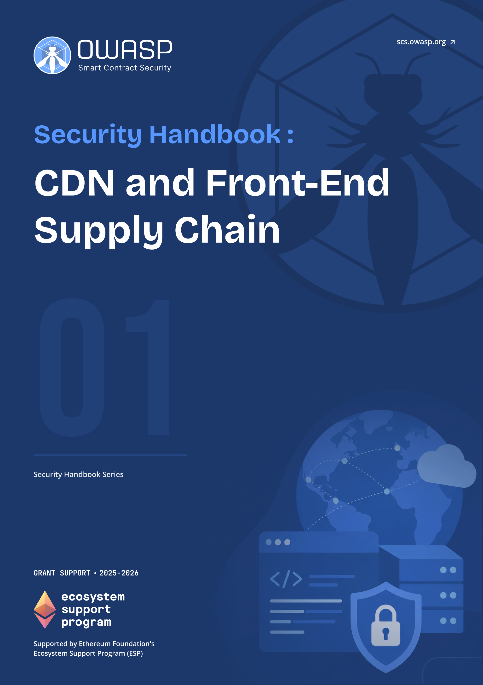

# OWASP SCS CDN and Front-End Supply Chain Security Handbook

  
  

    <a class="handbook-series-link" href="../">← All handbooks</a>
    
Handbook 01 · 75 PDF pages

    
Defend dApp delivery across CDNs, dependencies, build pipelines, third-party scripts, and browser integrity controls.

    

      <a href="../pdfs/01-frontend-cdn-supply-chain.pdf" target="_blank" rel="noopener">Open PDF</a>
      <a href="../pdfs/01-frontend-cdn-supply-chain.pdf" download>Download PDF</a>
    

  

**OWASP Smart Contract Security Project**

Part of the [OWASP SCS Handbook Series](../index.md). Built to the series [conventions](../index.md#about-the-series).

## Purpose and Scope

Threat models and defensive guidance for the **content delivery network** (**CDN**), front-end, and supply chain components of Web3 applications. The handbook is grounded in the controls that matter today: Subresource Integrity (SRI), Content Security Policy (CSP), Software Bill of Materials (SBOM), Supply-chain Levels for Software Artifacts (SLSA), and signing with Sigstore, set against real CDN and dependency compromises such as the Polyfill.io attack of June 2024, the Ledger Connect Kit incident of December 2023, and the npm and CI/CD attacks of 2024 and 2025. It covers dependency management, the build and deployment pipeline, content integrity, and third-party script and asset risk, with the regulatory context of U.S. Executive Order 14028 and the EU Cyber Resilience Act.

A dApp's smart contracts can be flawless while its users still lose funds, because the code a user actually runs is the JavaScript a CDN serves to their browser. That **front end** is the largest and least-audited **attack surface** in Web3. This handbook treats it as a first-class security boundary.

## Target Audience

Front-end and full-stack developers, DevOps and platform engineers, and security practitioners responsible for dApp front ends and their delivery infrastructure.

## How to Use This Handbook

Read Part I to fix the **threat model** and vocabulary. Parts II through IV are reference material organized by component: the **CDN** and content layer, the front-end supply chain, and per-component threat models. Part V is operational: checklists, monitoring, and incident response for a supply chain compromise. The appendices hold a glossary, reusable threat-model templates, and the consolidated bibliography. Engineers shipping a change tonight can jump to the checklists in Part V and the SRI and CSP sections in Part II.

## Relationship to SCSVS, SCSTG, and SCWE

This handbook complements the OWASP smart contract standards rather than duplicating them. The Smart Contract Security Verification Standard (SCSVS) defines what a secure system must satisfy; the front-end controls here are the delivery-layer counterpart to its integrity requirements. The Smart Contract Security Testing Guide (SCSTG) describes how to test; the pipeline and dependency tests in Parts III and V extend that testing outward to the build system. The Smart Contract Weakness Enumeration (SCWE) catalogs contract weaknesses; the front-end and supply-chain weaknesses here fill the gap the enumeration leaves at the browser and build boundary. The companion Web3 Attack Vectors Mapping Handbook (10) places these risks in the broader WA01 to WA15 taxonomy, and the **Incident Response** Handbook (06) owns the response process this handbook feeds into.

## Contents

### Part I: Foundations
- [1. Introduction to Front-End and Supply Chain Security](part1-foundations.md#1-introduction-to-front-end-and-supply-chain-security)
- [2. Threat Model Overview](part1-foundations.md#2-threat-model-overview)

### Part II: CDN and Content Delivery
- [3. CDN Security](part2-cdn-content-delivery.md#3-cdn-security)
- [4. Content and Asset Integrity](part2-cdn-content-delivery.md#4-content-and-asset-integrity)

### Part III: Front-End Supply Chain
- [5. Dependency Awareness](part3-frontend-supply-chain.md#5-dependency-awareness)
- [6. Build and Pipeline Security](part3-frontend-supply-chain.md#6-build-and-pipeline-security)
- [7. Third-Party Scripts and Widgets](part3-frontend-supply-chain.md#7-third-party-scripts-and-widgets)

### Part IV: Threat Models by Component
- [8. Threat Model: CDN](part4-threat-models-by-component.md#8-threat-model-cdn)
- [9. Threat Model: Front-End Application Stack](part4-threat-models-by-component.md#9-threat-model-front-end-application-stack)
- [10. Common Front-End Vulnerabilities (Web and Mobile)](part4-threat-models-by-component.md#10-common-front-end-vulnerabilities-web-and-mobile)
- [11. Threat Model: NPM/Package Ecosystem](part4-threat-models-by-component.md#11-threat-model-npmpackage-ecosystem)
- [12. Threat Model: Build and Deploy Pipeline](part4-threat-models-by-component.md#12-threat-model-build-and-deploy-pipeline)
- [13. Threat Model: Runtime (Browser, Mobile)](part4-threat-models-by-component.md#13-threat-model-runtime-browser-mobile)
- [14. Mobile Application Security (Web3 Front-Ends)](part4-threat-models-by-component.md#14-mobile-application-security-web3-front-ends)
- [15. Security Tools and Resources for Front-End](part4-threat-models-by-component.md#15-security-tools-and-resources-for-front-end)

### Part V: Mitigations and Operations
- [16. Checklists and Controls](part5-mitigations-and-operations.md#16-checklists-and-controls)
- [17. Monitoring and Detection](part5-mitigations-and-operations.md#17-monitoring-and-detection)
- [18. Incident Response for Supply Chain Compromise](part5-mitigations-and-operations.md#18-incident-response-for-supply-chain-compromise)

### Part VI: Appendices
- [19. Appendix A: Glossary](part6-appendices.md#19-appendix-a-glossary)
- [20. Appendix B: Supply Chain Threat Model Templates](part6-appendices.md#20-appendix-b-supply-chain-threat-model-templates)
- [21. Appendix C: References and Further Reading](references.md)
