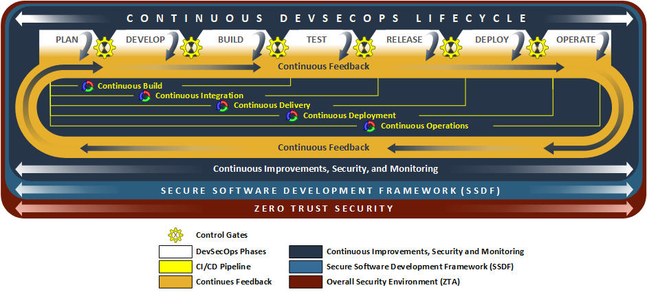
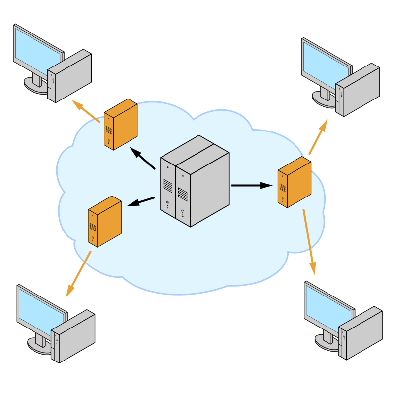

# Part I: Foundations

[Back to Handbook 01 contents](index.md) | [Series index](../index.md)

This part fixes the vocabulary and the **threat model** used throughout the handbook. It explains why the **front end** is a security boundary equal in weight to the smart contracts behind it, breaks the supply chain into four levels so that later controls have a place to attach, and maps the attack surface with STRIDE so nothing is analyzed by intuition alone.

---

## 1. Introduction to Front-End and Supply Chain Security

### 1.1 Why Front-End and CDN Matter for Web3

The security conversation in Web3 concentrates on the smart contract, because that is where the money is held. The contract, though, is not what a user interacts with. A user opens a web page, that page loads JavaScript, and that JavaScript constructs the transaction, populates the recipient and amount, and asks the wallet to sign. If any byte of that JavaScript is attacker-controlled, the signed transaction is attacker-controlled, and no amount of on-chain audit rigor prevents the loss. The **front end** is the first and last thing a user touches, and it is delivered over infrastructure the protocol team rarely owns end to end.

Two properties make this surface uniquely dangerous in Web3. First, transactions are irreversible: a drained wallet has no chargeback, so a front-end compromise converts directly and permanently into stolen funds. Second, the delivery path is long and shared. Front-end code passes through package registries, build systems, artifact stores, CDNs, and the browser before it runs, and each hop is a place where an adversary can substitute code. The [Ledger Connect Kit compromise of December 2023](https://www.ledger.com/blog/a-letter-from-ledger-chairman-ceo-pascal-gauthier-regarding-ledger-connect-kit-exploit) is the canonical example: an attacker phished a former employee's npm credentials, published a malicious version of a widely embedded connector library, and drained wallets across many dApps that had done nothing wrong in their own code. The contracts were fine. The delivery chain was not.

The **CDN** deserves special attention because it is trusted by default and rarely re-verified. A `<script src="https://cdn.example/lib.js">` tag says "run whatever this host sends, forever." When [Funnull acquired the polyfill.io domain in February 2024 and began serving malicious redirects by June](https://sansec.io/research/polyfill-supply-chain-attack), hundreds of thousands of sites that had embedded `cdn.polyfill.io` years earlier started shipping attacker code to their users without changing a single line of their own source. Trust that is granted once and never checked again is the recurring failure mode of this layer.

### 1.2 Supply Chain Levels (Code, Build, Deploy, Runtime)

To reason about defenses, split the **software supply chain** into four levels. Each level is a distinct **trust boundary** with its own adversaries, its own evidence of integrity, and its own controls. A compromise at any level flows downstream to the user unless a later level independently verifies what it received.

```mermaid
flowchart LR
    subgraph CODE[Code level]
        A1[Source repositories]
        A2[Direct and transitive dependencies]
        A3[Contributor and maintainer accounts]
    end
    subgraph BUILD[Build level]
        B1[CI/CD runners]
        B2[Build scripts and actions]
        B3[Signing keys and secrets]
    end
    subgraph DEPLOY[Deploy level]
        C1[Artifact registries]
        C2[CDN and object storage]
        C3[DNS and TLS termination]
    end
    subgraph RUNTIME[Runtime level]
        D1[Browser and mobile runtime]
        D2[Third-party scripts and widgets]
        D3[Wallet and signing surface]
    end
    CODE --> BUILD --> DEPLOY --> RUNTIME --> USER([User funds and data])
```

*Figure 1. The four supply chain levels. Integrity evidence created at one level, such as a signed provenance attestation at the build level, is only useful if a downstream level verifies it.*

*Figure. NIST's notional DevSecOps reference model puts the four-level abstraction above into an operational lifecycle. The important difference is that security and continuous monitoring cross every phase; they are not a final scan performed after an artifact is already ready to deploy. Source: [NIST NCCoE, DevSecOps Notional Reference Model](https://pages.nist.gov/nccoe-devsecops/notational-reference-model.html), public domain (U.S. government work).*

The **code level** covers everything that exists before a build runs: your first-party source, the direct and transitive dependencies you pull from npm or another registry, and the human and machine accounts that can write to any of them. Attacks here include typosquatting, **dependency confusion**, malicious maintainer takeover, and the slow social-engineering path taken by the [XZ Utils backdoor](https://blog.trailofbits.com/2025/09/24/supply-chain-attacks-are-exploiting-our-assumptions/), where an adversary contributed to an open-source project for over two years to earn the maintainer trust needed to insert a backdoor into official releases.

The **build level** is where source becomes artifact. The runner, the build scripts, the third-party build actions, and the secrets available during the build are all in scope. The [tj-actions/changed-files compromise of March 2025 (CVE-2025-30066)](https://www.cisa.gov/news-events/alerts/2025/03/18/supply-chain-compromise-third-party-tj-actionschanged-files-cve-2025-30066-and-reviewdogaction) targeted this level: a popular GitHub Action used in more than 23,000 repositories was altered so that its version tags pointed to a commit that dumped the runner's memory, spilling CI/CD secrets into workflow logs.

The **deploy level** is where the artifact is published and served: artifact registries, the CDN, object storage, and the DNS and TLS that route users to it. The Polyfill.io attack lived here. The **runtime level** is the browser or mobile app where the code finally executes, alongside every third-party script the page pulls in and the wallet-signing surface the user ultimately confirms on.

### 1.3 Relationship to SCSVS, SCSTG, and SCWE

The OWASP smart contract standards define the contract side of a Web3 system. This handbook is the delivery-side complement, and the mapping is deliberate. The [Smart Contract Security Verification Standard (SCSVS)](https://scs.owasp.org/) states verifiable requirements a system must meet; the **SRI**, **CSP**, SBOM, and provenance controls in this handbook are the front-end requirements that sit alongside it, so that "the system is secure" is not quietly narrowed to "the bytecode is secure." The [Smart Contract Security Testing Guide (SCSTG)](https://scs.owasp.org/) describes test procedures; Parts III and V here extend testing to the dependency graph and the build pipeline, which the contract-focused guide does not reach. The [Smart Contract Weakness Enumeration (SCWE)](https://scs.owasp.org/) catalogs contract weaknesses; front-end and supply-chain weaknesses are the class it does not enumerate, and this handbook fills that space. The [OWASP Web3 Attack Vectors Top 15](https://scs.owasp.org/sctop10/Web3-Attack-Vectors-Top15/) frames supply-chain attacks (WA02) and UI/UX deception (WA06) as first-tier non-contract risks, and the companion Handbook 10 maps them in full.

### 1.4 How to Use This Handbook

Read Part I once to internalize the four-level model and the STRIDE mapping. After that, treat the handbook as reference. When you are hardening the **CDN** and content layer, work from Part II; when you are securing dependencies and the build, work from Part III; when you are threat-modeling a specific component, jump to the matching chapter in Part IV. Part V is the operational core: its checklists are meant to be lifted directly into a release runbook, and its incident-response section is meant to be read before an incident, not during one. Cross-references point to the standards and to sibling handbooks so you can follow a thread outward when a topic touches DNS (02), infrastructure (07), SDKs (08), or the response process (06).

---

## 2. Threat Model Overview

### 2.1 Attack Surfaces: CDN, Front-End, Dependencies, Build

A **threat model** starts by enumerating what an adversary can reach. For a Web3 **front end**, the reachable surfaces cluster into four groups that mirror the supply chain levels but are framed as attacker entry points rather than trust boundaries.

The **CDN and content surface** is every host that serves bytes to the browser: the primary **CDN**, any secondary or fallback CDN, object storage buckets behind them, and the DNS names and TLS certificates that make those hosts trusted. An attacker who controls any of these can substitute or tamper with delivered content. Entry points include a compromised CDN account, a lapsed or hijacked domain, cache poisoning, and a mis-issued certificate.

*Figure. A generalized content distribution network, where proxy and cache servers between the origin and the end user each become a host capable of serving, and therefore substituting, delivered content. Source: [Wikimedia Commons](https://commons.wikimedia.org/wiki/File:Content_Distribution_Network_diagram.svg), CC BY-SA 4.0.*

The **front-end application surface** is the first-party code and the way it composes third-party code at runtime: inline scripts, dynamically injected scripts, `iframe` embeds, and browser storage. Cross-site scripting, DOM clobbering, and prototype pollution live here, and in a wallet context they lead directly to transaction manipulation rather than mere session theft.

The **dependency surface** is the transitive graph of packages the application pulls in. npm projects routinely resolve to thousands of transitive packages, any one of which can be typosquatted, confused with an internal name, or taken over by a compromised maintainer. The **build surface** is the CI/CD system, the third-party actions it invokes, the secrets it holds, and the artifact stores it writes to. These last two are the surfaces an attacker prefers, because a single successful compromise there is amplified across every user of every downstream project.

### 2.2 Threat Actors and Objectives

Not every adversary wants the same thing, and the control set should reflect who you are defending against. Four actor profiles cover most real incidents in this space.

| Actor | Capability and access | Primary objective | Representative incident |
|-------|----------------------|-------------------|-------------------------|
| Financially motivated criminal | Buys or phishes registry, CDN, or domain credentials; runs typosquat and dependency-confusion campaigns at scale | Drain wallets, harvest keys and seed phrases | Ledger Connect Kit (Dec 2023); Polyfill.io (Jun 2024) |
| Nation-state actor | Patient social engineering, long-horizon maintainer takeover, custom malware, targeted CI/CD intrusion | Espionage, sabotage, revenue generation under sanctions | XZ Utils backdoor (2024); DPRK campaigns against exchange staff |
| Malicious or negligent insider | Legitimate access to source, build, or deploy that outlives their role | Theft, sabotage, or accidental exposure | Former-employee credential reuse in Connect Kit |
| Opportunistic automated scanner | Mass scanning for exposed secrets, unpinned actions, mutable tags | Widen access, sell or reuse harvested credentials | Automated exploitation following tj-actions disclosure |

The objective column matters for prioritization. A financially motivated actor needs only one weak hop to monetize, so the marginal value of hardening the weakest link is high. A nation-state actor invests in the build and maintainer levels, which is where **provenance** and signing pay off. An insider defeats perimeter controls, so revocation timeliness and **least privilege** (covered in the Employee Lifecycle Handbook, 03) are the relevant defenses.

### 2.3 STRIDE and Scenario Mapping

STRIDE gives the model discipline: for each surface, ask which of the six threat categories applies and what the concrete scenario is. Working the matrix prevents the common failure of hardening the surface you already worry about while ignoring an adjacent category.

| STRIDE category | Front-end and supply-chain scenario | Primary control |
|-----------------|-------------------------------------|-----------------|
| **S**poofing | Attacker serves malicious JS from a look-alike or hijacked CDN host or domain | SRI, domain and registrar lock, DNSSEC (Handbook 02) |
| **T**ampering | Delivered script, dependency, or build artifact is modified in transit or at rest | SRI, SBOM, signed provenance (SLSA), reproducible builds |
| **R**epudiation | No record of who published which artifact, so a malicious release cannot be attributed | Signed commits and releases, Sigstore transparency log (Rekor) |
| **I**nformation disclosure | CI secrets, API keys, or private RSA keys leak from a build runner | Secret scanning, least-privilege tokens, pinned actions |
| **D**enial of service | CDN, RPC, or dependency registry is made unavailable, breaking the dApp | Multi-CDN, provider redundancy, offline fallbacks (Handbook 07) |
| **E**levation of privilege | Third-party script or dependency gains the same execution rights as first-party code | CSP with `strict-dynamic`, sandboxing, dependency review |

A worked scenario ties the categories together. Consider a dApp that embeds an analytics script from a third-party **CDN**. Spoofing risk: the analytics domain expires and is re-registered by an attacker. Tampering risk: the analytics vendor is breached and ships modified JS. Elevation risk: because the script runs in the page's origin, it can read the DOM of the swap form and rewrite the recipient address before signing. The controls that cut every branch are **SRI** on the script tag (pins the exact bytes), a CSP that denies the third party the ability to load further scripts, and a design that never renders untrusted content into the signing path. Later parts turn each of these into concrete configuration.

The reusable STRIDE and threat-model templates in [Appendix B](part6-appendices.md#20-appendix-b-supply-chain-threat-model-templates) let you run this same analysis against your own architecture.

