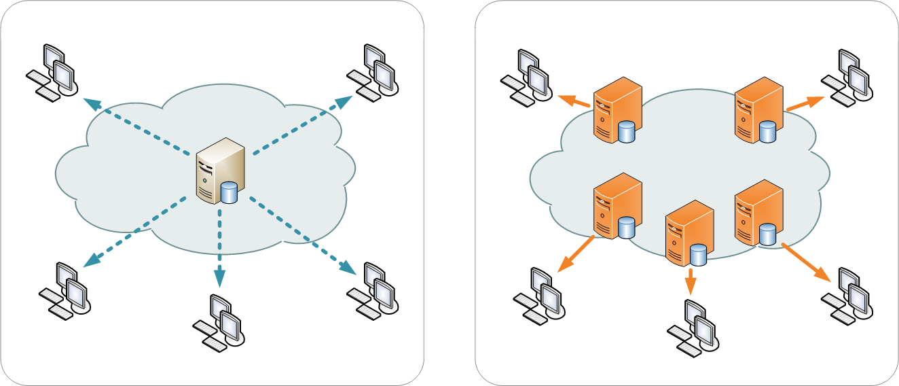
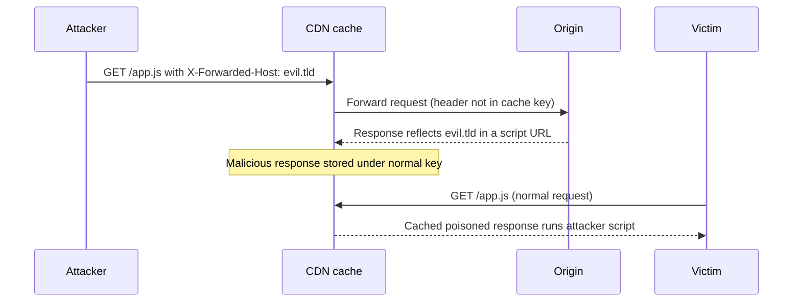
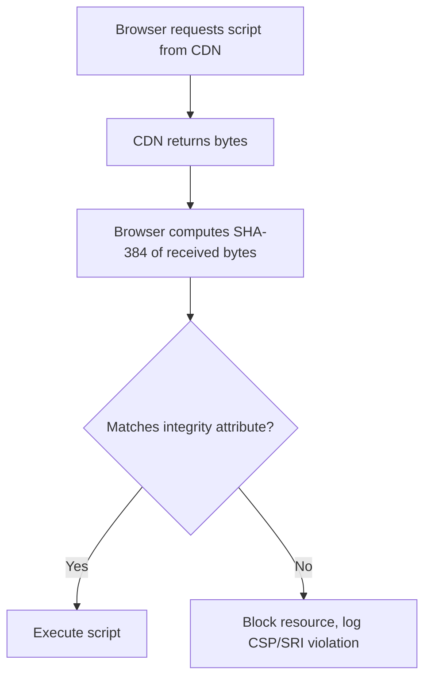
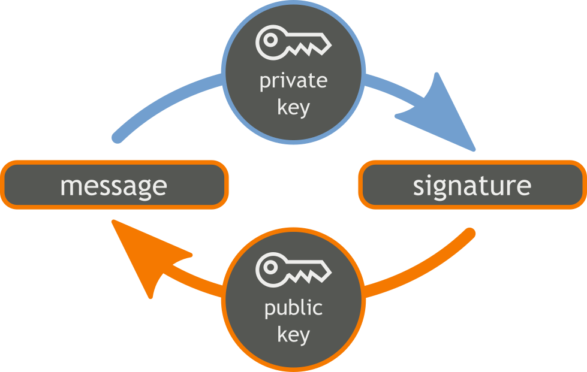
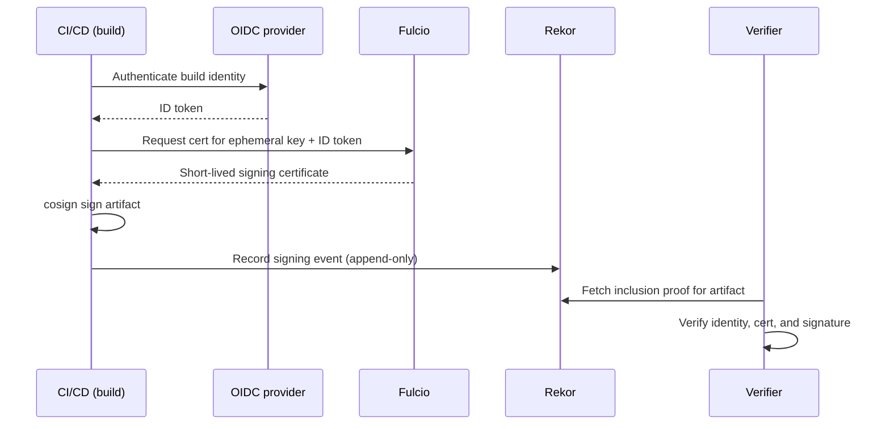

# Part II: CDN and Content Delivery

[Back to Handbook 01 contents](index.md) | [Series index](../index.md)

The content delivery layer is where a Web3 **front end** meets infrastructure the team usually does not own. This part covers how to choose and trust a **CDN**, how to guarantee that the bytes a user receives are the bytes you published, and how the two canonical failures of this layer, CDN compromise and cache poisoning, actually work. The centerpiece is Subresource Integrity, the one control that turns "trust the CDN forever" into "trust the CDN only as long as it serves the exact hash I pinned."

---

## 3. CDN Security

A **content delivery network** caches copies of your static assets at edge locations near users and answers their requests from the nearest edge. That is a performance and availability win, and it is also a delegation of trust: for the duration of the cache, the **CDN**, not your origin, decides what bytes a user runs.


*Figure 2. A CDN routes each user to a nearby edge node that serves a cached copy of the origin's content. Every edge, and the control plane behind it, is part of the front end's trust boundary. Source: [Wikimedia Commons, CC BY-SA 3.0](https://commons.wikimedia.org/wiki/File:NCDN_-_CDN.png).*

### 3.1 CDN Provider Selection and Trust

Selecting a **CDN** is a trust decision, not only a latency benchmark. The provider can read and rewrite everything it serves, so its account security, its insider controls, and its history of handling compromises are part of your security posture. Evaluate providers on concrete, checkable criteria: whether the account supports hardware-backed multi-factor authentication and enforces it for every operator, whether API tokens can be scoped and short-lived, whether configuration changes are logged immutably and exportable to your own monitoring, and whether the provider publishes post-incident reports when it fails. A provider that cannot answer how a stolen operator token would be detected is telling you the answer is "it would not be."

Trust is also a function of **blast radius**. A CDN that also terminates your TLS holds your **private key** material or a delegated certificate, which raises the stakes of an account compromise. A CDN that only serves already-signed, integrity-pinned assets holds far less power over your users. Prefer architectures where the CDN's authority is bounded by controls you enforce independently, so that a provider breach degrades gracefully rather than becoming a full front-end takeover.

### 3.2 Content Integrity (SRI, Signing, Pinning)

Content integrity means a user can prove that delivered content matches what you published, without trusting the delivery path. Three mechanisms provide it at different layers. **Subresource Integrity** (covered in depth in Chapter 4) lets the browser reject a script or stylesheet whose hash does not match a value you embedded in your HTML. Cryptographic signing (**Sigstore** and Cosign, Section 4.3) lets a verifier confirm that an artifact was produced by a known identity and recorded in a public log. Pinning, in this context, means committing to exact versions and exact hashes rather than mutable references such as `latest` or a floating major version.

The controls compose. **SRI** protects the last hop to the browser but says nothing about who built the file; signing proves **provenance** but is not enforced by the browser at load time; pinning ensures the thing you signed and the thing you reference are the same thing. A front end that uses all three closes the gap that any one leaves open.

### 3.3 Cache Poisoning and Manipulation

A **CDN** cache is a shared store keyed by some subset of each request, called the cache key. If an attacker can influence a part of the response that is not part of the key, that is an *unkeyed input*, they can store a malicious response under a key that innocent users will hit. This is web **cache poisoning**, mapped in detail by [James Kettle's PortSwigger research](https://portswigger.net/research/practical-web-cache-poisoning). Headers such as `X-Forwarded-Host`, `X-Original-URL`, and `X-Rewrite-URL` frequently influence a response while being excluded from the cache key, so a single crafted request can poison the cached page for everyone who follows.



*Figure 3. Web cache poisoning through an unkeyed header. The attacker pollutes the shared cache once; every subsequent victim receives the tampered asset.*

The defenses are structural. Normalize or strip request headers that the origin does not intend to honor, so they cannot reflect into responses. Include any header that legitimately varies the response in the cache key (the `Vary` mechanism, though note that some CDNs handle it inconsistently). Avoid reflecting request-controlled values into cacheable responses at all. Discovery tooling such as Kettle's Param Miner finds unkeyed inputs before an attacker does. Crucially, **SRI** is a backstop here as well: a poisoned script that does not match its pinned hash is rejected by the browser regardless of how it entered the cache.

### 3.4 TLS and Origin Protection

TLS protects content in transit between the edge and the user, and separately between the **CDN** and your origin. Both legs matter. Terminate TLS with modern protocol versions (TLS 1.3 preferred, TLS 1.2 minimum), disable legacy ciphers, and enable HTTP Strict Transport Security (HSTS) so browsers refuse to downgrade to plaintext. Protect the origin from direct access that bypasses the CDN: if an attacker can reach your origin IP directly, CDN-layer protections and WAF rules are moot. Enforce origin access with authenticated pull (the CDN presents a secret or client certificate the origin requires), IP allowlisting of CDN egress ranges, or mutual TLS. Bind certificates with Certificate Authority Authorization (CAA) records so that only your chosen CAs can issue for your domain, a control that ties into the DNS hardening covered in the DNS and Hosting Handbook (02).

### 3.5 Geographic and Availability Considerations

A **CDN** is also an availability control, and availability is a security property when a dApp's **front end** is the only path to user funds. Distribute across regions so that a regional outage does not take the application offline, and understand the failure behavior when the CDN itself is unavailable. Two design choices recur throughout this handbook: consolidation on a single provider lowers the attack surface but concentrates outage and compromise risk, while diversification across multiple providers adds resilience at the cost of a larger surface and harder integrity guarantees (multi-CDN means multiple accounts, multiple configs, and multiple places to pin hashes). The Infrastructure Security Handbook (07) treats this single-versus-multi-provider tradeoff as a first-class decision. For most teams, a primary CDN with an independently controlled static fallback (for example, an IPFS-pinned copy referenced by an integrity hash) balances the two.

---

## 4. Content and Asset Integrity

Integrity is the property that the code running in a user's browser is exactly the code you intended to ship. This chapter makes that property concrete, then works a real failure where it was absent.

### 4.1 Subresource Integrity (SRI) (OWASP, MDN)

**Subresource Integrity** is a browser feature that lets you pin the cryptographic hash of an external script or stylesheet in your HTML. Before executing the resource, the browser hashes the fetched bytes and compares them to your pinned value; on mismatch, it refuses to run the resource. This converts an unconditional "trust this **CDN**" into a conditional "trust this CDN only while it serves these exact bytes." The [MDN Subresource Integrity reference](https://developer.mozilla.org/en-US/docs/Web/Security/Subresource_Integrity) and the [OWASP guidance](https://cheatsheetseries.owasp.org/) define the mechanism.

#### 4.1.1 SRI Hashes (SHA-256/384/512) and integrity Attribute

You express the pin with the `integrity` attribute, whose value is a hash algorithm prefix followed by the base64-encoded digest of the resource. **SRI** supports SHA-256, SHA-384, and SHA-512. Pair it with `crossorigin="anonymous"` so the CORS-enabled fetch provides the response bytes the browser needs to validate.

```html
<script
  src="https://cdn.example.com/wallet-connect.v3.2.1.js"
  integrity="sha384-oqVuAfXRKap7fdgcCY5uykM6+R9GqQ8K/uxy9rx7HNQlGYl1kPzQho1wx4JwY8wC"
  crossorigin="anonymous"></script>
```

Generate the hash from the exact file you intend to ship:

```bash
# Produce the integrity value for a released asset
cat wallet-connect.v3.2.1.js | openssl dgst -sha384 -binary | openssl base64 -A
# Prefix the output with "sha384-" to form the integrity attribute value
```

You may supply multiple hashes separated by spaces; the browser accepts the resource if it matches any, and prefers the strongest algorithm present. Use this to roll hashes during a planned content change without a flash of broken loads.



*Figure 4. SRI verification at load time. A tampered or substituted file fails the hash check and never executes.*

#### 4.1.2 Protection Against CDN Compromise and In-Transit Tampering

**SRI** directly defeats two important failure modes at this layer. If the CDN is compromised and serves a modified `wallet-connect.js`, the modified bytes do not match the pinned hash and the browser blocks them. If a network position between the edge and the user tampers with the response, the same check fails. This is exactly the class of attack that hit Polyfill.io and Ledger Connect Kit, and in both cases an SRI pin on the embedding pages would have converted a silent wallet-drain into a visible, blocked resource. SRI is therefore one of the highest-leverage controls in this handbook, but it does **not** eliminate trust in the first-party document or deployment control plane: an attacker who can rewrite the embedding HTML can replace the script URL and its integrity metadata together. Protect the HTML, deployment credentials, and release authorization with the provenance and dual-control measures in Parts 3 and 5.

#### 4.1.3 Limitations: Version Pinning and Hash Updates; Not for Inline Scripts or Dynamic Content

**SRI** is not free of sharp edges. It pins a specific version: any legitimate update to the file changes its hash, so a **CDN** that silently updates a floating version will break every page that pinned the old hash. This is a feature (it forces you to acknowledge changes) but it means SRI only works with immutable, versioned URLs, never with `latest`. SRI does not cover inline scripts or content generated at runtime, and it does not apply to resources loaded by an already-running script unless that script implements its own checks. It also cannot validate content that legitimately varies per request. The practical rule: serve third-party code from immutable, versioned URLs, pin each with SRI, and use CSP (Section 4.5) to constrain everything SRI cannot reach.

### 4.2 Case Study: Polyfill.io and CDN Supply Chain Compromise

Polyfill.io is the reference incident for this entire handbook. Polyfill.io was a widely embedded service that delivered browser "polyfill" scripts, and site operators referenced it with a plain `<script src="https://cdn.polyfill.io/...">` tag, no integrity pin. In February 2024, a company named Funnull acquired the domain and its associated GitHub account. For months the service behaved normally, then in June 2024 it began serving malicious code that redirected mobile users to scam and malware destinations, injected conditionally to evade detection ([Sansec disclosure, 25 June 2024](https://sansec.io/research/polyfill-supply-chain-attack)).

The scale was large and the timeline instructive:

| Date | Event |
|------|-------|
| Feb 2024 | Funnull acquires the polyfill.io domain and GitHub account |
| Jun 25, 2024 | [Sansec](https://sansec.io/research/polyfill-supply-chain-attack) discloses active malicious injection |
| Jun 25-27, 2024 | [Cloudflare and Fastly stand up safe mirrors](https://blog.qualys.com/vulnerabilities-threat-research/2024/06/28/polyfill-io-supply-chain-attack); Google warns advertisers |
| Jun 27, 2024 | Namecheap suspends the malicious domain |
| Jul 2, 2024 | [Censys](https://censys.com/blog/july-2-polyfill-io-supply-chain-attack-digging-into-the-web-of-compromised-domains/) counts 384,773 hosts still embedding the script |

Reported impact ranged from the widely quoted 100,000-plus sites up to figures above 490,000, with Cloudflare implementing real-time rewrites of `cdn.polyfill.io` to a safe version to protect users of sites that had not yet updated. The lessons are precisely the controls in this part: an **SRI** pin would have blocked the malicious bytes; not embedding a mutable third-party **CDN** reference at all would have removed the dependency; and continuous inventory of third-party script origins (Section 7.3 and Part V monitoring) would have surfaced the stale, now-hostile dependency long before it fired.

### 4.3 Signed Releases and Verification (Sigstore, Cosign)

**SRI** proves the browser got the bytes you pinned; signing proves who produced those bytes and when. [Sigstore](https://docs.sigstore.dev/cosign/signing/overview/) provides signing that does not require a team to manage long-lived private keys. With keyless signing, the signer authenticates through OpenID Connect, the Fulcio certificate authority issues a short-lived certificate (on the order of ten minutes) binding an ephemeral key to that identity, Cosign signs the artifact, and the Rekor transparency log records an immutable, publicly auditable entry of the event ([OpenSSF overview](https://openssf.org/blog/2024/02/16/scaling-up-supply-chain-security-implementing-sigstore-for-seamless-container-image-signing/)).


*Figure. The underlying primitive Sigstore automates: a private key signs the artifact, and anyone holding the corresponding public key (here, delivered through a short-lived Fulcio certificate rather than a long-lived one) can verify the signature without ever holding the signing secret. Source: [Wikimedia Commons](https://commons.wikimedia.org/wiki/File:Orange_blue_digital_signature_en.svg), CC0.*



*Figure 5. Sigstore keyless signing and verification. The ephemeral key is discarded after signing; trust rests on the identity in the certificate and the public Rekor entry.*

For a **front end**, sign build artifacts (the bundled JS, the **SBOM**, container images) in CI, publish the signatures, and verify them at the deploy step before anything reaches the CDN. Because Rekor is public and append-only, an artifact owner can monitor the log for their own identity and detect any signing event they did not initiate, which turns silent key misuse into a detectable event.

### 4.4 Immutability and Versioning

Every integrity control in this part assumes immutable, versioned artifacts. If a URL's content can change under a fixed name, **SRI** hashes drift, signatures detach from what they signed, and rollback is ambiguous. Adopt content-addressed or strictly versioned URLs (`app.v3.2.1.js`, or a hash-named `app.<digest>.js`), configure long-lived immutable cache headers for them (`Cache-Control: public, max-age=31536000, immutable`), and never reuse a version identifier for changed content. Publish a new version and update the reference and its SRI hash together in the same reviewed change. Immutability also simplifies **incident response**: rolling back is redeploying an earlier, still-valid artifact, not racing a mutable pointer.

### 4.5 Content Security Policy (CSP) as Complement

**CSP** is the enforcement layer for everything **SRI** and signing do not cover. A Content Security Policy tells the browser which sources may load scripts, styles, images, and connections, and can require integrity on scripts. Modern practice, per [CSP Level 3](https://www.w3.org/TR/CSP3/) and [web.dev's strict CSP guidance](https://web.dev/articles/strict-csp), is a nonce-based or hash-based policy with `strict-dynamic`, rather than a brittle allowlist of hostnames. A per-response nonce marks the scripts you trust; `strict-dynamic` propagates that trust to scripts they load, so you avoid maintaining a fragile domain allowlist while still blocking attacker-injected scripts that lack the nonce.

```http
Content-Security-Policy:
  script-src 'nonce-r4nd0m' 'strict-dynamic';
  object-src 'none';
  base-uri 'none';
  require-trusted-types-for 'script';
```

CSP and SRI are complementary: SRI pins the content of the scripts you explicitly reference, while CSP governs what may load at all and contains the damage of any injection, including inline-script XSS that SRI cannot see. The `require-trusted-types-for 'script'` directive further hardens the DOM against injection sinks, which matters acutely on a page whose scripts build financial transactions. Report violations to a monitored endpoint (Part V) so that a blocked resource becomes an alert, not a silent user-facing breakage.

---

**Key controls for Part II**

- Pin every third-party script and style with SRI (SHA-384 or SHA-512) served from immutable, versioned URLs.
- Deploy a nonce-based CSP with `strict-dynamic`, `object-src 'none'`, and Trusted Types; report violations.
- Protect the origin from direct access; enforce TLS 1.3 and CAA.
- Sign build artifacts with **Sigstore** and verify signatures before publishing to the **CDN**.
- Strip or normalize unkeyed request headers to prevent **cache poisoning**.

