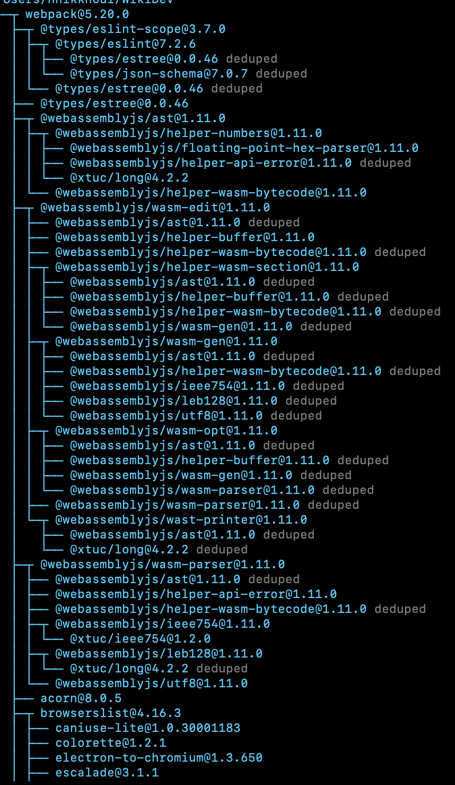
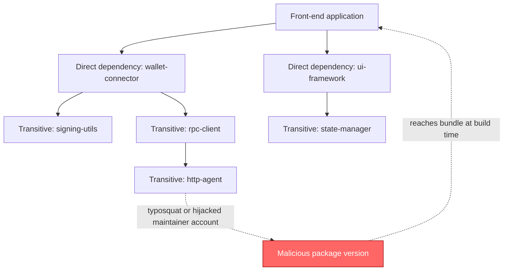
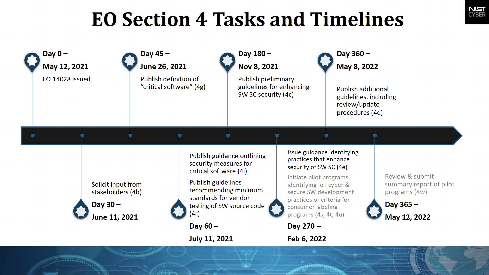
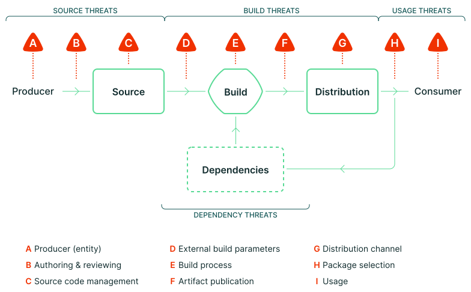
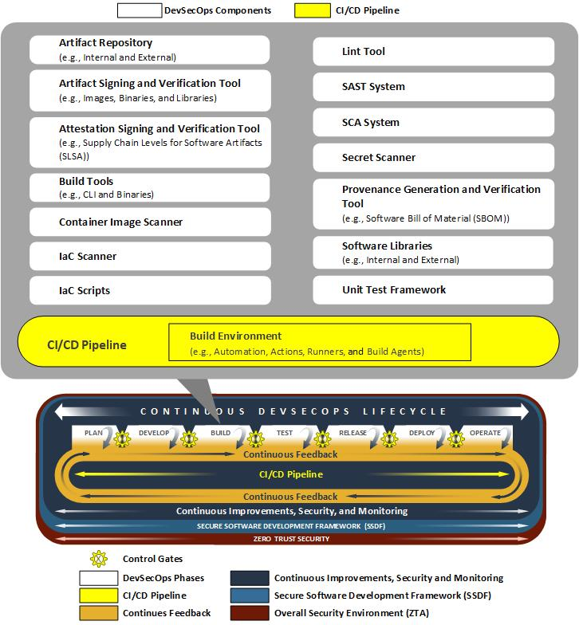
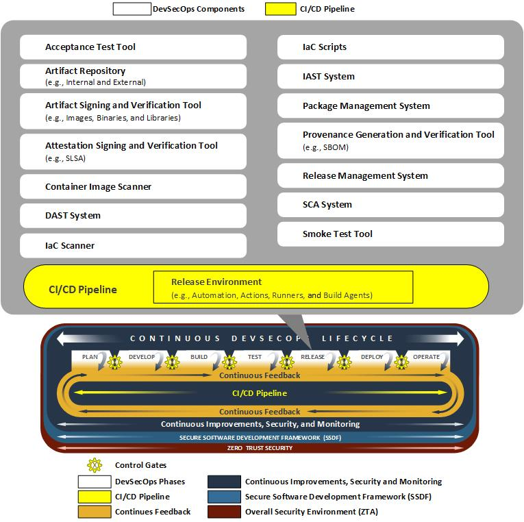
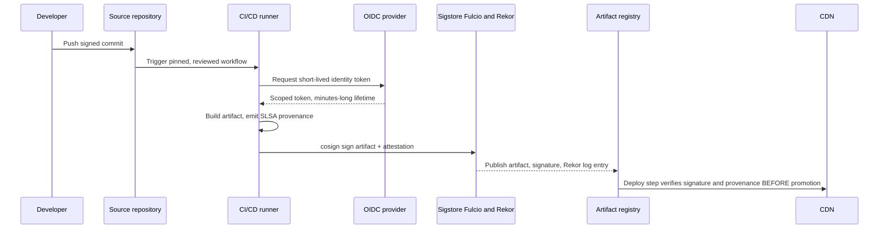
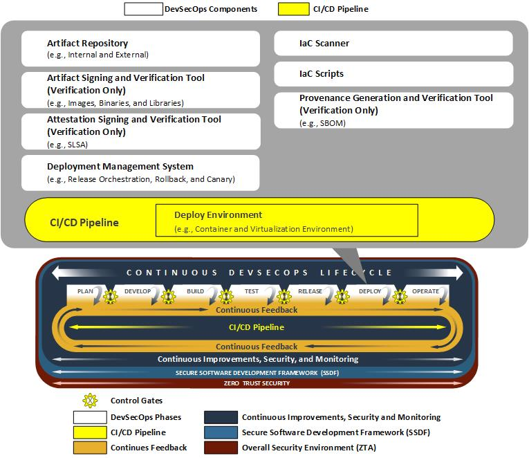
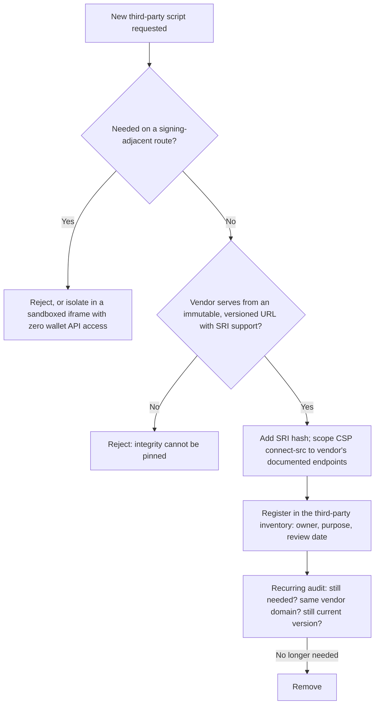

# Part III: Front-End Supply Chain

[Back to Handbook 01 contents](index.md) | [Series index](../index.md)

This part moves from the delivery edge to the supply chain that produces what gets delivered: the **dependency graph** a **front end** pulls in, the build pipeline that turns source into artifact, and the third-party scripts a page still has to trust at runtime. A modern Web3 front end resolves a dependency tree running into the thousands of transitive packages, and the September 2025 compromise of `chalk`, `debug`, and sixteen other packages downloaded a combined 2.6 billion times a week showed exactly how far one hijacked maintainer account reaches ([Aikido Security](https://www.aikido.dev/blog/npm-debug-and-chalk-packages-compromised)). The chapters that follow build a bill of materials for that graph, harden the pipeline that turns it into a shipped artifact, and set rules for the third-party code a page cannot avoid loading.

---

## 5. Dependency Awareness

A **front end** is mostly other people's code. This chapter treats the **dependency graph** as a first-class attack surface: something to inventory, score, patch on a schedule, and prove the provenance of, rather than something installed once and forgotten.

### 5.1 Direct and Transitive Dependencies

A direct dependency is a package your `package.json` names explicitly, such as a wallet-connection library or a UI framework. A transitive dependency is everything that package requires to run, and the ones those packages require in turn. A typical Web3 dApp with a handful of direct dependencies routinely resolves to several thousand transitive packages once a wallet SDK, a UI framework, and a build toolchain are all accounted for, because each pulls in its own tree. `npm ls --all` or `npm list --all` prints the full resolved tree; most teams have never run it end to end.

```
$ npm ls --all | wc -l
4128
$ npm ls --all 2>/dev/null | grep -c 'deduped'
612
```


*Figure. A real `npm ls`-style dependency tree for a single package, webpack, expanded to its transitive dependencies. Each line is a package whose maintainer you have implicitly trusted the moment it resolved into the tree. Source: [Wikimedia Commons](https://commons.wikimedia.org/wiki/File:NPMDependencyTree.png), CC BY-SA 4.0.*

The security consequence is that your trust decision is not "do I trust this library's authors," it is "do I trust every maintainer of every package in this tree, transitively, forever." You audited none of them. The [Ledger Connect Kit incident](part1-foundations.md#11-why-front-end-and-cdn-matter-for-web3) covered in Part I is a direct dependency compromise; the [XZ Utils backdoor](https://blog.trailofbits.com/2025/09/24/supply-chain-attacks-are-exploiting-our-assumptions/) is a transitive one that took over two years of patient **social engineering** to land. Depth in the tree does not correlate with safety: a package four levels down that nobody on the team has heard of runs with the exact same privileges in your build and, if it reaches the bundle, in your users' browsers.



*Figure 6. A malicious update three hops down the transitive graph reaches the application with the same authority as a first-party module.*

### 5.2 SBOM (CycloneDX, SPDX 3.0) and VEX

A Software Bill of Materials (**SBOM**) is a formal, machine-readable inventory of every component in a piece of software, its version, and its known relationships to other components. Without one, "what are we running" is a question only answerable by re-resolving the dependency tree at the moment of the incident, which is too late. Two formats dominate: [CycloneDX](https://cyclonedx.org/specification/overview/), an OWASP project ratified as ECMA-424 in June 2024 (1st edition) with version 1.6 adding Cryptographic Bill of Materials support and CycloneDX Attestations, and [SPDX 3.0](https://spdx.github.io/spdx-spec/v3.0.1/), published by the Linux Foundation in April 2024 as a ground-up model overhaul with dedicated AI and data profiles, building on the earlier ISO/IEC 5962:2021 standardization of SPDX 2.x ([Linux Foundation](https://www.linuxfoundation.org/press/spdx-3-revolutionizes-software-management-in-systems-with-enhanced-functionality-and-streamlined-use-cases)).

```bash
# Generate a CycloneDX SBOM from a Node.js project
npx @cyclonedx/cyclonedx-npm --output-file bom.json
```

```json
{
  "bomFormat": "CycloneDX",
  "specVersion": "1.6",
  "components": [
    {
      "type": "library",
      "name": "wallet-connector",
      "version": "3.2.1",
      "purl": "pkg:npm/wallet-connector@3.2.1"
    }
  ]
}
```

An SBOM alone tells you what is present, not what matters. Vulnerability Exploitability eXchange (VEX) closes that gap: it is a companion statement, standardized by [CISA's minimum-elements guidance](https://www.cisa.gov/resources-tools/resources/minimum-requirements-vulnerability-exploitability-exchange-vex), asserting whether a known vulnerability in a listed component is actually reachable and exploitable in your specific build (`affected`, `not_affected`, `fixed`, `under_investigation`). A CVE in a transitive logging library that your build never invokes at the vulnerable code path is `not_affected`; publishing that VEX statement lets downstream consumers and your own triage queue stop re-flagging it every scan. Regulation gives SBOM production a deadline as well as a best practice: U.S. [Executive Order 14028](https://www.ntia.gov/report/2021/minimum-elements-software-bill-materials-sbom) requires SBOMs for software sold to federal agencies, and the EU [Cyber Resilience Act](https://openssf.org/blog/2025/10/22/sboms-in-the-era-of-the-cra-toward-a-unified-and-actionable-framework/) will require manufacturers of products with digital elements sold in the EU to maintain a machine-readable SBOM from December 2027.


*Figure. NIST's own published task-and-timeline chart for Executive Order 14028 Section 4, the software supply chain security mandate that made federal SBOM submission a compliance deadline rather than a voluntary best practice. Source: [NIST](https://www.nist.gov/itl/executive-order-14028-improving-nations-cybersecurity/software-supply-chain-security-guidance), public domain (U.S. government work).*

### 5.3 Vulnerability Scanning and Real-Time Monitoring

A point-in-time scan tells you what was vulnerable when you ran it; a dependency added a known-bad version last month and never revisited stays invisible until someone scans again. Treat scanning as a continuous pipeline stage, not a pre-release checklist item. [OSV-Scanner](https://github.com/google/osv-scanner), Google's Apache-2.0 CLI, queries the aggregated [OSV.dev](https://osv.dev/) database (30-plus upstream sources including GitHub Security Advisories and npm audit data) against your lockfile and, as of v2.0, offers guided remediation and container-layer attribution ([Google Security Blog](https://blog.google/security/announcing-osv-scanner-v2-vulnerability/)).

```bash
osv-scanner --lockfile=package-lock.json
npm audit --audit-level=high
```

Point-in-time scanning must be paired with real-time monitoring that reacts the moment a new advisory publishes against a dependency already in your tree, regardless of when you last ran a scan. GitHub Dependabot alerts and Renovate both watch the GitHub Advisory Database and OSV.dev continuously and can open an automated pull request the same day a CVE lands; commercial tools such as Snyk and Socket.dev add behavioral detection (a package's new version suddenly adding a `postinstall` network call, for instance) that pure CVE matching misses entirely, which matters because the `chalk`/`debug` and Shai-Hulud campaigns of 2025 shipped malicious code with no CVE assigned for days ([CISA Alert AA25-266A](https://www.cisa.gov/news-events/alerts/2025/09/23/widespread-supply-chain-compromise-impacting-npm-ecosystem)). Route every alert to the on-call channel that also owns the **incident response** process (Handbook 06) so a Critical dependency alert gets the same urgency as a production page.

### 5.4 License and Maintenance Health

Two properties beyond "is it vulnerable" determine whether a dependency is safe to keep: its license and its maintenance health. License risk is legal risk that can force a rewrite under deadline pressure if it goes unnoticed until a release audit. Maintenance health is a leading indicator of security risk: an unmaintained package accumulates unpatched vulnerabilities and is a far easier maintainer-account takeover target than one with an active team and enabled two-factor authentication.

| Signal | Low risk | Investigate | High risk |
|--------|----------|--------------|-----------|
| License | MIT, Apache-2.0, BSD (permissive) | LGPL, MPL (weak copyleft, review linking) | GPL/AGPL in a proprietary bundle, or no declared license |
| Last release | Under 6 months | 6-18 months | Over 18 months, or archived repository |
| Maintainer count | 3+ active | 1-2 active | Single maintainer, no succession plan |
| [OpenSSF Scorecard](https://github.com/ossf/scorecard) | 7-10 | 4-6 | 0-3, or unscored |
| Open critical issues | Triaged, low count | Growing backlog | Long-standing unaddressed reports |

Scorecard runs 18 automated checks (branch protection, signed releases, dangerous workflow patterns, and a `Maintained` heuristic among them) and publishes a 0-10 score per project, with weekly runs across roughly a million critical open-source projects logged to a public BigQuery dataset ([OpenSSF](https://openssf.org/blog/2024/04/17/beyond-scores-with-openssf-scorecard-granular-structured-results-for-custom-policy-enforcement/)). Tools such as FOSSA, ScanCode Toolkit, and ClearlyDefined automate license detection across a full tree; run one in CI rather than trusting a `package.json` license field, which is frequently wrong or absent.

### 5.5 Dependency Update and Patching Policy

Awareness without a policy just produces a longer list of things nobody acts on. A patching policy converts scan output into a committed SLA (service level agreement) by severity, and it should live in the same repository as the code it governs so it is versioned and enforceable in review.

| Severity (CVSS) | Action window | Mechanism |
|------------------|---------------|-----------|
| Critical (9.0-10.0) | Patch or mitigate within 24 hours | Emergency PR, bypass normal release cadence |
| High (7.0-8.9) | Patch within 7 days | Automated Dependabot/Renovate PR, expedited review |
| Medium (4.0-6.9) | Patch within 30 days | Batched into next scheduled dependency sweep |
| Low (0.1-3.9) | Patch at next minor release | Standard dependency bump cycle |

Weight the window with exploit-prediction signal, not CVSS alone: EPSS (Exploit Prediction Scoring System) scores a CVE's probability of near-term exploitation, and a Medium-severity finding with a high EPSS score deserves the Critical lane. Automate the mechanical part: Dependabot or Renovate opens the PR, CI runs the full test suite and a fresh **SBOM** diff, and a human reviews only the diff and the changelog rather than re-deriving the update from scratch. Pin exact versions in the lockfile (never a floating range in the manifest that CI resolves fresh each run) so an update is always a reviewed, atomic, revertible commit, never a surprise picked up silently on the next `npm install`.

### 5.6 SLSA and Provenance for Build Artifacts

An **SBOM** says what is in an artifact. **Provenance** says how that artifact came to exist: which source commit, which build system, which build steps, run by which identity. [SLSA](https://slsa.dev/spec/v1.2/) (Supply-chain Levels for Software Artifacts), an OpenSSF-incubated framework that reached v1.0 in April 2023 and has since added a source track alongside its original build track in v1.2, defines four levels of build integrity assurance:


*Figure. SLSA's threat model locates nine distinct compromise points across the producer-to-consumer path. It makes the key operational point visually: signing the final package does not address source tampering, a compromised build, a poisoned distribution channel, or unsafe dependency selection. Source: [SLSA v1.2, Threats and mitigations](https://slsa.dev/spec/v1.2/threats), Community Specification License 1.0.*

| Level | Requirement | Forging cost |
|-------|-------------|-------------|
| L0 | No provenance | Trivial |
| L1 | Provenance exists, describing build platform and process | Unsigned; trivial to forge |
| L2 | Provenance signed by a hosted build platform | Requires an explicit attack, not a config mistake |
| L3 | Build platform is hardened and isolated; builds cannot access each other's state or the signing key | Requires compromising the build platform itself |

([SLSA v1.2 Build requirements](https://slsa.dev/spec/v1.2/build-requirements); [SLSA v1.2 Source requirements](https://slsa.dev/spec/v1.2/source-requirements).) Hosted CI and OIDC-backed provenance make L2 or L3 feasible, but using a hosted runner does not itself confer a level. The selected builder must have a documented **SLSA** platform assessment and the consuming policy must verify its identity, provenance subject, source, and expected workflow. npm CLI 11.5.1 and later can emit provenance attestations for trusted-published packages ([npm docs](https://docs.npmjs.com/trusted-publishers/)); Chapter 6 covers generating and verifying these attestations end to end. Assess the Source Track separately, because high build assurance does not stop an authorized maintainer from merging malicious source unilaterally.

---

## 6. Build and Pipeline Security

Everything Chapter 5 inventories still has to pass through a build. The pipeline that compiles, bundles, and publishes your **front end** holds more concentrated power than almost any other system you operate: a single injected line in a build script reaches every user on the next deploy, no dependency compromise required.

### 6.1 Build Reproducibility


*Figure. NIST's build-phase model makes the build boundary explicit: source, dependencies, configuration, and toolchain enter a controlled build service, while artifacts, metadata, logs, and integrity evidence leave it. Reproducibility is meaningful only when those inputs are pinned and the output evidence is retained. Source: [NIST NCCoE, Build Phase](https://pages.nist.gov/nccoe-devsecops/notational-reference-model.html#build-phase), public domain (U.S. government work).*

A build is reproducible when, given the same source, the same build environment, and the same instructions, any party can independently produce a bit-for-bit identical artifact ([Reproducible Builds project](https://reproducible-builds.org/docs/definition/); the effort originated inside Debian in 2013 and by 2017 had made over 90% of Debian's archive reproducible, [Debian Wiki](https://wiki.debian.org/ReproducibleBuilds/About)). Reproducibility is what makes **provenance** verifiable rather than merely asserted: **SLSA** provenance says "this is what the build platform claims it did," and reproducibility lets a third party rebuild from the same source and confirm the claim independently, closing the trust gap a compromised or misconfigured build platform would otherwise leave open.

Common sources of non-determinism defeat this quietly: embedded build timestamps, non-deterministic file iteration order when bundling, absolute file-system paths baked into source maps, and floating compiler or bundler versions resolved fresh on every run. Pin your toolchain (exact Node.js version, exact bundler version, a committed lockfile), strip or normalize timestamps, and sort file lists before bundling. Verify with `diff` after two independent builds, or with [`diffoscope`](https://diffoscope.org/) for a structured, recursive diff when the outputs are not text:

```bash
# Build twice in isolated environments, then diff
diffoscope build-a/app.bundle.js build-b/app.bundle.js
```

A clean `diffoscope` output between two builds run a week apart, on different machines, is strong independent evidence that no build-time tampering occurred between them.

### 6.2 Secrets and Credentials in Build

The build runner is, by necessity, one of the most privileged systems in the pipeline: it holds the credentials to publish packages, deploy to the **CDN**, and often to read source across the whole organization. The [tj-actions/changed-files compromise (CVE-2025-30066)](part1-foundations.md#12-supply-chain-levels-code-build-deploy-runtime) covered in Part I dumped runner memory into public workflow logs specifically to harvest whatever secrets were resident at build time, across more than 23,000 repositories ([CISA](https://www.cisa.gov/news-events/alerts/2025/03/18/supply-chain-compromise-third-party-tj-actionschanged-files-cve-2025-30066-and-reviewdogaction)). Long-lived static credentials sitting in CI secret stores are exactly what that class of attack is built to steal.

The structural fix is to stop having long-lived secrets to steal. OpenID Connect (OIDC) issues a short-lived, workflow-scoped token at build time that expires in minutes and cannot be replayed outside the run that requested it; npm's trusted-publishing feature, generally available since July 2025, lets a package accept publishes only from a named GitHub Actions or GitLab CI/CD workflow via OIDC, eliminating the static `NPM_TOKEN` entirely ([GitHub Changelog](https://github.blog/changelog/2025-07-31-npm-trusted-publishing-with-oidc-is-generally-available/)).

| Credential type | Lifetime | Exfiltration value | Replay outside the run |
|------------------|----------|--------------------|--------------------------|
| Static npm/PyPI token in CI secret | Indefinite until rotated | High: full publish rights | Yes |
| Long-lived cloud IAM key | Indefinite until rotated | High: full account scope | Yes |
| OIDC-issued short-lived token | Minutes | Low: expires before most attackers can act | No |

Where static secrets remain unavoidable, scope them to **least privilege**, run `gitleaks` or `trufflehog` in CI to catch anything committed by accident, and never let install scripts run unaudited: `npm install --ignore-scripts` blocks the postinstall hook class of attack that turned a compromised Axios-adjacent package into a remote-access-trojan dropper, at the cost of breaking legitimate build-time hooks like `node-gyp` or `sharp`, which is why teams move to an explicit allowlist rather than a blanket flag ([nodejs-security.com](https://www.nodejs-security.com/blog/npm-ignore-scripts-best-practices-as-security-mitigation-for-malicious-packages)).

### 6.3 Artifact Signing and Verification


*Figure. NIST's release phase separates producing an artifact from authorizing it for use. Signature verification, provenance policy, and an immutable promotion decision belong at this gate; copying an unsigned build output directly to production collapses the build and release trust boundaries. Source: [NIST NCCoE, Release Phase](https://pages.nist.gov/nccoe-devsecops/notational-reference-model.html#release-phase), public domain (U.S. government work).*

Part II, Section 4.3 introduced **Sigstore** keyless signing for published assets; here it closes the loop from source to deploy. Every artifact your build produces, the bundled JavaScript, the **SBOM** itself, and the SLSA provenance attestation, should be signed in CI before it ever reaches an artifact registry, and every one of those signatures should be checked again immediately before promotion to the CDN. This turns "the deploy step trusts the build step" into "the deploy step verifies the build step," which is the difference between a compromised runner silently shipping to users and a compromised runner getting caught at the gate.



*Figure 7. Build-to-deploy signing and verification. A break in the chain anywhere upstream of the deploy gate is caught there, not discovered by a user.*

```bash
# Verify a signed artifact and its SLSA provenance before promoting it
cosign verify-attestation --type slsaprovenance \
  --certificate-identity-regexp "https://github.com/org/repo/.*" \
  --certificate-oidc-issuer https://token.actions.githubusercontent.com \
  app.bundle.js
```

The [`slsa-verifier`](https://github.com/slsa-framework/slsa-verifier) tool wraps this check specifically for SLSA-formatted **provenance** and is the reference implementation to script into a deploy gate as a hard failure, not a warning.

### 6.4 CI/CD Hardening


*Figure. NIST's deploy-phase model shows why deployment automation needs its own identity and policy boundary. The deployer should accept only an authorized release, record exactly what reached each environment, and expose no general-purpose path from a compromised build runner into production. Source: [NIST NCCoE, Deploy Phase](https://pages.nist.gov/nccoe-devsecops/notational-reference-model.html#deploy-phase), public domain (U.S. government work).*

Everything above assumes the pipeline itself has not already been widened into an easy target. Harden it as its own system, not as an afterthought to the code it builds.

| Control | Why it matters |
|---------|-----------------|
| Pin every third-party action to a full commit SHA, never a mutable tag | Tags are re-pointable by the action's maintainer or a compromised maintainer account; a SHA is immutable ([GitHub Secure Use](https://docs.github.com/en/actions/reference/security/secure-use)) |
| Set `permissions:` to least privilege at the workflow and job level | Default `GITHUB_TOKEN` scope is broader than most jobs need; an injected step inherits whatever scope you grant |
| Avoid `pull_request_target` with checkout of untrusted head refs | Runs with write-scoped secrets against attacker-controlled code from a fork |
| Require reviewed status checks and branch protection on the default branch | Prevents a single compromised or careless push from reaching the build directly |
| Use ephemeral, single-job runners over persistent self-hosted runners for untrusted workloads | A persistent runner accumulates state and secrets across jobs that a single compromised job can then read |
| Enable org-level policy to block unpinned or unapproved actions | GitHub Actions policy has supported blocking and enforcing SHA pinning at the organization level since August 2025 ([GitHub Changelog](https://github.blog/changelog/2025-08-15-github-actions-policy-now-supports-blocking-and-sha-pinning-actions/)) |
| Run a dependency-review or OSV-Scanner action on every PR | Catches a newly introduced vulnerable or malicious dependency before merge, not after |

```yaml
# .github/workflows/build.yml (excerpt)
permissions:
  contents: read
  id-token: write   # OIDC only; no static publish token in scope
jobs:
  build:
    runs-on: ubuntu-latest
    steps:
      - uses: actions/checkout@de0fac2e4500dabe0009e67214ff5f5447ce83dd # v6.0.2
      - run: npm ci --ignore-scripts
      - run: npm run build
```

Treat the workflow file with the same review rigor as production code: it is production code, and it runs with more ambient authority than most of what it builds.

---

## 7. Third-Party Scripts and Widgets

The pipeline can be flawless and the page still loads code you did not build. Analytics, chat widgets, A/B testing, error monitoring, and ad tags are near-universal on production front ends, and every one of them is a script that executes with the same DOM access and origin privileges as your own code.

### 7.1 Risks of Inline and External Scripts

Any script that runs in your page's origin can read and rewrite the DOM, including the swap form, the recipient field, and the "confirm" button a user is about to click through to their wallet. It does not need a vulnerability in your code to do this; it needs only to be present. This is the same elevation-of-privilege path the [threat model in Part I, Section 2.3](part1-foundations.md#23-stride-and-scenario-mapping) walks through: a third-party script's compromise is not contained to "their" functionality, it is a compromise of your entire page.

The [British Airways breach of 2018](https://www.theregister.com/2020/10/16/british_airways_ico_fine_20m/) is the canonical non-Web3 case: attackers modified a third-party JavaScript library (a fork of Modernizr) loaded on the payment page, which silently skimmed card data from roughly 500,000 customers over two weeks before detection. The UK Information Commissioner's Office initially proposed a fine of £183.39 million and settled at £20 million in October 2020, one of the largest data-protection penalties issued under GDPR to that point. Nothing about British Airways' own code was defective; the third-party script it trusted was.

Inline scripts (code written directly into the HTML rather than fetched from a `src` URL) are structurally worse from an integrity standpoint: **SRI**, covered in Part II Section 4.1, cannot pin an inline block at all, and the only defense available is a **CSP** nonce or hash that changes every response. Categorize every script your page loads by what it can reach: an analytics snippet on a marketing page is low stakes, the same snippet loaded on the transaction-signing page is not, regardless of how reputable the vendor is.

### 7.2 CSP and Permissions

Part II Section 4.5 introduced a nonce-based **Content Security Policy** (**CSP**) with `strict-dynamic` as the baseline. Applied specifically to third-party scripts, two directives matter most: `script-src` (or the nonce plus `strict-dynamic` propagation) controls what may execute at all, and `connect-src` controls where a script that does execute may send data, which is the directive that actually stops a compromised analytics tag from exfiltrating a signed transaction payload to an attacker's collection endpoint.

```http
Content-Security-Policy:
  script-src 'nonce-r4nd0m' 'strict-dynamic';
  connect-src 'self' https://analytics.trusted-vendor.example;
  frame-src https://chat-widget.trusted-vendor.example;
  object-src 'none';

Permissions-Policy:
  clipboard-write=(self),
  usb=(),
  serial=(),
  hid=()
```

The `Permissions-Policy` header (successor to the older Feature-Policy) is CSP's complement for browser capabilities rather than resource loading: it can deny a third-party iframe access to the clipboard, USB, serial, and HID APIs that **hardware wallet** browser extensions rely on, so an embedded widget cannot silently intercept a WebHID or WebUSB signing flow it has no legitimate reason to touch. Scope both headers per route where practical: the marketing site can afford a looser `connect-src` than the page that renders a signing prompt.

### 7.3 Auditing and Minimizing Third-Party Use

The most reliable third-party script is the one you removed. Every vendor script is a standing grant of code execution that a security review has to re-justify, not a one-time integration decision. Build and maintain a live inventory: script origin, purpose, owner, last review date, and whether it loads on any signing-adjacent route.

| Vendor tier | Examples | Placement rule |
|-------------|----------|-----------------|
| Tier 1: touches signing flow or wallet APIs | Wallet connector SDKs, transaction simulators | First-party review of source, pinned version, SRI mandatory, no floating CDN reference |
| Tier 2: same-origin, no signing adjacency | Analytics, error monitoring, feature flags | SRI where the vendor supports it, `connect-src` restricted to the vendor's documented endpoints |
| Tier 3: cosmetic or marketing only | Chat widgets, ad tags, A/B test snippets | Sandboxed iframe with `allow` attributes minimized, never on transaction-signing routes |

Tag managers deserve specific scrutiny: a tool like Google Tag Manager (GTM) is itself a supply-chain multiplier, because it lets non-engineering stakeholders push arbitrary new scripts to production outside code review, which is exactly the mechanism Magecart-family skimmers have repeatedly abused to reach payment pages without touching the target's own repository. If GTM or an equivalent is in use on any route that leads toward a wallet interaction, require the same review gate for tag changes that a code change would get.



*Figure 8. Onboarding gate for a new third-party script. The default answer is no; every "yes" becomes a tracked, re-auditable liability.*

Set a recurring cadence, quarterly is reasonable for most teams, to re-run this audit against every script already in production, not only new requests. Vendors get acquired, domains lapse and get re-registered, and a script that was safe at onboarding time does not stay safe by default; the [Part I observation](part1-foundations.md#11-why-front-end-and-cdn-matter-for-web3) that trust granted once and never rechecked is the recurring failure mode applies with equal force to a third-party script tag as it does to a **CDN** host.

---

**Key controls for Part III**

- Generate a CycloneDX or SPDX **SBOM** on every build and pair it with VEX statements so vulnerability triage reflects actual reachability, not raw CVE counts.
- Run continuous vulnerability monitoring (Dependabot, Renovate, OSV-Scanner) rather than point-in-time scans, and enforce a written patch SLA by severity.
- Target **SLSA** Build Level 3 by using hosted runners with OIDC-issued **provenance** and short-lived credentials in place of static publish tokens.
- Sign every build artifact and its provenance attestation, and make verification a hard gate before CDN promotion, not a warning.
- Pin every CI/CD action to a commit SHA, scope `GITHUB_TOKEN` permissions to the minimum a job needs, and block unpinned actions at the organization level.
- Inventory every third-party script by vendor tier, keep signing-adjacent routes free of Tier 2 and Tier 3 scripts entirely, and re-audit the inventory on a fixed schedule.

