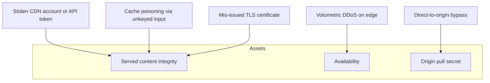
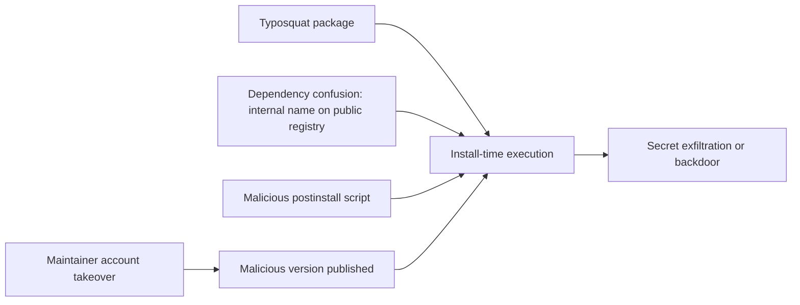

# Part IV: Threat Models by Component

[Back to Handbook 01 contents](index.md) | [Series index](../index.md)

Parts II and III gave controls. This part gives structured threat models for each component of the delivery stack, so a team can reason about its own architecture rather than apply controls by rote. Each model names the assets, the trust boundaries, the adversary's likely moves in STRIDE terms, and the controls that cut each branch. The chapter on common front-end vulnerabilities and the closing tools chapter turn the models into things you can test and buy.

---

## 8. Threat Model: CDN

The **CDN** is the closest untrusted party to the user. Its assets, from a defender's view, are the integrity of served content, the confidentiality of any origin secrets it holds, and its availability. The **trust boundary** is the CDN control plane (accounts, API tokens, edge configuration) plus the edge-to-user and edge-to-origin transport.

*Figure 1. CDN threat model. Most paths to loss of content integrity route through the control plane or the cache, which is why account hardening and SRI dominate the control set.*

| Asset | STRIDE | Threat | Control |
|-------|--------|--------|---------|
| Content integrity | Tampering, Spoofing | Attacker with CDN account substitutes served JS | SRI pins on embedding pages; immutable versioned assets; hardware MFA on the account |
| Content integrity | Tampering | Cache poisoning via unkeyed header | Normalize request headers; key on `Vary`; SRI as backstop |
| Content integrity | Spoofing | Mis-issued certificate for your host | CAA records; Certificate Transparency monitoring |
| Availability | Denial of service | Volumetric or application-layer DDoS | Anycast scrubbing, rate limits, multi-CDN or static fallback |
| Origin secret | Information disclosure | Attacker reaches origin directly, bypassing edge | Authenticated origin pull, IP allowlist, mutual TLS |

The residual risk after these controls is a full CDN control-plane compromise that also strips your **SRI**, which is only possible if the attacker also controls the HTML your origin serves. That is why the origin and the CDN should never share a single credential or **blast radius**.

## 9. Threat Model: Front-End Application Stack

The front-end application is your first-party code plus the way it composes third-party code at runtime. The asset is the integrity of the transaction the user ultimately signs. The dominant threat is any injection that lets attacker-controlled script run in your origin, because such script can read and rewrite the DOM of a signing form.

The trust boundaries inside the application are easy to miss. A component that renders a token name, an ENS record, or an NFT metadata field is trusting data that an attacker may control. A `dangerouslySetInnerHTML`, an unsanitized template, or a vulnerable dependency that pollutes `Object.prototype` all cross the boundary between untrusted data and executable behavior. Model each rendering path as a question: if this value were attacker-chosen, what could it do to the signing flow?

The controls are layered. A nonce-based **CSP** with `strict-dynamic` (Part II) denies injected scripts the ability to execute. Trusted Types close the DOM injection sinks. Output encoding and a hardened templating layer prevent the injection in the first place. Critically, the design should isolate the signing path: the code that constructs the recipient, amount, and calldata should not render untrusted content, and the wallet request should be built from validated, typed values rather than from strings assembled near user-controlled DOM.

## 10. Common Front-End Vulnerabilities (Web and Mobile)

The web weaknesses that matter most in Web3 are the ones that reach the signing surface. This chapter enumerates them defensively so they can be tested for.

**Cross-site scripting (XSS)** remains the highest-impact web weakness here. Reflected and stored XSS let an attacker run script in your origin; DOM-based XSS does the same through client-side sinks. In a wallet context the payoff is not a stolen cookie, it is a rewritten transaction. Defenses are the OWASP [XSS prevention](https://cheatsheetseries.owasp.org/cheatsheets/Cross_Site_Scripting_Prevention_Cheat_Sheet.html) staples: context-aware output encoding, a strict **CSP**, and Trusted Types.

**Prototype pollution** lets an attacker set properties on `Object.prototype` through a crafted key path, changing the behavior of code that later reads those properties. In a bundler-heavy **front end** it can escalate to XSS or logic bypass. Freeze critical objects, validate keys, and prefer `Map` over plain-object dictionaries for untrusted keys.

**Clickjacking and UI redress** frame your dApp inside a hostile page to trick users into approving actions. Defend with `frame-ancestors 'none'` in CSP and `X-Frame-Options`.

**Open redirects and postMessage abuse** matter because wallets and connectors communicate across frames. Validate every `postMessage` origin against an allowlist and never trust `event.data` shape without checking it.

| Weakness | Web3-specific impact | Primary control |
|----------|---------------------|-----------------|
| XSS (reflected, stored, DOM) | Transaction rewrite before signing | Encoding, strict CSP, Trusted Types |
| Prototype pollution | Logic bypass, escalation to XSS | Key validation, frozen objects |
| Clickjacking | Coerced approval | `frame-ancestors 'none'` |
| postMessage abuse | Malicious connector messages | Origin allowlist, schema checks |
| Insecure storage of session or keys | Theft of session or, worse, key material | Never store secrets in `localStorage`; use platform keystores |

On mobile, the same weaknesses appear inside WebViews, plus platform issues covered in Chapter 14.

## 11. Threat Model: NPM/Package Ecosystem

The package ecosystem is the attacker's preferred entry because one compromised package reaches every downstream project. The assets are the integrity of installed code and the confidentiality of any secrets present at install time. The **trust boundary** is every direct and transitive dependency and every maintainer account behind them.

*Figure 2. Package ecosystem threat model. The recurring pattern is code execution at install time, which is why lockfiles, `--ignore-scripts`, and provenance verification are the anchor controls.*

*Figure. Typosquatting works the same way whether the misspelled target is a domain in a browser address bar or a package name in an install command: a small, plausible spelling variation is enough to redirect a trusting user or a trusting build to the attacker's resource instead of the intended one. Source: [Wikimedia Commons](https://commons.wikimedia.org/wiki/File:Typosquatting_(Firefox_74).svg), CC0.*

The named cases make the model concrete. The [Ledger Connect Kit compromise](https://www.ledger.com/blog/a-letter-from-ledger-chairman-ceo-pascal-gauthier-regarding-ledger-connect-kit-exploit) was a maintainer-account takeover via a phished former employee. **Dependency confusion** exploits a resolver that prefers a public package over your intended internal one when names collide. The controls: pin exact versions with a committed lockfile, scope internal packages and configure the registry to prevent public override, disable install scripts by default (`npm install --ignore-scripts` and audited allowlists), verify **provenance** where publishers provide it, and review the dependency delta on every update rather than trusting the version bump. Part III covers the SBOM and SLSA mechanics that make this auditable.

## 12. Threat Model: Build and Deploy Pipeline

The pipeline turns source into the artifact users run, and it usually holds the most powerful secrets in the organization. The asset is the integrity of the produced artifact and the confidentiality of signing keys and deployment credentials. The **trust boundary** is the CI runner, every third-party build action, and the artifact and deploy targets.

The [tj-actions/changed-files compromise of March 2025 (CVE-2025-30066)](https://www.cisa.gov/news-events/alerts/2025/03/18/supply-chain-compromise-third-party-tj-actionschanged-files-cve-2025-30066-and-reviewdogaction) is the reference incident: a popular GitHub Action had its version tags repointed to a commit that dumped the runner's memory, spilling CI secrets into logs across more than 23,000 repositories. The model's lesson is that a mutable reference to third-party build code is a standing compromise waiting to happen.

| Asset | STRIDE | Threat | Control |
|-------|--------|--------|---------|
| Artifact integrity | Tampering | Compromised third-party action injects code | Pin actions to a full commit SHA, never a tag; review action source |
| Signing keys | Information disclosure | Secret dumped from runner memory or logs | Least-privilege, short-lived OIDC tokens; no long-lived secrets in CI; log scanning |
| Artifact integrity | Repudiation | No record of who built what | Signed provenance (SLSA), Sigstore transparency log |
| Deploy target | Elevation of privilege | CI token over-scoped to production | Separate build and deploy identities; environment protection rules |

Pin third-party actions to an immutable commit SHA, isolate runs so one cannot influence another, keep signing material out of user-defined build steps (the **SLSA** Level 3 requirement), and generate **signed provenance** so a downstream verifier can reject an artifact that did not come from your pipeline.

## 13. Threat Model: Runtime (Browser, Mobile)

At runtime the code finally executes in an environment you do not control: the user's browser or mobile app, alongside extensions, other tabs, and any third-party script the page loaded. The asset is the integrity of the transaction and the confidentiality of any in-memory secrets. The threats are malicious or vulnerable browser extensions that can read and modify page content, other-origin scripts that escape their intended sandbox, and a compromised wallet or connector.

Defenses acknowledge that the runtime is hostile by default. Minimize the third-party scripts that run in your origin (Chapter 7), use **CSP** and Trusted Types to contain what does run, and treat the wallet's own confirmation screen as the last line of defense: design flows so the user verifies the critical transaction details on a trusted surface, ideally a **hardware wallet** screen, rather than trusting the web page's rendering. The UX Security Handbook (09) covers the signing surface in depth.

## 14. Mobile Application Security (Web3 Front-Ends)

Mobile Web3 front ends are either native apps embedding a WebView or fully native apps calling the same contracts. Both inherit the web weaknesses inside any WebView and add platform-specific concerns: insecure local storage of session tokens or key material, weak certificate validation that enables interception, deep-link and intent hijacking that can spoof in-app flows, and reverse-engineering of shipped binaries. Align testing with the [OWASP Mobile Application Security (MASVS/MASTG)](https://mas.owasp.org/) project. The anchor controls: store secrets only in the platform keystore (iOS Keychain, Android Keystore), pin or strictly validate TLS, validate deep-link parameters as untrusted input, and harden the WebView (disable unnecessary JavaScript bridges, load only your own origin). The SDK Security Handbook (08) covers mobile SDK testing.

## 15. Security Tools and Resources for Front-End

Tools operationalize the models above. Group them by the level they defend.

| Level | Purpose | Representative tooling |
|-------|---------|------------------------|
| Code | Dependency and SCA scanning | npm audit, OWASP Dependency-Check, OSV-Scanner, Socket |
| Code | SBOM generation | CycloneDX generators, Syft |
| Build | Provenance and signing | SLSA generators, Sigstore Cosign |
| Build | Secret scanning | Gitleaks, TruffleHog, native CI secret scanning |
| Deploy | Header and CSP validation | Mozilla Observatory, CSP Evaluator |
| Runtime | Client-side monitoring | CSP violation reporting, script inventory and integrity monitoring |
| Runtime | Certificate monitoring | Certificate Transparency log monitors |

Adopt tools where they enforce a control from the models, not for coverage theater. A dependency scanner is only useful with a policy that fails the build on a disallowed finding, and **CSP** reporting is only useful when a violation raises an alert that a human triages. Part V turns these into a monitoring and response program.

---

**Key controls for Part IV**

- Threat-model each component against STRIDE; do not apply controls by intuition.
- Treat any path that renders untrusted data near the signing flow as a first-tier risk.
- Pin third-party build actions to commit SHAs and keep signing material out of build steps.
- Assume the runtime is hostile; verify critical transaction details on a trusted surface.
- Adopt tools only where they enforce a specific control, with a policy that acts on findings.

