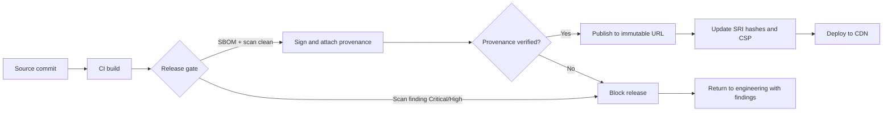
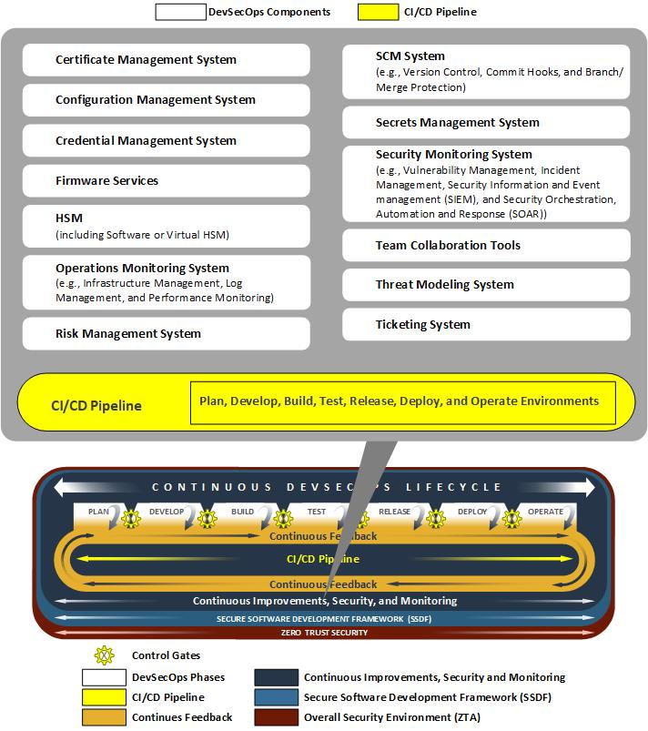
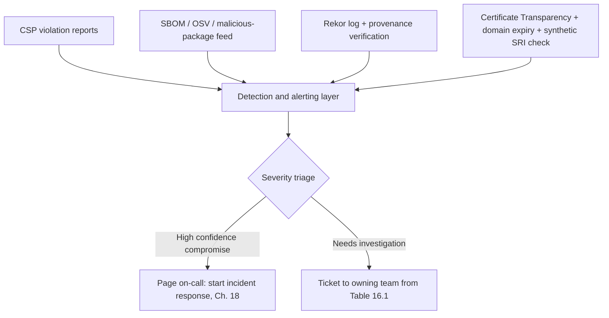
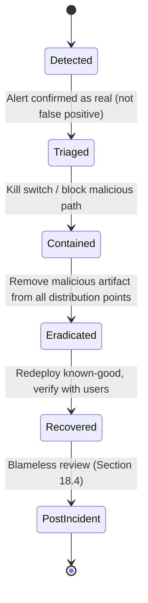

# Part V: Mitigations and Operations

[Back to Handbook 01 contents](index.md) | [Series index](../index.md)

Every control described in Parts II through IV only pays off if it is run consistently, watched continuously, and rehearsed before it is needed. This part turns that theory into operating practice: a checklist a release engineer can lift directly into a runbook, a monitoring layer that converts a silent compromise into a page, and an **incident response** plan written to be read before an incident rather than during one. Treat it as the closing loop of the handbook, prevention feeds monitoring, monitoring feeds response, and every response feeds a new line back into the checklist.

---

## 16. Checklists and Controls

A checklist is only as good as its coverage across the supply chain. This chapter compiles the individual controls from Parts II through IV into artifacts meant for direct use: a control baseline mapped to the four supply chain levels, a release gate, a cadence table for the controls that must recur, and a maturity model for judging how far along a team actually is.

### 16.1 Control Baseline by Supply Chain Level

Part I introduced four supply chain levels: code, build, deploy, and runtime. Every control this handbook has described attaches to exactly one of them, and a security program with a gap at any level is only as strong as that gap, no amount of hardening at the deploy level compensates for an unsigned, unverified build. The table below is the consolidated baseline: read it as the minimum bar, not the ceiling.

| Level | Baseline control | Verification method | Typical owner |
|-------|------------------|---------------------|----------------|
| Code | Branch protection, signed commits, dependency review on every PR | CI check, required review | Application engineering |
| Code | SBOM generated for direct and transitive dependencies ([Part III, §5.2](part3-frontend-supply-chain.md)) | SBOM diff against previous release | Release engineering |
| Build | Pinned actions/runners, no floating tags, secrets scoped and short-lived ([Part III, §6.2-6.4](part3-frontend-supply-chain.md)) | CI/CD configuration audit | DevOps / platform |
| Build | Artifacts signed with SLSA provenance ([Part III, §5.6](part3-frontend-supply-chain.md)) | `slsa-verifier` or `cosign verify` at deploy gate | Security engineering |
| Deploy | Third-party scripts and styles pinned with SRI, served from immutable URLs ([Part II, §4.1, §4.4](part2-cdn-content-delivery.md)) | Automated SRI hash audit | Front-end team |
| Deploy | CDN and registry accounts on hardware MFA, scoped tokens ([Part II, §3.1](part2-cdn-content-delivery.md)) | Quarterly access review | Platform lead |
| Runtime | CSP with `strict-dynamic`, Trusted Types, violation reporting ([Part II, §4.5](part2-cdn-content-delivery.md)) | Report-only rollout, then enforced | Front-end / AppSec |
| Runtime | Third-party script inventory reviewed and minimized ([Part III, §7](part3-frontend-supply-chain.md)) | Quarterly inventory audit | Front-end + security |

Mapping controls this way also gives **incident response** (Chapter 18) a fast triage question: given the entry point of a compromise, which level failed, and which row in this table should have caught it? A gap found during a postmortem should always resolve to adding or fixing a specific row, not a vague instruction to "be more careful."

### 16.2 Release Gate Checklist

The release gate is the single point where every prior control is enforced mechanically before an artifact reaches users. Treat a failed checklist item as a hard stop, not a note for later, a release that ships with a known gap is a release that has already accepted the corresponding risk without a decision-maker signing off on it.

**Front-End Release Gate Checklist**


- [ ] **SBOM** generated for this build (CycloneDX or SPDX) and diffed against the previous release
- [ ] All new or changed dependencies passed vulnerability and malicious-package scanning
      (OSV-Scanner / Socket / Phylum) with zero unresolved Critical or High findings
- [ ] Build artifact signed (**Sigstore**/Cosign) with **SLSA** provenance attached
- [ ] **Provenance** verified against the expected source repository and commit SHA before publish
- [ ] **SRI** hashes recomputed for every third-party and first-party script and stylesheet reference
- [ ] **CSP** reviewed for new script-src/connect-src origins; no wildcard or unsafe-inline regressions
- [ ] Artifact published under an immutable, versioned URL (no overwrite of an existing version)
- [ ] CI/CD secrets used in this pipeline are scoped to this pipeline and rotated since last release
- [ ] Rollback target identified: previous known-good version, its hash, and its deploy command
- [ ] Release note drafted for the public status/transparency channel



*Figure 6. The release gate as a hard stop. Every branch that reaches Deploy has passed scanning, signing, and provenance verification; every failure returns to engineering rather than reaching the CDN.*

### 16.3 Recurring Operational Controls and Cadence

Some controls are one-time gates; others decay if left unattended. A signing key that is never rotated, an access grant that outlives the employee who requested it, and an **SRI** hash that nobody re-audits after a silent **CDN** migration are all controls that were correct on day one and wrong by day two hundred. Assign each recurring control an explicit cadence and an owner, not an implicit "someone will notice."

| Control | Frequency | Trigger | Owner |
|---------|-----------|---------|-------|
| Dependency vulnerability and malware scan | Continuous (every PR) plus daily scheduled | New advisory published | Application engineering |
| SBOM regeneration and diff | Every release | Build completion | Release engineering |
| CDN, registry, and DNS account access review | Quarterly | Calendar | Platform / DevOps lead |
| Signing key and CI token rotation | Every 90 days, or immediately on role change | Calendar or personnel change | Security engineering |
| SRI hash audit for drift or staleness | Monthly | Calendar | Front-end team |
| Domain and TLS certificate expiry check | Weekly | Calendar | Platform / DevOps |
| Third-party script inventory review | Quarterly | Calendar | Front-end + security |
| Incident response tabletop exercise | Semiannual | Calendar | Security engineering |

The employee lifecycle events in this table (role change, offboarding) are the responsibility of the process described in the Employee Lifecycle Security Handbook (03); this table exists to make sure the front-end and supply-chain credentials are explicitly in scope of that process, not an afterthought discovered during an audit.

### 16.4 Control Maturity Self-Assessment

Not every organization needs, or can immediately afford, the most mature version of every control. This self-assessment borrows the four-bucket structure of NIST's Secure Software Development Framework ([SP 800-218](https://csrc.nist.gov/projects/ssdf), Prepare the Organization, Protect the Software, Produce Well-Secured Software, Respond to Vulnerabilities) to give a team an honest read on where it stands and what the next investment should be, rather than treating maturity as all-or-nothing.

| Practice area | Ad hoc | Managed | Optimized |
|---------------|--------|---------|-----------|
| Dependency management | Manual install, no scanning | CI-gated scan, SBOM per release | Continuous SBOM diffing, malicious-package feed blocks publish automatically |
| Build integrity | Unsigned artifacts | Signed artifacts with provenance generated | Provenance verified at every deploy gate; non-conformant builds rejected automatically |
| Content integrity | Third-party scripts embedded raw | SRI on known third parties | SRI plus enforced CSP with `strict-dynamic`; hash rotation automated in CI |
| Monitoring | Uptime checks only | CSP violation reports collected | Correlated telemetry across CSP, SBOM, transparency logs, and certificate transparency feeding one on-call rotation |
| Incident response | No documented plan | Documented playbook, untested | Playbook tested via tabletop or game day; mean time to detect (MTTD) and mean time to respond (MTTR) tracked and improving |

A team should be able to place an honest mark in every row. The value of the exercise is not the score, it is the fact that "Ad hoc" in even one row is a concrete, fundable backlog item rather than a vague sense that things could be better.

---

## 17. Monitoring and Detection


*Figure. NIST's continuous-improvement loop is the operating model for this chapter: runtime findings, dependency drift, build evidence, and delivery anomalies must become tracked changes to requirements and controls. Telemetry that never changes a policy or backlog item is observation, not improvement. Source: [NIST NCCoE, Continuous Monitoring and Improvement](https://pages.nist.gov/nccoe-devsecops/notational-reference-model.html#continuous-monitoring-and-improvement), public domain (U.S. government work).*

Every control in Chapter 16 can fail silently unless something is watching for the failure. This chapter builds the monitoring layer across the four signal sources that matter most for a Web3 **front end**: what the browser itself reports, what the **dependency graph** is doing, whether builds and releases remain provenance-clean, and whether the CDN, DNS, and certificates a user trusts are still the ones you issued.

### 17.1 Client-Side Signal: CSP Reporting and Real User Monitoring

The **Content Security Policy** from [Part II, §4.5](part2-cdn-content-delivery.md) is not only a blocking control, it is a sensor. Every blocked script, style, or connection is a violation report the browser can send you, and a spike in violations for a resource that has never violated the policy before is often the first available signal of an injected script or a compromised third party, arriving well before a user complains. Configure the modern [Reporting API](https://developer.mozilla.org/en-US/docs/Web/HTTP/Reference/Headers/Content-Security-Policy/report-to) rather than the deprecated `report-uri` directive alone:

```http
Content-Security-Policy:
  script-src 'nonce-r4nd0m' 'strict-dynamic';
  object-src 'none'; base-uri 'none';
  report-to csp-endpoint

Reporting-Endpoints: csp-endpoint="https://reports.example.com/csp"
```

Run new or changed policies in `Content-Security-Policy-Report-Only` mode first so you can separate legitimate application behavior from real threats before you start blocking, then promote to enforcing once the noise is tuned out. Pair **CSP** reports with real user monitoring (RUM) that tracks JavaScript error rates and unexpected network destinations from the browser's perspective; RUM catches the class of compromise, DOM clobbering, malicious script injected client-side, that never touches your **CDN** logs at all because nothing on your infrastructure changed.

### 17.2 Dependency and SBOM Drift Monitoring

A dependency tree is not static once it is scanned at build time, it needs to be watched continuously because new advisories and newly discovered malicious packages appear against versions you already shipped. [OSV-Scanner V2](https://security.googleblog.com/2025/03/announcing-osv-scanner-v2-vulnerability.html), Google's open-source scanner against the [OSV.dev](https://google.github.io/osv.dev/) database, now issues dedicated malicious-package identifiers (`MAL-` prefixed, mirroring the `CVE-` convention) as [OpenSSF's malicious-packages feed](https://openssf.org/blog/2026/05/20/detecting-malicious-packages-using-the-osv-api/) ingests reports from multiple sources. Specialized tools such as Socket and Phylum focus specifically on behavioral indicators, an install script that reaches out to the network, a new maintainer publishing an unusually obfuscated diff, that a pure CVE-matching scanner misses entirely.

```bash
osv-scanner scan source --sbom cyclonedx.json --format sarif > osv-report.sarif
```

For organizations tracking dependencies at scale, [GUAC](https://guac.sh/) (Graph for Understanding Artifact Composition), an OpenSSF-incubated project from Google, Kusari, Purdue, and Citi, aggregates SBOMs, **SLSA** attestations, vulnerability data, VEX (Vulnerability Exploitability eXchange) statements, and [OpenSSF Scorecard](https://github.com/ossf/scorecard) results into a single queryable graph, answering "which of my deployed front ends transitively depend on this compromised package" in one query instead of a manual grep across every release's **SBOM**.

### 17.3 Build and Release Integrity Monitoring

Signing and **provenance** (Part III, §5.6 and §6.3) are only useful if something checks them on every install and publish, not only at initial adoption. [Sigstore's rekor-monitor](https://blog.sigstore.dev/using-rekor-monitor/) watches the public Rekor transparency log for entries tied to your signing identity, so a signing event you did not initiate, meaning your key or CI identity was used by someone else, surfaces as an alert rather than a surprise discovered weeks later; the project recommends running the monitor roughly hourly. At the deploy gate, verify that the artifact's provenance actually matches the expected source and commit before it is trusted:

```bash
slsa-verifier verify-npm-package <package>.tgz \
  --source-uri github.com/your-org/your-repo \
  --provenance-path provenance.intoto.jsonl
```

Also monitor the **build pipeline**'s own configuration for silent changes. The [tj-actions/changed-files compromise (CVE-2025-30066)](https://www.cisa.gov/news-events/alerts/2025/03/18/supply-chain-compromise-third-party-tj-actionschanged-files-cve-2025-30066-and-reviewdogaction) worked precisely because a version *tag*, not a commit SHA, was repointed to malicious code; a workflow-diffing check that alerts on any change to a pinned action reference, or that flags any action referenced by mutable tag rather than SHA, would have caught it before the tag mattered.

### 17.4 CDN, DNS, and Domain Integrity Monitoring

The deploy-level surface needs monitoring independent of your own **build pipeline**, because an attacker who compromises the **CDN** or the domain never touches your CI at all. Monitor Certificate Transparency logs (via `crt.sh` or a commercial CT-monitoring feed) for any certificate issued for your domains that you did not request, catching a mis-issued certificate before it is used against a user. Track domain and registration expiry for every domain your front end references, including third-party CDN and analytics domains embedded in your pages, since an expired-and-re-registered domain is exactly the vector that turned [polyfill.io](https://sansec.io/research/polyfill-supply-chain-attack) from a trusted dependency into an attacker-controlled one. Run synthetic monitoring that periodically fetches your production pages, recomputes the hash of every loaded script, and diffs it against the SRI values you published, so drift is caught within minutes rather than the months it took the community to notice the Polyfill.io substitution.



*Figure 7. The four monitoring signal sources converge on one detection layer, which triages into either an immediate incident-response page or a routed investigation ticket.*

---

## 18. Incident Response for Supply Chain Compromise

A plan written during an incident is a plan written under the worst possible conditions. This chapter is the front-end and supply-chain-specific complement to the organization-wide process in the **Incident Response** Handbook (06): read it now, adapt the templates it references, and rehearse them, so the first real incident is the second time your team has run this sequence, not the first.

### 18.1 Detection to Containment: The First Hours

Speed of detection is the single variable that separates a contained incident from a mass-casualty one. Contrast two real outcomes: the [s1ngularity attack on the Nx build system](https://nx.dev/blog/s1ngularity-postmortem) in August 2025 was live for just over five hours before takedown because automated monitoring and a fast community report caught it, while the [Codecov Bash Uploader compromise](https://about.codecov.io/apr-2021-post-mortem/) ran undetected for roughly 65 days in 2021 because detection depended on a customer manually verifying a hash. The gap between those two numbers is the entire value proposition of Chapter 17.



*Figure 8. Incident lifecycle for a supply chain compromise, aligned to the Respond and Recover functions of [NIST SP 800-61 Revision 3](https://nvlpubs.nist.gov/nistpubs/SpecialPublications/NIST.SP.800-61r3.pdf), which restructured incident handling guidance around the NIST Cybersecurity Framework 2.0 in April 2025.*

Containment for a front-end or supply-chain compromise usually means one of: pulling the malicious artifact from the **CDN** or registry immediately, disabling the CI/CD pipeline that could still be publishing more of it, or, if the compromise is in a widely embedded third-party script you do not control, blocking that origin at your own **CSP** and serving a pinned safe fallback while the upstream vendor works their own response, the exact posture Cloudflare and Fastly took during Polyfill.io by [mirroring a safe version](https://blog.qualys.com/vulnerabilities-threat-research/2024/06/28/polyfill-io-supply-chain-attack) for sites that had not yet removed the dependency.

### 18.2 Eradication, Rollback, and Credential Rotation

Eradication is not "delete the bad file." Rollback should always mean redeploying a previously verified, immutable artifact (Section 4.4) rather than attempting to hand-patch the compromised one, since a hand patch to code you no longer trust is itself unverified. Rotate every credential the compromised system could plausibly have reached, not just the one confirmed leaked; assume broader exposure by default, because build-time compromises routinely harvest every environment variable available, exactly what happened when Codecov's altered uploader script exfiltrated arbitrary CI secrets rather than only Codecov's own token, and what the [Shai-Hulud npm worm](https://www.cisa.gov/news-events/alerts/2025/09/23/widespread-supply-chain-compromise-impacting-npm-ecosystem) did at far larger scale in September 2025, harvesting npm and GitHub tokens plus cloud metadata credentials from every CI environment it reached and using them to republish itself into more packages.

Concrete eradication steps for a front-end compromise: republish corrected **SRI** hashes and force a **CDN** edge cache purge so no user receives a cached malicious response; revoke and reissue npm, CI, and cloud provider tokens; rotate the Sigstore/Cosign signing identity if there is any chance the CI runner's OIDC token was exposed; and if a malicious version was published under your organization's package name, unpublish or deprecate it per the registry's policy and file a security advisory (an npm Security Advisory or GitHub Security Advisory) so downstream consumers are warned even if they do not read your own status page.

### 18.3 Communication, Disclosure, and Regulatory Obligations

Draft your notification templates before you need them; an incident is the wrong time to be wordsmithing a legal disclosure from a blank page. Publicly traded U.S. companies face the SEC's [Item 1.05 disclosure rule](https://www.sec.gov/files/33-11216-fact-sheet.pdf), which requires a Form 8-K within four business days of determining an incident is material, a clock that starts at the materiality determination, not at discovery. Manufacturers of software and connected products in scope of the EU's [Cyber Resilience Act](https://www.hoganlovells.com/en/publications/eu-cyber-resilience-act-preparing-for-vulnerability-and-incident-reporting) face reporting obligations to ENISA that begin on September 11, 2026: a 24-hour early warning on active exploitation, a fuller 72-hour notification, and a final report within 14 days of a corrective measure or one month after the initial notification, whichever comes first.

Even teams outside either regulation's scope should treat these windows as the de facto bar the public now expects, because the record of how fast (or slowly) an organization disclosed becomes part of the incident's public history regardless of legal obligation, as both the Polyfill.io and Codecov timelines show. Separate two communication channels explicitly in your plan: the regulator or enterprise-customer channel, and the public user-facing channel, and make sure the public channel does not depend on infrastructure that might itself be the compromised system, you cannot reliably post an incident notice on a status page hosted on the **CDN** you are actively responding to a compromise of.

### 18.4 Post-Incident Review and Hardening

Close every incident with a blameless postmortem, published if your organization's culture and legal counsel support it. Codecov's own [April 2021 post-mortem](https://about.codecov.io/apr-2021-post-mortem/) is a useful model of the format: a factual timeline, an explicit root cause, and a list of remediations, rather than a vague statement that security has been "improved." Classify the root cause against the four supply chain levels from Part I so the fix lands where the failure actually occurred; a build-level failure needs a build-level control such as pinned action SHAs, not merely a new dependency scanner that would not have caught it.

History shows that even sophisticated organizations get hit this way. Mandiant's investigation of the [3CX compromise](https://cloud.google.com/blog/topics/threat-intelligence/3cx-software-supply-chain-compromise) found it began as a "cascading" second-order attack, an employee's own machine was compromised through an unrelated trojanized trading application, and that foothold was used to reach 3CX's build systems months later. The [event-stream](https://blog.npmjs.org/post/180565383195/details-about-the-event-stream-incident) and [ua-parser-js](https://www.bleepingcomputer.com/news/security/popular-npm-library-hijacked-to-install-password-stealers-miners/) npm incidents show the same lesson from the dependency side: a single compromised maintainer account or a socially engineered handoff of ownership was sufficient to reach millions of downstream installs. The differentiator across every case in this handbook is never whether the organization was targetable, everyone is, it is whether detection and response were fast enough to bound the damage. Feed every gap a postmortem surfaces directly back into the Chapter 16 checklist and the Chapter 17 monitoring coverage; an incident that does not produce a specific, dated change to those two artifacts has not actually been closed.

---

**Key controls for Part V**

- Run the release gate checklist (§16.2) as a hard stop, not an advisory step, before every front-end deploy.
- Assign an explicit cadence and owner to every recurring control (§16.3); an unowned control decays silently.
- Instrument **CSP** reporting, **SBOM** drift, transparency-log monitoring, and CT/domain monitoring as one correlated detection layer (Chapter 17), not four disconnected dashboards.
- **Detection speed is the variable that matters most:** compare a five-hour containment against a 65-day undetected dwell and invest accordingly.
- Rotate every credential a compromised build or CI environment could have reached, not only the one confirmed leaked.
- Pre-draft disclosure templates against the SEC four-business-day and EU CRA 24/72-hour/final windows before an incident forces you to write them live.
- Close every incident by writing a specific, dated line back into the Chapter 16 checklist or Chapter 17 monitoring coverage.

