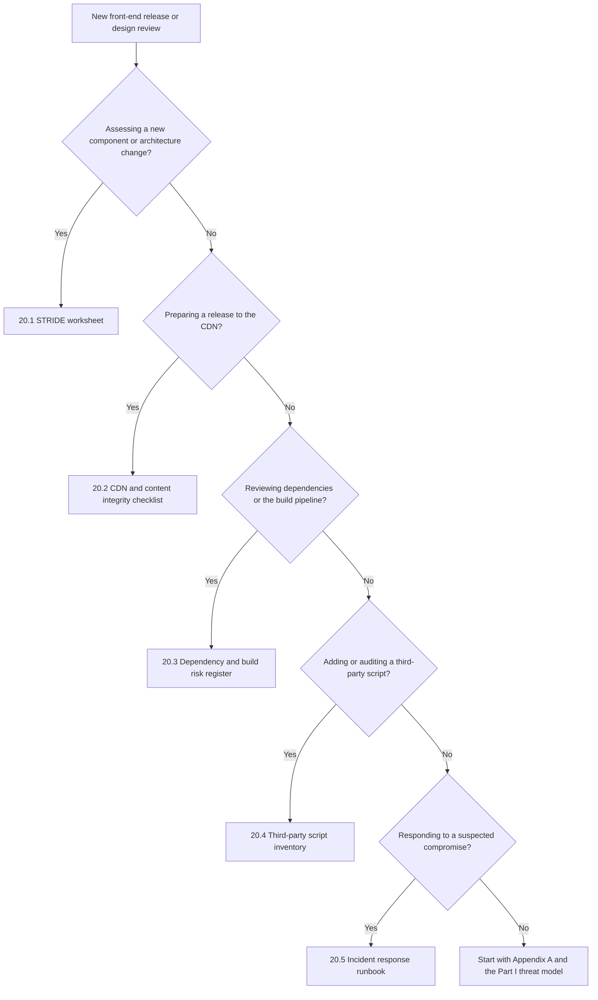
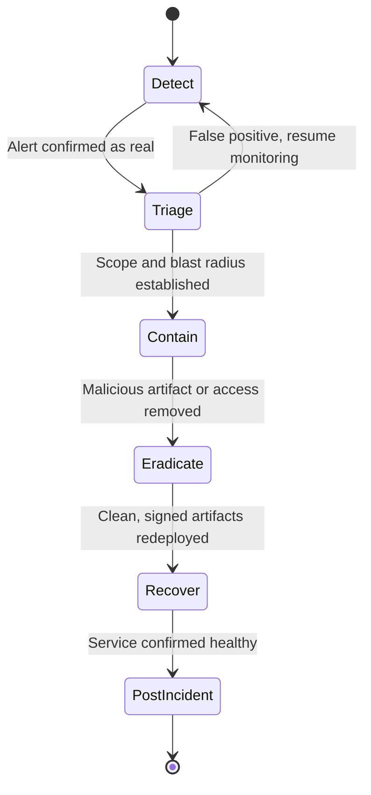

# Part 6: Appendices

[Back to Handbook contents](index.md) | [Series index](../index.md)

This part collects the reference material the rest of the handbook assumes you have on hand. Appendix A fixes the vocabulary so a term like *provenance* or *pinning* means the same thing in Chapter 4 as it does in Chapter 12. Appendix B turns the STRIDE walkthrough from Part I and the checklists scattered through Parts II through V into templates you can paste into a ticket, a design review, or a runbook. Appendix C points to the full, deduplicated source list rather than repeating every citation already given at the point of its claim.

---

## 19. Appendix A: Glossary

Terms below are grouped by the domain area where they do the most work, not strict alphabetical order, because a reader troubleshooting a **CDN** incident and a reader auditing a dependency tree reach for different clusters of vocabulary. Within each group, entries run alphabetically, with the acronym expanded on first appearance and the relevant chapter named so you can jump to the fuller treatment. Where an external standard or documented incident defines the term, the entry cites that source directly. Treat this appendix as a shared reference: pointing a colleague at a fixed definition here avoids the drift that happens when "**provenance**" means one thing to a build engineer and another to a security reviewer.

### 19.1 Content Delivery and Browser Security Terms

These terms describe the path from the **CDN** edge to the executing browser tab, the surface covered in Chapters 3, 4, and 10.

- **Cache poisoning**: storing a malicious response in a shared cache under a key that legitimate users will later request, typically by manipulating an *unkeyed input*, a request element that shapes the response without being part of the cache key. See Chapter 3.3 and [PortSwigger's practical web cache poisoning research](https://portswigger.net/research/practical-web-cache-poisoning).
- **CDN (Content Delivery Network)**: a distributed network of edge servers that caches and serves content close to users, discussed throughout Chapter 3.
- **Content Security Policy (CSP)**: an HTTP response header that tells the browser which sources may load scripts, styles, and other resources, and can require **Subresource Integrity** on the scripts it allows. Defined in [CSP Level 3](https://www.w3.org/TR/CSP3/). See Chapter 4.5.
- **DOM (Document Object Model) clobbering**: an injection technique where attacker-controlled HTML elements overwrite global JavaScript variables the application assumed were script-defined, corrupting logic without a classic script payload. See Chapter 10.
- **HSTS (HTTP Strict Transport Security)**: a response header, defined in [RFC 6797](https://www.rfc-editor.org/rfc/rfc6797), instructing the browser to refuse any future plaintext connection to the host. See Chapter 3.4.
- **Nonce**: a per-response, unpredictable token placed in a **CSP** `script-src` directive and matched against a `nonce` attribute on trusted `<script>` tags, so only those scripts execute. See Chapter 4.5.
- **Prototype pollution**: a JavaScript flaw class where an attacker injects properties into `Object.prototype` or another shared prototype, altering the behavior of every object that inherits from it. See Chapter 10.
- **strict-dynamic**: a CSP `script-src` keyword that propagates trust from a nonced or hashed script to whatever it loads dynamically, replacing a brittle domain allowlist. Defined in [CSP Level 3](https://www.w3.org/TR/CSP3/). See Chapter 4.5.
- **Trusted Types**: a browser API, enforced through the `require-trusted-types-for` CSP directive, requiring DOM-injection sinks to accept only values passed through a sanitizing policy object. See the [W3C Trusted Types specification](https://w3c.github.io/trusted-types/dist/spec/). See Chapter 4.5.
- **XSS (cross-site scripting)**: injection of attacker script into a page viewed by another user, executing with that user's privileges and, in a wallet context, potentially reaching the signing surface. See Chapter 10.

### 19.2 Integrity, Signing, and Provenance Terms

These terms describe how a **front end** proves that delivered bytes match what was published and by whom, the core of Chapter 4.

- **Cosign**: the signing and verification client in the [Sigstore](https://docs.sigstore.dev/cosign/signing/overview/) project, used to attach a signature or attestation to a container image or file artifact. See Chapter 4.3.
- **Fulcio**: **Sigstore**'s certificate authority, issuing a short-lived (roughly ten-minute) code-signing certificate that binds an ephemeral key to an OIDC-verified identity. See Chapter 4.3.
- **Immutable, versioned artifact**: a published file whose content never changes under a fixed name; any change ships under a new version or content-addressed name, so a pinned hash never goes stale silently. See Chapter 4.4.
- **Keyless signing**: a Sigstore signing mode where the signer authenticates through OpenID Connect (OIDC) instead of holding a long-lived **private key**; Fulcio issues an ephemeral certificate and Rekor logs the event. See Chapter 4.3.
- **Provenance**: verifiable metadata describing how, when, and by whom an artifact was built, typically including the source commit, the build platform, and the steps executed. Central to [SLSA](https://slsa.dev/spec/v1.2/). See Chapter 5.6.
- **Rekor**: Sigstore's append-only, publicly auditable transparency log, recording every signing event so an artifact owner can detect a signing they did not initiate. See Chapter 4.3.
- **Reproducible build**: a build process that, given the same source and environment, produces bit-for-bit identical output every time, letting an independent party verify a published binary against its claimed source. See Chapter 6.1.
- **Sigstore**: an open-source project providing keyless code signing, transparency logging, and verification tooling for software artifacts. See [docs.sigstore.dev](https://docs.sigstore.dev/) and Chapter 4.3.
- **SRI (Subresource Integrity)**: a browser mechanism letting a page pin the cryptographic hash of an external script or stylesheet through the `integrity` attribute, so the browser refuses the resource if the fetched bytes mismatch. Defined by the [MDN SRI reference](https://developer.mozilla.org/en-US/docs/Web/Security/Subresource_Integrity). See Chapter 4.1.

### 19.3 Dependency and Package Ecosystem Terms

These terms describe the transitive graph of code a **front end** pulls in before it ever reaches the **CDN**, covered in Chapter 5.

- **CycloneDX**: an [OWASP-maintained SBOM standard](https://cyclonedx.org/specification/overview/) whose version 1.6, released April 2024, added Cryptographic Bill of Materials (CBOM) and attestation support. See Chapter 5.2.
- **Dependency confusion**: an attack where a package manager resolves an internal package name to a same-named, attacker-published public package instead of the intended private one, usually because public-registry resolution takes precedence. First demonstrated at scale by [Alex Birsan in 2021](https://medium.com/@alex.birsan/dependency-confusion-how-i-hacked-into-apple-microsoft-and-dozens-of-other-companies-4a5d60fec610). See Chapter 5.1.
- **EPSS (Exploit Prediction Scoring System)**: a score estimating the probability that a given CVE (Common Vulnerabilities and Exposures identifier) will be exploited in the wild within 30 days, used to prioritize remediation beyond raw severity. See [first.org/epss](https://www.first.org/epss/).
- **Lockfile**: a generated manifest (`package-lock.json`, `yarn.lock`, and equivalents) that pins every direct and transitive dependency to an exact resolved version and, ideally, an integrity hash. See Chapter 5.1.
- **OSV (Open Source Vulnerabilities)**: a distributed vulnerability database and schema, maintained by Google's OSV project, aggregating advisories across ecosystems for machine-readable scanning. See [osv.dev](https://osv.dev/) and Chapter 5.3.
- **SBOM (Software Bill of Materials)**: a structured, machine-readable inventory of every component, direct and transitive, in a software artifact, along with its version and supplier. See Chapter 5.2.
- **SPDX (Software Package Data Exchange)**: an **SBOM** standard, published as [ISO/IEC 5962:2021](https://spdx.dev/about/overview/) and reaching version 3.0 in [April 2024](https://www.linuxfoundation.org/press/spdx-3-revolutionizes-software-management-in-systems-with-enhanced-functionality-and-streamlined-use-cases) with profile-based structuring for security and AI use cases. See Chapter 5.2.
- **Transitive dependency**: a package your project did not declare directly but which one of its direct dependencies requires, often extending several levels deep and, in a typical npm project, numbering in the thousands. See Chapter 5.1.
- **Typosquatting**: publishing a package under a name that closely resembles a popular one, relying on a misspelling or misread to install the malicious version instead. See Chapter 5.1.
- **VEX (Vulnerability Exploitability eXchange)**: a companion document to an SBOM stating whether a known vulnerability in a listed component is actually exploitable in the product as shipped, using status values such as *not affected*, *affected*, *fixed*, or *under investigation*. See [CISA's VEX minimum requirements](https://www.cisa.gov/resources-tools/resources/minimum-requirements-vulnerability-exploitability-exchange-vex) and Chapter 5.2.

### 19.4 Build, CI/CD, and Deployment Terms

These terms describe the pipeline and the deploy-time controls that get an artifact from source to **CDN**, covered in Chapters 3.4 and 6.

- **CAA (Certification Authority Authorization)**: a DNS record, defined in [RFC 8659](https://www.rfc-editor.org/rfc/rfc8659), restricting which certificate authorities may issue a TLS certificate for a domain. See Chapter 3.4.
- **CI/CD (Continuous Integration / Continuous Deployment)**: the automated pipeline that builds, tests, and deploys code on every change, and the build-level **trust boundary** covered throughout Chapter 6.
- **DNSSEC (Domain Name System Security Extensions)**: IETF extensions, originating in [RFC 4033](https://www.rfc-editor.org/rfc/rfc4033), that cryptographically sign DNS records so a resolver can detect tampering or spoofed responses; treated in full in the DNS and Hosting Handbook (02).
- **Pinned action**: a CI/CD workflow reference to a third-party action or script by immutable commit SHA rather than a mutable tag such as `v1` or `latest`, closing the substitution window a compromised tag would otherwise open. See Chapter 6.4.
- **Runner**: the compute environment, self-hosted or provider-managed, that executes CI/CD jobs and holds whatever secrets those jobs are granted for the run's duration. See Chapter 6.2.
- **Secret scanning**: automated detection of credentials, API keys, or **private key** material committed to source control or exposed in build logs, ideally run pre-commit and again in CI. See Chapter 6.2.
- **SLSA (Supply-chain Levels for Software Artifacts)**: a framework defining graduated build and source integrity levels, from no guarantees up to a hardened, isolated build platform producing **signed provenance**; version 1.2, approved November 2025, added a Source Track alongside the existing Build Track. See [slsa.dev](https://slsa.dev/spec/v1.2/whats-new) and Chapter 5.6.
- **SSDF (Secure Software Development Framework)**: NIST's outcome-based set of secure development practices, published as [SP 800-218](https://csrc.nist.gov/pubs/sp/800/218/final), developed in response to Executive Order 14028 and increasingly referenced in supplier security requirements.

### 19.5 Threat Modeling, Standards, and Governance Terms

These terms describe the frameworks used to structure the threat models in Chapter 2 and Part IV.

- **AADAPT (Adversarial Actions in Digital Asset Payment Technologies)**: a MITRE threat framework, modeled on ATT&CK and launched in 2025, cataloging adversary tactics specific to digital asset and payment systems across a twelve-tactic matrix. See [MITRE's fact sheet](https://www.mitre.org/news-insights/fact-sheet/aadapt-cyber-threat-framework-digital-assets) and the [public matrix](https://github.com/mitre/AADAPT).
- **Blast radius**: the scope of damage a single compromised credential, host, or component can cause, used to reason about why bounding a **CDN**'s or a build runner's authority limits the impact of any one breach. See Chapter 3.1.
- **MITRE ATT&CK**: a globally accessible knowledge base of adversary tactics and techniques drawn from real-world observations, used to structure threat models for general IT and cloud environments. See [attack.mitre.org](https://attack.mitre.org/).
- **SCSVS (Smart Contract Security Verification Standard)**: OWASP's standard defining verifiable security requirements for smart contract systems; this handbook is its delivery-side complement. See [scs.owasp.org](https://scs.owasp.org/) and Chapter 1.3.
- **SCSTG (Smart Contract Security Testing Guide)**: OWASP's companion guide describing test procedures for smart contract security, extended by this handbook's dependency and **build pipeline** testing. See [scs.owasp.org](https://scs.owasp.org/) and Chapter 1.3.
- **SCWE (Smart Contract Weakness Enumeration)**: OWASP's catalog of smart contract weakness classes, which does not cover front-end or supply-chain weaknesses, the gap this handbook fills. See [scs.owasp.org](https://scs.owasp.org/) and Chapter 1.3.
- **STRIDE**: a **threat modeling** mnemonic, spoofing, tampering, repudiation, information disclosure, denial of service, elevation of privilege, introduced by Loren Kohnfelder and Praerit Garg at Microsoft in 1999 and applied to each attack surface in Chapter 2.2 and 2.3. See [Microsoft's threat modeling documentation](https://learn.microsoft.com/en-us/azure/security/develop/threat-modeling-tool-threats).

### 19.6 Web3 and Wallet-Specific Terms

These terms describe where a front-end or supply-chain compromise ultimately lands: the wallet-signing surface.

- **Blind signing**: approving a transaction in a hardware or software wallet without the wallet being able to decode and display its actual effect, forcing the user to trust the requesting **front end**'s representation of what they are signing. Covered in the UX Security Handbook (09).
- **IPFS (InterPlanetary File System) pinning**: ensuring a specific piece of content stays available on the IPFS network by having at least one node commit to storing it; used in this handbook as an independently controlled fallback for a compromised **CDN**. See [ipfs.tech](https://ipfs.tech/) and Chapter 3.5.
- **Signing surface**: the set of front-end code paths, from form input to the wallet's `eth_sendTransaction` or `personal_sign` call, that determine what a user is asked to approve; the terminal target of most attacks in this handbook.
- **Wallet drain**: the end state of a successful front-end or CDN compromise, in which attacker-controlled code substitutes a malicious recipient or approval into a transaction the user believes is legitimate; the outcome both the Ledger Connect Kit and Polyfill.io incidents produced. See Chapter 1.1.
- **Web3 Attack Vectors Top 15**: an OWASP catalog ranking the most significant non-contract Web3 risks, including supply-chain compromise (WA02) and UI/UX deception (WA06). See [scs.owasp.org/sctop10/Web3-Attack-Vectors-Top15](https://scs.owasp.org/sctop10/Web3-Attack-Vectors-Top15/) and Chapter 1.3.

---

## 20. Appendix B: Supply Chain Threat Model Templates

The templates below are the copy-ready form of the analysis this handbook argues for in prose. Lift a table wholesale into a design review, a release ticket, or an incident channel rather than reconstructing it from memory each time. Use the decision flow below to pick a starting point; most releases touch more than one template.

*Figure 6. Template selection by trigger scenario. Most releases touch at least two branches; a release that changes a component and ships to the CDN uses both 20.1 and 20.2.*

### 20.1 STRIDE Front-End Threat Model Worksheet {.pdf-wide-table-section}

Run this worksheet whenever a new component is designed or an existing one changes trust boundaries, the same STRIDE-and-scenario method walked through in Chapter 2.3. Fill one row per component per applicable STRIDE category; not every category applies to every component, and leaving a category blank with a one-line justification is preferable to a forced entry. Revisit the worksheet at the cadence set by your release process, and re-run it in full after any incident that touched the component.

<!-- pdf-table: landscape -->
| Component | STRIDE Category | Attack Scenario | Existing Control | Residual Risk (H/M/L) | Owner | Review Date |
|-----------|-----------------|------------------|-------------------|------------------------|-------|-------------|
| Wallet-connect script (CDN) | Spoofing | Look-alike or hijacked domain serves a modified script | SRI + CSP `strict-dynamic` | Low | Front-end lead | Quarterly |
| Analytics widget (third party) | Elevation of privilege | Vendor breach ships JS that reads the DOM and rewrites the signing form | CSP `script-src` scoped, no DOM access to signing component | Medium | Security review | Each vendor update |
| *(your component)* | | | | | | |

### 20.2 CDN and Content Integrity Control Checklist

Run this checklist before every production release and again on a fixed schedule (monthly is typical) independent of releases, since a third-party **CDN** configuration can drift without any change on your side. It operationalizes Chapters 3 and 4.

**CDN and Content Integrity Checklist**

- [ ] Every third-party &lt;script&gt; and &lt;link&gt; tag carries an `integrity` attribute
      matching the deployed version, with `crossorigin="anonymous"` set
- [ ] Every SRI-pinned resource is served from an immutable, versioned URL,
      never a `latest` or floating alias
- [ ] **CSP** is enforced with `strict-dynamic`, `object-src 'none'`, and
      `require-trusted-types-for 'script'`; violations report to a monitored
      endpoint (Chapter 17)
- [ ] TLS terminates at 1.3 (1.2 minimum) with HSTS, and CAA restricts issuance
      to chosen certificate authorities
- [ ] Origin rejects direct access; only the CDN's authenticated pull reaches it
- [ ] Request headers not required by the origin are stripped before the cache
      layer (**cache poisoning** defense, Chapter 3.3)
- [ ] Build artifacts are signed (**Sigstore**/Cosign) and verified before publish
- [ ] An independently controlled fallback (secondary CDN or IPFS pin) exists
      with current integrity hashes

### 20.3 Dependency and Build Pipeline Risk Register

Maintain this register as a living document rather than a point-in-time snapshot; the review cadence should match the update and patching policy in Chapter 5.5. Populate the **SBOM** Component ID column directly from your CycloneDX or SPDX output (Chapter 5.2) so the register and the machine-readable SBOM never diverge.

**Inventory and integrity fields**

<!-- pdf-table: fit -->
| Package / Action | Ecosystem | Direct or Transitive | SBOM Component ID | Pinned Version + Hash | License |
|-------------------|-----------|----------------------|--------------------|-------------------------|---------|
| *(example row)* | npm | Direct | `pkg:npm/example@2.3.1` | `2.3.1` / `sha512-...` | MIT |
| *(your dependency)* | | | | | |

**Risk, stewardship, and disposition fields**

| Package / Action | Known CVEs (EPSS) | Maintainer Health | Last Reviewed | Action |
|-------------------|--------------------|-------------------|---------------|--------|
| *(example row)* | none open | Active, 3 maintainers | 2026-Q3 | None |
| *(your dependency)* | | | | |

### 20.4 Third-Party Script and Widget Inventory Template

Every third-party script or widget embedded in the **front end** belongs in this inventory before it ships, not discovered after the fact during an audit. This directly supports the auditing and minimization guidance in Chapter 7.3.

<!-- pdf-table: landscape -->
| Script / Widget | Vendor | Purpose | Load Method | SRI Pinned? | CSP Origin Allowed | Data Accessible | Last Reviewed | Removal Candidate? |
|------------------|--------|---------|--------------|--------------|----------------------|-------------------|----------------|----------------------|
| *(example row)* | Analytics vendor | Usage metrics | External `<script>` | Yes | `script-src` allowlisted | DOM read (page only), no cookies | 2026-Q3 | No |
| *(your script)* | | | | | | | | |

### 20.5 Supply Chain Incident Response Runbook Checklist

This checklist sequences the phases described in Chapter 18 and is meant to be rehearsed before an incident, not read for the first time during one. It is the front-end and supply-chain specific companion to the general process in the **Incident Response** Handbook (06); use that handbook's escalation and communication templates alongside the technical steps here.

*Figure 7. Supply chain incident lifecycle. Triage can return to Detect on a false positive; every other transition is forward-only and gated on the stated condition.*

**Supply Chain Incident Response Runbook**

**Detect**

- [ ] Confirm the signal (**CSP** violation spike, **SRI** mismatch alert, unexpected
      **SBOM** diff, external report) against monitoring baselines (Chapter 17)

**Triage**

- [ ] Identify the affected supply chain level (Chapter 1.2) and the blast
      radius: which users, which versions, since when

**Contain**

- [ ] Purge or bypass the affected **CDN** cache; fail over to the independently
      controlled fallback (Chapter 3.5)
- [ ] Revoke and rotate any credential, token, or signing key with plausible
      exposure; if the compromise is a third-party script, remove it via a
      CSP update, not only by editing the embedding page

**Eradicate**

- [ ] Identify the entry point (compromised account, malicious dependency,
      poisoned cache, pinned-tag substitution) and close it
- [ ] Re-verify every artifact in the deploy path against its signed
      **provenance** before it is trusted again

**Recover**

- [ ] Redeploy from a known-good, signed, SBOM-matched artifact; re-issue SRI
      hashes and CSP nonces for anything that changed
- [ ] Confirm user-facing behavior matches the pre-incident baseline

**Post-Incident**

- [ ] Publish a post-mortem naming the entry point, the detection gap, and the
      remediation (timeline set by the Incident Response Handbook, 06), and
      update the risk register (20.3) and script inventory (20.4)

---

## 21. Appendix C: References and Further Reading

Every claim in this handbook that names a standard, a version, a date, or an incident is cited inline at the point it is made, following the convention set in Part I. Rather than duplicate that source list here, this appendix points to `references.md`, the deduplicated bibliography for the full handbook, grouped into Standards and Frameworks (OWASP SCSVS, SCSTG, SCWE, and Web3 Attack Vectors Top 15; NIST SP 800-218; **SLSA**; CycloneDX; SPDX; **CSP** Level 3; MITRE ATT&CK and AADAPT), Incidents and Case Studies (the Ledger Connect Kit compromise, the Polyfill.io takeover, the tj-actions/changed-files compromise, and the XZ Utils backdoor among them), Tools (Sigstore and Cosign, software composition analysis scanners, SBOM generators), and Further Reading (research write-ups, vendor post-mortems, and companion material that goes deeper than this handbook's scope allows).

If a link in the body of any Part goes stale, `references.md` is the place to check for an updated URL or an archive copy before assuming the underlying claim no longer holds. When you extend this handbook, add the new source to `references.md` in the same change rather than letting citations accumulate only in the body text, so the bibliography stays a complete index.

---

**Key controls for Part 6**

- Treat Appendix A as the canonical vocabulary; link to it from tickets and post-mortems rather than redefining a term inline each time.
- Copy the STRIDE worksheet (20.1) into your next architecture or design review instead of starting from a blank page.
- Run the **CDN** and content integrity checklist (20.2) before every production release, not only after an incident prompts one.
- Keep the dependency risk register (20.3) and the third-party script inventory (20.4) as living documents, reviewed on the cadence set in Chapter 5.5.
- Rehearse the **incident response** runbook (20.5) before you need it, and keep it paired with the Incident Response Handbook (06).
- Add every new citation to `references.md` in the same change that introduces it (Appendix C).
