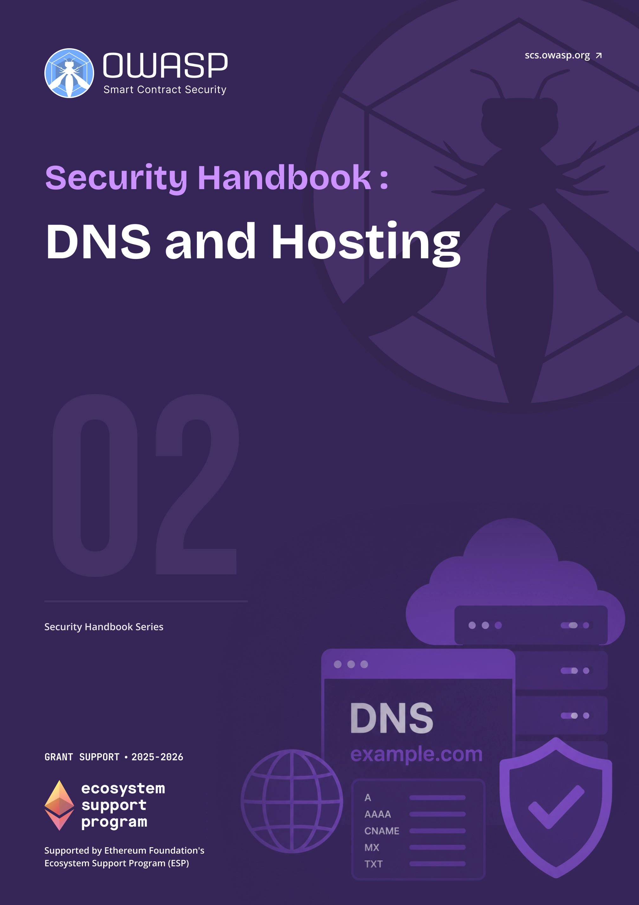

# OWASP SCS DNS and Hosting Security Handbook

  
  

    <a class="handbook-series-link" href="../">← All handbooks</a>
    
Handbook 02 · 85 PDF pages

    
Harden DNS, registrars, ENS, IPFS, decentralized hosting, and the operational controls behind a trustworthy web presence.

    

      <a href="../pdfs/02-dns-hosting-security.pdf" target="_blank" rel="noopener">Open PDF</a>
      <a href="../pdfs/02-dns-hosting-security.pdf" download>Download PDF</a>
    

  

**OWASP Smart Contract Security Project**

Part of the [OWASP SCS Handbook Series](../index.md). Built to the series [conventions](../index.md#about-the-series).

## Purpose and Scope

This handbook covers attack playbooks and defensive guidance for the Domain Name System (**DNS**), traditional hosting, the InterPlanetary File System (**IPFS**), and the Ethereum Name Service (ENS) as they apply to Web3 front ends and resources. It works through DNS Security Extensions (DNSSEC), the chain of trust built from Delegation Signer (DS), Resource Record Signature (RRSIG), and DNSKEY records, and why decentralized protocols still depend on DNS at the point a user types a URL. It covers ENS's gasless DNSSEC integration and EIP-3668 CCIP Read (off-chain data lookup; not Chainlink's cross-chain protocol), guidance from the Internet Corporation for Assigned Names and Numbers (ICANN) and its Security and Stability Advisory Committee (SSAC) on DNS blocking and circumvention, and the trust assumptions behind IPFS gateways and pinning services.

A smart contract can pass every audit and still hand an attacker the front door, because most users reach a dApp through a domain name or an **ENS** name, not a contract address. DNS hijack, registrar compromise, ENS resolver takeover, and a poisoned IPFS gateway all sit upstream of the contract layer and defeat it without touching a single line of Solidity. This handbook treats that upstream layer, DNS, ENS, IPFS, and conventional hosting, as infrastructure a Web3 team must defend with the same rigor as its contracts, and it pairs each **threat model** with a playbook for the moment things go wrong.

## Target Audience

Infrastructure and DevOps teams, security specialists, and protocol teams that rely on **DNS**, **ENS**, or IPFS to serve front ends and other Web3 resources.

## How to Use This Handbook

Start with Part I to fix the architecture and the **threat model**: where **DNS**, ENS, and IPFS sit in a typical Web3 stack and what happens when each one fails. Parts II through V are organized by system, DNS, ENS, IPFS, and conventional hosting, and each pairs a threat model with hardening guidance and one or more incident playbooks a responder can follow directly. A team responding to a live domain hijack or a compromised ENS resolver should go straight to the relevant playbook in Part II, III, or IV rather than reading front to back. The appendices hold a glossary, a consolidated security checklist across all three systems, a playbook quick-reference table, and the full bibliography.

## Relationship to SCSVS, SCSTG, and SCWE

This handbook sits outside the Smart Contract Security Verification Standard (SCSVS), the Smart Contract Security Testing Guide (SCSTG), and the Smart Contract Weakness Enumeration (SCWE) by design, because **DNS**, **ENS** resolution, and IPFS gateway trust are infrastructure risks that no amount of contract-level verification, testing, or weakness cataloging can close. The playbooks here give incident responders and infrastructure teams the DNS- and ENS-specific procedures that SCSVS assumes are already in place when it verifies a system's resolution and delivery integrity. It shares its infrastructure focus most closely with the Infrastructure Security Handbook (07), which covers the servers, cloud accounts, and network controls that DNS and hosting records point to, and it feeds directly into the Incident Response Handbook (06), whose general response process this handbook's playbooks specialize for domain, resolver, and gateway compromise.

## Contents

### Part I: Foundations
- [1. Introduction to DNS and Hosting Security in Web3](part1-foundations.md#1-introduction-to-dns-and-hosting-security-in-web3)

### Part II: DNS Security
- [2. DNS Threat Model](part2-dns-security.md#2-dns-threat-model)
- [3. Hardening and Prevention](part2-dns-security.md#3-hardening-and-prevention)
- [4. Playbook: Suspected DNS Hijack or Poisoning](part2-dns-security.md#4-playbook-suspected-dns-hijack-or-poisoning)
- [5. Playbook: Domain Expiry or Registrar Compromise](part2-dns-security.md#5-playbook-domain-expiry-or-registrar-compromise)
- [6. Playbook: DNS Abuse (Phishing, Malware Hosting on Your Brand)](part2-dns-security.md#6-playbook-dns-abuse-phishing-malware-hosting-on-your-brand)

### Part III: ENS (Ethereum Name Service)
- [7. ENS Security Overview](part3-ens-ethereum-name-service.md#7-ens-security-overview)
- [8. ENS Threat Model](part3-ens-ethereum-name-service.md#8-ens-threat-model)
- [9. Playbook: ENS Name or Resolver Compromise](part3-ens-ethereum-name-service.md#9-playbook-ens-name-or-resolver-compromise)
- [10. Best Practices for ENS Integration](part3-ens-ethereum-name-service.md#10-best-practices-for-ens-integration)

### Part IV: IPFS and Decentralized Hosting
- [11. IPFS Security Overview](part4-ipfs-and-decentralized-hosting.md#11-ipfs-security-overview)
- [12. Threat Model for IPFS](part4-ipfs-and-decentralized-hosting.md#12-threat-model-for-ipfs)
- [13. Playbook: IPFS Gateway or Pinning Incident](part4-ipfs-and-decentralized-hosting.md#13-playbook-ipfs-gateway-or-pinning-incident)
- [14. Best Practices for IPFS in Web3](part4-ipfs-and-decentralized-hosting.md#14-best-practices-for-ipfs-in-web3)

### Part V: Hosting and Web Presence
- [15. Traditional Hosting (VPS, Cloud) and Web3](part5-hosting-and-web-presence.md#15-traditional-hosting-vps-cloud-and-web3)
- [16. Playbook: Front-End Defacement or Compromise](part5-hosting-and-web-presence.md#16-playbook-front-end-defacement-or-compromise)
- [17. Integration with Incident Response](part5-hosting-and-web-presence.md#17-integration-with-incident-response)

### Part VI: Appendices
- [18. Appendix A: Glossary](part6-appendices.md#18-appendix-a-glossary)
- [19. Appendix B: DNS/ENS/IPFS Security Checklist](part6-appendices.md#19-appendix-b-dnsensipfs-security-checklist)
- [20. Appendix C: Playbook Quick Reference](part6-appendices.md#20-appendix-c-playbook-quick-reference)
- [21. Appendix D: References and Further Reading](references.md)
