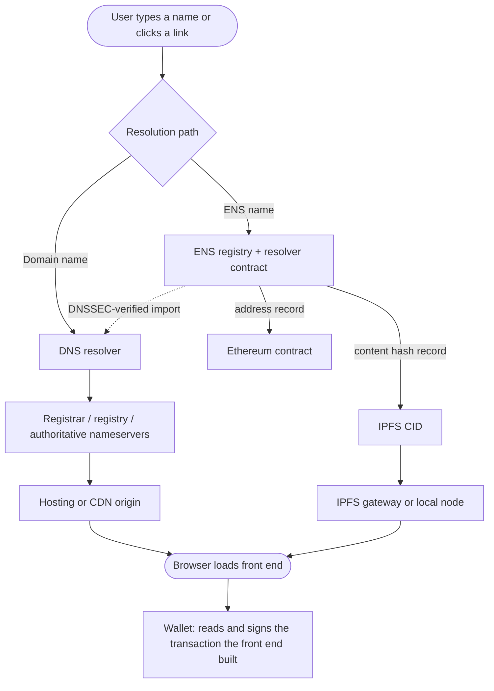
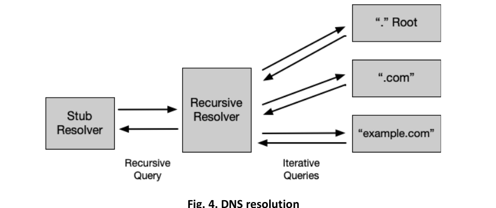
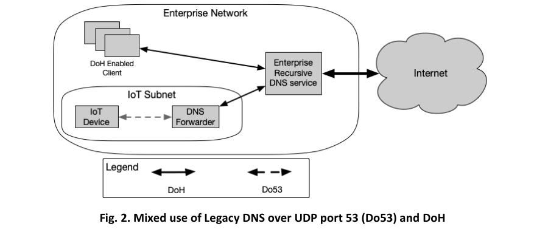

# Part 1: Foundations

[Back to Handbook contents](index.md) | [Series index](../index.md)

This part fixes the map that the rest of the handbook works from: where the Domain Name System (**DNS**), the Ethereum Name Service (**ENS**), and the InterPlanetary File System (IPFS) each sit in a typical Web3 stack, what happens to a user when one of them fails, and how this handbook's scope connects to the smart contract standards and to its closest sibling handbooks. Read it once before jumping to a system-specific Part or a playbook.

---

## 1. Introduction to DNS and Hosting Security in Web3

A user does not open a smart contract. A user opens a domain, or an **ENS** name, and trusts whatever that name resolves to. Every control this handbook covers, **DNSSEC** signatures, registrar locks, ENS resolver checks, IPFS content hashes, exists because that first act of resolution is a decision point an attacker can hijack without ever touching the protocol's Solidity or Move code. This chapter sets the vocabulary, surveys the attack classes with real incidents behind them, places the handbook against the OWASP Smart Contract Security (SCS) standards, and gives a reading path through the rest of the book.

### 1.1 DNS, ENS, and IPFS in Typical Web3 Architectures

Most Web3 products run on two parallel naming systems that a user rarely distinguishes between. The first is the classical **DNS**: a registrar holds the domain, a registry publishes it, and a set of authoritative nameservers answer queries that route a browser to a hosting provider or a content delivery network (CDN). DNS predates blockchains by decades, and [RFC 1035](https://www.rfc-editor.org/rfc/rfc1035) still defines the wire format every resolver on the internet speaks today. [NIST SP 800-81 Rev. 3, *Secure Domain Name System (DNS) Deployment Guide*](https://csrc.nist.gov/pubs/sp/800/81/r3/final), published in March 2026 and superseding SP 800-81-2, is the current reference architecture for hardening authoritative and recursive DNS, encrypted DNS, protective DNS, DNS logging, and **DNSSEC**; Part 2 builds its guidance from that current baseline.

The second system is **ENS**, an on-chain naming layer that maps human-readable names like `curve.eth` to Ethereum addresses, content hashes, and other records through a resolver contract. ENS is not a replacement for DNS: it is a parallel registry that a growing share of wallets and browsers resolve natively, and it can also import and re-publish ordinary DNS names through a DNSSEC-verified proof, a mechanism Part 3 covers in depth. Where DNS answers "what server do I connect to," ENS more often answers "what **content hash** or address does this human-readable name currently point to," and the two increasingly resolve into the same page load.

**IPFS** is the third leg, and it answers a different question entirely: not "where is this," but "what is this." Content on IPFS is addressed by a Content Identifier (CID), a value derived from a cryptographic hash of the content itself, [by design, so that identical content always produces the same CID and any modification changes it](https://docs.ipfs.tech/concepts/content-addressing/). A front end can therefore be pinned to IPFS, referenced by its CID from an ENS content hash record, and served to a browser through any public gateway, with no single party controlling the bytes the user ultimately receives. The catch, covered in Part 4, is that gateways and pinning services are themselves points of trust: a CID guarantees the content is correct once retrieved, but says nothing about whether the gateway you queried is available, honest, or serving you a different, unpinned CID for a name you thought was fixed.

*Figure 1. Two parallel naming paths converge on the same browser and the same wallet-signing step. A compromise anywhere upstream of the wallet, in DNS, in the ENS resolver, or in the IPFS gateway, delivers attacker-controlled content to the one place the user actually trusts.*

The practical takeaway for an architect: know which path your users actually take. A team that assumes "we're on IPFS, so we're decentralized" while still pointing the primary marketing domain at a centralized DNS registrar with no **registrar lock** has not removed the DNS **attack surface**, it has only added IPFS's own trust assumptions on top of it.

*Figure. The resolver boundary that matters during triage: the client makes one recursive request, while the recursive resolver performs the iterative walk from the root to the authoritative zone. A forged referral, poisoned cache entry, or unauthorized authoritative answer changes what the client receives without changing its request. Source: [NIST SP 800-81 Rev. 3, Figure 4](https://csrc.nist.gov/pubs/sp/800/81/r3/final), public domain (U.S. government work).*

Encrypted DNS protects a different link than DNSSEC. DNS over HTTPS (DoH), DNS over TLS (DoT), and DNS over QUIC (DoQ) protect the channel between a client or forwarder and its recursive service; DNSSEC authenticates the data returned by the authoritative hierarchy. NIST's deployment model below also exposes a monitoring risk: unmanaged DoH clients can bypass an enterprise resolver unless policy routes them through the approved service.

*Figure. Mixed encrypted and legacy DNS in one enterprise. The IoT subnet cannot speak DoH directly, so its forwarder becomes both a trust boundary and a telemetry choke point; DoH-capable clients connect to the same controlled recursive service. Source: [NIST SP 800-81 Rev. 3, Figure 2](https://csrc.nist.gov/pubs/sp/800/81/r3/final), public domain (U.S. government work).*

### 1.2 Common Attack Vectors and Impact

The attack classes in this space are not hypothetical. Three incidents, spanning **DNS** registrar compromise, two flavors of Border Gateway Protocol (**BGP**) route hijacking, illustrate the pattern well enough to organize the rest of the handbook around it: an upstream naming or routing layer is compromised, a front end is silently substituted, and users sign transactions against a contract the attacker controls, with no bug in the audited smart contract at any point.

On April 24, 2018, an unknown actor exploited a BGP route leak at an upstream Internet Service Provider (ISP) called eNet, which announced a subset of Amazon Route 53's Internet Protocol (IP) address prefixes to its peers. Peered networks that had no reason to distrust the announcement began routing DNS queries for `myetherwallet.com` to a rogue DNS server, which answered with the address of a phishing clone hosted in Russia. The window lasted about two hours and netted the attacker 215 ETH, worth roughly $152,000 at the time ([Internet Society, "What Happened? The Amazon Route 53 BGP Hijack"](https://www.internetsociety.org/blog/2018/04/amazons-route-53-bgp-hijack/); [CyberScoop](https://cyberscoop.com/ether-dns-bgp-amazon-route-53-heist/)). Amazon confirmed Route 53 itself was never breached: the compromise happened entirely at the routing layer, upstream of any control MyEtherWallet could apply to its own domain.

On February 3, 2022, KLAYswap users lost approximately $1.9 million in a two-hour window when attackers hijacked the autonomous system announcing routes to `developers.kakao.com` (AS9457) and served a modified `kakao.min.js` software development kit (SDK) file to KLAYswap's front end specifically, filtering by referrer so other consumers of the same SDK were untouched. The injected code waited for a user to initiate a swap, deposit, or withdrawal, then redirected the asset to an attacker wallet, laundering proceeds through OrbitBridge and FixedFloat ([The Record](https://therecord.media/klayswap-crypto-users-lose-funds-after-bgp-hijack); [CertiK](https://www.certik.com/resources/blog/bgp-hijacking-the-usd1-9m-klayswap-attack-through-manipulated-network-flow)). This is the same BGP hijack primitive as MyEtherWallet, aimed one layer deeper, at a third-party JavaScript dependency instead of the primary domain.

On August 9, 2022, Curve Finance's front end was compromised through its DNS provider, `iwantmyname.com`: the attacker altered nameserver records for `curve.fi`, pointed the domain at a cloned interface, and had it request a malicious token approval from every visitor who connected a wallet during the window. Eight victims lost a combined $570,000-plus in USDC and DAI, later laundered through FixedFloat and Tornado Cash ([CryptoTimes](https://www.cryptotimes.io/2022/08/10/curve-finance-loses-570k-due-to-dns-compromise/); [Decrypt](https://decrypt.co/319414/curve-finance-dns-record-attack)). Curve's own audited contracts were never touched; the registrar account was the entire **attack surface**.

| Vector | Mechanism | Where it sits | Representative incident |
|---|---|---|---|
| Registrar or registry compromise | Attacker gains control of the domain account or nameserver delegation and repoints it | DNS, registrar layer | Curve Finance, Aug 2022 |
| Route hijack (BGP) against the origin | Attacker announces false routes to hijack traffic destined for an authoritative DNS or hosting IP | Internet routing, upstream of DNS | MyEtherWallet, Apr 2018 |
| Route hijack (BGP) against a dependency | Same primitive, aimed at a third-party script host the front end trusts | Dependency delivery | KLAYswap, Feb 2022 |
| Cache poisoning | Off-path attacker injects a forged record into a resolver's cache, no registrar access needed | DNS resolution | Structural risk; see Part 2 |
| ENS resolver or subdomain takeover | Attacker gains control of a resolver contract, a wildcard subdomain, or an expired-and-reclaimed name | ENS layer | See Part 3 threat model |
| IPFS gateway or pinning compromise | Gateway serves stale or substituted content, or a pin lapses and content becomes unavailable | IPFS layer | See Part 4 threat model |
| Domain or registration lapse | Domain expires or auto-renewal fails and a third party re-registers it | Registrar layer | See Part 2, Playbook 5 |

Impact is consistently the same shape regardless of which layer failed: the smart contract logic is untouched, the audit trail on-chain is technically correct, and the loss occurs entirely because the thing the user trusted to deliver correct instructions delivered attacker instructions instead. [OWASP's Web3 Attack Vectors Top 15](https://scs.owasp.org/sctop10/Web3-Attack-Vectors-Top15/) names this category directly as **WA13, DNS, Domain, and Routing Infrastructure Hijacking**, and ranks it alongside supply chain compromise (WA02) and UI/UX approval phishing (WA06) as a non-contract risk that recurs across the industry precisely because it bypasses every control a contract audit can offer.

### 1.3 Relationship to SCSVS and Infrastructure Handbook

This handbook sits deliberately outside the [Smart Contract Security Verification Standard (SCSVS)](https://scs.owasp.org/), the [Smart Contract Security Testing Guide (SCSTG)](https://scs.owasp.org/), and the [Smart Contract Weakness Enumeration (SCWE)](https://scs.owasp.org/), because none of those catalogs address **DNS** resolution, registrar custody, **ENS** resolver correctness, or IPFS gateway trust. SCSVS structures its requirements across eleven domains, among them SCSVS-ARCH (architecture, design, and threat modeling) and SCSVS-COMM (secure interactions and communications), and both domains implicitly assume that the channel delivering the front end to the user, and the name the user resolved to reach it, are already trustworthy. That assumption is exactly the gap this handbook closes: a system can satisfy every SCSVS-COMM control on message integrity between the front end and the contract and still lose every user's funds the moment the front end itself is served from a hijacked domain. The playbooks in Parts 2 through 5 give an incident responder the DNS-, ENS-, and IPFS-specific procedures that SCSVS treats as a precondition rather than a verification target.

The closest sibling in the series is the **Infrastructure Security Handbook (07)**, which covers the servers, cloud accounts, secrets management, and network controls that DNS records and hosting configuration ultimately point to. Where this handbook asks "does the name resolve to the right place," Handbook 07 asks "is the place itself secured." A registrar account takeover (this handbook) and a compromised cloud Identity and Access Management (IAM) role (Handbook 07) are different root causes that can produce the identical user-facing outcome, a substituted front end, so a mature security program treats them as a matched pair of controls rather than either one alone. This handbook also overlaps at its edge with the **CDN and Front-End Supply Chain Security Handbook (01)**: once DNS correctly resolves to your CDN, Subresource Integrity, Content Security Policy, and build-pipeline provenance take over as the controls that keep the served content trustworthy, a boundary made explicit in that handbook's own Part 1. Finally, every playbook here is a specialization of the general process defined in the **Incident Response Handbook (06)**: this book supplies the domain-, resolver-, and gateway-specific detection and containment steps, while Handbook 06 supplies the surrounding communication, evidence-preservation, and post-incident review process that applies regardless of which system failed.

### 1.4 How to Use This Handbook

Treat this Part as the only chapter meant to be read start to finish; everything after it is reference material organized to be entered at any point during normal operations or during an active incident. Part 2 covers **DNS** itself: its **threat model**, DNSSEC hardening with the DS, RRSIG, and DNSKEY chain of trust, Certification Authority Authorization (CAA) records, and three playbooks for a suspected hijack, a lapsed domain, and DNS-hosted abuse of your brand. Part 3 does the same for ENS: data integrity and ownership, the gasless DNSSEC-via-CCIP-Read bridge back to Part 2's chain of trust, subdomain and resolver takeover, and a recovery playbook. Part 4 covers IPFS: content addressing as an integrity guarantee, the separate and weaker guarantee of gateway and pinning availability, and a playbook for a gateway or pinning incident. Part 5 folds in conventional hosting, the overlap with Handbook 01's CDN controls, a defacement playbook, and the handoff into Handbook 06's incident response process.

If you are hardening a system before launch, read Parts 2 through 5 in order and work each chapter's checklist into your deployment runbook. If you are responding to a live incident, skip directly to the matching playbook, Part 2's Chapter 4 for a suspected DNS hijack, Part 2's Chapter 5 for a lapsed or stolen domain, Part 3's Chapter 9 for a compromised **ENS** name, or Part 4's Chapter 13 for an **IPFS** gateway or pinning failure, and use Part 6's Appendix C as a one-page router if you are not yet sure which system failed. Appendix A defines every acronym and term used across all five Parts in one place, and Appendix B consolidates every hardening checklist in this handbook into a single pre-launch and periodic-review document.

---

**Key controls for Part 1**

- Treat DNS, ENS, and IPFS resolution as security-critical, not merely operational: map exactly which naming path each user-facing surface takes before deciding which Part's controls apply.
- Recognize the shared attack pattern behind MyEtherWallet (2018), KLAYswap (2022), and Curve Finance (2022): the contract layer stayed intact in all three; the naming or routing layer in front of it did not.
- Cross-reference SCSVS-ARCH and SCSVS-COMM assumptions against this handbook's playbooks rather than treating contract verification as sufficient on its own.
- Pair this handbook with Infrastructure Security (07) for the systems DNS records point to, with CDN and Front-End Supply Chain Security (01) for what happens after DNS resolves correctly, and with **Incident Response** (06) for the response process each playbook here specializes.

