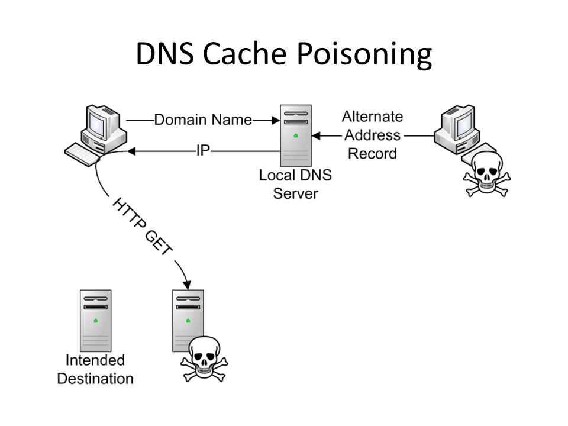
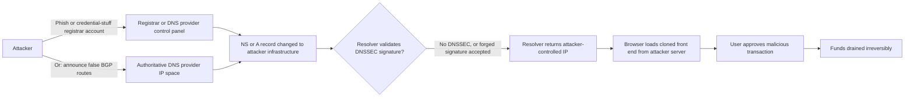
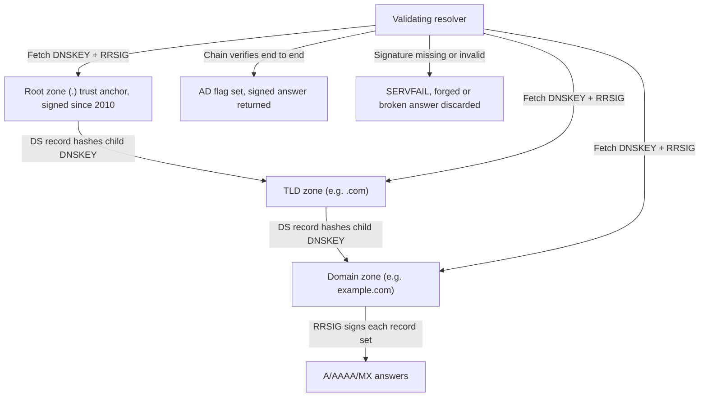
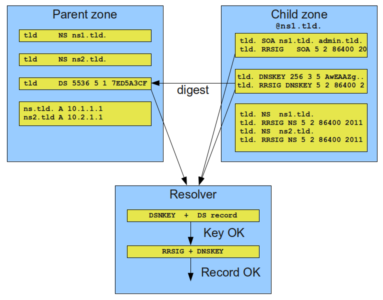
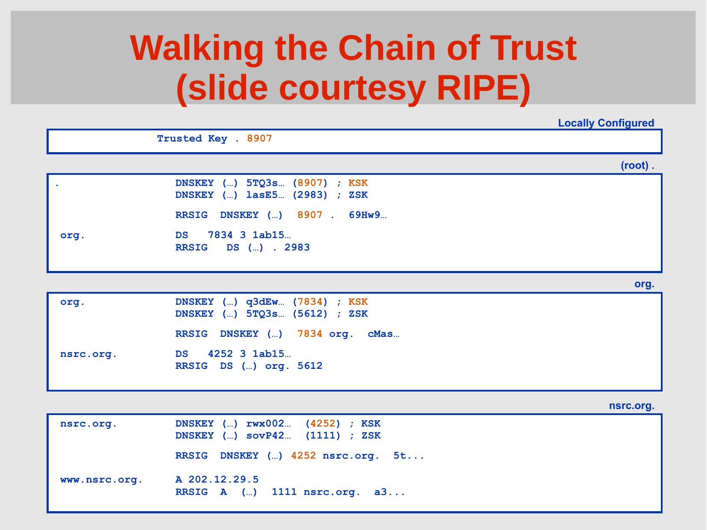
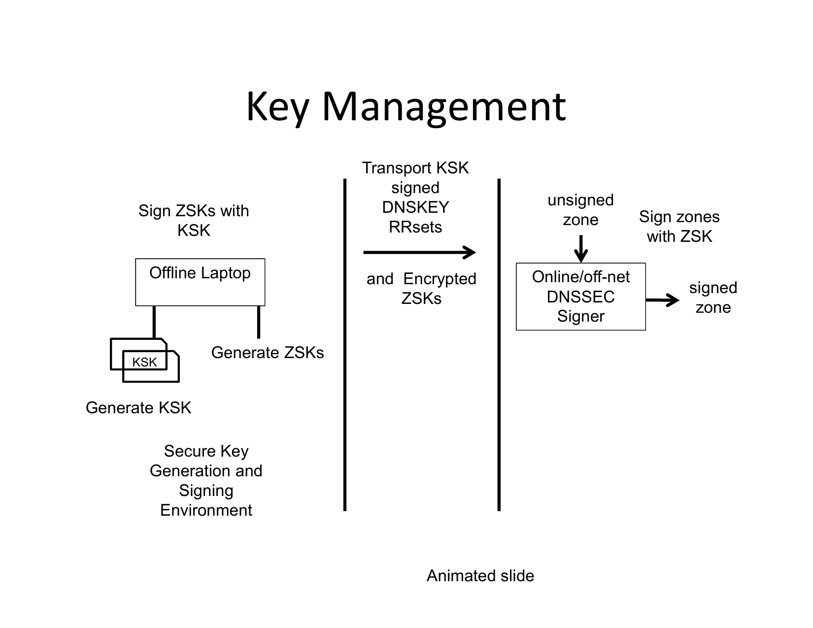
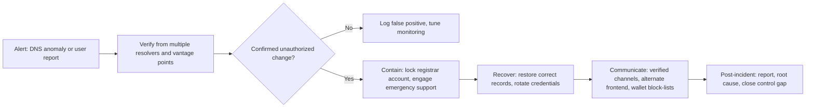

# Part 2: DNS Security

[Back to Handbook contents](index.md) | [Series index](../index.md)

The Domain Name System (**DNS**) translates the name a user types or clicks into the IP address their browser connects to, and every control described elsewhere in this handbook sits downstream of that translation. A team can pin every script with Subresource Integrity and audit every contract line by line, and still lose its user base the moment an attacker moves the domain, because the browser never reaches the point of checking a pinned hash against the real origin. This part builds the DNS **threat model** for Web3 teams, covers the hardening controls that close the gap (DNS Security Extensions (DNSSEC), Certification Authority Authorization (CAA), registrar lock, and monitoring), and closes with three field playbooks: hijack, registrar or expiry loss, and brand-abuse phishing.

---

## 2. DNS Threat Model

**DNS** was designed in the 1980s for availability and simplicity, not for authentication, and every control in this part exists to compensate for that original design choice. This chapter separates the ways DNS itself can be subverted from the ways the surrounding registration ecosystem can be subverted, because the two failure classes demand different defenses.

### 2.1 Hijacking, Poisoning, Abuse

Three distinct failure modes get grouped under "DNS attacks" and each needs its own defense. **DNS hijacking** is unauthorized modification of a domain's authoritative records: an attacker who gains write access to a zone (via a compromised registrar account, DNS provider, or hijacked route to the provider's infrastructure) changes the Name Server (NS), A, or AAAA records so queries resolve to attacker-controlled infrastructure. It is the highest-impact variant, since it redirects every query, from every resolver, everywhere, until fixed. **DNS cache poisoning** (spoofing) is narrower: an on-path or off-path attacker injects a forged response into a resolver's cache without touching the authoritative zone, exploiting weak randomization of the query ID and source port a resolver uses to match responses to requests. Researcher Dan Kaminsky's 2008 disclosure showed this could be executed far faster than assumed, forcing an emergency patch cycle around source port randomization, the practical predecessor to DNSSEC's fix ([Wikipedia, DNS spoofing](https://en.wikipedia.org/wiki/DNS_spoofing)). **DNS abuse** is the broadest category and the one ICANN uses contractually: malware, botnets, phishing, pharming, and spam as a delivery mechanism for the other four ([ICANN SAC115](https://itp.cdn.icann.org/en/files/security-and-stability-advisory-committee-ssac-reports/sac-115-en.pdf)). It needs no compromise of your own DNS; a typosquat or homograph domain copying your brand is abuse against your users even though your zone was never touched (Chapter 6).


*Figure. Cache poisoning does not require any access to a registrar or authoritative zone; it only requires the attacker's forged answer to reach the resolver's cache before the legitimate one does. Source: [Wikimedia Commons](https://commons.wikimedia.org/wiki/File:Dns-cache-poisoning.png), CC BY-SA 4.0.*

The April 2018 attack on MyEtherWallet illustrates hijacking at the routing layer rather than the registrar layer. An internet service provider identified as eNet, based in Columbus, Ohio (or a customer operating through its network), announced false Border Gateway Protocol (**BGP**) routes claiming roughly 1,300 IP addresses across five blocks belonging to Amazon Web Services, including addresses dedicated to Amazon's Route 53 **DNS** service. Peering partners, including Hurricane Electric, propagated the false routes, so queries that should have reached Amazon's real name servers were answered by an attacker-controlled server. Between 11:05 AM and 1:03 PM UTC on April 24, 2018, victims were served a phishing clone; approximately $150,000 in Ethereum was stolen before the hijack was withdrawn ([The Register](https://www.theregister.com/2018/04/24/myetherwallet_dns_hijack/); [Wikipedia, BGP hijacking](https://en.wikipedia.org/wiki/BGP_hijacking)). No registrar or application code was compromised: the attack lived entirely in internet routing, one layer below every control this handbook otherwise discusses.

| Vector | Level | Typical mechanism | Case |
|--------|-------|-------------------|------|
| Registrar account takeover | Registrar | Phishing, credential stuffing, SIM-swapped 2FA | Handbook 05 (insider/DPRK) |
| DNS provider compromise | Provider | Stolen API keys, compromised nameserver infra | Curve Finance, 2022 (2.2) |
| BGP route hijack | Network routing | False route announcements propagated by peers | MyEtherWallet, 2018 (above) |
| Cache poisoning | Resolver | Forged response matching guessed query ID/port | Kaminsky-class, pre-DNSSEC |
| Registry compromise | Registry (ccTLD/gTLD) | State-actor intrusion into registry systems | Sea Turtle (2.2) |
| Brand-impersonation abuse | Attacker's own DNS | Typosquat, IDN homograph domains | Chapter 6 |


*Figure 1. The DNS hijack chain from credential or routing compromise to on-chain loss. DNSSEC validation is the one checkpoint on this path that can independently reject the forged answer.*

### 2.2 Registrar and Registry Risks

The domain name system has an administrative hierarchy that mirrors its technical one. ICANN accredits **registries** (operators of a top-level domain, such as Verisign for `.com` and `.net`) and **registrars** (retail-facing companies, such as GoDaddy or Namecheap, that sell domains and submit changes to the registry over the Extensible Provisioning Protocol, EPP). A Web3 team's domain security depends on the weakest link in that chain, and the two levels fail differently.

Registrar-level compromise is the far more common incident. An attacker who phishes, credential-stuffs, or social-engineers their way into the account that manages a domain (or a separate **DNS** provider account, if the team delegates nameservers away from the registrar) can rewrite records directly, no cryptographic bypass required. Curve Finance's August 9-10, 2022 incident is the canonical Web3 example: the team's DNS provider, iwantmyname, had its nameservers compromised (CEO Michael Egorov described it as "ns compromised," a nameserver-level rather than account-level breach). Attackers redirected `curve.fi` to a cloned front end that prompted visitors to approve a malicious contract; roughly $575,000 (340 ETH) was drained before the team redirected users to its uncompromised alternate interface, `curve.exchange`, and coordinated on revoking approvals ([rekt.news, Curve Finance](https://rekt.news/curve-finance-rekt/)). The postmortem line that circulated afterward, "Web3 still runs on Web2," is the thesis of this handbook.

Registry-level compromise is rarer but far more dangerous, since it can affect every domain under that registry rather than one registrant's account. The Sea Turtle campaign, documented by Cisco Talos in 2019, was the first publicly known case of a state-sponsored actor compromising a domain registry itself for espionage: active from January 2017 through at least early 2019, the actor compromised registrars, registries, telecoms, and ISPs across at least 40 organizations in 13 countries, primarily to reach government and energy-sector targets in the Middle East and North Africa. Targets included a ccTLD registry and Netnod's Swedish infrastructure, which handles information related to root server operations; the actor then used fraudulent Let's Encrypt and Comodo certificates to intercept victims after redirecting their DNS ([Cisco Talos, Sea Turtle](https://blog.talosintelligence.com/2019/04/seaturtle.html)). MITRE ATT&CK catalogs this pattern as T1584.002, Compromise Infrastructure: DNS Server ([MITRE ATT&CK T1584.002](https://attack.mitre.org/techniques/T1584/002/)). Registry compromise is out of a Web3 team's direct control; the defense is **DNSSEC** (Section 3.1), which makes a forged answer detectable regardless of layer, plus **registry lock** (3.3) for domains warranting the strongest protection. Credential hygiene for registrar-access holders (Handbook 03) is the first line of defense against the far more common registrar-level scenario.

Mitigation scales with the risk level: hardware-key MFA and client-side **registrar lock** for the account tier, provider vetting and NS-drift monitoring for the DNS-provider tier, and registry lock plus DNSSEC chain validation for the registry tier, since that top tier is the one layer no registrant-side credential hygiene can reach.

---

## 3. Hardening and Prevention

Each hardening control in this chapter closes a specific gap identified in Chapter 2. None of them is sufficient alone; together they form layered defense against a **threat model** where the domain itself is the target.

### 3.1 DNSSEC: Chain of Trust, DS, RRSIG, DNSKEY

DNSSEC adds origin authentication and data integrity to DNS responses through digital signatures; it adds no confidentiality, so signed queries and responses remain visible on the wire. The core specification spans [RFC 4033](https://www.rfc-editor.org/rfc/rfc4033) (introduction and requirements), [RFC 4034](https://www.rfc-editor.org/rfc/rfc4034) (resource records), and [RFC 4035](https://www.rfc-editor.org/rfc/rfc4035) (protocol modifications), later clarified by RFC 6840 and consolidated as an internet Best Current Practice in [RFC 9364 (BCP 237)](https://www.rfc-editor.org/rfc/rfc9364). Four record types do the work. A **DNSKEY** record publishes a zone's public signing keys, conventionally split into a Zone Signing Key for day-to-day records and a Key Signing Key that signs the DNSKEY set itself. An **RRSIG** record is the signature over a specific resource record set (all the A records for a name, for instance), generated with the zone's private key. A **DS** (Delegation Signer) record, published in the *parent* zone, holds a cryptographic hash of the *child* zone's Key Signing Key, linking a domain's signature to a chain of trust a resolver can walk to the root. The root zone has been signed since 2010, giving every validating resolver a built-in trust anchor to start from.


*Figure 2. The DNSSEC chain of trust. Each DS record in a parent zone commits to the hash of the child zone's signing key, so a validating resolver can trace trust from the root anchor to any signed record.*


*Figure. A concrete walkthrough of the same chain from Figure 2, with actual record types: the resolver digests the child zone's DNSKEY, matches it against the parent's DS record, then uses the validated DNSKEY to check the RRSIG over the answer itself. Source: [Wikimedia Commons](https://commons.wikimedia.org/wiki/File:DNSSEC_resource_record_check.png), CC0 1.0 (public domain).*


*Figure. A record-level DNSSEC chain walk. The resolver begins with a locally configured root key, verifies the root DNSKEY set, follows the parent's DS digest into the child DNSKEY set, and finally validates the RRSIG over the requested address record. This is the concrete evidence behind an `AD` result, not merely a diagram of zone hierarchy. Source: [ICANN DNSSEC Training, Walking the Chain of Trust](https://dnssec-deployment.icann.org/training/IST/dnssec-tutorial.pdf), slide credited to RIPE; reproduced with attribution for technical commentary.*

A resolver that validates **DNSSEC** will query and check this chain automatically; a client can also inspect it directly:

```bash
# Query with DNSSEC records requested and check for the RRSIG
dig +dnssec example.com A

# Use delv, the DNSSEC-aware companion to dig, for an explicit validation verdict
delv example.com A
# ;; fully validated
```

An operator signs a zone with tooling built into most **authoritative DNS** software (BIND's `dnssec-signzone`, or a managed "enable DNSSEC" toggle most modern providers offer), then submits the resulting DS record to the registrar for publication in the parent zone. That hand-off is the one manual step that breaks most deployments: a zone signed locally but with no DS record published upstream is validated by nobody.


*Figure. A practical split-key DNSSEC signer design. The Key Signing Key remains offline and signs only DNSKEY RRsets; encrypted Zone Signing Keys and an unsigned zone cross into an isolated signer that emits the signed zone. Compromise of the online signer therefore does not automatically expose the long-lived trust anchor. Source: [ICANN DNSSEC Design and Operations Training, Key Management](https://dnssec-deployment.icann.org/training/SGN/dnssec-design.pdf); reproduced with attribution for technical commentary.*

### 3.2 Why DNSSEC Matters for Web3 (Wallet Redirection, Phishing, MITM)

For most web applications, a DNS-layer redirect to a phishing clone costs a user their password, which they can reset. For a Web3 front end, the same redirect costs a user their private key material or a signed, irreversible transaction, because the front end's entire job is constructing a transaction and asking a wallet to sign it. **Wallet redirection** happens when a hijacked or poisoned resolution serves JavaScript that alters the transaction the wallet is asked to sign, exactly as in the Curve Finance incident, where the malicious clone prompted an `approve()` call to an attacker-controlled contract. **Phishing** through DNS is more dangerous than a typosquat, because the browser's address bar shows the real, trusted domain; there is no lookalike spelling for a user to catch. **Machine-in-the-middle (MITM)** describes an on-path attacker, whether a rogue resolver reached via BGP hijack (the MyEtherWallet mechanism) or one pushed by a compromised public Wi-Fi network, silently substituting answers for every query that crosses it.

**DNSSEC** directly defeats the MyEtherWallet-style attack: the rogue server the **BGP** hijack routed traffic to had no way to produce validly signed responses for the real zone, so a validating resolver checking the chain in Figure 2 would have rejected the forged answers with SERVFAIL instead of serving them. Be precise about what DNSSEC does *not* cover: in the Curve Finance case, the attacker compromised the DNS provider's own nameserver infrastructure and could potentially re-sign records with keys the provider itself controlled. DNSSEC authenticates that a response came from whoever holds the zone's private keys; it says nothing about whether that key holder was itself compromised. This is why it is necessary but not sufficient, and why Section 3.3's registrar and registry lock controls, which govern *who can change the DS record and NS delegation in the first place*, matter as much as signing itself. SRI (Handbook 01) protects a page's own script integrity once the correct origin is reached; DNSSEC is the layer that gets the browser to the correct origin at all.

### 3.3 CAA, Registrar Lock, and Monitoring

Three controls close the administrative half of the **threat model**: who can issue a certificate for your domain, who can change your **DNS** delegation, and how quickly you find out if either happens without authorization.

**CAA (Certification Authority Authorization)**, defined in [RFC 8659](https://www.rfc-editor.org/rfc/rfc8659), is a DNS record naming which Certificate Authorities may issue TLS certificates for a domain. Since the CA/Browser Forum's Ballot 187 passed in March 2017 and took effect on September 8, 2017, checking CAA records before issuance has been mandatory for every publicly trusted CA under the Baseline Requirements; a CA that ignores a restrictive record and issues anyway violates its own accreditation. This closes the gap where a compromised or careless CA issues a certificate for your domain to someone else.

```
; Only the named CA may issue standard certificates
example.com. CAA 0 issue "letsencrypt.org"
; No CA may issue wildcard certificates at all
example.com. CAA 0 issuewild ";"
; Send violation reports here
example.com. CAA 0 iodef "mailto:security@example.com"
```

**Registrar and registry lock** governs the delegation itself. At the registrar level, EPP status codes such as `clientTransferProhibited`, `clientUpdateProhibited`, and `clientDeleteProhibited` are set on the registrant's behalf and block transfers, updates, or deletion until explicitly lifted, usually requiring an out-of-band step beyond the portal password. **Registry lock** is the stronger version: `serverTransferProhibited`, `serverUpdateProhibited`, and `serverDeleteProhibited` are set at the registry itself, so even a fully compromised registrar account cannot push a change through without separate, typically multi-party, authorization directly with the registry operator. It is not available for every TLD or registrar tier, but for a domain serving a production Web3 front end it is worth the overhead.

**Monitoring** turns both controls into detection rather than pure prevention. Certificate Transparency (CT) logs, queryable through services like [crt.sh](https://crt.sh/), record every publicly trusted certificate issued; a live CT stream (via tools such as Certstream) surfaces a certificate for your domain, or a lookalike domain, within minutes of issuance, catching a CAA violation and a typosquat campaign in the same feed. Pair this with scheduled WHOIS/RDAP lookups for registrant or nameserver changes and a `dig` diff against a known-good baseline for record drift outside a change window.

### 3.4 Deployment Reality: Low DNSSEC Adoption and Resolver Validation

**DNSSEC** has been standardized for two decades and the root has been signed since 2010, yet deployment remains genuinely low: RFC 9364 itself states that fewer than 10% of websites use DNSSEC despite the protocol's status as internet Best Current Practice. The picture varies sharply by TLD. Roughly 45% of country-code TLDs support it, and a handful, `.nl`, `.cz`, `.no`, `.se`, and `.nu`, exceed 50% adoption among second-level domains, largely because their registries built pricing incentives or default-on policies into the registrar channel. The generic TLDs most Web3 projects actually register under tell a different story: only about 4% of `.com` domains and 5% of `.net` domains are signed ([Wikipedia, DNSSEC](https://en.wikipedia.org/wiki/Domain_Name_System_Security_Extensions)).

Signing your own zone is only half the equation, because a signature nobody checks provides no protection. APNIC Labs, measuring validation behavior from the resolver side, puts the global DNSSEC validation rate at roughly 30% of users, and estimates about half of that traffic comes from just two public resolvers, Google's `8.8.8.8` and Cloudflare's `1.1.1.1`, validating on behalf of users who configured nothing themselves ([APNIC blog](https://blog.apnic.net/2023/10/31/how-we-measure-dnssec-validation/)). Validation clusters unevenly by country, high in parts of Africa and Scandinavia, low in infrastructure-heavy regions including the UK, Canada, Spain, and China. The practical consequence: signing your zone protects roughly a third of your users, and which third depends on whose resolver they happen to use that day, not on anything the team controls. Treat DNSSEC as one layer, not a complete answer, and prioritize registrar/**registry lock** and monitoring as controls that protect all users regardless of resolver.

### 3.5 Monitoring and Anomaly Detection

Detection latency is the variable that separates a contained incident from a mass-casualty one; both MyEtherWallet and Curve Finance ran for hours before being caught and mitigated by outside researchers and the community. Build alerting around a small set of signals that catch the failure modes in Chapter 2 before users report them.

| Signal | Detection method | Response trigger |
|--------|-------------------|-------------------|
| NS/A/AAAA record change | Scheduled `dig` diff vs. known-good baseline, or DNS monitoring SaaS | Any change outside a declared maintenance window |
| Unauthorized certificate issuance | CT log stream (crt.sh, Certstream) filtered on domain and near-miss lookalikes | Any cert from a CA not in your CAA `issue` list |
| WHOIS/RDAP change | Scheduled RDAP lookup | Registrant, nameserver, or EPP status change you did not initiate |
| DNSSEC validation failure | `delv` or resolver-side validation monitoring | SERVFAIL on your own signed records |
| TTL anomaly | Compare served TTL against baseline | Sudden drop, often used to enable fast record flips |
| Lookalike domain registration | Typosquat scan (`dnstwist`) against brand terms | New registration within edit distance 1-2 of brand |

Route the highest-confidence signals, certificate issuance and NS/A record drift, into a paging alert, not a daily digest; the incident cost is measured in minutes, as the 2018 and 2022 cases both show.

---

## 4. Playbook: Suspected DNS Hijack or Poisoning

This playbook applies when your own domain's resolution has been altered, whether through registrar compromise, **DNS** provider compromise, or cache poisoning. It specializes the general process defined in the **Incident Response** Handbook (06) for this specific failure mode.


*Figure 3. The DNS hijack response cycle. Verification from more than one vantage point is the gate before any containment action, since a single resolver's cached bad answer can look identical to a real hijack.*

### 4.1 Detection and Verification

The first job is ruling out a false alarm before taking disruptive containment action, because rotating credentials and pushing emergency record changes has its own operational cost. Query the domain from several independent vantage points and resolvers rather than trusting a single lookup, since a single poisoned cache (Section 2.1) can produce a false positive that looks identical to a real hijack from one location.

```bash
# Compare NS answers across independent public resolvers
dig @8.8.8.8 example.com NS +short
dig @1.1.1.1 example.com NS +short
dig @9.9.9.9 example.com NS +short

# Confirm against the registry's authoritative delegation directly
dig @a.gtld-servers.net example.com NS +short

# Corroborate with a DNSSEC validation check and a CT log query
delv example.com A
curl -s "https://crt.sh/?q=example.com&output=json" | head
```

If independent resolvers and the authoritative registry agree with your known-good baseline, the anomaly was local caching, not a hijack. If they disagree, escalate immediately: this is not a wait-and-confirm-again situation, given how fast both reference incidents in this part caused loss.

### 4.2 Containment and Recovery

Move in parallel, not sequentially: every minute the malicious record is live is a minute of user exposure. Contact the registrar's emergency or security escalation channel (established in advance) to freeze further changes and confirm the legitimate account holder's identity out of band. Simultaneously rotate credentials: reset the registrar password, rotate any **DNS** provider API keys, and revoke active sessions, since the same compromised credential can be reused to undo your fix. Restore correct NS, A, DS, and CAA records from your documented baseline, and if the incident involved BGP-level manipulation, engage your network provider and upstream transit partners to withdraw the false route (Resource Public Key Infrastructure (RPKI) route origin validation, where deployed, limits how far a false announcement propagates). If the attacker obtained a valid TLS certificate during the incident (per the CT check in Section 4.1), request revocation from the issuing CA immediately rather than waiting for expiry. Confirm registrar and **registry lock** (Section 3.3) are re-enabled once control is regained, since the fix itself may have required disabling them.

### 4.3 Communication and Post-Incident

Users cannot distinguish a fixed domain from a still-compromised one without your help, so communicate over channels an attacker cannot spoof: a pre-established, previously-verified social media account, a Discord with role verification, and, if one exists, an alternate front end on genuinely independent infrastructure, exactly as Curve Finance directed users to `curve.exchange` while `curve.fi` was compromised. Publish any malicious contract address so users can check their approvals against it, and submit that address to wallet-side phishing feeds and scam-address lists so wallets warn users automatically. Advise revoking token approvals through a reputable tool rather than assuming disconnection is sufficient, since an `approve()` call outlives the session that created it. Close the loop with a written post-incident report covering root cause, timeline, and the specific control gap that allowed the incident, and feed that gap into the monitoring table in Section 3.5.

---

## 5. Playbook: Domain Expiry or Registrar Compromise

This playbook covers two distinct but related failure modes that both end with someone other than your team controlling the domain: an expired registration that lapses into someone else's hands, and a registrar account compromise severe enough that the attacker changes registrant contact information or initiates a transfer rather than merely editing **DNS** records (the narrower scenario in Chapter 4).

Expiry is the quieter of the two and the more preventable. A domain that is not renewed enters an Auto-Renew Grace Period and then a Redemption Grace Period under ICANN policy, giving the registrant a window (typically up to 30 and then 30 more days, varying by registry) to reclaim it before general release. Once released, automated "drop-catching" services often re-register high-value domains within seconds, and the original owner then has no special claim to it. The trigger is almost always mundane: an expired payment card, a registrant contact email silently bouncing, or a domain registered by a departed employee whose account access lapsed with their employment (the Employee Lifecycle Handbook, 03, covers this offboarding gap). Registrar compromise escalates the failure: an attacker with sufficient account access can change the registrant email, weaken or disable transfer locks, and initiate an outbound transfer to a different registrar, at which point recovery moves from an internal fix to a formal dispute.

| Trigger | Immediate action | Escalation path | Recovery mechanism |
|---------|-------------------|------------------|---------------------|
| Renewal payment failure | Update payment method same day | Registrar billing support | Renewal inside Auto-Renew Grace Period, no dispute needed |
| Registrant contact bouncing | Correct WHOIS/RDAP contact immediately | Registrar account support | Prevents loss of renewal/recovery notices |
| Domain expired and released | Attempt drop-catch or direct re-registration | Registrar, then a drop-catch service | Redemption Grace Period reclaim, or repurchase |
| Account compromised, records altered only | Emergency support, credential rotation | Registrar security/abuse team | Records restored from audit log; see Chapter 4 |
| Account compromised, transfer initiated | Contact both losing and gaining registrar | ICANN Transfer Dispute Resolution | Reversal within the dispute window if filed promptly |

Prevention outruns recovery in every row of that table. Set registrations to multi-year terms with auto-renewal on a payment method that is actively monitored, keep WHOIS/RDAP contacts current and separately monitored (not tied to a single departing employee's inbox), and enable both registrar-level and, where available, registry-level lock as a standing default rather than something enabled only after a scare. Treat domain renewal and **access review** as a recurring calendar item owned by a named individual, not an ad hoc task, since the failure mode here is neglect rather than a sophisticated attack.

---

## 6. Playbook: DNS Abuse (Phishing, Malware Hosting on Your Brand)

This playbook differs from the two before it in a specific way: your own **DNS** was never touched. Instead, an attacker registers infrastructure that impersonates your brand, whether through a typosquat domain (`examp1e.com`, `example-io.com`), an Internationalized Domain Name (IDN) homograph that renders visually identical to your real domain using lookalike characters from another script, or a phishing kit hosted on entirely unrelated infrastructure that simply copies your visual identity. The user's DNS resolution worked correctly; they just resolved the wrong name.

Detection here is proactive rather than reactive, because there is no anomaly on your own infrastructure to alert on. Run scheduled typosquat sweeps against your brand terms and common misspellings using a tool such as `dnstwist`, which generates permutations (character insertion, deletion, transposition, and IDN homograph variants) and checks which ones are registered:

```bash
# Generate and check likely typosquat/homograph variants of a brand domain
dnstwist --registered example.com

# Cross-reference against Certificate Transparency for lookalikes that
# have gone as far as obtaining a TLS certificate
curl -s "https://crt.sh/?q=%25example%25&output=json" | head
```

Once a malicious domain is confirmed, response is a takedown and communication exercise rather than a DNS-recovery one. File an abuse report with the domain's registrar, whose abuse contact is a required, publicly listed field under ICANN accreditation terms, and separately with the hosting provider if the phishing content sits on different infrastructure than the domain's nameservers. Submit the URL to browser-level and wallet-level protection feeds (Google Safe Browsing, and Web3-specific phishing detection services that wallets such as MetaMask query before a connection or signature) so users are warned before reaching the fake page, independent of registrar or host response time. For domains that clearly infringe your trademark, the Uniform Domain-Name Dispute-Resolution Policy (UDRP), ICANN's standard dispute mechanism, provides a path to suspension or transfer, though it runs weeks rather than the hours a live phishing campaign needs contained. A short internal checklist keeps the response consistent regardless of who is on call:

- [ ] Confirm the domain or content is genuinely impersonating your brand, not a legitimate mention or parody
- [ ] Screenshot and archive the phishing page and its DNS/WHOIS record before it disappears
- [ ] File abuse reports with the domain registrar and, separately, the content host
- [ ] Submit the URL to Google Safe Browsing and relevant Web3 wallet phishing-detection feeds
- [ ] Post a verified-channel warning if the domain has begun circulating in your community
- [ ] Open a UDRP filing if the domain persists and clearly infringes your trademark
- [ ] Log the domain and pattern for the next `dnstwist` baseline update

---

**Key controls for Part 2**

- Sign your zone with **DNSSEC** and confirm the DS record is published at the registrar, then verify with `delv`, understanding it protects roughly a third of users depending on their resolver.
- Publish a restrictive CAA record naming only the CAs you actually use, and monitor Certificate Transparency logs for any issuance outside it.
- Enable registrar-level lock as a default; add **registry lock** for any domain serving production front-end traffic.
- Monitor NS/A record drift, WHOIS/RDAP changes, and typosquat registrations on a schedule, not only after an incident.
- Maintain a pre-verified, attacker-resistant communication channel and, where feasible, an independently hosted alternate front end for the moment your primary domain is compromised.

