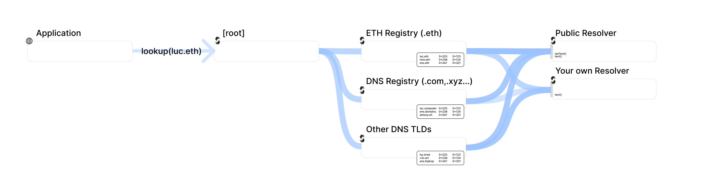
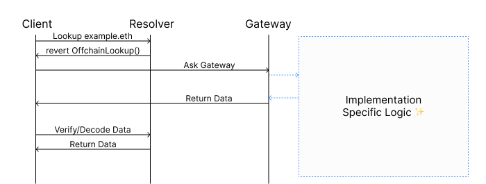
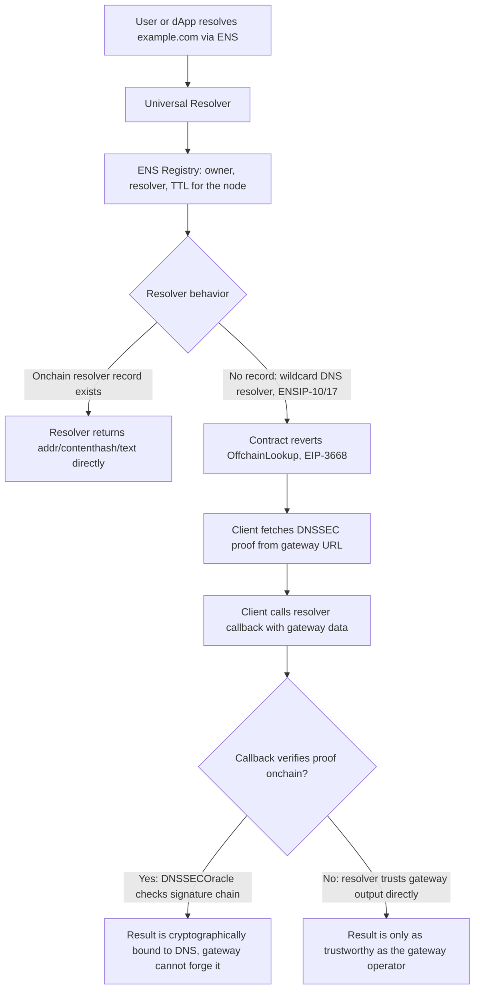
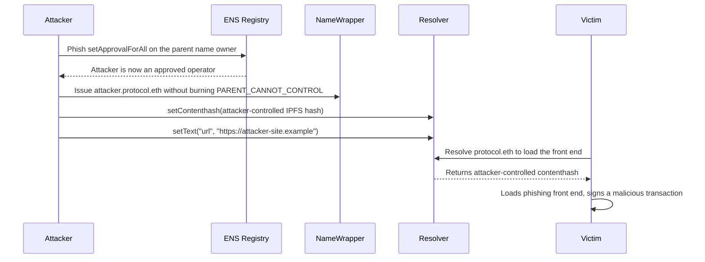
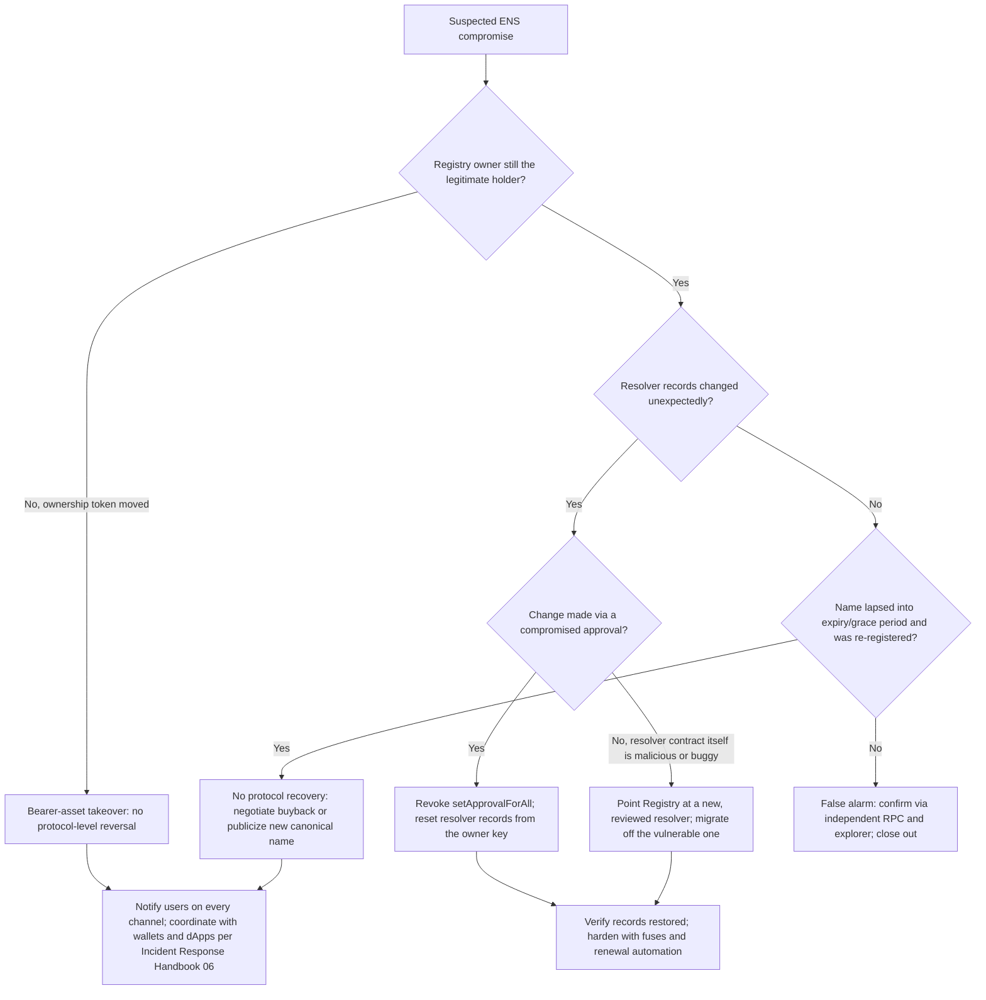

# Part 3: ENS (Ethereum Name Service)

[Back to Handbook contents](index.md) | [Series index](../index.md)

The Ethereum Name Service (**ENS**) turns a 42-character hexadecimal address into a name a human can read and a wallet can display, but the system that makes `vitalik.eth` trustworthy is itself a set of smart contracts, an off-chain resolution path, and a permission model that can be misconfigured or hijacked in ways that echo classic **DNS** failures with different mechanics. This part treats ENS as the Web3-native complement to the DNS material in Part II: the same integrity, ownership, and resolver-trust questions apply, but the failure primitives are resolver takeover instead of registrar hijack, and fuse mismanagement instead of TTL abuse. It works through ENS's data model, its bridge back into traditional DNS, the cross-chain resolution it now supports, the concrete ways a name or resolver gets compromised, a response playbook, and an integration checklist for teams that resolve ENS names in a front end or backend service.

---

## 7. ENS Security Overview

**ENS** is a set of Ethereum smart contracts, standardized starting with [EIP-137](https://eips.ethereum.org/EIPS/eip-137), that map human-readable names to resources: addresses, content hashes, and arbitrary text records. It is not a fork of **DNS**; it is a purpose-built registry with its own ownership, expiry, and resolution rules that happen to interoperate with DNS at specific integration points.

### 7.1 Data Integrity and Ownership


*Figure. ENS resolution is a two-contract decision, not a single lookup: the client namehashes the name, asks the Registry which resolver is authoritative for that node, and then asks that resolver for the requested record. Monitoring only Registry ownership misses a resolver substitution, while monitoring only address records misses a resolver change. Source: [ENS Documentation, Resolution](https://docs.ens.domains/resolution/), documentation visual used with attribution.*

Every **ENS** name reduces to a fixed-length identifier called a node, computed with the `namehash` algorithm defined in EIP-137: hash the empty string to get the root, then recursively hash each label from right to left and combine it with the accumulated hash of its parent. `vitalik.eth` and `mysite.example.eth` both resolve to nodes in constant time regardless of how many labels they contain, which is what lets a single Registry contract index the entire namespace ([EIP-137](https://eips.ethereum.org/EIPS/eip-137)).

The ENS Registry is the source of truth for exactly three things per node: the owner, the resolver address, and a time-to-live (TTL) hint for caching. Nothing else lives in the Registry; addresses, content hashes, and avatars live in whatever resolver contract the node points to. Ownership itself is a bearer asset. Unwrapped second-level `.eth` names are ERC-721 tokens on the base registrar, and names wrapped with the NameWrapper (Section 7.4) are ERC-1155 tokens; either way, whoever holds the token controls the name, with no customer-support desk to call if the key is lost or stolen ([ENS Docs: Architecture](https://docs.ens.domains/learn/architecture)). `.eth` names must also be renewed on-chain before expiry or they enter a grace period and then return to the open market, an ownership-integrity failure mode that mirrors the domain-expiry risk covered in Part II's registrar playbook.

| Registry field | Meaning | Who can change it |
|---|---|---|
| `owner(node)` | Controls the node: can set a new resolver, TTL, or transfer/reassign subnodes | Current owner or an approved operator |
| `resolver(node)` | Address of the contract that answers `addr()`, `text()`, `contenthash()` for this node | Current owner or an approved operator |
| `ttl(node)` | Suggested cache lifetime for resolved records | Current owner or an approved operator |

```bash
# Read-only integrity check: confirm registry state for a name you control.
# NODE is the namehash of the name (EIP-137); ENS_REGISTRY is the current
# mainnet Registry address from the ENS deployments page - verify before use.
cast call "$ENS_REGISTRY" "owner(bytes32)(address)" "$NODE" --rpc-url "$RPC_URL"
cast call "$ENS_REGISTRY" "resolver(bytes32)(address)" "$NODE" --rpc-url "$RPC_URL"
```

### 7.2 ENS and DNSSEC: Gasless DNSSEC via CCIP Read

**ENS** bridges into traditional **DNS** so that anyone who already owns a DNS domain can claim the matching ENS name without a separate on-chain auction. Domain Name System Security Extensions (DNSSEC), the cryptographic chain of trust from the DNS root down to individual records covered in Part II, is what makes that claim verifiable rather than merely asserted.

The original path is expensive: a domain owner publishes a `TXT` record such as `_ens.example.com "a=0xYourAddress"`, then submits a **DNSSEC** proof on-chain to the `DNSRegistrar` contract, which a `DNSSECOracle` contract verifies signature by signature up the chain, at a gas cost that can run into the millions for a deep proof ([ENS Docs: DNS Registry](https://docs.ens.domains/registry/dns)). [ENSIP-17 (Gasless DNS Resolution)](https://docs.ens.domains/ensip/17) removes that cost by combining wildcard resolution with off-chain fetching. The domain owner instead publishes `TXT example.com "ENS1 <resolver-address>"` at the zone apex; when a client resolves `example.com` through ENS and finds no on-chain record, it invokes [EIP-3668 (CCIP Read)](https://eips.ethereum.org/EIPS/eip-3668), fetching the DNSSEC proof from an off-chain gateway and passing it to a callback that verifies the signature chain on-chain before trusting it. The acronym CCIP here refers to the original 2020 "CCIP Read" offchain-lookup proposal in EIP-3668, not the unrelated Chainlink Cross-Chain Interoperability Protocol that shares the same initials; conflating the two is a common and avoidable confusion in Web3 documentation.

The security property that survives the shortcut is the one that matters: the gateway only supplies data, it never supplies trust. The callback still runs the DNSSEC verification on-chain, so a malicious or compromised gateway can withhold or delay a response but cannot forge a valid proof for a domain it doesn't control ([EIP-3668, Security Considerations](https://eips.ethereum.org/EIPS/eip-3668)). That distinction, gateway-as-transport versus gateway-as-authority, is the axis every other CCIP-Read resolver should be judged against, and it recurs in Section 7.4.


*Figure. The official CCIP-Read sequence exposes the security boundary: the resolver returns `OffchainLookup`, the client fetches untrusted data from the named gateway, and the callback validates that response before resolution completes. A client that skips or misroutes the callback converts a verifiable transport into direct gateway trust. Source: [ENS Documentation, CCIP Read](https://docs.ens.domains/resolvers/ccip-read), documentation visual used with attribution.*



*Figure 6. Gasless DNSSEC resolution through CCIP Read. The gateway is a data-fetch convenience; the on-chain callback verification, when present, is what actually establishes trust.*

### 7.3 Cross-Chain and Interface Compliance

**ENS** resolves addresses for chains other than Ethereum mainnet, and getting that resolution wrong sends funds somewhere unrecoverable. [ENSIP-9](https://docs.ens.domains/ensip/9) added multichain address resolution keyed by SLIP-44 coin type, and [ENSIP-11](https://docs.ens.domains/ensip/11) extended it to EVM-compatible chains by deriving a coin type as the chain ID bitwise-OR'd with `0x80000000`, reversible as `coinType & 0x7fffffff`. A wallet or dApp that miscalculates this mapping, for example confusing a chain ID with a legacy SLIP-44 coin type, can derive or display the wrong address for the same name on a different network.

[ENSIP-19 (Multichain Primary Names)](https://docs.ens.domains/ensip/19) extends reverse resolution the same way: a chain-specific reverse namespace lets an address on an L2 have its own primary name, verified by resolving the candidate name forward and confirming it points back to the original address. The specification is explicit that clients must not fall back to a mainnet default name when a chain-specific one is absent, because doing so can present a name that looks correct while actually pointing a transfer at an address the recipient does not control on that chain, which is exactly why ENSIP-19 requires clients to verify chain-specific resolution rather than defaulting.

Interface compliance closes the gap between "the resolver responds" and "the resolver responds correctly." [ENSIP-8 (Interface Discovery)](https://docs.ens.domains/ensip/8) lets a resolver point callers at other contracts that implement a given ERC-165 interface, and ENSIP-10's `IExtendedResolver.resolve()` method should itself be interface-discoverable so a caller knows whether wildcard and CCIP-Read behavior apply before it calls in blind. The [Universal Resolver](https://docs.ens.domains/resolvers/universal), deployed at the vanity address `0xeEeEEEeE14D718C2B47D9923Deab1335E144EeEe`, exists precisely to absorb this heterogeneity: it is the canonical entry point that handles ENSIP-10 wildcard dispatch, EIP-3668 batch gateway calls, and interface checks so individual applications do not each reimplement resolver compliance logic. [Basenames](https://www.base.org/names), Coinbase's naming layer on the Base L2, is a production example of this cross-chain model: it is "built on the same technology powering ENS names, and deployed on Base," inheriting the same resolver-compliance and offchain-lookup trust questions this section raises.

### 7.4 Smart Contract and Resolver Risks

Registry ownership gets the attention, but the resolver is where most real compromises land, because it is the contract that actually answers every `addr()`, `contenthash()`, and `text()` call an application makes. Four risk patterns recur across resolver implementations, and each has a different failure mode:

| Resolver pattern | Trust model | Verified on-chain? | Failure mode |
|---|---|---|---|
| Standard `PublicResolver`, name owner sets records directly | Owner-controlled | Yes, by registry owner check | Owner key or approved operator compromise rewrites records |
| CCIP-Read resolver with on-chain proof verification (for example, the DNSSEC oracle path) | Cryptographically verified | Yes, in the callback | Gateway can censor/delay, cannot forge |
| CCIP-Read resolver that trusts gateway output directly | Gateway-operator-controlled | No | Compromised or malicious gateway operator returns arbitrary data |
| Custom or unaudited resolver deployed by an integrator | Whatever the contract author built | Unknown until reviewed | Logic bugs, missing access control, or silent reverts break resolution for every name pointed at it |

Anyone can deploy a resolver and point their name at it, which means the **ENS** protocol itself does not guarantee resolver quality; that responsibility sits with whoever set the resolver for a given node ([ENS Docs: Resolvers](https://docs.ens.domains/resolvers/universal)). Approval delegation compounds the risk in the same way NFT-drainer phishing does elsewhere: an owner who signs a `setApprovalForAll` for the base registrar or NameWrapper hands the approved address full control over records and, depending on fuse settings, over transfers, without giving up the underlying **private key**. Section 8 walks through how these primitives combine into concrete takeovers.

---

## 8. ENS Threat Model

**ENS**'s **threat model** splits along the same line as its architecture: attacks on who owns a name, and attacks on what a name resolves to. Both can be executed without ever touching the victim's private key directly.

### 8.1 Subdomain and Name Takeover

The NameWrapper wraps names as ERC-1155 tokens and introduces fuses: burnable permission bits that permanently revoke a capability. Fuses come in three groups: parent-controlled fuses that only the parent owner can burn (for example, burning `CAN_EXTEND_EXPIRY` lets a subname owner renew independently), owner-controlled fuses that either party can burn to give something up (`CANNOT_TRANSFER` blocks the wrapped token from moving), and subname fuses the parent sets at creation time to define what the child owner actually gets ([ENS Docs: Name Wrapper](https://docs.ens.domains/wrapper/overview)). The critical one for takeover analysis is `PARENT_CANNOT_CONTROL`: until it is burned, the parent name's owner can reclaim, reassign, or delete any subdomain it issued, no matter who currently "owns" that subdomain's token.

That single fact explains most subdomain-takeover incidents. Protocols that hand out `user.protocol.eth` style subdomains without wrapping the child and burning `PARENT_CANNOT_CONTROL` have, whether they intend to or not, kept a master key: a single compromise of the parent name's owner key or an approved operator on that parent yields control of every subdomain issued under it, in one transaction. Legacy unwrapped subdomains created with `setSubnodeOwner` carry the same property by default, since there is no fuse mechanism to burn at all.

| Actor | Vector | Impact |
|---|---|---|
| External attacker | Phishes a `setApprovalForAll` signature on the base registrar or NameWrapper | Full control of the approved name(s): resolver, subdomains, transfer |
| External attacker | Front-runs or snipes a `.eth` name that lapsed into expiry and grace period without renewal | Permanent loss of the name to the new registrant; no protocol-level recourse |
| Semi-trusted integrator | Issues bulk subdomains without wrapping + burning `PARENT_CANNOT_CONTROL` | Parent-key compromise cascades into every subdomain simultaneously |
| Malicious or compromised parent-name holder | Reclaims a subdomain it issued, even one a legitimate user believed they owned | Silent loss of a user-facing identity (e.g., `alice.dao.eth`) with no user-side signal |

### 8.2 Resolver and Content Manipulation

Once an attacker controls a resolver, whether through a stolen owner key, an abused approval, or a resolver contract with a logic flaw, every record type becomes an **attack surface**. Rewriting `addr()` redirects payments. Rewriting `contenthash()` swaps the **IPFS** or Swarm content a front end serves, handing the front-end-hijack playbook from Handbook 01 an ENS-native delivery vector alongside the DNS and CDN ones already covered there. Rewriting text records such as `url`, `avatar`, or social handles turns the name into a phishing lure that still resolves through a name the victim has learned to trust. Rewriting the reverse record, the primary name an address advertises, is display-only and carries no on-chain authorization weight, but it is exactly what wallets and block explorers show next to an address, so an attacker who sets a trustworthy-looking primary name on a scam address can make that address look legitimate at the exact moment a user is deciding whether to sign.



*Figure 7. A resolver hijack chain: an approval phish becomes a subdomain and content takeover, which becomes a signed transaction the victim believes came from a trusted name.*

---

## 9. Playbook: ENS Name or Resolver Compromise

This playbook specializes the general incident-response process in the **Incident Response** Handbook (06) for the moment a name, resolver, or subdomain under your control starts behaving unexpectedly.

### 9.1 Detection and Verification

Detection has to happen independently of your own front end, because a compromised resolver will happily lie to a compromised or naive client asking it for confirmation. Query the Registry and resolver directly against a public RPC endpoint and cross-check against a block explorer you did not build.

**Detection checklist:**

- [ ] Confirm current `owner(node)` on the Registry matches your known-good address; a mismatch means the ownership token itself moved.
- [ ] Confirm current `resolver(node)` matches the resolver you deployed or intended; a mismatch means someone repointed the name.
- [ ] Diff `addr()`, `contenthash()`, and all `text()` keys you use against your last known-good snapshot.
- [ ] If wrapped, call `getData(tokenId)` on the NameWrapper and confirm the fuse bitmap still matches what you set; an unexpected fuse state can indicate a parent-level or approval-level compromise.
- [ ] Check `expires`/grace-period status on the base registrar; a name in grace period is one renewal transaction away from becoming public again.
- [ ] Enumerate current approved operators (`isApprovedForAll`) on both the base registrar and the NameWrapper for the affected name; revoke anything unrecognized (Section 9.2).
- [ ] Pull recent `Transfer`, `NewOwner`, `NewResolver`, `AddrChanged`, `ContenthashChanged`, and `TextChanged` events for the node from an independent RPC or the **ENS** subgraph to establish a timeline.

```bash
# Independent verification against a public RPC, not your own infrastructure.
cast call "$ENS_REGISTRY" "resolver(bytes32)(address)" "$NODE" --rpc-url "$PUBLIC_RPC_URL"
cast call "$RESOLVER" "addr(bytes32)(address)" "$NODE" --rpc-url "$PUBLIC_RPC_URL"
cast call "$RESOLVER" "contenthash(bytes32)(bytes)" "$NODE" --rpc-url "$PUBLIC_RPC_URL"
cast call "$NAME_WRAPPER" "isApprovedForAll(address,address)(bool)" "$OWNER" "$SUSPECT_OPERATOR" --rpc-url "$PUBLIC_RPC_URL"
```

### 9.2 Recovery and Re-Registration

The recovery path depends entirely on which layer was compromised, and the honest first branch is that some compromises have no protocol-level reversal. **ENS** ownership is a bearer asset: if the **private key** holding the name's token, or the token itself, has moved to an attacker, there is no registrar support desk, no dispute process, and no on-chain undo. That asymmetry is the strongest argument for the preventive controls in Section 10 (multisig or hardware-backed ownership, fuses burned on anything you don't want reclaimed, wrapped names for anything security-sensitive) rather than relying on reactive recovery.

If the compromise is a stolen or phished operator approval rather than the underlying owner key, recovery is direct: call `setApprovalForAll(attackerAddress, false)` from the legitimate owner key on both the base registrar and the NameWrapper, then reset every resolver record to known-good values and, if practical, migrate to a fresh resolver contract. If the resolver contract itself is the problem (a logic bug or a gateway-trust model you no longer accept per Section 7.4), point the Registry at a new, reviewed resolver rather than patching in place. If the name lapsed into expiry and was re-registered by a third party, there is no reclamation mechanism comparable to a Uniform Domain-Name Dispute-Resolution Policy (UDRP) process in traditional **DNS**; your options are negotiating a purchase from the new holder or publicizing a new canonical name across every channel your users trust.



*Figure 8. ENS incident triage. The first branch determines whether recovery is even possible at the protocol level, which is why prevention (Section 10) carries more weight here than in most infrastructure playbooks.*

---

## 10. Best Practices for ENS Integration

The controls below sit at the application layer: what a dApp, wallet, or backend service should do every time it turns user input into a resolved **ENS** record or turns a resolved record into something rendered on screen.

<!-- pdf-checklist-start-at-parent -->
### 10.1 Name Handling and Validation

Never resolve or register a name without first running it through [ENSIP-15 name normalization](https://docs.ens.domains/ensip/15), implemented in the reference `ens-normalize.js` library. Normalization strips zero-width characters, enforces a fixed Unicode version, and applies whole-script confusable detection so that a label using, for example, Cyrillic characters that render nearly identically to Latin ones is rejected rather than silently accepted as a different, colliding name ([ENS blog: How ENS Normalization Works](https://www.ens.domains/blog/post/how-ens-normalization-works)). Reject non-normalized input outright rather than auto-correcting it; auto-correction can silently resolve a user's typed name to a different node than the one they saw on screen.

```javascript
// Always normalize before resolving or displaying an ENS name.
import { normalize } from '@adraffy/ens-normalize';

function safeResolveInput(rawInput) {
  let name;
  try {
    name = normalize(rawInput); // throws on disallowed/confusable input
  } catch (err) {
    throw new Error('Name failed ENSIP-15 normalization; refusing to resolve');
  }
  return name;
}
```

Beyond normalization, treat every resolver as untrusted until it proves otherwise: check `supportsInterface` before calling `resolve()` on a name that might route through ENSIP-10 wildcard or CCIP-Read logic, and never treat a reverse (primary) name as an authorization signal, since any address holder can set an arbitrary primary name that has no bearing on whether that address should be trusted (Section 8.2). Re-resolve on every session rather than caching indefinitely; ownership, resolver, and fuse state can all change between one user visit and the next.

**Validation checklist:**

- [ ] Run all user-supplied names through ENSIP-15 normalization before any resolution or registration call.
- [ ] Reject, don't silently correct, names that fail normalization.
- [ ] Verify resolver interface support before calling extended or CCIP-Read resolution paths.
- [ ] Treat reverse/primary names as display hints only, never as **access control**.
- [ ] Re-resolve rather than cache across sessions for anything security-relevant.

### 10.2 Referral and Forwarding Security

Two integration patterns deserve their own checks because they route trust decisions through data the **ENS** protocol itself does not authenticate. First, a growing number of registration front ends, wallets, and subname-issuing platforms attribute `.eth` registrations and renewals to whichever integrator originated them, for revenue sharing or attribution. Wherever your integration passes or receives such an attribution parameter, treat it as untrusted input to be logged and sanity-checked, never as an implicit permission or identity signal; it routes fee accounting, not **access control**, and should never gate a state-changing action on its own.

Second, "forwarding" through ENS records is common: a `contenthash` record points a subdomain at **IPFS** or Swarm content, and some integrations additionally use a `url` text record to redirect a visit to a conventional website. Validate the scheme and host of any URL-based forwarding target before navigating a user to it; an unchecked `url` text record is an open-redirect vector sourced from a decentralized record instead of a query-string parameter, and it deserves the same scrutiny as any other redirect target. Prefer content-addressed targets, a `contenthash` pointing at a specific IPFS content identifier (CID), over arbitrary HTTP(S) URLs, since a CID is self-verifying in the way a bare URL is not; this is the same principle behind the Subresource Integrity controls in the CDN and Front-End Supply Chain Handbook (01), applied to a different record type. Finally, if your resolution path invokes CCIP-Read (Section 7.2), remember that the gateway URLs a resolver returns are outside your **trust boundary** by default; EIP-3668 itself recommends disabling CCIP Read for the specific case of preparing a transaction unless the response is independently verified on-chain ([EIP-3668](https://eips.ethereum.org/EIPS/eip-3668)).

---

**Key controls for Part 3**

- Verify Registry owner and resolver state against an independent RPC and block explorer, never only your own front end.
- Wrap security-sensitive subdomains with the NameWrapper and burn `PARENT_CANNOT_CONTROL` so a parent-key compromise cannot cascade.
- Judge every CCIP-Read resolver by whether its callback cryptographically verifies gateway data or merely trusts it.
- Verify chain-specific resolution under ENSIP-19 instead of falling back to a mainnet default name for cross-chain transfers.
- Run all user-supplied names through ENSIP-15 normalization and reject failures outright.
- Treat reverse (primary) names, referral parameters, and `url` text records as display or attribution data only, never as authorization.
- Renew `.eth` names before grace-period expiry; there is no protocol-level recovery once a name is re-registered by someone else.

