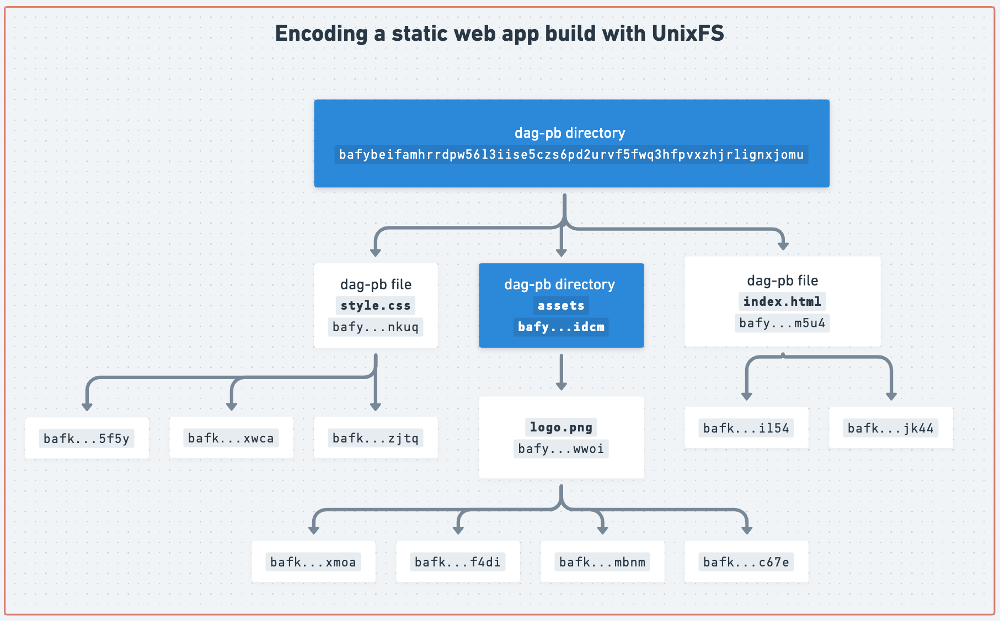
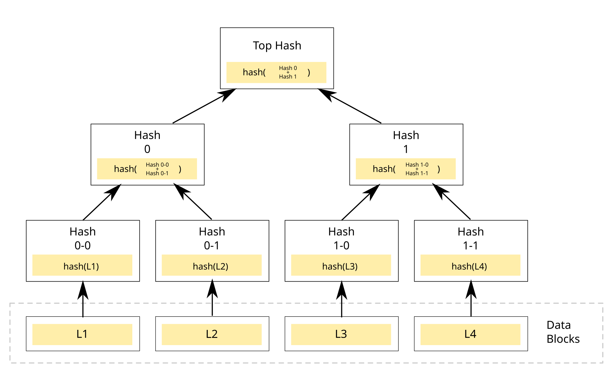
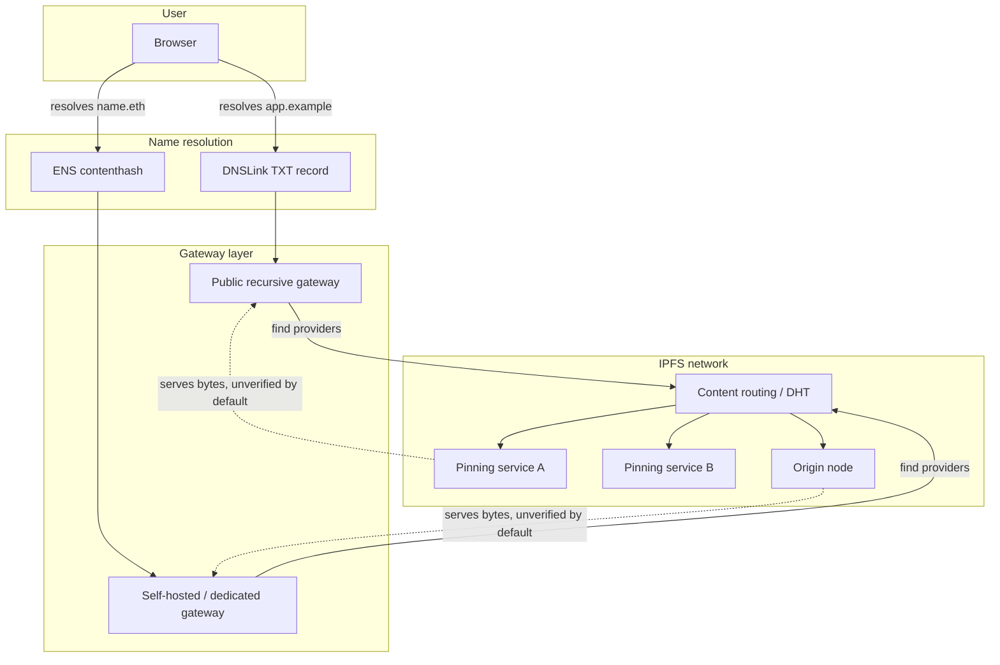
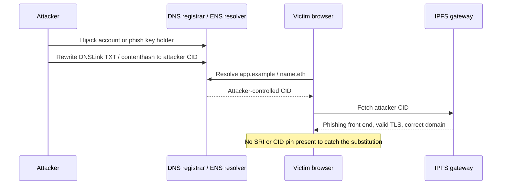
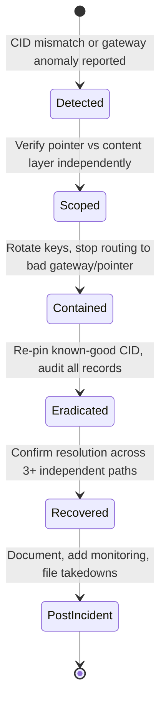

# Part 4: IPFS and Decentralized Hosting

[Back to Handbook contents](index.md) | [Series index](../index.md)

Many Web3 teams move their front end onto the InterPlanetary File System (**IPFS**) to escape a single **DNS** registrar or CDN account as a point of failure, then discover that decentralized hosting trades one trust problem for three others: which gateway resolved the request, who is still pinning the content, and whether anyone can be compelled to take it down. This part explains how IPFS content addressing actually secures (and fails to secure) a dApp front end, builds a threat model around the gateway and pinning layers where most real incidents occur, and closes with an incident playbook and a hardening checklist.

---

## 11. IPFS Security Overview

**IPFS** is a peer-to-peer, content-addressed storage and distribution protocol: instead of asking "give me whatever is at this location" (the HTTP model), a client asks "give me the content whose hash is exactly this" ([IPFS docs: content addressing](https://docs.ipfs.tech/concepts/content-addressing/)). That single design choice is the source of both IPFS's security value and its most common Web3 deployment mistakes, which the next two sections unpack before Chapter 12 turns them into a **threat model**.

### 11.1 Content Addressing and Integrity

Every object stored on IPFS is identified by a Content Identifier (CID), a self-describing label built from three components under the [multiformats](https://multiformats.io/) family: a **multihash** (the cryptographic digest, SHA-256 by default), a **multicodec** (how to interpret the retrieved bytes) and a **multibase** (how the whole thing is text-encoded). Change one byte of the underlying content and the digest changes, so the CID changes. This is the property teams reach for when they say "IPFS gives us integrity by default": a CID is not a location, it is a claim about content, and any node that returns bytes not matching that claim has failed verification, full stop ([IPFS docs: content addressing](https://docs.ipfs.tech/concepts/content-addressing/)).

Two details trip up engineers new to the model. First, a CID does **not** equal a checksum of the raw file. When you add a file to **IPFS** it is chunked (commonly into 256 KiB blocks), organized into a Merkle DAG (Directed Acyclic Graph), and the CID hashes the root of that DAG, not the flat file bytes; running `sha256sum` on the original file will not match the multihash inside the CID.


*Figure. A concrete UnixFS DAG rather than an abstract binary tree. Large file blocks sit at the leaves, intermediate nodes encode links to those blocks, and the root CID commits transitively to every link and chunk. Investigators must retain the whole reachable DAG: preserving only the root block does not preserve the file it names. Source: [IPFS Documentation, Content Lifecycle](https://docs.ipfs.tech/concepts/lifecycle/), documentation visual licensed under the IPFS documentation project's open-source terms.*


*Figure. The general hash-tree construction behind a Merkle DAG. IPFS's CID is functionally the "Top Hash" of a tree built this way over a file's chunks, which is why changing any single leaf block changes every hash above it, all the way up to the CID itself. Source: [Wikimedia Commons](https://commons.wikimedia.org/wiki/File:Hash_Tree.svg), CC0 1.0 (public domain).*

Second, there are two CID versions in active use. **CIDv0** is a fixed Base58 encoding that always starts with `Qm` (46 characters). **CIDv1** adds an explicit multibase prefix and multicodec, and is required for subdomain-based gateway hosting because it can be encoded as a DNS-label-safe string ([IPFS docs: CID versions](https://docs.ipfs.tech/concepts/content-addressing/)). A front end pinned under a CIDv0 identifier cannot be served with per-origin isolation on a subdomain gateway without first converting it to CIDv1; treat that conversion as a deployment step, not an afterthought.

```
CID anatomy (CIDv1, base32):
  bafybeigdyrzt5sfp7udm7hu76uh7y26nf3efuylqabf3oclgtqy55fbzdi
  └┬┘└┬┘└──────────────────┬───────────────────────────────┘
   │  │                    │
   │  │                    digest bytes (multihash payload)
   │  multicodec + multihash function id, multibase-encoded
   multibase prefix ('b' = base32)
```

**Content addressing** gives you a verification primitive, not automatic security. A malicious file has a perfectly valid CID; IPFS proves the bytes you received match the CID you requested, it says nothing about whether the CID you requested was the right one. That distinction is why Section 11.2 and Chapter 12 exist: the CID is only as trustworthy as the channel that told you what CID to fetch.

### 11.2 Gateway and Pinning Trust

Most users and most dApp front ends never run a full IPFS node. They reach content through an **HTTP gateway**, a bridge process that speaks IPFS on one side and plain HTTPS on the other, and they rely on a **pinning service** to keep the content available on the network at all. Both are trust delegations, and both differ sharply from the CDN model covered in Part 2 of this handbook.

Gateways come in three resolution styles, per the [IPFS HTTP Gateway specification](https://specs.ipfs.tech/http-gateways/):

| Style | URL shape | Origin isolation | Recommended for |
|-------|-----------|-------------------|------------------|
| Path gateway | `https://gateway.example/ipfs/{CID}/index.html` | None, all CIDs share the gateway's origin | Quick fetches, never for hosting an app |
| Subdomain gateway | `https://{CID}.ipfs.gateway.example/index.html` | Full, each CID gets its own browser origin | Hosting a dApp front end |
| DNSLink gateway | `https://app.example/` (via `_dnslink.app.example` TXT record) | Depends on the DNS record's target CID | Human-readable production URLs |

Path-style gateways violate the same-origin policy: two unrelated pieces of content served under `/ipfs/CID-A/` and `/ipfs/CID-B/` share one browser origin, so a malicious CID can read cookies, local storage, or DOM state left behind by a legitimate one hosted on the same public gateway ([IPFS docs: IPFS gateway](https://docs.ipfs.tech/concepts/ipfs-gateway/)). This is not a theoretical footnote; it is the reason the specification recommends subdomain gateways for anything that runs application code.

The deeper trust question is what a gateway actually guarantees. A **recursive** public gateway (ipfs.io, dweb.link, and similar) fetches content on your behalf from the wider network and hands you the result over ordinary HTTPS: you are trusting that operator's honesty and its TLS termination, exactly as you would trust any web host, unless you separately verify what it returned. A **trustless** gateway response, by contrast, can be requested in [CAR (Content Addressable aRchive) format](https://specs.ipfs.tech/http-gateways/trustless-gateway/): the client receives the raw DAG blocks and hashes them itself, so a dishonest or compromised gateway cannot substitute content without the client detecting the mismatch. Few dApp front ends implement this verification themselves; most simply point an `` or `<script>` tag at a gateway URL and trust it, which reintroduces exactly the "trust the host forever" failure mode Part 2 spent an entire chapter eliminating for CDNs.

Pinning is the second, orthogonal trust delegation. **IPFS** nodes garbage-collect data they are not explicitly told to retain, so content that nobody pins can silently vanish from the network the moment the last node holding it goes offline: "IPFS guarantees that any content on the network is discoverable, it doesn't guarantee that any content is persistently available" ([IPFS docs: persistence, pinning, and garbage collection](https://docs.ipfs.tech/concepts/persistence/)). Commercial pinning services (Pinata, Filebase, [Storacha Network](https://github.com/storacha), formerly web3.storage) exist precisely to hold that guarantee on your behalf, typically backed by storage deals on the Filecoin network. That guarantee is a business relationship with its own single point of failure: an expired card, a terminated account, or a shut-down service silently converts your "decentralized" front end into a 404.

---

## 12. Threat Model for IPFS

The failure modes below are not exotic. Every one has a documented real-world instance or a standing, actively exploited pattern. Model them the same way Part 1 modeled the CDN and dependency surfaces: by actor, by entry point, and by the control that closes it.



*Figure 1. The IPFS resolution path for a Web3 front end. Each arrow is a place where the wrong answer can be substituted: a poisoned DNSLink record, a compromised gateway, or a pinning provider that has quietly stopped serving.*

### 12.1 Gateway Compromise and MITM

A gateway sits exactly where a CDN edge node sits in Part 2's model, and it inherits the same power: it can read every request and, if operating as a recursive (non-verifying) gateway, rewrite every response before it reaches the browser. Three concrete failure paths matter here.

**Operator-level compromise.** If an attacker gains control of a public or dedicated gateway's infrastructure (compromised credentials, a malicious insider, or a coerced operator), they can serve substituted bytes for a requested CID as long as the client is not independently verifying the CAR response. This is architecturally identical to a CDN compromise, with one added wrinkle: because most gateways are third-party public infrastructure rather than something the protocol team provisions and monitors, detection is even less likely.

**DNSLink and ENS pointer hijack.** A production dApp usually resolves a human-readable name to a CID through a DNSLink TXT record (`_dnslink.app.example` → `/ipfs/CID`) or an Ethereum Name Service (ENS) `contenthash` record defined by [EIP-1577](https://eips.ethereum.org/EIPS/eip-1577), which lets an ENS name resolve directly to IPFS, IPNS (InterPlanetary Name System, IPFS's mutable-pointer scheme), or Swarm content instead of a traditional IP address. Both are pointers, and a pointer is only as safe as who can write to it. A DNSLink record is exactly as vulnerable to registrar or DNS-provider hijack as the A/AAAA record hijacks covered in Part 2 of this handbook; the [OWASP Web3 Attack Vectors Top 15](https://scs.owasp.org/sctop10/Web3-Attack-Vectors-Top15/) tracks this class as **WA13, DNS, Domain and Routing Hijacking**. An ENS `contenthash` record is only as safe as the private key or multisig that controls the name; if that key is phished or the resolver's owner account is compromised, an attacker republishes the same human-readable name against a CID they control, and every wallet extension and browser that resolves `name.eth` serves the attacker's front end with the domain's full apparent legitimacy intact.

**Malicious or squatted CID served as "the app."** Because CIDs are simply strings, a phishing operator can host a pixel-perfect clone of a dApp's UI under their own CID and their own gateway subdomain, then distribute the link through search ads, Discord, or Twitter/X. The **IPFS** network never distinguishes "this is the real app" from "this is a plausible clone"; only the DNSLink or ENS name binding does that. Treat name-to-CID resolution as the actual trust boundary, not the IPFS layer beneath it.



*Figure 2. Gateway compromise is rarely needed when the pointer (DNSLink or ENS contenthash) can be hijacked directly. The user's browser shows a correct domain and valid certificate throughout.*

This class of attack has hit production dApps repeatedly through the **DNS** half of the equation covered in Part 2; the IPFS-specific variant substitutes an **ENS** resolver or DNSLink write for a registrar account takeover, but the endgame, a front end that requests malicious signatures under the real domain, is identical.

### 12.2 Pinning and Availability Abuse

Availability is a security property for a dApp front end, because if the only path to a user's funds goes dark, the practical effect on the user is indistinguishable from a successful attack. Two distinct failure modes live here.

**Silent unpinning.** If your deployment pipeline pins a build to exactly one pinning service and that service terminates the account (non-payment, policy violation, outage, or business shutdown), the content is garbage-collected off that provider's nodes on its normal schedule. Nothing announces this; the CID simply stops resolving once no node on the network still holds it. Commercial pinning has undergone real consolidation: Protocol Labs' web3.storage service migrated and rebranded to [Storacha Network](https://github.com/storacha), built around the `w3up` protocol stack, and providers change terms and free-tier availability on their own schedule. A single-provider pin is a single point of failure with the same **blast radius** as a single-registrar domain.

**Public gateway abuse and rate limiting.** Public recursive gateways are expensive to run and are a favorite target for anonymous bulk retrieval, including malware and phishing kit distribution (Section 12.3). Gateway operators respond with aggressive rate limiting, CAPTCHA challenges, or outright blocking of ranges and CIDs, and legitimate dApp front ends that depend on a shared public gateway inherit that operator's abuse-response posture. A front end hardcoded to `https://ipfs.io/ipfs/{CID}` degrades for every user the moment that specific gateway throttles the request pattern your app happens to generate, even though your content is not the abusive traffic.

**DHT-level denial and eclipse risk.** Content discovery on the public **IPFS** network runs over a Kademlia-style Distributed Hash Table (DHT) that peers use to find which nodes currently hold a given CID's blocks ([IPFS docs: nodes and network layer](https://docs.ipfs.tech/concepts/nodes/)). Kademlia-family DHTs are documented in the academic literature as vulnerable to Sybil attacks (an attacker floods the routing table with nodes they control) and eclipse attacks (an attacker surrounds a target node with malicious peers, isolating it from honest ones), the same class of routing-layer attack studied for BitTorrent's Mainline DHT and other Kademlia deployments. For a Web3 team, the practical mitigation is not "fix the DHT," it is "do not depend on the public DHT alone to make your production front end reachable": pin to multiple independent providers and, for anything traffic-sensitive, front the content with a dedicated gateway you operate rather than relying purely on ad hoc peer discovery.

| Availability failure | Root cause | Primary control |
|-----------------------|-----------|-------------------|
| Silent unpinning | Single pinning provider, account lapse or shutdown | Pin to 2+ independent services; monitor pin status |
| Public gateway throttling | Shared abuse-prone infrastructure | Operate or pay for a dedicated gateway; multi-gateway fallback |
| DHT Sybil / eclipse | Kademlia routing layer has no default Sybil resistance | Do not rely on DHT discovery alone for production traffic |
| Provider business exit | Startup or product shutdown (rebrand, sunset, acquisition) | Contractual SLA, own a Filecoin storage deal directly, re-pin on notice |

### 12.3 Content and Censorship Considerations

**IPFS**'s resistance to takedown is a double-edged property, and Web3 teams need to threat-model both edges. On one side, the same persistence that protects a legitimate dApp front end from a single **DNS** or hosting takedown also protects malicious content. [Cisco Talos has documented sustained abuse of IPFS gateways](https://blog.talosintelligence.com/ipfs-abuse/) for phishing kit hosting (fake Microsoft and DocuSign login pages reached through spoofed PDF lures) and as a payload delivery channel for malware families such as Agent Tesla downloaders, precisely because "anyone can set up an IPFS gateway" and takedown of one gateway or one pin does not remove the content from the wider network as long as any other node retains it. The consequence for your protocol: enterprise security stacks increasingly rate-limit or block IPFS gateway domains outright at the network perimeter as a blanket anti-abuse measure, which can degrade your legitimate front end for users behind those controls with no action on your part.

On the other side, "censorship-resistant" is a claim about the protocol layer, not about every implementation detail of a given deployment. A dApp that resolves through a single **ENS** name controlled by one signer, backed by pins held at one commercial provider, and served predominantly through one public gateway has recreated a single point of legal and operational pressure at each layer, even though the underlying storage protocol is peer-to-peer. Gateway operators are commercial entities in identifiable jurisdictions that do receive and act on takedown requests for specific CIDs; a pinning provider can be compelled to stop serving a customer; an ENS name's controlling key can be subpoenaed or, if custodial, frozen. None of this makes IPFS a poor choice, it means resilience has to be engineered deliberately across gateways, pinning providers, and name-resolution paths rather than assumed from the protocol's marketing.

Design for graceful degradation rather than an illusion of unstoppability: publish the raw CID prominently (GitHub repo, ENS text record, social channels) so a user whose primary gateway blocks or censors a specific CID can retrieve identical content through any other gateway or a local Kubo node.

---

## 13. Playbook: IPFS Gateway or Pinning Incident

Treat an IPFS-layer incident with the same discipline as the CDN **incident response** covered elsewhere in this handbook series, adapted for the specific signals this stack produces. Work the phases in order; do not skip verification before communicating a root cause.

**Phase 1: Detect and scope (minutes 0-15).**
- Confirm the CID currently being served does not match the last known-good CID published in your release records or Git tag.
- Check whether the anomaly is at the pointer layer (DNSLink TXT record, **ENS** `contenthash`) or the content layer (a specific gateway returning wrong bytes for the correct CID).
- **Pull the DNSLink TXT record directly:** `dig TXT _dnslink.app.example +short`. Compare it against your source-controlled deployment manifest.
- Query the ENS `contenthash` directly against a resolver you trust (not through the app's own front end, which may itself be compromised):
  ```bash
  cast call $(cast resolve-ens name.eth) "contenthash(bytes32)(bytes)" $(cast namehash name.eth) --rpc-url $RPC_URL
  ```
- Test at least three independent gateways (a public one, a dedicated/paid one, and a local Kubo node if available) with the *same* CID to isolate whether the problem is one gateway or the pointer itself.

**Phase 2: Contain (minutes 15-60).**
- **If the pointer was hijacked:** rotate the compromised credential or ENS-controlling key immediately, and if the name is behind a **multisig** or timelock, trigger the emergency revocation path defined in your incident response runbook (see the Incident Response Handbook, 06).
- **If a specific gateway is serving substituted content:** stop directing users to it. Update any hardcoded gateway URL in your front end's fallback list and push the change through your normal deploy path, not through the compromised path.
- Publish an out-of-band notice (status page, verified social account, GitHub release) stating the last-known-good CID in full, so users can bypass any compromised resolution path and fetch the correct content directly by CID.

**Phase 3: Eradicate and recover.**
- Re-pin the known-good CID across every configured pinning provider and confirm pin status via each provider's API, do not assume the pin survived the incident.
- If the ENS name or DNSLink zone was compromised, audit every record the attacker could have touched, not only the one that was visibly wrong; contenthash hijacks are frequently paired with resolver-level changes that persist after the obvious symptom is fixed.
- Rotate all keys with write access to the ENS name, the **DNS** zone, and every pinning service account involved.

**Phase 4: Post-incident.**
- Document the exact pointer chain (registrar → DNS/ENS → gateway → pin) that failed and which link broke.
- Add the failed pointer to automated monitoring (Chapter 14) so the same class of failure alerts before a user reports it.
- If the incident involved phishing content served under your name, file takedown requests with the specific gateway operators serving it and, where applicable, report the abusive CID to the pinning provider hosting it.



*Figure 3. Incident lifecycle for an IPFS gateway or pinning compromise. Scoping happens before containment because the fix for a hijacked pointer and the fix for a compromised gateway are different actions taken by different owners.*

---

## 14. Best Practices for IPFS in Web3

Consolidate the controls implied across this part into a deployment standard your team can audit against.

- **Pin to at least two independent providers.** Never let a single commercial pinning service be the sole reason your content still exists on the network; treat this the same way Part 2 treats multi-CDN redundancy.
- **Verify, don't trust, gateway responses where it matters.** For anything security-sensitive, request [trustless CAR responses](https://specs.ipfs.tech/http-gateways/trustless-gateway/) and hash-verify locally instead of accepting a recursive gateway's word for it; at minimum, publish the CID alongside a conventional SRI-style hash a user's tooling can cross-check.
- **Use CIDv1 and subdomain gateways for anything that runs code.** Path-style gateway hosting breaks origin isolation; it is acceptable for static data retrieval, never for a front end that signs transactions.
- **Treat the name-to-CID pointer as the actual trust boundary.** Secure the **ENS** `contenthash` owner key and the DNSLink zone with the same rigor Part 2 and Part 3 of this handbook apply to registrar accounts and ENS ownership: hardware-backed signers, multisig or timelock for changes, and monitoring on every write.
- **Monitor the deployed CID continuously.** Poll your production DNSLink record and ENS `contenthash` on a schedule and alert on any value that does not match your release manifest; this is the IPFS-layer equivalent of certificate transparency monitoring.
- **Publish the canonical CID out of band.** Keep the current CID visible in your GitHub repository, ENS text records, and verified social channels so users have a way to bypass a compromised gateway or **DNS** path entirely.
- **Plan for gateway blocking as a normal operating condition, not an edge case.** Offer a self-hosted or dedicated gateway option and document how technical users can run a local Kubo node against your CID directly, since enterprise networks increasingly block public **IPFS** gateway domains wholesale.
- **Back critical pins with a direct storage relationship**, such as a Filecoin storage deal you hold rather than one mediated entirely through a single reseller, so a provider's business decisions cannot unilaterally end your content's availability.

**Key controls for Part 4**

- Multi-provider pinning with active pin-status monitoring, never a single pinning service as the sole source of availability.
- CIDv1 plus subdomain gateway hosting for any front end that executes code or requests signatures.
- Trustless (CAR-verified) retrieval, or at minimum a published CID/hash, for security-sensitive content instead of blind trust in a recursive gateway.
- Hardware-backed, multisig-protected control of the ENS `contenthash` owner key and the DNSLink DNS zone, with continuous monitoring for unauthorized changes.
- An incident playbook that scopes pointer-layer versus content-layer failure before attempting containment.

