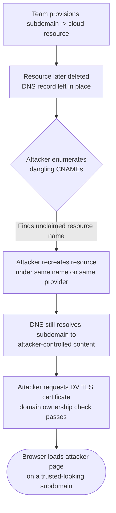
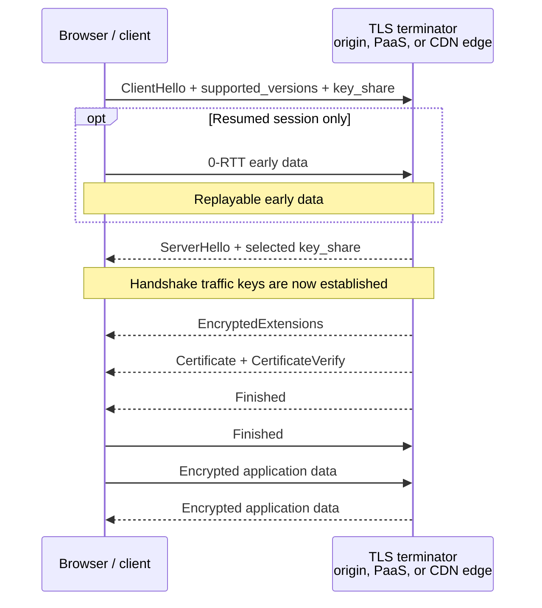
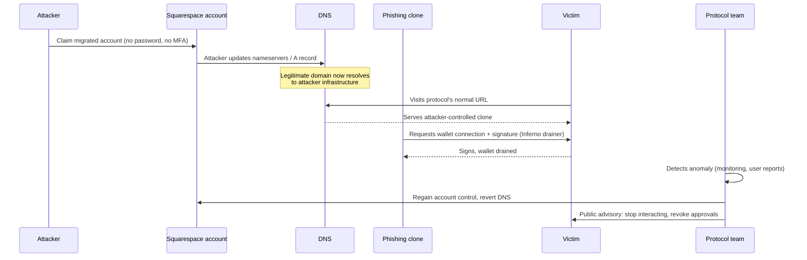

# Part 5: Hosting and Web Presence

[Back to Handbook contents](index.md) | [Series index](../index.md)

**DNS** and **ENS** answer "where do I send the user," but something still has to answer at the other end: a virtual private server (VPS), a cloud platform account, an object storage bucket, or a static-hosting provider that holds the actual front-end bundle. This Part treats that hosting layer as its own trust boundary, draws a firm line between it and the CDN and DNS layers covered elsewhere in this series, and gives you a playbook for the moment a front end shows attacker-controlled content instead of your own.

---

## 15. Traditional Hosting (VPS, Cloud) and Web3

Most Web3 teams describe their stack as "decentralized" while their marketing site, documentation, and often the dApp front end itself sit on entirely conventional infrastructure: a VPS from a provider like DigitalOcean or Linode, a Platform-as-a-Service (PaaS) such as Vercel or Netlify, or a storage bucket on Amazon Web Services (AWS) S3 or Google Cloud Storage (GCS) fronted by a content delivery network (CDN). None of that is a mistake. Conventional hosting is fast, cheap, and operationally simple compared with fully decentralized alternatives, and Part 4 already covered the trust tradeoffs **IPFS** makes to avoid it. What matters is that the team treats this layer with the same rigor it applies to a smart contract's **access control**: someone owns the account, that account has credentials, and whoever holds those credentials controls exactly what code a user's browser executes.

The account-takeover attack pattern here mirrors the registrar compromises in Part 2, only one layer downstream: instead of repointing where a domain resolves, the attacker changes what the destination serves. [MITRE ATT&CK T1078.004, Valid Accounts: Cloud Accounts](https://attack.mitre.org/techniques/T1078/004/), catalogs exactly this technique, noting that adversaries who obtain legitimate cloud credentials through phishing, credential stuffing, or leaked API keys can establish persistence and modify resources with the same authority as the legitimate operator, often without triggering any alert that assumes "if the login succeeded, it was the owner." A cloud console session is functionally equivalent to a registrar session or a signing key: whoever holds it, publishes.

### 15.1 Front-End Hosting and Integrity

Hosting models fall into three broad shapes, and each shifts different responsibilities onto the team. A self-managed VPS gives full control of the operating system, web server, and TLS termination, which means the team owns patching, SSH key hygiene, and firewall configuration directly; a compromised SSH key or an unpatched service is a direct path to arbitrary content substitution. A PaaS such as Vercel, Netlify, or Cloudflare Pages removes server management but concentrates trust in the platform account: whoever can push a deployment, or hold an API token with deploy scope, controls production. Object storage behind a CDN (S3 or GCS behind CloudFront or Cloud CDN) removes the server entirely, but the bucket's access policy becomes the whole **security boundary**, and a public-write misconfiguration or a leaked service-account key is as good as root.

Two structural properties of PaaS and CI/CD-driven hosting are worth calling out because they change the shape of the **threat model** rather than just relocating it. First, most of these platforms build from source on every push, so the CI/CD pipeline itself, not only the hosting console, is a place an attacker can inject code; the [OWASP Secrets Management Cheat Sheet](https://cheatsheetseries.owasp.org/cheatsheets/Secrets_Management_Cheat_Sheet.html) applies directly here, since a deploy-scoped API token embedded in a workflow file or a poorly scoped CI secret is functionally a master key to the front end. Second, immutable, versioned deployments (each build produces a new, addressable artifact rather than overwriting one mutable "production" target in place) make rollback trivial and give you an audit trail of exactly what was live at what time, an approach with deep roots in [Kief Morris's immutable server pattern](https://martinfowler.com/bliki/ImmutableServer.html) and directly applicable to how modern PaaS platforms already build and promote deployments.

A quieter failure mode is the dangling **DNS** record: a team provisions a subdomain that points to a cloud resource (an S3 bucket, a Heroku app, an Azure endpoint), later deprovisions that resource, and forgets to remove the CNAME. Because the DNS record still resolves, an attacker who notices the dangling pointer can claim the same resource name on the same provider and have the subdomain now serve their content, with a valid TLS certificate issuable in minutes because domain-validated certificate authorities only check that the requester controls the (now attacker-owned) resource. The [`can-i-take-over-xyz` project](https://github.com/EdOverflow/can-i-take-over-xyz) catalogs more than one hundred cloud and SaaS providers by exactly this fingerprint, and its "vulnerable" list includes major object storage and static-hosting services when a bucket or app name is deleted without first removing the pointing record.

*Figure 1. Subdomain takeover through a dangling DNS record. No credential is stolen; the attacker only needs the deprovisioned resource name and a provider account.*

Every row in the table below assumes multi-factor authentication (MFA) enforced with a hardware security key, not a one-time code delivered by SMS or a software authenticator an attacker can re-enroll through a support ticket, as the non-negotiable baseline; the differences between hosting models are in what gets layered on top of that baseline.

| Hosting model | Who holds the trust boundary | Primary failure mode | Primary control |
|---|---|---|---|
| Self-managed VPS | SSH keys, OS patch level, firewall rules | Leaked key, unpatched service, exposed management port | Key rotation, [CIS-benchmarked hardening](https://www.cisecurity.org/cis-benchmarks), no direct-internet SSH |
| PaaS (Vercel, Netlify, Cloudflare Pages) | Platform account, deploy-scoped tokens, connected Git integration | Stolen account session, over-scoped CI token, unreviewed preview deploy promoted | Hardware-key MFA, least-privilege deploy tokens, branch protection on the deploying branch |
| Object storage + CDN (S3/GCS + CloudFront) | Bucket/IAM policy, service-account keys | Public-write bucket policy, leaked service-account key, dangling record after deprovisioning | Least-privilege IAM (per the [AWS Well-Architected Security Pillar](https://docs.aws.amazon.com/wellarchitected/latest/security-pillar/welcome.html)), bucket policy review, DNS inventory hygiene |
| IPFS-pinned static build | Pin service account, ENS content-hash owner | See Part 4 | See Part 4 |

The common thread across every row is that the hosting account is a signing key in every practical sense: whoever can authenticate to it can publish arbitrary content to every user who trusts your domain. Hardware-key MFA, least-privilege API tokens scoped to a single project rather than the whole organization, and a maintained inventory of every DNS record and the cloud resource it points to are the three controls that close the largest share of this chapter's incidents.

*Figure. TLS 1.3 full-handshake flow. Messages after `ServerHello` are encrypted, the legacy TLS 1.2 key-exchange sequence is gone, and `ChangeCipherSpec` is not part of the cryptographic state transition (except as an optional middlebox-compatibility artifact). Whoever controls this termination point controls the certificate and application bytes the browser accepts, which is why TLS 1.3, HSTS, and strict protection of the hosting or CDN account are one control chain.*

### 15.2 Overlap with CDN and Supply Chain Handbook

This handbook and the [CDN and Front-End Supply Chain Security Handbook (01)](../01-frontend-cdn-supply-chain/index.md) describe adjacent, easily confused layers, and the boundary is worth stating precisely so a team does not assume the other handbook's controls cover a gap this one leaves open. This handbook's hosting chapter is about **where the origin content lives and who can change it**: the VPS, the PaaS account, the storage bucket. Handbook 01 is about **what happens to that content on its way to and inside the browser**: Subresource Integrity (SRI) pinning, Content Security Policy (CSP), CDN cache behavior, and the build pipeline that produces the artifact in the first place. A hosting compromise changes the source; a CDN or supply-chain compromise changes or misuses something downstream of a correct source. Both end in the same place, a user's browser executing attacker-chosen code, so both need controls, and neither substitutes for the other.

The BadgerDAO incident of December 2, 2021 shows why the boundary matters in practice rather than only in theory. Attackers had, over a window beginning around November 20, [inserted malicious token-approval prompts into BadgerDAO's live front end](https://www.smartcontractaudit.com/hacks/badger-2021) by compromising the team's Cloudflare account and using Cloudflare Workers, an edge-compute feature that intercepts and can rewrite responses before they reach the browser, to inject a script that requested unlimited spending approval from any wallet that connected. More than 500 addresses granted the approval before the team paused the affected contracts roughly two hours and twenty minutes after mass draining began on December 2, and losses reached approximately $120 million in wrapped Bitcoin and ERC-20 tokens. No VPS was touched and no origin bucket was modified; the compromise lived entirely in the CDN account layer, which is why Handbook 01's SRI and CSP guidance, not this handbook's hosting hardening, is the direct countermeasure (a strict CSP would have blocked the injected script's ability to run, and SRI would have made the tampered response fail a hash check before execution). The lesson for this Part is narrower but still load-bearing: a team that fully hardens its VPS and storage bucket while leaving its CDN account on a shared password with no MFA has hardened one boundary and left the adjacent one, covered by a different handbook, wide open.

| Layer | Governing handbook | Representative control | Representative failure |
|---|---|---|---|
| DNS / registrar | This handbook, Part 2 | DNSSEC, registrar lock, CAA records | Curve Finance, Aug 2022 (registrar takeover) |
| Origin hosting (VPS, PaaS, bucket) | This handbook, Part 5 | Hardware-key MFA, least-privilege IAM, DNS inventory | Dangling-record subdomain takeover |
| CDN / edge delivery | Handbook 01, Part II | SRI, CSP, CDN account MFA, cache-key hygiene | BadgerDAO, Dec 2021 (Cloudflare Workers injection) |
| Build and dependency chain | Handbook 01, Part III | SBOM, signed provenance, pinned CI actions | Polyfill.io, Jun 2024 |
| Broader server/network/secrets | Handbook 07 | Network segmentation, secrets management, patch cadence | See Handbook 07 |

Practically, treat these five rows as a single checklist to walk when scoping a security review, not as five independent teams' problems. A front end is only as trustworthy as the weakest row, and an attacker does not care which handbook's chapter they exploited.

---

## 16. Playbook: Front-End Defacement or Compromise

Front-end defacement is the moment a user loads your domain and gets someone else's content: a phishing clone, an injected drainer script, or a static "hacked by" page. The 2024 Squarespace domain migration incident is the clearest recent case study for this playbook because it shows the full shape of the failure: an infrastructure-layer weakness at a domain registrar, not a smart contract bug, not even direct credential theft, produced a live phishing front end on legitimate, previously trusted domains. When Squarespace completed its migration of roughly ten million domains transferred from Google Domains, migrated accounts were created against the registrant's email address but left without a password and, during the transition window, without multi-factor authentication enforced; anyone who arrived at the login flow with the correct email address could set a new password and take the account with no proof of email ownership required. Attackers exploited this starting on July 9, 2024, seizing **DNS** control of [Compound Finance's, Celer Network's, and Pendle Finance's domains](https://namefi.io/r/en/blog/the-2024-squarespace-defi-domain-hijacks) among others, and researchers later identified roughly 228 additional DeFi front ends that remained exposed through the same migration pathway. Once in control of DNS, the attackers pointed the domains at cloned interfaces running the Inferno drainer kit, a phishing toolkit that presents a normal-looking wallet-connect flow and requests a signature that empties the connected wallet rather than performing the advertised action.

*Figure 2. The 2024 Squarespace mass-hijack pattern. No credential was phished from the protocol team; the weakness lived entirely in the registrar's account-migration flow, and the payoff was a drainer kit dropped on a domain users had no reason to distrust.* [Namefi, "The 2024 Squarespace DeFi Domain Mass-Hijack"](https://namefi.io/r/en/blog/the-2024-squarespace-defi-domain-hijacks); [SC Media coverage via dnsafrica.org](https://www.resource.dnsafrica.org/2025/01/08/squarespace-registered-defi-platforms-subjected-to-dns-hijacking-sc-media/).

Compound Finance's main domain was confirmed hijacked; Celer Network and Pendle Finance both recovered their domains and, notably, [Pendle publicly confirmed that no user funds were lost](https://www.resource.dnsafrica.org/2025/01/08/squarespace-registered-defi-platforms-subjected-to-dns-hijacking-sc-media/) because the team caught and reverted the change before enough traffic hit the clone, a direct product of having the detection and response steps below already rehearsed. That contrast, one protocol confirmed compromised and phishing live, two others recovering with no confirmed loss, is the entire argument for treating this chapter as a rehearsed playbook rather than an improvised response.

A defacement or compromise can originate from any of the layers in the Section 15.2 table: a hosting account, a CDN account, a registrar, or a build pipeline. The response playbook below is deliberately layer-agnostic in its first three steps, because from the outside a user cannot tell which layer failed, and neither, usually, can the team in the first ten minutes.

**Detection signals** (any one should trigger the playbook; two or more should trigger full incident status):

| Signal | Source | What it suggests |
|---|---|---|
| User reports of a different page, wallet drainer, or unexpected approval prompt | Support channels, Discord, X/Twitter mentions | Content substitution somewhere upstream of the browser |
| DNS record mismatch against your known-good baseline | Automated DNS monitoring (Part 2, Section 3) | Registrar or DNS-layer takeover |
| Unrecognized deployment or file hash on the hosting platform | Hosting platform audit log, deployment history | Hosting or CI/CD account compromise |
| CSP violation reports spiking for an unfamiliar script origin | CSP `report-to` endpoint (Handbook 01) | Injected script, possibly CDN-layer |
| TLS certificate transparency log entry you did not request | [crt.sh](https://crt.sh/) or CT monitoring feed | New certificate issued for your domain, often preceding a takeover going live |

**Response steps:**

1. **Confirm before acting.** Load the site from a clean, uncached network path (a fresh browser profile or a mobile connection) and diff it against a known-good snapshot. Compare the resolved IP or CNAME target and the TLS certificate's issuer and serial number against your baseline. False alarms from a stale local cache are common; do not lock out legitimate operators over one.
2. **Contain at the layer that failed.** If DNS or the registrar is compromised, follow the Part 2 registrar-compromise playbook to regain account control and revert records. If the hosting platform shows an unauthorized deployment, revoke the platform's active sessions and API tokens, and roll back to the last known-good immutable deployment rather than attempting to patch the live one. If a CDN account or edge script is implicated, follow Handbook 01's guidance and disable the offending Worker, function, or edge rule.
3. **Warn users immediately, even before root cause is confirmed.** Post to every channel you control that you do not control (a pinned tweet, a status page, a Discord announcement) that the primary domain may be compromised and instruct users not to connect wallets or sign anything until you confirm it is safe. Speed here matters more than completeness; an early, corrected warning beats a late, precise one measured in drained wallets.
4. **Preserve evidence before remediating destructively.** Export the hosting platform's audit log, the DNS zone history, the CDN account's activity log, and, if you can capture it safely, a copy of the malicious content itself (its script, its destination addresses, its drainer kit signature) before you delete or overwrite anything. This evidence feeds both your own postmortem and any law-enforcement or ecosystem-wide (Scam Sniffer, SlowMist, Chainabuse) reporting.
5. **Recover onto verified infrastructure, not merely reverted infrastructure.** Rotate every credential in the chain that touched the compromised layer, not only the one directly implicated: registrar password and MFA method, hosting platform tokens, CI/CD secrets, and any team member accounts that had access. Re-deploy from a known-good, signed build artifact rather than trusting the currently-live one, even after DNS is reverted, since a hosting-layer compromise can persist after a DNS-layer fix.
6. **Publish a postmortem.** Follow the transparency norm set by incidents like BadgerDAO and the Squarespace-affected protocols: state the timeline, the root cause, the funds at risk versus funds lost, and the concrete control added to prevent recurrence. A postmortem that stops at "we fixed it" without naming the mechanism does not help the next team read this handbook after their own incident.

---

## 17. Integration with Incident Response

This Part's playbook is a specialization, not a substitute, for the general incident-response process a mature organization already runs. [NIST SP 800-61 Revision 3, "Incident Response Recommendations and Considerations for Cybersecurity Risk Management" (April 2025)](https://csrc.nist.gov/pubs/sp/800/61/r3/final), retired the older, purely linear four-phase model (Preparation, Detection and Analysis, Containment/Eradication/Recovery, Post-Incident Activity) in favor of organizing **incident response** around the six functions of the [NIST Cybersecurity Framework (CSF) 2.0](https://www.nist.gov/cyberframework): Govern, Identify, Protect, Detect, Respond, and Recover. The change matters for this handbook because it explicitly folds incident response into ongoing risk management rather than treating it as a separate emergency process that only starts once something is already on fire, which is exactly the posture Section 15's hardening controls and Section 16's rehearsed playbook are meant to support before an incident, not only during one.

Map the front-end defacement playbook onto those functions directly. **Govern** is the decision, made now, that this handbook's Section 16 steps are the organization's approved procedure for this incident class, with a named owner for each step. **Identify** is the DNS inventory and hosting-account map from Section 15.1: you cannot contain a compromised layer you have not enumerated. **Protect** is the hardware-key MFA, least-privilege tokens, and immutable-deployment practices from Sections 15.1 and 15.2. **Detect** is the monitoring signals table in Section 16. **Respond** is Section 16's numbered steps 1 through 5. **Recover** is step 6, the postmortem, plus the credential rotation and verified re-deployment that close the loop back into Protect.

The [Incident Response Handbook (06)](../06-incident-response/index.md) owns the parts of this lifecycle that are common to every incident class in the series regardless of which layer failed: legal and regulatory notification obligations, internal and external communication cadence and approval chains, chain-of-custody standards for evidence you plan to hand to an exchange, a law-enforcement contact, or an on-chain forensics firm, and the structured post-incident review format. This handbook's playbooks, here and in Parts 2 through 4, supply the domain-, resolver-, gateway-, and hosting-specific detection signals and containment actions that Handbook 06's general process treats as inputs. Treat the relationship as a plug-in: when Section 16's playbook reaches step 3 (warn users) or step 6 (postmortem), that is the exact point where you hand off to Handbook 06's communication and review procedures rather than improvising a second, competing process. A team that runs both processes independently, one from this handbook and one from Handbook 06, without an explicit handoff point tends to duplicate effort during the ten minutes that matter most and skip the post-incident review once the immediate fire is out.

---

**Key controls for Part 5**

- Enforce hardware-key MFA on every account that can change what a hosting, PaaS, or CDN platform serves; treat that login the same as a signing key.
- Scope deploy and API tokens to a single project with **least privilege**, and store them per the [OWASP Secrets Management Cheat Sheet](https://cheatsheetseries.owasp.org/cheatsheets/Secrets_Management_Cheat_Sheet.html), never inline in a repository or workflow file.
- Maintain a live inventory of every **DNS** record and the cloud resource it points to, and remove the record the same day a resource is deprovisioned to close the subdomain-takeover window.
- Deploy from immutable, versioned artifacts so rollback is redeploying a known-good build, not racing a mutable pointer.
- Know which handbook governs which layer (DNS, hosting, CDN, build, broader infrastructure) before an incident, so response time is not spent figuring out where to look.
- Rehearse the Section 16 playbook and its Section 17 handoff into Handbook 06 before you need it; the Squarespace-era protocols that recovered without confirmed loss did so because detection and reversion were already fast, not because the underlying registrar flaw was any less severe for them.

