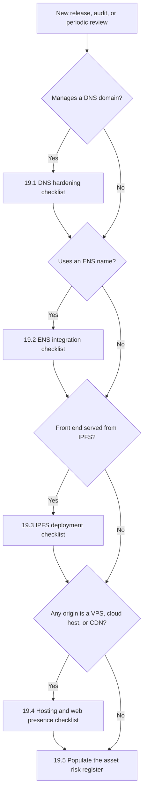
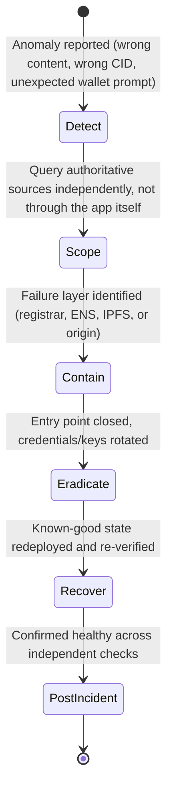

# Part 6: Appendices

[Back to Handbook contents](index.md) | [Series index](../index.md)

This part collects the reference material the rest of the handbook assumes you have on hand. Appendix A fixes the vocabulary so *contenthash* or *registry lock* means the same thing in every Part. Appendix B turns the hardening guidance from Parts 2 through 5 into copy-ready checklists and a risk-register template for a deployment runbook. Appendix C is the one-page router Part 1 promised: a table that sends a responder to the right playbook before they know which naming system failed. Appendix D points to the handbook's bibliography rather than repeating citations already given at the point of each claim.

---

## 18. Appendix A: Glossary

Entries are grouped by domain area, not strict alphabetical order across the whole appendix, because a responder triaging a registrar compromise and one debugging a stale **IPFS** pin reach for different clusters of vocabulary. Within each group, entries run alphabetically, with the acronym expanded on first appearance and the handbook chapter named so you can jump to the fuller treatment. Where an external standard, request for comments (RFC), or Ethereum Improvement Proposal (EIP) defines a term precisely, the entry cites that source directly.

### 18.1 DNS and Routing Terms

The classical resolution and routing path covered in Part 2.

- **Authoritative nameserver**: the server holding a domain's definitive zone file (its full set of **DNS** resource records) and answering queries for it directly, as opposed to a caching resolver that only forwards and caches answers on a client's behalf. See Chapter 2.
- **BGP (Border Gateway Protocol) hijack**: an attacker announces false route prefixes to internet peers, misdirecting traffic destined for a victim's IP space upstream of any control the victim can apply to its own domain or server. Documented against MyEtherWallet (April 2018) and KLAYswap (February 2022); see Chapter 1.2.
- **CAA (Certification Authority Authorization)**: a DNS resource record, defined in [RFC 8659](https://www.rfc-editor.org/rfc/rfc8659), letting a domain holder restrict which certificate authorities may issue TLS certificates for that name, using `issue`, `issuewild`, and `iodef` property tags. See Chapter 3.3.
- **Cache poisoning (DNS)**: injecting a forged resource record into a resolver's cache so subsequent queries return an attacker-controlled answer, with no registrar or registry access required. See Chapter 2.1.
- **DNS hijacking**: any technique causing a domain to resolve to attacker-controlled infrastructure, spanning registrar account takeover, unauthorized nameserver delegation changes, and cache poisoning. Curve Finance lost more than $570,000 to a registrar-level hijack in August 2022; see Chapter 1.2.
- **DNSSEC (Domain Name System Security Extensions)**: IETF extensions, originating in [RFC 4033](https://www.rfc-editor.org/rfc/rfc4033) through [RFC 4035](https://www.rfc-editor.org/rfc/rfc4035), letting a resolver cryptographically verify a DNS answer came from the zone's legitimate holder and was not altered in transit. See Chapter 3.1.
- **DNSKEY**: the **DNSSEC** record publishing a zone's public signing key, verified against its parent via the DS record. Defined in [RFC 4034](https://www.rfc-editor.org/rfc/rfc4034). See Chapter 3.1.
- **DS (Delegation Signer)**: a DNSSEC record in the parent zone containing a hash of the child zone's DNSKEY, forming the cryptographic link in the chain of trust from the root to a leaf domain. Defined in [RFC 4034](https://www.rfc-editor.org/rfc/rfc4034). See Chapter 3.1.
- **EPP (Extensible Provisioning Protocol) status codes**: machine-readable domain flags, defined in [RFC 5731](https://www.rfc-editor.org/rfc/rfc5731), including `clientTransferProhibited`, `clientUpdateProhibited`, and `clientDeleteProhibited`, that instruct a registry to reject the matching operation until the registrar removes the flag; the mechanism behind **registrar lock**. See Chapter 3.3.
- **Registrar lock**: setting the client-side EPP prohibition codes on a domain so transfers, updates, or deletion require an explicit unlock step, closing the most common path to a fast, silent hijack. See Chapter 3.3.
- **Registry lock**: a stronger protection some registries offer for high-value domains, requiring an out-of-band step (typically a phone callback to a pre-authorized contact) before any change takes effect, even one authenticated through the normal account. See Chapter 3.3.
- **Resolver validation**: a DNS resolver actually checking DNSSEC signatures on the answers it returns, rather than merely being capable of it. Validating and non-validating resolvers coexist; global validation share is tracked at [APNIC Labs' DNSSEC measurement](https://stats.labs.apnic.net/dnssec). See Chapter 3.4.
- **RRSIG (Resource Record Signature)**: the DNSSEC record holding the digital signature over a set of resource records, verified against the corresponding DNSKEY. Defined in [RFC 4034](https://www.rfc-editor.org/rfc/rfc4034). See Chapter 3.1.
- **WHOIS**: the protocol and data set for domain registration contact information, used to identify a registrant and, defensively, to monitor for unauthorized registrant or nameserver changes. See Chapter 3.5.

### 18.2 ENS and Ethereum Naming Terms

The on-chain naming layer covered in Part 3.

- **contenthash**: an **ENS** resolver record, defined in [EIP-1577](https://eips.ethereum.org/EIPS/eip-1577), letting a name such as `app.eth` resolve to an IPFS, InterPlanetary Name System (IPNS), or Swarm content identifier instead of, or alongside, an Ethereum address. See Chapter 7.1 and Part 4, Chapter 12.1.
- **CCIP Read (Cross-Chain Interoperability Protocol Read)**: a standard, defined in [EIP-3668](https://eips.ethereum.org/EIPS/eip-3668), letting a smart contract instruct a client to fetch data from an off-chain gateway and return it as a verified on-chain call; the mechanism ENS uses to verify **DNSSEC** proofs without paying gas for every lookup. See Chapter 7.2.
- **DNSRegistrar / DNSSECOracle**: the ENS smart contracts behind DNS-in-ENS. `DNSRegistrar` historically accepted an on-chain DNSSEC proof so a **DNS** holder could claim the matching ENS name, at significant gas cost; `DNSSECOracle` verifies that proof chain for both the on-chain path and the newer gasless, CCIP Read-based path. See [ENS documentation](https://docs.ens.domains/registry/dns) and Chapter 7.2.
- **ExtendedDNSResolver**: an ENS resolver that reads a TXT record on an imported DNS name and resolves it to an address directly, without the name being claimed on-chain first, part of the gasless DNS-in-ENS flow. See Chapter 7.2.
- **namehash**: the deterministic algorithm, defined in [EIP-137](https://eips.ethereum.org/EIPS/eip-137), converting a human-readable ENS name like `wallet.app.eth` into the fixed-length node identifier ENS contracts store and compare. See Chapter 7.1.
- **Resolver (ENS)**: the smart contract an ENS name points to that answers what the name resolves to (address, `contenthash`, text record). Because the registry only records which resolver a name uses, a compromised resolver can misdirect every lookup without touching name ownership. See Chapter 7.4.
- **Subdomain takeover (ENS)**: gaining control of a subdomain, typically through a wildcard resolver answering for any label under a parent name without per-label checks, letting an attacker resolve `evil.app.eth` with the apparent legitimacy of a name the project actually issued. See Chapter 8.1.

### 18.3 IPFS and Decentralized Hosting Terms

Content-addressed storage and retrieval, covered in Part 4.

- **CID (Content Identifier)**: a self-describing label for **IPFS** content, built from a multihash (cryptographic digest), a multicodec (how to interpret the bytes), and a multibase (text encoding), such that any content change changes the CID. See [IPFS docs](https://docs.ipfs.tech/concepts/content-addressing/) and Part 4, Chapter 11.1.
- **CIDv0 / CIDv1**: the two CID encoding versions in use. CIDv0 is a fixed Base58 string starting with `Qm`; CIDv1 adds an explicit multibase/multicodec prefix and is required for subdomain gateway hosting because it can be a DNS-label-safe string. See Part 4, Chapter 11.1.
- **DHT (Distributed Hash Table)**: the Kademlia-style peer-to-peer index IPFS nodes use to discover which peers hold a given CID's blocks. See Part 4, Chapter 12.2.
- **DNSLink**: a convention for publishing a `_dnslink.` prefixed TXT record that maps a domain name to an IPFS path, letting a human-readable URL resolve to a CID the same way an **ENS** `contenthash` does. See Part 4, Chapter 12.1.
- **Gateway (IPFS)**: an HTTP bridge process speaking IPFS on one side and plain HTTPS on the other, used by clients that do not run a full IPFS node. Path, subdomain, and DNSLink gateway styles differ in browser origin isolation. See [IPFS HTTP Gateway spec](https://specs.ipfs.tech/http-gateways/) and Part 4, Chapter 11.2.
- **IPNS (InterPlanetary Name System)**: IPFS's mutable-pointer scheme, letting a stable identifier resolve to a changing CID over time; one of the target types an ENS `contenthash` record can point to. See Part 4, Chapter 12.1.
- **Pinning**: explicitly instructing an IPFS node to retain content indefinitely, preventing garbage collection; unpinned content can silently vanish once the last holding node goes offline. See [IPFS docs](https://docs.ipfs.tech/concepts/persistence/) and Part 4, Chapter 11.2.
- **Storacha Network**: the successor to Protocol Labs' web3.storage pinning service, built on the `w3up` protocol stack and backed by Filecoin storage deals. See [github.com/storacha](https://github.com/storacha) and Part 4, Chapter 12.2.
- **Sybil / eclipse attack**: a Sybil attack floods a peer-to-peer routing table (such as a DHT's) with attacker-controlled identities; an eclipse attack uses that foothold to surround one target peer with malicious nodes, isolating it from honest ones. Both are documented structural exposures of Kademlia-family DHTs. See Part 4, Chapter 12.2.
- **Trustless (CAR-verified) retrieval**: requesting an IPFS gateway response in [CAR format](https://specs.ipfs.tech/http-gateways/trustless-gateway/) so the client hashes the raw DAG blocks itself, detecting a dishonest gateway instead of trusting its word for what a CID contains. See Part 4, Chapter 11.2.

### 18.4 Hosting, Deployment, and Incident Response Terms

Conventional hosting and the response process, covered in Part 5 and cross-referenced throughout the playbooks.

- **Defacement**: unauthorized modification of a front end's visible content or behavior, from cosmetic vandalism to an injected malicious wallet-signing prompt, without necessarily touching **DNS**, ENS, or IPFS resolution. See Chapter 16.
- **NIST incident handling lifecycle**: the four-phase model (Preparation; Detection and Analysis; Containment, Eradication, and Recovery; Post-Incident Activity) defined in [NIST SP 800-61 Revision 2](https://csrc.nist.gov/pubs/sp/800/61/r2/final) (August 2012), which every playbook in this handbook adapts to a specific naming or hosting failure. See Chapter 17.
- **SRI (Subresource Integrity)**: a browser mechanism pinning the cryptographic hash of an external script or stylesheet, rejecting a resource whose fetched bytes mismatch; the primary content-integrity control in the CDN and Front-End Supply Chain Security Handbook (01), referenced here where hosting and CDN concerns overlap. See Chapter 15.2.
- **VPS (Virtual Private Server)**: a virtualized server rented from a cloud or hosting provider, the common origin infrastructure a domain's A or AAAA records ultimately point to. See Chapter 15.1.

### 18.5 Standards, Frameworks, and Governance Terms

The bodies and frameworks that structure this handbook's guidance within the wider OWASP Smart Contract Security (SCS) Project.

- **AADAPT (Adversarial Actions in Digital Asset Payment Technologies)**: a MITRE threat framework modeled on ATT&CK, launched in 2025, cataloging adversary tactics specific to digital asset and payment systems, including infrastructure and naming-layer attacks. See [MITRE's fact sheet](https://www.mitre.org/news-insights/fact-sheet/aadapt-cyber-threat-framework-digital-assets) and the [public matrix](https://github.com/mitre/AADAPT).
- **ICANN (Internet Corporation for Assigned Names and Numbers)**: the nonprofit body coordinating the **DNS** root zone, accrediting registrars, and setting the policy framework (EPP status codes, transfer rules) this handbook's registrar-security guidance builds on. See [icann.org](https://www.icann.org/).
- **MITRE ATT&CK**: a globally accessible knowledge base of adversary tactics and techniques drawn from real-world observations, used to structure general IT and cloud threat models that intersect with DNS and hosting infrastructure. See [attack.mitre.org](https://attack.mitre.org/).
- **NIST (National Institute of Standards and Technology)**: the U.S. federal agency whose Special Publication 800 series, including [SP 800-81-2](https://csrc.nist.gov/publications/detail/sp/800-81/2/final) and SP 800-61 Revision 2, anchors this handbook's DNS hardening and incident-response structure.
- **SCSVS / SCSTG / SCWE**: OWASP's Smart Contract Security Verification Standard, Testing Guide, and Weakness Enumeration; this handbook sits outside all three by design, supplying the DNS, **ENS**, and IPFS preconditions they assume are already met. See [scs.owasp.org](https://scs.owasp.org/) and Chapter 1.3.
- **SSAC (Security and Stability Advisory Committee)**: an ICANN advisory committee publishing analysis and recommendations on DNS security matters, including registrar-level abuse and hijacking prevention, referenced throughout Part 2's hardening guidance. See [icann.org/groups/ssac](https://www.icann.org/groups/ssac).
- **Web3 Attack Vectors Top 15**: an OWASP catalog ranking the most significant non-contract Web3 risks; it names DNS, domain, and routing infrastructure hijacking directly as **WA13**, the category this handbook is organized around. See [scs.owasp.org/sctop10/Web3-Attack-Vectors-Top15](https://scs.owasp.org/sctop10/Web3-Attack-Vectors-Top15/) and Chapter 1.2.

---

## 19. Appendix B: DNS/ENS/IPFS Security Checklist

The checklists below are the copy-ready form of the hardening guidance argued for in prose across Parts 2 through 5. Lift a section wholesale into a pre-launch review or a change ticket rather than reconstructing it from memory. Most teams run all four checklists together at least once per quarter, since a domain, an **ENS** name, an **IPFS** pin, and a hosting origin typically ship as one release.

*Figure 1. Checklist selection by system in use. Most production Web3 front ends run at least three of the four branches simultaneously, since DNS, ENS, and IPFS are commonly layered rather than mutually exclusive.*

### 19.1 DNS Hardening Checklist

Run this checklist before launch and again on a fixed schedule (monthly is typical) independent of releases, since registrar and **DNS** configuration can drift without any deployment on your side. It operationalizes Chapter 3.

**DNS Hardening Checklist**

- [ ] Zone is DNSSEC-signed; DS/DNSKEY/RRSIG chain validates end to end
      (`dig +dnssec`, cross-check with DNSViz)
- [ ] CAA record restricts issuance to chosen CAs, includes `iodef` tag
- [ ] **Registrar lock** set: clientTransferProhibited, clientUpdateProhibited,
      clientDeleteProhibited
- [ ] **Registry lock** enabled where offered, for high-impact domains
- [ ] Hardware-backed MFA enforced on every registrar account; no shared
      or generic logins
- [ ] WHOIS contact info current, monitored for unauthorized change
- [ ] Expiry tracked with auto-renewal plus 60/30/7-day alerts
- [ ] Nameserver and zone changes alert independent of the registrar's own
      notification (Chapter 3.5)
- [ ] Certificate issuance monitored via Certificate Transparency logs
- [ ] No dangling records point at decommissioned infrastructure a third
      party could re-claim

### 19.2 ENS Integration Checklist

Run this checklist whenever an **ENS** name is provisioned or its resolver, controlling key, or records change. It operationalizes Chapters 7, 8, and 10.

**ENS Integration Checklist**

- [ ] Name-controlling key is a **hardware wallet** or **multisig**/timelock,
      never a bare hot-key externally owned account
- [ ] Resolver contract is a known, reviewed implementation, not an
      arbitrary or freely-upgradeable address
- [ ] contenthash and address record writes are monitored and alerted on
- [ ] Wildcard resolution disabled unless subdomains are explicitly
      issued, closing the common subdomain-takeover path
- [ ] DNS-imported names (DNSSECOracle/CCIP Read path) re-verified after
      any parent **DNS** zone change (Chapter 7.2)
- [ ] Front end displays the full resolved name and flags homoglyph or
      lookalike labels before wallet connection
- [ ] Referral/forwarding links are validated before rendering, never
      trusted from an unauthenticated query parameter (Chapter 10.2)

### 19.3 IPFS Deployment Checklist

Run this checklist before pinning a new build and again on a fixed schedule. It operationalizes Part 4, Chapter 14.

**IPFS Deployment Checklist**

- [ ] Content pinned to two or more independent pinning providers
- [ ] Sensitive content retrieved via trustless CAR responses and
      hash-verified locally, not trusted from a recursive gateway
- [ ] Anything executing code is served as CIDv1 via a subdomain gateway,
      never a path-style gateway
- [ ] contenthash/DNSLink owner key is hardware-backed and, where
      possible, multisig-protected
- [ ] Deployed CID is polled continuously and alerted against the
      release manifest
- [ ] Canonical CID published out of band: GitHub, **ENS** text record,
      verified social channels
- [ ] Dedicated or self-hosted gateway fallback exists for users behind
      networks that block public gateway domains
- [ ] Critical pins backed by a direct storage relationship (a held
      Filecoin deal or equivalent), not solely a reseller account

### 19.4 Hosting and Web Presence Checklist

Run this checklist for every origin server, VPS, or cloud host a domain record points to. It operationalizes Chapter 15 and its overlap with the CDN and Front-End Supply Chain Security Handbook (01).

**Hosting and Web Presence Checklist**

- [ ] Origin is not directly reachable bypassing the CDN; access is
      authenticated pull, IP allowlisting, or mutual TLS only
- [ ] TLS 1.3 enforced (1.2 minimum) with HSTS enabled
- [ ] Deployment pipeline produces signed, versioned, immutable build
      artifacts (Handbook 01, Chapter 4.3-4.4)
- [ ] SRI and CSP applied to every third-party script and style
      (Handbook 01, Chapter 4)
- [ ] Server software is current and minimal: no exposed default admin
      panels, no unused listening services
- [ ] Tested rollback path exists to redeploy a known-good build within a
      defined recovery time objective
- [ ] Secondary web presence (docs, status pages, blogs) is inventoried
      in the same monitoring scope as the primary application domain

### 19.5 Domain, Name, and Content Risk Register Template

Maintain this register as a living document across all four systems rather than four separate spreadsheets; a single asset row makes it obvious when, for example, an **ENS** name and its DNS-imported counterpart drift out of sync.

<!-- pdf-table: landscape -->
| Asset | Type (Domain / ENS name / IPFS pin / Host) | Controlling Party or Key | Lock/Protection Status | Monitoring in Place | Last Reviewed | Owner |
|-------|---------------------------------------------|---------------------------|--------------------------|-----------------------|----------------|-------|
| *(example row)* | Domain (`app.example`) | Registrar account, hardware MFA | Registrar lock + registry lock | Uptime + NS-change alert | 2026-Q3 | Infra lead |
| *(example row)* | ENS name (`app.eth`) | 3-of-5 multisig | Resolver reviewed, wildcard off | contenthash write alert | 2026-Q3 | Protocol lead |
| *(your asset)* | | | | | | |

---

## 20. Appendix C: Playbook Quick Reference

An incident responder rarely knows which naming system failed in the first few minutes; the symptom, users landing on a page that is not the real front end, looks identical whether the cause is a hijacked registrar, a compromised **ENS** resolver, a substituted **IPFS** CID, or a defaced origin server. This appendix is the one-page router Chapter 1.4 promised: scope the failure first, then jump to the matching playbook rather than reading each Part's full threat model under pressure.

*Figure 2. The generalized incident lifecycle every playbook in this handbook specializes, adapted from the four-phase model in [NIST SP 800-61 Revision 2](https://csrc.nist.gov/pubs/sp/800/61/r2/final). Scoping happens before containment in every case, because the correct containment action differs completely depending on which layer actually failed.*

### 20.1 Playbook Index and Trigger Table

Use the trigger column to route before you have a confirmed root cause; symptoms overlap heavily by design, which is exactly why an out-of-band scoping step (right-hand column) comes first in every playbook.

| Playbook | Location | Trigger Symptom | First Independent Verification Step |
|----------|----------|------------------|----------------------------------------|
| Suspected DNS Hijack or Poisoning | Part 2, Ch. 4 | Front end resolves to unexpected content; DNS changed without a matching ticket | Query authoritative nameservers from an out-of-band resolver; do not trust the app's own state |
| Domain Expiry or Registrar Compromise | Part 2, Ch. 5 | WHOIS shows expired/pending-delete, or registrar account access is lost | Attempt registrar-side recovery immediately; check backup MFA before the redemption grace period lapses |
| DNS Abuse (Phishing, Malware on Your Brand) | Part 2, Ch. 6 | Reports of a phishing clone or malware host on a subdomain or lookalike using your brand | Confirm the abusive host is not, in fact, your own hijacked infrastructure before filing a takedown |
| ENS Name or Resolver Compromise | Part 3, Ch. 9 | contenthash/address record changed unexpectedly, or key suspected compromised | Query the resolver against a trusted RPC (`cast call`), never through the potentially-compromised front end |
| IPFS Gateway or Pinning Incident | Part 4, Ch. 13 | Served CID mismatches the release manifest, or a gateway returns stale content | Test the same CID across 3+ independent gateways to isolate pointer-layer vs. gateway fault |
| Front-End Defacement or Compromise | Part 5, Ch. 16 | Visible content change, injected script, or unexpected wallet-signing prompt reports | Fetch the origin out-of-band (`curl` from an unrelated host) and diff against the last known-good build |

### 20.2 Universal First 15 Minutes Checklist

These actions apply regardless of which playbook you end up running, and belong at the top of every incident channel the moment a naming or hosting anomaly is reported.

**Universal First 15 Minutes**

- [ ] Preserve evidence first: screenshot the anomaly, save raw
      `dig`/`whois`/`cast call` output with timestamps
- [ ] Verify independently, never through the potentially-compromised
      front end or its own status page
- [ ] Do not tip off an active attacker with public changes before
      containment is ready; coordinate the first public statement
- [ ] Identify the failed layer (**DNS**, **ENS**, IPFS, origin) before choosing
      containment; the wrong step can be inert or harmful (Chapter 1.4)
- [ ] Open the incident under the **Incident Response** Handbook (06) process
      and pull in the specific playbook from 20.1

### 20.3 Escalation and Communication Matrix

Different failure layers require contacting different external parties, and the wrong contact wastes the first, most valuable minutes of an incident. Populate the specific account and contact details for your own registrar, **ENS** tooling, and pinning providers in advance, not during the incident.

| Failure Layer | External Party to Contact | Typical Channel | What to Provide |
|----------------|----------------------------|-------------------|-------------------|
| Registrar / registry compromise | Registrar abuse/security team, then registry | Support escalation line, ICANN complaint form | Domain name, account ID, evidence of change, timestamp |
| ENS resolver or key compromise | ENS support channels, multisig co-signers | Community support, internal signer escalation | Name, unauthorized tx hash, current resolver address |
| IPFS gateway or pinning | Pinning provider support, gateway abuse contact | Support ticket, gateway abuse email | CID, last known-good CID, pin status screenshots |
| Origin hosting or CDN | Hosting/cloud provider security team | Provider incident escalation line | Affected IPs, timeline, evidence of access |
| Users and community | Verified status page, verified social account | Pre-established, out-of-band channels only | Plain-language impact statement, what to avoid (e.g. signing) |
| Law enforcement / recovery | Local cybercrime unit, analytics partner | Formal report, per Handbook 06 | Evidence package, loss estimate, wallet addresses |

---

## 21. Appendix D: References and Further Reading

Every claim in this handbook that names a standard, a version, a date, or an incident is cited inline at the point it is made, following the convention set in Part 1. Rather than duplicate that source list here, this appendix points to `references.md`, the deduplicated bibliography for the full handbook, grouped into Standards and Frameworks (the **DNSSEC** RFC series, RFC 8659 for CAA, RFC 5731 for EPP status codes, EIP-1577 and EIP-3668 for **ENS** `contenthash` and CCIP Read, NIST SP 800-81-2 and SP 800-61 Revision 2, and the OWASP SCSVS, SCSTG, SCWE, and Web3 Attack Vectors Top 15), Incidents and Case Studies (MyEtherWallet's 2018 BGP hijack, KLAYswap's 2022 BGP-hijacked SDK compromise, and the Curve Finance 2022 registrar compromise), Tools (`dig`, DNSViz, `cast`, Kubo, and the pinning provider APIs referenced across Part 4), and Further Reading (ICANN and SSAC advisories, IPFS specification documents, and companion material beyond this handbook's scope).

If a link in the body of any Part goes stale, `references.md` is the place to check for an updated URL before assuming the underlying claim no longer holds. When you extend this handbook, add the new source to `references.md` in the same change, so the bibliography stays a complete index.

---

**Key controls for Part 6**

- Treat Appendix A as the canonical vocabulary across **DNS**, ENS, **IPFS**, and hosting; link to it from tickets and post-mortems instead of redefining a term inline each time.
- Run the system-specific checklists (19.1 through 19.4) before every launch and on a fixed periodic schedule, not only after an incident prompts one.
- Keep the asset risk register (19.5) as a single living document spanning all four systems, so drift between an ENS name and its DNS-imported counterpart is visible in one place.
- Use the playbook quick reference (20.1) to scope an incident by symptom before committing to a containment action; the wrong layer's fix can be inert or harmful.
- Populate the escalation matrix (20.3) with real contacts before an incident, not during one.
- Add every new citation to `references.md` in the same change that introduces it (Appendix D).
