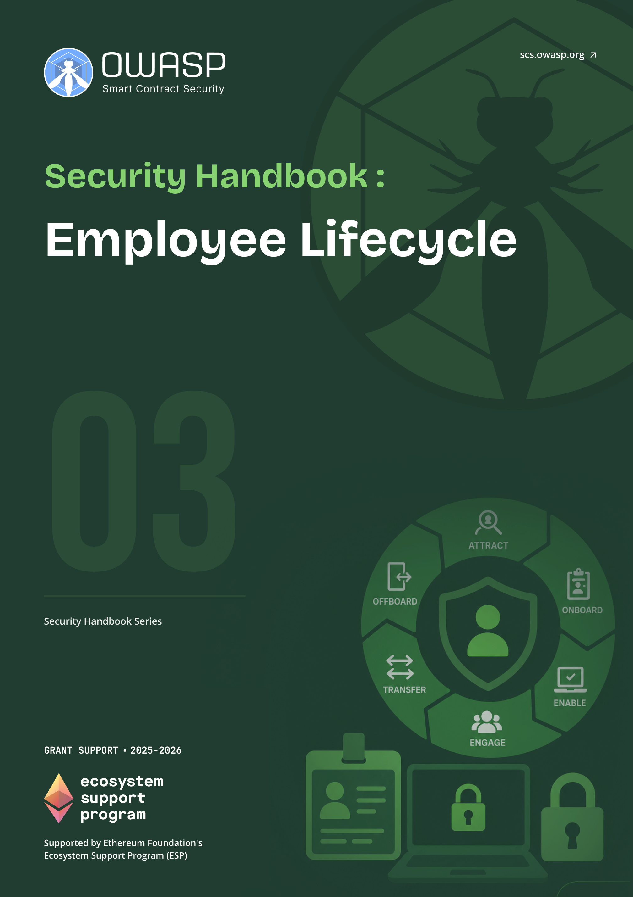

# OWASP SCS Employee Lifecycle Security Handbook

  
  

    <a class="handbook-series-link" href="../">← All handbooks</a>
    
Handbook 03 · 76 PDF pages

    
Control identities and privileges from onboarding through role changes, sensitive access, and verified offboarding.

    

      <a href="../pdfs/03-employee-lifecycle-security.pdf" target="_blank" rel="noopener">Open PDF</a>
      <a href="../pdfs/03-employee-lifecycle-security.pdf" download>Download PDF</a>
    

  

**OWASP Smart Contract Security Project**

Part of the [OWASP SCS Handbook Series](../index.md). Built to the series [conventions](../index.md#about-the-series).

## Purpose and Scope

This handbook sets guidelines for securing the full employee lifecycle in Web3 and crypto-native organizations: pre-onboarding screening, least-privilege **access provisioning**, and the **offboarding** and revocation work that most teams treat as an afterthought. It is grounded in current practice: access-centric offboarding that coordinates HR, IT, and compliance rather than leaving revocation to a single team; zero-trust rapid revocation backed by identity and device management tooling; and automated identity lifecycle management (identity and access management, IAM, paired with identity governance and administration, IGA) that closes the gap between an employee's actual role and the privileges still attached to their account. The scope runs from background verification through key and credential handling, role-based access design, and the timely revocation that keeps a departure from becoming a breach, set against the compliance backdrop of SOC 2 (System and Organization Controls 2), the Sarbanes-Oxley Act (SOX), and the Payment Card Industry Data Security Standard (PCI DSS) where they apply.

Web3 raises the stakes on lifecycle security in ways a traditional SaaS company does not face. A departing engineer at a Web2 firm loses access to a dashboard; a departing engineer at a Web3 firm may still hold a **multisig** signer key, a deploy credential, or treasury access that no offboarding ticket can claw back once it has left their laptop. The 2022 compromise of Ronin Network's validator keys, reportedly traced to a fraudulent job offer sent to an engineer, and the pattern of Democratic People's Republic of Korea (DPRK) operatives posing as remote contractors, documented in joint advisories from the Federal Bureau of Investigation (FBI) and the Cybersecurity and Infrastructure Security Agency (CISA), both show that the employee lifecycle, not just the smart contract, is where many of the largest Web3 losses actually start. This handbook treats **onboarding** and offboarding as security-critical processes owned jointly by HR, IT, security, and legal, not as paperwork that happens after the security work is done.

## Target Audience

HR, operations, security, and team leads in Web3 and crypto-native organizations responsible for the hiring, **access provisioning**, and **offboarding** of employees, contractors, and protocol signers.

## How to Use This Handbook

Read Part I first to fix the vocabulary, the access types unique to Web3 organizations (infrastructure, code, treasury, and communications), and why **offboarding** belongs to security rather than HR alone. Part II is the **onboarding** reference: pre-onboarding checks, least-privilege access provisioning, security training, and the checklist that closes the loop. Part III mirrors it for offboarding: triggers and timing, revocation across every system a departing employee touched, asset and key recovery, and the legal and HR coordination that documentation and audit trails require. Part IV covers the roles that need special handling: contractors, remote and distributed staff, treasury and deploy-key holders, and multisig signers, plus succession planning for roles a single departure could otherwise leave uncovered. The appendices hold a glossary and printable onboarding and offboarding checklists for teams that want a working template today.

## Relationship to SCSVS, SCSTG, and SCWE

This handbook complements the OWASP smart contract standards without duplicating them. The Smart Contract Security Verification Standard (SCSVS) defines the controls a system must satisfy, including the **access control** and key management requirements that pre-onboarding and **offboarding** here exist to enforce day to day. The Smart Contract Security Testing Guide (SCSTG) describes how to test those controls; the audit trail and verification steps in Parts II and III give testers the process evidence the SCSTG asks them to check for. The Smart Contract Weakness Enumeration (SCWE) catalogs weaknesses in contract code; an orphaned deploy key or a multisig signer who never handed back their role sits upstream of many of those weaknesses, an organizational gap the enumeration does not itself track. Two companion handbooks share this ground directly: the Hiring, Remote Work, and Insider Threat Handbook (05) covers the vetting and insider-risk detection that pre-onboarding here depends on, and the Web3 Operational Security Handbook (11) owns the day-to-day key hygiene and communications discipline that this handbook's provisioning and revocation controls are designed to protect.

## Contents

### Part I: Foundations
- [1. Introduction to Lifecycle Security](part1-foundations.md#1-introduction-to-lifecycle-security)

### Part II: Onboarding
- [2. Pre-Onboarding](part2-onboarding.md#2-pre-onboarding)
- [3. Access Provisioning](part2-onboarding.md#3-access-provisioning)
- [4. Training and Awareness](part2-onboarding.md#4-training-and-awareness)
- [5. Checklist and Documentation](part2-onboarding.md#5-checklist-and-documentation)

### Part III: Offboarding
- [6. Offboarding Triggers and Timing](part3-offboarding.md#6-offboarding-triggers-and-timing)
- [7. Access Revocation](part3-offboarding.md#7-access-revocation)
- [8. Asset and Key Recovery](part3-offboarding.md#8-asset-and-key-recovery)
- [9. Checklist and Documentation](part3-offboarding.md#9-checklist-and-documentation)
- [10. Legal and HR Coordination](part3-offboarding.md#10-legal-and-hr-coordination)

### Part IV: Special Considerations
- [11. Contractors and Short-Term Roles](part4-special-considerations.md#11-contractors-and-short-term-roles)
- [12. Remote and Distributed Teams](part4-special-considerations.md#12-remote-and-distributed-teams)
- [13. High-Risk Roles (Treasury, Deploy Keys, Admin)](part4-special-considerations.md#13-high-risk-roles-treasury-deploy-keys-admin)
- [14. Multisig and Protocol Signer Lifecycle](part4-special-considerations.md#14-multisig-and-protocol-signer-lifecycle)
- [15. Succession and Backup for Key Roles](part4-special-considerations.md#15-succession-and-backup-for-key-roles)

### Part V: Appendices
- [16. Appendix A: Glossary](part5-appendices.md#16-appendix-a-glossary)
- [17. Appendix B: Onboarding Checklist (Printable)](part5-appendices.md#17-appendix-b-onboarding-checklist-printable)
- [18. Appendix C: Offboarding Checklist (Printable)](part5-appendices.md#18-appendix-c-offboarding-checklist-printable)
- [19. Appendix D: References and Further Reading](references.md)
