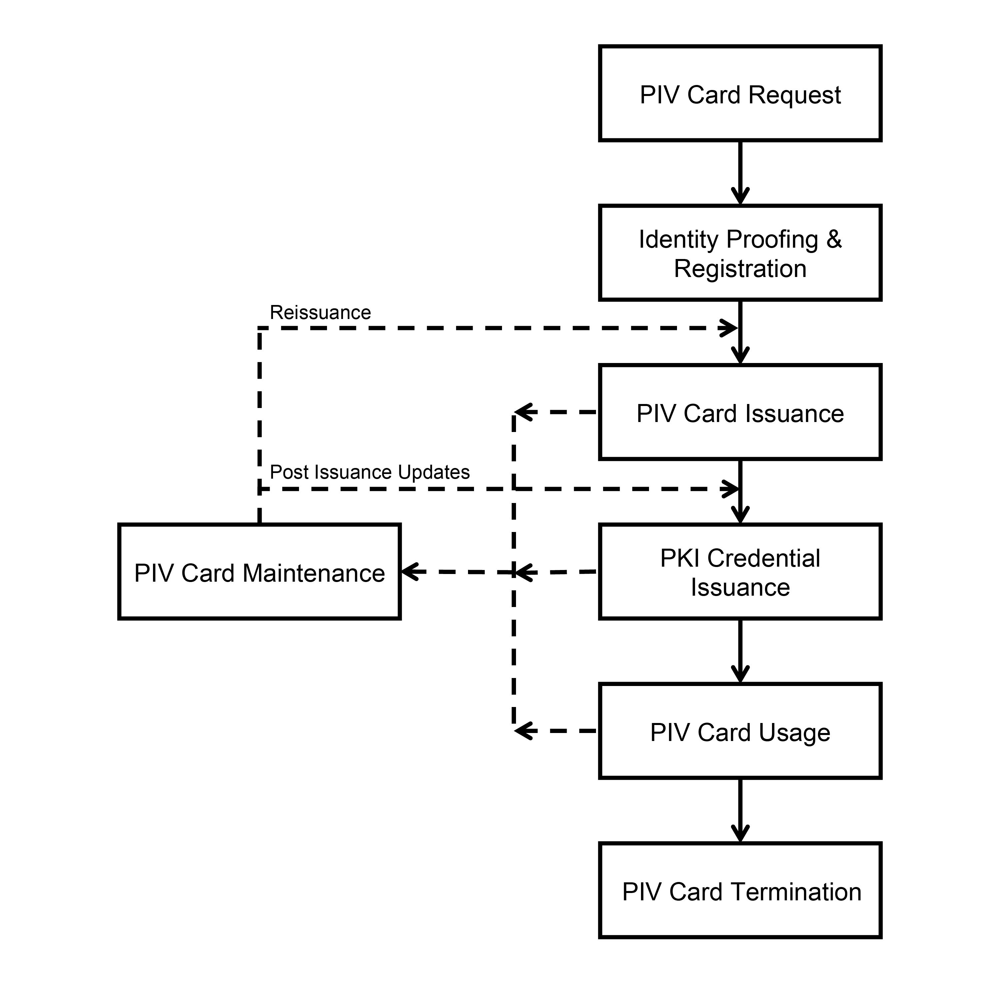
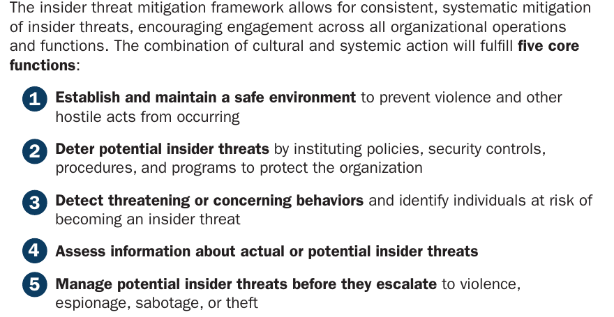
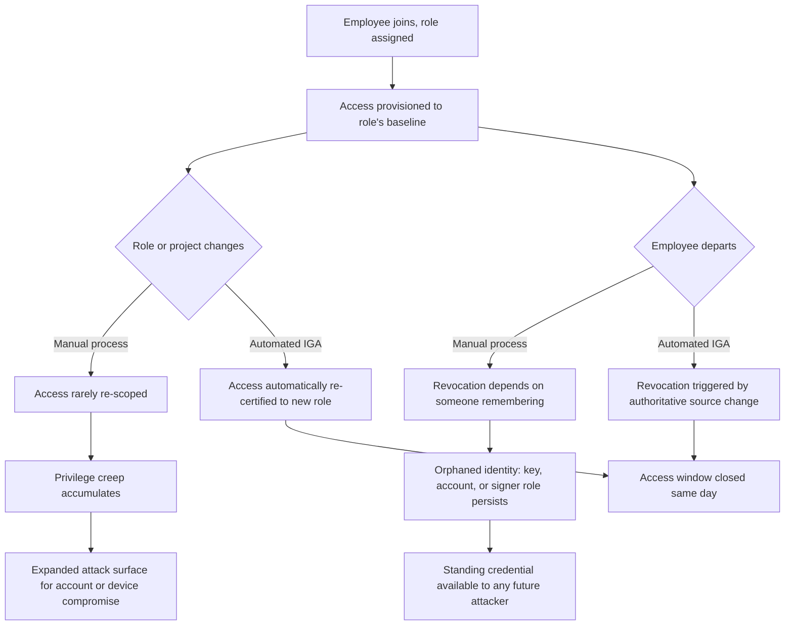
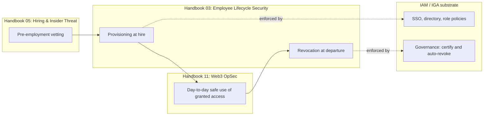

# Part 1: Foundations

[Back to Handbook contents](index.md) | [Series index](../index.md)

This part fixes the vocabulary and the **threat model** that the rest of the handbook builds on. It explains why the employee lifecycle is a Web3-specific **attack surface** rather than a generic HR concern, catalogs the four categories of access a Web3 organization must track from hire to departure, and positions offboarding as a control owned jointly by security, IT, and HR rather than as paperwork that happens after the real security work is done.

---

## 1. Introduction to Lifecycle Security

### 1.1 Why Onboarding/Offboarding Matters in Web3

A traditional software company's employee lifecycle is mostly a productivity problem: give people the tools they need on day one, take the tools back on the last day, and the worst-case failure is a lingering login to an internal wiki. A Web3 organization runs the same lifecycle over a fundamentally different risk surface. The accounts being provisioned and revoked can include a **private key** that moves treasury funds directly, a role in a smart contract's admin multisignature wallet (**multisig**), or write access to the repository that builds the code an audience of users will trust with their savings. Get offboarding wrong at a Web2 company and someone reads an old file. Get it wrong at a Web3 company and someone can drain a treasury, because blockchain transactions settle irreversibly and there is no chargeback once a signature is broadcast.

The industry's largest incidents bear this out. On March 23, 2022, attackers compromised five of the nine validator nodes securing the Ronin Network, the sidechain behind the game Axie Infinity, and drained roughly 173,600 ETH and 25.5 million USDC, worth about $625 million at the time ([Ronin Network incident summary](https://en.wikipedia.org/wiki/Ronin_Network)). The FBI publicly attributed the theft to the North Korean state-sponsored Lazarus Group and APT38 on April 14, 2022. Four of the five compromised validators belonged to Sky Mavis, the company behind Ronin, but the fifth belonged to the Axie DAO, a nominally independent third party. Sky Mavis had no business signing on the DAO's behalf by March 2022: the DAO had granted Sky Mavis a temporary allowlist permission in November 2021 to help handle a surge in transaction load, that permission expired the following month, and it was never revoked. The attacker used the still-live allowlist entry to forge the fifth signature needed to approve the fraudulent withdrawal ([Halborn, "Explained: The Ronin Hack (March 2022)"](https://www.halborn.com/blog/post/explained-the-ronin-hack-march-2022)). A stale, unrevoked access grant, exactly the kind of artifact this handbook exists to prevent, was load-bearing in one of the largest thefts in crypto history.

The lifecycle is also targeted directly as an entry point. The FBI, together with the U.S. Department of State and Republic of Korea agencies, issued a joint public service announcement on October 18, 2023 warning that Democratic People's Republic of Korea (DPRK) operatives were systematically obtaining remote IT jobs at Western companies, including crypto and Web3 firms, using stolen or fabricated identities ([FBI IC3 PSA 231018](https://www.ic3.gov/PSA/2023/PSA231018)). The advisory lists concrete red flags: candidates who refuse video interviews, whose location and stated timezone do not match, who ship company laptops to freight-forwarding addresses, or who later threaten to leak proprietary code after termination. This is not a hypothetical: [Chainalysis's 2025 Crypto Crime Report](https://www.chainalysis.com/blog/2025-crypto-crime-report-introduction/) found that North Korean-linked actors stole $1.34 billion from crypto platforms in 2024 alone, 61% of all crypto stolen that year, with a growing share tied to IT-worker infiltration of the exact hiring pipeline that Part II of this handbook hardens. In Web3, the employee lifecycle is not adjacent to the **attack surface**. It is the attack surface.

### 1.2 Key and Access Types (Infra, Code, Treasury, Comms)

Before you can provision or revoke access correctly, you need a shared vocabulary for what "access" even means at a Web3 organization. Four categories recur across every chapter in this handbook, and each carries a different **blast radius** if mishandled.

| Category | Examples | Typical blast radius if compromised or orphaned |
|----------|----------|---------------------------------------------------|
| **Infrastructure** | Cloud console (AWS, GCP, Azure), Kubernetes clusters, RPC node operator panels, VPN, SSO/identity provider, secrets managers | Full environment takeover, lateral movement into every downstream system |
| **Code** | Git hosting (GitHub, GitLab), CI/CD pipelines and their secrets, package registry publishing rights, deploy keys for smart contracts | Malicious commits, backdoored releases, contract redeployment with attacker-controlled logic |
| **Treasury** | Multisig signer keys, hardware wallet seed material, custodial exchange accounts, DAO governance voting power, hot wallet API keys | Direct, irreversible fund loss; governance capture |
| **Communications** | Company email, Slack/Discord admin, social media accounts, domain registrar and DNS panel, incident-response contact lists | Phishing launched from a trusted identity, brand-damaging impersonation, DNS hijack that redirects users to a malicious front end |

*Figure. NIST's PIV card lifecycle is a useful control model even when the credential is a passkey, cloud identity, or hardware wallet: sponsorship and identity proofing precede issuance; maintenance, renewal, and replacement are explicit states; and termination is a first-class lifecycle event rather than an informal cleanup task. Source: [NIST FIPS 201-3, PIV Card Life Cycle](https://pages.nist.gov/FIPS201/FIPS201.html), public domain (U.S. government work).*

Two properties distinguish this table from its Web2 equivalent. First, treasury access has no analog in most traditional companies: a departing employee with an active **multisig** signer role or an unrotated hot wallet key is a category of risk that generic **offboarding** checklists were never built to catch. Second, the categories interact. A compromised infrastructure credential can be used to pivot into a CI/CD pipeline (code), which can be used to push a malicious release that drains a treasury, which can then be laundered through a compromised communications channel used to social-engineer support staff. Chapter 3 (Part II) and Chapter 7 (Part III) map each category to concrete provisioning and revocation procedures; this table is the shared reference they both point back to.

### 1.3 Offboarding as Security-Critical (Not Just HR)

Most organizations, Web3 included, still route **offboarding** primarily through HR: a departure is logged, a final paycheck is calculated, an exit interview is scheduled, and IT is looped in as a downstream administrative task rather than a security control with its own deadline and owner. That model fails the moment any of the access types in Section 1.2 is in scope, because HR systems were not built to track a **multisig** signer role or a deploy key and have no mechanism to force its revocation before the employee's device leaves the building.

The Ronin case in Section 1.1 is the clearest illustration available: the failure was not that Sky Mavis granted access it should never have granted. Granting the Axie DAO temporary signing rights during a load spike was a reasonable operational decision. The failure was that nobody owned the deadline. The permission had an implicit expiration (the load spike ended), nobody translated that into an explicit revocation task, and the access sat live and forgotten for roughly four months until an attacker who had already compromised four other validators used it to reach quorum. That is an offboarding failure in exactly the same shape as a departing engineer keeping a laptop VPN profile: a grant that should have had a clear owner and a clear end date instead had neither.

Treat offboarding as security-critical means giving it the same rigor as any other control with a service-level target: a named owner (security or IT, not HR alone), a maximum time-to-revoke measured in hours for high-risk access and same-day for everything else, and a completion record that someone other than the revoker checks. HR remains essential, since it is usually the first system of record for a departure date and the legal owner of confidentiality obligations (Chapter 10 in Part III), but it is a stakeholder and trigger source, not the control owner. Section 1.4 explains the mechanism that makes this practical at scale, and Chapter 6 in Part III returns to triggers and timing in full detail.

### 1.4 Automated vs. Manual Lifecycle: Privilege Creep and Orphaned Identities

A manual lifecycle, where a human files a ticket to grant access and another human files a ticket to revoke it, works for a five-person team and degrades predictably as headcount, tooling, and role changes accumulate. Two failure modes dominate the literature and match what shows up in real incidents.

**Privilege creep** is the steady accumulation of access rights beyond what a person's current role requires. It happens through entirely ordinary events: an engineer moves from one team to another and keeps the old team's repository access because nobody remembered to remove it; someone covers an on-call rotation for two weeks and retains the elevated production access afterward; a contractor's short-term project extends twice and their scope of access never gets re-scoped to match. Each individual grant looked reasonable at the moment it was made. The aggregate, months later, is a person holding far more access than their job justifies, and every one of those extra grants is a credential an attacker can exploit if that person's account, device, or session is ever compromised.

**Orphaned identities** are accounts, keys, or roles that persist after the person they belonged to has left, been reassigned, or the system that tracked them has changed. They are the direct residue of **offboarding** failures: the departed contractor's API key still valid in a secrets manager, the SSH key still in an `authorized_keys` file, the multisig signer slot never handed back. Orphaned identities are attractive to attackers precisely because nobody is watching them: no one notices unusual activity on an account they believe is already gone.

Both failure modes compound under a purely manual process because manual revocation depends on someone remembering to act, and organizations reliably do not remember at scale. This is the problem identity governance and administration (IGA) tooling exists to solve: automated identity lifecycle management ties access grants to an authoritative source (an HR system, a role definition, a project assignment) and automatically re-certifies or revokes access when that source changes, rather than depending on a human to file the follow-up ticket. [NIST's identity and access management (IAM) program](https://www.nist.gov/identity-access-management) frames the goal precisely: ensuring "the right people and things have the right access to the right resources at the right time," a formulation that only holds if the "right time" includes the moment access should end, not only the moment it should begin.

The cost of getting this wrong is measurable. The 2022 Ponemon Institute Cost of Insider Threats study, sponsored by Proofpoint, found the average cost per insider-related incident had risen to $15.38 million, that containment time had grown to 85 days on average, and that incidents taking more than 90 days to contain cost organizations an average of $17.19 million annualized ([Ponemon/Proofpoint Cost of Insider Threats Report](https://www.proofpoint.com/us/resources/threat-reports/cost-of-insider-threats)). Credential-theft-related incidents alone cost organizations an average of $4.6 million, up 65% from two years earlier. Neither figure is Web3-specific, which is the point: the underlying failure (access that should have been removed and was not) is a universal enterprise problem, and Web3 organizations inherit it while adding treasury-category access that turns the same failure into an irreversible fund loss rather than a data-exposure incident.

*Figure. CISA's five-function insider-threat model clarifies where lifecycle controls sit: automated provisioning and revocation primarily deter abuse, expose signals for detection and assessment, and give the response team a reliable mechanism to suspend access during management of a confirmed threat. Source: [CISA Insider Threat Mitigation Guide, page 27](https://www.cisa.gov/sites/default/files/2022-11/Insider%20Threat%20Mitigation%20Guide_Final_508.pdf), public domain (U.S. government work).*

*Figure 1. Manual versus automated identity lifecycle paths. The two failure modes, privilege creep and orphaned identities, both trace back to a lifecycle event (role change or departure) that never propagated to the access layer.*

No organization eliminates manual steps entirely, and Part II and Part III both include manual checklist templates precisely because most Web3 organizations, especially smaller ones, will run a hybrid model for years. The design goal is to shrink the manual surface to the access types that genuinely require human judgment (a treasury role handback, a **multisig** re-key) and automate everything that follows a predictable rule (a repository permission tied to a team assignment, an **SSO** group tied to a department).

### 1.5 Relationship to OpSec and IAM

Lifecycle security sits at the intersection of two disciplines this handbook does not fully own: identity and access management, and operational security (OpSec). Understanding the boundary helps you route a given control to the right owner and the right handbook.

IAM is the technical substrate: the directory service, the single sign-on (**SSO**) provider, the role definitions, and the enforcement points (VPN, cloud IAM policies, repository permissions) that actually grant or deny a request. [NIST SP 800-207, Zero Trust Architecture](https://csrc.nist.gov/pubs/sp/800/207/final) (August 2020), reframes what IAM should guarantee under modern threat conditions: authentication and authorization are discrete, per-session functions evaluated before every access to an enterprise resource, and no implicit trust is granted based on network location or prior access. That framing matters directly for lifecycle security, because a zero-trust posture makes **offboarding** failures less catastrophic by design: if every session requires fresh authorization rather than trusting a standing VPN tunnel, an orphaned credential has a shorter effective half-life even when a human forgets to revoke it explicitly. Section 3.1 (Part II) and Chapter 7 (Part III) apply this principle to concrete provisioning and revocation procedures.

IGA, introduced in Section 1.4, is the governance layer built on top of IAM: it answers *who should have what access, for how long, and who approved it*, and automates the certification and revocation cycle. This handbook treats IGA as the mechanism, not the policy; the policy questions (what does **least privilege** mean for a smart contract deployer, what does a **multisig** signer's role actually require) are lifecycle security questions this handbook answers directly.

OpSec, covered end to end in the Web3 Operational Security Handbook (11), is the day-to-day discipline an individual and a team practice regardless of what the IAM system grants them: how a signer stores a **seed phrase**, how a team verifies a counterparty's identity before a call, how communications are compartmentalized so a single compromised channel cannot cascade. Lifecycle security and OpSec meet at the moment of **onboarding** and offboarding: this handbook's job is to grant the right access at hire and remove all of it at departure; the OpSec handbook's job is to govern how that access is used safely in between. The Hiring, Remote Work, and Insider Threat Handbook (05) is the third point of this triangle, covering the pre-employment vetting (including DPRK IT-worker detection per Section 1.1) that determines whether someone should be granted access at all, before this handbook's provisioning controls ever engage. The [OWASP Smart Contract Security Verification Standard (SCSVS)](https://scs.owasp.org/) formalizes the access-control and key-management requirements a system must satisfy technically; this handbook is the organizational process that keeps those requirements true as people join, change roles, and leave.

*Figure 2. Where lifecycle security sits relative to pre-employment vetting, day-to-day OpSec, and the underlying IAM/IGA technical substrate.*

### 1.6 How to Use This Handbook

Read this Part once to fix the vocabulary: the four access categories from Section 1.2, the automated-versus-manual framing from Section 1.4, and the boundary with IAM and OpSec from Section 1.5. After that, treat the handbook as a reference you jump into at the point relevant to your task. Part II is the **onboarding** path in order: pre-onboarding screening, least-privilege **access provisioning** mapped to the categories in Section 1.2, security training, and a checklist template that closes the loop with an audit trail. Part III mirrors that structure for offboarding: what triggers a revocation and how fast it must happen, category-by-category revocation procedures, asset and key recovery, and the legal and HR coordination that documentation requires; read it before you need it, not during an actual departure. Part IV addresses roles that need handling beyond the standard template: contractors, remote and distributed staff, treasury and deploy-key holders, and multisig signers, plus succession planning so that a single person's departure never leaves a critical role uncovered. The appendices hold a glossary and printable checklist templates you can adapt directly into a runbook.

Cross-references point outward deliberately. Where a control depends on pre-employment vetting or insider-threat indicators, the text points to Handbook 05. Where it depends on the safe daily use of a credential once granted, it points to Handbook 11. Where it depends on infrastructure-level controls such as **SSO** hardening or secrets management architecture, it points to the Infrastructure Security Handbook (07). Follow those threads outward when a topic in this handbook touches a system this handbook does not itself own.

---

**Key controls for Part 1**

- Track access in the four categories that matter for Web3: infrastructure, code, treasury, and communications, since treasury access has no Web2 analog and demands its own procedures.
- Own **offboarding** as a security control with a named owner and a maximum time-to-revoke, not as an HR administrative afterthought.
- Assume every standing, unreviewed access grant has an implicit expiration; the Ronin incident shows what happens when nobody tracks it.
- Move toward automated identity governance (IGA) for any access tied to a role or project, and reserve manual process for access that genuinely requires human judgment, such as treasury and **multisig** roles.
- Screen new hires against known infiltration patterns, including the DPRK IT-worker red flags in the FBI's October 2023 advisory, before granting any access at all.

