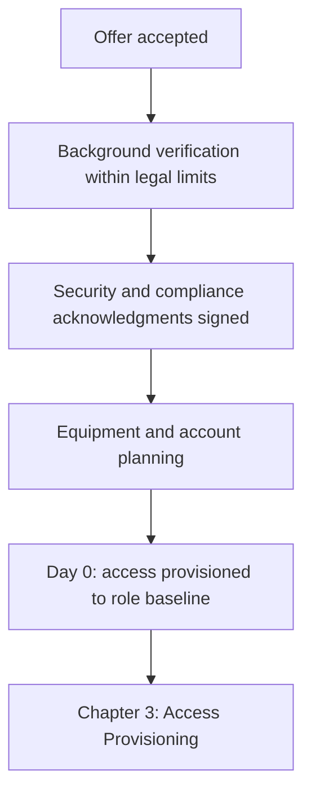
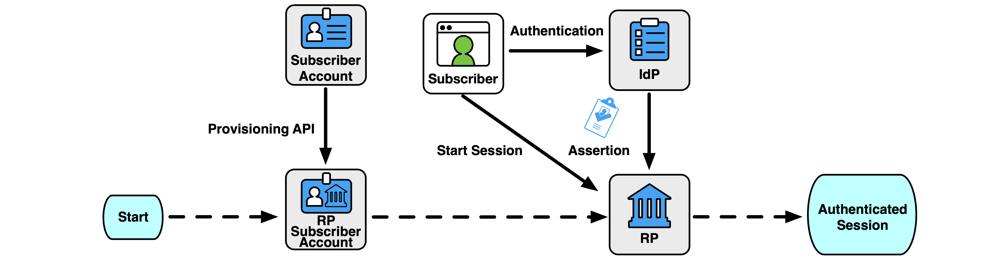
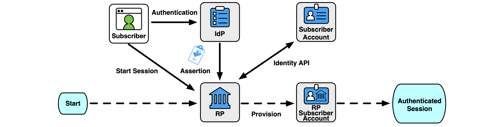
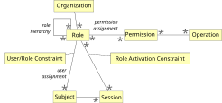
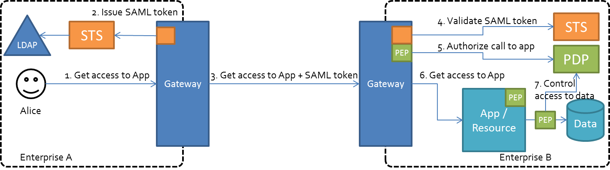
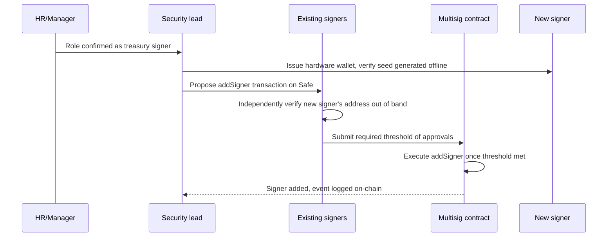
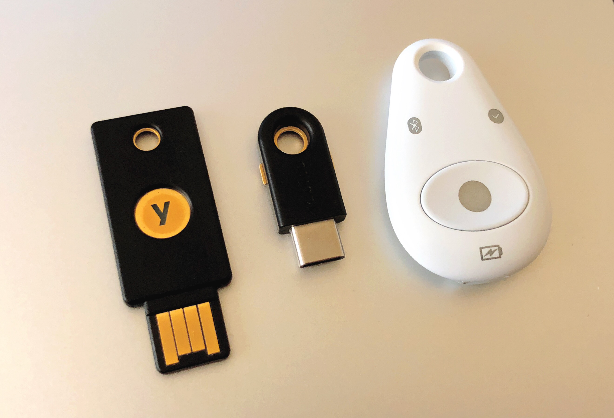
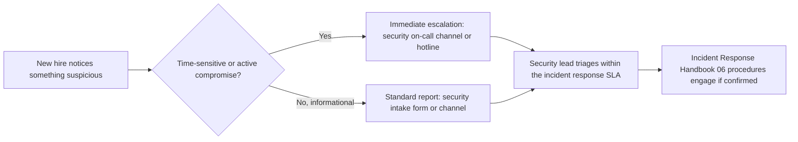

# Part 2: Onboarding

[Back to Handbook contents](index.md) | [Series index](../index.md)

This part walks the **onboarding** path in the order a Web3 organization should actually run it: verify who you are hiring within the limits the law allows, provision access to the four categories from Part 1 (infrastructure, code, treasury, communications) strictly by role, train the person before you hand them anything sensitive, and close the loop with a checklist and an audit trail someone other than the hiring manager can review. Every control here exists because a Web3 employee, unlike most Web2 hires, may end day one with the ability to move irreversible funds.

---

## 2. Pre-Onboarding

Pre-onboarding is everything that happens between an accepted offer and a person's first login. Get this phase right and **access provisioning** in Chapter 3 becomes a matter of following a known-good role template; get it wrong and you are granting infrastructure, code, or treasury access to an identity nobody has actually verified.



*Figure 1. Pre-onboarding runs as a strict sequence. Each stage gates the next: an unverified identity should not reach the acknowledgment stage, and unsigned acknowledgments should not reach equipment and account provisioning.*

### 2.1 Background and Verification (Within Legal Constraints)

Verification exists to answer one question before you extend any access: is the person you are about to onboard actually who your offer letter says they are? That question sounds trivial for an in-office hire and is not trivial at all for a remote Web3 team, where the interview, the reference check, and the equipment shipment may be the only points of contact before a laptop with production credentials leaves your control.

Run verification inside the legal framework that governs it. In the United States, the Fair Credit Reporting Act (FCRA) requires a standalone written disclosure that a consumer report may be used for an employment decision, the candidate's written authorization before you pull it, and, if you plan to act on an adverse finding, a pre-adverse-action notice with a copy of the report followed by a post-adverse-action notice explaining the candidate's right to dispute it within 60 days ([FTC guidance for employers using consumer reports](https://www.ftc.gov/business-guidance/resources/using-consumer-reports-what-employers-need-know)). The [EEOC's joint guidance with the FTC](https://www.eeoc.gov/laws/guidance/background-checks-what-employers-need-know) adds the discrimination-law layer: apply the same screening criteria to every candidate regardless of race, national origin, age, disability, or other protected status, and do not request medical or genetic information before a conditional offer. Outside the US, equivalents such as GDPR-derived data protection rules in the EU and UK constrain what you may collect and how long you may retain it. None of this is optional paperwork; skipping it exposes the organization to discrimination and privacy liability independent of any security benefit the check provides.

Verification also has to counter a documented, active threat specific to remote technical hiring. The FBI's Internet Crime Complaint Center (IC3) issued a public service announcement on October 18, 2023 describing how Democratic People's Republic of Korea (DPRK) operatives systematically obtain remote IT roles, including at crypto and Web3 firms, using stolen or fabricated identities ([FBI IC3 PSA 231018](https://www.ic3.gov/PSA/2023/PSA231018)). Part 1, Section 1.1 covers the incident data; the operational red flags belong here, at the point where you decide whether to extend an offer into a provisioned account.

| Verification step | What it catches | Legal constraint to observe |
|--------------------|-----------------|------------------------------|
| Live video interview requiring government-issued ID on camera | Stolen-identity or stand-in candidates | Do not retain the ID image longer than needed to confirm identity |
| Independent reference check (call the number you find, not the one supplied) | Fabricated employment history | Apply consistently across all candidates to avoid disparate treatment |
| Third-party consumer report (criminal, credit where role-justified) | Undisclosed criminal history relevant to role risk | FCRA disclosure, authorization, and adverse-action process |
| Cross-check claimed location against interview timezone and language cues | Location misrepresentation, a recurring DPRK IT-worker indicator | Do not screen on national origin; screen on consistency of the candidate's own claims |
| Refusal to appear on video, or repeated last-minute reschedules | High-confidence fraud indicator per FBI IC3 PSA 231018 | Document objectively (what happened), not speculatively (who you suspect) |

The full DPRK IT-worker detection playbook, including ongoing monitoring after hire, is the Hiring, Remote Work, and **Insider Threat** Handbook's (05) domain. Treat this section as the gate before an offer converts to an account; treat Handbook 05 as the deeper reference when a red flag actually fires.

### 2.2 Security and Compliance Acknowledgments

Before you provision a single credential, the new hire should sign the documents that define what they are agreeing to protect and how. Treat these as a precondition for Chapter 3, not a parallel track that can lag behind it. An engineer who has infrastructure access but has not signed a confidentiality agreement has, from a legal standpoint, no enforceable obligation covering what they can now see.

The acknowledgment set for a Web3 organization is longer than a typical Web2 equivalent because token-related roles introduce securities and market-abuse exposure that most software companies never face.

| Document | Purpose | Applies to |
|----------|---------|------------|
| Non-disclosure agreement (NDA) and intellectual property (IP) assignment | Protects source code, keys, and unreleased protocol design; assigns work product to the company | All hires |
| Acceptable use policy (AUP) | Sets rules for company devices, accounts, and data, including personal-device (BYOD) boundaries | All hires |
| Code of conduct | Establishes behavioral and ethical baseline, including conflict-of-interest disclosure | All hires |
| Material non-public information (MNPI) and trading policy | Restricts trading the organization's token or related assets around unreleased information | Roles with token, governance, or exchange-listing visibility |
| Security and OpSec pledge | Commits the hire to the practices covered in Chapter 4 before they are trained on them | All hires, re-affirmed after training |
| Key custody agreement | Documents personal responsibility for any hardware wallet, seed material, or signer role issued | Treasury, deploy-key, and multisig roles only |

Route these through an e-signature system that timestamps completion and stores an immutable copy, not a scanned PDF emailed back and forth. The completion record is what Section 5.2's audit trail actually checks against; an acknowledgment that exists only as an email attachment in someone's inbox is not verifiable months later when it matters.

### 2.3 Equipment and Account Planning

Equipment and account planning turns a hiring decision into a concrete list of what ships, what gets created, and in what order. Two failures recur here: shipping a company laptop to an address nobody verified, and provisioning accounts before verification and acknowledgments (Sections 2.1 and 2.2) are actually complete.

The shipping-address failure is not hypothetical. Christina Chapman, an Arizona resident, ran a residential "laptop farm" that received company-issued laptops on behalf of DPRK IT workers who had been fraudulently hired under stolen American identities at more than 300 US companies; the scheme moved over $17 million to the North Korean government before Chapman was sentenced in 2025 to more than eight years in federal prison ([Christina Chapman case summary](https://en.wikipedia.org/wiki/Christina_Chapman)). The FBI's guidance is direct on the countermeasure: verify the shipping address against the identity documents collected during verification, and geolocate company laptops so that a device claimed to be in one country logging in from another triggers a review ([FBI IC3 PSA 231018](https://www.ic3.gov/PSA/2023/PSA231018)).

Decide company-issued versus personal-device (BYOD) policy by role risk before the hire's start date, not on it. A company-issued laptop with full-disk encryption, endpoint detection and response (EDR), and mobile device management (MDM) enrollment should be the default for any role touching infrastructure, code, or treasury access; BYOD, if permitted at all, should be reserved for roles with no access to those three categories and should still require MDM enrollment for company email and communications tools.

<!-- pdf-table: fit -->
| Item | Standard hire | Treasury, deploy-key, or admin hire |
|------|---------------|--------------------------------------|
| Device | Company-issued, encrypted, EDR-enrolled | Company-issued, encrypted, EDR-enrolled; no exceptions |
| Shipping | Verified address matching ID on file | Verified address; consider in-person handoff or a bonded courier |
| Hardware security key | Optional at hire, required before privileged access | Required before any account is created |
| Account pre-provisioning | Baseline accounts created day before start | Nothing beyond email created until acknowledgments and training in Chapter 4 are complete |
| Initial device geofence | Not required | Enabled; alert on login from an unexpected country |

Order matters: verify identity, collect signed acknowledgments, then ship equipment and create accounts, never the reverse. A device or credential sent ahead of verification is a device or credential you cannot easily claw back if verification later fails.

---

## 3. Access Provisioning

**Access provisioning** is where the four categories from Part 1, Section 1.2 (infrastructure, code, treasury, communications) become concrete grants tied to a specific person's role. Every grant in this chapter should trace to a role definition, not to an individual's ad hoc request, because a role definition is what makes **offboarding** in Part 3 mechanical instead of a memory exercise.


*Figure. Pre-provisioning creates the relying-party account and its approved attributes before the first login. Use this pattern for privileged roles because an approver can constrain the account, verify its identifier, and record its expiry before any federation assertion can activate access. Source: [NIST SP 800-63C-4, Pre-Provisioning](https://pages.nist.gov/800-63-4/sp800-63c/GenIdP/), public domain (U.S. government work).*


*Figure. Just-in-time provisioning creates an account from the first valid federation assertion. It reduces ticket work for low-risk services, but it also means attribute mapping is the authorization boundary: a stale or over-broad group claim can instantiate privilege immediately across every relying party that trusts it. Source: [NIST SP 800-63C-4, Just-in-Time Provisioning](https://pages.nist.gov/800-63-4/sp800-63c/GenIdP/), public domain (U.S. government work).*

### 3.1 Principle of Least Privilege by Role

**Least privilege** means a person's access matches what their current role requires and nothing more, a principle formalized across the security standards this handbook draws on, including [NIST SP 800-53](https://csrc.nist.gov/pubs/sp/800/53/r5/upd1/final)'s **Access Control** family (AC-2, Account Management, and AC-6, Least Privilege) and [ISO/IEC 27001:2022 Annex A control 5.18, Access Rights](https://www.isms.online/iso-27001/annex-a/6-1-screening-2022/). The failure mode this guards against is exactly the privilege creep Part 1, Section 1.4 describes: access granted generously at hire, on the theory that it saves a future request, that nobody ever revisits.

Build role templates before you build individual grants. A role template specifies, for each of the four access categories, the default scope, the approver required for anything beyond that scope, and whether the category applies at all. A frontend engineer's template should show no default treasury access; a smart-contract deployer's template should show scoped, logged deploy-key access with no standing production database access. Where a role plausibly needs elevated access some of the time (an on-call engineer needing production infrastructure access during a rotation) grant it as time-boxed, auto-expiring access tied to the on-call schedule, not as a standing grant that outlives the rotation, which is precisely the mechanism [NIST's identity and access management guidance](https://www.nist.gov/identity-access-management) and Part 1's automated-versus-manual framing both point toward.

<!-- pdf-table: fit -->
| Role | Infrastructure | Code | Communications | Treasury |
|------|----------------|------|-----------------|----------|
| Frontend engineer | None | Read/write on frontend repos only | Standard workspace member | None |
| Backend/protocol engineer | Scoped to staging by default; production via time-boxed on-call grant | Read/write on assigned repos; no branch-protection bypass | Standard workspace member | None |
| Smart contract deployer | None beyond CI runner scope | Read/write on contracts repo; deploy-key use logged per deployment | Standard workspace member | Deploy-key holder only, not a treasury signer |
| Treasury or protocol multisig signer | None by default | None unless also an engineer | Standard workspace member | Signer slot, Section 3.4 |
| Support or community manager | None | None | Elevated: public-channel moderation | None |

Review every role template on a fixed cadence (quarterly is standard practice) and whenever the underlying system changes, so the template does not silently drift from what the role actually needs.


*Figure. The role-based access control (RBAC) model behind the role template approach in this section: access flows from a Role to a Subject through a User Assignment, and from a Role to a Permission through a Permission Assignment, rather than being granted to an individual directly. Source: [Wikimedia Commons](https://commons.wikimedia.org/wiki/File:Role-based_access_control.svg), CC0 1.0.*

### 3.2 Infrastructure and Code Repository Access

Provision infrastructure and code access through group and role bindings tied to identity, never through individually shared credentials. Enforce single sign-on (**SSO**) with Security Assertion Markup Language (SAML) or OpenID Connect for every code hosting and cloud console login, so that revoking one identity-provider account (Part 3, Chapter 7) revokes access everywhere at once instead of requiring a system-by-system hunt.


*Figure. A federated SSO flow using SAML tokens issued by a security token service (STS) and checked against a policy decision point (PDP) before the request ever reaches the application; this is the mechanism that lets disabling one identity-provider account revoke access everywhere at once. Source: [Wikimedia Commons](https://commons.wikimedia.org/wiki/File:Cross-Enterprise_Federation_using_SAML_and_XACML.png), CC BY-SA 4.0.*

For code hosting, add a new engineer to a team, not to a repository directly, so their access is defined by team membership and disappears cleanly when they leave the team:

```bash
# Add a new hire to a scoped GitHub team rather than granting repo access directly
gh api orgs/ORG/teams/backend-engineers/memberships/NEW_HIRE_USERNAME \
  --method PUT \
  --field role='member'

# Confirm the team's repository permission level is least-privilege, not admin
gh api orgs/ORG/teams/backend-engineers/repos/ORG/protocol-contracts \
  --jq '.permissions'
```

Require branch protection on every repository that can affect production or deployable contracts: mandatory code review from someone other than the author, required status checks, and no direct pushes to the default branch, so that a single compromised or malicious account cannot merge unreviewed code.

For cloud infrastructure, write the new hire's permissions as a least-privilege policy scoped to what their role template specifies, not as a broad managed policy reused across roles:

```json
{
  "Version": "2012-10-17",
  "Statement": [
    {
      "Effect": "Allow",
      "Action": ["logs:GetLogEvents", "logs:FilterLogEvents"],
      "Resource": "arn:aws:logs:*:ACCOUNT_ID:log-group:/staging/*"
    }
  ]
}
```

A staging-scoped read policy like this one gives a new backend engineer what their Section 3.1 template specifies on day one, with production access arriving later as a separate, time-boxed, logged grant rather than a standing permission bundled in at hire.

### 3.3 Communication and Collaboration Tools

Communications access (Slack or Discord, company email, ticketing, and any customer-support tooling) carries a different risk profile than infrastructure or code: it is lower blast-radius per grant but higher exposure to **social engineering**, because it is the channel an attacker uses to impersonate a colleague or vendor once they have a foothold. Provision it through the same SSO-backed identity as infrastructure and code, not through separately managed logins that survive an **SSO** deprovisioning event.

Default every new hire into a standard workspace membership with access to the channels their team needs and nothing that exposes organization-wide administrative functions. Elevate deliberately, not by default.

<!-- pdf-table: fit -->
| Tool | Default group at hire | Elevated group | Approver for elevation |
|------|------------------------|------------------|--------------------------|
| Company email | Standard mailbox | Distribution list or alias ownership | Team lead |
| Slack or Discord | Team and all-hands channels | Workspace or server admin | Security lead |
| Domain registrar and DNS panel | No access | Named DNS administrators only | Infrastructure lead, logged change |
| Social media accounts | No access | Named brand or comms accounts | Marketing lead, dual-control posting where supported |
| Customer support platform | No access unless role-relevant | Ticket access scoped to support role | Support lead |

Treat the domain registrar, DNS panel, and social media accounts as communications-category access with an unusually large **blast radius**: compromise of either can redirect users to a malicious front end or be used to push a fraudulent announcement, so keep the elevated group small and reviewed on the same cadence as treasury access in Section 3.4. The DNS-specific hardening for these systems is covered in the DNS and Hosting Security Handbook (02).

### 3.4 Wallet, Signing, and Treasury Access (If Applicable)

Treasury access is the category with no Web2 analog, and it is the one where **onboarding** mistakes convert directly into irreversible fund loss rather than a data-exposure incident. Not every hire needs this section; apply it only to roles your role template in Section 3.1 marks as treasury, deploy-key, or multisig-signer roles.

Most Web3 organizations hold treasury funds in a multi-signature (**multisig**) wallet requiring a threshold of signers, commonly built on [Safe](https://safe.global/) (formerly Gnosis Safe), which enforces that a transaction only executes once a defined number of the wallet's designated signers approve it on-chain, eliminating any single signer's unilateral control. Adding a new signer is itself a treasury operation and should go through the same threshold approval as any other multisig transaction, never through an off-chain administrative override.



*Figure 2. Adding a treasury signer as a threshold-gated on-chain operation. No single existing signer, and no HR or security action alone, can add a new signer.*

The February 21, 2025 Bybit theft, in which attackers stole roughly $1.4 to $1.5 billion in Ethereum by compromising a developer machine at Safe's infrastructure provider and manipulating what legitimate signers saw and approved in their signing interface, is the clearest illustration of why the verification step in the diagram above matters: the FBI attributed the attack to DPRK-linked actors and the compromise succeeded because signers approved what their interface displayed without an independent, out-of-band check of the transaction's actual destination ([Bybit hack summary](https://en.wikipedia.org/wiki/Bybit)). Onboarding a new signer is the moment to establish the habit the rest of that signer's tenure depends on: verify a transaction's real content through a second channel, never trust the signing UI alone.

Issue a **hardware wallet** (a dedicated device that keeps private keys off any general-purpose computer) to every treasury or signer hire, generate seed material offline on that device, and never let seed phrases pass through email, chat, or a password manager not specifically designed for cryptographic key custody. Document the signer's onboarding in the key custody agreement from Section 2.2 before the multisig transaction in Figure 2 executes.

### 3.5 Documentation and Key Handoff Procedures

Every credential handed to a new hire, from a database password to a signer's **hardware wallet**, needs a handoff procedure that leaves no copy sitting in an insecure channel afterward. The [LastPass breaches disclosed in 2022](https://en.wikipedia.org/wiki/LastPass) are the cautionary case for why this matters even for experienced staff: attackers compromised a senior DevOps engineer's home computer, installed a keystroke logger, and used the captured credentials to reach an internal vault holding further keys, ultimately exfiltrating customer password-vault data. The failure was not the initial account grant; it was that recovering from a personal-device compromise required unwinding access that had accumulated on a machine outside the company's own controls.

Follow the [OWASP Secrets Management Cheat Sheet](https://cheatsheetseries.owasp.org/cheatsheets/Secrets_Management_Cheat_Sheet.html)'s core rule for **onboarding** handoffs: never transmit a secret and its identifying context together, and never in plaintext over chat or email. A password and the username it unlocks should travel over different channels; a hardware wallet's **seed phrase** should never travel electronically at all.

- Provision infrastructure and application secrets through a secrets manager (HashiCorp Vault, AWS Secrets Manager, or equivalent) that issues the new hire short-lived, scoped credentials rather than a shared static password.
- Hand off any secret that cannot go through the secrets manager (an initial **SSO** password, a hardware key PIN) via a one-time, self-destructing link or an in-person exchange, never a persistent chat message.
- Require the new hire to rotate any initial credential on first use, so the handoff channel's exposure window closes immediately.
- Document, in the audit trail from Section 5.2, that each category of access was handed off and by what method, without recording the secret's value itself.
- For hardware wallets and **multisig** signer material, require in-person or courier handoff with chain-of-custody documentation, matching the treasury handling in Section 3.4.

---

## 4. Training and Awareness

Access without training is access an untrained person can misuse by accident as easily as an attacker can misuse it on purpose. This chapter makes training a gate, not a follow-up: the security and compliance acknowledgments in Section 2.2 commit a hire to practices they have not yet learned, and this chapter is where they actually learn them, before privileged access in Section 3.4 activates.

### 4.1 Security and OpSec Training

Structure **onboarding** security training as a short, mandatory curriculum completed before Day 0 access expands beyond the baseline role template, not as an annual module assigned sometime in the first quarter. Operational security (OpSec), the day-to-day discipline of protecting credentials, communications, and physical devices, is a distinct competency from general security awareness and deserves its own module for any Web3 hire; the Web3 Operational Security Handbook (11) is the full reference this module draws from.

| Module | Core content | Gates |
|--------|---------------|-------|
| Phishing and social engineering recognition | Business email compromise, vendor impersonation, fake job-offer and recruiter-targeted attacks | Standard baseline access |
| Credential and secrets hygiene | Password manager use, hardware security key enrollment, secrets-manager basics | Any elevated infrastructure or code access |
| Wallet and signing OpSec | Transaction verification against the signing interface, seed phrase custody, hardware wallet use | Treasury or signer role activation |
| Physical and device security | Device encryption verification, screen-lock policy, secure disposal, travel guidance | Company equipment issuance |
| Incident reporting | Where and how to report, covered fully in Section 4.2 | All roles |

Issue a phishing-resistant authenticator, such as a FIDO2 hardware security key or a platform passkey, during this training rather than leaving multi-factor authentication (MFA) to a one-time-code app; the [FIDO Alliance](https://fidoalliance.org/passkeys/) documents that passkeys and hardware keys use public-key cryptography bound to the legitimate site, which defeats the credential-relay phishing pages that a one-time code cannot.


*Figure. FIDO2/U2F hardware security keys of the kind issued during onboarding training; binding authentication to a physical device is what defeats the credential-relay phishing pages a one-time code cannot stop. Source: [Wikimedia Commons](https://commons.wikimedia.org/wiki/File:U2F_Hardware_Authentication_Security_Keys_(Yubico_Yubikey_4_and_Feitian_MultiPass_FIDO)_(42286852310).jpg), CC BY 2.0.*

Require completion, verified by a quiz or a hands-on exercise, before the corresponding gate in the table above unlocks; a training assignment that nobody confirms was completed is not a control.

### 4.2 Incident Reporting and Escalation

A new hire needs to know, before their first week ends, exactly what to do the moment something looks wrong: a suspicious email, an unexpected transaction-signing prompt, a colleague asking for a credential over chat. The value of this knowledge decays the longer a genuine incident goes unreported, so make the reporting path short, memorable, and blame-free for a false alarm.



*Figure 3. The reporting decision a new hire needs to internalize during onboarding: escalate immediately for anything time-sensitive, and use the standard channel otherwise. Both paths reach the same triage owner.*

Give every new hire, in writing, the specific channel name or contact for security on-call, the security intake form or address for non-urgent reports, and an explicit statement that reporting a false positive carries no penalty. Tie this directly into the fake-interview and impersonation social-engineering pattern documented in the [OWASP Web3 Attack Vectors Top 15](https://scs.owasp.org/sctop10/Web3-Attack-Vectors-Top15/) (WA05, fake interview and video-call **social engineering**, and WA08, phishing and general social engineering): a new hire is a fresh, unfamiliar face to the rest of the organization and is disproportionately likely to be the target of an impersonation attempt during their first weeks, precisely because attackers know internal recognition of who belongs where is weakest then. Once a genuine incident is confirmed, ownership transfers to the procedures in the **Incident Response** Handbook (06); this section's job is only to get the report to that owner quickly.

### 4.3 Ongoing Awareness

**Onboarding** training establishes a baseline; ongoing awareness keeps it from decaying as the threat landscape moves and the new hire's memory of Day 1 training fades. Treat this as a recurring program with a fixed cadence, not a one-time event that onboarding closes out.

Run unannounced phishing simulations on a regular cadence (quarterly is a reasonable default for most teams) and treat a click as a training trigger, not a disciplinary one; the goal is behavior change, and punitive responses to simulation failures reliably make employees stop reporting real incidents out of fear. Pair simulations with periodic tabletop exercises specific to Web3 risk, such as a simulated fraudulent signing request or a fake urgent wire transfer from an impersonated executive, so the team practices the Section 4.2 reporting path under realistic pressure rather than encountering it for the first time during a genuine incident. [Verizon's Data Breach Investigations Report](https://www.verizon.com/business/resources/reports/dbir/) consistently finds that the human element, phishing and **social engineering** among them, remains a leading factor across breaches even as attackers diversify toward software-vulnerability exploitation, which is the argument for treating awareness as a maintained control rather than a completed task.

Refresh the curriculum itself whenever a new attack pattern becomes relevant (a new fake-interview technique, a new wallet-drainer approach) and re-communicate material changes to the entire team, not only new hires, since an outdated shared understanding of the threat landscape is itself a gap an attacker can exploit.

---

## 5. Checklist and Documentation

Everything in Chapters 2 through 4 needs to leave a record, both so **onboarding** can be verified as complete and so Part 3's **offboarding** process has a known baseline of what was granted to compare a departure against.

### 5.1 Onboarding Checklist Template

Use a single tracked checklist per hire that spans every chapter in this part, with a named owner and a completion timestamp for each item, not a mental list distributed across HR, IT, and the hiring manager's separate inboxes.

| Phase | Task | Owner | Complete before |
|-------|------|-------|-------------------|
| Pre-onboarding | Identity and background verification complete (2.1) | HR/Security | Offer finalized |
| Pre-onboarding | Security and compliance acknowledgments signed (2.2) | HR | Account creation |
| Pre-onboarding | Equipment shipped to verified address, accounts pre-provisioned to baseline (2.3) | IT | Day 0 |
| Access provisioning | Role template applied for infrastructure, code, communications (3.1-3.3) | IT/Security | Day 0 |
| Access provisioning | Treasury or signer access provisioned if role requires it (3.4) | Security lead | Signer role activation |
| Access provisioning | All secrets handed off via approved method, none left in chat or email (3.5) | IT | Day 0 |
| Training | Security and OpSec training modules completed (4.1) | Security | Elevated access activation |
| Training | Incident reporting channel confirmed understood (4.2) | Manager | End of week 1 |
| Documentation | Checklist reviewed and signed off by someone other than the provisioner (5.2) | Security lead | End of week 1 |

A printable version of this template, formatted for direct use in a runbook, is [Appendix B](part5-appendices.md#17-appendix-b-onboarding-checklist-printable).

### 5.2 Audit Trail and Review

A completed checklist is only as trustworthy as the evidence behind it. Log every provisioning action with enough detail to reconstruct, months later, exactly what was granted, by whom, and on what authority, matching the process-evidence expectations of frameworks such as SOC 2 (System and Organization Controls 2) Trust Services Criteria CC6 (logical access controls), which most Web3 organizations handling customer or partner data will eventually need to demonstrate compliance against.

| Log field | Why it matters |
|-----------|------------------|
| Requestor and approver identity | Confirms the grant followed the role template's required approval, not an informal request |
| Timestamp of grant and of role-template version used | Lets a later reviewer confirm the grant matched the policy in effect at the time |
| System and specific scope granted | Makes the grant auditable against the least-privilege table in Section 3.1 |
| Acknowledgment and training completion timestamps | Confirms Section 2.2 and Chapter 4 gates were actually satisfied, not assumed |
| Reviewer and review date | Distinct from the provisioner; closes the loop with independent verification |

Review the audit trail on a fixed cadence, quarterly at minimum and immediately after any security incident, and specifically look for grants that exceed their role template, accounts still pending an incomplete acknowledgment past a reasonable deadline, and any provisioning action with no recorded approver. Retain the trail for the period your compliance obligations require (SOC 2 audits typically expect at least twelve months of evidence, and Sarbanes-Oxley Act, SOX, or Payment Card Industry Data Security Standard, PCI DSS, scope where applicable extends that further) and store it somewhere the people it tracks cannot themselves alter, so the record remains meaningful evidence rather than a document the audited party also controls.

---

**Key controls for Part 2**

- Verify identity and run background checks within FCRA and EEOC constraints before any account or equipment is provisioned, screening for the documented DPRK IT-worker indicators in FBI IC3 PSA 231018.
- **Sequence pre-onboarding strictly:** verification, then signed acknowledgments, then equipment and accounts. Never ship a device or create an account ahead of a completed identity check.
- Provision every access grant from a least-privilege role template covering all four Part 1 categories, with treasury and **multisig** access added only through threshold-gated on-chain operations, never an off-chain override.
- Hand off every secret through an approved channel that leaves no persistent copy, and require rotation on first use.
- Gate elevated and treasury access behind completed security and OpSec training, not behind a scheduling convenience.
- Log every provisioning action with requestor, approver, scope, and timestamp, and review that trail on a fixed cadence independent of the people who did the provisioning.

