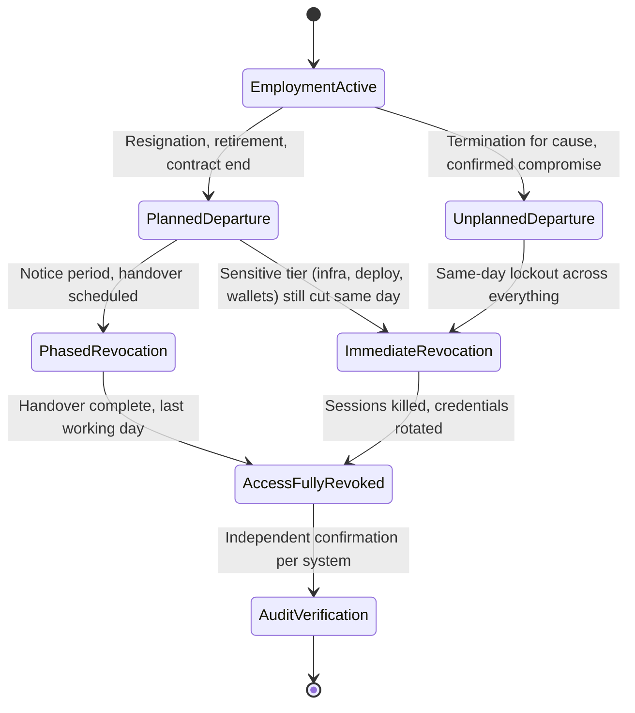
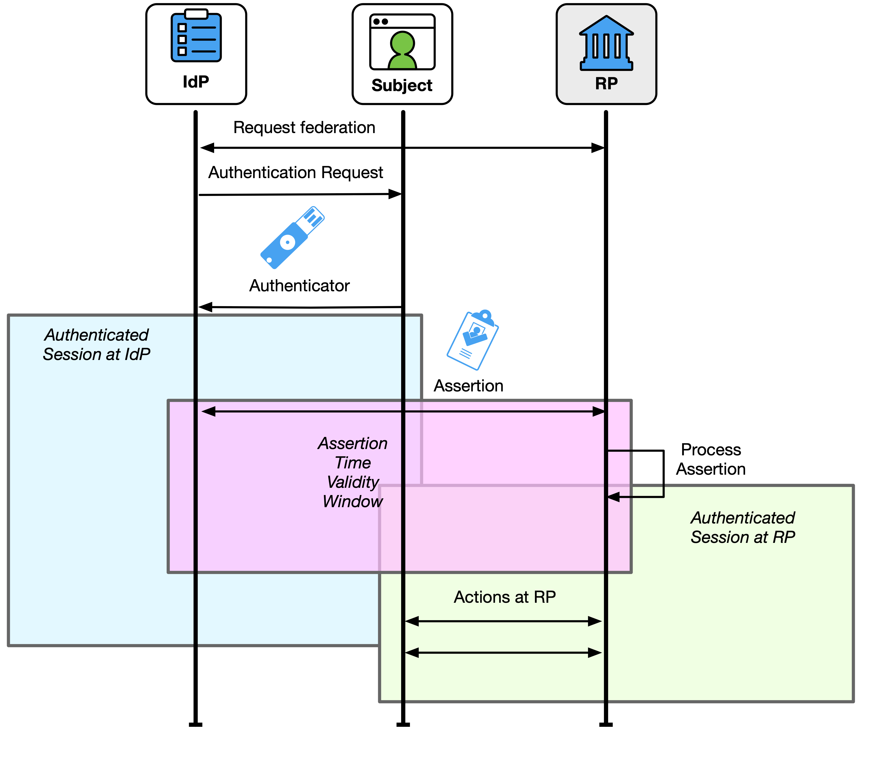
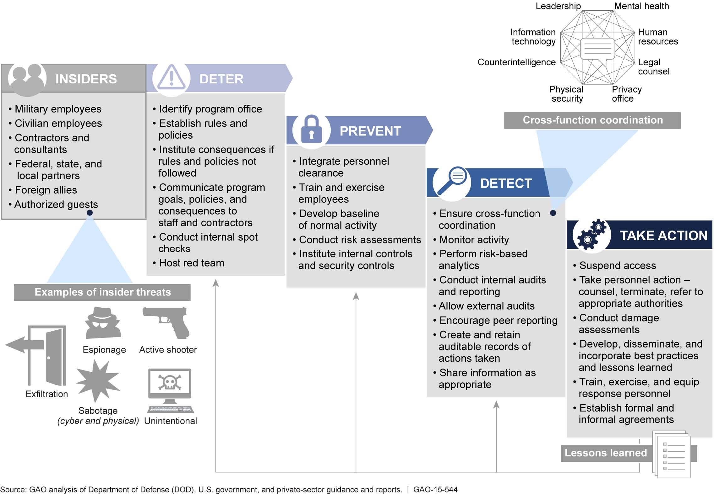
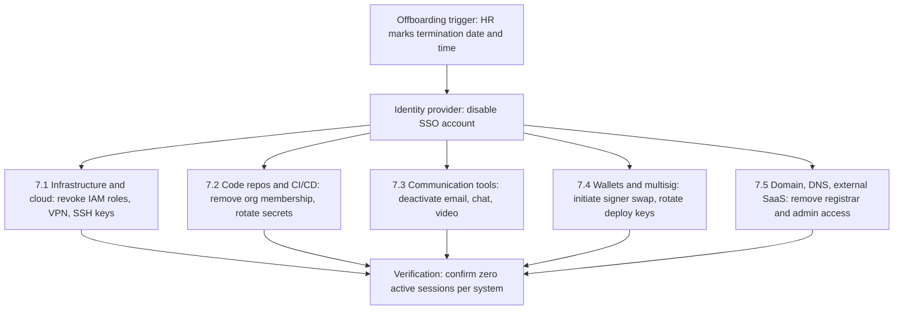
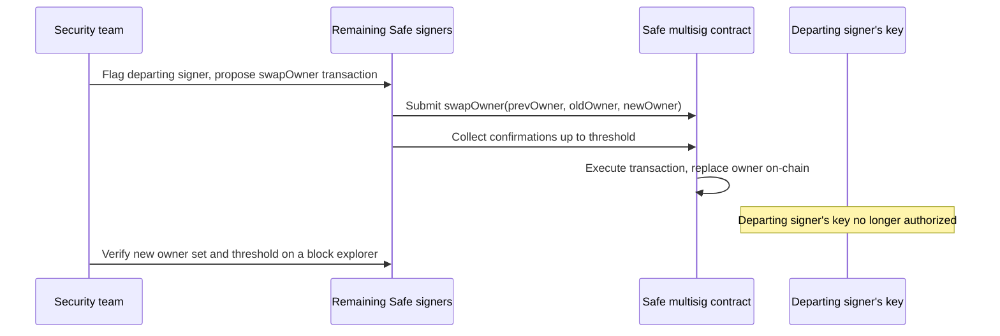

# Part 3: Offboarding

[Back to Handbook contents](index.md) | [Series index](../index.md)

**Offboarding** is where lifecycle security gets tested against a clock: every extra hour an account stays live is an hour a departing insider, or whoever compromised their credentials on the way out, can use it. Web3 organizations carry higher offboarding stakes than a typical SaaS company, because the credentials behind a departing engineer can include a multisignature (**multisig**) signer key or live deploy authority over a contract holding user funds, not just a dashboard login. This Part walks the full sequence: what triggers a departure, what has to be revoked and in what order, how keys get recovered and rotated, and the audit trail and legal coordination that close the departure out cleanly.

---

## 6. Offboarding Triggers and Timing

The trigger event decides everything downstream: who gets notified, how fast access dies, and whether the departure follows the calm choreography of a two-week notice or the urgency of a same-day lockout. Misclassify the trigger and either legitimate handover work gets disrupted, or a hostile actor keeps a working credential for days longer than it should exist.

### 6.1 Planned and Unplanned Departures

A resignation with standard notice, a retirement, a contract reaching its agreed end date, or a scheduled role change all count as planned departures: the organization knows the date in advance and can sequence revocation around a handover. Termination for cause, a confidential reduction in force, sudden incapacity or death, and the discovery of an active insider compromise are unplanned: the organization does not control the timeline and often does not want the departing person to know the exact moment access disappears.

Web3 firms face an unplanned-trigger scenario that most companies do not: the discovery that an already-hired, currently active worker is compromised or fraudulent. Coinbase's May 2025 disclosure is the sharpest recent example. Cybercriminals bribed a small number of overseas customer-support contractors to exfiltrate account data on a subset of customers; Coinbase reported that under 1% of monthly active users were affected, no passwords or private keys were exposed, the criminals demanded a $20 million ransom that Coinbase refused, and the company estimated remediation and customer reimbursement costs at up to $400 million while offering its own $20 million bounty for information on the attackers ([Coinbase 2025 data breach, Wikipedia summary of public disclosures](https://en.wikipedia.org/wiki/Coinbase)). The response there was not a scheduled **offboarding**: it was immediate, targeted revocation of specific contractor accounts the moment compromise was confirmed, run by security rather than HR. The same emergency-trigger logic applies to a worker later identified as part of a fraudulent employment scheme, such as the pattern of Democratic People's Republic of Korea (DPRK) nationals obtaining remote IT and engineering roles under false identities; that hiring-side threat is covered in depth in the Hiring, Remote Work, and **Insider Threat** Handbook (05), but the offboarding response to a confirmed case follows the unplanned, emergency path described here.

| Trigger | Category | Typical lead time | Primary owner |
|---|---|---|---|
| Resignation with notice | Planned | 2 to 4 weeks | HR (Human Resources) and manager |
| Retirement | Planned | Weeks to months | HR |
| Contract or engagement end | Planned | Known in advance | Procurement and HR |
| Termination for cause | Unplanned | Same day | Security, HR, Legal |
| Reduction in force | Unplanned (scheduled but confidential) | Hours | HR and Security |
| Insider compromise or fraud confirmed | Unplanned, emergency | Minutes to hours | Security |
| Sudden incapacity or death | Unplanned | Immediate, sensitive handling | HR and Legal |

### 6.2 Immediate vs. Phased Revocation

Immediate revocation cuts every credential the moment the trigger fires: same instant for a security incident, same day for a termination for cause. Phased revocation stages access removal across a notice period, holding lower-risk access (read-only tools, calendar, general email) open for handover while pulling high-blast-radius access first regardless of how amicable the departure is. Even a fully planned, friendly resignation should treat production infrastructure, deploy credentials, and wallet or **multisig** authority as immediate-revocation items on the last working day; phasing is appropriate for handover-supporting access, not for anything that can move funds or ship code.

The control basis for this timing comes from [NIST Special Publication 800-53 Revision 5](https://csrc.nist.gov/pubs/sp/800/53/r5/upd1/final), whose Personnel Security family control PS-4 (Personnel Termination) requires disabling system access within an organization-defined time period on the date of termination and retrieving all security-related organizational property, coordinated with the **Access Control** family's AC-2 (Account Management), which governs disabling, removing, and reviewing accounts when the individual's need for access ends. Most mature Web3 organizations interpret "organization-defined time period" as same day for anything unplanned and same day for the sensitive tier even on planned departures.



*Figure 6. Departure trigger flows into a revocation model. Even a planned departure routes its highest-risk access through the immediate path.*


*Figure. Federation creates at least two independently expiring sessions: one at the identity provider and one at the relying party. Disabling the central account does not prove every relying-party session has ended, so offboarding must pair IdP revocation with downstream session termination or a deliberately short relying-party timeout. Source: [NIST SP 800-63C-4, Session Management](https://pages.nist.gov/800-63-4/sp800-63c/GenIdP/), public domain (U.S. government work).*

### 6.3 Risk of Orphaned Accounts and Unrevoked Credentials

An account left active after its owner leaves is not a passive risk, it is an attack primitive with a name. [MITRE ATT&CK technique T1078, Valid Accounts](https://attack.mitre.org/techniques/T1078/), documents adversaries specifically seeking out "inactive accounts: for example, those belonging to individuals who are no longer part of an organization," because, as the technique page notes, "the original account user will not be present to identify any anomalous activity." An orphaned account is worse than a stolen one from a detection standpoint: nobody is watching it, nobody expects to see a login notification from it, and it often carries whatever standing privilege it had on the departing person's last working day, unreduced.

The risk runs in both directions during the **offboarding** window itself. Beyond an outsider later abusing a forgotten credential, a departing insider with advance knowledge of their own termination date has a narrow window to act against the organization before access is cut: locking out administrators, deleting resources, or revoking others' access. [MITRE ATT&CK T1531, Account Access Removal](https://attack.mitre.org/techniques/T1531/), catalogs exactly this pattern, noting that adversaries (a category that includes malicious insiders) disable accounts, change passwords, and remove administrative permissions to disrupt availability, and that the technique "cannot be easily mitigated with preventive controls since it is based on the abuse of system features" already granted to the account. The defense is timing discipline, not a single control: classify the trigger correctly (6.1), choose the revocation model before the person is notified (6.2), and never leave a gap between notification and lockout that a departing insider could exploit. Password resets alone are insufficient against either direction of this risk, because a live session token, an active API key, or an already-cached cloud credential survives a password change; revocation has to invalidate sessions and rotate tokens, not just the login.


*Figure. A government-analyzed framework for structuring an insider-threat program end to end; the "Take Action" phase, suspend access, take personnel action, conduct damage assessments, is the same terminal step this chapter's revocation timing exists to make fast and complete. Source: [U.S. Government Accountability Office, GAO-15-544, via Wikimedia Commons](https://commons.wikimedia.org/wiki/File:Figure_3-_GAO%27s_Framework_of_Key_Elements_To_Incorporate_at_Each_Phase_of_DOD%27s_Insider-Threat_Programs_(19259572132).jpg), public domain (U.S. government work).*

---

## 7. Access Revocation

With the trigger classified, revocation has to reach every system that trusted the departing person, not only the ones IT remembers to check. The fan-out below is the shape every **offboarding** ticket should follow.



*Figure 7. A single trigger fans out across five independent domains. Each has its own credential model, so disabling the identity provider (IdP) account alone does not close all five.*

### 7.1 Infrastructure and Cloud Access

Cloud consoles (AWS, Google Cloud, Azure) grant access through Identity and Access Management (IAM) users, roles, and long-lived access keys that a single sign-on (**SSO**) logout does not automatically invalidate; an already-issued cloud session token or access key stays valid until it is explicitly revoked or expires on its own schedule. Revocation here means disabling the IAM user or federated role binding, deleting any access keys issued directly to that identity, revoking VPN certificates and Secure Shell (SSH) keys added to bastion hosts or servers, removing the person from Kubernetes **role-based access control** (RBAC) bindings, and rotating any break-glass or emergency-access credential they knew. Treat every credential type separately: a disabled SSO account with a still-valid AWS access key is not offboarded, it is half-offboarded.

- Disable or delete the IAM user and any role-assumption trust relationships naming them individually
- Revoke and delete access keys, not just deactivate the console password
- Remove SSH public keys from `authorized_keys` on every host they could reach, including jump boxes
- Pull VPN client certificates and any static VPN credentials
- Audit and rotate shared break-glass credentials they had access to

### 7.2 Code Repositories and CI/CD

Removing someone from a GitHub organization revokes their access to private repositories and private forks, though GitHub notes the person may retain local copies of code they already downloaded, and membership records are retained for reinstatement for three months after removal ([GitHub documentation, removing a member from your organization](https://docs.github.com/en/organizations/managing-membership-in-your-organization/removing-a-member-from-your-organization)). Critically, org removal by itself does not revoke personal access tokens (PAT), SSH keys, or OAuth application grants tied to that individual's personal account; for organizations using SCIM-based provisioning or GitHub Enterprise Managed Users, removal must also flow through the **identity provider** to fully take effect, per the same documentation. Continuous integration and continuous delivery (CI/CD) pipelines add a second layer: rotate any secret the person could read from Actions secrets, deploy keys, or signing keys, since a removed collaborator's local clone or cached credential could otherwise still authenticate a pipeline run.

```bash
# Remove a departing engineer from the GitHub organization
gh api -X DELETE "/orgs/ACME/members/departing-user"

# Audit org-scoped personal access tokens still associated with them
gh api "/orgs/ACME/personal-access-tokens" --paginate \
  | jq '.[] | select(.owner.login=="departing-user")'

# Rotate any CI/CD secret they could have read or exported during their tenure
gh secret set DEPLOY_KEY --org ACME --body "$(cat new_deploy_key)"
```

### 7.3 Communication and Collaboration

Email, chat (Slack, Discord, Telegram, all common in Web3 teams that maintain a public community presence alongside internal channels), video conferencing, ticketing systems, and shared password managers all need explicit deactivation, and email is the one channel where immediate deletion is usually wrong: set a defined forwarding or legal-hold window instead, since active conversations and legal discovery obligations often outlive the employee. Discord and Telegram carry a blind spot the other tools don't: bot tokens and server-owner or admin roles are frequently issued to a single named individual rather than a service account, and that bot token keeps working with full server privileges until someone explicitly rotates it, regardless of whether the human's personal account is removed from the server. Inventory every bot token, webhook, and integration credential the departing person could have generated, not just their personal login.

### 7.4 Wallets, Keys, and Multisig Roles

This is the domain most SaaS **offboarding** checklists never anticipate and Web3 organizations cannot skip. Safe (formerly Gnosis Safe), the most widely deployed smart-contract **multisig**, manages owners through four functions defined in its `OwnerManager` contract: `addOwnerWithThreshold`, `removeOwner`, `swapOwner`, and `changeThreshold`, all of which carry an `authorized` modifier requiring the call to be a self-executed Safe transaction, meaning it must itself be signed by enough existing owners to meet the current threshold ([Safe smart contracts, `OwnerManager.sol`](https://github.com/safe-global/safe-smart-account/blob/main/contracts/base/OwnerManager.sol)). That has a direct operational consequence: removing a departing signer is itself a multisig action that needs the cooperation of the remaining signers, which means signer offboarding has to be planned and, wherever possible, executed before the last working day, not attempted afterward when the departing signer's cooperation can no longer be assumed and the remaining signers may sit right at the threshold. Prefer `swapOwner`, which atomically replaces the departing owner with a new one in a single transaction, over a separate remove-then-add sequence that leaves the Safe at a reduced effective owner count in between.



*Figure 8. Multisig signer offboarding is an on-chain transaction the remaining signers must execute, not a settings toggle in an admin panel.*

Beyond multisig seats, cover single-signature deploy keys and hot wallets used in deployment scripts (rotate to a freshly generated keypair and sweep any residual balance) and personal hardware wallets used to co-sign treasury transactions (physically retrieve the device where possible; where retrieval is not feasible, treat the key as compromised and rotate the Safe owner regardless, since an externally owned account key that may still be in someone's possession cannot be partially trusted).

### 7.5 Domain, DNS, and External Accounts

Domain registrar and Domain Name System (DNS) provider consoles, content delivery network (CDN) dashboards, cloud email administration (Google Workspace or Microsoft 365 admin roles), payment processor and analytics dashboards, and social media or Discord server ownership all carry standing admin power that a general **SSO** deprovisioning sweep can easily miss, because these accounts are often created directly with the vendor rather than federated through the corporate IdP. Registrar and DNS access is the highest-blast-radius item on this list: whoever controls DNS for a live dApp's front-end domain controls where every user's browser goes, a risk the CDN and Front-End Supply Chain Handbook (01) and the DNS and Hosting Security Handbook (02) both treat as a primary **attack surface**. Maintain a living inventory, a spreadsheet at minimum or an identity governance and administration (IGA) tool at scale, mapping every external account to a named owner, so revocation does not depend on someone remembering which contractor signed up for which SaaS product eighteen months earlier.

---

## 8. Asset and Key Recovery

Revocation removes authorization; recovery closes out the physical and cryptographic material that authorization was attached to. Skipping this step leaves working keys sitting on a device nobody is tracking.

### 8.1 Company Devices and Credentials

Laptops, phones, hardware security keys, hardware wallets, access badges, and any printed material containing sensitive information all need a defined return path with a deadline, not an open-ended "whenever is convenient." Where a device cannot be retrieved promptly, mobile device management (MDM) tooling should remote-wipe it before physical return completes, and any device being reissued to a new hire should be sanitized according to [NIST Special Publication 800-88 Revision 1](https://csrc.nist.gov/pubs/sp/800/88/r1/final), which defines media sanitization as rendering "access to target data on the media infeasible for a given level of effort" and provides technique guidance for clearing, purging, and destroying different media types.

| Asset | Action | Owner |
|---|---|---|
| Laptop / desktop | Remote wipe if not returned same day; sanitize per NIST SP 800-88 before reissue | IT |
| Phone (company-owned) | Remote wipe, deregister from MDM | IT |
| Hardware security key (YubiKey) | Deregister from every service, physically collect or disable | Security |
| Hardware wallet | Physically collect; if uncollectable, rotate any Safe or account it co-signed | Security |
| Access badge | Deactivate in physical access system same day | Facilities/Security |
| Printed sensitive material | Confirm return or witnessed destruction | Manager |

### 8.2 Key Rotation Where Necessary

Revoking and rotating are different actions with different costs, and conflating them either wastes effort or leaves risk on the table. Revocation removes authorization for a credential that never left recoverable form in the departing person's hands: a short-lived cloud session token, or a key bound to hardware that never exports its private material. Rotation issues entirely new key material because the old key may have been copied: a software wallet's **private key**, a Key Management Service (KMS) export the person downloaded, or a plaintext secret sitting in a local `.env` file they had read access to. The decision rule is conservative by design: rotate whenever there is any doubt about whether the departing person could have exported the key, and reserve simple revocation for credentials that were architecturally incapable of leaving their original, access-controlled location. For a Safe **multisig**, `swapOwner` (Section 7.4) is the rotation mechanism; for a single-signature deploy or admin key, mandate full rotation to a new address and migrated authority whenever there is doubt, since an externally owned account's private key offers no equivalent of a partial-trust state the way a multisig's threshold does.

### 8.3 Documentation and Handover

A departure that removes access without transferring knowledge trades one risk for another: the account is closed, but nobody left on the team knows how the disaster-recovery Safe was configured, where a split **seed phrase**'s other shares live, or which runbook step the departing engineer always did manually and never wrote down. Handover documentation should update the infrastructure and code ownership records, reassign open pull requests and issues, update `README` and `CODEOWNERS` maintainer lists, and remove the departing person from any secrets-escrow or key-custodian role, replacing them with a named successor before the last working day rather than after. Treat this as a security deliverable, not a courtesy: undocumented, single-person operational knowledge is itself an availability and recovery risk once that person is gone.

---

## 9. Checklist and Documentation

A checklist only earns its name if it is actually run and someone signs off that each line happened; an unexecuted template is a false sense of coverage.

### 9.1 Offboarding Checklist Template

Structure the template by phase rather than by system, so the same document works whether the trigger is planned or a same-day emergency; unplanned departures simply compress every phase into hours instead of weeks.

| Phase | Action | Owner | Deadline | Verified |
|---|---|---|---|---|
| Trigger confirmed | Classify planned vs. unplanned, select revocation model | HR / Security | T0 | |
| Notification | Notify IT, Security, Legal, and the person's manager | HR | T0 + 1 hour | |
| Sensitive-tier lockout | Cut infra, deploy, wallet, and multisig access (Sections 7.1, 7.2, 7.4) | Security | T0 (same day, always) | |
| Standard-tier lockout | Disable SSO, email, chat, ticketing (Sections 7.1, 7.3) | IT | T0 to last day | |
| External accounts | Revoke registrar, DNS, external SaaS admin (Section 7.5) | Security | Last day | |
| Asset return | Collect devices, badges, hardware keys (Section 8.1) | IT / Facilities | Last day + 3 days | |
| Key rotation | Rotate any key the person could have exported (Section 8.2) | Security | Last day + 3 days | |
| Handover | Reassign ownership, update runbooks (Section 8.3) | Manager | Last day + 5 days | |
| Legal close-out | Reaffirm NDA, confirm data return (Chapter 10) | Legal / HR | Last day + 5 days | |
| Audit | Independent verification across every system (Section 9.2) | Security lead | T0 + 30 days | |

### 9.2 Verification and Audit

Revocation that nobody independently checks is a claim, not a control, and audit frameworks treat it that way: a System and Organization Controls 2 (SOC 2) auditor will routinely sample terminated employees and ask for timestamped proof of prompt access removal, not just a completed checklist. Build that evidence in as you go rather than reconstructing it later: an **identity provider**'s deprovisioning event log, generated automatically when using the System for Cross-domain Identity Management (**SCIM**) protocol to synchronize account state across connected systems ([RFC 7644, SCIM Protocol](https://datatracker.ietf.org/doc/html/rfc7644)), gives a machine-generated timestamp that a manually filled checklist cell cannot match. Follow the initial revocation with an independent confirmation, ideally by someone other than whoever executed it, 24 to 72 hours after the trigger, checking for zero active sessions, zero valid API keys or tokens, and zero remaining multisig ownership, and fold that same person's access status into the organization's next periodic access review as a second, later check.

---

## 10. Legal and HR Coordination

**Offboarding** is not purely a technical exercise: it closes a legal relationship, and that closure needs Legal and HR at the table alongside Security, not informed after the fact.

### 10.1 Confidentiality and Non-Disclosure

The exit conversation should explicitly reaffirm the confidentiality and non-disclosure agreement (NDA) and any intellectual property assignment terms the person signed at hiring, remind them which obligations survive departure (trade secrets, unreleased roadmap detail, pending token generation events), and, for Web3 organizations specifically, cover any restrictions on trading the organization's token, or a closely related project's token, while still in possession of material non-public information, along with vesting and lock-up terms that continue after employment ends. Enforceability of non-disclosure and non-compete language varies substantially by jurisdiction and by worker classification (employee versus contractor), so this section is a coordination checkpoint for qualified legal counsel to confirm what is actually enforceable where the departing person is based, not a security-team template to apply uniformly.

### 10.2 Return of Assets and Data

Physical asset return is covered in Section 8.1; this section covers data, including data the organization holds about the departing person and data the person holds that belongs to the organization: a personal wallet used for company transactions, a personal GitHub account holding an org-granted personal access token, or personal cloud storage synced with company documents. In jurisdictions covered by the General Data Protection Regulation (GDPR), Article 17's right to erasure requires an organization to delete personal data once it is "no longer necessary in relation to the purposes for which [it was] collected," but that obligation coexists with separate retention duties, such as payroll, tax, or access-log records tied to a legal or compliance requirement, so a departing employee's erasure request does not automatically mean total deletion ([GDPR Article 17](https://gdpr-info.eu/art-17-gdpr/)). Set the data retention schedule for personnel and access records jointly with Legal and HR before the organization's first departure, so the boundary between "must delete" and "must retain" is a documented policy decision rather than an improvised judgment call made under the pressure of an actual exit.

---

**Key controls for Part 3**

- Classify every departure as planned or unplanned before choosing a revocation model, and route the sensitive tier (infrastructure, deploy, wallets, **multisig**) through immediate same-day revocation regardless of which model applies.
- Revoke sessions and tokens, not just passwords; a disabled **SSO** login does not invalidate an already-issued cloud access key or session token.
- Plan multisig signer removal before the last working day: `swapOwner` requires the cooperation of the remaining signers and cannot be executed unilaterally after the departing signer is gone.
- Rotate, don't just revoke, any key the departing person could plausibly have exported or copied.
- Maintain a living inventory of external accounts (registrar, DNS, SaaS admin) mapped to a named owner, so revocation never depends on institutional memory.
- Verify revocation independently, 24 to 72 hours out, and keep timestamped evidence (**SCIM** deprovisioning logs, screenshots, exported audit trails) for SOC 2 and similar audits.
- Coordinate confidentiality reaffirmation, data return, and retention decisions with Legal and HR as a standing process, not an ad hoc conversation at each departure.

