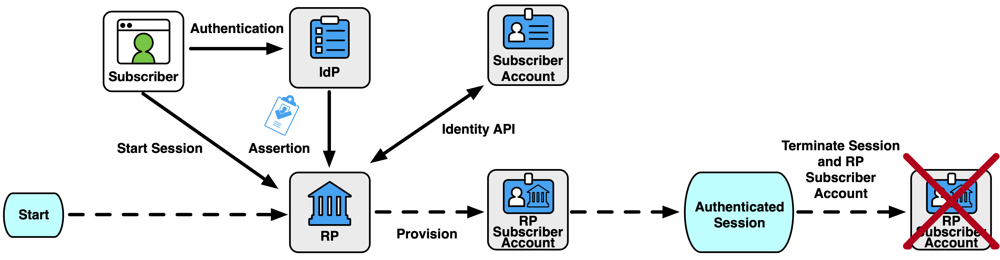
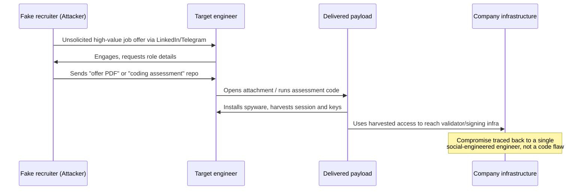
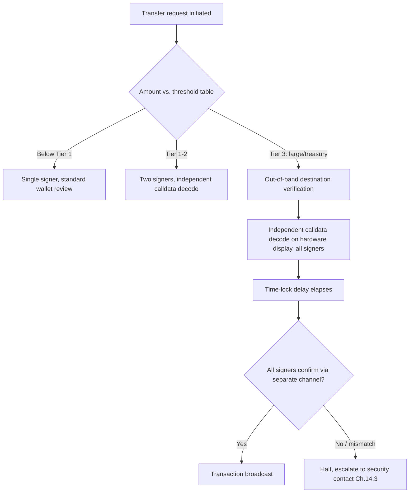
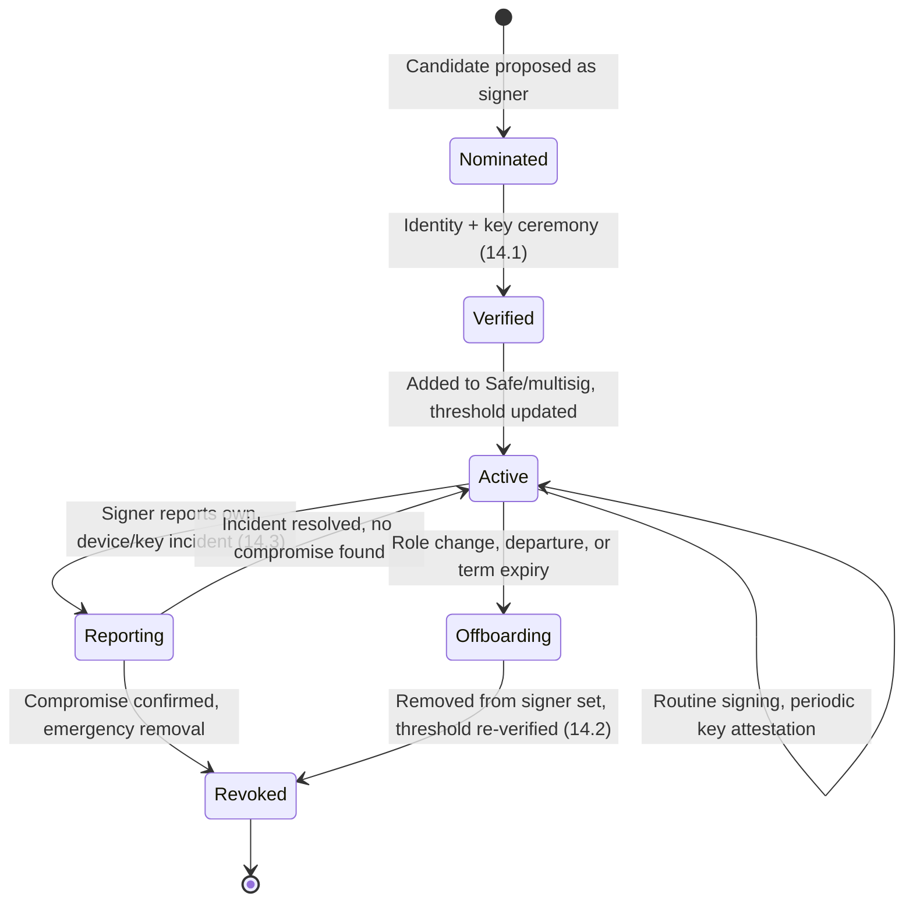

# Part 4: Special Considerations

[Back to Handbook contents](index.md) | [Series index](../index.md)

Parts 1 through 3 covered the general lifecycle: how a person enters, how they are provisioned, and how they leave. Some roles and working arrangements break that general model and need their own controls, because the person is not an employee, is never in the same room as the rest of the team, or holds a key that can move the treasury. This part covers contractors, remote and distributed teams, treasury and admin roles, **multisig** signer lifecycle, and what happens when a key role has no backup.

---

## 11. Contractors and Short-Term Roles

Web3 organizations run on contractors more than most industries realize. Solidity auditors, protocol-specific developers, community managers, and exchange-integration partners are frequently engaged for a single sprint or a single audit cycle, and DAOs in particular often have no full-time headcount at all, only a rotating set of contributors paid per contribution. That structure creates a lifecycle gap: contractors are commonly provisioned with the same urgency as employees, because the work cannot wait, but offboarded with far less urgency, because nobody owns "contractor **offboarding**" the way HR owns employee termination. An engagement that was supposed to run four weeks quietly becomes six months, and the repository access, Slack membership, and Safe delegate role granted on day one are still live long after the invoice was paid.

This gap is precisely what the Democratic People's Republic of Korea (DPRK) remote-worker scheme is built to exploit. Since at least 2022, DPRK intelligence services (principally the Reconnaissance General Bureau) have trained operatives to apply for remote software engineering, blockchain development, and IT contractor roles on platforms such as LinkedIn and Upwork, using stolen identities, AI-enhanced photos, and in several documented cases real-time deepfake video to pass interviews ([Wikipedia: North Korean remote worker infiltration scheme](https://en.wikipedia.org/wiki/North_Korean_remote_worker_infiltration_scheme)). Once hired, the operative asks for the company laptop to be shipped to a US-based "facilitator" who runs a laptop farm, so that traffic appears domestic while the actual work is done from North Korea or a China-based safehouse. The FBI, State Department, and Treasury have issued joint public warnings on this specific pattern, OFAC sanctioned two individuals and four DPRK front companies in January 2025 for operating these placement schemes, and the Department of Justice indicted 14 North Korean nationals in December 2024 for generating an estimated $88 million through fraudulent IT contracting over six years, with a further indictment in January 2025 covering two US-based facilitators who placed operatives in more than 60 companies. Security-awareness vendor KnowBe4 disclosed publicly that it unknowingly hired one such operative for a Principal Software Engineer role in mid-2024; malware began loading from the newly shipped Mac workstation within minutes of delivery, and the company's SOC contained the device the same evening after EDR alerts fired ([KnowBe4, "How a North Korean Fake IT Worker Tried to Infiltrate Us"](https://blog.knowbe4.com/how-a-north-korean-fake-it-worker-tried-to-infiltrate-us)). The OWASP Web3 Attack Vectors Top 15 formalizes this as its own category, [WA15: Nation-State Infiltration via Fake Hiring and Malicious OSS Contributions](https://scs.owasp.org/sctop10/Web3-Attack-Vectors-Top15/), precisely because crypto-native companies are disproportionately targeted: the payout is directly in cryptocurrency, and remote-first hiring norms make the identity-verification gap wider than at a traditional enterprise.

Treat every contractor engagement as a scoped, time-boxed grant rather than a lighter version of employment. Fix an end date in the engagement letter or statement of work and set access expiry to match it in whatever **identity provider** or **SSO** gates repository, Slack, and wallet access; do not rely on a human remembering to revoke. Verify identity for any contractor who will touch code, infrastructure, or funds with the same rigor as an employee: government ID checked over a live video call (not a photo upload), a real-time conversation where the interviewer can ask unscripted follow-up questions, and payment to a bank account or verified payment processor rather than to a wallet address supplied on day one with no other proof of banking identity. Refuse requests to ship equipment to an address that does not match the verified identity, refuse requests to route pay through a third party "for tax reasons," and treat a contractor who declines camera-on interviews or avoids synchronous calls entirely as a finding requiring escalation, not an eccentricity.

*Figure. Ephemeral provisioning is the safest default for one-off reviewers and short engagements that do not need persistent state: the relying party consumes the validated assertion without creating a durable local account. Where the application supports it, this removes an orphaned-account class instead of merely promising to clean it up later. Source: [NIST SP 800-63C-4, Ephemeral Provisioning](https://pages.nist.gov/800-63-4/sp800-63c/GenIdP/), public domain (U.S. government work).*

| Signal | Why it matters | Response |
|--------|----------------|----------|
| Candidate insists on text-only interviews or frequent audio/video glitches during calls | Common cover for real-time voice-changing or deepfake tooling | Require at least one unscheduled, camera-on call before extending an offer |
| Requested equipment ship-to address differs from stated residence, or is a mail-forwarding service | Laptop-farm pattern used to route hardware to a facilitator | Verify address against ID; decline mismatches |
| Multiple simultaneous contracts with overlapping working hours across companies | Consistent with a single operative servicing several placements at once | Cross-check references' contactability independently, not via numbers the candidate supplies |
| Insists on cryptocurrency-only payment with no invoicing or tax documentation | Avoids the banking-identity trail that a legitimate contractor would generate | Route payment through a verified payroll/contractor platform, not a bare wallet address |
| Github/portfolio history is thin, recently created, or forked with minimal original commits | Fabricated résumé pattern seen across documented DPRK IT worker cases | Weight technical screening over portfolio claims; verify claimed past employers directly |

## 12. Remote and Distributed Teams

Most Web3 protocols are remote-first by default, often distributed across a dozen time zones with no shared office and no in-person **onboarding** day. That model has real advantages, but it removes a control that traditional organizations rely on without ever naming it: the physical presence check. A new hire who shows up to an office, badges in, and sits next to a colleague has passed an identity check nobody wrote down. A remote hire who exists only as a Zoom window and a Slack handle has passed no such check, and the entire trust chain rests on whatever verification happened during recruiting.

The March 2022 Ronin Network bridge hack is the reference incident for how this gap gets weaponized against a specific engineer rather than against the company broadly. Attackers attributed to North Korea's Lazarus Group approached a senior Axie Infinity/Sky Mavis engineer through a fake recruiting process on LinkedIn, ultimately sending a PDF disguised as a generous job offer; opening it deployed spyware that compromised the engineer's system and, from there, enough validator infrastructure for the attacker to forge withdrawal signatures and drain roughly $625 million in ETH and USDC, discovered only six days later ([Wikipedia: Ronin Network](https://en.wikipedia.org/wiki/Ronin_Network); FBI attribution, April 2022). The lure was not aimed at a low-privilege contractor; it was aimed precisely at the person with the most access, using the same recruiting channels a legitimate offer would use. The OWASP Web3 Attack Vectors Top 15 captures this pattern as [WA05: Fake Interview and Video Call Social Engineering](https://scs.owasp.org/sctop10/Web3-Attack-Vectors-Top15/), and it recurs constantly: fake recruiters, fake "technical assessment" repositories laced with malicious dependencies, and fake video-call clients that request a codec plugin install before the call can start.

*Figure 1. The fake-recruiter pattern behind the Ronin bridge compromise: the attack targets the person, not the protocol, and the payload rides in through a channel (recruiting) that security tooling rarely inspects.*

Distributed teams need controls that substitute for the physical presence check they never had. Verify a new remote hire's identity with a live, camera-on video call and government ID at the start of the relationship, and repeat spot checks are reasonable for high-privilege roles, not just at hire. Issue company-managed, EDR-monitored hardware rather than allowing personal devices for anyone who will touch signing keys, deploy credentials, or admin panels, because a company-owned device is the only place a security team can actually detect the Ronin-style payload landing. Train every engineer, not only recruiters, that unsolicited job offers, "urgent" coding assessments from unfamiliar recruiters, and requests to install unfamiliar software to join a call are a named attack pattern with a name they should recognize (WA05), not a generic phishing reminder. Route all recruiting-adjacent contact for current staff, including "market research" calls and unsolicited advisory offers, through a channel the security team can see, because the entry point for a distributed-team compromise is social before it is technical.

## 13. High-Risk Roles (Treasury, Deploy Keys, Admin)

Not every role carries the same **blast radius** if it is compromised. A support agent's account, if hijacked, produces an information-disclosure incident; a treasury signer's key, if hijacked, produces a headline. This chapter narrows from the general **onboarding** and offboarding process in Parts 2 and 3 to the specific controls that apply once a role touches funds, deploy credentials, or protocol admin functions directly.

### 13.1 Treasury Operations: Classification, Registration, Enhanced Controls

Start by classifying every wallet and key the organization holds, because a control set applied uniformly to a $500 gas-refill hot wallet and a $50 million treasury cold **multisig** is either too weak for the treasury or too heavy for the hot wallet. Register each wallet in a single inventory that names its purpose, its custody tier, its signers, and its threshold, and review that inventory on a fixed cadence rather than only when someone remembers to. This registration step matters independently of the technical controls: incident responders and auditors repeatedly find organizations that cannot answer "how many wallets do we control" on demand, which means they also cannot answer "which of these needs revocation" during an active incident.

| Tier | Example | Custody model | Enhanced controls |
|------|---------|---------------|-------------------|
| Operational | Gas refill, testnet faucet | Hot wallet, single signer | Hard cap on balance; auto-refill from treasury, never manual top-up above cap |
| Working capital | Market-maker inventory, exchange deposit wallet | Hot or warm wallet, 2-of-3 multisig | Daily balance cap tied to trading volume; alerting on any balance above threshold |
| Treasury reserve | Protocol treasury, DAO reserve | Cold multisig, hardware-signed, 4-of-7 or higher | Time-locked large withdrawals; geographically and organizationally distributed signers; no single employer relationship spans a majority of signers |
| Emergency/pause authority | Circuit-breaker admin key | Cold multisig or timelocked contract role | Separate signer set from treasury reserve; documented, rehearsed activation runbook |

Enhanced controls scale with tier. Treasury reserve wallets should never share a signer majority with any other wallet tier, so that compromise of the operational hot wallet's signer set cannot cascade. Signer diversity matters as much as signer count: a 4-of-7 multisig where five signers are employees of the same company reporting to the same executive is not meaningfully more resistant to coercion or collusion than a 3-of-5 with genuinely independent signers, a point directly relevant to the wrench-attack and insider-collusion categories in the OWASP Web3 Attack Vectors Top 15 ([WA11: Wrench Attacks and Physical Coercion](https://scs.owasp.org/sctop10/Web3-Attack-Vectors-Top15/); [WA12: Insider Threats and Collusive Abuse](https://scs.owasp.org/sctop10/Web3-Attack-Vectors-Top15/)).

### 13.2 Transaction Verification Protocols for Large Transfers

The single most consequential lesson from the crypto industry's largest hack to date is that **multisig** thresholds do not protect you if every signer trusts the same compromised interface. On 21 February 2025, Bybit's cold Safe{Wallet} multisig was used to route roughly $1.5 billion in ETH to an attacker-controlled address; forensic analysis by Elliptic and Arkham Intelligence attributed the theft to the Lazarus Group, and the FBI specifically named TraderTraitor actors. The attack did not break the multisig's cryptography. It compromised infrastructure at the third-party Safe{Wallet} provider so that the transaction data the signers reviewed in their browser did not match the transaction their hardware wallets actually signed: the signers saw a routine transfer and approved what was, in the underlying calldata, a contract upgrade that handed control of the cold wallet to the attacker ([Bybit hack summary and attribution](https://en.wikipedia.org/wiki/Bybit)). This is **blind signing** in its purest form, cataloged as [WA01: Multisig Hijacking](https://scs.owasp.org/sctop10/Web3-Attack-Vectors-Top15/) in the OWASP Web3 Attack Vectors Top 15, and it is why "we require N signatures" is not, by itself, a transaction-verification protocol.

A transfer above a defined threshold should never rely on the signing interface's rendered summary alone. Require every signer to independently decode and confirm the raw calldata (not merely the wallet UI's description of it) against the intended recipient, method, and amount, using a **hardware wallet**'s own display or an independent decoder, before signing. Verify the destination address through a channel separate from the one that requested the transfer, a callback to a known phone number or a pre-shared verification code, never a reply on the same thread that raised the request, which mirrors the **out-of-band verification** already required for business email compromise defense in the Incident Response Handbook (06). Tier the required verification to the transfer size so that routine flows are not bottlenecked while large flows get real scrutiny.

*Figure 2. Tiered transaction verification. Higher tiers add out-of-band checks and calldata decoding precisely because interface-level trust is what Bybit's attackers exploited, not the multisig math.*

Set a mandatory time-lock delay on withdrawals above the treasury reserve threshold, long enough that a compromised signing session can be detected and halted before funds move, and staff an on-call rotation that can act on that alert within the delay window. Log every transaction verification step, including who performed the out-of-band check and what channel they used, so that a post-incident review can determine whether the protocol was followed or bypassed.

## 14. Multisig and Protocol Signer Lifecycle

**Multisig** signers are a distinct role from "employee with a wallet." A signer's authority persists across employment changes unless someone actively removes it from the contract, which means the multisig lifecycle needs its own **onboarding**, offboarding, and incident channel layered on top of the general processes in Parts 2 and 3.

*Figure 3. The signer lifecycle runs in parallel with, not as a subset of, general employee offboarding: a departing employee's signer role must be revoked on-chain, which HR-driven account deprovisioning never touches.*

### 14.1 Joining a Multisig: Verification and Onboarding

Adding a signer is an on-chain, generally irreversible-without-consensus action, so verify before you add rather than trusting and revoking later. Confirm the candidate's identity through the same live, camera-on process used for high-risk hires (Chapter 12), independent of any prior working relationship, because an **insider threat** or a hijacked account inside the organization can request a signer addition just as convincingly as a legitimate one. Run a documented key ceremony: the candidate generates their signing key on a **hardware wallet** the organization did not ship them blind (verify the device's authenticity and firmware against the vendor's attestation), the public key or address is read aloud or shared over a verified channel and cross-checked against what gets submitted on-chain, and at least one other current signer witnesses the ceremony live. Add the signer and immediately update the documented threshold and signer registry from Section 13.1, including the new signer's backup and recovery contact for succession purposes (Chapter 15).

**Signer onboarding checklist**

- [ ] Candidate identity verified via live video call and government ID
- [ ] Hardware signing device sourced and verified independent of shipment from an unverified party
- [ ] Key ceremony conducted with at least one witnessing signer, address cross-checked over a separate channel
- [ ] New signer added on-chain; threshold re-confirmed to match the documented policy
- [ ] Signer registry and treasury inventory (13.1) updated with the new signer and their backup contact
- [ ] New signer briefed on the transaction verification protocol (13.2) and the incident reporting channel (14.3)
- [ ] New signer's security contact and succession backup recorded (Chapter 15)

### 14.2 Offboarding as Signer: Key and Role Handback

Signer **offboarding** is the step general employee offboarding (Part 3) is most likely to miss, because it requires an on-chain transaction, not a checkbox in an **identity provider**. Treat every departure, role change, or contract expiry that involves a signer as triggering its own workflow: remove the departing signer from the multisig and re-verify the threshold before, not after, any other offboarding step that might tip them off, mirroring the immediate-versus-phased revocation guidance in Chapter 6. Do not merely lower the threshold to compensate for a departing signer without first confirming the remaining signer set still meets the diversity requirement from Section 13.1; a threshold reduction that leaves four of five signers reporting to one manager quietly degrades the control the tier was designed to provide.

Require the departing signer to physically surrender or verifiably destroy any organization-issued hardware signing device, and if the device may have held a shared seed or backup material (it should not, per the succession guidance in Chapter 15), rotate anything derived from it. Confirm removal on-chain with a transaction hash logged in the signer registry, and have a remaining signer independently verify the new signer set and threshold rather than trusting the initiator's report. Where the departure is adversarial or the reason for departure itself raises suspicion, treat it as a security incident under Chapter 14.3 rather than a routine offboarding, and consider an out-of-cycle rotation of the **multisig** itself (deploying a new Safe and migrating funds) if there is any reason to believe the departing signer's key material was ever exposed beyond their control.

### 14.3 Incident Reporting and Security Contact for Signers

Every signer needs a named, always-available channel to report a suspected key or device compromise, and that channel needs to be faster and more direct than the general employee incident-reporting path in Part 2, because a delay of hours between a signer suspecting compromise and the organization acting on it is the difference between a near-miss and a Bybit-scale loss. Publish a dedicated security contact (a rotating on-call, not a single person who might be unreachable) that any signer can reach by phone or a pre-agreed secure channel at any hour, and rehearse the response: freeze pending transactions, verify the suspect signer's recent signing activity against what they recall approving, and be prepared to execute an emergency signer removal or full **multisig** migration under the pause authority defined in Section 13.1.

Signers should report proactively, not only after confirmed compromise: a lost or briefly unattended hardware device, a phishing attempt that specifically referenced their signer role, or an unfamiliar transaction request routed through an unusual channel are all reportable events under a no-blame policy, because a signer who hesitates to report a near-miss out of fear of scrutiny is exactly the gap an attacker like the Bybit intrusion team is counting on. Log every report, resolved or not, in the same registry used for treasury inventory and signer **onboarding**, so that a pattern of near-misses against a specific signer becomes visible before it becomes an incident.

## 15. Succession and Backup for Key Roles

A role with no backup is a single point of failure dressed up as an organizational chart entry, and Web3's history has two clean demonstrations of what happens when that single point of failure is also the only person who can move funds. In December 2018, QuadrigaCX founder and CEO Gerald Cotten died unexpectedly while traveling in India; he was the sole holder of the passwords to the exchange's cold wallets, and roughly C$250 million (about US$190 million) owed to some 115,000 customers became permanently inaccessible, a loss later found by Canadian regulators to be entangled with Cotten's own prior fraud rather than pure accident, but the succession failure was real regardless of motive: no other person in the organization could access the funds ([Wikipedia: QuadrigaCX](https://en.wikipedia.org/wiki/QuadrigaCX)). In 2023, the cross-chain bridge protocol Multichain collapsed after its founder, known publicly as "Zhaojun," was reportedly detained by Chinese authorities; because operational control of the protocol's MPC (multi-party computation) key infrastructure was concentrated around him, hundreds of millions of dollars in user funds across multiple chains were frozen with no other party able to authorize withdrawals, and the protocol never recovered.

Both incidents share the same root cause with different triggers: a founder or executive, not a technical vulnerability. Succession planning for key roles is therefore a security control, not an HR nicety, and it belongs in this handbook alongside **multisig** thresholds and **access revocation** because it addresses the same underlying risk, a single actor whose absence (voluntary, coerced, or fatal) can freeze or lose funds. NIST's guidance on contingency and continuity planning establishes the general principle that any function critical to operations needs a documented backup and a tested recovery path ([NIST SP 800-34 Rev. 1, Contingency Planning Guide for Federal Information Systems](https://csrc.nist.gov/pubs/sp/800/34/r1/final)); applied to Web3, that principle means no individual signer, deploy-key holder, or admin-role owner should be a true single point of failure, regardless of how much the organization trusts them personally.

**Succession planning matrix**

| Key role | Single point of failure risk | Required backup mechanism | Test cadence |
|----------|------------------------------|---------------------------|---------------|
| Multisig signer | Low if threshold and diversity (13.1) are correct | N-of-M design itself is the backup; no individual signer holds sole authority | Quarterly threshold and diversity review |
| Deploy key / contract owner (single-key patterns) | High if not migrated to multisig or timelock | Migrate to a Safe or timelocked governance contract; document emergency multisig re-key procedure | Annual, or immediately on any admin change |
| MPC or threshold-signature custody operator | High if operational knowledge is concentrated in one engineer or executive | Cross-train at least two additional operators; store recovery shares per the custody provider's documented multi-party procedure, never with one person | Semiannual recovery drill |
| Protocol admin/pause authority | High if held by a single wallet regardless of who controls it | Move to a multisig or council with defined quorum before mainnet launch, not after an incident | Documented in the emergency runbook (13.1) |
| Exchange or platform account owner (domain, cloud root, registrar) | High, and frequently overlooked because it is "just an account" | Documented secondary admin with independent MFA, escrowed per Handbook 02's domain and registrar guidance | Annual access review |

Build succession into **onboarding** for every key role from day one rather than retrofitting it after a departure: no signer should be added (14.1) without a documented backup contact and no admin credential should be issued without a second party who can act on it under a defined emergency process. Rehearse the succession path itself, not just the technical mechanism; a documented backup signer who has never actually executed a transaction is an unverified assumption, not a control.

---

**Key controls for Part 4**

- Treat contractor and short-term engagements as time-boxed, scoped grants with access expiry tied to the engagement's end date, and verify identity for any contractor touching code, infra, or funds with the same rigor as an employee.
- Recognize the DPRK fake-IT-worker and fake-recruiter patterns (OWASP WA05, WA15) by name in hiring and onboarding training, and require live, camera-on **identity verification** for every remote hire.
- Classify and register every wallet by tier (13.1), and never let a majority signer set on a treasury-tier wallet share a common employer or reporting line.
- Require independent, out-of-band calldata verification for any transfer above a defined threshold; a rendered UI summary is not proof of what a **hardware wallet** is actually signing (OWASP WA01).
- Run multisig signer onboarding and **offboarding** as a dedicated, on-chain lifecycle parallel to general employee provisioning, with a documented key ceremony and immediate on-chain removal on departure.
- Give every signer a fast, no-blame incident-reporting channel, and log near-misses alongside confirmed incidents.
- Document and rehearse succession for every key role before a departure forces it; QuadrigaCX and Multichain are what happens when that step is skipped.

