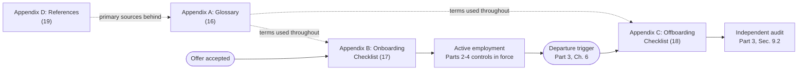

# Part 5: Appendices

[Back to Handbook contents](index.md) | [Series index](../index.md)

This part is the handbook's working reference layer, meant to be pulled up during a hire or a departure rather than read start to finish. It fixes the vocabulary from Parts 1 through 4 in a single glossary, packages the **onboarding** and **offboarding** checklists into printable, copy-ready templates, and points to the full bibliography behind every claim in the preceding parts.

*Figure 1. How the appendices fit the lifecycle. The glossary is a lookup table for the terms used in the checklists; the checklists are the operational output of Parts 2 and 3; the reference list is the evidence trail behind both.*

---

## 16. Appendix A: Glossary

The terms below are defined the way they are used in this handbook, not in the abstract. Each entry links back to the section that puts the term into practice, so a reader who lands here from a search engine can trace a definition to its operational context rather than stopping at a dictionary answer. Acronyms are expanded on first use, matching the convention used throughout Parts 1 through 4.

**Acceptable Use Policy (AUP).** The signed document setting rules for company devices, accounts, and data, including bring-your-own-device (BYOD) boundaries. Required of every hire before equipment or accounts are provisioned (Part 2, Section 2.2).

**AC-2 / AC-6.** The Account Management and **Least Privilege** controls in the Access Control family of [NIST Special Publication 800-53 Revision 5](https://csrc.nist.gov/pubs/sp/800/53/r5/upd1/final), cited throughout the handbook as the control basis for both provisioning and revocation timing (Part 2, Section 3.1; Part 3, Section 6.2).

**Background verification.** Pre-hire confirmation of identity, references, and where role-justified, a consumer report, run inside the Fair Credit Reporting Act (FCRA) and Equal Employment Opportunity Commission (EEOC) constraints that govern US hiring (Part 2, Section 2.1).

**Blind signing.** Approving a transaction based on a wallet interface's rendered summary without independently verifying the underlying calldata. The root failure mode behind the February 2025 Bybit theft (Part 4, Section 13.2).

**Break-glass credential.** A shared emergency-access credential intended for rare, high-urgency use. Every departing person who knew it triggers a mandatory rotation, not just a review (Part 3, Section 7.1).

**Calldata.** The raw, encoded data a blockchain transaction actually carries, as opposed to the plain-language summary a signing interface renders. A **hardware wallet**'s own display or an independent decoder is required to verify it directly for large transfers (Part 4, Section 13.2).

**Cold wallet / cold storage.** Key custody kept fully offline, the highest-assurance tier in the treasury classification table and the appropriate home for reserve funds (Part 4, Section 13.1).

**Deploy key.** A credential authorizing a smart-contract deployment or upgrade. Treated as a rotation, not a revocation, item on departure because it may have been exported to a local environment (Part 3, Section 8.2).

**DPRK remote-worker scheme.** A campaign placing North Korean operatives in remote IT and engineering roles under false identities, for hard-currency revenue and, in some cases, insider access. A pre-onboarding red flag (Part 2, Section 2.1) and a contractor-lifecycle risk (Part 4, Section 11).

**Endpoint Detection and Response (EDR).** Monitoring software required on any company-issued device used for infrastructure, code, or treasury access, and the mechanism that first detected the payload in the 2024 KnowBe4 fake-hire incident (Part 4, Section 12).

**Fair Credit Reporting Act (FCRA).** The US law requiring standalone written disclosure, candidate authorization, and a pre- and post-adverse-action process before a consumer report can be used in a hiring decision ([FTC guidance for employers](https://www.ftc.gov/business-guidance/resources/using-consumer-reports-what-employers-need-know); Part 2, Section 2.1).

**FIDO2 / passkey.** A phishing-resistant authentication standard using public-key cryptography bound to the legitimate site, issued during **onboarding** training rather than left to a one-time-code app ([FIDO Alliance](https://fidoalliance.org/passkeys/); Part 2, Section 4.1).

**General Data Protection Regulation (GDPR).** EU and UK data protection law whose Article 17 right to erasure governs how much of a departing employee's personal data must be deleted, subject to separate retention duties ([GDPR Article 17](https://gdpr-info.eu/art-17-gdpr/); Part 3, Section 10.2).

**Hardware wallet.** A dedicated device that generates and stores **private key** material without exposing it to a general-purpose computer, issued to every treasury or signer hire (Part 2, Section 3.4).

**Hot wallet.** An internet-connected wallet used for operational flows such as gas refills or market-making inventory, the lowest-assurance tier in the treasury classification and the one carrying the tightest balance caps (Part 4, Section 13.1).

**Identity and Access Management (IAM).** The systems (cloud IAM users and roles, identity providers) that grant and enforce access by identity rather than by shared credential (Part 3, Section 7.1).

**Identity Governance and Administration (IGA).** Tooling, or at minimum a maintained inventory, mapping every external account to a named owner so revocation does not depend on institutional memory (Part 3, Section 7.5).

**Immediate vs. phased revocation.** Immediate revocation cuts a credential the instant a departure trigger fires and is mandatory for the sensitive tier (infrastructure, deploy, wallets, **multisig**) regardless of departure type. Phased revocation stages lower-risk access across a notice period instead (Part 3, Section 6.2).

**Insider threat.** Risk from a person with legitimate access who uses or fails to safeguard it against the organization's interest, covered in depth in the Hiring, Remote Work, and **Insider Threat** Handbook (05).

**Key ceremony.** A witnessed, documented procedure for generating a new signer's key and cross-checking the resulting address over a verified channel before it is added on-chain (Part 4, Section 14.1).

**Key custody agreement.** The signed document assigning personal responsibility for a hardware wallet, seed material, or signer role, required before treasury or signer access activates (Part 2, Section 2.2).

**Laptop farm.** An operation that receives shipped company equipment on behalf of a fraudulently hired remote worker so their true location stays hidden, convicted in the 2025 Christina Chapman case (Part 2, Section 2.3; Part 4, Section 11).

**Least privilege / Principle of Least Privilege (PoLP).** The rule that a person's access matches their current role's actual need and nothing more, formalized in [NIST SP 800-53](https://csrc.nist.gov/pubs/sp/800/53/r5/upd1/final) AC-6 and applied through role templates rather than individual grants (Part 2, Section 3.1).

**Material Non-Public Information (MNPI).** Undisclosed information (an unreleased token listing, a pending governance change) that restricts a role holder's ability to trade the organization's token, covered in the trading policy signed at hire and reaffirmed at exit (Part 2, Section 2.2; Part 3, Section 10.1).

**Mobile Device Management (MDM).** Remote-wipe and enrollment tooling for company-issued phones and laptops, used both to enforce onboarding security baselines and to sanitize a device that cannot be physically recovered at **offboarding** (Part 3, Section 8.1).

**Multi-Factor Authentication (MFA).** Authentication requiring more than one factor. The handbook recommends a phishing-resistant form (FIDO2 or a passkey) over a one-time-code app wherever elevated or treasury access is involved (Part 2, Section 4.1).

**Multi-Party Computation (MPC).** A threshold-cryptography approach splitting key generation and signing across multiple parties so no single party holds the complete private key, relevant to custody-operator succession (Part 4, Section 15).

**Multisignature wallet (multisig).** A wallet, most commonly built on [Safe](https://safe.global/) (formerly Gnosis Safe), that only executes a transaction once a defined threshold of designated signers approves it on-chain, eliminating unilateral control by any one signer (Part 2, Section 3.4).

**Non-Disclosure Agreement (NDA).** The confidentiality agreement signed at hire and explicitly reaffirmed during the exit conversation, covering which obligations (trade secrets, unreleased roadmap detail) survive the employment relationship (Part 3, Section 10.1).

**Offboarding.** The revocation, asset recovery, documentation, and legal coordination process a departure triggers, covered end to end in Part 3.

**Onboarding.** The verification, provisioning, and training sequence running from an accepted offer to a fully audited Day 0, covered end to end in Part 2.

**Orphaned account.** A credential left active after its owner no longer has a legitimate need for it, catalogued as [MITRE ATT&CK technique T1078, Valid Accounts](https://attack.mitre.org/techniques/T1078/), because nobody is watching for anomalous activity from it (Part 3, Section 6.3).

**Payment Card Industry Data Security Standard (PCI DSS).** The current version is [PCI DSS v4.0.1](https://www.pcisecuritystandards.org/document_library/), the compliance framework whose scope extends audit-trail retention requirements for organizations handling cardholder data (Part 2, Section 5.2).

**Privilege creep.** The gradual accumulation of access an employee no longer needs as their role changes, the failure mode role-template reviews exist to catch (Part 1, Section 1.4).

**Role-Based Access Control (RBAC).** Granting access through team or group membership tied to a role rather than through individual, per-person grants, so that access disappears cleanly when membership ends (Part 2, Section 3.2).

**Role template.** A documented default for each of the four access categories (infrastructure, code, communications, treasury) that a given role should hold, approved centrally rather than negotiated per hire (Part 2, Section 3.1).

**Sarbanes-Oxley Act (SOX).** US financial-controls legislation that, where it applies, extends the retention period required for onboarding and offboarding audit-trail evidence beyond SOC 2's baseline (Part 2, Section 5.2).

**Signer diversity.** The requirement that a multisig's signer set not concentrate under a single employer or reporting line, since signer count alone does not resist coercion or collusion if the signers are not independent (Part 4, Section 13.1).

**Single Sign-On (SSO).** Federated login through one **identity provider** so that a single account disablement revokes access across every connected system at once, the mechanism that makes fan-out revocation in Part 3 tractable (Part 2, Section 3.2).

**Succession planning.** Documenting and rehearsing a backup for any key role so that role's absence, voluntary, coerced, or fatal, does not freeze or lose funds (Part 4, Section 15).

**swapOwner.** The [Safe](https://github.com/safe-global/safe-smart-account/blob/main/contracts/base/OwnerManager.sol) `OwnerManager` function that atomically replaces one multisig owner with another in a single transaction, preferred over a separate remove-then-add sequence (Part 3, Section 7.4).

**System and Organization Controls 2 (SOC 2).** An assurance framework, administered by the [American Institute of Certified Public Accountants (AICPA)](https://www.aicpa-cima.com/topic/audit-assurance/audit-and-assurance-greater-than-soc-2), whose Trust Services Criteria CC6 (logical access controls) most Web3 organizations handling customer or partner data eventually need to demonstrate against (Part 2, Section 5.2).

**System for Cross-domain Identity Management (SCIM).** A protocol, defined in [RFC 7644](https://datatracker.ietf.org/doc/html/rfc7644), used to synchronize account state across connected systems and generate the timestamped deprovisioning evidence an offboarding audit needs (Part 3, Section 9.2).

**Threshold.** The minimum number of a multisig's designated signers whose approval is required before a transaction executes (Part 2, Section 3.4).

**Timelock.** A mandatory delay enforced before a large withdrawal or governance action executes, giving an on-call team time to detect and halt a compromised signing session before funds move (Part 4, Section 13.2).

**Treasury tier.** The classification assigned to every wallet an organization controls (operational, working capital, treasury reserve, emergency/pause authority), which determines its enhanced controls (Part 4, Section 13.1).

**Wrench attack.** Physical coercion of a keyholder to force a signature or key handover, a risk signer diversity and threshold design are meant to blunt (Part 4, Section 13.1).

---

## 17. Appendix B: Onboarding Checklist (Printable)

This checklist consolidates Part 2 into a single document a security or HR lead can print or paste into a runbook tool. It is organized by phase rather than by system, matching the sequencing rule from Chapter 2: verification and acknowledgments precede equipment and account provisioning, and elevated or treasury access waits on completed training. Every line references the section that explains why the step exists.

Use one copy of this template per hire. Leave no line blank: an item that genuinely does not apply (for example, treasury access for a role with no signer responsibility) should be marked N/A with a reason, not left empty, because an empty line is indistinguishable from a forgotten one during a later audit. The completed checklist itself becomes part of the audit trail in Section 5.2 and should be filed, not discarded, once every item is checked.

**Onboarding record**

- **Candidate / new hire name:** ______________________
- **Role and role template applied:** ______________________
- **Start date (Day 0):** ______________________
- **Access tier:** Standard ☐  Elevated ☐  Treasury/Signer ☐
- **Provisioning owner:** ______________________
- **Reviewing security lead (must differ from provisioner):** ______________________  Date: __________

**Phase 1: Pre-onboarding (complete before Day 0)**

- [ ] Identity verified via live, camera-on video call with government-issued ID (2.1)
- [ ] Independent reference check completed, using an independently sourced contact number (2.1)
- [ ] Consumer report or background check completed with FCRA disclosure and signed authorization on file, where role-justified (2.1)
- [ ] Equipment shipping address verified against the identity documents on file (2.3)
- [ ] NDA and IP assignment signed (2.2)
- [ ] Acceptable Use Policy (AUP) signed (2.2)
- [ ] Code of conduct signed (2.2)
- [ ] MNPI and trading policy signed, if role has token or governance visibility (2.2)
- [ ] Security and OpSec pledge signed (2.2)
- [ ] Key custody agreement signed, if role is treasury, deploy-key, or signer (2.2)
- [ ] Device policy (company-issued vs. BYOD) determined by role risk (2.3)
- [ ] Baseline accounts (email only) pre-provisioned; no elevated access created yet (2.3)

**Phase 2: Access provisioning (Day 0)**

- [ ] Role template applied for infrastructure, code, and communications (3.1)
- [ ] **SSO** enrollment complete; no standalone credentials created outside the **identity provider** (3.2)
- [ ] Repository access granted via team membership, not a direct individual grant (3.2)
- [ ] Branch protection confirmed on any repository the new hire can affect (3.2)
- [ ] Communications tools provisioned at standard, non-admin tier (3.3)
- [ ] Hardware security key (FIDO2) issued and enrolled (4.1)
- [ ] Treasury or signer access provisioned only after the training gate below clears, via a threshold-gated on-chain transaction, never an off-chain override (3.4)
- [ ] **Hardware wallet** issued; seed material generated offline on-device; never transmitted electronically (3.4)
- [ ] All secrets handed off through a secrets manager or one-time, self-destructing link; none left in persistent chat or email (3.5)
- [ ] New hire has rotated every initial credential on first use (3.5)

**Phase 3: Training (complete before elevated access activates)**

- [ ] Phishing and social-engineering recognition module completed (4.1)
- [ ] Credential and secrets hygiene module completed (4.1)
- [ ] Wallet and signing OpSec module completed, if treasury or signer role (4.1)
- [ ] Physical and device security module completed (4.1)
- [ ] Incident reporting channel and escalation path confirmed understood in writing (4.2)

**Phase 4: Documentation and close-out**

- [ ] Every provisioning action logged with requestor, approver, scope, and timestamp (5.2)
- [ ] Acknowledgment and training completion timestamps recorded (5.2)
- [ ] Checklist reviewed and signed off by someone other than the provisioner (5.2)
- [ ] Checklist filed in the audit trail for the retention period compliance requires (5.2)

---

## 18. Appendix C: Offboarding Checklist (Printable)

This checklist consolidates Part 3 into a single printable document, built to run identically whether the trigger is a quiet, planned resignation or a same-day emergency lockout; an unplanned departure simply compresses every phase from weeks into hours rather than skipping any of them. The sensitive-tier lockout in Phase 2 is marked same-day always, because infrastructure, deploy, wallet, and **multisig** access move through immediate revocation regardless of how amicable or well-planned the departure is.

As with the **onboarding** template, mark any inapplicable line N/A with a reason rather than leaving it blank, and route the completed checklist to the audit step in Phase 5 rather than treating a fully checked Phase 4 as the end of the process. A checklist nobody independently verifies is a claim, not a control.

**Offboarding record**

- **Departing person's name:** ______________________
- **Role and signer status (Yes / No):** ______________________
- **Departure type:** Planned ☐  Unplanned ☐
- **Trigger date and time (T0):** ______________________
- **Revocation owner:** ______________________
- **Independent audit reviewer (must differ from revocation owner):** ______________________  Date: __________

**Phase 1: Trigger and classification (T0)**

- [ ] Departure classified as planned or unplanned, per Section 6.1's trigger table
- [ ] Revocation model selected; sensitive tier routed to immediate revocation regardless of classification (6.2)
- [ ] IT, Security, Legal, and the departing person's manager notified (target: T0 + 1 hour)

**Phase 2: Sensitive-tier lockout (T0, same day, always)**

- [ ] Cloud IAM roles, VPN certificates, and SSH keys revoked (7.1)
- [ ] Access keys deleted outright, not merely a console password deactivated (7.1)
- [ ] CI/CD secrets and deploy keys the person could read rotated (7.2)
- [ ] Multisig `swapOwner` transaction proposed; remaining signers collect threshold confirmations (7.4)
- [ ] New owner set and threshold independently verified on a block explorer (7.4)
- [ ] Single-signature deploy or hot-wallet keys rotated; residual balances swept (7.4)

**Phase 3: Standard-tier lockout (T0 through last working day)**

- [ ] **SSO** account disabled (7.1)
- [ ] Email deactivated per the organization's forwarding or legal-hold policy, not deleted immediately (7.3)
- [ ] Chat and collaboration access removed (Slack, Discord, Telegram, and equivalents) (7.3)
- [ ] Bot tokens, webhooks, and integration credentials the person could have generated rotated (7.3)
- [ ] Registrar, DNS, and external SaaS admin access revoked (7.5)

**Phase 4: Asset and key recovery**

- [ ] Company devices collected, or remote-wiped same day if not returned (8.1)
- [ ] Hardware security keys and hardware wallets deregistered or physically collected (8.1)
- [ ] Access badge deactivated same day (8.1)
- [ ] Recovered devices sanitized per NIST SP 800-88 Rev. 1 before reissue (8.1)
- [ ] Any key the person could plausibly have exported or copied fully rotated, not merely revoked (8.2)
- [ ] Handover documentation updated: ownership records, `README`/`CODEOWNERS`, secrets-escrow role reassigned to a named successor (8.3)

**Phase 5: Legal, audit, and close-out**

- [ ] NDA and IP assignment obligations reaffirmed in the exit conversation (10.1)
- [ ] Data retention and erasure obligations reviewed against applicable jurisdictional requirements (10.2)
- [ ] Personal devices and accounts checked for lingering organizational data or access tokens; return confirmed (10.2)
- [ ] Independent verification 24 to 72 hours out: zero active sessions, zero valid API keys or tokens, zero remaining multisig ownership (9.2)
- [ ] **SCIM** or identity-provider deprovisioning logs, or equivalent timestamped evidence, retained (9.2)
- [ ] Checklist reviewed and formally closed by the security lead within 30 days of T0 (9.1)

---

## 19. Appendix D: References and Further Reading

The full, deduplicated bibliography for this handbook lives in a separate file, [`references.md`](references.md), so the source list can be maintained independently of the narrative parts. Every inline citation across Parts 1 through 4, and in Appendix A above, points to a primary source: a standard's publication page, a regulator's guidance document, an incident's own disclosure or a credible forensic write-up, or a named tool's documentation. `references.md` collects those links in one place, grouped so a reader chasing a specific kind of source does not have to re-scan four parts of prose.

| Category | What it holds | Representative sources |
|----------|---------------|--------------------------|
| Standards and Frameworks | Government and industry standards this handbook's controls trace back to | NIST SP 800-53 Rev. 5, NIST SP 800-88 Rev. 1, ISO/IEC 27001:2022, PCI DSS v4.0.1, GDPR, RFC 7644 (SCIM), MITRE ATT&CK |
| Incidents and Case Studies | Named breaches, thefts, and infiltration cases cited as evidence for a control | Ronin Network (2022), QuadrigaCX (2018), Bybit (2025), Coinbase (2025), the Christina Chapman laptop-farm case (2025), KnowBe4's fake-hire disclosure (2024) |
| Tools | Vendor and project documentation for named tools referenced in configuration examples | Safe (`OwnerManager.sol`), GitHub organization and Actions APIs, FIDO Alliance passkey documentation |
| Further Reading | Cross-references to companion OWASP SCS handbooks and standards | OWASP Web3 Attack Vectors Top 15, SCSVS, SCSTG, SCWE, Handbooks 01, 02, 05, 06, and 11 |

Treat `references.md` as the place to verify a claim before repeating it externally, particularly for the incident case studies, since public reporting on recent breaches is revised as forensic findings mature.

---

**Key controls for Part 5**

- Keep this glossary within reach for any reader who joins the lifecycle process mid-stream, whether they are new to the security team or a manager running their first **offboarding**.
- Run one Appendix B checklist per hire and one Appendix C checklist per departure; a checklist that is not actually executed and signed off is not a control.
- Mark inapplicable checklist lines N/A with a stated reason instead of leaving them blank, so a later audit can distinguish a deliberate skip from a missed step.
- Route both checklists into the audit trail (Part 2, Section 5.2; Part 3, Section 9.2) once complete, since the checklist plus its independent review together are the evidence a SOC 2 or similar audit will ask for.
- Verify a claim against `references.md` before repeating it outside the handbook, especially for incident details that may have been updated since this text was written.

---

This is the final part of the OWASP SCS Employee Lifecycle Security Handbook. [Back to Handbook contents](index.md) | [Series index](../index.md)
