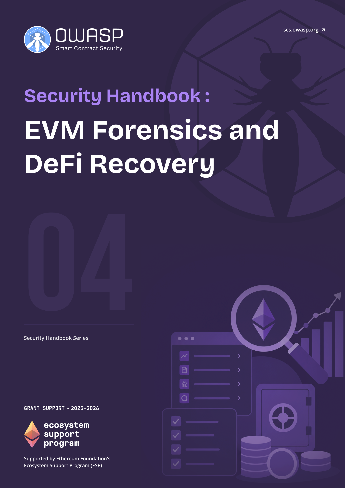

# OWASP SCS EVM Forensics and DeFi Recovery Handbook

  
  

    <a class="handbook-series-link" href="../">← All handbooks</a>
    
Handbook 04 · 98 PDF pages

    
Preserve evidence, trace EVM and cross-chain activity, analyze contracts, and evaluate recovery options after a DeFi incident.

    

      <a href="../pdfs/04-evm-forensics-defi-recovery.pdf" target="_blank" rel="noopener">Open PDF</a>
      <a href="../pdfs/04-evm-forensics-defi-recovery.pdf" download>Download PDF</a>
    

  

**OWASP Smart Contract Security Project**

Part of the [OWASP SCS Handbook Series](../index.md). Built to the series [conventions](../index.md#about-the-series).

## Purpose and Scope

This handbook is a field guide to post-incident analysis of Ethereum Virtual Machine (**EVM**) exploits, from the moment a responder learns an incident occurred through **evidence collection**, root-cause analysis, attribution, and the recovery decisions that follow. It organizes root cause around a four-tier framework built from systematic review of public post-mortems: Tier 1 protocol logic design flaws, Tier 2 lifecycle and governance issues, Tier 3 external dependencies such as oracles and bridges, and Tier 4 classic implementation bugs like reentrancy and broken access control. Real incidents rarely fit one tier. Euler Finance's March 2023 loss combined a Tier 4 regression in its donation-attack health check with governance timing pressure on the fix, and the handbook treats exploit chains that span tiers as the norm rather than the exception. It also covers the analysis specialties that general incident response guidance skips: precision and rounding forensics in the style of Balancer's stable-pool exploits, oracle and flash-loan attack reconstruction, and bridge and cross-chain forensics for a category that MITRE AADAPT and multiple industry loss reports rank as Web3's largest single source of stolen value, from Ronin in March 2022 to Wormhole the same month to Nomad in August 2022.

The scope extends past analysis into what a protocol team can actually do once root cause is known. Non-atomic attacks, ones spread across multiple transactions or blocks rather than a single flash-loan sandwich, open a rescue window that skilled responders have used to intercept funds before a hostile discovery does. The Poly Network incident of August 2021, where roughly six hundred million dollars in assets were returned after direct negotiation with the attacker, sits alongside the handbook's DeFi **Recovery** Patterns Database: pause and upgrade, governance and timelock parameter fixes, compensation design, fork and migration, negotiation, and pre-authorized whitehat rescue under a published safe harbor agreement. The handbook supports **incident response** teams, protocol engineers, and forensic researchers, and it complements the Incident Response Handbook (06), which owns the broader response process this handbook's forensic and recovery work feeds into.

## Target Audience

Security specialists, incident responders, blockchain forensics analysts, protocol engineering teams, and auditors conducting root-cause or post-mortem analysis on EVM-based incidents.

## How to Use This Handbook

Start with Part I to fix the four-tier root-cause framework, the legal and ethical ground rules, and the evidence-first mindset that governs everything that follows: collect before you change state. Parts II and III are the working core, covering on-chain and off-chain **evidence preservation** and then the analysis techniques (transaction tracing, contract and vulnerability analysis, **attribution**, and multi-chain and bridge forensics) that turn raw evidence into a root-cause finding. Part IV is the recovery reference: read it once end to end before an incident, then return to the specific pattern (pause and upgrade, governance fix, compensation, fork, negotiation, or whitehat safe harbor) that fits the situation at hand. Part V catalogs tools and automation for repeatable evidence collection. A responder mid-incident should go straight to the evidence checklist in Appendix B and the tool references in Appendix D, then work back into Parts II and III as the picture clarifies.

## Relationship to SCSVS, SCSTG, and SCWE

This handbook is the forensic and **recovery** counterpart to OWASP's smart contract standards, applied after a control has already failed. The Smart Contract Security Verification Standard (SCSVS) defines the controls an exploited contract should have had; Part III maps each exploited weakness back to the SCSVS control that would have caught it. The Smart Contract Security Testing Guide (SCSTG) describes how to test for a vulnerability before deployment; this handbook describes how to reconstruct that same vulnerability class after it has already been exploited on-chain, closing the loop from missed test case to confirmed root cause. The Smart Contract Weakness Enumeration (SCWE) catalogs the weakness taxonomy this handbook's four-tier framework and Part III mapping rely on directly. The companion **Incident Response** Handbook (06) owns the organizational response process (triage, communications, stakeholder coordination) that this handbook's evidence collection and recovery patterns feed into, and the Web3 Attack Vectors Mapping Handbook (10) places the exploited weaknesses this handbook analyzes within the broader WA01 to WA15 attack taxonomy.

## Contents

**Part I: Foundations**
- [1. Introduction to EVM Forensics](part1-foundations.md#1-introduction-to-evm-forensics)
- [2. Legal and Ethical Considerations](part1-foundations.md#2-legal-and-ethical-considerations)
- [3. Evidence-First Mindset](part1-foundations.md#3-evidence-first-mindset)

**Part II: Evidence Collection and Preservation**
- [4. On-Chain Evidence](part2-evidence-collection-and-preservation.md#4-on-chain-evidence)
- [5. Data Preservation](part2-evidence-collection-and-preservation.md#5-data-preservation)
- [6. Off-Chain and Supporting Evidence](part2-evidence-collection-and-preservation.md#6-off-chain-and-supporting-evidence)

**Part III: Analysis Techniques**
- [7. Transaction and Flow Analysis](part3-analysis-techniques.md#7-transaction-and-flow-analysis)
- [8. Contract and Vulnerability Analysis](part3-analysis-techniques.md#8-contract-and-vulnerability-analysis)
- [9. Attribution and Threat Actor Context](part3-analysis-techniques.md#9-attribution-and-threat-actor-context)
- [10. Multi-Chain and Cross-Chain Considerations](part3-analysis-techniques.md#10-multi-chain-and-cross-chain-considerations)

**Part IV: DeFi Recovery Patterns**
- [11. DeFi Recovery Patterns Database (Concept and Use)](part4-defi-recovery-patterns.md#11-defi-recovery-patterns-database-concept-and-use)
- [12. Recovery Pattern: Pause and Upgrade](part4-defi-recovery-patterns.md#12-recovery-pattern-pause-and-upgrade)
- [13. Recovery Pattern: Governance and Parameter Changes](part4-defi-recovery-patterns.md#13-recovery-pattern-governance-and-parameter-changes)
- [14. Recovery Pattern: Compensation and User Funds](part4-defi-recovery-patterns.md#14-recovery-pattern-compensation-and-user-funds)
- [15. Recovery Pattern: Fork and Migration](part4-defi-recovery-patterns.md#15-recovery-pattern-fork-and-migration)
- [16. Recovery Pattern: Negotiation and Third Parties](part4-defi-recovery-patterns.md#16-recovery-pattern-negotiation-and-third-parties)
- [17. Safe Harbor and Whitehat Recovery](part4-defi-recovery-patterns.md#17-safe-harbor-and-whitehat-recovery)
- [18. Other Patterns and Case Studies](part4-defi-recovery-patterns.md#18-other-patterns-and-case-studies)

**Part V: Tooling and Automation**
- [19. Public and Open-Source Tools](part5-tooling-and-automation.md#19-public-and-open-source-tools)
- [20. Automation and Repeatability](part5-tooling-and-automation.md#20-automation-and-repeatability)

**Part VI: Appendices**
- [21. Appendix A: Glossary](part6-appendices.md#21-appendix-a-glossary)
- [22. Appendix B: Evidence Collection Checklist](part6-appendices.md#22-appendix-b-evidence-collection-checklist)
- [23. Appendix C: Recovery Pattern Summary Table](part6-appendices.md#23-appendix-c-recovery-pattern-summary-table)
- [24. Appendix D: Tool References and Links](part6-appendices.md#24-appendix-d-tool-references-and-links)
- [25. Appendix E: References and Further Reading](references.md)
