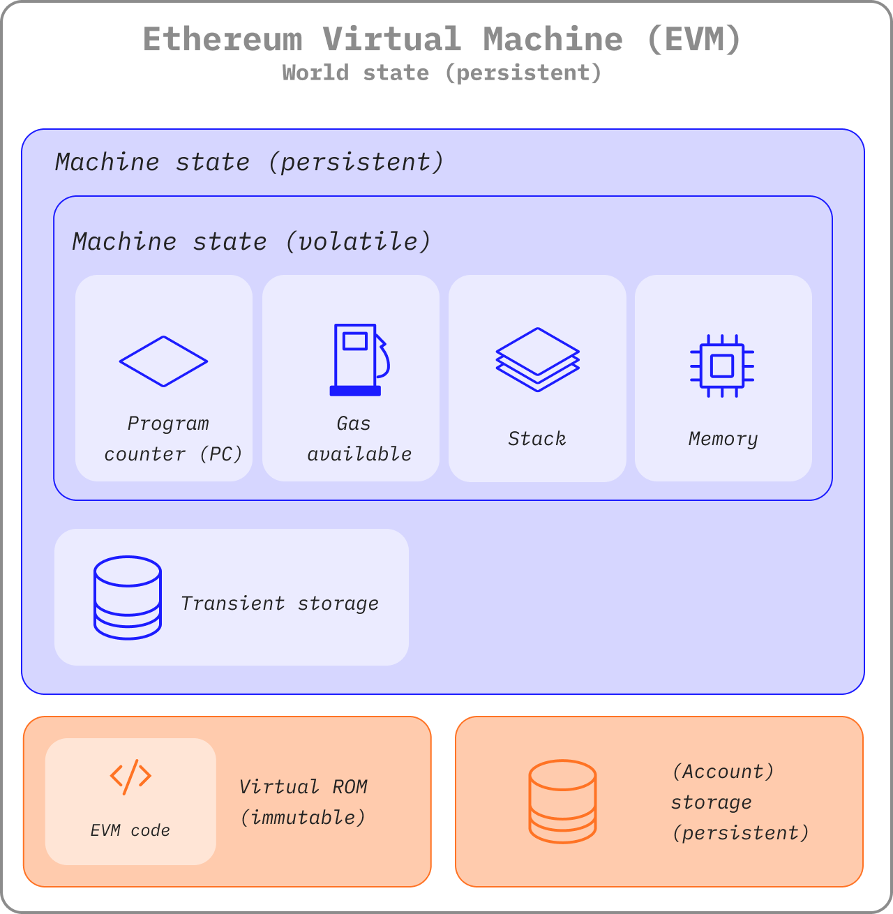
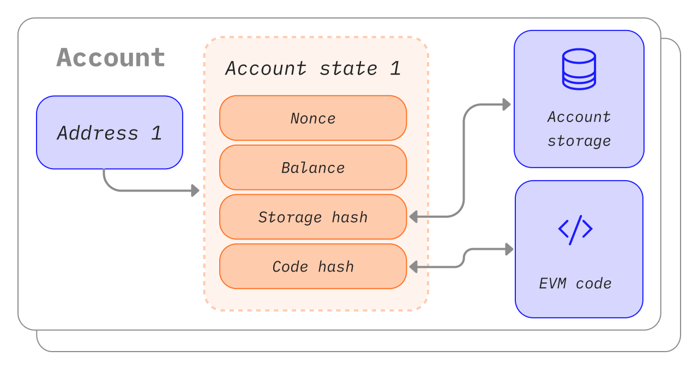
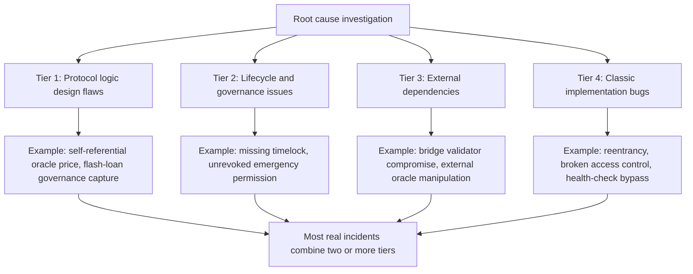
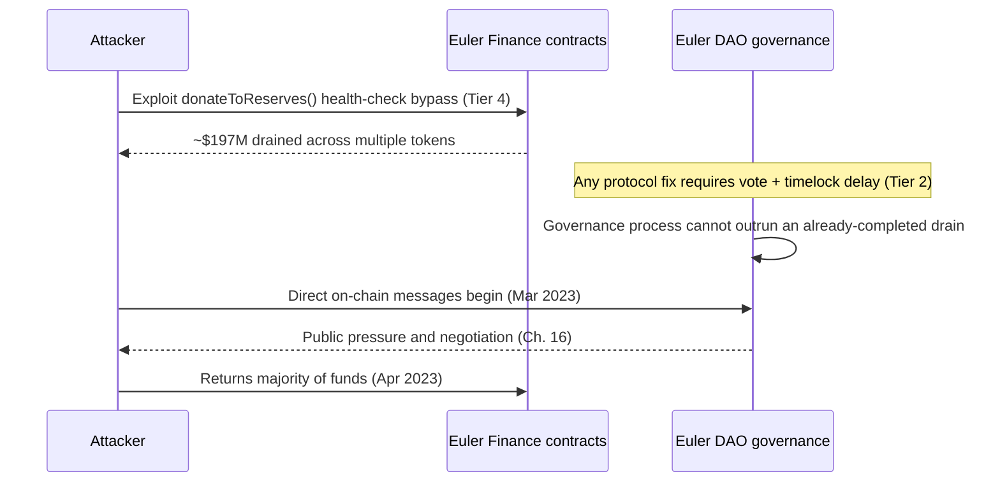
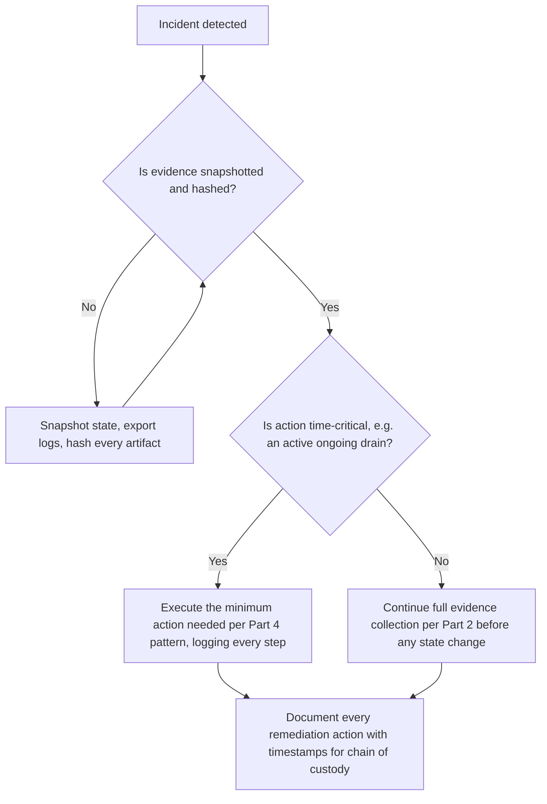
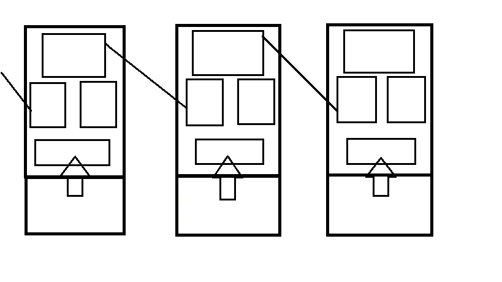

# Part 1: Foundations

[Back to Handbook contents](index.md) | [Series index](../index.md)

This part fixes the vocabulary a responder needs before touching a single transaction: what blockchain forensics is for, the research-derived four-tier framework used to classify root cause throughout the handbook, and the legal, ethical, and procedural rules that decide whether evidence collected today survives contact with a courtroom, a regulator, or an insurer later. Everything downstream, **evidence collection** in Part 2, analysis technique in Part 3, and **recovery** decisions in Part 4, depends on getting these three things right first.

---

## 1. Introduction to EVM Forensics

This chapter sets the vocabulary the rest of the handbook depends on: what blockchain forensics is for, how it fits alongside **incident response** and the OWASP smart contract standards, and the four-tier root-cause framework used to classify every incident discussed later.

### 1.1 Goals of Blockchain Forensics

Blockchain forensics reconstructs what happened during a security incident on a distributed ledger: which transactions moved which assets, in what order, through which entry point, and why the contract logic allowed it. On the Ethereum Virtual Machine (**EVM**), the execution model shared by Ethereum and dozens of compatible chains including Polygon, Arbitrum, Optimism, BNB Chain, and Avalanche's C-Chain, the goals mirror traditional digital forensics as codified in [NIST Special Publication 800-86, Guide to Integrating Forensic Techniques into Incident Response](https://csrc.nist.gov/pubs/sp/800/86/final): identify, preserve, analyze, and present evidence so it supports a technical root cause and, where relevant, a legal or insurance process. **Root cause analysis** (RCA) answers what broke and why; attribution (Chapter 9) answers who did it and how confidently; recovery support (Part 4) answers what can still be done about it.

Two properties separate **EVM forensics** from a typical host intrusion investigation. First, the primary evidence source, the chain itself, is public and append-only, available to attacker and investigator alike. You are not hunting for logs an intruder might have wiped; you are querying a dataset the adversary cannot alter after the fact. Second, that same transparency enables deterministic replay in a way host forensics rarely allows: given the exact state at the block before an exploit transaction, a forked EVM node re-executes it and reproduces every storage write, byte for byte (Section 3.2). What blockchain forensics does not get for free is identity. Addresses are pseudonymous, so **attribution** draws on an entirely different evidentiary chain than technical root cause, built from behavioral patterns and off-chain intelligence rather than storage diffs.

*Figure. The EVM state surfaces an investigator must distinguish during replay. Stack, memory, program counter, and gas exist only inside an execution frame; transient storage survives internal calls only for the transaction; account storage and world state persist and are committed into the post-state root. Source: [ethereum.org, Ethereum Virtual Machine](https://ethereum.org/developers/docs/evm/), CC BY 4.0.*

*Figure. Ethereum has two account types with different evidentiary meaning. An externally owned account's action is authorized by a signature, while a contract account acts only because prior execution reached its code. Labeling both simply as "wallets" erases the distinction between an initiating actor and an automated hop in the trace. Source: [ethereum.org, Ethereum Accounts](https://ethereum.org/developers/docs/accounts/), CC BY 4.0.*

### 1.2 Relationship to Incident Response

Forensics is a technical discipline; **incident response** (IR) is the organizational process that surrounds it, comms, stakeholder coordination, and decision authority. The [NIST SP 800-61 Revision 3 framework](https://csrc.nist.gov/pubs/sp/800/61/r3/final), finalized in April 2025 as a Cybersecurity Framework (CSF) 2.0-aligned community profile, organizes response around four functions: Govern, Identify and prepare, Detect and analyze, and Respond and recover. This handbook's forensic work sits almost entirely inside Detect and analyze, tracing the technical mechanism of the attack, and feeds directly into Respond and recover, where the root cause determines which **recovery** pattern (Part 4) is even feasible.

The companion Incident Response Handbook (06) owns the broader process: who declares an incident, who talks to users, when to engage a war room, and how the organization learns afterward. Treat that handbook as the outer loop and this one as the inner loop it calls into whenever an EVM-based incident needs technical reconstruction. A responder working from Handbook 06's runbook should expect to hand off to this handbook's Part 2 evidence checklist the moment an on-chain event is confirmed, and to hand a finished root-cause finding back before recovery decisions in Part 4 are made.

### 1.3 Relationship to SCSVS, SCSTG, and SCWE

This handbook is the forensic and **recovery** counterpart to OWASP's smart contract standards, applied after a control has already failed rather than before one is deployed. The Smart Contract Security Verification Standard ([SCSVS](https://scs.owasp.org/)) defines the verifiable controls a contract should have implemented; Section 8.2 of this handbook maps each exploited weakness back to the specific SCSVS control whose absence or failure permitted it. The Smart Contract Security Testing Guide ([SCSTG](https://scs.owasp.org/)) describes how to test for a vulnerability class before it ships; this handbook describes how to reconstruct that same vulnerability class after it has already been exploited on-chain, closing the loop from missed test case to confirmed root cause. The Smart Contract Weakness Enumeration ([SCWE](https://scs.owasp.org/)) catalogs the taxonomy of weaknesses; the four-tier framework in Section 1.5 is built to cross-reference SCWE entries at both the tier and sub-category level, so a forensic finding is never a one-off label but a pointer into a shared, auditable taxonomy.

| Standard | What it defines | This handbook's relationship |
|----------|------------------|-------------------------------|
| SCSVS | Verifiable security controls a contract should implement | Section 8.2 maps each exploited weakness to the control that would have caught it |
| SCSTG | Test procedures to catch vulnerabilities pre-deployment | This handbook reconstructs the same vulnerability classes post-exploit |
| SCWE | Taxonomy of smart contract weaknesses | The four-tier framework (Section 1.5) cross-references SCWE entries per tier |

The [OWASP Web3 Attack Vectors Top 15](https://scs.owasp.org/sctop10/Web3-Attack-Vectors-Top15/) supplies a third axis: it frames the same weaknesses as attacker-facing vectors (bridge compromise as WA02, oracle manipulation, and so on), and the Web3 Attack Vectors Mapping Handbook (10) is where that full WA01 through WA15 taxonomy is placed against this handbook's findings.

### 1.4 How to Use This Handbook

Read this Part once, end to end, to internalize the four-tier framework and the evidence-first discipline in Chapter 3; after that, treat the handbook as a reference you jump into mid-incident. Parts 2 and 3 are the working core: on-chain and off-chain **evidence collection**, then the analysis techniques, transaction tracing, contract and vulnerability analysis, **attribution**, and cross-chain forensics, that turn raw evidence into a defensible root-cause finding. Part 4 is the recovery reference, meant to be read once before an incident and then consulted for the specific pattern that fits the situation at hand. Part 5 catalogs tools and scripts for repeatable evidence collection.

If you are mid-incident right now, do not start at Chapter 1. Go straight to the evidence checklist in [Appendix B](part6-appendices.md#22-appendix-b-evidence-collection-checklist) and the tool references in [Appendix D](part6-appendices.md#24-appendix-d-tool-references-and-links), execute Chapter 3's collect-before-changing-state rule, then work backward into Parts 2 and 3 as the picture clarifies. Return to this Part only when you need the legal grounding in Chapter 2 or the tier classification in Section 1.5 to write up the finding.

### 1.5 Four-Tier Root Cause Framework

A one-off narrative of what went wrong is not repeatable across incidents or comparable across a team's caseload. This handbook uses a four-tier framework so that "root cause" always means the same thing regardless of who wrote the finding: a placement in one or more of four categories, each with its own detection approach, its own SCWE cross-references, and its own set of realistic **recovery** options once the mechanism is understood.

*Figure 1. The four-tier root cause framework. Every finding in Part 3 is classified against one or more of these tiers; Section 1.5.6 covers why most real incidents span more than one.*

| Tier | Focus | Representative incident |
|------|-------|--------------------------|
| Tier 1 | Protocol logic design flaws | Mango Markets oracle self-manipulation, Oct 2022 |
| Tier 2 | Lifecycle and governance issues | Beanstalk flash-loan governance capture, Apr 2022 |
| Tier 3 | External dependencies (oracles, bridges, off-chain) | Ronin Bridge validator compromise, Mar 2022 |
| Tier 4 | Classic implementation bugs | The DAO reentrancy, Jun 2016 |

#### 1.5.1 Provenance: Research-Derived Taxonomy (Systematic Literature and Incident Analysis)

The framework is not an ad hoc list; it is built the way MITRE's [ATT&CK](https://attack.mitre.org/) matrix was built, from systematic observation rather than theory. Academic security research has independently converged on a similar structure. "SoK: Decentralized Finance (DeFi) Attacks" (Zhou et al., IEEE Symposium on Security and Privacy 2023, [arXiv:2208.13035](https://arxiv.org/abs/2208.13035)) reviewed 77 academic works alongside roughly 30 real-world incidents totaling over $3 billion in reported losses, and derived a common reference frame that separates conceptual and design-level flaws from implementation-level bugs, the same separation this framework's Tier 1 and Tier 4 encode. MITRE's [AADAPT project](https://aadapt.mitre.org/) (Adversarial Actions in Digital Asset Payment Technologies) extends the ATT&CK methodology specifically to digital-asset and DeFi adversary behavior, cataloging observed techniques rather than hypothesized ones.

This handbook's four tiers were cross-checked against both bodies of work and against a broader corpus of public post-mortems, incident post-mortem threads published by the exploited protocols themselves, third-party forensic write-ups, and industry loss aggregators such as Chainalysis's annual crypto crime reporting. The practical implication for a responder: when a finding does not cleanly fit one tier, that is a signal to keep investigating rather than a framework failure, because the literature this taxonomy is drawn from shows that clean single-tier incidents are the minority (Section 1.5.6).

#### 1.5.2 Tier 1: Protocol Logic Design Flaws

Tier 1 covers flaws in the intended mechanism itself, not a coding mistake but a design that behaves exactly as written and is still exploitable. The clearest examples come from price and incentive design. In October 2022, Avraham Eisenberg opened large offsetting positions in Mango Markets' own MNGO perpetual futures market, used the resulting inflated mark price as collateral, and borrowed out roughly $114 million from the protocol's treasury, a strategy he later publicly described as legal trading rather than hacking; he was convicted of fraud and market manipulation by a US federal jury in April 2024. The design flaw was that the protocol trusted a price it could itself be used to move.

In April 2022, an attacker used a single flash-loaned position to acquire a supermajority of Beanstalk's governance token supply for one transaction, pass a malicious proposal instantly because no timelock delayed emergency governance actions, and drain roughly $182 million. Both incidents share a Tier 1 signature: no line of code was "buggy" in isolation, the mechanism (oracle price, governance weight) did exactly what it was designed to do, and the design failed to account for an attacker temporarily controlling that mechanism's input. Detecting Tier 1 issues requires modeling the protocol's economic assumptions, not just its code paths, which is why Section 8.5's oracle and flash-loan forensics and the Economic Design guidance referenced there sit downstream of this tier.

#### 1.5.3 Tier 2: Lifecycle and Governance Issues

Tier 2 covers the space between deployment and steady-state operation: upgrade sequencing, permission scope that outlives its purpose, and governance mechanics that are correct in isolation but dangerous under time pressure. A recurring pattern is the emergency permission granted for a specific operational need and never revoked once that need passed, exactly the kind of standing access this handbook's evidence procedures (Chapter 4) are built to reconstruct after the fact by diffing role-grant events against the timeline of actual use.

Governance timing is the other recurring failure mode. A timelock long enough to let token holders react to a malicious proposal is also long enough to let an active exploit continue draining funds while a legitimate emergency fix waits in queue, a tension Part 4's governance **recovery** pattern (Chapter 13) treats directly. Tier 2 findings are frequently the hardest to communicate to a non-technical stakeholder because there is no single malicious line of code to point at; the finding is closer to "the protocol's own change-management process created the window," and the evidence trail lives as much in governance forum posts, **multisig** transaction history, and deployment logs as in the exploited contract itself.

#### 1.5.4 Tier 3: External Dependencies (Oracles, Bridges, Off-Chain)

Tier 3 covers failures in systems a protocol depends on but does not fully control: price oracles, cross-chain bridges and message-passing layers, and off-chain keepers or relayers. This tier accounts for a disproportionate share of total value lost industry-wide. Chainalysis's 2022 reporting found that cross-chain bridge exploits alone accounted for roughly two-thirds of that year's total stolen crypto value ([Chainalysis, "2022 Biggest Year Ever for Crypto Hacking"](https://www.chainalysis.com/blog/2022-biggest-year-ever-for-crypto-hacking/)), a concentration Chapter 10 examines in full.

Three incidents anchor this tier for the rest of the handbook. In March 2022, attackers compromised five of nine validator signatures securing the Ronin Bridge, partly through a spear-phishing campaign against a Sky Mavis employee and partly through an emergency RPC permission granted to the Axie DAO in 2021 and never revoked, and drained roughly $625 million; the FBI publicly attributed the intrusion to the Lazarus Group in an [April 2022 statement](https://www.fbi.gov/news/press-releases/fbi-statement-on-attribution-of-malicious-cyber-activity-posed-by-the-democratic-peoples-republic-of-korea). In February 2022, a flaw in Wormhole's signature verification on the Solana side let an attacker mint roughly 120,000 wrapped ETH without depositing matching collateral, a loss of roughly $325 million that Jump Crypto backstopped directly. In August 2022, Nomad Bridge shipped an upgrade that initialized its trusted message root to a value treated as already-proven, letting anyone replay a copied message with a different recipient; the result was a chaotic, crowd-sourced drain of roughly $190 million. All three are Tier 3 because the exploited logic sat in the validation of external input, not in the protocol's own internal accounting.

#### 1.5.5 Tier 4: Classic Smart Contract Implementation Bugs

Tier 4 covers the vulnerability classes every Solidity engineer is trained to check for: reentrancy, integer overflow and underflow (largely mitigated by default since Solidity 0.8's built-in checked arithmetic), missing or misordered **access control**, and unchecked external call return values. This is the oldest tier, dating to The DAO's reentrancy exploit in June 2016, roughly $60 million in ether drained through a recursive external call that withdrew funds before the contract's internal balance was updated, an incident consequential enough that it led to the Ethereum and Ethereum Classic chain split.

Tier 4 bugs remain common not because the classes are unknown but because a correct-looking regression can reintroduce them. Euler Finance's March 2023 loss of roughly $197 million originated in a `donateToReserves` function that let an attacker donate collateral in a way that bypassed the protocol's health check, a Tier 4 implementation regression in check ordering rather than a novel technique. Detecting Tier 4 issues is what static analysis and the SCSTG's test-driven guidance are built for, which is exactly why a confirmed Tier 4 root cause is the strongest evidence that a specific SCSVS control was either absent or not enforced (Section 8.2).

#### 1.5.6 Exploit Chains: Multiple Tiers in Real Incidents

Treating a finding as finished the moment one bug is confirmed is the most common forensic mistake this handbook warns against. The literature surveyed in Section 1.5.1 and this handbook's own incident review both show that high-value exploits typically chain two or more tiers together, and a root-cause writeup that stops at the first tier understates both the severity and the fix required.

Euler Finance is the clearest teaching example. The initial loss was a pure Tier 4 bug, the `donateToReserves` health-check bypass. What turned a serious bug into a near-total loss and a difficult **recovery** was Tier 2: Euler's governance required a DAO vote and timelock delay to ship a fix, a process with a multi-day floor that could not outrun an attacker already holding the drained funds.

*Figure 2. Euler Finance as a two-tier exploit chain. The Tier 4 bug caused the loss; the Tier 2 governance constraint shaped what could be done about it in the following weeks, which is why the eventual recovery ran through negotiation (Chapter 16) rather than a fast on-chain fix.*

The forensic implication is procedural: after confirming a first-tier root cause, explicitly ask whether a second tier shaped either the attack's scale or the response's constraints, and document both. Chapter 10's bridge analysis (frequently Tier 3 plus Tier 4, an external validation failure paired with an internal accounting bug) and Part 4's recovery pattern selection both assume this multi-tier view as the default, not the exception.

---

## 2. Legal and Ethical Considerations

Before touching a single transaction, a responder needs to know what makes evidence usable later, in a courtroom, a regulator's inbox, or an insurer's claims process, and where the ethical lines sit around privacy, disclosure, and law enforcement contact.

### 2.1 Evidence Admissibility and Chain of Custody

Evidence collected without a defensible **chain of custody** is evidence a court, insurer, or counterparty can dispute regardless of its technical accuracy. [RFC 3227, Guidelines for Evidence Collection and Archiving](https://www.rfc-editor.org/rfc/rfc3227), remains the baseline reference for the underlying discipline: collect in order of volatility, document who collected what and when, minimize interaction with the evidence itself, and preserve the original alongside any copy used for analysis. In a US legal context, [Federal Rule of Evidence 901](https://www.law.cornell.edu/rules/fre/rule_901) requires that evidence be authenticated, that its proponent produce evidence sufficient to show the item is what it is claimed to be, which for on-chain data means a hash-verified export tied to a documented collection process, not a screenshot with no provenance.

Maintain a chain-of-custody log as a first-class artifact from the first minute of an incident, not a document assembled afterward from memory.

| Field | Purpose |
|-------|---------|
| Artifact ID | Unique reference for the collected item (tx hash, log export, screenshot) |
| Collected by | Named individual, not a shared team account |
| Collection timestamp (UTC) | When the artifact was captured, independent of the event's own timestamp |
| Source | RPC endpoint, indexer, or system the artifact came from |
| Hash (SHA-256) | Cryptographic fingerprint computed at the moment of collection |
| Storage location | Where the artifact is archived, write-once where possible (Section 5.3) |
| Access log | Who has viewed or copied the artifact since collection |

### 2.2 Privacy and Data Handling

On-chain transaction data is public by design, but a forensic investigation quickly touches data that is not: know-your-customer (KYC) records held by exchanges, RPC and application logs that may carry IP addresses, and personally identifiable information (PII) collected during victim outreach or a later compensation process (Chapter 14). That data falls under ordinary privacy regulation regardless of the blockchain context, including the EU's [General Data Protection Regulation (GDPR)](https://gdpr-info.eu/) and comparable regimes elsewhere.

Treat privacy as a collection-time discipline, not an afterthought: collect only the PII a specific step of the investigation requires, document the legal basis and retention period for anything you do collect, and apply the same access controls and retention limits described in Section 5.4 to off-chain personal data as to any other evidence artifact. A compensation process that requires collecting user wallet-to-identity mappings (Section 14.1) is the point in this handbook's workflow where privacy exposure is highest, and it is the point where legal counsel (Section 2.3) should be involved before collection begins, not after.

### 2.3 Coordination with Law Enforcement and Legal Counsel

Deciding whether and when to involve law enforcement is a legal decision, not a technical one, and it should never be made unilaterally by the responder who found the bug. Route it through counsel first. In the United States, the FBI's Internet Crime Complaint Center (IC3) is the standard reporting channel for cybercrime affecting US persons or entities; equivalent national channels exist across other jurisdictions (Europol's cybercrime reporting for the EU, and national CERTs elsewhere). The Ronin Bridge case (Section 1.5.4) shows the coordination working as intended: the FBI's public **attribution** to the Lazarus Group and the US Treasury's subsequent sanctions action against the associated wallet address gave exchanges and counterparties a documented basis to freeze related funds, something no individual protocol team could have accomplished alone.

Sanctions screening deserves its own line item because it gates **recovery**, not just disclosure. Before facilitating any movement of funds, whether returning assets to users or negotiating with an attacker (Chapter 16), screen every counterparty address against the US Office of Foreign Assets Control (OFAC) Specially Designated Nationals (SDN) list; moving funds to or from a sanctioned address exposes the protocol and its team to liability independent of the original incident.

**Checklist: engaging law enforcement and counsel**
- Confirm losses and evidence meet the threshold legal counsel sets for external reporting.
- Engage outside counsel before any public statement or first law enforcement contact.
- File through the appropriate national channel (IC3 in the US, Europol or national CERT elsewhere).
- Screen every recipient and source address against the OFAC SDN list before any fund movement.
- Share raw evidence only as counsel directs; preserve the full set independently.
- **Log every law enforcement contact:** agency, agent or case officer, case number, date.

### 2.4 Responsible Disclosure and Attribution

Premature or overconfident public **attribution** creates two distinct risks: it can tip off an active attacker before funds are frozen, and it can wrongly implicate an address or entity based on incomplete evidence, exposure this handbook's attribution confidence levels (Section 9.4) exist specifically to prevent. Coordinate disclosure timing with the parties who can act on it, exchanges that can freeze an attacker's deposit, bridges that can pause a compromised route, before any public statement, following the same responsible-disclosure instinct that governs vulnerability reporting generally but applied to an incident already in progress rather than a pre-disclosure bug.

Attribution claims made in a public post-mortem should be sourced and confidence-graded the same way a **threat intelligence** report would be: distinguish a claim backed by on-chain clustering and independently corroborated off-chain intelligence from a claim based on a single behavioral similarity. Chapter 9 develops this distinction in full; the ethical rule to carry forward from this chapter is that attribution is a statement about evidence strength, not a statement of certainty, and should never be dressed up as more confident than the underlying evidence supports.

---

## 3. Evidence-First Mindset

The single most consequential decision in the first hour of an incident is procedural, not technical: whether to collect evidence before or after changing anything on-chain or off. This chapter makes the case for collect first, always.

### 3.1 Collect Before Changing State

Every state-changing action available to a responder, pausing a contract, upgrading a proxy, revoking a compromised role, moving remaining funds to safety, also destroys or alters the exact evidence a root-cause finding depends on. A pause transaction changes contract state going forward; it does nothing to preserve the state as it existed the moment before the exploit, which is what a forensic reconstruction actually needs (Section 3.2). Acting first and documenting later inverts the priority this handbook is built around.

*Figure 3. The evidence-first decision flow. Even a time-critical response passes through evidence capture first; the only branch that skips ahead is an active, ongoing drain, and even that branch logs every action taken.*

**Checklist: before you touch anything**
- Do not pause or upgrade the contract before state is snapshotted and hashed.
- Do not revoke attacker-facing permissions that are still producing traceable **on-chain evidence**.
- Do not issue a public statement before legal and communications alignment (Section 2.4).
- Do not move remaining funds without OFAC screening and counsel sign-off (Section 2.3).
- Do capture the full mempool and surrounding block context immediately, before triage, not after.

### 3.2 Immutability and Reproducibility of On-Chain Data

The append-only property of a blockchain is the forensic investigator's single biggest structural advantage over traditional host forensics: the record an attacker created cannot be retroactively edited, and every honest node holds the same history. That immutability translates directly into reproducibility. Given the exact block immediately preceding an exploit, a forked **EVM** node, using tooling such as Foundry or Hardhat (Section 7.4), re-executes the exploit transaction deterministically and reproduces every storage write, log, and internal call, which is what makes the reproduction techniques in Section 8.6 possible at all.

*Figure. The structural mechanism behind append-only history: each block's header commits to the block before it, so altering any past block would break every header chained after it, which is why a forked node can deterministically replay history rather than merely trust it. Source: [Wikimedia Commons](https://commons.wikimedia.org/wiki/File:AlysidaKoinopoihsewn.png), CC BY-SA 4.0.*

That guarantee only holds if the data source is actually complete. Not every node retains full historical state.

| Node type | State availability | Forensic suitability |
|-----------|---------------------|------------------------|
| Archive node | Full historical state at every block | Required for exact pre-incident storage reconstruction |
| Full node (pruned) | Recent state only; older state discarded | Adequate for recent incidents, insufficient for older ones |
| Light client | Headers only, no state | Not suitable as a primary evidence source |
| Third-party RPC or indexer | Varies by provider; may rate-limit or lag | Useful for corroboration, never the sole source of truth |

Pull the state you need to reconstruct an incident from an archive node or a hash-verified export (Section 5.2), and treat a third-party indexer's output as corroborating evidence to be cross-checked, not as the canonical record.

### 3.3 Off-Chain Evidence (Logs, Screenshots, Comms)

On-chain data is durable by construction; off-chain evidence is not, and it decays fast. RPC provider logs roll off retention windows measured in days or weeks. Front-end and indexer logs disappear when a team takes a compromised service offline for remediation, often the very action an incident triggers. Community channels where an attacker or a confused user first posted, Discord, Telegram, X, get edited or deleted, sometimes by the platform's own moderation before the team even sees them.

Treat off-chain artifacts with the same urgency as active **on-chain evidence**: capture screenshots and full page exports the moment they are found, hash them immediately per the chain-of-custody fields in Section 2.1, and record the capture timestamp independent of any timestamp embedded in the content itself, since a screenshot's own metadata is not proof of when it was taken. Chapter 6 details the specific off-chain sources (RPC logs, monitoring alerts, communications, deployment artifacts) and how to preserve each; the discipline to carry forward from this section is that off-chain evidence is the most perishable asset in the entire investigation and should be the first thing collected, not the last.

---

**Key controls for Part 1**

- Classify every incident's root cause against the four-tier framework (Section 1.5) before writing a **recovery** recommendation, and explicitly check for a second tier before closing the finding.
- Snapshot state, hash it, and log **chain of custody** before pausing, upgrading, or messaging an attacker.
- Screen every address you might send funds to or receive from against the OFAC SDN list before any recovery action.
- Route public disclosure and law enforcement contact through legal counsel, never through the responder who found the bug.
- Prefer archive-node or hash-verified exports over live RPC or indexer output as your evidentiary source of truth.
- Capture off-chain evidence, logs, screenshots, communications, first: it decays faster than anything on-chain ever will.
