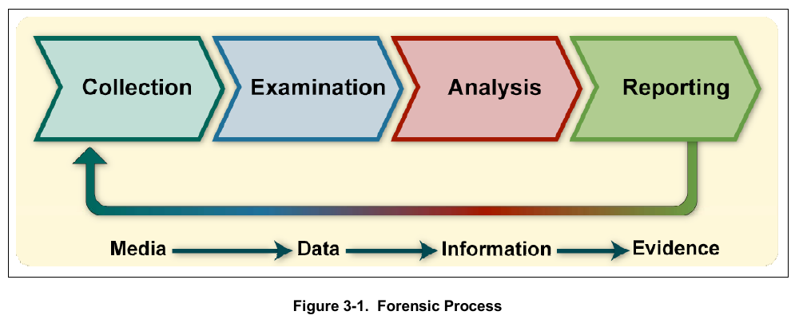
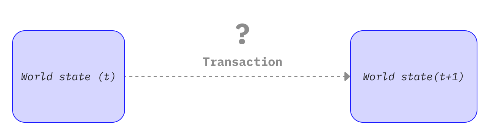
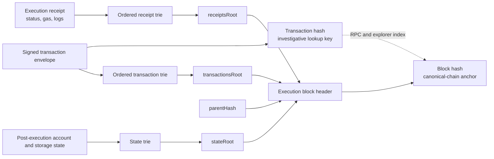
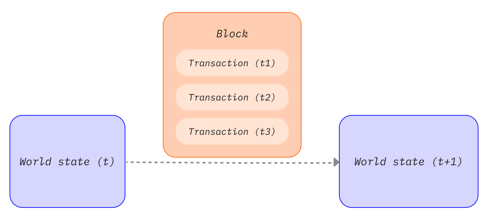
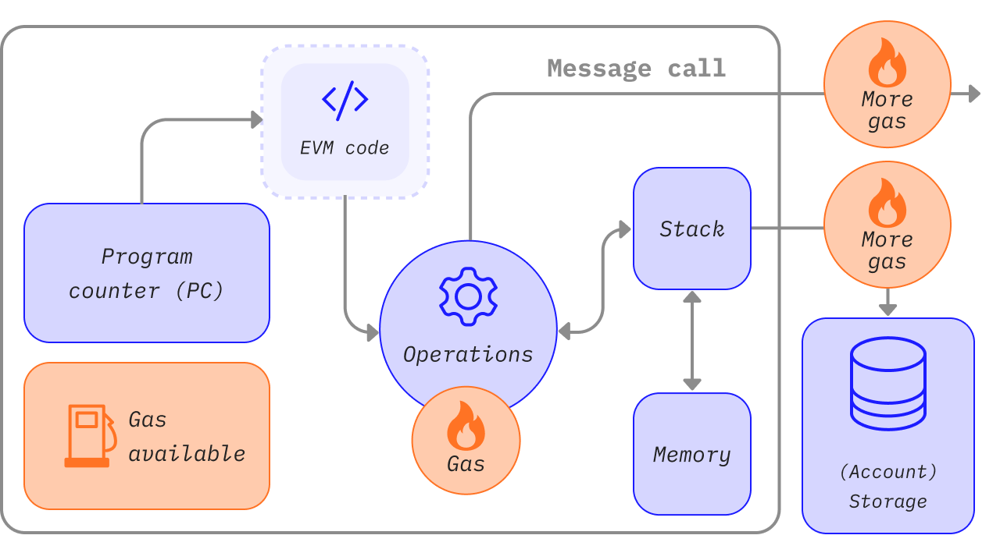
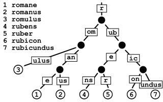
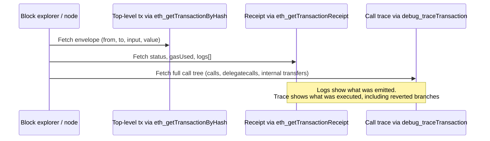
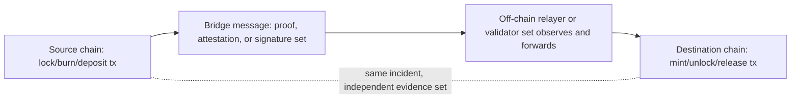
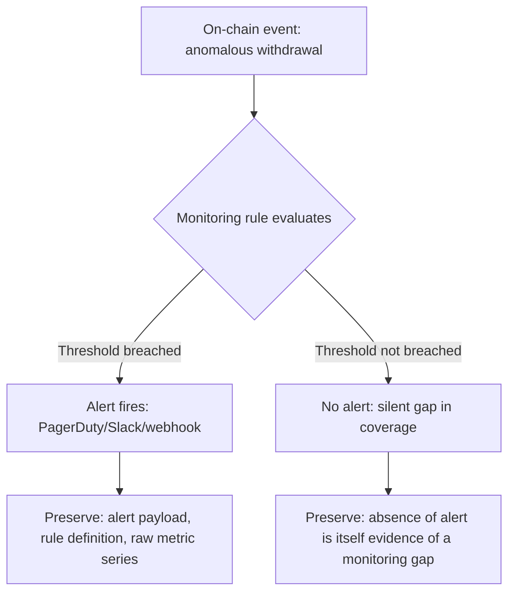

# Part II: Evidence Collection and Preservation

[Back to Handbook contents](index.md) | [Series index](../index.md)

An exploit's evidence trail exists in two very different places at once: an append-only ledger that will outlive the incident by design, and a scattering of off-chain systems (Remote Procedure Call (RPC) logs, indexers, dashboards, Slack threads) that will not. This part is the responder's field manual for both halves: what to pull from the chain, how to preserve it so a later re-derivation matches byte for byte, and how to capture the off-chain context that on-chain data alone cannot explain.


*Figure. NIST's forensic process separates collection, examination, analysis, and reporting. On-chain transparency does not collapse these stages: an RPC response is collected data, a decoded trace is examined information, and only a documented analysis tied to its preserved source becomes defensible evidence. Source: [NIST SP 800-86, Figure 3-1](https://csrc.nist.gov/pubs/sp/800/86/final), public domain (U.S. government work).*

---

## 4. On-Chain Evidence

**On-chain evidence** is unusual among forensic artifacts because the source of truth is globally replicated and, past a finality boundary, effectively immutable. That property does not make collection trivial. A responder still has to choose the right RPC surface, decide how deep to trace, and capture data before a pruning node, a rate-limited API, or your own assumptions cause you to lose a detail that mattered.

### 4.1 Transaction Data (Tx Hash, Block, Input, Value)

The transaction is the atomic unit of every on-chain investigation, and the first artifact to pin down is its hash, because everything else keys off it. From a full or archive node, `eth_getTransactionByHash` returns the transaction envelope: `from`, `to`, `value`, `gas`, `gasPrice` (or the EIP-1559 `maxFeePerGas`/`maxPriorityFeePerGas` pair), `nonce`, and the raw `input` calldata. `eth_getTransactionReceipt` returns the execution outcome: `status` (success or revert), `gasUsed`, `cumulativeGasUsed`, `contractAddress` (if the transaction deployed a contract), and the `logs` array covered in 4.3. Record both, not just one; the envelope tells you what was requested, the receipt tells you what actually happened.


*Figure. A transaction is best understood as a requested state transition. The signed envelope proves what an account requested; execution against the parent state determines whether the transition succeeds, and the receipt and post-state commitments prove what the chain accepted. Source: [ethereum.org, Transactions](https://ethereum.org/developers/docs/transactions/), CC BY 4.0.*

Decode the `input` field against the target contract's Application Binary Interface (ABI) to recover the function selector (the first four bytes) and the arguments as typed values, not raw hex. If the contract is unverified, look up the selector in a public database such as [4byte.directory](https://www.4byte.org/) or [OpenChain's signature database](https://openchain.xyz/signatures) before falling back to bytecode-level disassembly. Record the block number and block hash together, not the block number alone: a block number is only unambiguous once the chain has passed finality, and citing the hash alongside the number lets a later reader detect if they are looking at a different fork than you were.



*Figure. Ethereum evidence anchors. The transaction hash is the stable lookup key used by RPC endpoints and explorers, while the execution block header commits separately to the ordered transaction trie, receipt trie, and post-execution state trie. Preserve the transaction hash, receipt, block number, and block hash together; the transaction hash by itself is not a consensus proof that the transaction was included in a particular canonical block.*


*Figure. Transactions inside a block are ordered state transitions, not an unordered event set. Replaying an exploit transaction against the wrong parent block or after applying neighboring transactions in a different order can produce a different storage state, gas result, or oracle price. Source: [ethereum.org, Blocks](https://ethereum.org/developers/docs/blocks/), CC BY 4.0.*

```bash
# Etherscan V2 unified API: same endpoint, chainid parameter selects the network
ETHERSCAN_API="https://api.etherscan.io/v2/api"
curl -sG "$ETHERSCAN_API" \
  --data-urlencode "chainid=1" \
  --data-urlencode "module=proxy" \
  --data-urlencode "action=eth_getTransactionByHash" \
  --data-urlencode "txhash=0x<TXHASH>" \
  --data-urlencode "apikey=$ETHERSCAN_API_KEY" | jq .

curl -sG "$ETHERSCAN_API" \
  --data-urlencode "chainid=1" \
  --data-urlencode "module=proxy" \
  --data-urlencode "action=eth_getTransactionReceipt" \
  --data-urlencode "txhash=0x<TXHASH>" \
  --data-urlencode "apikey=$ETHERSCAN_API_KEY" | jq .
```

Etherscan's V2 API consolidated what used to be separate per-chain endpoints and keys into one API surface addressed by `chainid`, covering more than 60 EVM-compatible networks under a single account ([Etherscan API V2 docs](https://docs.etherscan.io/etherscan-v2)), which matters for a responder who needs the same query shape across an incident that touches several chains.

| Field | Source call | Why it matters for the case |
|-------|-------------|------------------------------|
| Tx hash | Reported by victim, explorer, or alert | Primary key for every downstream query |
| Block number + hash | `eth_getTransactionByHash` | Anchors the evidence to a specific, citable chain state |
| `from` (EOA or contract) | `eth_getTransactionByHash` | Identifies the initiating actor, feeds Chapter 9 attribution |
| `input` calldata, decoded | ABI decode against verified source or Sourcify | Reveals the exact function and arguments invoked |
| `status` | `eth_getTransactionReceipt` | Confirms the call succeeded; a reverted attempt is still evidence of intent |
| `gasUsed` vs `gas` limit | `eth_getTransactionReceipt` | An out-of-gas revert looks different from a `require` revert; both matter |


*Figure. Gas is metering evidence, not just a fee. Different EVM operations consume different gas, so a trace's gas deltas help distinguish an out-of-gas failure, an unexpectedly expensive storage write, and a branch that never executed. Preserve both the transaction limit and per-frame consumption. Source: [ethereum.org, Gas and Fees](https://ethereum.org/developers/docs/gas/), CC BY 4.0.*

### 4.2 Contract State and Storage

Transaction data shows what was called; storage shows what changed. Raw **EVM** storage is a flat 2²⁵⁶ slot key space per contract address, and Solidity's storage layout packs state variables into slots according to declaration order and type size, so reading a slot in isolation is meaningless without the layout. Pull the layout from the verified source (via Etherscan, [Sourcify](https://docs.sourcify.dev/docs/intro/), or `solc --storage-layout`) before interpreting raw values, and note that structs, mappings, and dynamic arrays use derived slot positions (`keccak256(key . slot)` for mappings) rather than sequential ones.


*Figure. The general shape of the key-value structure underlying Ethereum's state and storage tries: a derived, compressed path from a key (here a word, on-chain a keccak256 hash) down to its stored value, which is why a raw slot number means nothing without the derivation rule that produced it. Source: [Claudio Rocchini via Wikimedia Commons](https://commons.wikimedia.org/wiki/File:Patricia_trie.svg), CC BY-SA 3.0.*

```bash
# Read a specific storage slot at a specific historical block (requires an archive node)
cast storage 0xCONTRACT_ADDRESS 0 --block 18500000 --rpc-url $ARCHIVE_RPC_URL

# Read the ERC-1967 implementation slot for a proxy, at the block just before the incident
cast storage 0xPROXY_ADDRESS \
  0x360894a13ba1a3210667c828492db98dca3e2076cc3735a920a3ca505d382bb \
  --block 18499999 --rpc-url $ARCHIVE_RPC_URL
```

Two details separate a usable storage snapshot from a useless one. First, `eth_getStorageAt` against a full node only serves current state by default; historical reads at an arbitrary past block require an archive node that retains all intermediate state, since a pruning node discards it after a retention window. If your own infrastructure runs pruned nodes, plan your archive-node access before you need it, not during the incident. Second, always pair a storage read with the block number and block hash it was taken at, and re-verify the same read against a second, independently operated node or provider. Two matching independent reads at the same block hash are far stronger evidence than a single read you cannot cross-check.

For proxy contracts, capture both the proxy's storage and the implementation contract's storage and code hash, and record which implementation was active at the moment of the incident using the [ERC-1967](https://eips.ethereum.org/EIPS/eip-1967) implementation slot shown above. A post-incident upgrade that changes the implementation address will silently break naive re-derivation if you only recorded the proxy address without pinning the implementation at the relevant block.

### 4.3 Event Logs and Internal Transactions

Events are the structured, indexed trail a contract deliberately emits, and they are usually the fastest way to reconstruct what moved without re-executing every opcode. Each log entry carries the emitting contract's address, up to four `topics` (topic0 is the keccak256 hash of the event signature; topics 1 through 3 hold indexed parameters), and an ABI-encoded `data` field for non-indexed parameters. `eth_getLogs` retrieves logs by address, topic filter, and block range; retrieve the full range for a transaction with `eth_getTransactionReceipt`'s `logs` array so you get every log the transaction emitted, in emission order, not just the ones matching a filter you guessed in advance.

Internal transactions are calls, delegatecalls, and value transfers that happen inside a transaction's execution but never appear as their own top-level transaction. They are not part of consensus state and are not retrievable via standard JSON-RPC; you need a full execution trace. Two APIs cover this: geth's `debug_traceTransaction` (with the `callTracer` for a call-tree view) and the OpenEthereum-lineage `trace_transaction` / `trace_replayTransaction`, both of which most archive-node providers and Etherscan's trace endpoints expose.

```bash
# Full call tree for internal transactions, including value transfers and reverted subcalls
cast rpc debug_traceTransaction 0x<TXHASH> '{"tracer":"callTracer"}' --rpc-url $ARCHIVE_RPC_URL | jq .
```



*Figure 1. Three complementary views of one transaction. A responder who only reads the receipt misses internal transfers; one who only reads the trace misses which events downstream consumers (indexers, front ends) actually saw.*

A reentrancy or a multi-hop token drain is frequently invisible in the top-level transaction's `to` and `value` fields and only visible in the trace, because the attacker contract routes value through several internal calls before it ever surfaces as an indexed event. Preserve the full trace output alongside the logs; a root-cause finding built only from `Transfer` events will misattribute value movement whenever a contract moves funds without emitting a matching event, which Chapter 8's precision and invariant forensics returns to directly.

### 4.4 Relevant Addresses (EOAs and Contracts)

Every address touched by the incident is a node in the case graph, and each needs its type, role, and provenance recorded before you move to the next transaction. Distinguish an externally owned account (EOA, controlled by a **private key**) from a contract account (controlled by deployed code) using `eth_getCode`: an EOA returns empty bytecode (`0x`), a contract returns its runtime bytecode. This single check resolves a common early-investigation error, treating a smart-contract wallet or a proxy as if it were a human-controlled key.

For each address, capture:

- **Type**: EOA or contract, and if a contract, whether it is a proxy, a factory-deployed clone, or a standard deployment.
- **Deployment provenance**: the deploying transaction hash, the deployer address, and (for `CREATE2`) the salt and init code hash, since `CREATE2` lets an address be predicted and reused across chains, which matters for both **attribution** and cross-chain correlation (10.1).
- **Verified source status**: whether the contract is verified on Etherscan, [Sourcify](https://docs.sourcify.dev/docs/intro/), or Blockscout, and a locally archived copy of the verified source and ABI regardless, since a verification record can be removed or a service can go offline.
- **Role in the incident**: attacker EOA, attacker contract, victim protocol contract, intermediary (mixer, bridge, DEX router), or destination exchange or wallet.
- **First and last seen**: the block range over which the address is relevant to this specific incident, not its entire history.

```bash
# Confirm EOA vs contract
cast code 0xADDRESS --rpc-url $RPC_URL   # "0x" => EOA; non-empty => contract

# Pull deployer and deployment tx (Etherscan V2, module=contract)
curl -s "https://api.etherscan.io/v2/api?chainid=1&module=contract&action=getcontractcreation&contractaddresses=0xADDRESS&apikey=$ETHERSCAN_API_KEY" | jq .
```

### 4.5 Token Transfers and Approval Flows

Most DeFi incidents are, at the value-movement layer, a sequence of token transfers and approvals, and these are captured through standard event signatures rather than bespoke parsing. The [ERC-20](https://eips.ethereum.org/EIPS/eip-20) `Transfer(address indexed from, address indexed to, uint256 value)` event has topic0 `0xddf252ad1be2c89b69c2b068fc378daa952ba7f163c4a11628f55a4df523b3`, and `Approval(address indexed owner, address indexed spender, uint256 value)` has topic0 `0x8c5be1e5ebec7d5bd14f71427d1e84f3dd0314c0f7b2291e5b200ac8c7c3b925`. [ERC-721](https://eips.ethereum.org/EIPS/eip-721) reuses the `Transfer` signature with the third parameter as an indexed `tokenId` instead of a `value`, so distinguish the two by checking whether the emitting contract implements `ERC165` `supportsInterface` for the ERC-721 interface ID before assuming decimal semantics. [ERC-1155](https://eips.ethereum.org/EIPS/eip-1155) uses distinct `TransferSingle` and `TransferBatch` events.

```bash
# All ERC-20 Transfer events out of an attacker-controlled address, over the incident's block range
cast logs --address 0xTOKEN_CONTRACT \
  --from-block 18500000 --to-block 18500050 \
  'Transfer(address indexed,address indexed,uint256)' \
  --rpc-url $ARCHIVE_RPC_URL
```

Approval flows deserve equal attention, because an `Approval` event without a following `Transfer` is still evidence: it shows a victim (or an attacker's own decoy contract) granted spending rights, which is frequently the enabling step in a phishing-driven drain that a purely transfer-focused trace would miss entirely. Reconstruct the full sequence per token: approvals granted, the specific `transferFrom` calls that consumed them, and any `Approval` events that reset an allowance to zero (a common pattern immediately before or after an exploit, as an attacker either clears a compromised approval to cover tracks or a protocol's emergency response revokes one). Cross-reference the approval spender address against the address roles captured in 4.4; an approval to an address with no prior interaction history is a strong behavioral signal on its own.

### 4.6 Cross-Chain and Bridge Data Where Applicable

An incident that spans chains multiplies the evidence-collection burden, because no single chain's state proves what happened on another; the responder has to independently collect and then correlate two (or more) separate evidence sets. Capture, per chain, the same categories from 4.1 through 4.5, plus the bridge-specific artifacts: the source-chain lock, burn, or deposit event; the message or proof structure the bridge protocol uses to attest to that event (a Merkle proof, a validator multisignature, an optimistic fraud-proof window, or a light-client update, depending on the bridge's design); and the destination-chain mint, unlock, or release transaction that consumed that message.



*Figure 2. A bridge transfer produces at least three separate evidence artifacts across two chains. Collect all three; the destination-chain mint alone does not prove the source-chain lock was legitimate, which is exactly the gap several major bridge exploits (covered in Chapter 10) exploited.*

Record the message identifier or nonce the bridge protocol uses to correlate the two legs (most bridges assign a sequence number or a hash of the message payload), since block timestamps alone are not reliable correlation keys across chains with different block times and clock skew. Where the bridge is validated by an external validator set or relayer network rather than by an on-chain light client, also capture the specific signatures or attestations submitted, and from which validator addresses or operator keys, because a validator-trust compromise is a distinct root cause from a verification-logic bug in the bridge contract itself, and the evidence needed to tell them apart is exactly this attestation data. Cross-chain evidence consistency is revisited in 10.3.

---

## 5. Data Preservation

Collecting evidence once is not the same as preserving it. On-chain data is technically re-derivable by anyone with node access, which invites a dangerous assumption: that you never need to archive it because it is "always there." Reorg risk, node pruning, rate-limited or discontinued APIs, and the possibility that opposing counsel or a skeptical stakeholder wants proof your copy has not been altered all argue for treating on-chain data with the same preservation discipline as any other digital evidence.

### 5.1 Exporting and Archiving Blockchain Data

Export every artifact from Chapter 4 in a durable, self-describing format, not as a live link to a service that might change or disappear. For each transaction of interest, save: the raw JSON responses from `eth_getTransactionByHash` and `eth_getTransactionReceipt`, the full trace output, the decoded logs, the verified source and ABI (or a note that none was available, plus the raw bytecode), and, for contract-state questions, the raw storage reads with their block hash. Prefer raw RPC JSON over an explorer's rendered HTML page: the JSON is what the node actually returned and is machine-verifiable against a hash; a screenshot of a web page is evidence of what a web page displayed, one derivative step removed from the chain data itself.

```bash
mkdir -p case-0042/{tx,receipts,traces,logs,storage,source}
cast tx 0x<TXHASH> --json --rpc-url $ARCHIVE_RPC_URL > case-0042/tx/0x<TXHASH>.json
cast receipt 0x<TXHASH> --json --rpc-url $ARCHIVE_RPC_URL > case-0042/receipts/0x<TXHASH>.json
cast rpc debug_traceTransaction 0x<TXHASH> '{"tracer":"callTracer"}' \
  --rpc-url $ARCHIVE_RPC_URL > case-0042/traces/0x<TXHASH>.json
```

For a broader export beyond a handful of transactions, use a purpose-built indexer or a full-node export rather than paginating an explorer's rate-limited free-tier API. Projects such as [The Graph](https://thegraph.com/docs/en/) (subgraph indexing), [Dune Analytics](https://docs.dune.com/) (SQL over decoded on-chain data), or a self-hosted archive node paired with `geth`'s or `reth`'s built-in export tooling scale to the volume a serious incident produces. Independently archive verified source code and metadata through [Sourcify](https://docs.sourcify.dev/docs/intro/), whose stated goal is preventing exactly the failure mode this section warns about: proprietary explorer services that could restrict access or shut down and take verification history with them ([Sourcify project introduction](https://docs.sourcify.dev/docs/intro/)).

### 5.2 Timestamping and Integrity (Hashing)

Once evidence is exported to a file, prove two things about that file going forward: that it has not changed since export, and that it existed at or before a specific point in time. Hashing solves the first problem. Compute a SHA-256 digest of every exported artifact at collection time, record the digest in a manifest alongside the file path and collection timestamp, and recompute the digest before every subsequent use of the file to confirm it still matches.

```bash
find case-0042 -type f -exec sha256sum {} \; > case-0042/MANIFEST.sha256
# Verify later:
sha256sum -c case-0042/MANIFEST.sha256
```

Hashing alone does not prove *when* a file was created, only that it has not changed since whenever the hash was computed; a self-generated hash and timestamp are trivially forgeable by the party that generated them. [RFC 3161](https://datatracker.ietf.org/doc/html/rfc3161) solves this with an independent Time-Stamp Authority (TSA): you submit a hash of your data (never the data itself) to the TSA, and it returns a signed token binding that hash to a trusted time, which any verifier can later check against the TSA's certificate without the TSA ever having seen your underlying evidence. [OpenTimestamps](https://opentimestamps.org) offers a decentralized variant of the same idea built on the Bitcoin blockchain: it aggregates many hash commitments into a Merkle tree and anchors the tree root in a Bitcoin transaction, so the proof of existence-at-a-time rests on Bitcoin's own immutability rather than on trusting a single TSA operator.

```bash
# RFC 3161 timestamp of the case manifest via a public TSA
openssl ts -query -data case-0042/MANIFEST.sha256 -sha256 -no_nonce -out case-0042/request.tsq
curl -s -H "Content-Type: application/timestamp-query" \
  --data-binary @case-0042/request.tsq \
  https://freetsa.org/tsr > case-0042/response.tsr
openssl ts -reply -in case-0042/response.tsr -text
```

Timestamp the manifest itself, not each individual file: because the manifest contains the hash of every artifact, a single timestamp token on the manifest transitively proves the existence-at-time of everything it references.

### 5.3 Write-Once and Tamper-Evident Storage

A hashed, timestamped file is still just a file until it sits somewhere that resists modification. Write-once-read-many (WORM) storage enforces at the infrastructure layer what a hash manifest only detects after the fact: the object cannot be overwritten or deleted for a configured retention period, full stop, regardless of who holds credentials to the storage account. [AWS S3 Object Lock](https://docs.aws.amazon.com/AmazonS3/latest/userguide/object-lock.html) is the common cloud implementation, offering two retention modes: *governance* mode, where users with a specific elevated permission can still override the lock, and *compliance* mode, where "the only way to delete an object under the compliance mode before its retention date expires is to delete the associated AWS account" ([AWS S3 Object Lock documentation](https://docs.aws.amazon.com/AmazonS3/latest/userguide/object-lock.html)). Compliance mode has been independently assessed against the recordkeeping requirements of SEC Rule 17a-4(f), CFTC, and FINRA regulations, which makes it a reasonable default for evidence a protocol team anticipates needing to defend in a regulatory or legal proceeding.

Pair object-lock retention with a separate, immutable **legal hold** on any object tied to an active investigation: a legal hold has no expiration and stays in force until explicitly and auditably removed, independent of whatever retention period was originally set. For evidence that must be provably tamper-evident without depending on a single cloud provider's configuration, layer a content-addressed store on top: publish the case manifest's root hash to IPFS (where the content identifier is itself derived from the content, so retrieval under the wrong hash simply fails) or to Arweave for permanent storage, in addition to, not instead of, your primary WORM bucket. The goal is **defense in depth**: no single storage provider's policy, outage, or compromise should be able to make evidence disappear or go undetected if altered.

### 5.4 Retention and Access Control

Preservation without access discipline creates a different failure mode: evidence that survives intact but whose custody chain is unclear, which weakens its value exactly when it is needed most. Maintain a chain-of-custody log for every artifact: who collected it, when, from which source (node provider, explorer, archive), who has accessed it since, and any transformation applied (decoding, format conversion, redaction). [NIST SP 800-86](https://csrc.nist.gov/pubs/sp/800/86/final), the *Guide to Integrating Forensic Techniques into Incident Response*, frames this discipline around the operational IT-response context rather than a pure law-enforcement one, which fits a protocol team's typical position: you are building a record good enough to support internal decisions, external disclosure, insurer claims, and potential litigation, without necessarily being a law enforcement agency yourself ([NIST SP 800-86](https://csrc.nist.gov/pubs/sp/800/86/final)). Chapter 2 of Part I covers the legal and admissibility framing this chain-of-custody discipline exists to satisfy; this section covers its mechanics.

Apply least-privilege access to the case store itself: a small, named set of investigators with read access, an even smaller set with write access to add new artifacts (never to modify existing ones, which the WORM configuration in 5.3 should enforce structurally), and a logged approval step before any artifact is shared outside the immediate response team. Set retention periods deliberately rather than by default: evidence supporting an active or reasonably anticipated legal claim should outlive your organization's general log-retention policy, and a hold placed too early (before you know litigation is likely) is far cheaper to justify than evidence destroyed too early after a claim has already been filed.

| Access role | Read case evidence | Add new evidence | Modify or delete evidence | Approve external sharing |
|-------------|:---:|:---:|:---:|:---:|
| Investigator | Yes | Yes | No | No |
| Response lead | Yes | Yes | No (bypass requires compliance-mode account deletion) | Yes |
| Legal counsel | Yes | No | No | Yes |
| External auditor (scoped) | Read-only, specific artifacts only | No | No | No |

---

## 6. Off-Chain and Supporting Evidence

On-chain data proves what the ledger recorded; it says nothing about how a user's browser was tricked into signing a malicious transaction, what an operator saw on a dashboard three minutes before the exploit, or what the team said to each other in the first hour of response. Off-chain evidence closes that gap, and it decays faster than on-chain data: logs rotate, dashboards reset, and memories of who said what in a crisis blur within days.

### 6.1 Logs (RPC, Indexers, Front-End)

Three off-chain log sources routinely carry evidence an on-chain trace cannot reconstruct on its own. RPC provider logs (from your own node infrastructure or a provider such as Infura, Alchemy, or QuickNode) capture *which client called which method, when, from which IP or API key*, which matters when the question is not "what did the chain record" but "who queried for this data, and did an attacker's tooling probe the RPC endpoint before the exploit transaction landed," a pattern consistent with an attacker testing a malicious payload against a fork before firing it at mainnet.

Indexer logs, whether from a self-hosted subgraph, [The Graph](https://thegraph.com/docs/en/), [Dune](https://docs.dune.com/), or a custom ETL pipeline, capture the *derived* view of chain data your own systems and dashboards were actually using at incident time. This matters because an indexer can lag the chain, drop events under load, or apply decoding logic that was subtly wrong, meaning your monitoring may have shown a different picture than raw chain state at the same moment; preserving the indexer's own logs and its output as of the incident window lets you reconstruct what your team actually saw, not just what was objectively true on-chain.

Front-end logs (application logs, browser console errors reported via a service like Sentry, and CDN access logs) are the closest evidence to what a *user* experienced, and are essential when the incident vector runs through the UI rather than purely through contract logic, such as a malicious transaction constructed by compromised front-end JavaScript (the failure mode the CDN and Front-End Supply Chain Handbook, 01, covers in depth). Where the compromised front end is no longer serving the malicious version by the time you investigate, the [Internet Archive's Wayback Machine](https://web.archive.org/) or your own CDN's historical access logs may hold the only surviving copy of what was actually served to users during the incident window; capture both immediately rather than assuming the live site still reflects what happened.

### 6.2 Monitoring and Alert Outputs

Whatever monitoring stack was in place before the incident produced a record independent of the incident's own artifacts, and that independence is exactly what makes it valuable: an alert fired (or conspicuously failed to fire) based on rules written before anyone knew what the attack would look like. Preserve, verbatim and with original timestamps, every alert notification (PagerDuty, Opsgenie, a Discord or Slack webhook, email), the underlying metric or rule definition that triggered it, and the raw time-series data the alert was evaluated against, not just a screenshot of a dashboard panel that will reset its time window on next page load.



*Figure 3. Both outcomes are evidence. A fired alert shows what the team knew and when; a missing alert for an anomaly that, in hindsight, should have triggered one is a finding about monitoring coverage that belongs in the post-mortem.*

Where monitoring did not fire for an anomaly that in hindsight should have triggered a rule, document that gap explicitly rather than letting it disappear; it is a legitimate root-cause contributor (a Tier 2 lifecycle and governance gap in the four-tier framework from Part I) and belongs in both the technical post-mortem and any coverage improvements that follow. Capture the on-call schedule and escalation timeline alongside the alert data, since "who was paged, when, and how quickly did they acknowledge" is frequently a direct input to the recovery-window analysis in Part IV.

### 6.3 Communications and Timeline Notes

The human decisions made in the first hours of an incident are themselves evidence, and they are the fastest category to lose, because Slack retention policies expire, memories compress, and a verbal decision made on an ad hoc call leaves no artifact at all unless someone deliberately creates one. Start a timeline document the moment the incident is suspected, not once it is confirmed, and log every entry with a real timestamp (including timezone) rather than a relative one: "detected anomalous withdrawal," "paused contract via **multisig** tx 0x...," "posted public acknowledgment," "engaged [named exchange] to flag destination address." Export the actual chat transcripts (Slack, Discord, Telegram) covering the response window rather than paraphrasing them after the fact; a paraphrase loses exactly the nuance (who proposed the pause, who objected, what alternative was considered and rejected) that later scrutiny, whether internal, journalistic, or legal, tends to focus on.

Maintain a single canonical, append-only timeline that consolidates the technical (on-chain), monitoring, and communications timelines into one sequence, since these frequently get created by different people in different tools and reconciling them after the fact, once memories have faded, is far harder than merging timestamps as the incident unfolds. Chapter 2's evidence-admissibility guidance applies here as much as to on-chain data: a communications record with clear provenance and no gaps holds up to scrutiny in a way a reconstructed narrative does not.

### 6.4 Code and Deployment Artifacts

The last off-chain category is the software development record behind the exploited contract: the exact source commit that was deployed, the compiler version and settings used to build it, the deployment script and its parameters, and any audit or review artifacts that touched the vulnerable code path. Even when a contract is verified on-chain (Sourcify or an explorer), archive the underlying git repository state independently, because a verified-source record proves the deployed bytecode matches *some* source, not that the source repository itself remains available, unaltered, or that its commit history (which may show when a vulnerable change was introduced, by whom, and whether it was reviewed) survives.

```bash
# Capture the exact commit, compiler, and settings behind a deployed contract
git -C protocol-repo log -1 --format="%H %ad %an %s" -- src/Vault.sol
git -C protocol-repo show HEAD:foundry.toml | grep -E "solc|optimizer|evm_version"
cp -r protocol-repo/out/Vault.sol/Vault.json case-0042/source/Vault.metadata.json
```

Capture the continuous integration and deployment (CI/CD) pipeline configuration and logs for the deployment run itself, the deployer's transaction and its `input` calldata (which for a factory-based deployment reveals the constructor arguments actually used, as distinct from what a deployment script's source claims it passed), and, where available, any prior audit reports covering the exploited function, noting explicitly whether the vulnerable code path was in scope for that audit or was added afterward. This artifact set is what Chapter 8's root-cause and SCWE-mapping analysis draws on most directly, and its absence is itself diagnostic: a protocol with no available audit history or an audit that predates the vulnerable change by several deployments tells its own story about Tier 2 lifecycle exposure.

---

**Key controls for Part 2**

- Collect the transaction envelope, receipt, full call trace, and decoded logs together for every transaction of interest; a receipt alone misses internal transfers and a trace alone misses which events downstream consumers saw.
- Pair every storage read and cross-chain artifact with the exact block number and block hash it was taken at, and cross-verify against a second independent node.
- Hash every exported artifact at collection time, timestamp the manifest with an RFC 3161 authority or OpenTimestamps, and store it under WORM (compliance-mode) retention with a documented **chain of custody**.
- Preserve off-chain RPC, indexer, front-end, monitoring, and communications logs immediately; they decay far faster than on-chain state and cannot be re-derived later.
- Archive the exact deployed source, compiler settings, and deployment calldata independently of any third-party verification service.

