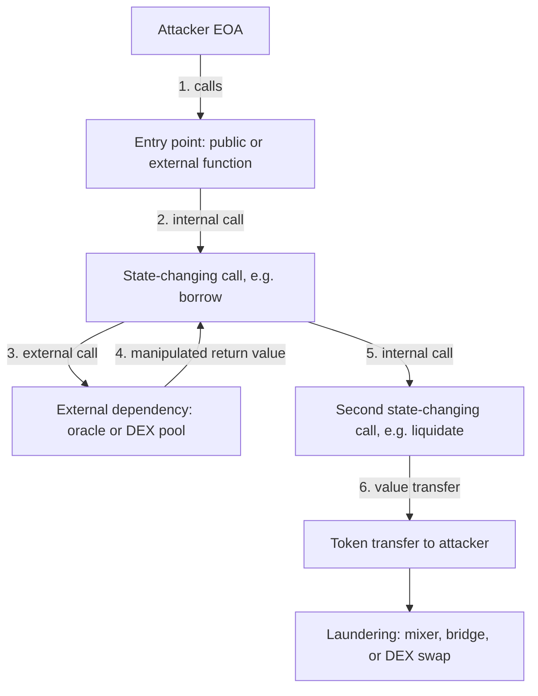
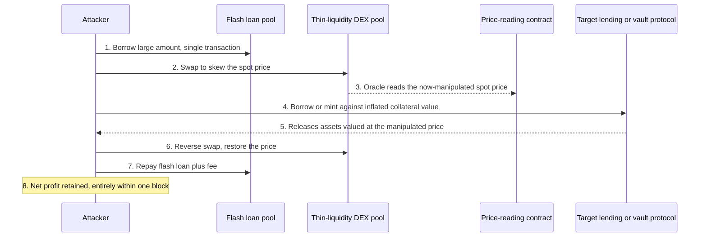
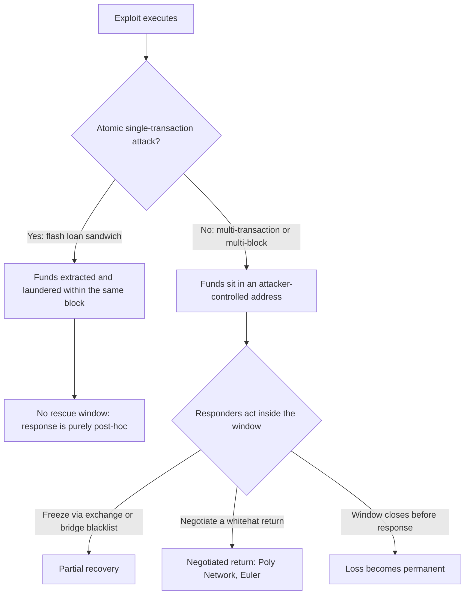
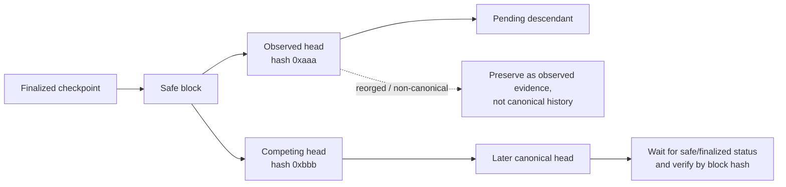

# Part 3: Analysis Techniques

[Back to Handbook contents](index.md) | [Series index](../index.md)

Evidence preserved under Part II is raw material, not a finding. This Part turns a transaction hash into a reconstructed mechanism: tracing execution and value flow, classifying the exploited weakness against OWASP's own control catalog, attributing the actor with an honest confidence level, and handling the cross-chain complications that produce the largest losses in the industry. Each chapter moves the investigation one level closer to a defensible, citable root cause.

---

## 7. Transaction and Flow Analysis

**Evidence preservation** freezes the scene. Flow analysis is where the investigation actually starts, turning a bare transaction hash into a sequence of calls, state changes, and asset movements a human can reason about. Every technique below answers the same question at a different resolution: what moved, along what path, and who authorized it.



*Figure 6. A generic exploit call chain. Chapter 7 reconstructs steps 1 through 6 from raw trace and log data before Chapter 8 asks why step 4 was possible.*

### 7.1 Tracing Execution Paths

A transaction receipt gives a pass or fail result and a list of emitted logs. It does not give the sequence of internal calls, the opcode-level state transitions, or the intermediate values that produced the final outcome. Reconstructing that requires a debug-level trace. Two RPC (Remote Procedure Call) trace families dominate: Geth's `debug_traceTransaction` with a `callTracer` for a call graph or a `prestateTracer` for storage-state context, and Erigon/OpenEthereum-style `trace_transaction` producing structured create, call, and self-destruct frames. Most public endpoints disable these namespaces because tracing is computationally expensive and exposes implementation-specific behavior. Whether a historical transaction can be replayed depends on the client, trace mode, synchronization mode, and retained block/state history; do not equate “debug tracing available” with “archive node” without testing the exact client and provider. Record client name/version and trace configuration with the evidence because traces from different clients and tracers are not byte-for-byte interchangeable.

```bash
curl -s -X POST -H "Content-Type: application/json" \
  --data '{"jsonrpc":"2.0","id":1,"method":"debug_traceTransaction",
           "params":["0xEXPLOIT_TX_HASH", {"tracer":"callTracer"}]}' \
  "$ARCHIVE_RPC_URL"
```

Read the result outside-in: the top frame is the entry point, each nested frame is a call the parent frame made, and an `error` field on any frame marks where a revert originated even when the outer transaction succeeded overall, a common pattern in exploits that probe several paths and keep only the one that works. Cross-reference opcode-level output against the [EVM opcode reference](https://www.evm.codes/) and [geth's debug namespace docs](https://geth.ethereum.org/docs/interacting-with-geth/rpc/ns-debug) whenever exact gas forwarding or a low-level `staticcall` matters to the finding.

### 7.2 Identifying Entry Points and Call Chains

The entry point is the first externally callable function the attacker invoked, and it is rarely where the actual bug lives. Decode the leading four bytes of the calldata (the function selector) against a signature database; when source is unverified, [Openchain's signature lookup](https://openchain.xyz/signatures), successor to the community-run 4byte.directory registry, resolves a selector to a human-readable signature without needing source at all. From there, walk the call tree from 7.1 and classify each hop by opcode. `CALL` changes both storage context and `msg.sender` to the callee. `DELEGATECALL` keeps the caller's storage and identity while borrowing the callee's code, the mechanism behind every proxy pattern and a repeat factor in upgrade-related incidents. `STATICCALL` forbids state changes, marking a branch where value could not have moved. Flag every point where the chain crosses a **trust boundary**, a call into a contract the target protocol does not control, because that is where an attacker-supplied return value or a reentrant callback gets smuggled in. A clean, annotated call chain (function, contract, call type, one-line note on what changed) is the artifact every later section of this chapter builds on.

### 7.3 Token and Value Flow Mapping

Native ETH transfers happen through the value field inside `CALL` frames and never emit a log, so they are invisible to log-based tooling and visible only in the internal-transaction trace from 7.1. ERC-20 and ERC-721 transfers, in contrast, emit a `Transfer` event whose signature hash (`keccak256("Transfer(address,address,uint256)")`, computable directly and commonly seen written as `0xddf252ad1be2c89b69c2b068fc378daa952ba7f163c4a11628f55a4df523b3ef`) appears as topic zero on every relevant log entry, letting you filter a block range for asset movement without replaying execution. Build the flow map from both sources together: internal-trace value transfers for ETH and wrapped-native movement, decoded `Transfer`, `TransferSingle`, and `TransferBatch` logs for tokens, ordered by log index within the transaction to get a true sequence rather than an unordered set. Multi-hop paths, deposit into a lending pool, borrow against it, swap the borrowed asset, bridge it out, are the norm in real exploits, and skipping a hop is the most common way a flow map understates the loss or misattributes the final destination. Cross-reference the resulting graph against known exchange deposit addresses and mixer contracts (Chapter 9) before publishing a "final destination," since an intermediate hop is easy to mistake for an endpoint.

### 7.4 Tools and Methodologies (Tenderly, Etherscan, Custom Scripts)

[Tenderly's transaction debugger](https://docs.tenderly.co/debugger) turns a raw trace into a browsable, source-mapped view: it steps through execution one call and source line at a time, decodes function names, arguments, and gas costs, exposes contract state at any point, and pinpoints the exact instruction where a revert fired. Its simulation mode re-executes a transaction against modified state (a different block, a patched contract, a different input) without broadcasting anything, which is how most public post-mortems produce their "here is what would have happened" counterfactuals. Etherscan's transaction page complements this for verified contracts: the **Internal Txns** tab (an explorer label, not a consensus transaction type) surfaces trace-derived internal calls and native-value transfers missing from the receipt, **Decode Input Data** resolves calldata against a verified ABI (Application Binary Interface), and the Etherscan API lets you script a full address history rather than click through it. For anything repeatable, write it down as code: a Foundry command such as `cast run --trace <tx_hash> --rpc-url $TRACE_RPC` reproduces a trace against a trace-capable endpoint, and an `ethers.js` or `web3.py` script that loops `getLogs` over a block range and reconstructs a flow graph turns a one-off investigation into a reusable tool for the next incident. Favor scripts over manual clicking wherever the same few steps recur; custom tooling is what separates a reproducible finding from an anecdote.

---

## 8. Contract and Vulnerability Analysis

Flow analysis explains what happened. This chapter explains why it was possible, grounding the answer in a named weakness class, an OWASP control reference, and, wherever feasible, a working reproduction.

### 8.1 Identifying Exploited Weaknesses

Start from the state transition that should not have been possible, given the trace and flow map from Chapter 7, and locate the exact statement in source (or, absent verified source, in decompiled bytecode) that permitted it. Diff the pre-exploit deployed bytecode against any patched version released afterward: protocols that ship a fix typically do so within hours, and the diff isolates vulnerable logic far faster than re-reading the entire contract. If no patch exists yet, diff instead against verified source on Etherscan or [Sourcify](https://sourcify.dev/) to confirm you are reading the actual deployed bytecode's logic rather than a stale repository branch; deployed bytecode and a project's public HEAD diverge more often than teams admit. Confirm the weakness class with a minimal counterexample: the smallest call sequence, ideally shorter than the attacker's actual transaction, that reproduces the broken invariant on a forked chain (Section 8.6). A finding that cannot be reduced to a minimal counterexample remains a hypothesis, not a confirmed root cause.

### 8.2 Mapping to SCWE and SCSVS Controls

The Smart Contract Weakness Enumeration (SCWE) catalogs concrete weakness patterns and organizes them under the eleven top-level domains of the Smart Contract Security Verification Standard (SCSVS), so every SCWE entry inherits an SCSVS domain as its category ([OWASP SCS project](https://scs.owasp.org/)). Mapping an exploited weakness to its SCWE identifier before writing the report gives the finding a stable identity independent of your own phrasing, and mapping onward to the SCSVS domain tells a reader which pre-deployment verification control, had it actually been enforced, would have caught it.

| SCSVS domain | Focus | Typical exploited weakness (this chapter's root causes) |
|---|---|---|
| SCSVS-AUTH | Access control and authentication | Missing or misordered role check, `tx.origin` misuse |
| SCSVS-ORACLE | Arithmetic and logic security | Price manipulation, rounding-direction bugs (8.4, 8.5) |
| SCSVS-COMM | Secure interactions and communications | Reentrancy, unchecked external call return values |
| SCSVS-GOV | Business logic and economic security | Invariant violations, incentive-design flaws |
| SCSVS-BRIDGE | Blockchain data and cross-chain messaging | Bridge verification-logic failures (10.1) |
| SCSVS-ARCH | Architecture, design, and upgradability | Unprotected initializer, storage-layout collision on upgrade |

Treat this table as a starting index, not a substitute for the live catalog. SCWE assigns specific numeric identifiers under each domain, the SCSVS-AUTH domain alone spans roughly SCWE-016 through SCWE-020 plus several non-contiguous IDs elsewhere in the catalog, and those assignments are revised as the project grows. Confirm the current identifier against [scs.owasp.org's SCWE catalog](https://scs.owasp.org/) rather than citing a number from memory in a report meant to age well.

### 8.3 Root Cause: Logic, Oracle, Access Control, Reentrancy, etc.

| Root cause | Diagnostic question | What to look for in the trace |
|---|---|---|
| Business logic | Does an invariant hold before and after every state-changing function, not only the ones the developer tested? | An operation that changes one side of a paired value (shares vs. assets, debt vs. collateral) without updating the other |
| Oracle dependency | Is price sourced from a single spot reading the attacker can move within one transaction? | A reserve-ratio or `balanceOf` read immediately followed by a large swap in the same call chain |
| Access control | Does every privileged function check the caller, and check the right thing (`msg.sender` versus `tx.origin`, role versus ownership)? | A state-changing call with no preceding `require`, modifier, or role check in its own frame |
| Reentrancy | Can an external call in the middle of a function re-enter before that function's state updates finish? | A `CALL` or token-hook frame nested inside a function that writes state after the call (a checks-effects-interactions violation), including read-only reentrancy through a view function during that window |
| Arithmetic and precision | Does rounding or truncation direction ever favor the caller across repeated small operations? | Integer division before multiplication, or a rounding mode that is not uniformly conservative (8.4) |

These categories overlap more than the table suggests. A reentrancy bug is often a business-logic bug wearing a specific costume: state updated too late. An oracle manipulation is an access-control bug in the sense that the protocol implicitly trusted an untrusted price source. Use the table to structure the writeup, not to force a single label onto a failure with more than one contributing factor.

### 8.4 Precision, Rounding, and Invariant Violations (e.g., Balancer-Type)

Integer arithmetic in Solidity truncates toward zero on division, and every automated market maker (AMM) built on an invariant, a constant-product curve, a StableSwap curve, or a weighted-pool formula, must round somewhere when converting between pool tokens, underlying assets, and share amounts. The security-critical question is which direction each rounding operation favors: a protocol stays safe only if every rounding step is conservative in the protocol's own favor, consistently, on every code path touching the same invariant. Balancer's August 2023 disclosure of a critical vulnerability in certain composable stable pool contracts is the reference case for this class ([Balancer governance forum](https://forum.balancer.fi/)): a rounding inconsistency in the pool-rate calculation let an attacker execute a sequence of carefully sized, near-zero-impact trades that accumulated rounding error in the attacker's favor with each iteration, gradually skewing the invariant until it could be drained. Balancer paused affected pools within hours of disclosure, but publicly reported losses still ran into the hundreds of thousands of dollars across pools that had not yet migrated, a reminder that a rounding-direction bug (the SCSVS-ORACLE arithmetic and logic domain) can survive several audits because each individual rounding operation looks locally correct.

The forensic tell in a trace is repetition: dozens or hundreds of structurally identical calls with slightly varying amounts, individually unremarkable, executed inside one transaction or one tight block range. The anti-pattern in miniature:

```solidity
// Unsafe: rounds toward the caller on withdrawal, away from the caller on deposit
function bptToTokens(uint256 bptAmount) public view returns (uint256) {
    return bptAmount * rate / 1e18; // rounds down: fine for deposit accounting
}
function tokensToBpt(uint256 tokenAmount) public view returns (uint256) {
    return tokenAmount * 1e18 / rate; // rounds down here too: favors the CALLER, not the pool
}
```

When auditing a suspected rounding exploit, isolate every function that both reads and writes the same invariant variable, and verify the rounding direction is uniformly conservative across all of them, not merely sane in isolation.

### 8.5 Price Oracle and Flash-Loan Attack Forensics

A flash loan, an uncollateralized loan that must be borrowed and repaid within a single transaction or the entire transaction reverts, removes the capital constraint that once made price manipulation expensive. Paired with a protocol that reads price from a manipulable on-chain source rather than a time-weighted or externally attested feed, it produces the most common single exploit pattern in DeFi history: from the first flash-loan attacks against bZx in February 2020, through Cream Finance's roughly $130 million loss in October 2021, to Mango Markets in October 2022, where an attacker used borrowed capital to move the thinly traded MNGO perpetual market from roughly $0.03 to $0.91, then borrowed against the inflated collateral value, draining about $115 million before a negotiated partial return.



*Figure 7. Canonical flash-loan oracle manipulation sequence. Steps 1 through 8 complete atomically; nothing outside this window is observable until it is already over.*

Reconstruct this class methodically. Identify the exact oracle call, a spot AMM reserve read, a `balanceOf` call, or an external feed such as Chainlink, that the exploited function relied on. Pull the flash loan's borrowed amount from the trace and compute its price impact against the manipulated pool's actual depth at that block; impact scales with loan size relative to liquidity, so an implausibly large flash loan against a shallow pool is itself diagnostic. Confirm the manipulated price was read and consumed inside the same transaction, or the same atomic block, as the swap that produced it. Chainlink's own guidance on the risk of relying on spot reads rather than [time-weighted price feeds](https://docs.chain.link/data-feeds) is the standard citation for why single-block spot pricing is treated as an anti-pattern rather than a mere edge case.

### 8.6 Reproducing the Attack (Testnets, Forks)

A finding is not confirmed until it executes against real, forked chain state; a manual trace read is a hypothesis, a passing forked test is evidence. Foundry's forking cheatcode pins execution to the exact block before the exploit and replays it:

```bash
forge test --match-test test_reproduceExploit \
  --fork-url "$ARCHIVE_RPC_URL" \
  --fork-block-number <EXPLOIT_BLOCK_MINUS_ONE> -vvvv
```

```solidity
function test_reproduceExploit() public {
    // 1. Fork state is already pinned to the block before the exploit tx
    // 2. Re-execute the attacker's exact calldata via vm.prank plus a low-level call,
    //    or reconstruct the call sequence step by step from the Chapter 7 trace
    // 3. Assert the same invariant violation or balance delta the on-chain tx produced
    // 4. Patch the isolated line and re-run to confirm the fix holds
}
```

Never reproduce against a public testnet with the vulnerable contract redeployed and real, watched infrastructure nearby. A mainnet fork is isolated and disposable and cannot itself cause harm, while a live testnet reproduction can leak a working exploit to anyone monitoring testnet mempools before the mainnet incident is contained. Once the forked reproduction passes, it becomes the load-bearing artifact for the report's proof-of-concept section, the regression test the patched code must pass, and, if **recovery** negotiation is underway (Part 4), the technical proof grounding whatever a responder claims happened.

---

## 9. Attribution and Threat Actor Context

A confirmed root cause answers what broke. **Attribution** asks who broke it, and it is the chapter where evidentiary rigor matters most, because a wrong attribution can misdirect an entire response effort or, worse, name an innocent party.

### 9.1 Address Clustering and Labeling

**EVM** address clustering has no direct analog to Bitcoin's common-input-ownership heuristic, since no single EVM transaction spends from multiple unrelated externally owned accounts the way a UTXO transaction can. EVM-specific heuristics instead center on funding relationships and behavioral fingerprints. Funding-source clustering follows the address that supplied a "fresh" wallet's initial gas: addresses that all receive their first ETH from the same centralized-exchange withdrawal or the same funding wallet are strong candidates for common control. Gas-payer clustering flags a single address that repeatedly pays gas for, or deploys, many otherwise-unrelated contracts, common in exploit infrastructure built from a `CREATE2` factory. Behavioral clustering matches interaction patterns: identical function-call sequencing, identical gas-price bidding strategy, or reused calldata templates across addresses that never transact with each other directly. Commercial platforms operationalize these heuristics at scale and layer proprietary off-chain data on top, including historical case linkage and exchange cooperation: [Chainalysis](https://www.chainalysis.com/), [TRM Labs](https://www.trmlabs.com/), and [Elliptic](https://www.elliptic.co/) are the three most cited in public post-mortems, alongside open, community-driven labeling through Etherscan's public name tags and [Arkham Intelligence](https://www.arkhamintelligence.com/)'s open intelligence exchange. Treat every cluster as a hypothesis with a stated basis. "Same funding source" is materially weaker evidence than "identical deployment bytecode and identical private-key-derived nonce sequence," and the strength of the underlying heuristic should travel with the label whenever you cite it.

### 9.2 Behavioral Patterns and TTPs

Tactics, techniques, and procedures (TTPs), a framework popularized by [MITRE ATT&CK](https://attack.mitre.org/) for describing adversary behavior at three levels of abstraction (the strategic goal, the general method, and the specific implementation, each technique carrying a stable identifier such as T1059), transfer naturally to on-chain threat actors. MITRE's newer [AADAPT framework](https://aadapt.mitre.org/), Adversarial Actions in Digital Asset Payment Technologies, applies the same tactics-techniques-procedures structure specifically to blockchain and digital-asset threats, giving forensic teams shared vocabulary for behaviors ATT&CK's enterprise-IT focus does not cover: on-chain laundering paths, cross-chain hopping, and DeFi-specific exploitation sequences among them.

Documented, reusable TTPs for state-linked actors are among the best characterized in the space. The FBI publicly attributed the March 2022 Ronin bridge theft, roughly $624 million, to North Korea's Lazarus Group, and the [US Treasury's Office of Foreign Assets Control sanctioned the Tornado Cash mixer in August 2022](https://ofac.treasury.gov/recent-actions) partly for its role laundering Lazarus proceeds. Recurring Lazarus TTPs include small test transactions ahead of a large transfer, funds routed through several sequential mixers or cross-chain bridges rather than a single hop, and deliberate splitting of proceeds across many freshly funded addresses before eventual consolidation. Treat a TTP match as corroborating evidence, not proof of identity on its own. Document the specific technique observed, which mixer, which bridge sequence, which timing pattern, rather than asserting **attribution** as a conclusion the trace alone cannot support.

### 9.3 Use of Public and Private Intelligence

Open-source intelligence for on-chain **attribution** includes block-explorer public labels, [DeFiLlama's hack tracker](https://defillama.com/hacks), rekt.news's incident archive, and independent researcher threads (ZachXBT's public investigations are the most frequently cited example of crowd-sourced attribution reaching conclusions ahead of, or feeding into, official channels). These sources are freely reusable and independently verifiable, since anyone can re-derive the same on-chain facts, but they lag structured commercial data on off-chain corroboration. Paid intelligence platforms, Chainalysis KYT (Know Your Transaction) real-time alerting, TRM Labs, and Elliptic among them, add proprietary exchange cooperation, historical case linkage across investigations, and cluster databases built from years of subpoena-backed data no single researcher can replicate from public sources alone. For an active incident, [SEAL 911](https://securityalliance.org/) coordinates real-time responder access across both tiers: a 24/7 crisis line connecting an affected protocol to whitehat responders, exchange security teams empowered to freeze assets in transit, and forensic analysts carrying the paid tooling to move faster than a single team could alone. Blend both tiers deliberately: cite open evidence for anything a report needs to be independently reproducible, and reserve paid-platform conclusions for internal triage or for corroborating, never solely establishing, a public claim.

### 9.4 Limitations and Confidence Levels

**Attribution** claims should carry an explicit confidence tier, not an unqualified assertion, because the underlying evidence types vary enormously in strength.

| Confidence tier | Evidentiary basis | Example |
|---|---|---|
| High | Off-chain corroboration ties an on-chain cluster to a real-world identity (subpoenaed exchange KYC, law-enforcement forfeiture filing, self-doxxing) | A DOJ seizure filing naming a specific wallet cluster |
| Medium | Strong, consistent on-chain heuristics (funding source plus a behavioral TTP match) without off-chain confirmation | Multiple addresses funded from one exchange withdrawal, sharing a reused deployment pattern |
| Low | A single weak signal, or a pattern shared across many unrelated actors | Use of a common mixer alone, or a gas-price fingerprint shared across users of a popular wallet app |

The most common false-positive source is shared infrastructure: a popular mixer, a bridge, or even a wallet provider's relayer can create the appearance of common control between addresses that share nothing but a service provider. Cluster confidence also decays over time as published heuristics get gamed: an attacker who reads a forensic report learns exactly which pattern to avoid next time, one reason serious platforms keep some clustering logic proprietary. State the confidence tier next to every attribution claim in a report, and never let a Medium- or Low-confidence cluster read as settled fact in a document that will outlive the investigation.

---

## 10. Multi-Chain and Cross-Chain Considerations

Value moves across dozens of EVM-compatible chains and the bridges connecting them, and that surface has produced the single largest category of losses industry-wide. This chapter treats bridges as their own forensic discipline and covers the rescue window, the narrow gap between a non-atomic exploit and irreversible laundering during which a response can still matter.

### 10.1 Bridge and Messaging Layer Analysis

A bridge is not one contract; it is a trust system with three legs: a source-chain lock or burn, an off-chain or on-chain verification layer that attests the event happened, and a destination-chain mint or release that trusts that attestation. Forensic analysis of a bridge incident means identifying which leg failed, because both the technical fix and the **attribution** depend on the answer.

#### 10.1.1 Bridge Attack Vectors (Validator Trust, Verification Logic, Access Control)

| Vector | Mechanism | Named incident |
|---|---|---|
| Validator or guardian trust compromise | Attacker obtains enough private keys or signing power to forge a valid-looking attestation | Ronin, March 2022: 5 of 9 validator keys compromised via social engineering and a stale RPC-node permission, roughly $624 million |
| Verification-logic flaw | The verification contract accepts a proof it should reject | Wormhole, February 2022: Solana-side guardian-signature verification failed to check a required system account, letting the attacker mint 120,000 wETH without matching collateral, roughly $326 million |
| Access control failure | A privileged function meant to be locked to the verification layer is reachable by anyone or by a spoofable caller | Nomad, August 2022: a faulty initialization set the trusted message root to zero, so any message with a "proof" matching that default was accepted, producing a chaotic free-for-all as hundreds of copy-paste transactions drained the bridge in parallel, roughly $190 million |

These vectors are not mutually exclusive. The BNB Bridge (Token Hub) incident of October 2022 combined a verification-logic gap in its IAVL Merkle-proof checking with the practical reality that only a handful of validators needed to be fooled before a forged mint could occur, though the chain's operators halted the network within hours and the liquid value an attacker actually extracted came in well under the roughly $586 million face value of the forged mint. When triaging a new bridge incident, isolate which leg (lock or burn, verify, mint or release) accepted bad input first, then ask whether the failure required compromising a keyholder (validator trust) or merely finding a logic gap any observer could exploit once known (verification or **access control**). The two categories imply very different remediation and very different attacker sophistication.

#### 10.1.2 Bridge as Largest Source of Web3 Losses: Taxonomy

| Incident | Date | Reported loss | Primary vector |
|---|---|---|---|
| Ronin Network | Mar 23, 2022 | ~$624M | Validator key compromise |
| Poly Network | Aug 10, 2021 | ~$611M | Access control (cross-chain manager) |
| BNB Bridge (Token Hub) | Oct 6, 2022 | ~$586M face value | Verification logic (forged proof) |
| Wormhole | Feb 2, 2022 | ~$326M | Verification logic (signature check) |
| Nomad | Aug 1, 2022 | ~$190M | Access control (trusted root default) |
| Harmony Horizon Bridge | Jun 23, 2022 | ~$100M | Validator key compromise (multisig) |

*Source: [rekt.news leaderboard](https://rekt.news/leaderboard/).*

These six incidents alone total more than $2.4 billion, and chain-analytics firms' annual crime research has repeatedly flagged cross-chain bridges as a disproportionate share of total industry losses in the years those incidents concentrated ([Chainalysis crypto crime research](https://www.chainalysis.com/)). The driver is structural: a bridge often custodies the full collateral backing every wrapped asset in circulation, while its actual security model tends to be thin relative to that value, a 5-of-9 or 2-of-5 **multisig** securing nine or ten figures is not unusual. Both the [MITRE AADAPT framework](https://aadapt.mitre.org/) and OWASP's own SCSVS-BRIDGE domain treat cross-chain messaging as a distinct control category for exactly this reason: the failure modes cluster differently than single-chain contract bugs and warrant a dedicated forensic checklist rather than a generic one.

### 10.2 Atomic vs. Non-Atomic Attacks: Rescue Window

An atomic attack, a flash-loan sandwich that borrows, manipulates, profits, and repays within one transaction, completes and often begins laundering before any human observer notices anything abnormal. There is nothing to intercept, because the attacker never holds the stolen funds in a vulnerable, static location. A non-atomic attack instead leaves funds sitting in an attacker-controlled address, sometimes for minutes, sometimes for days, before they move toward a mixer or a cross-chain exit. That gap is the rescue window, and it is the single variable that most determines whether a loss becomes a recoverable incident (Part 4) or a permanent one.



*Figure 8. The rescue window decision path. Detection speed is the one variable a responder fully controls once the atomic-versus-non-atomic branch has already been decided by the exploit's design.*

#### 10.2.1 When Execution Is Not Atomic (Rescue Time Frame)

Execution stops being atomic the moment an exploit requires more than one transaction, more than one block, or deliberate attacker patience. Common triggers include a timelock the attacker must wait out to claim governance-controlled funds, a multi-step unstaking or vesting mechanism, or simply an attacker choosing to sit on stolen assets rather than immediately cashing out, to avoid triggering automated freeze alerts. The rescue window's real length is set by three factors: how quickly the affected team detects the incident and engages exchanges or bridge operators capable of freezing the specific asset in transit, how quickly the attacker actually attempts to move or launder the funds, and whether the stolen asset is itself freezable at all (a centralized stablecoin issuer can blacklist an address; a native asset or most DeFi tokens cannot).

Poly Network's August 2021 incident is the clearest illustration of a long window used well: roughly $611 million was exploited through a single access-control failure, but the attacker did not immediately launder the proceeds, and over the following two weeks public pressure, on-chain tracking, and direct negotiation (the attacker, nicknamed "Mr. White Hat" by the project, ultimately characterized the action as a demonstration rather than theft) produced a near-complete return of assets. Euler Finance's March 2023 incident shows a shorter but still workable window: after roughly $197 million was drained through a flawed donation-and-liquidation sequence, the Euler team opened direct on-chain negotiation, and the attacker returned the substantial majority of funds within about two weeks. KyberSwap's Elastic exploit in November 2023 illustrates the opposite outcome: funds began moving toward mixers within hours, the window closed fast, and the attacker's subsequent demands, publicly reported as an ultimatum for governance control of the protocol rather than a conventional negotiated return, left **recovery** contested rather than resolved. Everything in Part 4's recovery playbooks assumes the window identified here is still open when that work begins.

### 10.3 Consistency of Evidence Across Chains

Evidence gathered on one chain is only as solid as that chain's finality guarantee at the moment you captured it. Ethereum mainnet reaches probabilistic finality quickly but cryptographic finality under Casper FFG only after roughly two epochs, on the order of 13 to 15 minutes; many EVM-compatible chains, several Layer 2 (L2) networks before finalizing to their settlement layer and a number of sidechains among them, offer weaker or purely probabilistic finality and stay reorg-prone for meaningfully longer, so a transaction, or even a full block, pulled moments after inclusion can still be reorganized out before the report is written. Cross-check evidence against at least two independently operated RPC endpoints, a self-hosted node plus a commercial provider such as Alchemy, Infura, or QuickNode, rather than trusting a single source, and record the block hash alongside the transaction hash in every artifact so a later reorg becomes immediately detectable by comparing the recorded hash to the canonical chain.



*Figure. Reorganization-aware evidence handling. A block observed at the head can later become non-canonical when fork choice selects a competing branch. Record its block hash and status at collection time, preserve the raw observation, and do not describe it as canonical or finalized until independent consensus-aware sources agree.* Block explorers built on different indexers, Etherscan's proprietary stack versus [Blockscout](https://www.blockscout.com/)'s open-source indexer, sometimes disagree at the margins (decoded event names, token metadata, pending-state display) even when underlying chain data matches, so treat explorer output as a convenience layer and the raw RPC response as ground truth whenever a finding's precision matters. For multi-chain incidents, timestamp every artifact in UTC and note each source chain's finality status explicitly: "confirmed, N confirmations" is not the same claim as "finalized," and a report that conflates them can later be shown to rely on evidence that no longer exists.

### 10.4 Tooling for L2s and Alternative EVM Chains

The Etherscan family operates parallel, separately branded explorers for most major **EVM** chains: Arbiscan for Arbitrum, Optimistic Etherscan for OP Mainnet, BscScan for BNB Chain, PolygonScan for Polygon, and Basescan for Base, each with its own API key and rate limits despite a broadly shared interface, so budget for per-chain account setup rather than assuming one key works everywhere. [Blockscout](https://www.blockscout.com/) is the dominant open-source alternative and the default explorer for many smaller rollups and appchains that never receive an Etherscan-family deployment; treat its self-hosted, per-chain instances as authoritative on chains where no commercial explorer exists. Trace-API availability is the biggest practical gap: `debug_traceTransaction` and its equivalents are disabled on most free public L2 RPC endpoints just as they are on mainnet, and call-level tracing on a rollup typically requires a paid archive-tier plan from a provider like Alchemy or QuickNode, or a self-run node. Use [chainlist.org](https://chainlist.org/) or the underlying [ethereum-lists/chains registry](https://github.com/ethereum-lists/chains) to confirm the correct chain ID and canonical RPC endpoint before pulling data; a surprising number of forensic errors trace back to querying a similarly named but unrelated network. For cross-chain aggregate views, Dune Analytics dashboards and [L2Beat](https://l2beat.com/)'s risk and activity data give a faster first read on a rollup's bridge design and total value secured than reading its contracts cold.

### 10.5 Real-Time Forensics and Mempool Monitoring

An incident caught while the attacker's follow-on transactions are still pending gives a responder options that vanish once everything is confirmed and mixed. [Blocknative's Mempool Explorer](https://www.blocknative.com/) and a self-run `eth_subscribe("newPendingTransactions")` listener both expose the public mempool in real time, letting a responder catch a second-stage transaction, draining a related contract or bridging stolen funds out, before it lands. A meaningful share of Ethereum's transaction flow now bypasses the public mempool entirely through private order-flow channels; [Flashbots Protect and MEV-Share](https://docs.flashbots.net/) (maximal extractable value, MEV) route transactions directly to block builders to avoid front-running, which also means a sophisticated attacker's follow-on moves may never appear in a public mempool watcher at all. Plan monitoring coverage for both public and private order flow rather than assuming one channel is sufficient. [EigenPhi](https://eigenphi.io/) and similar MEV-analytics platforms index extractable-value activity, sandwich attacks, arbitrage, and liquidations, in near real time and help distinguish an ordinary MEV bot's opportunistic transaction from a targeted follow-on exploit transaction that merely looks similar at a glance. The [Forta Network](https://forta.org/) runs a decentralized set of real-time detection bots against live transaction streams and can alert a protocol team to an anomalous call pattern against their own contracts before a human notices the drop in total value locked (TVL). None of these tools substitute for the forked, offline reproduction in Section 8.6; they cover the narrow, time-critical window where a live response is still possible, and they should feed directly into the rescue-window decisions from Section 10.2.

---

**Key controls for Part 3**

- Reconstruct execution with a call-level trace (`debug_traceTransaction`/`callTracer` or equivalent) before drawing conclusions from the top-level receipt alone.
- Map every finding to its OWASP SCWE identifier and SCSVS domain so root-cause claims stay independently verifiable and comparable across incidents.
- Treat a manual trace read as a hypothesis; only a forked, executed reproduction (Section 8.6) counts as confirmed evidence.
- Attach an explicit confidence tier (High/Medium/Low) to every **attribution** claim, and never let heuristic clustering read as settled identity.
- For bridge and non-atomic incidents, clock the rescue window immediately; detection speed is the one variable a responder fully controls.

