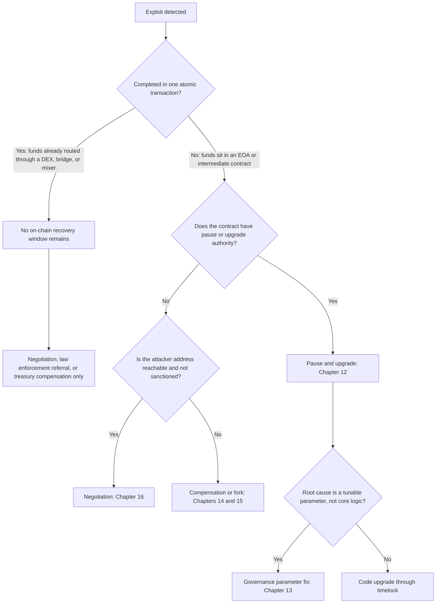
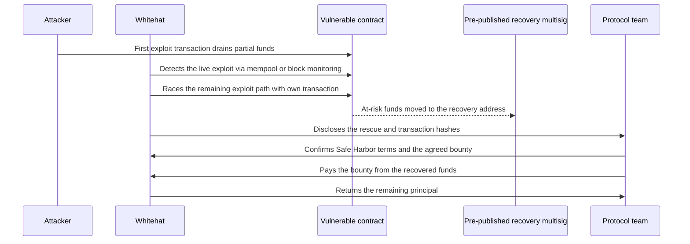

# Part IV: DeFi Recovery Patterns

[Back to Handbook contents](index.md) | [Series index](../index.md)

Parts II and III built a root-cause finding from raw evidence. This part answers the question a responder asks the moment that finding lands on the table: what, if anything, can still be done. Decentralized Finance (DeFi) **recovery** is not a single technique but a small set of recurring patterns, pause and upgrade, governance-driven parameter fixes, treasury-funded compensation, fork and migration, direct negotiation, and pre-authorized whitehat rescue, each with its own preconditions, timeline, and failure mode. The chapters below catalog each pattern against the incidents that defined it, so a responder facing a live loss can match the situation to a precedent instead of improvising one.

---

## 11. DeFi Recovery Patterns Database (Concept and Use)

A **recovery** patterns database turns scattered post-mortems into a repeatable decision aid. This chapter defines what belongs in it, the hard limits on what recovery can achieve, and the legal ground a responder must check before acting on any pattern in Chapters 12 through 17.

### 11.1 Purpose of a Recovery Patterns DB

Every DeFi exploit produces the same panic: a team with minutes to decide, incomplete information, and a community watching the treasury drain in real time. A patterns database exists to remove the guesswork from that moment by pre-recording what worked, what did not, and under what conditions each pattern applied. This mirrors how **incident response** matured in traditional security: the [NIST Cybersecurity Framework 2.0](https://www.nist.gov/cyberframework) formalizes a "Recover" function (categories RC.RP for **recovery** planning and RC.CO for recovery communications) precisely because ad hoc recovery under pressure produces worse outcomes than a rehearsed plan, and DeFi's public, adversarial, irreversible-by-default environment raises the stakes on that lesson rather than lowering them.

Each entry in a working database should record four things: the applicability trigger (what conditions must hold for this pattern to be usable at all), the prerequisite infrastructure (a pause switch, a timelock, a treasury, a pre-published recovery address), the realistic timeline from decision to execution, and at least one documented precedent with its outcome. The table below is the roadmap for the rest of this part; each row becomes its own chapter.

| Pattern | Core precondition | Typical timeline | Representative precedent |
|---------|-------------------|-------------------|---------------------------|
| Pause and upgrade | Contract has a pause switch or is behind an upgradeable proxy | Minutes to pause, days to patch and upgrade | Widely used emergency-admin pattern across lending and DEX protocols |
| Governance and parameter changes | A timelock or multisig with authority over the broken parameter | Hours to days, gated by timelock delay | Compound's 2021 comptroller over-distribution required a governance-path fix |
| Compensation | Sufficient treasury, insurance fund, or external backstop | Weeks to design and distribute | Fei Protocol's Tribe DAO reimbursement after the April 2022 Rari Fuse exploit |
| Fork and migration | Broad community consensus that the alternative is unacceptable | Weeks to months | The DAO hard fork, July 2016 |
| Negotiation | Attacker reachable, funds not fully laundered | Days to weeks, no guaranteed outcome | Poly Network, August 2021; Euler Finance, March 2023 |
| Whitehat safe harbor | Pre-authorization exists before the incident occurs | Minutes during the live exploit | Security Alliance Whitehat Safe Harbor Agreement adopters |

### 11.2 When Recovery Is Feasible vs. When It Is Not

The single largest determinant of feasibility is whether the attack was atomic. A flash-loan-funded exploit that borrows, manipulates, drains, and repays within one transaction leaves no window: by the time the transaction is mined, the funds may already be mid-route through a decentralized exchange, a cross-chain bridge, or a mixing service, and nothing short of downstream freezing by a centralized counterparty can touch them. A non-atomic attack, by contrast, one that requires the attacker to wait for a timelock, move funds across multiple blocks, or hold assets in an intermediate address before laundering, leaves a real window during which a pause, a race transaction, or a negotiation can still change the outcome. Poly Network's August 2021 attacker left roughly six hundred million dollars sitting in identifiable addresses for days rather than exiting immediately ([rekt.news, Poly Network](https://rekt.news/polynetwork-rekt/)), which is precisely why negotiation worked there and would not have worked against a single-block sandwich attack.



*Figure 1. Feasibility decision path from exploit detection to the applicable recovery pattern. Atomicity is evaluated first because it determines whether any on-chain window exists at all.*

Beyond atomicity, feasibility depends on four further factors: whether unaffected user funds remain exposed to a repeat of the same bug, whether the protocol's remaining treasury can absorb a compensation shortfall if other patterns fail, whether the attacker's address has surfaced on a sanctions list (Section 11.3), and whether the team retains the legal and technical authority (a live **multisig**, an unexpired timelock role, an EOA (Externally Owned Account) that still controls upgrade rights) to act at all. A protocol that renounced its admin keys for decentralization credibility has, by that same choice, eliminated pause and upgrade as options before any incident occurs.

### 11.3 Legal and Governance Constraints

**Recovery** is a legal act before it is a technical one, and skipping this check has cost responders dearly. Three constraints recur across every incident in this handbook. First, sanctions screening: paying, negotiating with, or routing recovered funds through an address on the U.S. Treasury's Specially Designated Nationals list is itself a violation independent of intent, a risk made concrete when the Treasury sanctioned Tornado Cash in August 2022 ([Treasury press release](https://home.treasury.gov/news/press-releases/jy0916)) and when the FBI publicly attributed the March 2022 Ronin bridge theft to the Lazarus Group ([rekt.news, Ronin](https://rekt.news/ronin-rekt/)), a Democratic People's Republic of Korea (DPRK) state-linked actor already under sanction. Screen every counterparty address against the [OFAC sanctions list](https://sanctionssearch.ofac.treas.gov/) before any negotiation opens.

Second, criminal exposure survives restitution. Returning stolen funds, even under a negotiated governance vote, does not retroactively authorize the original unauthorized access under the U.S. Computer Fraud and Abuse Act (CFAA) or equivalent statutes elsewhere; prosecutors pursued the Mango Markets exploiter on fraud and market manipulation charges after a Mango DAO governance vote had already let him keep a negotiated share of the funds as a "bounty" ([rekt.news, Mango Markets](https://rekt.news/mango-markets-rekt/)). Third, governance capacity: verify that the entity acting, whether a foundation, a Decentralized Autonomous Organization (DAO) with a legal wrapper, or a **multisig**, actually has standing to negotiate, sign a release, receive recovered assets, and distribute compensation without triggering securities-law exposure on the distribution itself.

**Legal and governance pre-flight checklist**

- [ ] Attacker address(es) screened against OFAC and equivalent sanctions lists before any contact
- [ ] Legal entity with standing identified (foundation, wrapped DAO, or named multisig signers)
- [ ] Outside counsel briefed before any public offer of a bounty, amnesty, or "no prosecution" statement
- [ ] Evidence chain from Parts II and III preserved unmodified regardless of negotiation outcome
- [ ] Jurisdictional exposure assessed for every signer authorizing a compensation payout

---

## 12. Recovery Pattern: Pause and Upgrade

Pause and upgrade is the fastest pattern available and the only one most teams can execute unilaterally, but it only ever stops a bleed, it never reverses one.

### 12.1 Applicability (Upgradeable Proxies, Pausable)

This pattern requires two pieces of infrastructure to already be in place before the incident, not built during it. First, an emergency stop, typically OpenZeppelin's `Pausable` modifier, which gates state-changing functions behind a `whenNotPaused` check and gives a designated guardian role the ability to flip it ([OpenZeppelin Pausable docs](https://docs.openzeppelin.com/contracts/5.x/api/utils#Pausable)). Second, an upgrade path, most commonly a Transparent or UUPS (Universal Upgradeable Proxy Standard) proxy that separates the contract's storage from its logic, letting a new implementation replace the buggy one without redeploying the address every integration and user already trusts ([OpenZeppelin UUPS docs](https://docs.openzeppelin.com/contracts/5.x/api/proxy#UUPSUpgradeable)).

```solidity
// Minimal emergency-stop pattern, OpenZeppelin Contracts v5
contract VaultCore is Pausable, AccessControl {
    bytes32 public constant GUARDIAN_ROLE = keccak256("GUARDIAN_ROLE");

    function withdraw(uint256 amount) external whenNotPaused {
        // normal withdrawal logic
    }

    function pause() external onlyRole(GUARDIAN_ROLE) {
        _pause(); // callable by a low-threshold emergency multisig
    }
}
```

A protocol with neither control has already forfeited this pattern regardless of how fast the team reacts; that gap should be flagged as a finding in its own right, not discovered mid-incident.

### 12.2 Steps and Considerations

Sequence matters more than speed alone. Pause first, before root cause is fully confirmed: a pause is cheap, reversible, and stops further loss immediately, while waiting for certainty before pausing lets the exploit continue. Once frozen, confirm scope using the transaction and flow analysis techniques from Part III, then develop a patch and validate it against a mainnet fork (Anvil or Hardhat's forking mode) that replays the actual exploit transaction to prove the fix closes it. Only after fork-testing should the fix reach a timelock or **multisig** for execution, and unpausing should happen deliberately, with monitoring active, rather than automatically once the upgrade lands.

1. Pause immediately on confirmed anomaly, before full root cause is known
2. Confirm exploit scope and remaining exposure using Part III's transaction-tracing methodology
3. Develop and fork-test the patch against the actual exploit transaction
4. Route the upgrade through the normal timelock or emergency multisig process (Chapter 13)
5. Unpause deliberately, with heightened monitoring for a defined observation window

### 12.3 Risks and Mitigations

The same authority that lets a team stop an exploit lets it stop legitimate withdrawals, and that dual-use nature is the pattern's central risk. Bridges and lending protocols have faced sustained community criticism for pause powers that read, in the fine print, as broad enough to freeze user funds indefinitely with no on-chain guarantee of a timely unpause. A single admin key controlling pause is also a single point of failure: if that key is compromised, an attacker can pause the protocol as a denial-of-service action or, worse, unpause a still-vulnerable contract to continue draining it.

| Risk | Mitigation |
|------|------------|
| Pause used to grief users or freeze funds indefinitely | Bind pause to a published maximum duration or require a governance vote to extend it |
| Single admin key compromise | Require an N-of-M multisig for pause; require full timelock governance for upgrade |
| Partial pause coverage leaves sibling contracts exposed | Enumerate all contracts sharing the vulnerable logic or shared state before declaring the pause complete |
| Upgrade deployed without fork-testing against the real exploit tx | Make fork-replay a mandatory, checked step before any upgrade transaction is signed |

---

## 13. Recovery Pattern: Governance and Parameter Changes

Where pause and upgrade fixes code, this pattern fixes the numbers around it, and it depends on the same timelock infrastructure that keeps governance itself from becoming an **attack surface**.

### 13.1 Using Timelock and Multisig

A timelock contract enforces a mandatory delay between a governance vote passing and its execution, giving the community a window to review, and if necessary exit, before a change takes effect. OpenZeppelin's `TimelockController`, derived from the pattern Compound popularized in its original `Timelock.sol`, is the de facto standard ([OpenZeppelin TimelockController docs](https://docs.openzeppelin.com/contracts/5.x/api/governance#TimelockController)). **Multisig** wallets, most commonly Safe, hold the proposer and executor roles that interact with the timelock, adding an N-of-M human approval layer on top of the delay ([Safe documentation](https://docs.safe.global/)).

```bash
# Schedule a timelocked parameter change, then execute after the delay
cast send $TIMELOCK "schedule(address,uint256,bytes,bytes32,bytes32,uint256)" \
  $TARGET 0 $CALLDATA $PREDECESSOR $SALT $DELAY --account guardian

# After the delay elapses, any account holding EXECUTOR_ROLE can execute
cast send $TIMELOCK "execute(address,uint256,bytes,bytes32,bytes32)" \
  $TARGET 0 $CALLDATA $PREDECESSOR $SALT --account executor
```

### 13.2 Parameter Fixes (Oracle, Slippage, Caps)

Not every root cause requires new code. Oracle staleness thresholds, price-deviation circuit breakers, slippage tolerance bounds, deposit and borrow caps, and loan-to-value (LTV) ratios are all values a governance proposal can change without touching contract logic at all, provided the contract was built with those values as adjustable parameters rather than hardcoded constants. Compound's September 2021 comptroller bug, which over-distributed roughly eighty million dollars of COMP tokens to users through a flawed reward-index change, is the reference case for why parameter and reward-logic fixes belong in this pattern: the correction itself required a governance proposal, and because the excess tokens had already left the protocol, the team's only further lever was a public appeal asking recipients to voluntarily return the overpayment, an outcome that blends this pattern with the negotiation pattern in Chapter 16.

| Parameter class | Failure mode it addresses | Example fix |
|-------------------|---------------------------|--------------|
| Oracle heartbeat / staleness bound | Stale price feed accepted as current | Tighten maximum acceptable feed age |
| Price deviation circuit breaker | Single-block price manipulation accepted | Reject updates beyond a bounded percentage move |
| Slippage tolerance | Sandwich or manipulation profit from wide tolerance | Lower default or enforce a hard maximum |
| Deposit / borrow caps | Uncapped exposure to a single asset or market | Cap new deposits pending a full fix |
| LTV ratio | Under-collateralized positions survive a price shock | Reduce LTV for the affected collateral type |

### 13.3 Communication and Execution

A public timelock is, by design, a public countdown, and that transparency cuts both ways. Publicizing a patch before the timelock executes tells an attacker exactly how long they have left to exploit the still-live bug, so disclosure timing must weigh the community's right to know against the risk of accelerating the very attack the fix addresses. Where the vulnerability remains actively exploitable, prefer executing through an emergency-authorized path first (Chapter 12) and reserve the full governance narrative, forum post, and security advisory for after the fix is live. Publish a post-mortem once the immediate risk has passed, following the same evidence-preservation discipline as Part II, since that document becomes the primary public record for the case-study catalog in Chapter 18.

**Communication sequencing checklist**

- [ ] Confirm the fix is deployed or the emergency path is active before any public disclosure
- [ ] Draft the security advisory before the vote, not after, so execution is not delayed by wordsmithing
- [ ] Post to governance forum and official channels simultaneously to avoid information asymmetry
- [ ] Publish the full post-mortem only after the immediate exploit window has closed

---

## 14. Recovery Pattern: Compensation and User Funds

When neither pausing the code nor renegotiating the outcome restores what was lost, compensation shifts the loss from users onto the protocol's own balance sheet or its backers.

### 14.1 Identifying Affected Users and Amounts

The first technical task is reconstructing exactly who lost what, at the block immediately before the exploit, using an archive node query, a subgraph snapshot, or a Dune Analytics query against indexed event logs. Two edge cases routinely complicate this. The attacker's own address, and any address that benefited indirectly from the exploit's side effects (an arbitrageur who happened to profit from the resulting price dislocation, for instance), must be excluded from any compensation set even though they technically held a balance at the snapshot block. And users who sold into a depegged or crashed asset price before the snapshot, realizing a loss the exploit caused without ever holding the affected token at the reference block, raise a fairness question about whether "affected" should be defined by balance-at-snapshot or by demonstrated loss, a distinction every compensation plan must state explicitly before publishing a snapshot.

### 14.2 Treasury and Insurance Considerations

Funding a compensation plan draws on one of several sources, each with a different speed and a different cost to someone who was not at fault for the loss. Fei Protocol's Tribe DAO voted to use protocol-owned treasury funds to reimburse users after the April 2022 Rari Fuse exploit drained roughly eighty million dollars, eventually winding the protocol down entirely and using remaining reserves to make holders whole through a redemption mechanism ([rekt.news, Rari Capital](https://rekt.news/rari-capital-rekt/)). Jump Crypto took a different path after the February 2022 Wormhole bridge exploit, replenishing roughly 120,000 wrapped ETH from its own balance sheet within days to keep the bridge solvent, a private backstop rather than a protocol-native fund ([rekt.news, Wormhole](https://rekt.news/wormhole-rekt/)).

| Funding source | Speed | Primary tradeoff |
|-----------------|-------|-------------------|
| Protocol treasury / protocol-controlled value | Fast if liquid | Depletes reserves needed for future operations |
| On-chain insurance fund (e.g., mutual cover products) | Depends on claims process | Coverage limits and claim disputes can exceed the loss window |
| Token mint or dilution | Fast to authorize | Dilutes every non-affected holder, moral hazard for future risk-taking |
| External capital injection (VC, foundation, exchange) | Fast if a backer commits | Creates a dependency and a precedent that may not repeat |

### 14.3 Distribution Mechanisms and Fairness

Once funds are sourced, distribution should be verifiable without exposing every claimant's balance in a single public transaction. A Merkle-tree claim contract, following the same pattern used for large token airdrops, lets each user prove their allocation against a single on-chain root while claiming individually and at their own pace.

```solidity
// Merkle-based compensation claim, structure follows OpenZeppelin's MerkleProof library
function claim(uint256 index, address account, uint256 amount, bytes32[] calldata proof) external {
    require(!claimed[index], "already claimed");
    bytes32 leaf = keccak256(abi.encodePacked(index, account, amount));
    require(MerkleProof.verify(proof, merkleRoot, leaf), "invalid proof");
    claimed[index] = true;
    token.transfer(account, amount);
}
```


*Figure. The structure the claim contract above verifies against: each leaf commits to one user's allocation, the root is the only value published on-chain, and a proof is just the sibling hashes along the path from a user's leaf to that root. Source: [Wikimedia Commons](https://commons.wikimedia.org/wiki/File:Hash_Tree.svg), CC0 (public domain).*

Fairness in the distribution design matters as much as the funding source. Favor pro-rata distribution over flat per-address amounts so a large holder and a small holder are treated by the same rule, consider a vesting or staged schedule if the payout token itself would crash under immediate sell pressure from every claimant exiting at once, and publish the snapshot methodology and exclusion criteria alongside the Merkle root so affected users can independently verify their own inclusion and amount before claiming.

---

## 15. Recovery Pattern: Fork and Migration

Fork and migration is the pattern of last resort: it works, but it costs the protocol its claim to a single, uncontested canonical state, and at the blockchain level it can split a community permanently.

### 15.1 When to Consider a Fork

Reserve this pattern for cases where every faster option has failed and the community judges the loss severe enough to threaten the protocol's survival or violate a foundational expectation of its users. The canonical case operates at the blockchain level rather than the application level: after The DAO was drained of roughly 3.6 million Ether in June 2016 through a reentrancy bug, the Ethereum community executed an irregular state-change hard fork at block 1,920,000 to return the funds, an intervention completed in July 2016 that produced the permanent Ethereum and Ethereum Classic split and left "code is law" versus pragmatic intervention as a live, unresolved tension in the ecosystem ever since ([Ethereum Foundation, hard fork announcement](https://blog.ethereum.org/2016/07/20/hard-fork-completed)). No Ethereum mainnet fork of this kind has recurred since; the bar for chain-level intervention rose specifically because of how contested that outcome remained.

A far more common and far less controversial variant operates at the application level: a single protocol deploys fresh contracts with the vulnerability fixed and migrates its own users, without asking the underlying blockchain to do anything unusual. Beanstalk relaunched under new governance after its April 2022 flash-loan governance attack drained roughly one hundred eighty million dollars in a single transaction that exploited the absence of any timelock on emergency proposals ([rekt.news, Beanstalk](https://rekt.news/beanstalk-rekt/)), and Cover Protocol migrated its token entirely after a December 2020 infinite-mint bug. Application-level fork and migration requires no chain-wide consensus, only the protocol's own governance and its users' willingness to move.

### 15.2 Snapshot and Migration Design

Execution follows a consistent sequence regardless of scale. Freeze the old contract using the pause pattern from Chapter 12 wherever possible, take a precise state snapshot at a specific block (balances, staked positions, LP tokens, any in-flight or locked state), deploy the new contract with the fix incorporated and independently reviewed, and build a migration path that lets users claim their position in the new system rather than pushing an unrequested transfer to every address. Self-service claiming avoids sending value to addresses that may no longer be controlled by their original owner, and it gives each user a chance to review the new contract before committing further funds to it.

**Migration design checklist**

- [ ] Old contract paused or otherwise frozen before the snapshot block is finalized
- [ ] Snapshot captures every position type: direct balances, LP tokens, staked and locked positions
- [ ] New contract independently reviewed and fork-tested before migration opens
- [ ] Claim mechanism is user-initiated, not a push transfer, to avoid sending funds to compromised or abandoned addresses
- [ ] Legacy contract's read functions remain available post-migration for historical verification

### 15.3 Communication and Community Coordination

A fork's legitimacy rests entirely on the community accepting it as legitimate, which makes communication inseparable from execution. Put the decision to a governance vote before executing, even when the team has the raw technical authority to migrate unilaterally, since a fork imposed without consensus reproduces the exact controversy that made Ethereum Classic a permanent, competing chain rather than a footnote. Run parallel communication across every channel the community actually uses (governance forum, X, Discord, and an in-app banner on the live front end), publish a firm timeline for when the old contract stops being supported, and plan explicitly for a dissenting minority that may choose to keep using the old, unpatched contract rather than migrate, a possibility the Ethereum and Ethereum Classic split shows is not merely theoretical.

---

## 16. Recovery Pattern: Negotiation and Third Parties

Negotiation treats the attacker as a party to bargain with rather than purely a target to prosecute, an uncomfortable posture that has nonetheless recovered more stolen value than any other single pattern in this handbook's case history.

### 16.1 When and How to Engage (Negotiation, Bounty, Legal)

Engagement channels range from the informal to the fully legal. The most common opening move is an on-chain message: a zero-value transaction to the attacker's address carrying a hex-encoded or ASCII memo in the calldata, or a comment left through a block explorer's messaging feature, both of which the attacker can read without needing any off-chain contact information. If a direct channel opens, teams typically offer a formal bounty, often referencing Immunefi's standard whitehat framing even when the actor is not acting in good faith by the bounty program's own definition ([Immunefi](https://immunefi.com/)). Where negotiation stalls or the amount is large enough to warrant it, referral to law enforcement (the FBI's IC3 for U.S. incidents) and engagement with blockchain analytics firms that assist with exchange-level fund freezing run in parallel, not as a replacement for direct contact.

| Channel | Typical speed | Leverage | Precedent |
|---------|----------------|----------|-----------|
| On-chain memo / calldata message | Immediate | Low alone, opens dialogue | Poly Network, August 2021 |
| Formal bounty offer | Days | Moderate, frames a face-saving exit for the attacker | Euler Finance, March 2023 |
| Law enforcement referral | Weeks to months | High, but slow and jurisdiction-dependent | Ronin bridge, FBI attribution |
| Exchange-level freezing via analytics firms | Hours to days if funds transit a centralized rail | High for the frozen portion only | Various post-hack fund tracing efforts |

### 16.2 Documentation and Evidence for Negotiations

Every claim made during a negotiation, and every promise the attacker makes in return, needs the same evidentiary rigor as the forensic record in Parts II and III: transaction hashes cited precisely, wallet-clustering conclusions stated with their confidence level, and a timestamped log of every message exchanged, whether on-chain or through an off-chain channel the attacker opens. This record serves two purposes that outlast the negotiation itself. It lets the team hold the attacker to specific, quotable terms if the negotiation later becomes a legal dispute, and it preserves a clean **chain of custody** regardless of whether the negotiation succeeds, since a failed negotiation still needs to hand off to law enforcement with an intact evidence trail rather than one that negotiation activity has muddied.

### 16.3 Ethical and Legal Boundaries

Negotiation sits close to several lines a responder should not cross, however tempting the pressure to recover funds quickly. Threats to dox, sue, or otherwise punish an attacker as leverage to compel a return can themselves cross into extortion depending on jurisdiction, so keep any pressure framed as a good-faith offer rather than a threat. Sanctions screening (Section 11.3) applies here with full force: paying a bounty to an address later shown to be linked to a sanctioned entity is a violation regardless of when the link was discovered. Critically, agreeing to a bounty after the fact does not retroactively authorize the original unauthorized access under the CFAA or comparable statutes, which is exactly why Chapter 17's safe harbor pattern requires authorization to exist before an incident, not after one. Finally, treat every negotiated promise as non-binding in practice: neither the Nomad bridge's ten percent whitehat bounty program nor Euler Finance's public appeal carried an enforceable contract, and both relied on public pressure and reputational cost rather than legal compulsion to secure the return of funds.

---

## 17. Safe Harbor and Whitehat Recovery

Safe harbor inverts the timing problem that makes Chapter 16 so uncertain: instead of negotiating authorization after an exploit has already happened, a protocol grants it in advance, so a rescuer's good-faith intervention is lawful and welcomed the moment it happens rather than argued about afterward.

### 17.1 Pre-Authorized Whitehat Rescue During Active Exploits

A Whitehat Safe Harbor Agreement is a standing policy, adopted through a protocol's own governance process before any incident occurs, that authorizes any security researcher who discovers an active, ongoing exploit to intervene and move at-risk funds to safety under defined conditions: act only to prevent further loss, do not exploit beyond the scope needed to secure funds, notify the team promptly, and return the principal within an agreed window in exchange for a pre-set bounty. The Security Alliance (SEAL), a nonprofit security collective, publishes the most widely referenced version of this agreement, developed with input from legal and security practitioners across the industry ([Security Alliance](https://securityalliance.org/); [Whitehat Safe Harbor Agreement repository](https://github.com/security-alliance/safe-harbor)), and Immunefi separately maintains whitehat-friendly bounty terms that several protocols reference alongside or instead of SEAL's agreement ([Immunefi](https://immunefi.com/)).



*Figure 2. A pre-authorized whitehat rescue racing an active exploit. Because authorization predates the incident, the rescuer's intervention is a defined, welcomed action rather than a second unauthorized access to litigate later.*

### 17.2 Recovery Addresses and Return of Funds; Bounty Terms

The **recovery** address a rescuer sends funds to must be published and verifiable before any incident, never improvised mid-crisis: an address announced for the first time during active chaos is itself a well-worn phishing vector, and scammers routinely impersonate legitimate rescue efforts by posting look-alike addresses in the same channels where the real team is coordinating. Ideally the recovery address is itself a **multisig** the community can verify independently, not a single EOA the rescuer or team controls alone. Bounty terms across published agreements converge on similar defaults: roughly ten percent of recovered value, echoing the figure both Curve Finance's founder offered during the July 2023 Vyper reentrancy incident and Nomad's post-hack whitehat program used to recover a portion of its losses, with a return window commonly set between twenty-four and seventy-two hours from the rescue.

### 17.3 Relationship to Forensics and Evidence Preservation

Authorization does not exempt a rescue from forensic discipline; if anything it raises the bar. Every rescue transaction is itself now evidence that the rescuer must be able to produce on demand: the exact block, transaction hash, and calldata proving the funds moved to the published **recovery** address and nowhere else, documented with the same rigor Part II applies to an attacker's transactions. A protocol's insurers, its own governance, or law enforcement reviewing the incident afterward will scrutinize the rescue exactly as closely as the original exploit, and a rescuer who cannot produce a clean, timestamped record of their own actions undermines the good-faith claim the safe harbor agreement depends on.

---

## 18. Other Patterns and Case Studies

No single pattern from Chapters 12 through 17 explains most real incidents alone; nearly every well-documented **recovery** combines two or more, and this chapter closes the part with the comparative view.

### 18.1 Catalog of Short Case Summaries

| Incident | Date | Approx. loss | Pattern(s) applied | Outcome |
|----------|------|---------------|----------------------|---------|
| Poly Network | Aug 2021 | $600M+ | Negotiation, public pressure | Nearly all funds returned within weeks ([rekt.news](https://rekt.news/polynetwork-rekt/)) |
| Wormhole | Feb 2022 | ~$325M (120k wETH) | External capital backstop | Jump Crypto replenished the bridge within days ([rekt.news](https://rekt.news/wormhole-rekt/)) |
| Ronin bridge | Mar 2022 | ~$625M | Compensation via external funding round | Sky Mavis raised backing and reimbursed users over time ([rekt.news](https://rekt.news/ronin-rekt/)) |
| Beanstalk | Apr 2022 | ~$182M | Fork and relaunch | No recovery of original funds; protocol redeployed with governance timelock ([rekt.news](https://rekt.news/beanstalk-rekt/)) |
| Rari Fuse / Fei Protocol | Apr 2022 | ~$80M | Treasury compensation, later wind-down | Tribe DAO reimbursed users from protocol reserves ([rekt.news](https://rekt.news/rari-capital-rekt/)) |
| Nomad bridge | Aug 2022 | ~$190M | Whitehat bounty program, negotiation | Roughly one-fifth of funds recovered via a 10% bounty offer ([rekt.news](https://rekt.news/nomad-rekt/)) |
| Mango Markets (Solana, non-EVM) | Oct 2022 | ~$114M | Governance-vote negotiation | Partial return negotiated via DAO vote; exploiter later prosecuted ([rekt.news](https://rekt.news/mango-markets-rekt/)) |
| Euler Finance | Mar 2023 | ~$197M | Negotiation, public pressure | Nearly full restitution within weeks ([rekt.news](https://rekt.news/euler-rekt/)) |
| Curve Finance (Vyper reentrancy) | Jul 2023 | $70M+ | Negotiation, whitehat front-running rescue | Roughly 70% of at-risk funds recovered within days ([rekt.news](https://rekt.news/curve-rekt/)) |

The spread across this table is the argument for keeping a patterns database at all: the same underlying failure class (a bridge exploit, a flash-loan attack, a reentrancy bug) produced wildly different outcomes depending on whether the protocol had a pause switch, a treasury, a reachable attacker, or a safe harbor agreement already in place before the incident occurred.

### 18.2 References to Public Post-Mortems and RCAs

Beyond the individual incident write-ups already cited, several standing resources aggregate root-cause analyses (RCAs) across the whole DeFi incident history and are worth a responder's bookmark. Rekt.news maintains the most complete running database of DeFi exploit post-mortems with financial figures and timelines ([rekt.news](https://rekt.news/)). DeFiLlama's hacks dashboard tracks cumulative losses by protocol and category with figures pulled largely from the same public post-mortems. Immunefi periodically publishes aggregate loss reporting drawing on its bug bounty and incident data across the protocols it works with ([Immunefi](https://immunefi.com/)). Where a protocol publishes its own first-party post-mortem, as Euler Labs, Nomad, and Curve Finance each did for the incidents above, that document remains the highest-fidelity single source, since it typically includes internal detail (exact vulnerable commit, exact patch, exact **recovery** timeline) that third-party aggregators do not reproduce. This handbook's own bibliography (Appendix E) collects the full source list for every incident cited across all six parts.

---

**Key controls for Part IV**

- Maintain a pre-incident recovery patterns database with applicability, prerequisites, timeline, and precedent recorded for each pattern before it is needed.
- **Determine atomicity first:** a single-transaction exploit has no on-chain recovery window, which redirects effort immediately to negotiation, compensation, or law enforcement.
- Screen every counterparty address against sanctions lists before any negotiation, bounty offer, or payout.
- Treat pause as reversible and cheap; treat every upgrade as requiring fork-tested validation against the real exploit transaction before execution.
- Adopt a Whitehat Safe Harbor Agreement and publish a verified recovery address before an incident, not during one.
- Preserve the forensic evidence chain from Parts II and III unmodified through negotiation, compensation, or fork, regardless of which pattern is used or how the incident resolves.

