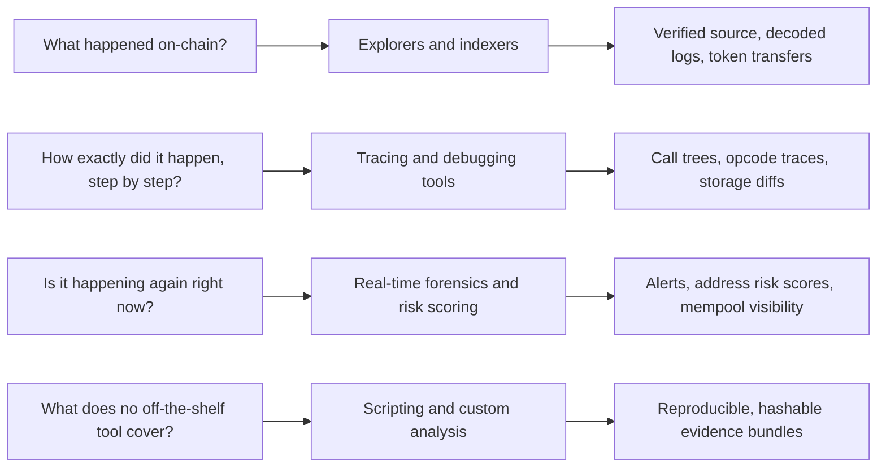
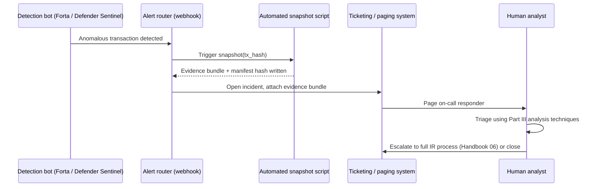

# Part V: Tooling and Automation

[Back to Handbook contents](index.md) | [Series index](../index.md)

Part V catalogs the concrete tools a responder reaches for once Parts II through IV have defined what to collect and how to reason about it, then shows how to wire those tools into scripts and pipelines so **evidence collection** survives a second incident without being reinvented from scratch. Nothing here replaces judgment: a decompiler surfaces bytecode and a risk score flags an address, but the analyst still decides what the evidence means. The chapters move from the individual tool (Chapter 19) to the repeatable process that turns a one-off investigation into a standing capability (Chapter 20).

---

## 19. Public and Open-Source Tools

The **EVM** forensic toolchain splits into four functions: reading what happened (explorers and indexers), reconstructing exactly how it happened (tracing and debugging), watching for it happening again in real time (risk scoring), and gluing the first three together with code you control (scripting). Part III's transaction and flow analysis chapter puts these tools to work inside a live investigation; this chapter is the reference catalog they draw from, and it feeds directly into [Appendix D](part6-appendices.md#24-appendix-d-tool-references-and-links).



*Figure 1. The forensic tool landscape organized by investigative question rather than by vendor. Each category answers a different question and produces a different class of evidence artifact.*

### 19.1 Explorers and Indexers

An explorer is usually the first tool a responder opens, because it turns raw remote procedure call (RPC) node output into something readable: verified source code, decoded event logs, a token transfer list, and an internal transaction tree assembled from the client's own trace engine. [Etherscan](https://etherscan.io) remains the default for Ethereum mainnet and maintains matching instances for most major **EVM** chains (Arbiscan, BscScan, Basescan, Polygonscan among them), plus a unified multichain search that lets a responder pivot across chains from one query. Its [API](https://docs.etherscan.io/) is the backbone of most automation described later in this Part, and a paid key raises the rate limit past what free-tier scripting hits during a fast-moving incident.

Not every chain has an Etherscan instance, and that is where [Blockscout](https://www.blockscout.com/) matters: it is open source ([GitHub](https://github.com/blockscout/blockscout)), self-hostable, and has become the default explorer for many L2s and app-specific chains that never signed an Etherscan deal. [Otterscan](https://otterscan.io/) solves a different problem. Built to run against an [Erigon](https://github.com/erigontech/erigon) archive node, it gives you a fully local, unlimited-history explorer with no query going to a third party, which matters when the address you are quietly watching is itself sensitive investigative context you do not want to leak through a public API's access logs. For flow analysis across thousands of transactions rather than one, [Dune Analytics](https://dune.com) exposes indexed chain data through SQL, and [The Graph](https://thegraph.com) lets you query structured historical events through a subgraph, both stepping past the block-range limits that a plain `eth_getLogs` call runs into on a busy contract.

| Tool | Type | Access | Best for |
|------|------|--------|----------|
| Etherscan (+ chain equivalents) | Hosted explorer and API | Free tier, paid API key | Fast triage, verified source, decoded events |
| Blockscout | Open source, self-hostable | Free (MIT) | Chains without a native Etherscan instance |
| Otterscan | Open source, self-hosted (Erigon) | Free, run locally | Query privacy, unlimited history, no rate limits |
| Dune Analytics | Hosted SQL over indexed chain data | Free tier, paid plans | Cross-transaction flow analysis, reusable dashboards |
| The Graph | Decentralized indexing (subgraphs) | Free, query fees | Structured historical event queries at scale |

### 19.2 Tracing and Debugging Tools

An explorer tells you a transaction reverted or moved value; a tracer tells you exactly which internal call, at which opcode, made it happen. [Tenderly](https://tenderly.co) offers both: a step debugger that walks a transaction opcode by opcode with the full stack and storage visible, and a fork feature that lets you replay the exact attack against a copy of mainnet state at the block before it hit, safely and repeatably. [BlockSec's Phalcon](https://blocksec.com) explorer renders the same kind of trace as a human-readable call tree with fund flow highlighted, which is often faster for a first read of an unfamiliar exploit than a raw opcode dump.

For a scriptable, local-first option, [Foundry](https://getfoundry.sh)'s `cast` and `anvil` ([GitHub](https://github.com/foundry-rs/foundry)) fork a chain at a specific block and replay a transaction against it:

```bash
# Fork mainnet at the block immediately before the exploit transaction
anvil --fork-url $RPC_URL --fork-block-number 18500000

# Replay the transaction and open Foundry's interactive opcode debugger
cast run 0xEXPLOIT_TX_HASH --rpc-url http://127.0.0.1:8545 --debug
```

Underneath most of these tools sits the same primitive: Geth's `debug` JSON-RPC namespace ([Geth docs](https://geth.ethereum.org/docs/interacting-with-geth/rpc/ns-debug)), which every major client (Geth, Erigon, Reth, Nethermind) implements in compatible form.

```json
{
  "jsonrpc": "2.0", "id": 1,
  "method": "debug_traceTransaction",
  "params": ["0xEXPLOIT_TX_HASH", {"tracer": "callTracer", "tracerConfig": {"onlyTopCall": false}}]
}
```

Pair `callTracer` (the nested call tree, with gas, input, and output at every frame) with `prestateTracer` (a dump of every account and storage slot the transaction touched *before* execution) to capture the exact pre-attack state referenced in [Part II, Section 4.2](part2-evidence-collection-and-preservation.md#42-contract-state-and-storage).

### 19.3 Real-Time Forensics and Risk Scoring (EVM-Specific)

Part III's real-time forensics and mempool monitoring section covers the methodology of watching an incident unfold; this section is the tool catalog behind it. [Forta Network](https://forta.org), originally built out of the OpenZeppelin security team before spinning out as an independent foundation, runs a decentralized network of detection bots that score transactions against known attack signatures across many **EVM** chains in real time and can be self-hosted or subscribed to. OpenZeppelin's hosted Defender platform historically paired Sentinel monitoring with Autotasks, but the company [retired Defender in favor of open-source tooling](https://www.openzeppelin.com/news/doubling-down-on-open-source-and-phasing-out-defender). Its successors are [OpenZeppelin Monitor](https://docs.openzeppelin.com/monitor), for condition-based on-chain monitoring and notifications, and [OpenZeppelin Relayer](https://docs.openzeppelin.com/relayer), for policy-controlled transaction submission and automation that teams operate within their own infrastructure.

On the compliance and **attribution** side, [Chainalysis](https://www.chainalysis.com) combines its graph-based Reactor investigation tool with a Know Your Transaction (KYT) API for real-time address risk scoring, and reportedly acquired the Web3 threat-detection firm Hexagate in 2024 to add pre-transaction simulation to that stack. [TRM Labs](https://www.trmlabs.com) and [Elliptic](https://www.elliptic.co) offer comparable wallet-screening and investigation tooling used widely by exchanges and incident responders. For maximal extractable value (MEV) and price-manipulation-specific forensics, [EigenPhi](https://eigenphi.io) labels sandwich attacks, arbitrage, and exploit transactions with dollar values in near real time, and [Blocknative](https://www.blocknative.com) and [Flashbots](https://docs.flashbots.net) provide mempool visibility that lets you see a pending attack before it lands, not just reconstruct it after.

| Tool | Category | Primary signal |
|------|----------|-----------------|
| Forta Network | Decentralized bot detection | Real-time transaction anomaly alerts |
| OpenZeppelin Monitor and Relayer | Monitoring and auto-response | Condition-based alerts and policy-controlled transaction automation |
| Chainalysis Reactor / KYT | Investigation and risk scoring | Address clustering, transaction risk score |
| TRM Labs, Elliptic | Blockchain intelligence | Wallet screening, sanctions exposure |
| EigenPhi | MEV and exploit analytics | Dollar-labeled arbitrage, sandwich, exploit txs |
| Blocknative, Flashbots | Mempool visibility | Pending-transaction alerting before inclusion |

### 19.4 Scripting and Custom Analysis

Off-the-shelf explorers and tracers cover a single transaction well; a multi-step, multi-contract exploit that unfolds across dozens of transactions and several blocks usually needs a script that stitches the pieces together, because no dashboard was built for your specific incident. Python with `web3.py` or JavaScript with `ethers.js` or `viem` are the common bases, calling the same RPC methods the explorers use under the hood but composed into a purpose-built pipeline.

Two recurring obstacles justify their own tools. First, attackers rarely verify their exploit contract's source, so you are reading raw bytecode. [heimdall-rs](https://github.com/Jon-Becker/heimdall-rs), a Rust-based **EVM** decompiler and calldata decoder, and [Dedaub](https://dedaub.com)'s decompiler and security suite both turn unverified bytecode back into readable pseudocode, and [evm.codes](https://www.evm.codes) is the opcode-and-gas-cost reference you keep open while reading the result by hand. Second, an unknown four-byte function selector in a trace is opaque until decoded; [4byte.directory](https://www.4byte.directory) and [OpenChain's signature database](https://openchain.xyz/signatures) crowdsource that mapping, and Foundry's `cast` calls it directly:

```bash
# Decode an unknown selector from a trace
cast 4byte 0x23b872dd
# -> transferFrom(address,address,uint256)

# Independently verify deployed bytecode against source, rather than trusting
# an explorer's verification checkmark alone
# see https://sourcify.dev
```

[Sourcify](https://sourcify.dev) is worth calling out specifically: it verifies bytecode against source through a decentralized, IPFS-backed process independent of any single explorer, and re-running that verification yourself is a cheap check against a compromised or stale explorer record.

---

## 20. Automation and Repeatability

Tools only produce usable evidence if the process around them survives a 3 a.m. page and a stressed responder. Automation turns an ad hoc investigation into a rehearsed capability: the same evidence bundle, collected the same way and hashed the same way, every time, which is what makes the output usable later in a legal or negotiation context per [Part I, Section 2.1](part1-foundations.md#21-evidence-admissibility-and-chain-of-custody).

### 20.1 Scripts for Common Analyses

The highest-value scripts are the ones you run in the first ten minutes of every incident, before analysis diverges by case. A minimal evidence-snapshot script wraps the RPC calls from Chapter 19 into one command, hashes every output file, and writes a manifest that timestamps the collection:

```bash
#!/usr/bin/env bash
set -euo pipefail
TX=$1; RPC=$2; OUT="evidence_${TX:0:10}_$(date -u +%Y%m%dT%H%M%SZ)"
mkdir -p "$OUT"

cast tx "$TX" --rpc-url "$RPC" > "$OUT/tx.json"
cast receipt "$TX" --rpc-url "$RPC" > "$OUT/receipt.json"
cast run "$TX" --rpc-url "$RPC" --quick > "$OUT/trace.txt"

BLOCK=$(cast tx "$TX" --rpc-url "$RPC" --json | jq -r '.blockNumber')
for ADDR in $(jq -r '.to, (.logs[]?.address)' "$OUT/receipt.json" | sort -u); do
  cast code "$ADDR" --rpc-url "$RPC" --block "$BLOCK" > "$OUT/code_${ADDR}.hex"
done

sha256sum "$OUT"/* > "$OUT/manifest.sha256"
echo "Snapshot written to $OUT, manifest hashed."
```

This script is deliberately narrow: it collects, it hashes, and it stops, in keeping with the evidence-first mindset of [Part I, Section 3.1](part1-foundations.md#31-collect-before-changing-state). Build a small library of these (a token-approval-flow extractor, a cross-contract call-graph walker, a bridge-message correlator) rather than one large tool, so a responder under pressure can reach for the one script that matches the question in front of them instead of learning a monolith's flags mid-incident.

### 20.2 Checklists for Consistent Evidence Collection

A script guarantees a command ran the same way twice; a checklist guarantees a human did not skip a step under pressure. Keep this short version at hand when kicking off a snapshot script, and treat the full version in [Appendix B](part6-appendices.md#22-appendix-b-evidence-collection-checklist) as the audit-ready reference:

- [ ] Confirm the RPC endpoint is an archive node (state at old blocks is unavailable on a pruned full node).
- [ ] Record the exact block number and timestamp before running any script, not after.
- [ ] Run the snapshot script and verify the manifest's hash count matches the file count.
- [ ] Store the output in write-once or otherwise tamper-evident storage per [Part II, Section 5.3](part2-evidence-collection-and-preservation.md#53-write-once-and-tamper-evident-storage).
- [ ] Log who ran the script, from which machine, and why, as a chain-of-custody entry.
- [ ] Re-verify contract bytecode against source independently (Sourcify or a second explorer) rather than trusting one verification badge.
- [ ] Note every tool version used (client version, `cast` version, tracer name) so results are reproducible later.

Consistency matters more than exhaustiveness here: a checklist that is actually followed every time beats a longer one that gets skipped on the incidents where time pressure is highest, which is exactly when the evidence matters most.

### 20.3 Integration with Incident Response Pipelines

Tooling delivers the most value when detection, **evidence collection**, and human escalation are wired together rather than triggered manually in sequence. A typical pipeline routes a Forta or Defender alert into a ticketing or paging system, fires an automated snapshot script the moment the alert lands (before anyone has read it), and only then hands the packaged evidence to a human, who decides whether to escalate into the fuller process owned by the **Incident Response** Handbook (06).



*Figure 2. An automated detection-to-triage pipeline. The snapshot fires before human triage begins, so the evidence exists even if the analyst is slow to respond, and the manifest hash from Section 20.1 travels with the ticket as its integrity proof.*

| Alert source | Automated action | Escalation trigger |
|---------------|------------------|---------------------|
| Forta bot finding | Run snapshot script, open ticket | Any Critical or High severity finding |
| Defender Sentinel condition | Run snapshot script, optional Autotask pause | Contract balance or supply moves past threshold |
| Chainalysis/TRM risk alert | Log address, no auto-pause | Sanctioned or high-risk counterparty match |
| Manual analyst report | Run snapshot script on demand | Any suspected active exploit |

Keep the automated leg conservative: auto-pausing a contract is powerful but not free, since a false positive that halts a live protocol is its own incident, so reserve auto-response for high-confidence signals (a known drain signature, a supply invariant broken) and default to alert-plus-snapshot for everything else, leaving the pause decision to a human who can weigh the false-positive cost in seconds rather than in a postmortem.

---

**Key controls for Part 5**

- Run explorers and tracers you control (Otterscan, a forked Foundry `anvil` instance) alongside hosted ones, so an active investigation never leaks its query pattern to a third party.
- Capture both `callTracer` and `prestateTracer` output for every exploit transaction to fix the exact pre-attack state, not just the call sequence.
- Independently re-verify bytecode against source (Sourcify or a second explorer) rather than trusting a single verification badge.
- **Script the first ten minutes of every incident:** snapshot, hash, manifest, before analysis diverges by case.
- Wire detection tools (Forta, Defender Sentinel) to fire an automated evidence snapshot before human triage begins, and reserve automated response actions for high-confidence signals only.
