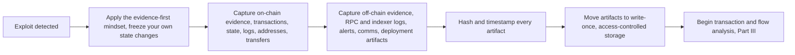
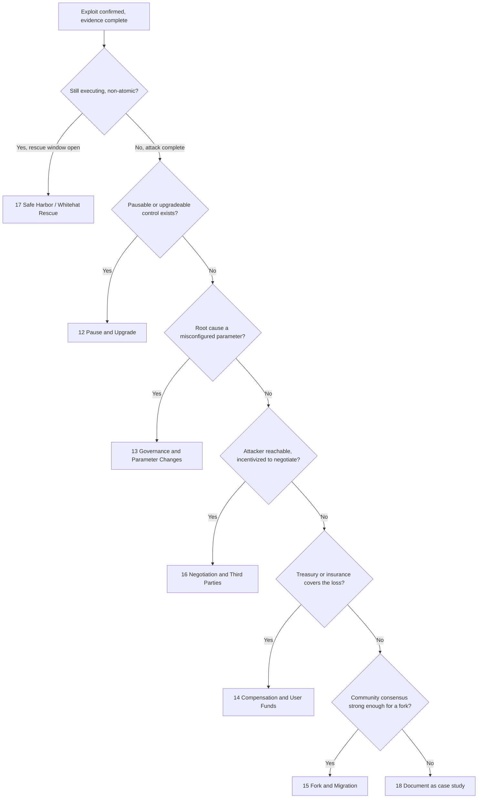

# Part 6: Appendices

[Back to Handbook contents](index.md) | [Series index](../index.md)

This part collects the reference material the rest of the handbook assumes you have on hand during an actual incident, when there is no time to hunt through six parts for a definition or a checklist. Appendix A fixes the vocabulary spanning forensics, on-chain analysis, and **recovery** law. Appendix B turns the evidence discipline from Parts I and II into a checklist you run the moment an exploit is confirmed. Appendix C compares the six recovery patterns from Part IV, Appendix D indexes the tools named throughout Parts III and V, and Appendix E names the research the four-tier framework and the bridge/oracle taxonomies draw from, then points to the full bibliography.

---

## 21. Appendix A: Glossary

Entries are grouped by where the term does the most work in the incident lifecycle, not strict alphabetical order, since a responder pulling evidence at hour one and a governance lead negotiating **recovery** in week three reach for different vocabulary. Within each group, entries run alphabetically, acronyms expand on first appearance, and each entry names the fuller chapter treatment.

### 21.1 Forensics, Evidence, and Legal Terms

- **Admissibility**: the standard evidence must meet before a court accepts it. Electronic evidence self-authenticates under [FRE 902(13) and 902(14)](https://www.law.cornell.edu/rules/fre/rule_902), covering system-generated records and hash-verified copies. Chapter 2.1.
- **Chain of custody**: the unbroken, documented record of who collected an item of evidence, when, and who has held it since, proving the artifact in hand was not altered. Chapter 2.1.
- **Digital forensics**: identifying, preserving, analyzing, and presenting digital evidence, formalized for responders in [NIST SP 800-86](https://csrc.nist.gov/pubs/sp/800/86/final) (2006). Chapter 1.1.
- **Evidence-first mindset**: capturing and hashing evidence before taking any action that could change the state you are trying to document. Chapter 3.1.
- **Mutual Legal Assistance Treaty (MLAT)**: a state-to-state agreement for exchanging evidence in criminal matters, the usual, slow path for compelling an offshore exchange to freeze an account. Chapter 2.3.
- **Responsible disclosure**: privately reporting a vulnerability or an active exploit's details to the affected project only, timed to avoid tipping off the threat actor. Chapter 2.4.
- **Write-once, tamper-evident storage**: a Write Once Read Many (WORM) configuration or append-only ledger preventing an already-written record from being silently modified. Chapter 5.3.

### 21.2 On-Chain Evidence and Analysis Terms

- **Address clustering**: a heuristic grouping addresses as likely controlled by one entity, from signals such as shared funding, co-spending, or shared infrastructure. Chapter 9.1.
- **Archive node**: a full node retaining complete historical state for every block rather than pruning it, required for a balance, call, or trace query against an arbitrary past block. Chapter 4.2.
- **Call tracer**: a `debug_traceTransaction` mode returning a transaction's internal call tree, every `CALL`, `DELEGATECALL`, `STATICCALL`, and `CREATE`, instead of a raw opcode log. See the [Geth debug namespace](https://geth.ethereum.org/docs/interacting-with-geth/rpc/ns-debug), Chapter 7.1.
- **Externally Owned Account (EOA)**: an account controlled by a **private key**, the only account type able to originate a transaction; distinguishing it from a contract account tells you whether you chase a key or a program. Chapter 4.4.
- **Finality**: the point past which a block is guaranteed not to be reverted by a reorganization, past which citing "block N" stops being ambiguous. Chapter 3.2.
- **Internal transaction**: a value transfer or call made by contract code during a top-level transaction, never independently broadcast, visible only by tracing that transaction. Chapter 4.3.
- **Tactics, Techniques, and Procedures (TTP)**: a threat actor's reusable behavioral fingerprint, tool choices, mixer habits, timing, deployment style, used to link unconnected exploits to one operator. Chapter 9.2.

### 21.3 Root Cause and Vulnerability Terms

- **Four-tier root cause framework**: exploit causes classified as protocol logic flaws (Tier 1), lifecycle and governance issues (Tier 2), external dependencies (Tier 3), and classic implementation bugs (Tier 4). Chapter 1.5, Section 25.1.1.
- **Access control flaw**: a function that should be role-restricted but is missing, or misapplies, that check, letting an unauthorized caller execute privileged logic. Chapter 8.3.
- **Flash loan**: an uncollateralized loan borrowed and repaid within one transaction; not itself a vulnerability, but the enabler letting an attacker briefly command capital enough to move a price or a vote. Chapter 8.5.
- **Invariant**: a property a protocol assumes always holds, supply equal to the sum of balances, a pool's constant-product relationship, whose violation often signals an in-progress exploit. Chapter 8.4.
- **Oracle manipulation**: distorting the price or data feed a contract relies on, by moving a thin pool an oracle reads directly or exploiting a feed update's timing. Chapter 8.5.
- **Reentrancy**: a contract making an external call before finalizing its own state, letting the called contract call back in and execute the original function again against stale state. Chapter 8.3.
- **SCWE / SCSVS**: OWASP's Smart Contract Weakness Enumeration (150+ classes) and companion Security Verification Standard (eleven control categories), mapping a root cause to the control that should have prevented it. See [scs.owasp.org](https://scs.owasp.org/).

### 21.4 Bridge, Cross-Chain, and Multi-Chain Terms

- **Atomic execution**: a transaction, or bundled set, completing entirely or reverting entirely, leaving no window between an exploit's trigger and completion for a defender to act. Chapter 10.2.
- **Cross-chain bridge**: infrastructure moving an asset or message between incompatible chains, typically locking or burning on the source chain and minting or releasing on the destination. Chapter 10.1.
- **Layer 2 (L2)**: a chain executing transactions off the base layer and periodically committing state or proofs back to it, inheriting some of that layer's security. Chapter 10.4.
- **Lock-and-mint bridge**: a design locking the source asset and minting a wrapped, IOU-style token on the destination, redeemed by burning it to unlock the original. Chapter 10.1.
- **Real-time forensics**: monitoring live chain data, pending mempool transactions and fresh blocks, to detect or interrupt an exploit while still in progress. Chapters 10.5, 19.3.
- **Rescue window**: for a non-atomic attack, the interval between the first observable transaction and final extraction, during which a fast responder can pause or front-run to blunt the loss. Chapter 10.2.1.
- **Validator trust model**: the parties, fixed **multisig**, rotating validator set, light client, whose attestations a bridge accepts as proof of a source-chain event, its real security boundary. Chapter 10.1.1.

### 21.5 DeFi Recovery and Governance Terms

- **Multisignature (multisig) wallet**: a contract account requiring a threshold of independent signers, the standard custody model for a treasury or admin key and a precondition for most **recovery** patterns. Chapter 13.1.
- **Pausable contract**: a contract with a circuit-breaker modifier a privileged role can trigger to halt functions, typically deposits and withdrawals, during an incident. Chapter 12.1.
- **Safe Harbor Agreement**: a legal and on-chain framework from the Security Alliance (SEAL) under which a protocol pre-authorizes whitehat rescue within defined terms, recorded in an on-chain registry before any incident. See the [SEAL Safe Harbor repository](https://github.com/security-alliance/safe-harbor), Chapter 17.1.
- **Social or state fork**: deploying a new version of the protocol, in the extreme a new chain, that excludes exploited state, coordinated as governance and communications, not a code fix alone. Chapter 15.1.
- **Timelock**: a contract enforcing a mandatory delay between a governance action being queued and executed, giving holders a window to react before it takes effect. Chapter 13.1.
- **Treasury**: a protocol's own reserve under governance or **multisig** control, one possible, not guaranteed, source for compensating users. Chapter 14.2.
- **Upgradeable proxy**: a fixed proxy address delegating logic to a replaceable implementation contract, letting a protocol ship a fix without migrating every user. Chapter 12.1.
- **Whitehat rescue**: an unsolicited but well-intentioned intervention during an active exploit, moving at-risk funds to safety using the same vulnerability an attacker is exploiting. Chapter 17.1.

---

## 22. Appendix B: Evidence Collection Checklist

Run this checklist the moment an exploit is confirmed, not once it is fully understood; evidence uncaptured in the first hour is often gone by the second. It operationalizes the collection duties in Chapters 4 through 6 and pairs with the general triage process in the **Incident Response** Handbook (06).

*Figure 1. The evidence collection sequence. Skipping a stage to save time usually costs more time later reconstructing what was lost.*

### 22.1 Immediate Capture Checklist (First Hour)

The first hour sets the ceiling on everything an investigation can later prove. Before touching an admin key, pausing a contract, or posting a public statement, get the exploit transaction hash, the affected addresses, and a screenshot of the public narrative on record. Every minute spent debating the response before that baseline exists is a minute an attacker cleaning a trail can erase first.

**Immediate Capture Checklist**

- [ ] Record the exploit transaction hash(es) and block number(s) as soon as identified
- [ ] Take a timestamped screenshot of the first public report (Twitter/X, Discord, forum)
- [ ] Do NOT interact with attacker-controlled or exploited contracts before evidence is captured
- [ ] Notify the **incident response** lead and legal counsel per Chapter 2.3
- [ ] Start a running, timestamped incident log (Chapter 6.3) before any other action
- [ ] If a pause or emergency action is warranted, capture pre-action state first (Chapter 3.1)

### 22.2 On-Chain Evidence Checklist

**On-chain evidence** does not disappear, but the convenience of pulling it does: rate-limited APIs, pruning nodes, and explorer schema changes can make a query harder tomorrow than today. Pull broadly before you know exactly what you need; a full receipt and trace costs little to store and much to reconstruct later from memory.

**On-Chain Evidence Checklist**

- [ ] Transaction data: hash, block, input calldata, value, gas (Chapter 4.1)
- [ ] Full internal call trace via debug_traceTransaction / callTracer (Chapter 4.1, 7.1)
- [ ] Contract state and storage slots at the block before and after the exploit (Chapter 4.2)
- [ ] Complete event log and internal transaction list for every affected contract (Chapter 4.3)
- [ ] Every EOA and contract address involved, labeled by role (Chapter 4.4)
- [ ] Token transfer and approval history for affected tokens (Chapter 4.5)
- [ ] Cross-chain or bridge-relayed messages, if applicable (Chapter 4.6, Chapter 10.1)
- [ ] Verified source code and ABI (or decompiled bytecode if unverified) for every contract

### 22.3 Off-Chain, Preservation, and Chain-of-Custody Checklist

On-chain data proves what happened; off-chain data proves what the team knew and when. Capture both: a later reconstruction, an insurance claim, a law enforcement referral, a post-mortem, depends on showing the response's timeline and diligence, not just the exploit's mechanics.

**Off-Chain and Preservation Checklist**

- [ ] RPC, indexer, and front-end logs covering the incident window (Chapter 6.1)
- [ ] Monitoring and alert system outputs, including any missed or late alerts (Chapter 6.2)
- [ ] Internal and external communications with timestamps (Chapter 6.3)
- [ ] Deployment artifacts: build hashes, verified compiler settings, deployment scripts (Chapter 6.4)
- [ ] SHA-256 hash of every exported artifact, recorded alongside the artifact itself (Chapter 5.2)
- [ ] All artifacts moved to write-once, access-controlled storage with a documented retention policy (Chapter 5.3, 5.4)
- [ ] Chain-of-custody log started: who collected what, when, and where it is stored (Chapter 2.1)

---

## 23. Appendix C: Recovery Pattern Summary Table

The six **recovery** patterns in Part IV are not mutually exclusive or equally available: a protocol without a pre-adopted Safe Harbor agreement cannot retroactively grant one, and a fork rarely suits a loss a treasury can absorb outright. Use the decision flow to find a starting pattern, then the table for what it actually requires.

*Figure 2. Recovery pattern selection by incident characteristic. Most incidents apply more than one branch in sequence: a pause (12) buys time to negotiate (16), which buys time to plan compensation (14).*

| # | Pattern | Ch. | Prerequisite | Timeline | Governance | Primary Risk | Precedent |
|---|---------|-----|---------------|----------|------------|---------------|-----------|
| 1 | Pause and Upgrade | 12 | Upgradeable proxy or pausable modifier already deployed | Minutes to pause; weeks for a verified upgrade | Admin key or timelock-gated pauser role | Pause key is itself a centralization/rug-pull surface |  |
| 2 | Governance and Parameter Changes | 13 | Root cause is a misconfigured parameter, not a code defect | Hours via emergency multisig; days via timelock vote | Multisig or DAO vote via timelock | Rushed emergency votes bypass normal review |  |
| 3 | Compensation and User Funds | 14 | Treasury or insurance capital sufficient to cover the loss | Weeks to identify users and distribute | Treasury release needs governance/multisig approval | Distribution-fairness disputes; tax/securities exposure varies | Sky Mavis reimbursed users after the March 2022 Ronin hack |
| 4 | Fork and Migration | 15 | Loss and alignment large enough to exclude exploited state | Weeks to months | Broad community and validator/miner consensus | Splits the community and the asset |  |
| 5 | Negotiation and Third Parties | 16 | Attacker reachable, incentivized to negotiate over prosecution risk | Days to weeks | Team or counsel authorizes bounty terms | Normalizes theft-then-bounty as a model | [Poly Network](https://en.wikipedia.org/wiki/Poly_Network_exploit) (Aug 2021, ~$611M, recovered by Aug 25); [Euler](https://rekt.news/euler-rekt/) (Mar 2023, ~$197M) |
| 6 | Safe Harbor and Whitehat Recovery | 17 | Protocol pre-adopted a Safe Harbor agreement | Real time, during the exploit | On-chain registry adoption, decided in advance | Does not shield a rescuer from every jurisdiction's law | [SEAL Safe Harbor](https://github.com/security-alliance/safe-harbor) registry |
| 7 | Other Patterns and Case Studies | 18 | Hybrid or novel responses outside the six patterns above | Varies | Varies | Varies | See Chapter 18.1 |

---

## 24. Appendix D: Tool References and Links

The tools below are the working set referenced across Chapters 7, 9, 16, 17, and 19. None substitutes for the methodology in those chapters, but each removes hours of manual work from a step. Prefer tools that expose raw, exportable data (a JSON trace, a CSV of transfers) over ones that only render a dashboard, since raw exports go into your evidence archive (Chapter 5).

| Tool | Category | Primary Use | Chapter | Link |
|------|----------|-------------|---------|------|
| Etherscan (V2 API) | Explorer / Indexer | Verified source, ABI decoding, multi-chain queries under one key | 4.1, 19.1 | [etherscan.io](https://etherscan.io/) |
| Blockscout | Explorer / Indexer | Open-source explorer, common default for L2s and alt-EVM chains | 10.4, 19.1 | [blockscout.com](https://www.blockscout.com/) |
| Dune Analytics | Explorer / Indexer | SQL-queryable indexed data, custom fund-flow dashboards | 7.3, 19.1 | [dune.com](https://dune.com/) |
| Tenderly | Tracing / Debugging | Simulation, mainnet forking, call-tree debugger | 7.4, 8.6 | [tenderly.co](https://tenderly.co/) |
| Foundry (cast, anvil) | Tracing / Debugging | CLI forking, tracing, scripted exploit reproduction | 8.6, 19.4 | [book.getfoundry.sh](https://book.getfoundry.sh/) |
| BlockSec Phalcon | Tracing / Debugging | Trace explorer with visual fund-flow mapping | 7.1, 19.2 | [phalcon.blocksec.com](https://phalcon.blocksec.com/) |
| Forta Network | Real-Time Forensics | Decentralized real-time threat-detection bots | 10.5, 19.3 | [forta.org](https://forta.org/) |
| OpenZeppelin Monitor and Relayer | Real-Time Forensics | Self-hosted monitoring, notifications, and on-chain response automation | 10.5, 20.3 | [OpenZeppelin Monitor](https://docs.openzeppelin.com/monitor) |
| Chainalysis Reactor | Attribution / Compliance | Address clustering, attribution investigation | 9.1, 9.3 | [chainalysis.com](https://www.chainalysis.com/) |
| TRM Labs | Attribution / Compliance | Blockchain intelligence, sanctions screening | 9.1, 9.3 | [trmlabs.com](https://www.trmlabs.com/) |
| Arkham Intelligence | Attribution / Compliance | Intelligence platform, crowd-sourced entity labels | 9.1, 9.4 | [intel.arkm.com](https://intel.arkm.com/) |
| SlowMist MistTrack | Attribution / Compliance | Address tracing and fund-flow tracking | 9.1, 10.3 | [misttrack.io](https://misttrack.io/) |
| 4byte.directory | Signature Recovery | Public function-selector signature database | 4.1, 7.1 | [4byte.directory](https://www.4byte.directory/) |
| OpenChain | Signature Recovery | Crowd-sourced selector/event signature lookup | 4.1, 7.1 | [openchain.xyz](https://openchain.xyz/) |
| Dedaub | Signature Recovery | Decompiler and security suite for unverified bytecode | 6.4, 8.1 | [dedaub.com](https://dedaub.com/) |
| Sourcify | Signature Recovery | Decentralized source verification, metadata matching | 6.4 | [sourcify.dev](https://sourcify.dev/) |
| SEAL 911 | Recovery / Coordination | Emergency responder directory for whitehat rescuers | 16.1, 17.1 | [security-alliance.org](https://www.security-alliance.org/) |
| Immunefi | Recovery / Coordination | Bug bounty platform, also broadcasts bounty/negotiation terms | 16.1 | [immunefi.com](https://immunefi.com/) |

---

## 25. Appendix E: References and Further Reading

### 25.1 Research and Standards

The four-tier framework in Chapter 1.5 and the bridge/oracle taxonomies in Chapters 8 and 10 are not this handbook's invention; they synthesize systematic literature, post-mortem data, and named incident reporting. This section names the specific research drawn on; the full citation list lives in `references.md`, described below.

#### 25.1.1 Four-Tier Root Cause and Exploit-Chain Literature

The clearest academic anchor for a systematic DeFi root cause taxonomy is [Zhou et al., "SoK: Decentralized Finance (DeFi) Attacks"](https://arxiv.org/abs/2208.13035) (IEEE S&P, 2023), built from 77 papers, 30 audit reports, and 181 real-world incidents. It found price oracle attacks and permissionless-interaction abuse the most frequent categories, ahead of the code-level bugs earlier surveys emphasized, justifying this handbook's treatment of Tier 3 (external dependencies) as first-class rather than a footnote to Tier 4. The exploit-chain framing in Chapter 1.5.6 reflects the same paper's finding that academic and practitioner models diverge most on multi-step compound attacks, the category single-function audits catch least. OWASP's [Smart Contract Weakness Enumeration](https://scs.owasp.org/) supplies the taxonomy Chapter 8.2 maps Tier 4 findings against.

#### 25.1.2 Bridge and Oracle Attack Taxonomies

Bridges get dedicated treatment in Chapter 10 because the record justifies it: [Chainalysis's 2022 analysis](https://www.chainalysis.com/blog/cross-chain-bridge-hacks-2022/) found thirteen bridge hacks had accounted for roughly $2 billion in losses by August 2022, 69% of that year's stolen funds, making bridges DeFi's largest structural loss category. [Lee, Murashkin, Derka, and Gorzny, "SoK: Not Quite Water Under the Bridge"](https://arxiv.org/abs/2210.16209) supplies the architectural breakdown behind Chapter 10.1.1's validator-trust-model framing, decomposing a bridge into its lock/mint mechanism, relay layer, and validation logic, and showing most major hacks targeted validation, not token custody. Oracle manipulation (Chapter 8.5) draws on the same Zhou et al. taxonomy above; both attack classes compromise a value a contract trusts without independently re-deriving it.

#### 25.1.3 Real-World Incident RCAs and Forensic Reports

Case-level grounding draws on public root-cause analyses (RCAs) and incident journalism, not secondhand summaries. [rekt.news](https://rekt.news/) functions as a standing incident wire, publishing technical post-mortems within days of major exploits, including the [Euler Finance hack](https://rekt.news/euler-rekt/) of March 2023. Where a project publishes its own post-mortem, this handbook prefers that primary source, supplemented by independently verified reporting such as the [Wikipedia record](https://en.wikipedia.org/wiki/Ronin_Network) of the FBI's April 2022 **attribution** of the Ronin Bridge hack to the Lazarus Group. The [Poly Network exploit](https://en.wikipedia.org/wiki/Poly_Network_exploit) of August 2021 recurs in Chapter 16 as the reference case for attacker negotiation: its full timeline, from theft to **recovery** fourteen days later, is unusually well documented on-chain and in contemporaneous reporting. Chapter 18.1's case catalog names further incidents, each linking its own primary RCA.

---

`references.md` collects every citation from all six parts into one deduplicated bibliography: Standards and Frameworks (OWASP SCSVS, SCSTG, SCWE; NIST SP 800-86; the Federal Rules of Evidence; MITRE [ATT&CK](https://attack.mitre.org/) and [AADAPT](https://www.mitre.org/news-insights/fact-sheet/aadapt-cyber-threat-framework-digital-assets)), Incidents and Case Studies (Poly Network, Ronin Bridge, Euler Finance, Chapter 18.1's catalog), Tools (Appendix D plus Part V), and Further Reading (Section 25.1's literature). If a link goes stale, check there before assuming the claim no longer holds. Add each new source in the same change that cites it.

---

**Key controls for Part 6**

- Treat Appendix A (21) as the canonical vocabulary; link to it from tickets and post-mortems instead of redefining a term each time.
- Run the immediate capture checklist (22.1) within the first hour of any confirmed exploit, before any pause, upgrade, or public statement.
- Keep the evidence checklists (22.2, 22.3) synchronized with the collection guidance in Chapters 4 through 6.
- Walk the recovery pattern decision flow (23) before committing to a fork, negotiation, or compensation plan; most incidents combine patterns in sequence.
- Pre-adopt a Safe Harbor agreement (24, 17) before an incident, not during one; it only protects rescue activity registered in advance.
- Add every new citation to `references.md` in the same change that introduces it (25).
