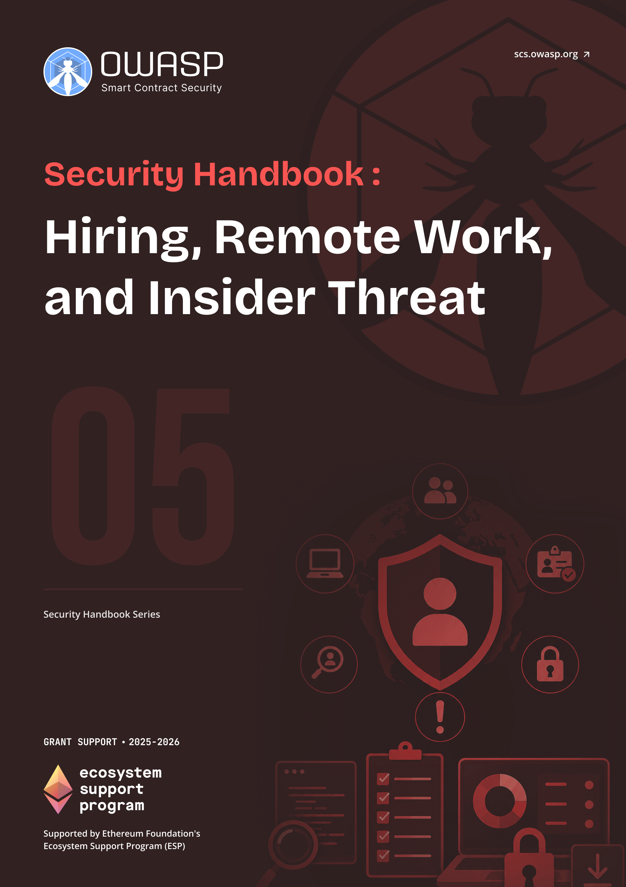

# OWASP SCS Hiring, Remote Work, and Insider Threat Handbook

  
  

    <a class="handbook-series-link" href="../">← All handbooks</a>
    
Handbook 05 · 86 PDF pages

    
Reduce fraudulent hiring and insider risk with identity assurance, staged access, remote-work controls, detection, and response.

    

      <a href="../pdfs/05-hiring-remote-insider-dprk.pdf" target="_blank" rel="noopener">Open PDF</a>
      <a href="../pdfs/05-hiring-remote-insider-dprk.pdf" download>Download PDF</a>
    

  

**OWASP Smart Contract Security Project**

Part of the [OWASP SCS Handbook Series](../index.md). Built to the series [conventions](../index.md#about-the-series).

## Purpose and Scope

This handbook gives hiring, remote work, and vendor management guidance for Web3 and crypto-native organizations facing a specific and now well-documented threat: state-sponsored IT worker fraud. The guidance follows published advisories from the Federal Bureau of Investigation (FBI), the Cybersecurity and Infrastructure Security Agency (CISA), and the FBI's Internet Crime Complaint Center (IC3) describing how operatives linked to the Democratic People's Republic of Korea (**DPRK**) obtain remote developer and IT roles at Western companies, then use that access for data extortion, source code theft, credential harvesting, and sanctions-evasion revenue generation. The same infrastructure of fabricated identities, laptop farms, and complicit facilitators supports insider-threat actors beyond a single nation-state, so the controls here generalize past the DPRK case that motivates them.

The scope runs from the job posting to the exit interview and beyond it: recruitment channel hygiene, **identity verification** for remote hires, red flags visible during interviews and background checks, vendor and contractor due diligence, least-privilege access design for distributed teams, and the detection and response playbooks an organization needs once a hire is suspected of being compromised or malicious. It does not restate general operational security practice covered elsewhere in the series; it applies that practice to the specific moment a threat actor first receives a badge, a laptop, or a commit token.

## Target Audience

HR and talent acquisition teams, security and IT leadership, hiring managers, and vendor management staff at Web3 and crypto-native organizations. The chapters split along these lines: HR and hiring managers own Parts II and III, security teams own Part IV, and leadership owns the policy and training work in Part V.

## How to Use This Handbook

Read Part I first regardless of role: it sets the threat context that makes every later control legible, including how DPRK-linked IT workers operate and why their tactics differ from a typical fraudulent applicant. Hiring managers and HR staff working an active requisition should move to Parts II and III for the sourcing, interview, verification, and remote-onboarding controls that apply before and during a hire. Security and **incident response** staff should jump to Part IV when a hire is already suspected. Part V holds the policy templates and training material leadership needs to institutionalize the program, and Part VI collects the glossary, indicator summary, and checklist for quick reference during a live decision.

## Relationship to SCSVS, SCSTG, and SCWE

This handbook sits upstream of the OWASP smart contract standards rather than inside them: its subject is the person who writes or reviews the code, not the code itself. The Smart Contract Security Verification Standard (SCSVS) and the Smart Contract Weakness Enumeration (SCWE) assume a codebase already exists to verify or catalog; the controls here reduce the odds that a hostile actor sits inside the team producing that codebase, a precondition neither standard otherwise addresses. The Smart Contract Security Testing Guide (SCSTG) tests what ships; nothing in that guide catches a developer who deliberately plants a vulnerability designed to pass every test. This handbook is closest in scope to the Employee Lifecycle Security Handbook (03), which owns onboarding, access provisioning, and offboarding mechanics once someone is hired, and the **Incident Response** Handbook (06), whose playbooks this handbook's Part IV extends for the specific case of a compromised or malicious hire.

## Contents

**Part I: Foundations**
- [1. Introduction to Hiring and Remote Work Security](part1-foundations.md#1-introduction-to-hiring-and-remote-work-security)
- [2. Threat Context: DPRK and Similar Vectors](part1-foundations.md#2-threat-context-dprk-and-similar-vectors)

**Part II: Hiring Security**
- [3. Job Posting and Sourcing](part2-hiring-security.md#3-job-posting-and-sourcing)
- [4. Interview and Assessment](part2-hiring-security.md#4-interview-and-assessment)
- [5. Vendor and Contractor Selection](part2-hiring-security.md#5-vendor-and-contractor-selection)
- [6. Background and Verification (Legal and Practical)](part2-hiring-security.md#6-background-and-verification-legal-and-practical)

**Part III: Remote Work and Overseas Consultation**
- [7. Remote Work Security](part3-remote-work-and-overseas.md#7-remote-work-security)
- [8. Overseas Consultation and Distributed Teams](part3-remote-work-and-overseas.md#8-overseas-consultation-and-distributed-teams)
- [9. After Hire: Post-Hire Behavior and Monitoring](part3-remote-work-and-overseas.md#9-after-hire-post-hire-behavior-and-monitoring)
- [10. Ongoing Monitoring and Offboarding](part3-remote-work-and-overseas.md#10-ongoing-monitoring-and-offboarding)
- [11. Mitigating Insider Threat Actors](part3-remote-work-and-overseas.md#11-mitigating-insider-threat-actors)

**Part IV: Detection and Response**
- [12. Recognizing Potential Compromise](part4-detection-and-response.md#12-recognizing-potential-compromise)
- [13. Response Playbook: Suspected Insider or Compromised Hire](part4-detection-and-response.md#13-response-playbook-suspected-insider-or-compromised-hire)
- [14. Response Playbook: Malware or Phishing Linked to Hire/Vendor](part4-detection-and-response.md#14-response-playbook-malware-or-phishing-linked-to-hirevendor)

**Part V: Hardening and Best Practices**
- [15. Organizational Defenses](part5-hardening-and-best-practices.md#15-organizational-defenses)
- [16. Training for Hiring Managers and HR](part5-hardening-and-best-practices.md#16-training-for-hiring-managers-and-hr)
- [17. Policy Templates and Checklist](part5-hardening-and-best-practices.md#17-policy-templates-and-checklist)
- [18. References to External Advisories and Resources](part5-hardening-and-best-practices.md#18-references-to-external-advisories-and-resources)

**Part VI: Appendices**
- [19. Appendix A: Glossary](part6-appendices.md#19-appendix-a-glossary)
- [20. Appendix B: Red Flags and Indicators (Summary)](part6-appendices.md#20-appendix-b-red-flags-and-indicators-summary)
- [21. Appendix C: Hiring and Vendor Security Checklist](part6-appendices.md#21-appendix-c-hiring-and-vendor-security-checklist)
- [22. Appendix D: References, Advisories, and Further Reading](references.md)
