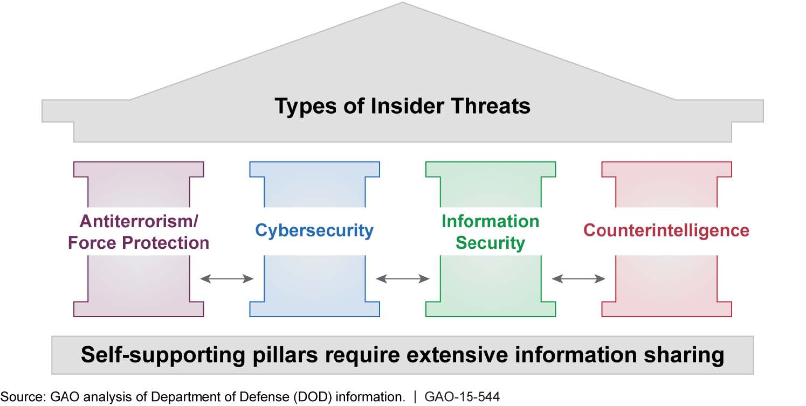
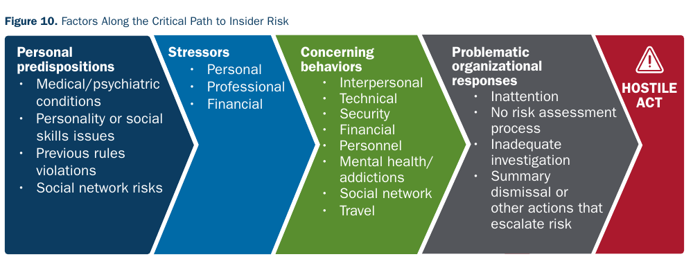
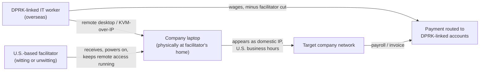
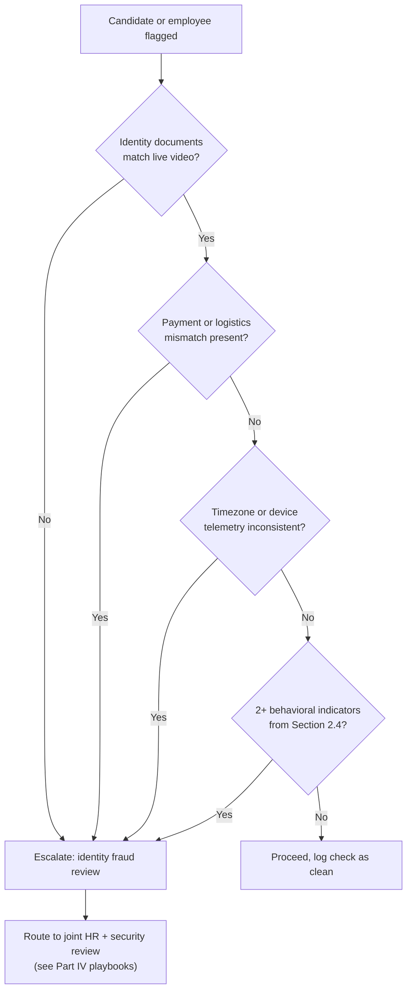

# Part 1: Foundations

[Back to Handbook contents](index.md) | [Series index](../index.md)

This part sets the vocabulary and **threat model** the rest of the handbook builds on: what makes hiring and **vendor security** a distinct control surface in Web3, and what the fraudulent-IT-worker threat tied to the Democratic People's Republic of Korea (DPRK) looks like in enough operational detail to recognize before a badge or a signer key is issued. It draws on U.S. law enforcement and Treasury advisories, threat-intelligence tracking of the specific actor cluster, and documented enforcement cases to ground the guidance that Parts II through VI turn into hiring, vendor, and monitoring controls.

---

## 1. Introduction to Hiring and Remote Work Security

Hiring is rarely modeled as an **attack surface**, yet in a Web3 organization it grants access that a phishing campaign or a dependency compromise would otherwise have to fight for. This chapter frames why that matters and how the handbook is organized to address it.

### 1.1 Why Hiring and Vendor Security Matter in Web3

Most Web3 organizations hire the way a five-person startup hires: fast, remote-first, and heavy on contractors sourced through Upwork, Toptal, referral chains, and Discord or Telegram job boards rather than a formal applicant-tracking process with a background-check vendor attached. That speed is a competitive necessity in a market where a smart contract team can go from funding to mainnet in weeks, but it collapses the friction that would otherwise slow a fraudulent applicant down: **identity verification**, reference checks, and a security team with the headcount to review who is being granted a **multisig** signer slot before the grant happens. A single senior engineering hire can, within weeks, end up holding a private key, a treasury multisig cosigner slot, or commit access to the contracts holding user funds. Nowhere else in mainstream software does one hiring decision route so directly to irreversible loss.

The Munchables incident makes the stakes concrete. In March 2024, the Blast-network game Munchables was drained of roughly $62 million after an exploit traced to a backdoor in code written by a developer the team had employed for months under a pseudonym. On-chain investigation, including work by the pseudonymous investigator [ZachXBT](https://x.com/zachxbt), linked the developer's wallet activity to the North Korean IT-worker cluster tracked across the industry; the funds were ultimately returned voluntarily rather than recovered by force, which is not something a defender can plan a control around. The lesson generalizes past this one project: a hiring decision is now a security decision with the same **blast radius** as a smart contract bug.

Vendor risk compounds this. Crypto-native firms routinely subcontract development, audit remediation, or IT support to overseas shops sourced through the same freelance marketplaces the direct-hire fraud exploits, so the threat does not stop at the org chart's edge. It extends through every staffing agency and dev shop holding a badge to your repository.

### 1.2 Insider Threat and Supply-of-Labor Risks

**Insider threat** is usually taught as two categories: the malicious insider who intends harm, and the negligent insider who causes harm by mistake. The **DPRK** IT-worker scheme adds a third category that traditional insider-threat programs are not built to catch: an insider whose entire identity, resume, and interview performance is fabricated from the start, so there is no "trusted employee turns bad" moment to detect. The malice is present on day one; only the access is missing, and hiring is the control that grants it.

Frame this as a supply-of-labor problem, parallel to the **software supply chain** covered elsewhere in this series. Just as a compromised npm package or a hijacked content delivery network (CDN) can inject attacker code into a product a team never wrote, a compromised hiring or staffing channel can inject an attacker directly into the team that writes the product. Each hop in the labor pipeline, a job board, a recruiter, a staffing agency, a freelance marketplace, a subcontracted dev shop, is a place where identity can be laundered the same way a malicious package launders itself through a registry.

| Insider category | Intent | Typical access path | Example |
|---|---|---|---|
| State-sponsored operative | Deliberate from hire | Direct full-time or contract hire | DPRK IT worker under fabricated identity |
| Financially coerced insider | Acquired after hire | Existing legitimate employee | Extortion following termination |
| Witting facilitator | Deliberate, non-technical role | Domestic proxy for overseas operative | "Laptop farm" operator |
| Unwitting facilitator | None (victim of a separate scam) | Believes role is legitimate remote work | Recruited via fake "package reshipping" job |
| Ordinary negligent insider | None | Legitimate employee, poor judgment | Credential reuse, phishing victim |

*Figure. A U.S. Government Accountability Office graphic breaking down the threat categories a mature insider-threat program has to cover; the DPRK IT worker case in the table above is the state-sponsored-operative slice of this broader taxonomy. Source: [U.S. GAO, GAO-15-544](https://commons.wikimedia.org/wiki/File:Figure_2-_Types_of_Threats_Included_in_the_Department_of_Defense%27s_Insider-Threat_Program_(19077934340).jpg), public domain (U.S. federal government work).*

*Figure. CISA's critical-path model prevents two dangerous simplifications: treating one unusual behavior as proof, and treating insider risk as a trait of one person alone. The path combines personal context, observable stressors, behavior, and the organization's own response; controls should interrupt the path without turning a risk model into discriminatory profiling. Source: [CISA Insider Threat Mitigation Guide, Figure 10](https://www.cisa.gov/sites/default/files/2022-11/Insider%20Threat%20Mitigation%20Guide_Final_508.pdf), public domain (U.S. government work).*

### 1.3 Relationship to OpSec and Employee Lifecycle

This handbook sits between two others in the series and depends on both. The Web3 Operational Security Handbook (11) covers the day-to-day hygiene a legitimate team member is expected to practice once hired: key management, secure communications, device hardening. None of that matters if the person practicing it was never legitimate to begin with; this handbook's controls run earlier in the timeline, at the moment an organization decides who becomes a team member in the first place. The Employee Lifecycle Security Handbook (03) owns the mechanics of onboarding, access provisioning, role changes, and offboarding once a hiring decision is made. This handbook is the filter upstream of that lifecycle: its Parts II and III determine whether Handbook 03's onboarding process should ever begin for a given candidate, and its Part III feeds ongoing-monitoring signals back into the offboarding process Handbook 03 defines. Part IV extends the **Incident Response** Handbook (06) with playbooks specific to a compromised or malicious hire, a scenario general incident-response runbooks rarely enumerate explicitly. Read narrowly, this handbook answers a question the smart-contract-focused OWASP standards do not: before you verify the code against the Smart Contract Security Verification Standard (SCSVS) or catalog its weaknesses against the Smart Contract Weakness Enumeration (SCWE), do you know who wrote it?

### 1.4 How to Use This Handbook

Read this Part in full regardless of role; the threat context in Chapter 2 is the foundation every later control assumes. From there, the handbook splits by function. HR and talent-acquisition staff working an open requisition move to Part II for job-posting hygiene, interview design, vendor selection, and verification practices to apply before an offer goes out. Hiring managers should read Part II alongside HR, since several red flags surface only during the technical interview they run. Security and IT teams supporting distributed hires move to Part III for remote-work hardening, overseas-contractor controls, and the ongoing-monitoring signals that distinguish a slow-to-adjust new hire from an active threat. Incident-response staff should jump directly to Part IV the moment a hire is suspected; its two playbooks are written to be followed during an active situation, not studied in advance. Part V is for leadership building an institutional program: training curricula, policy templates, and a checklist for a hiring runbook. Part VI holds the glossary, the red-flag summary, and the checklist for reference during a live decision.

---

## 2. Threat Context: DPRK and Similar Vectors

This chapter lays out the specific, well-documented threat that motivates the rest of the handbook: the **DPRK**'s state-directed program of fraudulent remote IT employment, its tactics, its facilitators, and the public intelligence an organization can act on today.

*Figure. The operational chain defenders must break: proxy identity acquisition, fraudulent platform onboarding, client hiring, equipment delivery, and payment routing. It is substantially more useful for control design than a country map or agency seal because every numbered edge maps to a verification or monitoring opportunity. Source: [U.S. Departments of State and Treasury and FBI, DPRK IT Worker Advisory, page 10](https://ofac.treasury.gov/system/files/126/20220516_dprk_it_worker_advisory.pdf), public domain (U.S. government work).*

### 2.1 FBI/CISA/IC3 Advisories: Scope and Activities

The Federal Bureau of Investigation (FBI), the Cybersecurity and Infrastructure Security Agency (CISA), and the U.S. Department of State first published joint guidance on this threat in May 2022, warning that the **DPRK** dispatches thousands of skilled IT workers to China, Russia, and other locations, where they obtain freelance and full-time remote positions at companies worldwide using fabricated or stolen identities ([FBI IC3 PSA I-051622-PSA](https://www.ic3.gov/Media/News/2022/220516.pdf)). The U.S. Department of the Treasury's Office of Foreign Assets Control (OFAC) administers the sanctions program the scheme violates and maintains a standing North Korea sanctions program page that names designated front companies and facilitators as they are identified ([OFAC North Korea Sanctions Program](https://ofac.treasury.gov/sanctions-programs-and-country-information/north-korea-sanctions)). CISA republishes and amplifies the advisory through its own alerts channel, and the FBI's Internet Crime Complaint Center (IC3) is the intake point for companies that discover after the fact that they hired into the scheme.

Independent of the government advisories, several private threat-intelligence teams track the same activity cluster under their own naming conventions, useful to know because incident reports and vendor advisories reference these names interchangeably:

| Tracker | Name / cluster ID | Focus |
|---|---|---|
| CrowdStrike | Famous Chollima | Broad IT-worker fraud and fake-interview activity |
| Google Threat Intelligence Group (formerly Mandiant) | UNC5267 / "Wagemole" | Employment-fraud operations specifically |
| Microsoft Threat Intelligence | Jasper Sleet | LinkedIn- and Microsoft-account-based recruiting fraud |
| Palo Alto Networks Unit 42 | CL-STA-0240 / "Contagious Interview" | Fake-recruiter malware lures against developer candidates |
| ESET | DeceptiveDevelopment | European-focused overlap with Contagious Interview |

#### 2.1.1 Data Extortion, Code Theft, Credential Harvesting

An IT worker who obtains a legitimate hire does not need to harvest credentials in the phishing sense; the organization issues single sign-on (SSO) access, a GitHub or GitLab seat, virtual private network (VPN) credentials, and often a deployment key as routine onboarding. The abuse happens downstream: seeding an extra Secure Shell (SSH) key into a deploy configuration, exfiltrating proprietary source before termination, or, in the crypto-specific case, inserting a logic backdoor into a contract or off-chain service the way the Munchables developer described in 1.1 reportedly did. Updated 2024 guidance from the FBI and CISA flagged a pattern beyond simple theft: workers terminated for suspected fraud or poor performance have, in a number of cases, retaliated by threatening to leak or sell the source code and internal data they still held copies of, converting a fraud case into an active extortion incident days after offboarding.

This is the scenario Part IV's response playbooks are built around: "we fired the suspicious contractor" is not the end state, it is the moment the highest-risk phase begins. An organization that has not revoked every credential, rotated every key the worker touched, and audited every commit before the termination conversation happens is exposed to exactly this follow-on extortion. Treat "credential harvesting" in this **threat model** as authorized access retained and abused after the trust relationship ends, not a technical compromise of a credential store, and design offboarding (Handbook 03) accordingly.

#### 2.1.2 Revenue Generation and Sanctions Evasion

The declared purpose of the scheme, per Treasury and State Department guidance, is revenue: wages paid to a **fraudulent IT worker** are remitted, often after a cut taken by domestic facilitators and the **DPRK**'s own overseas management structure, back to the regime, in violation of United Nations Security Council resolutions that cap and eventually mandated repatriation of North Korean overseas laborers (see the 1718 Sanctions Committee's consolidated resolution listing, [main.un.org/securitycouncil](https://main.un.org/securitycouncil/en/sanctions/1718/resolutions)). U.S. law treats this as a sanctions-evasion problem as much as a fraud problem: OFAC's North Korea Sanctions Regulations make it unlawful to provide funds, goods, or services, including wages, to persons employed by or acting for the DPRK, and OFAC has designated specific front companies used to receive and launder this income.

The scale is large enough that Treasury and independent researchers describe it as a meaningful line item in DPRK state revenue, funding weapons and ballistic-missile programs alongside the regime's separate, larger cryptocurrency-theft operations. The two revenue streams share infrastructure and sometimes personnel: DPRK-linked actors were independently responsible for the roughly $1.5 billion theft from the Bybit exchange in February 2025, attributed to the Lazarus Group and reported as the largest cryptocurrency theft on record, evidence that the same state apparatus runs the fraudulent-employment channel and the direct-theft channel in parallel. For a hiring team, a fraudulent hire is therefore not merely an internal fraud problem but a sanctions-compliance exposure; payroll, accounts payable, and vendor-onboarding teams should treat OFAC screening as part of the hiring control set, not a separate compliance silo.

### 2.2 Operational Tactics: AI, Deepfakes, Stolen Identities

The tradecraft behind this scheme has modernized alongside generative artificial intelligence (AI) tooling available to any operator, not only a nation-state's most resourced unit. Where earlier fraudulent applicants relied on a stolen photo and a scripted resume, current operations layer large-language-model-written application materials tailored to each posting, AI-upscaled or synthetically generated headshots, and real-time video manipulation onto a base layer that has not changed: a shared pool of stolen or purchased U.S. persons' identity documents (Social Security numbers, driver's licenses) reused across many simultaneous applications run by a small number of physical operators. CrowdStrike's threat reporting on the Famous Chollima cluster describes this shift toward AI-assisted tradecraft as a deliberate scaling strategy, letting a handful of operators sustain dozens of concurrent candidate personas across multiple companies and platforms at once ([CrowdStrike Global Threat Report](https://www.crowdstrike.com/global-threat-report/)).

#### 2.2.1 Fake LinkedIn Profiles and Video Interviews

LinkedIn and mainstream job boards remain the primary sourcing surface because they are where legitimate recruiters look, which is precisely why the fraud concentrates there rather than on obscure channels. A typical profile pads a plausible but unverifiable work history, uses a professionally lit photo (increasingly AI-generated rather than stolen from a real person, which defeats simple reverse-image search), and applies to dozens of open roles across multiple companies in parallel, often with response times and English fluency that read as slightly too fast and too polished for a genuine individual juggling that volume alone. Microsoft's threat-intelligence team, tracking this cluster as Jasper Sleet, reported disabling more than 3,000 known Microsoft consumer accounts (Outlook.com, Hotmail, and related services) tied to the operation, giving a sense of the scale a single platform observes ([Microsoft Threat Intelligence, "Jasper Sleet: North Korean remote IT workers' evolving tactics to infiltrate organizations"](https://www.microsoft.com/en-us/security/blog/2025/06/30/jasper-sleet-north-korean-remote-it-workers-evolving-tactics-to-infiltrate-organizations/)).

The video interview is the stage most likely to leak a tell, because it is the hardest step to fully script. Investigators and hiring managers have documented interviews where the candidate's spoken answers lag noticeably behind the question, consistent with a remote handler typing responses that the on-camera "candidate" reads off-screen, or where the candidate's stated location, accent, and background do not cohere with the biography on their resume. None of these signals is individually conclusive; a nervous, non-native-English-speaking candidate in a legitimate interview can present some of the same surface behavior, which is why Section 2.4 treats them as a checklist to escalate, not a checklist to reject on sight.

#### 2.2.2 Face-Swapping and Reused Contact Details

Real-time face-swapping software, the same class of generative adversarial network (GAN) tooling behind consumer deepfake apps, has been documented running as a virtual camera source during video interviews, letting an operator present a synthetic face over their own on a live call rather than relying on a pre-recorded loop. Public guidance on synthetic media describes the visual tells: artifacts around the hairline and jaw, unnatural blinking, and most distinctively, visible glitching when the presented face is partially occluded, for instance when a hand passes in front of it, because the swap model has to track and re-render the face boundary in real time. KnowBe4, a security-awareness training vendor, published a detailed account after it inadvertently hired a fraudulent worker in 2024: the individual's application photo had been AI-enhanced against a stolen identity, and the hire attempted to load information-stealing malware onto the company laptop within minutes of receiving it, caught by the company's own endpoint detection and reported publicly as a case study ([KnowBe4 blog](https://blog.knowbe4.com/)).

A second, more mundane tell scales better for defenders than deepfake detection: contact-detail reuse. Because a small number of operators run many personas, the same voice-over-IP (VOIP) phone number, email-naming pattern, or even bank routing and account number recurs across applications submitted under different names to the same or different companies. Cross-referencing applicant contact metadata against a shared blocklist, ideally pooled across companies through the information-sharing channels described in Section 2.6, catches this reuse even when the video and resume for each individual persona are convincing on their own.

### 2.3 U.S.-Based Facilitators (Witting and Unwitting)

The scheme depends on a domestic proxy to make an overseas worker's traffic, timezone, and device look American, and U.S. Department of Justice (DOJ) prosecutions have made the mechanics of that proxy role public. The reference case is Christina Chapman, an Arizona woman who ran what investigators called a "**laptop farm**": company-issued laptops, more than a hundred at the height of the operation, physically located in her home and running remote-access software that let overseas DPRK-linked workers log in and appear to work from a U.S. IP address during U.S. business hours. DOJ's case described the scheme as helping place workers at more than 300 U.S. companies and generating several million dollars in fraudulently obtained wages; Chapman pleaded guilty in early 2025 to conspiracy to commit wire fraud, aggravated identity theft, and money laundering, and was sentenced to a multi-year federal prison term later that year ([Department of Justice press releases](https://www.justice.gov/opa/pr)). Investigators recovered dozens of stolen U.S. identities at her residence along with keyboard-video-mouse (KVM) switches, hardware that captures a laptop's video output and injects keyboard and mouse input over the network, letting a remote operator control the machine as if seated in front of it.

Chapman's role illustrates the witting facilitator: a paid, knowing participant. A second pattern documented in related DOJ cases, including prosecutions of facilitators elsewhere in the country and a Ukraine-based national who ran a platform connecting workers to U.S. staffing gigs, is the unwitting facilitator: someone recruited through what looks like an ordinary remote job (often "package inspection" or "laptop reshipping"), who never learns their home has become a node in a fraud scheme until federal agents arrive.

*Figure 1. The laptop-farm proxy model. The facilitator's only technical contribution is often powering on hardware and keeping remote-access software running; the DPRK-linked worker does the actual work remotely, and the wage flows back out through the same relationship.*

### 2.4 Recruitment Red Flags (ASIS and Law Enforcement Guidance)

No single indicator proves fraud, and treating any one signal as disqualifying invites both false positives against legitimate remote and immigrant candidates and false negatives against an operator who has learned to avoid the obvious tells. ASIS International, the professional association for security-management practitioners, recommends the same layered-indicator approach used elsewhere in personnel security: no single red flag triggers action, but a cluster of several from independent categories (identity, behavior, payment, technical) warrants escalation to a documented review rather than a quiet rejection or a quiet hire.

| Category | Indicator | Why it matters |
|---|---|---|
| Identity | Notarized ID or reference documents do not match the person on video calls | Suggests a borrowed or purchased identity |
| Behavior | Persistent camera-off requests, or camera on with visible artifacts around the face against the background | Consistent with deepfake or hidden-handler setups |
| Behavior | Answers to unscripted follow-up questions lag or are inconsistent with earlier written responses | Consistent with a remote party feeding answers |
| Payment | Direct-deposit account holder name differs from the candidate's name | Classic facilitator or money-mule pattern |
| Payment | Repeated, urgent requests to change banking details after hire | Facilitator account cycling or law-enforcement pressure |
| Logistics | Insistence on shipping company equipment to an address other than the stated home address | Laptop-farm delivery pattern |
| Technical | Git commit timestamps or VPN login times cluster around a non-U.S. working day despite a claimed U.S. location | Timezone mismatch between claimed and actual location |
| Technical | Portfolio, resume, or reference contact details overlap with a previously rejected or flagged candidate | Shared identity kit reused across personas |

### 2.5 Techniques, Tactics, and Procedures (TTPs)

Mapping this scheme against a structured framework, rather than a loose list of anecdotes, helps a security team brief it consistently and update it as tactics shift. [MITRE ATT&CK](https://attack.mitre.org/) (Adversarial Tactics, Techniques, and Common Knowledge), the widely adopted knowledge base of adversary behavior, offers the general reconnaissance-through-impact structure this handbook borrows loosely for the hiring context: reconnaissance is scanning job boards, resource development is assembling the stolen-identity kit and AI tooling, initial access is the hire itself, and collection and exfiltration are the code theft and extortion covered in 2.1.1. For threats specific to digital-asset organizations, MITRE's Center for Threat-Informed Defense maintains [AADAPT](https://aadapt.center/) (Adversarial Actions in Digital Asset Payment Technologies), an ATT&CK-style framework purpose-built for cryptocurrency threats, useful when the fraudulent hire's objective is a treasury **multisig** rather than generic corporate data. Neither framework yet carries a dedicated technique ID for fraudulent-employment initial access, itself a gap worth flagging: this vector currently lives between HR fraud and cyber **threat intelligence**, owned fully by neither discipline.

#### 2.5.1 How Threat Actors Find Roles; Am I Interviewing One? Did I Hire One?

Operators find roles the same way any high-volume job seeker does, by monitoring the same postings recruiters see: company career pages, LinkedIn, Indeed, and, for contractor roles specifically, the freelance marketplaces (Upwork, Fiverr, Toptal) where **identity verification** is often lighter than a formal applicant-tracking workflow. Remote-only postings, postings that explicitly welcome international asynchronous work, and postings for roles with direct code, key, or treasury access are disproportionately targeted, because they promise both easy entry and high-value access in one listing.

Two practical questions recur for a hiring team, and they need different answers. "Am I interviewing one?" is answered in the moment, using the Section 2.4 indicator table against the live interaction: does the identity documentation match the video, does the conversation hold up under an unscripted follow-up, do the payment and logistics details cohere. "Did I hire one?" is answered retrospectively, using signals only visible after weeks of employment: commit and login timestamps against claimed timezone, whether the employee's device telemetry is consistent with a single physical machine versus KVM-mediated remote control, and whether payment or banking-detail-change requests match the pattern in the red-flag table. Both questions route to the same decision point once escalated, which the diagram below frames as a single funnel.

*Figure 2. A single escalation funnel usable both pre-hire (interview stage) and post-hire (employment monitoring). Any branch reaching "yes" routes to the same joint HR-security review, not an immediate rejection or termination.*

### 2.6 Use of Public Advisories and Intelligence

Treat the advisories in Section 2.1 as a living feed, not a one-time read. The FBI's IC3 and CISA both push updates as tactics shift, and OFAC periodically adds newly identified front companies and facilitators to its sanctions list, changes that matter directly to vendor onboarding: a subcontracted dev shop that shares an address, bank account, or beneficial owner with a designated entity is itself a sanctions exposure, not merely a fraud risk. Subscribe to IC3 and CISA alert feeds, and check counterparties, including individual contractors billing through personal LLCs, against the OFAC Specially Designated Nationals list before onboarding and on a recurring cadence afterward, since designations happen after a relationship often already exists.

The private trackers named in Section 2.1 (CrowdStrike, Google **Threat Intelligence** Group, Microsoft, Unit 42, ESET) publish updates faster than government advisories can be revised, and following even one closely gives earlier warning of tactic shifts, such as the move toward AI-assisted deepfake interviews in Section 2.2. Blockchain-analytics firms (Chainalysis, TRM Labs, Elliptic) separately publish DPRK-linked wallet-clustering research that a finance or security team can screen outbound vendor and payroll addresses against as a final check. Finally, participate in information sharing where it exists: an Information Sharing and Analysis Center (ISAC) relevant to your sector, or an informal peer network of Web3 security teams, is how a blocked phone number, email pattern, or bank account discovered by one company becomes a preemptive block at the next.

---

**Key controls for Part 1**

- Treat every hire, including contractors sourced through freelance marketplaces, as a control decision with the same **blast radius** as a smart contract change; scope access accordingly before granting it.
- Screen candidates and vendors against the layered red-flag table (2.4), escalating on clusters of indicators from independent categories, not single signals.
- Screen vendors, subcontractors, and individual contractor entities against the OFAC Specially Designated Nationals list on a recurring cadence, not only at initial onboarding.
- Subscribe to FBI/IC3 and CISA advisory feeds and at least one private threat-intelligence tracker (Section 2.1) so tactic shifts, such as AI-assisted deepfake interviewing, reach your hiring team before they reach your postings.
- Build the pre-hire ("am I interviewing one?") and post-hire ("did I hire one?") checks into a single escalation path that routes to joint HR-security review, per Figure 2, rather than leaving either question to an individual hiring manager's judgment.
