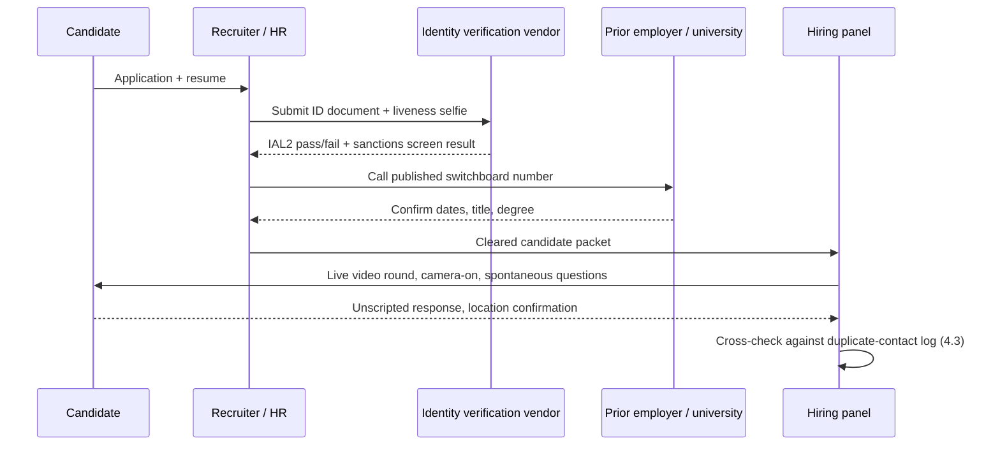
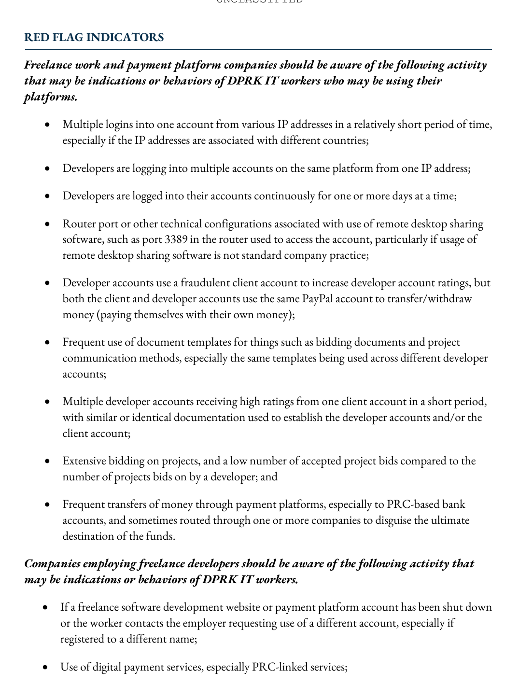
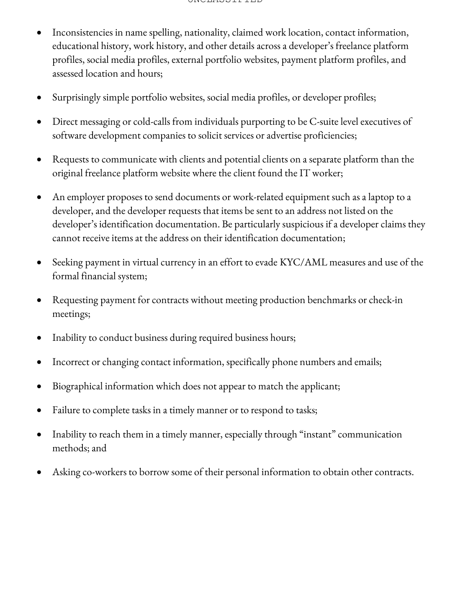
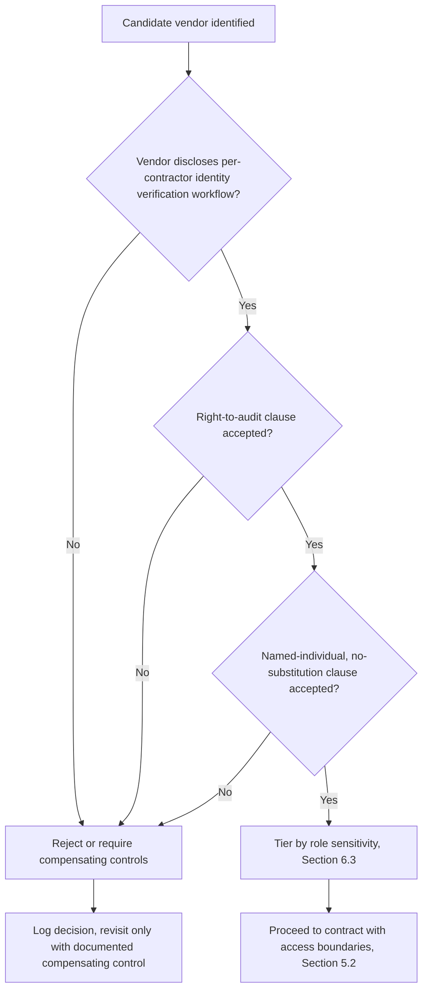

# Part 2: Hiring Security

[Back to Handbook contents](index.md) | [Series index](../index.md)

Hiring is the first control point in the **insider threat** lifecycle, and for Web3 and crypto-adjacent employers it is also the point most heavily targeted by state-directed fraud. This part covers the mechanics of building a hiring pipeline that resists impersonation: where you post roles and how you vet the channel, how you run interviews so identity and skill are both verified rather than assumed, how you select and bind vendors who supply contractors on your behalf, and what background checks can and cannot lawfully establish before an offer goes out. The controls here are the ones that would have stopped, or did stop, the fraud patterns documented in Part 1.

---

## 3. Job Posting and Sourcing

Where a role is advertised determines who applies to it, and the Democratic People's Republic of Korea (**DPRK**) IT worker apparatus has learned exactly which channels convert fastest into fraudulent placements. This chapter treats sourcing as the first filter, not an afterthought to interviewing.

### 3.1 Controlled Distribution and Verification of Channels

Post roles only through channels you control end to end: your own careers page, your applicant tracking system (ATS), and a small, named set of recruiting partners you have vetted. Every other channel, including general job boards, LinkedIn outreach from unverified recruiters, and crypto-specific Discord or Telegram job channels, is a channel an operator can scrape, clone, or use to route a stolen-identity application directly into your funnel. The [May 2022 US Treasury, State Department, and FBI advisory](https://ofac.treasury.gov/media/923126/download?inline=) already flagged freelance and staffing platforms as a primary entry point for **DPRK** IT workers using stolen or fabricated identities, and later reporting from [Google Cloud's Mandiant](https://cloud.google.com/blog/topics/threat-intelligence/mitigating-dprk-it-worker-threat) confirms operators actively monitor these boards for roles that combine remote-only terms with weak identity requirements. Verification of a channel means confirming the recruiter or platform account is who it claims to be (call the firm's main line, not the number in the outreach message), that job posts are not being mirrored or cloned on secondary boards under your company name, and that applications are captured in a single system of record rather than scattered across email inboxes where duplicate identities are hard to spot.

| Channel | Control level | Recommended posture |
|---|---|---|
| Company careers page + ATS | Full control | Primary channel; all applications route here |
| Named recruiting partners (vetted, contracted) | High control | Permitted, with a signed vendor agreement (Section 5) |
| LinkedIn direct outreach (unsolicited recruiters) | Low control | Verify recruiter identity before any exchange of documents |
| General freelance/gig marketplaces | Very low control | Route through Section 3.2 risk review before use |
| Crypto-specific Discord/Telegram job channels | Very low control | Treat as high-risk sourcing (Section 3.2) |

### 3.2 Avoiding High-Risk Sourcing Where Appropriate

Some sourcing channels carry a documented, elevated concentration of fraudulent applicants and should be avoided outright for sensitive roles, or used only with compensating controls layered on top. The 2022 advisory and the October 2023 [FBI/IC3 follow-up guidance](https://www.ic3.gov/PSA/2023/PSA231018) both single out general freelance and remote-work marketplaces and cryptocurrency payment platforms as venues **DPRK** operators exploit because identity requirements are thin and payment can be routed to accounts that are not tied to a verified individual. This does not mean freelance platforms are off limits for every engagement, remote-first hiring is a legitimate and often necessary model, but it does mean the decision to source through one should be a documented risk decision, not a default. Weigh the sensitivity of the role (does it touch production systems, treasury operations, or private keys) against the platform's identity assurance, and where the marketplace is used anyway, require its own verified-identity tier, insist on real-time video before any offer, and never accept payment routing changes requested after the engagement starts, a pattern the advisory calls out explicitly as a fraud indicator. For roles above a defined sensitivity threshold (Section 6.3), high-risk sourcing should be excluded from the vendor pool entirely rather than compensated for.

---

## 4. Interview and Assessment

The interview is the last point before an offer where a human evaluator can catch what automated screening misses. **DPRK** operators have adapted specifically to defeat weak interview processes, so the process itself needs to assume an adversarial candidate exists in every pool.

### 4.1 Technical and Identity Verification

Treat technical competence and identity as two separate claims that both need independent proof, because a skilled engineer and a stolen identity are not mutually exclusive; **DPRK** operators are frequently competent developers operating under someone else's name. Technical verification should include a live, proctored coding or systems exercise, not only an asynchronous take-home that can be completed by a different person entirely. **Identity verification** should follow the current [NIST Special Publication 800-63A Revision 4](https://pages.nist.gov/800-63-4/sp800-63a/ial/) outcomes. Revision 4 no longer treats IAL1 as self-asserted: IAL1 requires acceptable identity evidence, validation of core attributes and a government identifier against authoritative or credible sources, and verification that the applicant owns the evidence. IAL2 requires stronger or multiple evidence and supports non-biometric, biometric, and digital-evidence pathways; biometrics are not universally mandatory. IAL3 requires on-site attended proofing, although the proofing agent may participate remotely through a CSP-controlled kiosk, and retains a biometric sample. For a remote hire with production or customer-data access, use a conformant IAL2-capable service as the practical floor and document the evidence class, validation source, verification pathway, proofing type, exception handling, privacy impact, and result. A liveness-checked selfie matched to one ID is one possible biometric pathway, not by itself proof that the entire IAL2 outcome has been met. Screen names and entities against applicable sanctions lists, including the Treasury Office of Foreign Assets Control (OFAC) Specially Designated Nationals (SDN) list, under legal and privacy review.

| Verification layer | Method | Minimum assurance target |
|---|---|---|
| Identity proofing | Conformant service; sufficient evidence, authoritative/credible-source validation, and recorded non-biometric, biometric, or digital-evidence verification pathway | Documented NIST IAL2 outcome |
| Sanctions screening | Name/entity match against OFAC SDN list | Pass, documented |
| Technical skill | Live, proctored assessment | Panel-reviewed, scored |
| Contact artifact reuse | Phone/email cross-check against prior applicants | Zero unresolved matches |

### 4.2 In-Person or Unobscured Video; Direct Verification with Institutions


*Figure. Example output from a generative adversarial network: neither face belongs to a real person, illustrating the AI-generated headshots and synthetic overlays that a camera-on interview policy is designed to expose. Source: [Wikimedia Commons](https://commons.wikimedia.org/wiki/File:Male_and_female_deepfake.jpg), public domain.*

Require live, unobscured video for every interview round, camera fully on, no virtual backgrounds that could mask a green-screen deepfake rig, and reserve at least one round for spontaneous, unscripted questions the candidate cannot have rehearsed with a script feeding a synthetic overlay. The July 2025 [FBI/IC3 advisory](https://www.ic3.gov/PSA/2025/PSA250723-4) recommends specific live checks that are cheap to run and hard for a real-time deepfake pipeline to pass cleanly: ask the candidate to turn their head in profile, wave a hand in front of their face, or briefly point the camera out a window to confirm a claimed location and time of day. KnowBe4's own hiring pipeline conducted [four separate video interviews](https://blog.knowbe4.com/how-a-north-korean-fake-it-worker-tried-to-infiltrate-us) with a candidate later confirmed to be a **DPRK** operative using a stolen identity and an AI-enhanced stock photo, and the interviews alone did not catch it; the company's post-mortem is a useful case study in why video presence must be paired with independent verification, not treated as sufficient on its own. For sensitive roles, require an in-person meeting where feasible, even a single onboarding-day visit to a regional office. For prior employment and education, call the institution's published main switchboard number, never the number supplied on the resume or by a "reference" who answers suspiciously fast, and confirm dates and title directly with HR or registrar staff.



*Figure 1. The interview verification chain. Each stage produces independent evidence; no single stage is treated as sufficient on its own.*

### 4.3 Consistent Process and Documentation

Run every candidate through the same sequence of steps, the same question set per round, and the same documentation requirement, because inconsistency is what lets a fraudulent application slip through a gap another candidate would have been forced through. A standardized process also creates the dataset needed to catch the specific fraud pattern both the 2022 advisory and Mandiant's UNC5267 reporting describe: the same phone number, email address, or bank routing detail reused across resumes that claim to be different people. Maintain a central applicant intake log and run a duplicate-detection pass before any interview is scheduled.

```sql
-- Illustrative: flag contact-artifact reuse across distinct applicant records
SELECT phone_number, COUNT(DISTINCT applicant_id) AS applicant_count
FROM applicant_intake
GROUP BY phone_number
HAVING COUNT(DISTINCT applicant_id) > 1
UNION ALL
SELECT email_address, COUNT(DISTINCT applicant_id)
FROM applicant_intake
GROUP BY email_address
HAVING COUNT(DISTINCT applicant_id) > 1;
```

Document every interviewer's notes in the ATS rather than in personal messages or memory, log which verification steps were completed and by whom, and require panel sign-off before an offer. A documented process also produces the audit trail that matters if a hire is later found to be fraudulent: it is the record that shows what was checked, when, and by whom, which is what regulators and law enforcement will ask for first.

### 4.4 Red Flags During Interview (Technical, Behavioral, Inconsistencies)

No single red flag is proof of fraud, and treating any one indicator as disqualifying invites false accusations against legitimate candidates, particularly those in different time zones or with limited video bandwidth. Weighted together, a cluster of these indicators from the FBI advisory series, Mandiant's UNC5267 reporting, and CrowdStrike's tracking of the actor it calls FAMOUS CHOLLIMA (documented across [304 incidents in 2024](https://www.crowdstrike.com/en-us/blog/crowdstrike-2025-global-threat-report-findings/), a share involving insider access) should trigger a hold on the hiring decision pending further verification.


*Figure. Platform and payment indicators from the original joint advisory. These are observable control inputs—multi-country logins, shared IPs, long-running sessions, remote-desktop configuration, linked payment accounts—not demographic proxies. Feed them into case correlation, never use one row as an automatic hiring verdict. Source: [U.S. Departments of State and Treasury and FBI, DPRK IT Worker Advisory, page 8](https://ofac.treasury.gov/system/files/126/20220516_dprk_it_worker_advisory.pdf), public domain (U.S. government work).*


*Figure. Employer-facing indicators from the same advisory, completing the official list with cross-profile identity inconsistencies, mismatched equipment destinations, virtual-currency payment requests, unreachable working hours, changing contact details, and requests to reuse another person's identity. Corroborate across categories before escalation. Source: [U.S. Departments of State and Treasury and FBI, DPRK IT Worker Advisory, page 9](https://ofac.treasury.gov/system/files/126/20220516_dprk_it_worker_advisory.pdf), public domain (U.S. government work).*

| Category | Indicator |
|---|---|
| Technical | Below-average code quality or unfamiliarity with claimed seniority-level concepts during live assessment |
| Technical | Reliance on AI coding tools to answer basic questions about their own submitted work |
| Behavioral | Reluctance or refusal to enable camera, or camera enabled only briefly |
| Behavioral | Refuses a second, spontaneous video call after passing a scripted first round |
| Behavioral | Unnatural lip-sync, lighting seams, or blinking irregularities suggesting a real-time deepfake overlay |
| Behavioral | Generic, evasive, or rehearsed-sounding answers to personal or local-context questions |
| Inconsistency | Interview availability clusters at hours implausible for the claimed time zone |
| Inconsistency | Requests to ship a company laptop to an address that does not match the identification document |
| Inconsistency | Payment or banking details that partially match another applicant's record |
| Inconsistency | Resume content, project history, or writing style duplicated near-verbatim from another applicant |
| Inconsistency | Background, accent, or claimed location inconsistent with the video feed's visible details |

### 4.5 Monitoring: Multi-Country Logins and Unusual Network Traffic

Verification does not end at the offer letter; the strongest signals often surface only after the laptop ships. Mandiant's UNC5267 tracking found that **DPRK** IT workers frequently connect corporate laptops through **IP-based Keyboard-Video-Mouse (KVM) devices**, hardware that lets a facilitator physically hold the shipped laptop in a "laptop farm" while the actual worker operates it remotely from overseas, commonly over Astrill VPN egress traced to China or North Korea ([Google Cloud, 2024](https://cloud.google.com/blog/topics/threat-intelligence/mitigating-dprk-it-worker-threat)). The same reporting documents use of "Caffeine" mouse-jiggling software to keep multiple job laptops appearing active simultaneously, since many operators hold several jobs at once. Detect these patterns with conditional access policies that alert on geolocation mismatch between the shipping address and login IP, on VPN egress from flagged ranges, on multiple concurrent sessions from geographically implausible locations, and on the appearance of unauthorized remote-administration software (AnyDesk, TeamViewer, Chrome Remote Desktop, RustDesk) on a corporate device shortly after provisioning.

```yaml
# Illustrative SIEM alert logic, not a product-specific syntax
alert: dprk-multi-country-login
conditions:
  - login_ip_country != shipping_address_country
  - AND concurrent_sessions > 1 for single_user_account
  - OR vpn_egress_range IN [flagged_astrill_ranges]
  - OR new_process_name IN [anydesk.exe, teamviewer.exe, rustdesk.exe, chromeremotedesktop.exe]
    AND days_since_provisioning < 7
action: suspend_access, notify_security_and_hr, do_not_notify_manager_alone
```

Require hardware-bound multi-factor authentication tied to the shipped device, request laptop serial number confirmation at first login, and schedule periodic, unannounced video spot checks for fully remote staff. Part 4 of this handbook (Detection and Response) extends this monitoring into full insider-threat telemetry once an employee is past onboarding.

---

## 5. Vendor and Contractor Selection

Direct hires are only half the exposure. Staffing agencies, development shops, and individual contractors introduce a second identity-verification chain that your own controls do not automatically reach unless the contract requires it.

### 5.1 Due Diligence on Offshore and Remote Vendors

Vet a staffing vendor with the same rigor as a direct hire, because the vendor's own hiring practices become your exposure the moment a contractor gets network access. The June 2025 [Department of Justice coordinated action](https://www.justice.gov/opa/pr/justice-department-announces-coordinated-nationwide-actions-combat-north-korean-remote) against **DPRK** IT worker networks illustrates the mechanism directly: US-based facilitators, in that case charged alongside Chinese and Taiwanese co-conspirators, ran laptop farms and financial pass-through accounts on behalf of overseas operators, letting the workers present as US-based contractors to more than 100 companies. Before engaging any staffing agency or offshore development vendor, require them to disclose their own identity-verification workflow for every named individual they will place on your account, reserve the right to audit that workflow, and require named-individual attestations rather than accepting a vendor's blanket assurance that "our people are vetted." Cross-reference the vendor's own corporate registration and beneficial ownership where the engagement is significant, since shell staffing entities are a documented facilitation pattern in these schemes.



*Figure 2. Vendor due diligence gate. A vendor that cannot or will not produce individual-level verification evidence should not receive access-bearing placements.*

### 5.2 Contract and Access Boundaries

Write the contract to close the exact gap the laptop-farm pattern exploits: undisclosed substitution of who is actually doing the work. Every vendor agreement supplying remote personnel should include a named-individual clause naming the specific person authorized to perform the work, a no-subcontracting and no-substitution clause requiring written approval and re-verification before any personnel change, a prohibition on connecting company-issued or company-accessed equipment through third-party KVM or remote-administration hardware, and a right to conduct unannounced video verification calls with the named individual at any time during the engagement. Bind shipping addresses for any provided equipment to the identity-verified address on file and require immediate notice of any change.

```
CONTRACT CLAUSE (illustrative)
5.4 Named Individual; No Substitution. Vendor shall perform the Services
    solely through the individual(s) identified in Exhibit C, each of whom
    has completed the identity verification set out in Exhibit D. Vendor
    shall not substitute, subcontract, or permit any other individual to
    perform the Services without Client's prior written consent and
    completion of equivalent verification for the substitute individual.
    Vendor shall not connect Client-provided equipment, or equipment used
    to access Client systems, through any third-party KVM, remote-hands,
    or remote-administration hardware or software not expressly approved
    by Client. Breach of this Section is grounds for immediate termination
    for cause and forfeiture of unpaid fees.
```

### 5.3 Ongoing Monitoring and Review

Treat vendor-supplied access as a standing risk to review on a schedule, not a one-time gate cleared at contract signing. Require periodic, unannounced video check-ins with named individuals at an interval proportional to access sensitivity, monthly for privileged roles, quarterly otherwise, and compare the person on camera against the identity-verification record each time. Monitor invoicing and payment patterns for the anomalies the advisories flag repeatedly: requests to split payment across multiple accounts, requests to route payment through a different name than the named individual, and any request for cryptocurrency payment in place of the contracted payment method, which the [July 2025 FBI/IC3 advisory](https://www.ic3.gov/PSA/2025/PSA250723-4) specifically recommends against accepting. Review work-product quality trends over time; a documented drop in output quality or a sudden change in coding style and commit patterns for a long-tenured contractor is consistent with the **DPRK** IT worker practice of one operator holding, or later taking over, several concurrent job identities.

---

## 6. Background and Verification (Legal and Practical)

Background checks are the most legally constrained control in this handbook, because what you are permitted to ask, collect, and retain about a candidate varies sharply by jurisdiction. This chapter separates what the law allows from what is practically achievable, since the two are not the same everywhere.

### 6.1 Legal Constraints by Jurisdiction

A background check process built around a single jurisdiction's rules will either under-verify candidates elsewhere or violate local law. In the United States, the Fair Credit Reporting Act (FCRA) governs checks run through third-party consumer reporting agencies: it requires clear written disclosure, candidate authorization, and a defined adverse-action process (pre-adverse-action notice, a chance to dispute, then final notice) before declining a candidate based on report contents, and many states layer additional restrictions such as "ban the box" limits on when criminal history can be requested. In the European Economic Area, the General Data Protection Regulation (GDPR) treats criminal-record data as a special category with narrow lawful bases for processing, requires a documented legal basis and proportionality assessment before running any check, and gives candidates rights to access and erasure that constrain how long check results can be retained. Consult local employment and privacy counsel before deploying a uniform global background-check template.

| Jurisdiction | Governing framework | Key constraint |
|---|---|---|
| United States | FCRA + state law | Disclosure, authorization, adverse-action process; state-level criminal-history timing limits |
| European Economic Area | GDPR + national labor law | Criminal record is special-category data; narrow lawful basis, proportionality, retention limits |
| United Kingdom | UK GDPR + DBS regime | Disclosure and Barring Service checks tiered by role; strict standard/enhanced eligibility |
| Other jurisdictions | Varies (data protection + labor law) | Assess per engagement; do not assume US or EU rules transfer |

Because criminal-history checks are unevenly available across jurisdictions, **identity verification** (Section 4.1) becomes the control that travels globally: confirming a candidate is who they claim to be is lawful nearly everywhere, while confirming what they may have done is not.

### 6.2 Reference and Credential Verification

Verify credentials at the source, not through the candidate's supplied contact path. For education, use an institutional verification service such as the [National Student Clearinghouse's DegreeVerify](https://www.studentclearinghouse.org/solutions/ed-verifications/), which confirms degree and attendance records directly against data submitted by the institution itself, closing the diploma-mill and fabricated-transcript gap that a candidate-supplied PDF cannot. For employment references, call the company's published main number and ask to be routed to HR or the stated manager, rather than dialing a number the candidate or a "reference" provided, since **DPRK** operator networks have used facilitators to pose as references reachable at numbers under their own control. Treat a reference who answers unusually quickly, gives suspiciously polished answers, or cannot describe specific day-to-day work with the candidate as a signal to escalate, not close. Where the role warrants it, corroborate through a second, independent channel, a public professional profile with consistent tenure dates and endorsements from names you can separately verify, rather than a single reference call.

### 6.3 Handling of Sensitive Roles

Not every role carries the same downstream risk, and verification effort should scale with what the role can reach. Define sensitivity tiers before hiring begins and apply them consistently across direct hires and vendor placements alike, since the access, not the employment type, is what creates risk.

| Sensitivity tier | Example roles | Verification floor | Access staging |
|---|---|---|---|
| Tier 1 (low) | Non-technical, no system access | Documented IAL1 outcome under SP 800-63A Rev. 4, standard reference check | Standard onboarding |
| Tier 2 (elevated) | Engineers with production or customer-data access | IAL2, institutional credential check, live technical assessment | Least-privilege grant, review at 30/60/90 days |
| Tier 3 (sensitive) | Private-key custody, treasury operations, smart-contract deploy authority, code merge to production | IAL2 plus notarized identity proof, in-person meeting where feasible, sanctions screening | Staged access behind a probation period; hardware-bound MFA; no unsupervised key custody until tier review complete |

For Tier 3 roles, favor in-person onboarding meetings even for otherwise fully remote teams, and hold sensitive-scope access (deployment keys, treasury signing authority, production database credentials) behind a deliberate staging period rather than granting it on day one. The Employee Lifecycle Security Handbook (03) covers the offboarding half of this same access-staging discipline, and Part 4 of this handbook extends sensitive-role monitoring into ongoing insider-threat detection once the person is past their probation window.

---

**Key controls for Part 2**

- Route all hiring through owned, controlled channels; treat general freelance marketplaces and unsolicited outreach as high-risk sourcing requiring documented compensating controls.
- Separate **identity verification** (documented IAL2 evidence, validation, and verification outcome for elevated roles) from technical verification (live, proctored assessment) and require both; treat selfie/liveness as one possible pathway, not a complete IAL2 definition.
- Run every candidate through the same documented process, and screen intake data for reused phone numbers, emails, or payment details across "different" applicants.
- Require live, unobscured video with spontaneous verification prompts across multiple rounds, and verify employment and education directly with the issuing institution.
- Monitor post-hire for geolocation mismatch, KVM and remote-administration tooling, and mouse-jiggler activity on shipped equipment.
- Hold vendors and staffing agencies to named-individual, no-substitution, right-to-audit contract terms, and re-verify on a recurring schedule.
- Scale background-check rigor to local law, and scale verification depth and access staging to role sensitivity rather than employment type.

