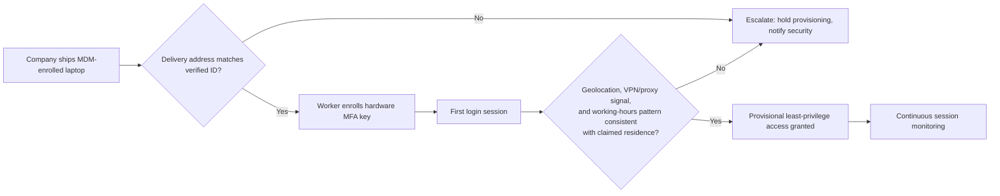
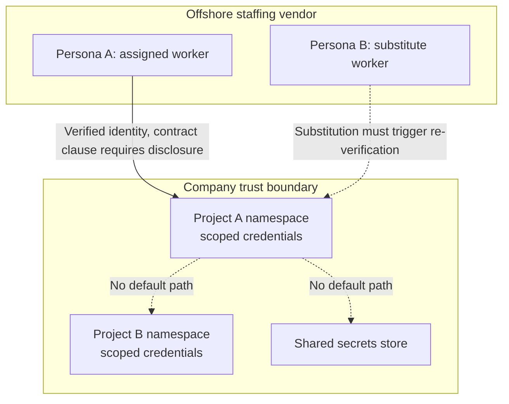
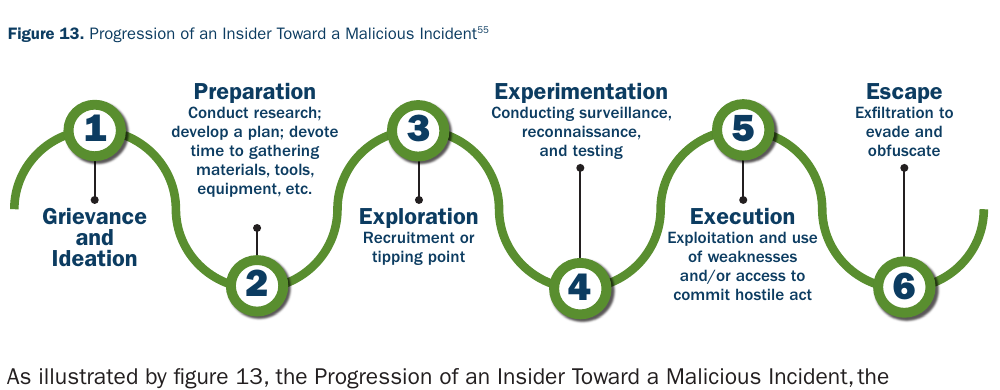
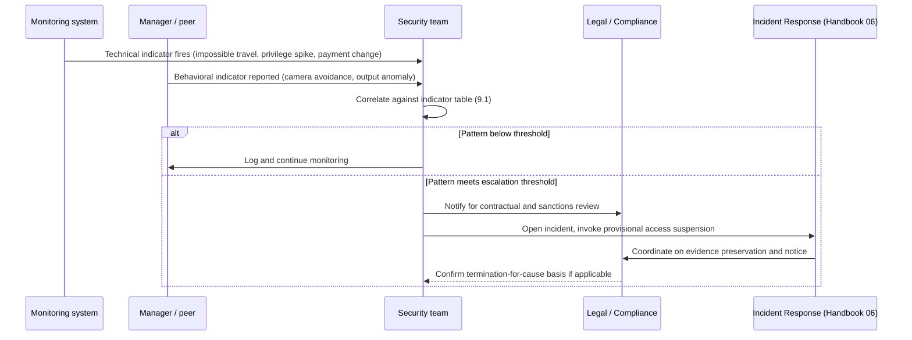

# Part III: Remote Work and Overseas Consultation

[Back to Handbook contents](index.md) | [Series index](../index.md)

A verified hire is not a closed case: the same operators who pass an interview must still be managed as remote or overseas workers with real system access. This part covers the controls that apply after an offer letter is signed, from device and network requirements through least-privilege access design, the specific compartmentalization needs of offshore consultants and distributed teams, the behavioral indicators that surface once a threat actor is on payroll, and the offboarding and organizational hardening that close the loop. The guidance assumes the reader has already absorbed the **DPRK** **threat model** in Part I and the pre-hire screening controls in Part II; this part is where those controls meet the daily reality of a remote workforce.

---

## 7. Remote Work Security

**Remote work security** here means the technical baseline every distributed hire, employee or contractor, must meet before touching production systems, plus the access design and communication discipline that limits what a single compromised or malicious account can do.

### 7.1 Device and Network Expectations

The device a remote worker uses is the first control point, and it is also the point the [Christina Chapman "laptop farm" case](https://therecord.media/arizona-woman-sentenced-north-korean-laptop-farm) showed is routinely subverted. Chapman ran a residence in Arizona that received company-issued laptops on behalf of overseas IT workers, plugged them into KVM (keyboard-video-mouse) devices, and ran remote access software so **DPRK** operatives thousands of miles away could operate them, letting all 300-plus victim companies believe their new hire's laptop was sitting in a U.S. home ([DOJ press release](https://www.justice.gov/opa/pr/justice-department-announces-coordinated-nationwide-actions-combat-north-korean-remote); [BleepingComputer](https://www.bleepingcomputer.com/news/security/us-woman-sentenced-to-8-years-in-prison-for-running-laptop-farm-helping-north-koreans-infiltrate-300-firms/)). A shipped laptop, on its own, proves nothing about who is typing on it.

Set concrete, enforceable device and network expectations rather than trusting shipping addresses:

- **Company-managed hardware only.** Issue enrolled, MDM (mobile device management)-managed laptops for any role touching source code, customer data, or funds; refuse personal-device requests for these roles. [NIST SP 800-46 Rev. 2](https://csrc.nist.gov/pubs/sp/800/46/r2/final) treats organization-issued devices as the baseline case and BYOD (bring your own device) as the higher-risk exception requiring compensating controls.
- **Bind identity to hardware.** Require hardware-backed multifactor authentication (FIDO2 security keys or platform authenticators) enrolled to the specific device shipped, so a stolen password or a second operator on a KVM switch cannot complete login alone.
- **Verify device receipt against the identity record.** Require the worker to photograph the device serial number and confirm delivery at the address on file in identity documents, matching the practice [IC3's July 2025 advisory](https://www.ic3.gov/PSA/2025/PSA250723-4) recommends: ship only to addresses that match verified identification, and treat a request to ship elsewhere, a stated relative's address, a coworking space, a freight forwarder, as a red flag requiring escalation, not accommodation.
- **Fingerprint the network path, not just the login.** Impossible-travel and IP-reputation tooling should evaluate every session, not only the first one: compare geolocation against claimed residence, flag commercial VPN and residential-proxy exit nodes, and flag KVM-over-IP and remote-desktop signatures on a device that should be operated locally ([Spur research on remote worker fraud detection](https://spur.us/research/remote-worker-fraud-prevention); [FBI advisory on residential proxy abuse](https://ipinfo.io/blog/impossible-travel-detection-ip-data-accuracy)).
- **Baseline working hours against claimed time zone.** DPRK IT worker operations frequently work a shifted schedule (often described as a night shift local to the operator, appearing as normal daytime hours in the target country) to sustain the fiction of a co-located employee; a login pattern with no variance across weeks, or one that maps cleanly to a UTC+8/UTC+9 working day for a worker claiming U.S. residency, deserves review.

*Figure 6. Device and network verification as a gate, not a one-time check. Each stage produces a signal that either escalates or allows the next stage, mirroring the KVM and laptop-farm pattern documented in the Chapman prosecution.*

### 7.2 Access and Least Privilege for Remote Roles

**Least privilege** for a remote hire is not a policy statement, it is a provisioning default: grant the minimum system access needed for the first assignment, expand only on demonstrated need, and treat every grant as provisional until identity and behavior are independently confirmed. This follows directly from [NIST SP 800-207](https://csrc.nist.gov/pubs/sp/800/207/final)'s **zero trust** architecture model, which replaces one-time network perimeter trust with continuous, per-session verification and explicit least-privilege grants regardless of whether the requester is on a corporate LAN or remote.

Apply this concretely to a new remote engineering or IT hire:

| Access tier | Default at day 1 | Expansion trigger | Review cadence |
|-------------|-------------------|-------------------|-----------------|
| Source code repositories | Read-only, single assigned repo | Manager approval + 30 days tenure | Quarterly |
| Production deploy credentials | None | Named approval, time-boxed, logged | Every grant |
| Secrets and key management systems | None | Role-specific, scoped to minimum secret set | Every grant |
| Customer or user PII (personally identifiable information) systems | None | Data protection officer or equivalent sign-off | Monthly |
| Internal communication (chat, wiki) | Standard channels only | N/A | N/A |
| VPN or private network access | Segmented VLAN for new hires | After device and identity re-verification | 90 days |

The [Skadden analysis of North Korean remote IT worker risk (June 2026)](https://www.skadden.com/insights/publications/2026/06/north-korean-remote-it) recommends granting access "ideally on a provisional basis initially" precisely because pre-hire verification, however rigorous, cannot fully substitute for observed on-the-job behavior. Treat the first 30 to 90 days as a probationary access period with tighter logging and a lower threshold for review, not merely a probationary employment period on paper.

Segment access by **trust boundary** rather than by convenience. A remote contractor working on a single microservice does not need read access to the monorepo, and a distributed-team IT support role does not need standing admin rights to identity systems. Bidirectional role review matters here too: a semi-trusted role (an admin, a keeper of secrets, a build pipeline operator) that could plausibly abuse its own access in the *opposite* direction from its intended use, granting itself more privilege or exfiltrating what it can already read, deserves the same scrutiny as an external attacker's path. Log every grant, every elevation, and every credential issuance to a store the same team cannot unilaterally purge.

### 7.3 Communication and Data Handling

Communication channel choice is itself a signal. The [May 2022 State/Treasury/FBI joint advisory](https://publications.bsafes.com/docs/state/advisory-20220516-guidance-on-the-democratic-peoples-republic-of-korea-information-technology-workers/) lists a "preference for text or audio communication to avoid detection" and difficulty reaching a worker "in a timely manner, especially through videoconferencing" as recruitment-stage red flags, and the same pattern persists post-hire: a remote employee who routinely declines camera-on meetings, insists on async text over voice, or requests migration of work discussion to a personal messaging app outside company logging is exhibiting the same evasion behavior in a different phase of the relationship.

Set explicit expectations at onboarding, not as a reaction to suspicion:

- **Mandate camera-on for scheduled 1:1s and team syncs**, with an documented, narrow exception process (medical, connectivity) that a manager, not the worker alone, approves.
- **Keep all work communication on company-controlled, logged channels.** Migrating substantive project discussion to personal WhatsApp, Telegram, or similar is a policy violation regardless of intent, and it is also exactly how a facilitator relays instructions from the actual operator to a front person, as described in the [KnowBe4 incident write-up](https://blog.knowbe4.com/how-a-north-korean-fake-it-worker-tried-to-infiltrate-us).
- **Restrict data egress from managed devices.** Disable or monitor USB mass storage, personal cloud storage sync clients, and unmanaged email forwarding on any device with source code or customer data access; DLP (data loss prevention) tooling should alert on large or repeated exfiltration-shaped transfers, especially to personal cloud accounts or messaging apps.
- **Classify data before it reaches a distributed team member.** Not every remote hire needs the same data class; scope repository and document access by classification tier so a compromised or malicious low-tier account cannot reach high-sensitivity material by lateral movement alone.

---

## 8. Overseas Consultation and Distributed Teams

Overseas consultants and fully distributed teams multiply the **attack surface** Part 7 addresses for a single remote employee, because each additional jurisdiction adds identity ambiguity, payment complexity, and legal exposure that domestic remote work does not carry to the same degree.

### 8.1 Trust Boundaries and Compartmentalization

Treat every overseas engagement, whether a named individual contractor or a staffing vendor supplying personnel, as a distinct **trust boundary** with its own **blast radius**. [Google Threat Intelligence Group's 2025 reporting](https://cloud.google.com/blog/topics/threat-intelligence/dprk-it-workers-expanding-scope-scale) documented a single DPRK operator running twelve different personas across European employers simultaneously, spanning claimed nationalities from Italy to Vietnam to the United States; a compartmentalized access model limits what any one of those twelve personas, if hired, could touch, and prevents a single compromised persona from becoming a pivot point into unrelated projects or teams.

Compartmentalization has three practical dimensions for a distributed engagement:

1. **Project-level isolation.** An overseas contractor engaged for one client project or one repository should not, by default, see credentials, code, or data belonging to a different project, even inside the same company. Multi-tenant access controls (separate namespaces, separate service accounts, separate secrets stores per project) enforce this technically rather than relying on the contractor's discretion.
2. **Vendor-of-vendor visibility.** A staffing vendor that itself subcontracts to individual developers, common in offshore development shops, breaks direct **identity verification**: the company verifies the vendor, not necessarily the specific person the vendor assigns. Contractually require the vendor to disclose the actual individual performing the work and to re-verify identity on any substitution, closing exactly the gap the [multi-defendant DOJ indictment covering 64 U.S. companies](https://www.justice.gov/opa/pr/two-north-korean-nationals-and-three-facilitators-indicted-multi-year-fraudulent-remote) exploited when North Korean operatives worked through layers of U.S.-based facilitators who fronted as the visible contractor.
3. **Need-to-know over convenience.** Resist granting an overseas team broad access "to move faster." The **zero trust** model in [NIST SP 800-207](https://csrc.nist.gov/pubs/sp/800/207/final) applies with more force here, not less: distance and jurisdictional variance make in-person verification of a claim ("I need this to finish the sprint") harder to sanity-check informally, so the technical control has to do the work a hallway conversation would otherwise do.

*Figure 7. Compartmentalized access for an offshore vendor engagement. Project namespaces are isolated from each other and from the shared secrets store; any substitution of the assigned individual re-triggers verification rather than inheriting trust.*

### 8.2 Payment and Identity Verification

Payment mechanics are one of the highest-signal indicators available post-hire, because **DPRK** IT worker schemes ultimately exist to generate revenue, and the [Treasury OFAC designations of July 2024](https://www.globalsecurity.org/wmd/library/news/dprk/2025/dprk-250724-treasury01.htm) describe networks that generated nearly $800 million in a single year by routing salaries through facilitators in the DPRK, Vietnam, Laos, and Spain who converted wages to cryptocurrency for transfer back to the regime. A Vietnam-based facilitator in that action alone converted roughly $2.5 million into crypto for North Korean workers between mid-2023 and mid-2025.

Build payment and **identity verification** around these controls:

- **Match banking details to identity documents, every time.** Verify the name on the bank account against the name on the government ID and tax documentation before the first payment, not only at initial onboarding; re-verify on any change request.
- **Treat mid-engagement payment changes as an escalation trigger.** A request to redirect salary or invoice payment to a new account, a different country, or a cryptocurrency wallet is one of the clearest indicators in the entire **threat model**. The IC3 advisory explicitly flags "frequent banking changes and requests for virtual currency payments" as warning signs (see Section 9.1 below for the full post-hire indicator set).
- **Screen payment destinations against sanctions lists.** Run OFAC's Specially Designated Nationals (SDN) list and equivalent EU, UK, and UN sanctions lists against every payment destination for overseas contractors, and repeat the screening periodically, not only at contract signing, since designations change; the [Treasury press releases](https://home.treasury.gov/news/press-releases/sb0230) documenting these networks are updated on a rolling basis as new facilitators are identified.
- **Prefer verifiable payment rails over informal ones.** Payroll run through a reputable Employer of Record (EOR) or payroll provider with its own KYC (know your customer) obligations adds an independent verification layer; direct peer-to-peer crypto payment to an individual contractor removes that layer entirely and should be treated as higher risk requiring additional identity assurance.
- **Reconcile headcount against payroll on a schedule.** The Skadden guidance recommends regular audits for "phantom" workers in payroll records, catching the case where a name remains on payroll after the actual work relationship should have ended, or where a facilitator inserted an unauthorized entry.

### 8.3 Contractual and Legal Considerations

Contracts for overseas consultants and distributed team members need to do more legal work than a standard domestic agreement, because they sit at the intersection of employment law, sanctions law, and data protection law across jurisdictions.

**Employment classification.** Misclassifying a long-term, integrated overseas worker as an independent contractor exposes the company to back taxes, statutory benefits claims, and in a growing number of jurisdictions, personal liability for company directors; roughly 30 percent of employers misclassify at least some workers, and exposure compounds with every jurisdiction added ([Toku's crypto-industry misclassification analysis](https://www.toku.com/resources/employer-vs-contractor-misclassification-risk-in-crypto)). If the relationship looks like employment in substance (integrated into the team, working primarily for the company, taking day-to-day direction, engaged for an extended period), engage the worker through a compliant EOR or local entity rather than a bare contractor agreement, and revisit the classification if the scope of a "contractor" engagement quietly expands into a full-time role.

**Audit and monitoring clauses.** Every contractor and remote employee agreement should include explicit language permitting the company to audit system usage, log activity, and access company-issued devices for security purposes; the Skadden guidance identifies this as a prerequisite for effective **insider threat** response, since acting on monitoring data the contract did not authorize collecting creates its own legal exposure.

**Sanctions and export control exposure.** Engaging a worker who is, in fact, a **DPRK** national or is channeling wages to the DPRK creates potential liability under U.S. sanctions law independent of whether the company had actual knowledge, because OFAC's sanctions framework includes strict-liability elements for engaging with SDN-listed parties. Where the work involves controlled technology, export control regimes (ITAR, EAR) add a further layer: some technical data cannot legally be shared with nationals of certain countries regardless of physical location, so screening for nationality as well as physical location matters for sensitive engagements.

**Data protection and residency.** A distributed team spanning the EU, UK, or other jurisdictions with independent data protection regimes needs contract terms addressing lawful basis for cross-border data transfer, data residency commitments, and breach notification obligations that may run on a different clock than the company's home jurisdiction. Align these terms with the data classification tiers from Section 7.3 so that contractual protection and technical **access control** point at the same boundaries.

**Termination and offboarding rights.** Build immediate access-revocation rights into every overseas contractor agreement, without notice period, for cause tied to security policy violation or suspected fraud; a notice period appropriate for a routine contract termination is not appropriate for an active insider threat, and Section 10 covers the offboarding mechanics this clause enables.

---

## 9. After Hire: Post-Hire Behavior and Monitoring

Verification at hiring reduces but does not eliminate risk, so the program needs a second layer that watches behavior after access is granted. This chapter covers what to watch for and how to structure the watching.

### 9.1 Indicators After a Threat Actor Is Hired

Post-hire indicators cluster into four categories: identity inconsistency, access and network anomalies, communication evasion, and productivity or output anomalies. No single indicator is proof; the pattern across categories is what should trigger escalation, matching the multi-signal approach [Kraken's security team used to expose a North Korean applicant during a final-round interview](https://blog.kraken.com/news/how-we-identified-a-north-korean-hacker) by combining a voice mismatch, an inability to answer city-of-residence questions, and a network of linked fake identities rather than any one red flag alone.

*Figure. CISA's progression model is a detection aid, not a prediction engine. In this handbook's context, preparation, reconnaissance, access testing, execution, and exfiltration map to observable changes in account and device behavior, while the model's warning explicitly remains: the presence of one stage does not prove the later stages will occur. Source: [CISA Insider Threat Mitigation Guide, Figure 13](https://www.cisa.gov/sites/default/files/2022-11/Insider%20Threat%20Mitigation%20Guide_Final_508.pdf), public domain (U.S. government work).*

| Category | Indicator | Why it matters |
|----------|-----------|-----------------|
| Identity | Voice, appearance, or writing style shifts noticeably across sessions | Suggests multiple people sharing one "employee" identity, a documented DPRK IT worker pattern |
| Identity | Inability to answer spontaneous location-specific questions (nearby landmarks, local weather, time zone math) | Basic living-there knowledge a genuine resident has by default |
| Access | Logins from geographically implausible or rapidly shifting locations | Impossible-travel signature; may indicate KVM-over-IP or shared account use |
| Access | Consistent use of commercial VPN or residential proxy exit nodes | Common technique to mask true operating location |
| Access | Working hours that map cleanly to a DPRK/China-adjacent time zone rather than the claimed residence | Documented "night shift" pattern to sustain the daytime-presence fiction |
| Access | Requests for elevated privileges shortly after hire, beyond what the role requires | Consistent with a scripted pattern to reach source code or credentials fast |
| Communication | Persistent avoidance of camera-on meetings or voice calls | Documented recruitment-stage evasion behavior recurring post-hire |
| Communication | Push to move work discussion to unmonitored personal messaging apps | Removes the company's only visibility into coordination with a possible facilitator |
| Financial | Mid-engagement request to change payment destination, especially to a new country or a crypto wallet | Directly matches IC3 and OFAC-documented revenue-generation mechanics |
| Financial | Bank account name mismatched to identity documents | Sign of a facilitator receiving funds on the worker's behalf |
| Output | Work quality that does not match stated experience level, in either direction | Both a genuinely unqualified hire and a scripted "output pipeline" fed by an unseen second party can produce this signature |
| Output | Unusual data access patterns: bulk repository clones, broad document searches unrelated to assigned tasks | Consistent with the "data extortion" objective the [IC3 July 2025 advisory](https://www.ic3.gov/PSA/2025/PSA250723-4) specifically warns about |

The KnowBe4 case is the clearest documented example of the access-anomaly category firing correctly: the company's endpoint detection flagged anomalous activity from a newly onboarded workstation roughly six minutes after the account received restricted, low-privilege access, and the security team revoked that access within twenty-five minutes ([SecurityWeek](https://www.securityweek.com/knowbe4-hires-fake-north-korean-it-worker-catches-new-employee-planting-malware/); [KnowBe4's own writeup](https://blog.knowbe4.com/how-a-north-korean-fake-it-worker-tried-to-infiltrate-us)). No data was exfiltrated and no production system was reached, precisely because the least-privilege default from Section 7.2 meant the compromised account had almost nothing to lose access to.

### 9.2 Monitoring and Early Warning

Turn the indicator table into a running program, not a one-time checklist, by pairing behavioral awareness with technical telemetry.

**Behavioral layer.** Train managers and teammates, not just security staff, to notice and report the identity and communication indicators; CISA's [Insider Threat Mitigation Guide](https://www.cisa.gov/resources-tools/resources/insider-threat-mitigation-guide) frames an organization's own personnel as "an invaluable resource to observe behaviors of concern" and structures programs around four stages: define the threat, detect and identify it, assess it, and manage it. A manager who notices a direct report never turns on video and always requests text-only standups has produced a detection-stage signal even without security tooling involved.

**Technical layer.** Feed the access-category indicators into whatever SIEM (security information and event management) or UEBA (user and entity behavior analytics) capability the organization already runs: impossible-travel rules, VPN and residential-proxy attribution, device-fingerprint drift, and privilege-escalation alerts should all route to a queue someone actually reviews, not merely to a dashboard. The **Incident Response** Handbook (06) covers the tooling and triage workflow in depth; this handbook's contribution is ensuring hiring-and-vendor-specific signals (payment-destination changes, contract-substitution events, new-hire privilege spikes in the first 90 days) are wired into that same pipeline rather than sitting in HR or finance systems the security team never sees.

**Escalation path.** Define, in writing, who reviews a flagged pattern, what authority they have to suspend access provisionally while investigating, and how quickly a suspension can happen without waiting on a full investigation to conclude. The KnowBe4 timeline (detection to containment in under thirty minutes) is the target shape: fast, provisional, and reversible if the finding turns out to be a false positive, rather than slow and irreversible.

---

## 10. Ongoing Monitoring and Offboarding

Monitoring does not end when suspicion resolves one way or the other, and offboarding is a security control with its own failure modes, not an administrative afterthought.

### 10.1 Alignment with Employee Lifecycle Handbook

Ongoing monitoring and offboarding mechanics, the actual sequence of revoking badge access, disabling accounts, retrieving hardware, and rotating credentials, are owned by the Employee Lifecycle Security Handbook (03), and this handbook does not duplicate that mechanical detail. What this handbook adds is the hiring-and-vendor-specific triggers that should invoke those mechanics faster or more aggressively than a routine departure would warrant.

Three alignment points matter specifically for remote, overseas, and vendor-sourced personnel:

- **Contract substitution triggers immediate re-verification, not a lifecycle no-op.** If an offshore vendor swaps the individual performing the work, treat it as a new hire from a security-controls perspective (**identity verification**, provisional access, Section 8.1 compartmentalization reset), even though the vendor contract and the "position" continue unchanged. Standard lifecycle processes tuned for a single employee changing role do not automatically catch a personnel substitution behind a vendor relationship.
- **Sanctions or law-enforcement notice triggers emergency offboarding, bypassing standard notice periods.** The contractual termination-for-cause clause from Section 8.3 exists so that when a payment screening hit, an OFAC designation, or a law enforcement inquiry names a current vendor or contractor, the Employee Lifecycle Handbook's offboarding checklist can execute immediately rather than waiting on a standard separation timeline.
- **Offshore and remote-hardware retrieval needs its own runbook step.** Physical device retrieval from an overseas or fully remote worker cannot rely on a same-day office badge-in; build device recovery, remote wipe confirmation, and credential rotation timing into the offboarding checklist explicitly for non-co-located personnel, since a delayed retrieval window is exactly the gap a malicious departing worker (or a facilitator, if the worker was never the real operator) can exploit.

### 10.2 Early Warning and Escalation

Early warning for a hire already past onboarding draws on the same monitoring described in Section 9.2, but the escalation stakes are different: a suspicious pattern in someone who already has months of accumulated access and trust needs a faster, more senior escalation path than a pattern flagged in week one.

*Figure 8. Escalation flow from a flagged indicator to a coordinated security, legal, and incident-response response. The provisional-suspension step (right branch) should not wait on legal sign-off to begin; it should trigger it.*

Build a named escalation owner for hiring-and-vendor-linked security concerns specifically, someone who sits at the intersection of HR, security, and legal, so a flagged pattern does not stall in a queue while each function assumes another owns the next step. Document every escalation decision, including decisions not to act, since a pattern that resolves as a false positive today may become part of a stronger pattern when correlated with a later signal.

---

## 11. Mitigating Insider Threat Actors

The prior chapters cover detection; this chapter closes Part III with the structural changes that reduce how often detection is even necessary.

### 11.1 Hardening Hiring and Vendor Processes

Feed everything this part has covered back into the processes Part II defined, closing the loop rather than treating hiring and remote-work security as separate programs:

- **Institutionalize the Kraken-style verification interview technique** for any remote or overseas final-round candidate: spontaneous, unscripted questions about claimed location, government ID review on camera, and consistency checks across the full interview panel's independent observations, not a single interviewer's judgment.
- **Require vendor security addenda, not just service agreements**, covering the identity-disclosure, substitution-notification, and audit-rights clauses from Section 8.3 for every staffing and contracting vendor, and review vendor compliance with those clauses on a fixed cadence rather than only at renewal.
- **Screen sanctions exposure at the vendor level, not only the individual level.** The [Treasury designations](https://www.globalsecurity.org/wmd/library/news/dprk/2025/dprk-250724-treasury01.htm) target facilitator entities as well as individuals; a vendor relationship that routes payments through a newly designated entity is a signal independent of anything the individual worker does.
- **Rotate and diversify sourcing channels** for high-risk roles (source-access engineering, treasury or funds-adjacent operations), since concentrated sourcing through a small number of platforms or referral chains is exactly what large-scale facilitator networks exploit at volume; the DOJ's multi-defendant indictments describe operations spanning dozens of companies sourced through a common small set of channels.

### 11.2 Organizational Defenses and Consequences

Beyond process, two organizational commitments determine whether the controls in this part actually function under pressure.

**Fund the friction.** Every control in this part, in-person or unobscured-video verification, provisional access, mandatory camera-on meetings, payment re-screening, adds hiring and onboarding friction that a growth-focused organization will be tempted to waive under deadline pressure. Treat waiver authority as a named, senior decision rather than a default a hiring manager can grant unilaterally; the [KnowBe4 and Kraken cases](https://blog.knowbe4.com/north-korean-fake-it-worker-faq) both involved sophisticated, well-resourced security teams that still nearly missed the pattern, so an organization with weaker controls than either should assume its baseline detection rate is lower, not higher.

**Build a no-blame reporting culture for false starts.** A manager who raises a concern that turns out to be a false positive, an over-cautious HR reviewer who delays an offer for extra verification, should never face pushback for the delay; the cost asymmetry strongly favors over-escalation, since a missed indicator can cost a company data, funds, and regulatory exposure under strict-liability sanctions rules, while an unnecessary verification step costs, at most, a few days of hiring timeline.

**Understand the consequence stack.** An organization that inadvertently hires or facilitates a **DPRK** IT worker faces a compounding set of exposures beyond the immediate insider threat: sanctions liability under OFAC's strict-liability framework regardless of intent, potential export control exposure if controlled technical data was accessible, reputational damage on public disclosure, and the direct costs of incident response and remediation. The [nearly $800 million](https://www.globalsecurity.org/wmd/library/news/dprk/2025/dprk-250724-treasury01.htm) the Treasury Department attributes to these schemes in a single year is not merely a DPRK revenue statistic, it represents that many dollars' worth of individual company exposure events, most of which never make headlines. Treating the controls in this part as a compliance cost rather than a fund-preservation measure understates what is actually at stake.

---

**Key controls for Part III**

- Ship only MDM-managed hardware to addresses matching verified identity documents, and gate first access on device, identity, and network-consistency checks together, not any single one.
- Default every remote and overseas role to least-privilege, provisional access for the first 30 to 90 days, expanding only on named approval.
- Mandate camera-on meetings and company-controlled communication channels; treat migration to unmonitored personal messaging as a policy violation and a signal.
- Compartmentalize offshore vendor and consultant access by project, and contractually require identity disclosure and re-verification on any personnel substitution.
- Screen and re-screen payment destinations against OFAC and equivalent sanctions lists; treat mid-engagement payment-destination changes as a high-priority escalation trigger.
- Wire hiring-and-vendor-specific signals (privilege spikes, payment changes, contract substitutions) into the same monitoring pipeline the **Incident Response** Handbook (06) already operates, rather than leaving them siloed in HR or finance systems.
- Build emergency, notice-bypassing offboarding rights into every remote and overseas contract, and align execution with the Employee Lifecycle Handbook (03).

