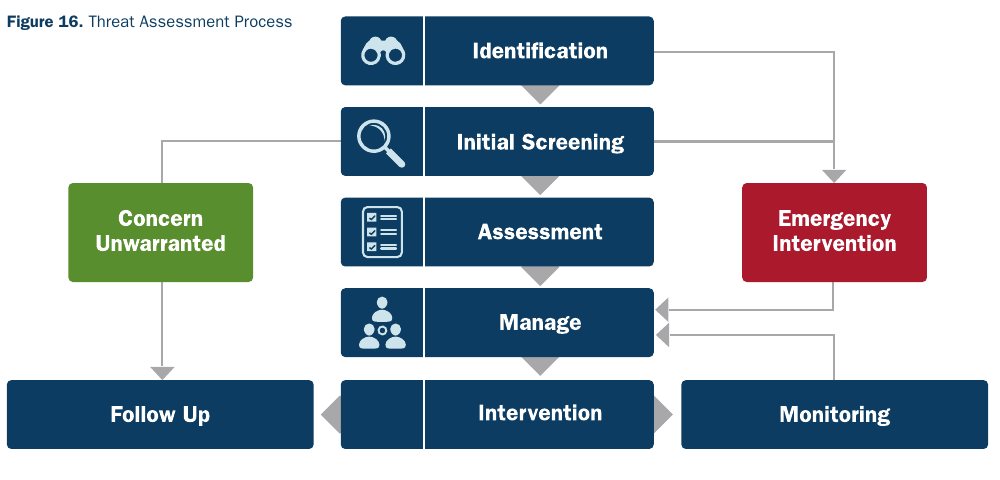
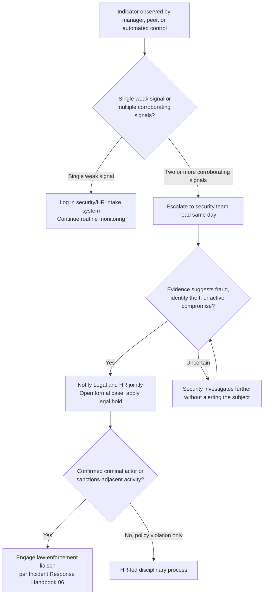
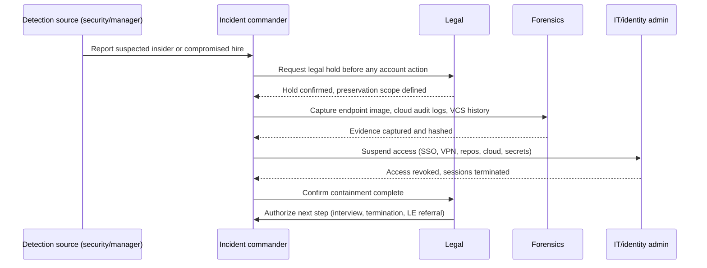
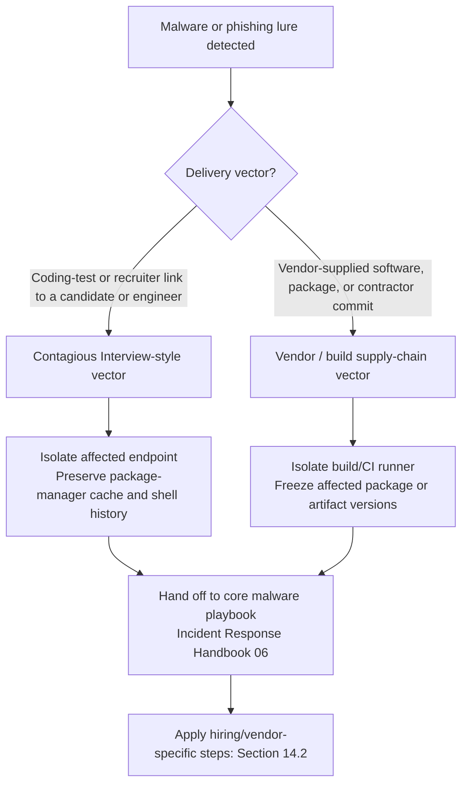

# Part 4: Detection and Response

[Back to Handbook contents](index.md) | [Series index](../index.md)

Hiring controls and remote-work hardening reduce the odds that a fraudulent hire or a compromised vendor ever reaches production systems, but no control set drives that risk to zero. This part covers what a team does once a red flag actually appears: how to read behavioral and technical indicators without over- or under-reacting, how to run a contained investigation that survives legal and public scrutiny, and how to fold a hiring-context malware or phishing event into the organization's broader **incident response** process. The playbooks below assume the reader already has, or is building, a general incident response capability; they add the hiring- and vendor-specific branches that a generic playbook does not cover.

---

## 12. Recognizing Potential Compromise

Recognition is the bottleneck, not response. Every publicly documented case of a Democratic People's Republic of Korea (**DPRK**, North Korea) information-technology worker infiltrating a software or Web3 company shows the same pattern: the warning signs existed for weeks or months before anyone escalated them ([KnowBe4, "How a North Korean Fake IT Worker Tried to Infiltrate Us," July 2024](https://blog.knowbe4.com/how-a-north-korean-fake-it-worker-tried-to-infiltrate-us)). This chapter gives hiring managers, security teams, and IT administrators a shared vocabulary for what to watch and a clear rule for when a single odd signal becomes a case.

### 12.1 Behavioral and Technical Indicators

No single indicator proves a hire is fraudulent or a device is compromised. Genuine remote employees turn their camera off for privacy reasons, use a virtual private network (VPN) from a hotel, or hold a second job. What separates noise from signal is corroboration: two or three indicators from different categories, appearing together, on the same person. The May 2022 joint guidance from the U.S. State Department, Treasury, and FBI, later reinforced by dozens of Department of Justice (DOJ) cases, describes a consistent operating pattern for **DPRK** IT worker fraud ([State Department, "Guidance on the Democratic People's Republic of Korea Information Technology Workers," May 2022](https://www.state.gov/guidance-on-the-democratic-peoples-republic-of-korea-information-technology-workers/)): a fabricated or stolen identity used to pass a remote interview, a domestically hosted "**laptop farm**" that makes the login geography look legitimate, and revenue funneled back through intermediaries to fund the regime's weapons programs. Security researchers track the malware-delivery side of the same actor set under names such as Contagious Interview and Famous Chollima ([Unit 42, "Contagious Interview: DPRK Threat Actors Lure Tech Industry Job Seekers," 2024](https://unit42.paloaltonetworks.com/north-korean-threat-actors-lure-tech-job-seekers-as-fake-recruiters/)). The indicator categories below are drawn from these sources and should feed directly into the applicant-screening controls in Part II and the remote-work monitoring in Part III.

Read the table as a scoring aid, not a checklist to interrogate a single employee against. A hiring manager or security analyst who sees two or more rows firing for the same person should move to Section 12.2 rather than confront the individual directly.

| Category | Indicator | Why it matters |
|----------|-----------|-----------------|
| Behavioral | Camera stays off, or video shows a static image or an AI-smoothed face that never quite matches the audio | Common workaround when the person on screen does not match the claimed identity |
| Behavioral | Repeatedly reschedules or refuses in-person meetings, notarized identity checks, or courier-delivered hardware | Physical presence risks breaking the cover identity |
| Behavioral | Asks to redirect payroll to a new account shortly after hire, or requests payment via cryptocurrency or a money-transfer service | Matches DOJ-documented mule-account and revenue-funneling patterns |
| Behavioral | Working hours are consistently offset from the claimed time zone, with unusually fast overnight task turnaround | Suggests work performed from a different time zone, sometimes by more than one person sharing an account |
| Behavioral | Avoids discussing personal history in detail, cites prior employers who cannot be reached, or gives biographical details that shift between interviews | Fabricated identity built on stolen or synthetic documents |
| Technical | A company laptop shows persistent inbound sessions from remote-access software such as AnyDesk, TeamViewer, or Chrome Remote Desktop | Signature of a "laptop farm": the device sits at a domestic address while an operator abroad drives it, sometimes through a keyboard-video-mouse (KVM) switch |
| Technical | Login geolocation or autonomous system number (ASN) is inconsistent with the claimed residence, especially residential-proxy or virtual private server (VPS) ranges | Masks the operator's true location |
| Technical | A shipped laptop never leaves a single receiving address after onboarding, regardless of the employee's claimed home city | Consistent with a paid facilitator hosting hardware for a remote operator |
| Technical | Device fingerprints, payment routing, or coding style overlap with another active or former employee elsewhere in the industry | DOJ and FBI cases describe individual DPRK IT workers holding several concurrent jobs |
| Technical | A code-contribution account has no verifiable history before the hire date, or commit timestamps and metadata are inconsistent with the claimed location | Digital footprint too shallow or misaligned for the claimed background |

### 12.2 When to Escalate to Security or Legal

Escalation timing is a tradeoff between two failure modes: acting too early on a weak signal invites a wrongful-termination claim and a demoralized team, while waiting for certainty lets a compromised identity keep merge rights, secrets access, or payroll data for weeks longer than necessary. The National Institute of Standards and Technology's **incident response** guidance frames the first response phase as triage against defined severity criteria rather than a judgment call made in the moment ([NIST SP 800-61 Revision 3, "Incident Response Recommendations and Considerations for Cybersecurity Risk Management," April 2025](https://csrc.nist.gov/pubs/sp/800/61/r3/final)), and the same discipline applies to hiring-context signals. The rule this handbook recommends: a single indicator from the Section 12.1 table goes into a security or HR intake log for pattern tracking; two or more corroborating indicators, or any single indicator tied to fraud, identity theft, or credential misuse, triggers a formal security escalation the same day.

Once security opens a case, legal counsel is looped in before any user-facing action, not after. This preserves attorney involvement over the investigation's findings, keeps the organization defensible under employment law, and avoids an account suspension that later has to be walked back because it happened before the facts were nailed down. The Cybersecurity and Infrastructure Security Agency's **insider threat** guidance calls this a formalized, cross-functional intake process rather than an ad hoc one ([CISA, "Insider Threat Mitigation Guide"](https://www.cisa.gov/resources-tools/resources/insider-threat-mitigation-guide)). If the evidence points to criminal fraud, identity theft, or sanctions-adjacent revenue generation, which **DPRK** IT worker cases usually are, the case moves toward a law-enforcement liaison; see the Incident Response Handbook (06) for the formal notification process and the Employee Lifecycle Handbook (03) for the offboarding mechanics once containment is decided.


*Figure. CISA's assessment flow preserves proportionality. Every report receives identification and initial screening; only supported concerns enter assessment and management; emergency facts branch to immediate intervention; and unwarranted concerns still receive documented follow-up. This is the operational safeguard against both ignoring corroborated risk and overreacting to a single ambiguous signal. Source: [CISA Insider Threat Mitigation Guide, Figure 16](https://www.cisa.gov/sites/default/files/2022-11/Insider%20Threat%20Mitigation%20Guide_Final_508.pdf), public domain (U.S. government work).*



*Figure 1. Escalation path from a single indicator to a formal case. Legal involvement precedes any account or employment action once fraud or compromise is suspected.*

---

## 13. Response Playbook: Suspected Insider or Compromised Hire

Once a case is open, the goal shifts from detection to a contained, evidence-preserving investigation that can survive a lawsuit, a criminal referral, or a public disclosure. The three sections below sequence containment, coordination, and review into a repeatable playbook rather than a one-off scramble.

### 13.1 Containment and Evidence Preservation

The operating principle is contain without alerting until the legal hold and evidence capture are set. A subject who notices access changes before evidence is preserved may wipe a device, force-push over incriminating commits, or simply disappear, taking the forensic trail with them. Sequence matters: request a legal hold from counsel first, snapshot what you can before touching accounts (endpoint disk and memory image where policy and law allow, identity-provider and cloud audit logs, version-control history including any force-pushes or deleted branches, and package-registry publish logs if the person had publish rights), then suspend access in a single coordinated pass. Hash every forensic artifact at capture time and log a dual-custody chain, consistent with the evidence-handling expectations in NIST SP 800-61 Revision 3.

Because a compromised or malicious hire's **blast radius** extends to anything their credentials could reach, the suspension pass must be exhaustive, not just the obvious single-sign-on (SSO) account.

**Containment checklist**
- Confirm legal hold is active before any account or device action.
- Capture disk/memory image of the assigned device, if company-owned and policy permits.
- Export identity-provider audit logs, VPN connection logs, and cloud IAM (identity and access management) activity for the account's full tenure.
- Pull full version-control history for repositories the account touched, including force-pushed or deleted refs.
- Suspend SSO sessions and revoke SSH/GPG keys, VPN certificates, and API tokens in one coordinated pass.
- Rotate any secret the account could have read, not only ones it could write.
- Revoke publish rights on any package registry, container registry, or content delivery network (CDN) pipeline the account could reach (cross-reference the CDN and Front-End Supply Chain Handbook, 01, if front-end deploy access was in scope).
- Recover or remotely wipe company-issued hardware once evidence capture is confirmed complete.



*Figure 2. Containment sequence for a suspected insider or compromised hire. Evidence capture precedes or accompanies access suspension so the record is not created after the fact.*

### 13.2 Communication and Coordination

Information about an active insider case spreads on a strict need-to-know basis. A wide internal announcement tips off the subject, invites speculation that can itself become a legal liability, and multiplies the number of people who might inadvertently leak the case externally before it is resolved. Keep the working group small and pre-designated rather than assembled ad hoc during the incident: a security lead acting as incident commander, one HR representative, one legal counsel, an IT/identity administrator for execution, and an executive sponsor who can authorize resourcing and external communication. This mirrors the cross-functional structure CISA recommends for a formal **insider threat** program, where security, HR, and legal share a single intake and case-tracking process instead of operating in silos.

External communication (to customers, investors, the press, or the subject's references) is gated behind Legal and the executive sponsor, never made unilaterally by whoever is closest to the case. If the case touches an international contractor or a cross-border employment arrangement, add the coordination steps from the Employee Lifecycle Handbook (03) covering jurisdiction-specific termination and data-handling requirements. No one on the core team makes promises to the subject about outcome, and no interview of the subject happens without HR and Legal present.

<!-- pdf-table: fit -->
| Task | Security | HR | Legal | IT/Identity Admin | Executive Sponsor |
|------|:--------:|:--:|:-----:|:------------------:|:-------------------:|
| Initial triage and evidence capture | R/A | I | I | C | I |
| Legal hold and preservation scope | C | I | R/A | I | I |
| Access suspension and secret rotation | C | I | I | R/A | I |
| Subject interview | C | R/A | R/A | - | I |
| External communications | I | I | R/A | - | R/A |
| Law-enforcement referral | C | I | R/A | I | A |

*R = Responsible, A = Accountable, C = Consulted, I = Informed.*

### 13.3 Post-Incident Review

Every case closes with a blameless post-incident review within two weeks, following the same "lessons learned" discipline NIST prescribes for the closing phase of **incident response**. The review is not about assigning fault to whoever conducted the interview or approved the hire; it is about measuring the control gap. Answer specifically: how did the individual pass reference and background checks, which control (behavioral, technical, or financial) first surfaced a corroborating signal, what was the dwell time between hire and detection, and which step in the containment playbook took longer than it should have. Feed the answers back into two places: the Section 12.1 indicator table, so newly observed patterns get added without over-fitting the whole program to one anecdote, and the hiring and hardening controls in Parts II and V, so a gap that let this case through gets closed structurally rather than just documented.

**Post-incident report template**
- **Timeline:** first indicator observed, escalation, containment start, containment complete, case closed.
- **Dwell time:** days between hire (or compromise) and detection; days between detection and containment.
- **Control gap:** which pre-hire, technical, or process control should have caught this earlier.
- **Financial and operational impact:** access held, systems touched, data or funds at risk.
- **Referral status:** whether the case was referred to law enforcement, OFAC (Office of Foreign Assets Control), or another authority, and outcome if known.
- **Action items:** specific, owned, dated changes to hiring, monitoring, or access controls.
- **Indicator table update:** any new behavioral or technical signal to add to Section 12.1.

---

## 14. Response Playbook: Malware or Phishing Linked to Hire/Vendor

Some hiring- and vendor-context incidents are not primarily about identity fraud; they are a malware or phishing delivery mechanism that happens to arrive through the recruiting pipeline or a contractor relationship. This chapter is the arrival-vector annex to a general malware and phishing playbook, not a replacement for one.

### 14.1 Reference to Incident Response and Malware Playbooks

Handle the malware or credential-theft portion of these incidents through the organization's core **incident response** process, detailed in the Incident Response Handbook (06): isolate the affected host, preserve volatile evidence before it decays, extract indicators of compromise, and correlate them against known threat clusters before deciding on eradication and recovery. What this handbook adds is vector-specific context, because DPRK-nexus campaigns targeting hiring and vendor relationships use a small, well-documented set of malware families that a generic playbook will not name. Recognizing the family in play speeds triage: it tells the responder what persistence mechanism to expect, whether cryptocurrency wallet files were a likely target, and which threat-intelligence writeups to pull for indicators.

| Campaign / malware | Attributed cluster | Typical delivery vector | Primary reference |
|---------------------|---------------------|---------------------------|---------------------|
| BeaverTail (JavaScript stealer) and InvisibleFerret (Python backdoor) | Contagious Interview / Famous Chollima | Malicious npm or PyPI "coding assessment" repository sent to a candidate during a fake interview | [Unit 42](https://unit42.paloaltonetworks.com/north-korean-threat-actors-lure-tech-job-seekers-as-fake-recruiters/) |
| TraderTraitor | Lazarus Group | Trojanized cryptocurrency trading or wallet-management application delivered to blockchain-adjacent staff or a vendor | [CISA/FBI/Treasury Advisory AA22-108A](https://www.cisa.gov/news-events/cybersecurity-advisories/aa22-108a) |
| AppleJeus | Lazarus Group | Fake or trojanized crypto exchange and trading-platform installer | [CISA Advisory AA21-048A](https://www.cisa.gov/news-events/cybersecurity-advisories/aa21-048a) |
| RustBucket / KANDYKORN | BlueNoroff | macOS malware delivered via a fake PDF viewer or "trading bot" package during a social-engineered contact with crypto-adjacent staff | [Elastic Security Labs](https://www.elastic.co/security-labs) |

A fast, high-consequence example ties this table to the vendor side of the chapter title directly. On February 21, 2025, attackers drained roughly $1.5 billion in ether from Bybit's cold wallet by compromising a Safe{Wallet} developer's workstation and manipulating what the exchange's signers saw and approved in the **multisig** interface. The FBI publicly attributed the operation to the TraderTraitor cluster days later. It began as a single compromised developer endpoint at a vendor, not a code-level flaw in the smart contracts themselves, which is exactly the seam this chapter exists to cover.



*Figure 3. Triage split between candidate-facing and vendor-facing malware vectors, converging on the shared incident response process with a hiring/vendor-specific follow-on.*

### 14.2 Specific Steps for Hiring and Vendor Context

Five additions distinguish a hiring- or vendor-linked malware case from a generic one. First, audit everything the individual or vendor touched retroactively, including work done during a trial period or an unpaid take-home assignment, since dwell time can predate the formal hire date. Second, revoke and rotate every credential ever issued to that identity, not only the ones still active, because **DPRK** IT worker cases repeatedly show access outliving a short or terminated engagement. Third, treat take-home coding assessments and vendor-supplied installers as untrusted by default: run them in a disposable virtual machine or sandbox, never on a primary development machine with production credentials cached, which directly defeats the Contagious Interview delivery mechanism described above. Fourth, for a vendor-originated incident, invoke the security and incident-notification clause in the vendor contract and independently verify any rotation or patch the vendor claims rather than accepting their attestation at face value. Fifth, check whether the compromised identity had downstream publish rights to a public package registry or a CDN deployment pipeline; if it did, an isolated hiring incident becomes a customer-facing supply-chain incident with its own disclosure obligations, covered in the CDN and Front-End Supply Chain Handbook (01).

| Step | Hire-specific action | Vendor-specific action |
|------|------------------------|---------------------------|
| Scope the blast radius | Pull full commit and access history for the individual's entire tenure, including pre-hire trial work | Pull the vendor's access logs and any subcontractor accounts operating under the same contract |
| Credential rotation | Revoke every credential ever issued, including ones already deactivated by normal offboarding | Force rotation of shared secrets, API keys, and any federated identity the vendor used |
| Isolate the lure artifact | Quarantine the take-home assessment repository; never re-run it outside a sandbox | Quarantine the vendor-supplied package or installer; pin and audit the last known-good version |
| Independent verification | Confirm via a second engineer that no artifact from the assessment reached a shared or production system | Do not accept the vendor's self-reported remediation; re-scan the delivered artifact independently |
| Disclosure check | Determine if any customer-facing system was reachable from the individual's access | Determine if the vendor's compromise reached your CDN, package registry, or build pipeline (Handbook 01) |

```bash
# Example credential-revocation sweep for a departing or suspect identity.
# Run from an admin account on a fresh, out-of-band session; placeholders
# stand in for the actual org, user, token, and key identifiers.

gh api -X DELETE /orgs/ORG_NAME/members/SUSPECT_USER        # remove GitHub org access
gh api -X GET /orgs/ORG_NAME/actions/secrets                # audit CI secrets they could read
npm token revoke <TOKEN_ID> --registry=https://registry.npmjs.org/
aws iam list-access-keys --user-name SUSPECT_USER
aws iam update-access-key --access-key-id <KEY_ID> --status Inactive --user-name SUSPECT_USER
# Rotate anything the identity could have read, not only what it could write
```

---

**Key controls for Part 4**

- Score behavioral and technical indicators together; escalate on corroboration, not on a single ambiguous signal.
- Bring Legal in before any account or employment action once fraud or compromise is suspected, not after.
- Sequence containment as legal hold, then evidence capture, then a single coordinated access-suspension pass.
- Keep the incident core team small and need-to-know; gate external communications behind Legal and the executive sponsor.
- Run a blameless post-incident review within two weeks and feed findings back into the Section 12.1 indicator table and the hiring controls in Parts II and V.
- Treat take-home assessments and vendor-supplied artifacts as untrusted; sandbox them and independently verify vendor remediation claims.
- Check downstream publish rights (package registries, CDN pipelines) whenever a hiring or vendor incident is contained, since that determines whether it stays internal or becomes a supply-chain disclosure.
