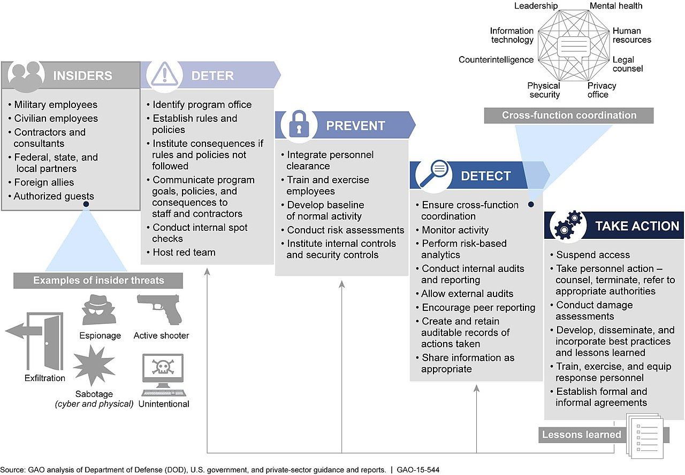
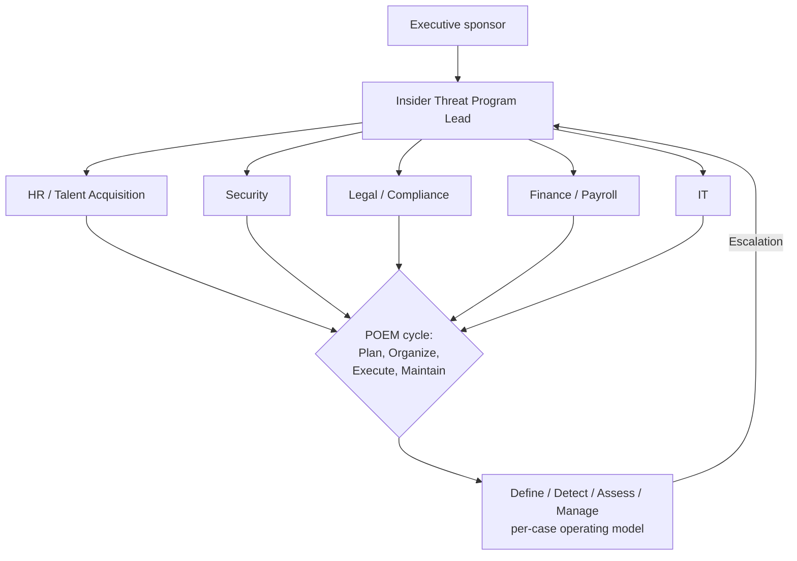
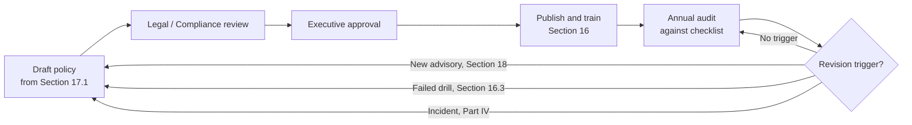

# Part 5: Hardening and Best Practices

[Back to Handbook contents](index.md) | [Series index](../index.md)

Parts II through IV gave an organization the individual controls: how to source and interview, how to harden a remote role, how to detect a compromised hire, and how to respond once one is found. Part 5 turns those controls into a program: a named governance structure that owns them, a training curriculum that keeps the people running them current, policy documents that survive staff turnover, and a discipline for tracking the advisories that keep changing the threat picture. Nothing here replaces the mechanics in Parts II to IV; it is the scaffolding that keeps those mechanics from decaying into a one-time response to whichever incident prompted them.

---

## 15. Organizational Defenses

A control with no owner erodes the moment the person who built it moves teams. This chapter sets the governance, lifecycle, technical baseline, and collaboration structure that keeps the Democratic People's Republic of Korea (**DPRK**) IT worker and broader insider-threat controls from this handbook operating past their first year.

### 15.1 Program Governance: From Ad Hoc Response to a Named Function

Most organizations discover this **threat model** reactively: a suspicious hire, a near miss like the one KnowBe4 disclosed publicly, or a Rewards for Justice notice arrives, a task force forms, and the task force disbands once the immediate question is answered. That pattern leaves no standing owner for the next hire.

The [Cybersecurity and Infrastructure Security Agency (CISA)](https://www.cisa.gov/) publishes two documents that, read together, describe what a standing program looks like. The [Insider Threat Mitigation Guide](https://www.cisa.gov/resources-tools/resources/insider-threat-mitigation-guide) (November 2020) defines the operating model a program runs day to day: Define the threat for the organization, Detect and Identify concerning behavior, Assess it, and Manage it toward resolution, the same four-stage cycle referenced against a specific case in Part III Section 9.2. A newer CISA release, [Assembling a Multi-Disciplinary Insider Threat Management Team](https://www.cisa.gov/resources-tools/resources/assembling-multi-disciplinary-insider-threat-management-team) (January 28, 2026), sits one level above that: it structures how to build the team that runs the four-stage cycle, using a Plan, Organize, Execute, and Maintain (POEM) lifecycle and explicitly naming security, human resources (HR), legal, information technology (IT), and operations as the disciplines that must sit at the same table.

The [National Insider Threat Task Force (NITTF)](https://www.dni.gov/index.php/ncsc-how-we-work/ncsc-nittf)'s [Insider Threat Program Maturity Framework](https://www.dni.gov/files/NCSC/documents/news/20181101_NCSC_Press_Release-Maturity_Framework.pdf) (November 1, 2018) adds a maturity lens across six focus areas: senior official and program leadership, program personnel, employee training and awareness, access to information, monitoring user activity, and information integration, analysis, and response. It was written for U.S. federal agencies, but a crypto-native company can map its own program against the same six areas to see where it is still ad hoc.


*Figure. A U.S. Government Accountability Office breakdown of the phases and key elements a mature insider-threat program incorporates, the same kind of structured lifecycle the CISA POEM model and the NITTF maturity framework describe for a hiring-and-vendor program built on this handbook. Source: [U.S. GAO, GAO-15-544](https://commons.wikimedia.org/wiki/File:Figure_3-_GAO%27s_Framework_of_Key_Elements_To_Incorporate_at_Each_Phase_of_DOD%27s_Insider-Threat_Programs_(19259572132).jpg), public domain (U.S. federal government work).*

For the hiring-and-vendor context specifically, name a program lead who sits above any single hiring decision, and give that lead standing (not incident-triggered) representation from HR or talent acquisition, security, legal or compliance, finance or payroll (payment-destination changes are one of the strongest indicators in Part III Section 9.1), and IT (device and access provisioning). This is the same escalation triangle Part III Section 10.2 describes for a live incident, made permanent rather than assembled fresh each time.



*Figure 9. Standing program governance for hiring and vendor insider-threat risk. The POEM lifecycle (outer) builds and maintains the team; the Define/Detect/Assess/Manage cycle (inner) is what that team runs against each flagged case.*

### 15.2 Defense in Depth Across the Hiring-to-Offboarding Lifecycle

No single control in this handbook is sufficient against a well-resourced, state-linked operator; the [Skadden](https://www.skadden.com/insights/publications/2026/06/north-korean-remote-it) analysis cited in Part III explicitly frames pre-hire verification as necessary but not sufficient. What makes the program resilient is that each lifecycle stage's control draws on an independent signal from a different owner, so a miss at one stage does not cascade automatically into a miss at the next.

| Lifecycle stage | Primary control | Independent backstop | Owner | Handbook reference |
|---|---|---|---|---|
| Sourcing | Controlled channel distribution | Red-flag review at application intake | HR / Talent | Part II, Section 3 |
| Interview | Identity verification, camera-on requirement | Cross-panel consistency review | Hiring manager + HR | Part II, Section 4 |
| Vendor selection | Sanctions and due-diligence screening | Contract audit-rights clause | Procurement / Legal | Part II, Section 5 |
| Remote onboarding | Managed device, hardware multifactor authentication (MFA), address-to-identity match | Provisional least-privilege access | IT / Security | Part III, Section 7 |
| Ongoing employment | Behavioral and technical monitoring | Escalation triangle | Security / Manager | Part III, Sections 9 to 10 |
| Payment | Sanctions screening, verifiable payment rails | Mid-engagement re-screening | Finance | Part III, Section 8.2 |
| Offboarding | Notice-bypassing termination clause | Emergency device and credential revocation runbook | HR / IT / Security, aligned with Handbook 03 | Part III, Section 10.1 |

The backstop column is deliberately drawn from a different data source than the primary control it backs up: interview identity checks are backed by manager-visible payment behavior weeks or months later, not by a second identity check. A layered program treats that independence as the point, not a redundancy to be trimmed for efficiency.

### 15.3 Technical Control Baseline Tied to Personnel Risk

[NIST Special Publication 800-53 Revision 5](https://csrc.nist.gov/pubs/sp/800/53/r5/upd1/final) gives the control-catalog anchor most auditors and frameworks will expect this program to map against. PS-3 (Personnel Screening) requires screening before granting system access and rescreening on a schedule tied to the position's risk designation; PS-7 (External Personnel Security) extends the same obligation to contractors, vendor-supplied staff, and other non-employees, which is the exact population Part II Section 5 and Part III Section 8 cover.

Beyond the screening baseline, [Google Threat Intelligence Group and Mandiant's guidance on the threat cluster it tracks as UNC5267](https://cloud.google.com/blog/topics/threat-intelligence/mitigating-dprk-it-worker-threat) ("UNC" designates an uncategorized cluster in Mandiant's naming convention, later attributed with high confidence to **DPRK** IT worker operations) gives a concrete technical baseline that goes beyond identity screening into runtime monitoring of the managed device itself:

| Technical indicator | What it signals | Response |
|---|---|---|
| Multiple remote-administration tools on one endpoint (AnyDesk, TeamViewer, RustDesk, Chrome Remote Desktop, GoToRemote/LogMeIn) | Possible laptop-farm or KVM-relayed operation | Alert, restrict installation via device policy |
| Mouse-jiggler or activity-simulation software (for example, Caffeine) | Sustaining apparent activity across multiple simultaneous jobs | Alert, manual review |
| Egress through high-risk commercial VPN providers (Astrill VPN named specifically in Mandiant's reporting) | Location masking inconsistent with claimed residence | Flag session, cross-check against Part III Section 7.1's geolocation controls |
| IP-based keyboard-video-mouse (KVM) device signatures | Remote operator driving a device that should be operated locally | Escalate immediately, tie to Section 15.2's onboarding backstop |
| Hardware-bound MFA absent or bypassed | Credential or device sharing across operators | Block access, force re-enrollment |

Feed each hit into the same Security Information and Event Management (SIEM) or User and Entity Behavior Analytics (UEBA) pipeline Part III Section 9.2 describes, rather than standing up a parallel detection stack specific to this **threat model**; duplication is how detection logic silently drifts out of date.

### 15.4 Information Sharing and Industry Collaboration

No single company sees the full pattern. Google **Threat Intelligence** Group's tracking of a single operator running a dozen simultaneous personas across different employers, cited in Part III Section 8.1, only becomes visible in aggregate across organizations, not from one company's hiring pipeline in isolation.

Route confirmed or strongly suspected cases to the FBI's [Internet Crime Complaint Center (IC3)](https://www.ic3.gov/) and, for cases with a plausible link to **sanctions evasion** or a named facilitator network, to the [Rewards for Justice DPRK IT worker program](https://rewardsforjustice.net/rewards/north-korean-information-technology-it-workers/), which as of this writing offers rewards up to five million dollars for information disrupting these financial mechanisms through a Tor-based tips channel. Financial-sector organizations already routing phishing and fraud indicators through an Information Sharing and Analysis Center (ISAC) should extend that same channel to hiring-fraud indicators; crypto-native organizations without an existing ISAC relationship should build one, whether through a sector consortium or a bilateral arrangement with a security vendor's threat intelligence service, since this is precisely the kind of cross-company pattern that a single security team cannot reconstruct alone. Treat a public post-mortem like KnowBe4's as a model worth emulating rather than a liability to avoid: converting one company's near miss into another company's detection rule is the actual mechanism by which this defense improves industry-wide.

---

## 16. Training for Hiring Managers and HR

Controls only work if the people executing them recognize the pattern in front of them. This chapter builds the curriculum, cadence, and measurement discipline that keeps that recognition current.

### 16.1 Curriculum Design by Role

A single "watch out for North Korean IT workers" briefing under-trains the people who actually touch identity documents and over-trains people who never see a resume. Split the curriculum by the decision each role actually makes.

| Audience | Core competency | Format | Primary source material |
|---|---|---|---|
| Recruiters / sourcing | Channel hygiene, resume-pattern red flags (reused text, geography-versus-university mismatches) | E-learning module plus live workshop | [ASIS International, "Recruitment Red Flags: Spotting DPRK IT Remote Workers"](https://www.asisonline.org/security-management-magazine/latest-news/today-in-security/2025/may/recruitment-red-flags/) (May 2025); [IC3 PSA250723-4](https://www.ic3.gov/PSA/2025/PSA250723-4) |
| Hiring managers / interview panel | Spontaneous consistency questioning, camera-on enforcement | Live role-play and tabletop drills | Part II, Section 4; Part III, Section 9.1 (Kraken case) |
| HR / People Operations | Address-to-identity verification, payment-change escalation, employer-of-record versus direct-contractor risk | E-learning plus quarterly refresher | Part III, Sections 8.2 to 8.3 |
| IT / Security | Detecting the technical indicators in Section 15.3 | Hands-on lab against real endpoint detection and response (EDR) or UEBA tooling | Section 15.3; [Google Threat Intelligence Group](https://cloud.google.com/blog/topics/threat-intelligence/mitigating-dprk-it-worker-threat) |
| Finance / Payroll | Sanctions-list re-screening cadence, phantom-worker reconciliation | E-learning plus audit checklist | Part III, Section 8.2 |
| Legal / Compliance | Strict-liability sanctions exposure, contract clause enforcement | Briefing plus annual legal update | Part III, Section 8.3 |

### 16.2 Delivery Cadence and Simulated-Candidate Drills

Deliver role-specific training within the first thirty days for anyone newly assigned to a hiring, vendor-management, or onboarding function, then refresh quarterly for high-exposure roles (recruiters and hiring managers for engineering, treasury, or other source-access positions) and annually for lower-exposure roles. The Defense Counterintelligence and Security Agency's [Center for Development of Security Excellence (CDSE)](https://www.cdse.edu/) offers a useful external benchmark even for organizations with no federal obligation to use it: its **Insider Threat** Awareness course and its Insider Threat Program for Industry Curriculum (INT333.CU) demonstrate a defensible minimum training structure that a program can point to when justifying budget for its own curriculum.

Borrow the phishing-simulation model that security-awareness programs already use broadly and apply it to interviews: run a scripted mock candidate, played by a colleague or a red-team contractor, who exhibits known indicators, evasive camera behavior, an inability to answer a spontaneous question about a claimed city, an inconsistency between stated and verified education, and measure whether the panel catches it. This generalizes the real detections at Kraken and KnowBe4 (Part III, Section 9.1) into a repeatable exercise rather than treating them as historical anecdotes. [Google Threat Intelligence Group's guidance](https://cloud.google.com/blog/topics/threat-intelligence/mitigating-dprk-it-worker-threat) additionally recommends periodic mandatory camera-on spot checks with remote employees already on staff; schedule these on the same recurring calendar as the refresher training so neither becomes an afterthought.

### 16.3 Measuring Effectiveness

Untested training is a compliance artifact, not a working control. Track a small set of metrics and route them back to the governance function in Section 15.1: the catch rate on simulated-candidate drills across successive rounds, time-to-escalation on drills measured against KnowBe4's roughly twenty-five-minute real-world containment window as an aspirational floor (Part III, Section 9.1), the percentage of the trained population current on its refresher cadence, and the count of near-miss reports filed. A rising near-miss count is a positive signal in a mature program, not a negative one: it means the no-blame reporting culture Part III Section 11.2 calls for is functioning, and people are reporting uncertainty rather than suppressing it. When a specific panel or team underperforms on a drill, assign that team a targeted refresher immediately rather than waiting for its scheduled annual session; a fixed calendar should be the floor for training frequency, not the ceiling.

---

## 17. Policy Templates and Checklist

Verbal expectations do not survive a reorganization or a founder's departure. This chapter turns Parts II through IV, and the program structure in Chapter 15, into documents an organization can hand to a new hire, an auditor, or outside counsel.

### 17.1 Core Policy Documents and a Template Clause

Five documents cover the ground this handbook has established, each mapped to the control it operationalizes and, where applicable, the NIST 800-53 control family it satisfies:

| Policy document | Maps to | Satisfies |
|---|---|---|
| Remote and Overseas Hiring Identity Verification Policy | Part II, Section 4.2 | PS-3 |
| Vendor and Contractor Security Addendum | Part II, Section 5.2; Part III, Section 8.3 | PS-7 |
| Insider Threat Response and Escalation Policy | Part III, Sections 9 to 10; Handbook 06 | NITTF focus area 6 (integration, analysis, response) |
| Acceptable Communication Channel Policy | Part III, Section 7.3 | NITTF focus area 5 (monitoring user activity) |
| Payment and Banking Change-Control Policy | Part III, Section 8.2 | Sanctions and anti-money-laundering compliance |

The [SANS Institute Security Policy Project](https://www.sans.org/information-security-policy) provides a widely used free structure for drafting policy documents (purpose, scope, policy statement, enforcement, definitions); apply that same structure here rather than inventing a new format per document. A payment change-control clause, drawn from this handbook's own guidance rather than any specific organization's document, illustrates the pattern:

```text
POLICY: Payment and Banking Change-Control

PURPOSE
Prevent unverified redirection of contractor or employee payment
destinations, a documented mechanism in DPRK IT worker revenue
schemes (see IC3 PSA250723-4; OFAC designations, July 2024 onward).

SCOPE
All remote, overseas, and vendor-sourced personnel receiving
payment from the organization.

POLICY STATEMENT
1. Any request to change a payment destination (bank account,
   country, or cryptocurrency wallet) MUST be verified against
   government-issued identification on file before execution.
2. Requests to redirect payment to a new country, a third party,
   or a cryptocurrency wallet trigger MANDATORY escalation to the
   Insider Threat Program Lead (Section 15.1) before any change
   is executed.
3. No single approver may execute a payment-destination change
   without independent verification by a second reviewer.
4. All payment destinations are screened against OFAC's Specially
   Designated Nationals list and equivalent sanctions lists at
   initial setup and re-screened on [quarterly] cadence.

ENFORCEMENT
Violations are reviewed under the Insider Threat Response and
Escalation Policy.
```

### 17.2 Program Implementation Checklist

This checklist stands up or audits the program as a whole; it is distinct from Appendix C's per-hire operational checklist, which a hiring manager runs against a single requisition. Run this checklist once to launch the program and annually thereafter.

**Governance**

- [ ] Named **Insider Threat** Program Lead with standing authority to suspend access provisionally (Section 15.1)
- [ ] Multi-disciplinary team seated: HR, Security, Legal, Finance, IT (Section 15.1)
- [ ] Program mapped against the NITTF's six maturity focus areas, with gaps documented

**Technical**

- [ ] SIEM/UEBA rules deployed for the Section 15.3 technical indicator baseline
- [ ] PS-3 and PS-7 screening and rescreening cadence documented and enforced
- [ ] Escalation triangle (Part III, Section 10.2) tested against a tabletop scenario in the past twelve months

**Legal and Policy**

- [ ] All five Section 17.1 policy documents drafted, legally reviewed, and published
- [ ] **Vendor security** addenda executed with every active staffing and contracting vendor
- [ ] Notice-bypassing termination-for-cause clauses present in all overseas and remote contracts

**Training**

- [ ] Role-specific curriculum from Section 16.1 assigned to every relevant role
- [ ] At least one simulated-candidate drill run in the past twelve months, with results logged
- [ ] Near-miss reporting channel published and no-blame policy communicated



*Figure 10. Policy lifecycle. A published policy is never final; a new advisory, a failed training drill, or a live incident all route back to the drafting stage rather than accumulating as unincorporated exceptions.*

---

## 18. References to External Advisories and Resources

This chapter is a working reading list for the program built in this Part, organized by function rather than alphabetically. It is not the handbook's full bibliography; that lives in Appendix D. What belongs here is the smaller set of sources a program lead should track on an ongoing basis.

### 18.1 Primary Government and Law Enforcement Advisories

| Source | Document | Date | Covers |
|---|---|---|---|
| FBI / IC3 | [PSA250723-4, North Korean IT Worker Threats to U.S. Businesses](https://www.ic3.gov/PSA/2025/PSA250723-4) | July 23, 2025 | Updated mitigation list, reporting instructions |
| FBI / IC3 | [PSA250123, North Korean IT Workers Conducting Data Extortion](https://www.ic3.gov/PSA/2025/PSA250123) | January 23, 2025 | Escalation from access fraud to extortion |
| U.S. State Department, FBI, and allied governments (Japan, Canada, Germany, Australia, UK, Republic of Korea) | [Alert to Countries, Companies, and Other Entities Regarding North Korean IT Workers](https://www.state.gov/releases/office-of-the-spokesperson/2026/07/alert-to-countries-companies-and-other-entities-regarding-north-korean-it-workers/) | July 31, 2026 | Coordinated multinational warning, AI-enabled impersonation tactics |
| U.S. Treasury, Office of Foreign Assets Control (OFAC) | [Sanctions designations on DPRK IT worker facilitator networks](https://www.globalsecurity.org/wmd/library/news/dprk/2025/dprk-250724-treasury01.htm) | Rolling, from July 2024 | Screening targets for Section 15.4 and 17.1 payment controls |
| U.S. Department of Justice (DOJ) | Multi-defendant indictment and sentencing press releases | Rolling | Prosecutorial precedent and case-level detail |
| U.S. Department of State, Rewards for Justice | [Reward offer for information on North Korean IT companies, IT workers, and related money laundering](https://rewardsforjustice.net/rewards/north-korean-information-technology-it-workers/) | Ongoing | Reporting incentive and secure tip channel |

### 18.2 Standards, Frameworks, and Threat Intelligence Resources

| Source | Document | Covers |
|---|---|---|
| NIST | [SP 800-53 Revision 5](https://csrc.nist.gov/pubs/sp/800/53/r5/upd1/final), controls PS-3 and PS-7 | Personnel and external-personnel screening control catalog |
| NIST | [SP 800-207](https://csrc.nist.gov/pubs/sp/800/207/final) | Zero trust architecture underlying Part III's access model |
| CISA | [Insider Threat Mitigation Guide](https://www.cisa.gov/resources-tools/resources/insider-threat-mitigation-guide) | Define/Detect/Assess/Manage operating model |
| CISA | [Assembling a Multi-Disciplinary Insider Threat Management Team](https://www.cisa.gov/resources-tools/resources/assembling-multi-disciplinary-insider-threat-management-team) | POEM team-building framework (Section 15.1) |
| NITTF / Office of the Director of National Intelligence | [Insider Threat Program Maturity Framework](https://www.dni.gov/files/NCSC/documents/news/20181101_NCSC_Press_Release-Maturity_Framework.pdf) | Six-focus-area maturity model |
| ASIS International | ["Recruitment Red Flags: Spotting DPRK IT Remote Workers"](https://www.asisonline.org/security-management-magazine/latest-news/today-in-security/2025/may/recruitment-red-flags/) | Recruitment-stage indicator guidance |
| Google Threat Intelligence Group / Mandiant | ["Staying a Step Ahead: Mitigating the DPRK IT Worker Threat"](https://cloud.google.com/blog/topics/threat-intelligence/mitigating-dprk-it-worker-threat) | UNC5267 technical detection indicators |
| Mandiant | [M-Trends 2026](https://cloud.google.com/security/resources/m-trends-executive-edition) | Dwell-time and broader threat-landscape context |
| DCSA / CDSE | [Insider Threat training curriculum](https://www.cdse.edu/) | External training benchmark (Section 16.2) |
| SANS Institute | [Security Policy Project](https://www.sans.org/information-security-policy) | Policy-drafting structure (Section 17.1) |

### 18.3 Building an Advisory-Monitoring Practice

Three separate FBI/IC3 public service announcements and one coordinated multinational joint alert landed inside roughly eighteen months through mid-2026 alone; a handbook chapter read once at program launch is stale within a year. Treat advisory monitoring as an assigned, recurring responsibility rather than a one-time read.

Name an owner, typically the **Insider Threat** Program Lead from Section 15.1, responsible for subscribing to IC3 industry alerts, CISA advisories, and OFAC recent-actions notifications. Set a fixed triage cadence (monthly is reasonable for routine updates) with an immediate ad hoc review triggered by any newly named multinational joint alert or OFAC designation touching an active vendor relationship. Route every substantive update through the Section 17.2 policy-lifecycle "revision trigger" rather than letting it sit unread in a distribution list, and log the review decision, including a decision that no changes are needed, the same way Part III Section 10.2 calls for logging escalation decisions. An auditable monitoring practice is what turns this chapter from a reading list into an operating control.

---

**Key controls for Part 5**

- Name a standing, multi-disciplinary Insider Threat Program Lead and team (HR, Security, Legal, Finance, IT) rather than assembling one only after an incident; benchmark against CISA's POEM framework and the NITTF's six maturity focus areas.
- Treat each hiring-to-offboarding lifecycle stage's control as independent from the next stage's backstop, so a single missed signal does not cascade.
- Deploy the technical indicator baseline (remote-admin tool co-installation, mouse-jiggler software, high-risk VPN egress, KVM signatures) into the same SIEM/UEBA pipeline Part III already runs, mapped to NIST SP 800-53 PS-3 and PS-7.
- Split training by role, run simulated-candidate drills on the same cadence as refresher training, and measure catch rate and time-to-escalation rather than only completion percentage.
- Publish the five core policy documents using a SANS-style structure, and run the program implementation checklist annually, distinct from the per-hire checklist in Appendix C.
- Assign a named owner to monitor FBI, IC3, CISA, State Department, and OFAC advisories on a fixed cadence, and route every substantive update through the policy-revision trigger.

