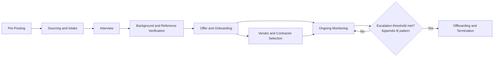

# Part 6: Appendices

[Back to Handbook contents](index.md) | [Series index](../index.md)

This closing part converts the handbook into a reference you can reach for during a live hiring decision, not only read once. Appendix A fixes the vocabulary that Parts I through V use throughout, so a term like IAL2 or **laptop farm** means the same thing whether an HR reviewer or a security analyst is reading it. Appendix B pulls every red flag scattered across the preceding chapters into a single scored table, and Appendix C turns the whole handbook into a copy-ready checklist you can drop into an applicant tracking system or a vendor onboarding runbook. Appendix D points to the full bibliography.

---

## 19. Appendix A: Glossary

A shared vocabulary matters more in this handbook than in most, because the threat it addresses sits at the intersection of HR practice, security operations, and international sanctions law, three disciplines that do not normally share a dictionary. An HR reviewer who does not know what an IP-based KVM (keyboard-video-mouse) device is cannot recognize the **laptop farm** pattern from a shipping-address anomaly, and a security analyst who does not know what "adverse action" means under the Fair Credit Reporting Act (FCRA) can recommend a background-check process that creates legal exposure rather than closing a security gap. The terms below are grouped by the discipline they come from and defined the way they are used in this handbook, not in the abstract; where a term has an authoritative source, the definition links to it.

**Threat actors, groups, and frameworks**

| Term | Definition |
|---|---|
| DPRK | Democratic People's Republic of Korea (North Korea), the state whose Reconnaissance General Bureau (RGB) directs the IT worker fraud schemes this handbook is built around. |
| Facilitator | A person, witting or unwitting, typically U.S.-based, who receives a company-issued laptop, hosts it in a "laptop farm," relays payment, or otherwise fronts as the visible worker for an overseas operator ([DOJ, June 2025](https://www.justice.gov/opa/pr/justice-department-announces-coordinated-nationwide-actions-combat-north-korean-remote)). |
| Laptop farm | A residence or small office where facilitators receive victim companies' shipped laptops and connect them to remote-access hardware so an overseas operator can work through them, as documented in the [Christina Chapman prosecution](https://therecord.media/arizona-woman-sentenced-north-korean-laptop-farm) spanning more than 300 companies. |
| Lazarus Group | A North Korean state-sponsored threat cluster active since at least 2009, tracked by MITRE ATT&CK as [Group G0032](https://attack.mitre.org/groups/G0032/) under aliases including HIDDEN COBRA and Diamond Sleet; the broad umbrella name researchers use when a specific North Korean sub-cluster is not distinguished. |
| APT38 | The MITRE ATT&CK-tracked North Korean financial-crime cluster ([Group G0082](https://attack.mitre.org/groups/G0082/)), attributed to the RGB, known for the 2016 Bank of Bangladesh heist and tracked by other vendors under aliases including Bluenoroff and Stardust Chollima. |
| Famous Chollima | CrowdStrike's designation for the North Korean cluster specializing in IT worker insider threat operations at scale, part of a "Chollima" naming family (a mythical winged horse in Korean folklore) CrowdStrike uses for DPRK-linked actors ([CrowdStrike adversary profile](https://www.crowdstrike.com/en-us/adversaries/famous-chollima/)). |
| UNC5267 | Google Threat Intelligence Group's (formerly Mandiant's) tracking designation for the DPRK IT worker cluster, documented operating personas across employers in multiple countries simultaneously ([Google Cloud, 2024](https://cloud.google.com/blog/topics/threat-intelligence/mitigating-dprk-it-worker-threat)). |
| AADAPT | Adversarial Actions in Digital Asset Payment Technologies, a MITRE knowledge base of adversary tactics and techniques against cryptocurrency and digital-asset systems, launched July 2025 and modeled on MITRE ATT&CK ([MITRE news release](https://www.mitre.org/news-insights/news-release/mitre-introduces-aadapt-cybersecurity-framework-cryptocurrency); [GitHub](https://github.com/mitre/AADAPT)). |
| DPRK RevGen: Domestic Enabler Initiative | A March 2024 joint effort of the U.S. Department of Justice's National Security Division and the FBI's Cyber and Counterintelligence Divisions targeting U.S.-based facilitators of DPRK revenue-generation schemes ([DOJ](https://www.justice.gov/opa/pr/justice-department-announces-coordinated-nationwide-actions-combat-north-korean-remote)). |

**Identity, verification, and access**

| Term | Definition |
|---|---|
| Identity Assurance Level (IAL) | A three-tier scale from [NIST SP 800-63A Revision 4](https://pages.nist.gov/800-63-4/sp800-63a/ial/) measuring identity-proofing strength. IAL1 now requires identity evidence, authoritative or credible-source attribute validation, and evidence-ownership verification; it is not self-asserted. IAL2 raises evidence and verification requirements and offers non-biometric, biometric, and digital-evidence pathways. IAL3 requires on-site attended proofing (including a CSP-controlled kiosk with a remote agent) and biometric collection. An organization must assess the complete outcome and pathway, not infer an IAL from a document scan or selfie alone. |
| Zero trust architecture | A security model, formalized in [NIST SP 800-207](https://csrc.nist.gov/pubs/sp/800/207/final), that replaces one-time network perimeter trust with continuous, per-session verification and explicit least-privilege access regardless of the requester's network location. |
| Least privilege | The practice of granting the minimum access needed for a current task and expanding only on demonstrated, approved need, the default provisioning posture this handbook recommends for every remote or overseas hire. |
| Mobile device management (MDM) | Enterprise software that enrolls, configures, monitors, and can remotely wipe company-issued devices, the baseline case for remote hardware under [NIST SP 800-46 Rev. 2](https://csrc.nist.gov/pubs/sp/800/46/r2/final). |
| Employer of Record (EOR) | A third-party organization that formally employs a worker on a client company's behalf in a jurisdiction where the client lacks a local entity, adding an independent know-your-customer (KYC) and payroll-compliance layer to an overseas engagement. |
| Named-individual clause | A contract term requiring a vendor to identify the specific person performing work and to seek written approval and re-verification before substituting anyone else, the primary control against undisclosed facilitator substitution (Section 5.2). |
| Sensitivity tier | A classification applied to a role based on what its access can reach (source code, production systems, treasury or key-custody functions), used to scale verification depth and access staging (Section 6.3). |
| Provisional access | Access granted for a defined initial period, typically 30 to 90 days, under tighter logging and a lower threshold for review before it converts to standing access. |

**Technical indicators and tooling**

| Term | Definition |
|---|---|
| IP-based KVM | A keyboard-video-mouse device that streams a physical machine's console over IP, letting a remote operator control a laptop physically located elsewhere, the core hardware enabling the laptop-farm pattern. |
| Mouse jiggler | Software (Mandiant's reporting names one variant "Caffeine") that simulates activity on an idle workstation to keep multiple job accounts appearing active simultaneously, consistent with one operator holding several concurrent positions ([Google Cloud, 2024](https://cloud.google.com/blog/topics/threat-intelligence/mitigating-dprk-it-worker-threat)). |
| Residential proxy | A proxy service that routes traffic through IP addresses assigned to consumer internet connections, used to mask an operator's true location behind an address that looks like an ordinary home user. |
| Impossible travel | A detection rule that flags two logins from the same account at locations no legitimate traveler could reach in the elapsed time between them. |
| SIEM | Security information and event management, the log-aggregation and alerting platform that correlates the technical indicators in Appendix B into a reviewable queue. |
| UEBA | User and entity behavior analytics, tooling that baselines normal account behavior and flags statistically anomalous deviation, such as a sudden bulk repository clone. |
| DLP | Data loss prevention, controls that detect or block unusual data egress, such as large transfers to personal cloud storage or messaging apps. |
| Deepfake | Synthetic audio or video generated or altered by machine learning to impersonate a real person, used in DPRK IT worker interviews to mask a stand-in's true face or voice. |
| Face-swapping | A specific deepfake technique that overlays one person's face onto another's video feed in real time, the technique the FBI's [July 2025 advisory](https://www.ic3.gov/PSA/2025/PSA250723-4) recommends probing for with profile-turn and hand-wave prompts. |

**Legal, financial, and compliance**

| Term | Definition |
|---|---|
| OFAC | The U.S. Treasury's Office of Foreign Assets Control, which administers sanctions programs and maintains the Specially Designated Nationals (SDN) list ([sanctions list search tool](https://ofac.treasury.gov/sanctions-list-search-tool)). |
| SDN list | The Specially Designated Nationals and Blocked Persons list, a roster of individuals and entities U.S. persons are generally prohibited from transacting with; several DPRK IT worker fronts and facilitators have been formally designated to it. |
| Strict liability (sanctions) | A legal standard under which a violation of U.S. sanctions law can attach regardless of the violator's knowledge or intent, meaning a company can face OFAC exposure for engaging an SDN-listed party even unknowingly. |
| FCRA | The Fair Credit Reporting Act, the U.S. federal law governing background checks run through third-party consumer reporting agencies, requiring disclosure, authorization, and an adverse-action process before declining a candidate on report contents ([FTC guidance](https://www.ftc.gov/business-guidance/resources/using-consumer-reports-what-employers-need-know)). |
| GDPR | The General Data Protection Regulation, the European Union framework that classifies criminal-record data under special processing constraints and gives candidates access and erasure rights over verification data collected about them ([EUR-Lex consolidated text](https://eur-lex.europa.eu/legal-content/EN/TXT/HTML/?uri=CELEX:02016R0679-20160504); [Article 10](https://gdpr-info.eu/art-10-gdpr/)). |
| Misclassification | Treating a worker who functions as an employee (integrated into the team, taking day-to-day direction, engaged long-term) as an independent contractor, exposing the company to back taxes, statutory-benefit claims, and director liability in a growing number of jurisdictions. |
| Phantom worker | A name that remains active in payroll records after the underlying work relationship should have ended, or an unauthorized entry inserted by a facilitator, caught by periodic headcount-to-payroll reconciliation. |
| Insider threat | A person with authorized access who uses that access, intentionally or through negligence, to cause harm; the Cybersecurity and Infrastructure Security Agency (CISA) structures mitigation around four stages: Define, Detect and Identify, Assess, and Manage ([CISA Insider Threat Mitigation Guide](https://www.cisa.gov/resources-tools/resources/insider-threat-mitigation-guide)). |
| Termination for cause | Contract or employment termination triggered by a defined breach (security policy violation, sanctions exposure, fraud), typically bypassing the notice period a routine separation would require. |

---

## 20. Appendix B: Red Flags and Indicators (Summary)

Parts I through III each surface red flags in the context where they appear, a recruitment advisory in Part I, an interview signal in Part II, a post-hire behavior in Part III. Read in sequence, that placement makes sense; read in a live hiring decision, it means a reviewer has to remember which chapter held which indicator. This appendix collects every indicator into one table, organized by the stage of the relationship where it typically surfaces, so a hiring manager or security analyst can scan a single reference during an active case rather than re-reading three parts.

No single row in this table is proof of fraud on its own. The [FBI/IC3 advisory series](https://www.ic3.gov/PSA/2025/PSA250723-4) and CrowdStrike's Famous Chollima tracking, spanning [more than 320 companies infiltrated in a single year](https://www.crowdstrike.com/en-us/adversaries/famous-chollima/), consistently describe a pattern-matching problem, not a single-signal one: a candidate in a different time zone with occasional connectivity issues is not automatically suspect, but a candidate who accumulates rows across three or more categories below has crossed the threshold this handbook recommends for escalation rather than continuation.

| Stage | Category | Indicator | Handbook reference |
|---|---|---|---|
| Recruitment | Sourcing | Application arrives through a general freelance marketplace or unsolicited crypto-Discord outreach for a sensitive role | Part II, 3.2 |
| Recruitment | Contact reuse | Phone number, email, or bank routing detail matches a different "unrelated" applicant in the intake log | Part II, 4.3 |
| Interview | Technical | Below-average code quality or unfamiliarity with concepts the claimed seniority level should know cold | Part II, 4.4 |
| Interview | Technical | Heavy reliance on AI coding tools to explain the candidate's own submitted work | Part II, 4.4 |
| Interview | Behavioral | Reluctance to enable camera, or camera enabled only briefly and then disabled | Part II, 4.2, 4.4 |
| Interview | Behavioral | Refuses a second, unscripted video call after passing a scripted first round | Part II, 4.2 |
| Interview | Behavioral | Lip-sync lag, lighting seams, or blink irregularities suggesting a real-time deepfake overlay | Part II, 4.2 |
| Interview | Behavioral | Cannot answer spontaneous location-specific questions (nearby landmarks, local weather, time-zone math) | Part II, 4.2; Part III, 9.1 |
| Interview | Logistics | Requests shipment of a company laptop to an address that does not match the identification document | Part II, 4.4; Part III, 7.1 |
| Interview | Financial | Payment or banking details that partially match another applicant's record | Part II, 4.4 |
| Post-hire | Network | Login geolocation does not match the shipping address on file, or shifts implausibly between sessions | Part III, 7.1, 9.1 |
| Post-hire | Network | Traffic through commercial VPN or residential-proxy exit nodes, or KVM-over-IP signatures on a device that should be operated locally | Part III, 7.1, 9.1 |
| Post-hire | Network | Working hours map cleanly to a DPRK/China-adjacent time zone rather than the claimed residence | Part III, 7.1, 9.1 |
| Post-hire | Network | Unauthorized remote-administration software (AnyDesk, TeamViewer, RustDesk, Chrome Remote Desktop) appears shortly after provisioning | Part II, 4.5 |
| Post-hire | Access | Requests for elevated privileges shortly after hire, beyond what the assigned role requires | Part III, 9.1 |
| Post-hire | Access | Unusual data access: bulk repository clones, broad document searches unrelated to assigned tasks | Part III, 9.1 |
| Post-hire | Communication | Persistent avoidance of camera-on meetings or voice calls after hire | Part III, 7.3, 9.1 |
| Post-hire | Communication | Push to move work discussion to unmonitored personal messaging apps | Part III, 7.3, 9.1 |
| Post-hire | Identity | Voice, appearance, or writing style shifts noticeably across sessions | Part III, 9.1 |
| Post-hire | Financial | Mid-engagement request to change payment destination, especially to a new country or a crypto wallet | Part III, 8.2, 9.1 |
| Post-hire | Financial | Bank account name mismatched to identity documents on file | Part III, 8.2, 9.1 |
| Post-hire | Output | Work quality does not match stated experience level, in either direction | Part III, 9.1 |
| Vendor | Contractual | Staffing vendor cannot or will not disclose its own per-contractor identity verification workflow | Part II, 5.1 |
| Vendor | Sanctions | A vendor relationship routes payment through an entity subsequently added to the OFAC SDN list | Part III, 11.1 |

Treat this table as a scoring input, not a scoring formula: a documented process (Part II, 4.3) that logs which rows were checked and which fired is what turns a subjective hunch into a defensible, auditable decision if a placement is later challenged.

---

## 21. Appendix C: Hiring and Vendor Security Checklist

This checklist is built to be copied directly into an applicant tracking system template, a vendor onboarding runbook, or a hiring-manager job aid. Each phase lists the minimum actions Parts II and III establish as controls, not aspirational best practice; skipping an item should be a documented, named exception, not a silent gap. Phase ownership follows the split the README sets out: HR and hiring managers own Pre-Posting through Offer, security and IT own Device Provisioning and Ongoing Monitoring, and legal or compliance signs off on Vendor Contract and Termination.

**Pre-Posting**

- [ ] Role sensitivity tier assigned (Tier 1/2/3, Section 6.3) before the requisition opens
- [ ] Posting channel confirmed as owned (careers page/ATS) or a named, vetted recruiting partner
- [ ] High-risk sourcing (general freelance marketplaces, unsolicited crypto job boards) excluded for Tier 2/3 roles, or a documented compensating-control decision is on file

**Sourcing and Application Intake**

- [ ] Application routed into a single system of record (no scattered email-only applications)
- [ ] Duplicate-detection pass run against phone number, email, and payment details before scheduling an interview
- [ ] Recruiter or platform account identity verified through a channel the candidate did not supply

**Interview**

- [ ] Live, camera-on video required for every round; no virtual backgrounds obscuring the frame
- [ ] At least one round includes spontaneous, unscripted questions and a location-verification prompt (profile turn, hand wave, point camera at surroundings)
- [ ] Identity proofing provider records a complete NIST IAL2 outcome: sufficient evidence, validation sources, verification pathway, proofing type, exceptions, and result; a document scan plus selfie alone is not treated as the definition
- [ ] Name screened against the OFAC SDN list and equivalent sanctions lists
- [ ] Technical assessment conducted live and proctored, not solely asynchronous
- [ ] Interviewer notes logged in the ATS, not personal messages or memory
- [ ] Red-flag table (Appendix B) reviewed by the panel before an offer decision

**Background and Reference Verification**

- [ ] Jurisdiction-appropriate legal constraints confirmed (FCRA disclosure/authorization in the U.S.; GDPR lawful basis and proportionality assessment in the EEA)
- [ ] Education verified through an institutional service, not a candidate-supplied document
- [ ] Employment references called at the institution's published main number, not a number the candidate or reference supplied

**Offer and Onboarding**

- [ ] Sensitivity-tier verification floor met before an offer is extended (Section 6.3 table)
- [ ] Device shipment address matches the verified identification document; deviation escalated, not accommodated
- [ ] MDM-managed hardware issued for any role touching source code, customer data, or funds
- [ ] Hardware-bound MFA (FIDO2 key or platform authenticator) enrolled to the shipped device
- [ ] Least-privilege, provisional access granted (30-90 day review window); no standing elevated access on day one

**Vendor and Contractor Selection**

- [ ] Vendor discloses its own per-contractor identity-verification workflow, subject to audit
- [ ] Contract includes a named-individual, no-substitution clause with re-verification on any personnel change
- [ ] Contract prohibits connecting client-accessed equipment through third-party KVM or remote-administration hardware
- [ ] Contract includes audit and monitoring rights over system usage and activity logs
- [ ] Contract includes immediate, notice-bypassing termination for cause tied to security policy violation or suspected fraud

**Ongoing Monitoring**

- [ ] Conditional access alerts configured for geolocation/shipping-address mismatch, VPN/proxy egress, and concurrent-session anomalies
- [ ] Unannounced video verification scheduled on a cadence proportional to access sensitivity (monthly for privileged roles, quarterly otherwise)
- [ ] Payment destination re-screened against sanctions lists on a recurring basis, not only at contract signing
- [ ] Headcount reconciled against payroll on a schedule to catch phantom or unauthorized entries
- [ ] Named escalation owner defined at the intersection of HR, security, and legal for hiring-and-vendor-linked concerns

**Offboarding and Termination**

- [ ] Contract substitution treated as a new-hire event: re-verification and provisional access reset, not a lifecycle no-op
- [ ] Sanctions hit or law-enforcement inquiry triggers emergency offboarding, bypassing standard notice periods
- [ ] Device retrieval, remote-wipe confirmation, and credential rotation scheduled explicitly for non-co-located personnel
- [ ] Escalation decision, including a decision not to act, documented for future pattern correlation

*Figure 9. The checklist phases as sequential gates. Ongoing Monitoring is a loop, not a terminal step: every phase after onboarding feeds back into it until either the engagement ends normally or an escalation triggers Offboarding and Termination.*

---

## 22. Appendix D: References, Advisories, and Further Reading

Every source cited across Parts I through VI, government advisories, standards documents, incident post-mortems, and vendor threat-intelligence reporting, is collected in [`references.md`](references.md), grouped into Standards and Frameworks, Incidents and Case Studies, Tools, and Further Reading, per the [series conventions](../index.md#about-the-series). Use it as the citation index when you need the primary source behind a claim in this handbook, when a link in the body has gone stale, or when you are building an internal policy document and need to cite the underlying FBI, CISA, IC3, DOJ, OFAC, or NIST publication directly rather than this handbook's summary of it. Advisories in this space update on a rolling basis, so treat `references.md` as the starting point for a fresh check against the issuing agency's own site rather than a permanently current mirror.

---

**Key controls for Part 6**

- Use Appendix A's terms consistently across HR, security, and legal documentation so a single incident report reads the same way to every function that touches it.
- Run Appendix B's consolidated indicator table as a scored review, not a single-flag veto; escalate on clustering across categories.
- Lift Appendix C directly into your ATS or vendor-onboarding tooling as a gating checklist, with named exceptions logged rather than silently skipped.
- Treat `references.md` (Appendix D) as the live citation index and re-verify time-sensitive advisories against the issuing agency before relying on a cached figure.

---

[Back to Handbook contents](index.md)
