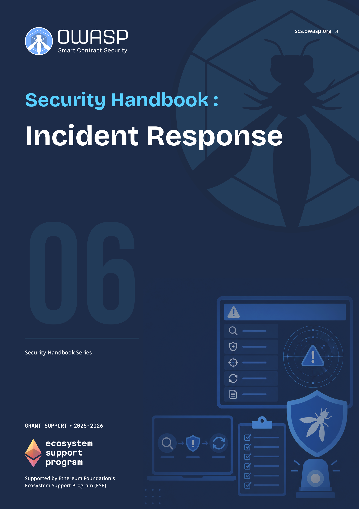

# OWASP SCS Incident Response Handbook

  
  

    <a class="handbook-series-link" href="../">← All handbooks</a>
    
Handbook 06 · 105 PDF pages

    
Build a Web3-ready response capability with clear roles, detection, communications, containment, playbooks, and exercises.

    

      <a href="../pdfs/06-incident-response.pdf" target="_blank" rel="noopener">Open PDF</a>
      <a href="../pdfs/06-incident-response.pdf" download>Download PDF</a>
    

  

**OWASP Smart Contract Security Project**

Part of the [OWASP SCS Handbook Series](../index.md). Built to the series [conventions](../index.md#about-the-series).

## Purpose and Scope

This handbook prepares security teams, protocol operators, and incident responders to detect, contain, and recover from security incidents that hit smart contracts, protocols, infrastructure, and the people who run them. It follows the National Institute of Standards and Technology (NIST) Special Publication (SP) 800-61 Revision 3 model, aligned to the Cybersecurity Framework (CSF) 2.0 Community Profile: **incident response** as a continuous cycle across Govern, Identify, Protect, Detect, Respond, and Recover, not a document that only gets opened once an alert fires. Supplemental NIST guidance on log management (SP 800-92 Rev. 1), event recovery (SP 800-184), and threat information sharing (SP 800-150) fills in implementation detail the core publication leaves to the reader.

The handbook works through communication strategy (who talks to whom, when, and on which channel), detection and response mechanics (on-chain monitoring, triage, evidence collection, **containment**), and a library of incident-specific playbooks: smart contract and protocol hacks, wallet drainer and phishing campaigns, malware and compromised endpoints, insider threats and nation-state-style attacks including vectors attributed to the Democratic People's Republic of Korea (DPRK), and the coordination patterns unique to decentralized teams with no single **incident commander**. It closes with the lessons-learned loop that feeds fixes back into playbooks and detection rules, because an incident response plan that never changes after an incident is not really a plan.

## Target Audience

Security specialists, operations and strategy leads, DevOps and site reliability engineering (SRE) staff, protocol teams, and anyone holding **incident response** or crisis coordination duties inside a Web3 organization.

## How to Use This Handbook

Start with Part I to fix the **incident response** lifecycle, team roles, and how this handbook maps to the SCS verification and testing standards. Part II sets the internal and external communication rules that hold regardless of incident type. Part III is the operational core: detection sources, triage, evidence collection, and **containment** mechanics. Part IV is the playbook library, one chapter per incident type, from a live protocol hack to an insider threat; pull the matching playbook the moment an incident is declared. Part V closes the loop with post-incident review and continuous improvement, and the appendices hold the glossary, severity matrix, tool list, and message templates a responder needs mid-incident. A team already mid-incident should skip straight to Part IV and the templates in Appendix D.

## Relationship to SCSVS, SCSTG, and SCWE

This handbook complements the OWASP smart contract standards rather than duplicating them. The Smart Contract Security Verification Standard (SCSVS) defines the controls a system must satisfy before an incident; the detection, monitoring, and evidence-collection requirements here are the operational counterpart for the moment one of those controls fails anyway. The Smart Contract Security Testing Guide (SCSTG) describes how to test for weaknesses before deployment; the playbooks in Part IV describe what to do when a weakness the testing guide catalogs gets exploited in production instead. The Smart Contract Weakness Enumeration (SCWE) names the root-cause weakness classes; this handbook's job starts at the moment one of those classes turns into a live incident. The EVM Forensics and DeFi Recovery Handbook (04) picks up the post-incident chain analysis and fund-recovery work referenced throughout the playbooks here, and the Web3 Attack Vectors Mapping Handbook (10) supplies the WA01 to WA15 taxonomy used to classify an incident once it has been triaged.

## Contents

**Part I: Foundations**
- [1. Introduction to Incident Management](part1-foundations.md#1-introduction-to-incident-management)
- [2. Incident Response Lifecycle](part1-foundations.md#2-incident-response-lifecycle)
- [3. Roles and Responsibilities](part1-foundations.md#3-roles-and-responsibilities)

**Part II: Communication Strategies**
- [4. Communication During Incidents](part2-communication-strategies.md#4-communication-during-incidents)

**Part III: Detection and Response**
- [5. Incident Detection](part3-detection-and-response.md#5-incident-detection)
- [6. Incident Response Procedures](part3-detection-and-response.md#6-incident-response-procedures)
- [7. Preparation Checklist](part3-detection-and-response.md#7-preparation-checklist)

**Part IV: Playbooks**
- [8. Playbook Overview](part4-playbooks.md#8-playbook-overview)
- [9. Smart Contract and Protocol Hack](part4-playbooks.md#9-smart-contract-and-protocol-hack)
- [10. Wallet Drainer and Phishing Incidents](part4-playbooks.md#10-wallet-drainer-and-phishing-incidents)
- [11. Malware and Compromised Endpoints](part4-playbooks.md#11-malware-and-compromised-endpoints)
- [12. Insider and Nation-State-Style Attacks (e.g., DPRK Vectors)](part4-playbooks.md#12-insider-and-nation-state-style-attacks-eg-dprk-vectors)
- [13. Decentralized Incident Response](part4-playbooks.md#13-decentralized-incident-response)
- [14. War Room and Crisis Coordination](part4-playbooks.md#14-war-room-and-crisis-coordination)
- [15. Safe Harbor and Whitehat Recovery](part4-playbooks.md#15-safe-harbor-and-whitehat-recovery)
- [16. Vulnerability Disclosure and Bug Bounty Linkage](part4-playbooks.md#16-vulnerability-disclosure-and-bug-bounty-linkage)

**Part V: Lessons Learned and Improvement**
- [17. Lessons Learned](part5-lessons-learned-and-improvement.md#17-lessons-learned)
- [18. Continuous Improvement](part5-lessons-learned-and-improvement.md#18-continuous-improvement)

**Part VI: Appendices**
- [19. Appendix A: Glossary](part6-appendices.md#19-appendix-a-glossary)
- [20. Appendix B: Severity and Triage Matrix](part6-appendices.md#20-appendix-b-severity-and-triage-matrix)
- [21. Appendix C: Suggested Tools and Platforms](part6-appendices.md#21-appendix-c-suggested-tools-and-platforms)
- [22. Appendix D: Message and Communication Templates](part6-appendices.md#22-appendix-d-message-and-communication-templates)
- [23. Appendix E: References and Further Reading](references.md)
