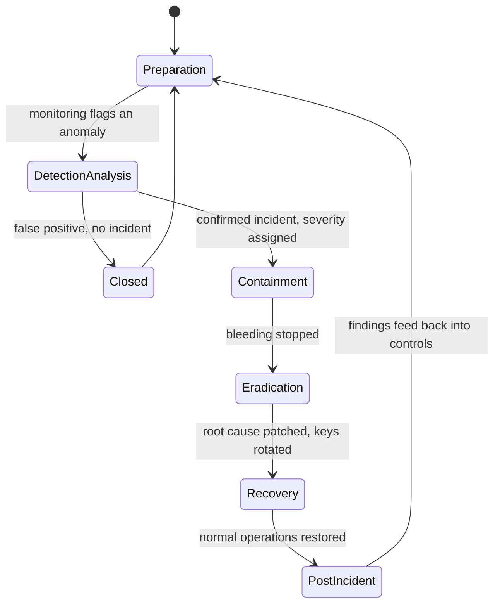
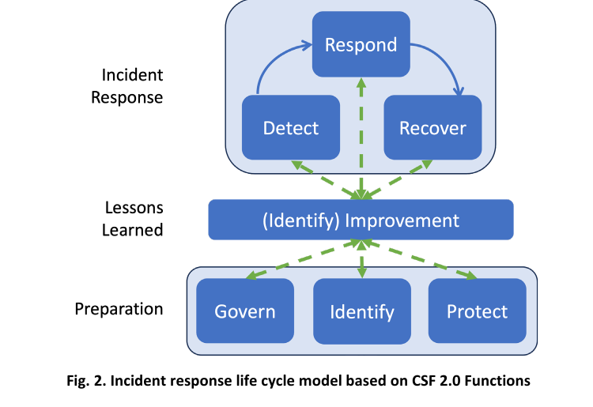
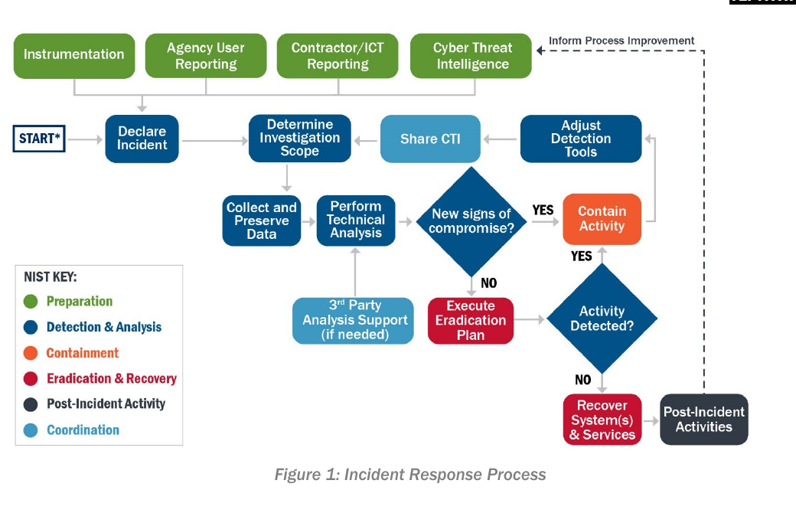
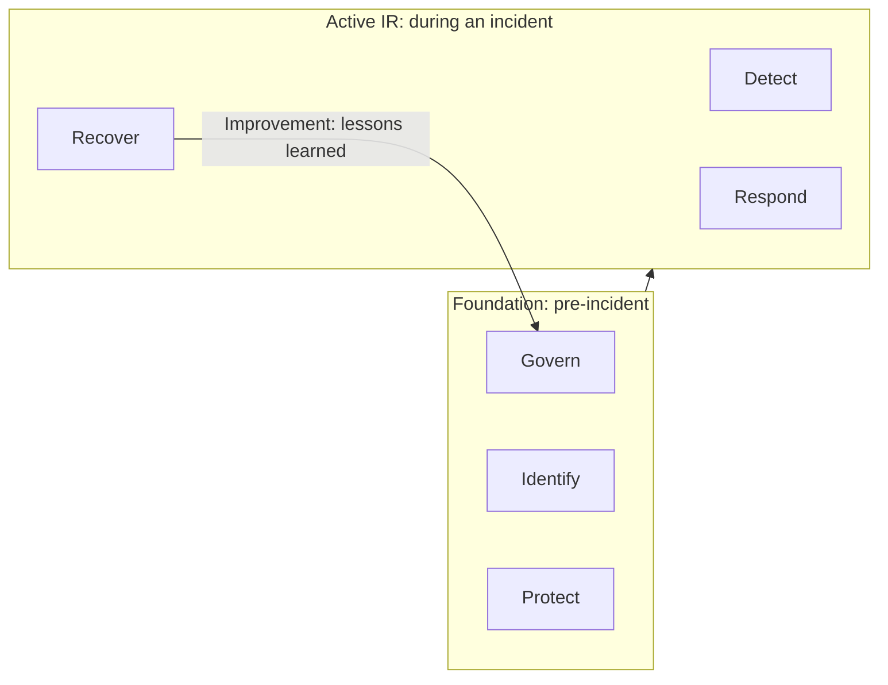
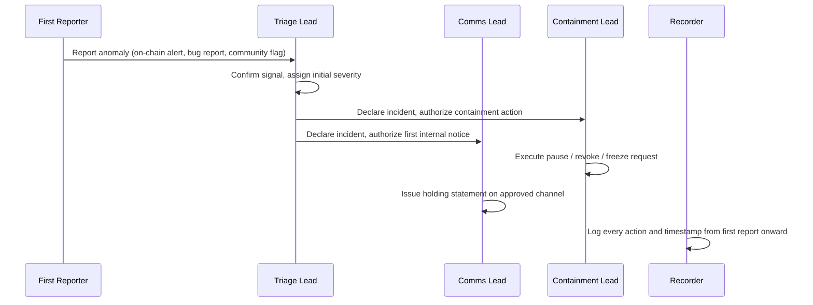

# Part 1: Foundations

[Back to Handbook contents](index.md) | [Series index](../index.md)

This part fixes the vocabulary a Web3 incident responder needs before an alert ever fires: the lifecycle model the rest of the handbook builds on, the specific goals that make a Web3 incident different from a conventional IT breach, and the team structure that turns a plan on paper into action at 3 a.m. It anchors that model in the National Institute of Standards and Technology (NIST) Special Publication (SP) 800-61 Revision 3 and the Cybersecurity Framework (CSF) 2.0, then translates each function into what it means for a protocol holding user funds on an irreversible ledger.

---

## 1. Introduction to Incident Management

### 1.1 Why Plan Before an Incident

An **incident response** plan (IRP) is insurance bought before the loss, not after. On-chain finality removes the safety nets a traditional breach responder relies on: there is no chargeback, no bank able to freeze a wire mid-flight, and no weekend grace period before an attacker converts stolen tokens into assets a court order cannot reach. Every minute spent deciding who is allowed to pause a contract, whose **multisig** signature is required, or what the first public statement should say is a minute the attacker does not have to wait for.

The Ronin Network bridge hack is the reference case for this chapter, because it shows exactly what an absent plan costs in time. An attacker forged five of nine required validator signatures, four from compromised Sky Mavis infrastructure and a fifth obtained through an Axie DAO gas-free transaction allowlist granted in November 2021 and never revoked, then drained roughly 173,600 ETH and 25.5 million USDC, about $624 million at the time ([Halborn incident analysis](https://www.halborn.com/blog/post/explained-the-ronin-hack-march-2022)). Nobody noticed until a user's withdrawal failed six days later ([Wikipedia, Ronin Network](https://en.wikipedia.org/wiki/Ronin_Network)); the FBI attributed the theft to the North Korea-linked Lazarus Group three weeks after that.

| Date | Event |
|------|-------|
| Nov 2021 | Axie DAO grants Sky Mavis a temporary gas-free signing allowlist |
| Dec 2021 | Allowlist program ends; the delegated authority is never revoked |
| Mar 23, 2022 | Attacker forges five of nine validator signatures, drains the bridge |
| Mar 29, 2022 | A user's failed withdrawal surfaces the breach, six days late |
| Apr 14, 2022 | FBI attributes the theft to the Lazarus Group |

Every failure in that table is a preparation failure, not a detection-tooling failure: an unrevoked permission nobody tracked, and no monitoring that would have flagged $624 million in unscheduled outflows in real time. Sections 2.2 and 3.1 turn each of those gaps into a control you put in place before, not during, your own incident.

### 1.2 Goals of Incident Response

NIST frames **incident response** goals around limiting damage and restoring normal operations at minimum cost ([NIST SP 800-61 Rev. 3](https://csrc.nist.gov/pubs/sp/800/61/r3/final)). A Web3 program keeps those goals but rewrites what "damage" and "normal operations" mean when the ledger is public, immutable, and adversarial by default.

| Goal | Web3-specific expression | Primary metric |
|------|--------------------------|-----------------|
| Limit further loss | Pause contracts, revoke approvals, coordinate exchange freezes on stolen funds | Time from detection to first containment action |
| Preserve evidence | Capture off-chain logs (node access, indexer, admin panel) before rotation; on-chain data is permanent, its surrounding context is not | Percentage of relevant off-chain logs retained |
| Maintain trust | Accurate, timely public communication that does not speculate ahead of facts | Time to first verified statement |
| Meet legal and regulatory duties | Law enforcement referral, breach notification where required, sanctions screening on recovered funds | Compliance with applicable disclosure windows |
| Reduce recurrence | Root-cause fix shipped and verified before funds move again | Findings closed per post-incident review |

These goals are frequently in tension. Preserving evidence can slow **containment**; a fast public statement can outrun verified facts. Part 2 of this handbook works through that tension in detail; here, the point is that a responder who has not decided the priority order in advance will make that call, badly, under pressure.

### 1.3 Relationship to SCSVS, SCSTG, and SCWE

This handbook is the operational counterpart to the OWASP Smart Contract Security (SCS) Project's other standards, not a replacement for any of them ([scs.owasp.org](https://scs.owasp.org/)). The Smart Contract Security Verification Standard (SCSVS) defines the controls a system must satisfy before an incident; this handbook's detection and evidence requirements pick up the moment one of those controls fails anyway. The Smart Contract Security Testing Guide (SCSTG) describes how to test for weaknesses pre-deployment; the playbooks in Part 4 describe what to do when a weakness slips past that testing and is exploited live. The Smart Contract Weakness Enumeration (SCWE) catalogs the root-cause classes, reentrancy, **access control**, oracle manipulation, and so on; this handbook's job starts the instant one of those classes turns into a live exploit rather than an audit finding.

Two sibling handbooks extend this one outward: the EVM Forensics and DeFi Recovery Handbook (04) carries the post-incident chain analysis and fund-recovery work referenced in Part 4's playbooks, and the Web3 Attack Vectors Mapping Handbook (10) supplies the WA01 through WA15 taxonomy used once an incident is triaged and classified ([OWASP Web3 Attack Vectors Top 15](https://scs.owasp.org/sctop10/Web3-Attack-Vectors-Top15/)).

### 1.4 How to Use This Handbook

Read Part 1 once, straight through, to fix the lifecycle model and team roles; everything after this is reference material you jump into by need. Part 2 sets the communication rules that apply regardless of incident type. Part 3 is the operational core: detection sources, triage, evidence collection, **containment**. Part 4 is a **playbook** library, one chapter per incident type, from a live protocol hack to an insider threat to a decentralized team with no single incident commander; pull the matching chapter the moment an incident is declared. Part 5 closes the loop with post-incident review. A team already mid-incident should skip straight to the matching Part 4 playbook and the appendix templates, then circle back here once the fire is out.

---

## 2. Incident Response Lifecycle

Every phase in this chapter maps onto the six functions of NIST CSF 2.0, so the model below is worth internalizing before the detail: three functions describe what you build before an incident, three describe what you do during one, and the sixth loop is what carries lessons back to the start.



*Figure 1. The operational incident lifecycle (Sections 2.2 through 2.5). A false positive exits early at triage; a confirmed incident runs the full containment-eradication-recovery arc before feeding its findings back into preparation.*

### 2.1 NIST SP 800-61r3 and CSF 2.0 Model

NIST published SP 800-61 Revision 3, titled *Incident Response Recommendations and Considerations for Cybersecurity Risk Management: A CSF 2.0 Community Profile*, in April 2025 ([NIST SP 800-61 Rev. 3](https://csrc.nist.gov/pubs/sp/800/61/r3/final)). It departs from the older four-phase model (Preparation; Detection and Analysis; **Containment**, **Eradication**, and Recovery; Post-Incident Activity) that Revision 2 popularized, not by discarding it but by nesting it inside CSF 2.0's six functions ([NIST Cybersecurity Framework](https://www.nist.gov/cyberframework)), so incident response stops being a standalone document and becomes one thread inside the organization's overall risk management program.

Those six functions are Govern (risk strategy, policy, oversight), Identify (asset and risk visibility), Protect (safeguards), Detect (finding anomalies), Respond (acting on a confirmed incident), and Recover (restoring capability). CSF 2.0's headline change over CSF 1.1 (2018) was adding Govern as an explicit function, putting organizational accountability on the same footing as technical controls.


*Figure. NIST's current incident-response lifecycle, not the retired four-phase wheel. Preparation spans Govern, Identify, and Protect; active incident handling spans Detect, Respond, and Recover; and lessons learned feed an explicit improvement layer that changes every function. Source: [NIST SP 800-61 Rev. 3, Figure 2](https://csrc.nist.gov/pubs/sp/800/61/r3/final), public domain (U.S. government work).*


*Figure. CISA's operational flow adds the decisions hidden inside a lifecycle wheel: declare, scope, collect, analyze, ask whether compromise remains, contain, eradicate, verify no activity remains, recover, and feed the result back into detection. It is a useful execution test for every playbook in Part 4. Source: [CISA Federal Government Cybersecurity Incident and Vulnerability Response Playbooks, Figure 1](https://www.cisa.gov/sites/default/files/2023-01/federal_government_cybersecurity_incident_and_vulnerability_response_playbooks_508c_5.pdf), public domain (U.S. government work).*



*Figure 2. CSF 2.0's six functions grouped by this handbook into Foundation, Active IR, and the Improvement loop that closes back to Govern.*

#### 2.1.1 Active IR: Detect, Respond, Recover

Detect, Respond, and Recover are the functions that run once an anomaly appears. Detect covers everything in Section 2.3: turning a raw signal, a spike in outbound transfers, a failed withdrawal, a bug bounty report, into a confirmed, scoped, severity-assigned incident. Respond covers Section 2.4's **containment** and **eradication** work: stopping the bleeding, then removing the root cause. Recover covers restoring normal operation, which Section 2.4 also addresses, and which in Web3 specifically means redeployed contracts, rotated keys, and a treasury that is verifiably solvent again, not merely a status page returning to green.

#### 2.1.2 Foundation: Govern, Identify, Protect

Govern, Identify, and Protect are what you have already built by the time Detect fires. Govern is the IRP itself, the authority chain (who can approve a pause, who can speak publicly), and the risk appetite the organization has actually agreed to, not the one it assumes. Identify is the asset inventory that makes Detect possible at all: every contract address, every admin key, every treasury wallet, every third-party dependency and its owner, kept current, not reconstructed from memory during a crisis. Protect is the safeguards layer: **access control** on privileged functions, circuit breakers and pausability, monitoring coverage, and the **incident response** plan's own tooling (paging, secure channels, pre-staged templates) kept ready to fire.

#### 2.1.3 Improvement: Continuous Lessons Learned

The sixth loop is not one of the six CSF functions by name; it is the arrow this handbook draws from Recover back to Govern. An incident that does not change a control, a monitor threshold, a key-holder list, or a line in the IRP has been survived, not learned from. Part 5 of this handbook (**Lessons Learned** and Improvement) is where that loop gets formal structure: blameless review, tracked remediation items, and updated playbooks. It is referenced here because the loop only closes if Govern is staffed and empowered to receive the findings, which is a Foundation-function responsibility, not an afterthought bolted onto the end of a **postmortem** document.

### 2.2 Preparation (Identify, Protect)

Preparation is judged by what exists before the pager goes off, not by what gets written afterward. The following is the minimum baseline this handbook assumes a team has in place; Part 3, Chapter 7 expands it into a full checklist.

- [ ] A written IRP naming every role in Chapter 3, with backups for each
- [ ] Current inventory of every contract, admin key, **multisig**, and treasury address, with owners
- [ ] Pausability or emergency-exit mechanisms tested on a fork, not just written into the contract
- [ ] Monitoring coverage for large transfers, minting events, and ownership or role changes (Part 3, Chapter 5)
- [ ] Pre-established relationships: forensics retainer, legal counsel, at least one exchange security contact, and a channel into SEAL 911 or an equivalent crypto incident-response network ([Security Alliance](https://securityalliance.org))
- [ ] Draft communication templates for the first hour, first day, and first week (Part 2, Chapter 4; Appendix D)
- [ ] A defined **severity** and triage matrix agreed on before, not during, an incident (Appendix B)

### 2.3 Detection and Analysis

Detection and analysis is the work of turning a raw signal into a confirmed, scoped incident: is this real, how bad is it, and who needs to be paged. Part 3, Chapter 5 covers detection sources in depth (on-chain monitors, bug bounty intake, community reports, off-chain SIEM-style logging); this section fixes the concept the rest of the handbook depends on. Analysis has two jobs that run in parallel: confirm the anomaly is an actual security event rather than a benign spike (a large legitimate withdrawal looks identical to an attack at the transaction-hash level until context is added), and establish an initial **severity** so the right people get paged rather than everyone or no one.

Section 1.1's Ronin case study is the cautionary example again: a six-day exploit-to-detection gap is what an absent tooling layer costs when nobody but an affected user is watching. A functioning detection phase converts that window into minutes, and the difference, a fully drained bridge versus a contained partial loss, is the entire value of this phase.

### 2.4 Containment, Eradication, and Recovery

These three activities are distinct even though they often run back to back within the same hour. **Containment** stops the loss from growing: pausing affected contracts, revoking token approvals, coordinating with exchanges and bridges to flag or freeze addresses holding stolen funds. **Eradication** removes the root cause so the attack cannot immediately repeat: patching the vulnerable code, rotating any compromised key or signer, revoking any stale permission (an unrevoked allowlist, as in Ronin's case) that made the attack possible. Recovery restores verified-normal operation: redeploying fixed contracts, confirming treasury solvency against an independent snapshot, and resuming service only once monitoring confirms the attacker no longer has a foothold.

| Phase | Primary question | Typical Web3 action |
|-------|-------------------|----------------------|
| Containment | How do we stop the loss right now? | Pause, revoke approvals, exchange freeze requests |
| Eradication | What made this possible, and is it gone? | Patch, rotate keys, revoke stale permissions |
| Recovery | Are we verifiably back to normal? | Redeploy, reconcile treasury, resume monitoring at heightened sensitivity |

Whitehat negotiation and fund recovery, an increasingly common path after containment (attacker returns funds for a bounty, sometimes under a published Safe Harbor policy), is its own **playbook** and is covered in Part 4, Chapter 15 rather than here.

### 2.5 Post-Incident Activity and Recovery

Post-incident activity is where the Improvement loop from Section 2.1.3 gets executed. At minimum it produces a blameless root-cause analysis, a public post-mortem proportional to the incident's visibility, concrete remediation items with owners and deadlines, and, where users suffered loss, a restitution plan. It also closes the legal thread opened in Section 1.2: law enforcement referral where warranted, mandated breach notifications, and sanctions screening on recovered or frozen assets before redistribution. Part 5 develops the **postmortem** format and improvement-tracking mechanics in full; this section exists so the lifecycle does not silently end at "Recovery" and imply the work is finished once the service is back online.

### 2.6 Supplemental NIST Resources

SP 800-61 Revision 3 deliberately defers implementation detail to companion NIST publications rather than restating them. Three are directly relevant to a Web3 incident program, because they cover exactly the gaps a purely on-chain view of "the record" leaves open: logs that are not on any chain, recovery planning that has to be rehearsed before it is needed, and the sharing relationships that make Section 2.3's detection window shorter than Ronin's six days.

| Publication | Title | Status | Web3 relevance |
|-------------|-------|--------|------------------|
| SP 800-92 Rev. 1 | Cybersecurity Log Management Planning Guide | Initial public draft, Oct. 2023 | Off-chain logs (RPC, indexer, admin panel) are the perishable evidence the chain does not keep |
| SP 800-184 | Guide for Cybersecurity Event Recovery | Final, Dec. 2016 | Recovery playbooks and rehearsed failover for pausable, upgradeable systems |
| SP 800-150 | Guide to Cyber Threat Information Sharing | Final, Oct. 2016 | Sharing attacker addresses, drainer contracts, and phishing domains across protocols |

#### 2.6.1 SP 800-92 Rev. 1 (Log Management)

SP 800-92 Revision 1, an initial public draft dated October 2023, is a planning **playbook** covering the full log lifecycle: generation, transmission, storage, access, and disposal, across physical, virtual, and cloud environments ([NIST SP 800-92 Rev. 1 IPD](https://csrc.nist.gov/pubs/sp/800/92/r1/ipd)). For a Web3 team, the relevant insight is what falls outside the chain's own permanence: Remote Procedure Call (RPC) access logs, indexer query logs, admin-panel session logs, oracle and keeper-bot activity. Chain state is immutable once finalized, but the operational context around an exploit, who accessed what infrastructure and when, lives in systems with default retention measured in days. A log plan set before an incident, with retention long enough to survive a gap like Ronin's, keeps that context from rotating out before anyone knows to look.

#### 2.6.2 SP 800-184 (Event Recovery)

SP 800-184, finalized in December 2016, guides recovery planning: identifying and prioritizing the resources a plan depends on, developing and testing playbooks, and feeding **lessons learned** back in ([NIST SP 800-184](https://csrc.nist.gov/pubs/sp/800/184/final)). Its core argument, that recovery capability degrades if never rehearsed, applies with extra force to smart contract systems: a pause function nobody has tested on a mainnet fork, or a **multisig** recovery procedure that has never actually rotated a signer, is a plan on paper, not a proven capability. Section 2.2's checklist item to test pausability on a fork applies this guidance directly.

#### 2.6.3 SP 800-150 (Threat Information Sharing)

SP 800-150, finalized in October 2016, guides establishing and joining cyber threat information sharing relationships: setting sharing goals, identifying sources, scoping what gets shared, engaging with sharing communities ([NIST SP 800-150](https://csrc.nist.gov/pubs/sp/800/150/final)). Web3 has built its own version: crypto-specific sharing centers such as Security Alliance, whose SEAL 911 service provides emergency **incident response** and whose network shares indicators (attacker wallets, drainer bytecode, phishing infrastructure) across otherwise-competing protocols ([Security Alliance](https://securityalliance.org)). A protocol outside one of these channels relies entirely on its own detection; one inside can benefit from another team's earlier sighting of the same attacker infrastructure.

---

## 3. Roles and Responsibilities

A lifecycle model is inert without people, or automated systems, assigned to execute each phase. This chapter defines the minimum role set and, in Section 3.7, the concrete mechanisms that bind each role to a verifiable, revocable identity.



*Figure 3. Role handoffs in the first response window. The Recorder listens throughout and is not a downstream step; it captures every message on this diagram as it happens.*

### 3.1 Incident Response Team (IRT) and Incident Response Plan (IRP)

The **Incident Response** Team (IRT) is the cross-functional group with pre-assigned authority to act during an incident: security engineering, protocol developers, communications, legal, treasury or **multisig** signers, and, for community-governed protocols, moderator representation. The Incident Response Plan (IRP) is the living document naming who holds each role, what they may do without further approval, and how to reach them if primary channels are compromised. NIST SP 800-61 describes three organizational models for structuring this team, each fitting a different Web3 org shape.

| Model | Structure | Typical Web3 fit |
|-------|-----------|-------------------|
| Centralized | Single team handles all incidents across the organization | Single-protocol team with one codebase and one treasury |
| Distributed | Multiple teams, each responsible for its own systems | DAO with independently operated sub-protocols or chains |
| Coordinating | A central team advises and coordinates independent teams, without full authority over them | Cross-protocol alliances such as Security Alliance coordinating member responses |

An IRP with no named IRT is a document nobody is accountable to; an IRT with no IRP is a group of capable people who will spend the first critical hour arguing about authority instead of using it.

### 3.2 First Reporter

The First Reporter is whoever or whatever raises the first flag, and in Web3 that is frequently not an employee: an automated on-chain monitor, a whitehat who noticed an exploitable pattern, an anonymous bug bounty submission, or a community member on Discord or X flagging a transaction that looks wrong. Unlike a traditional security operations center where the first reporter is almost always internal tooling, a Web3 protocol's most valuable first reporters are frequently external, sometimes pseudonymous, first-time contacts. The intake channel this role depends on has to accept a report without demanding **identity verification** as a precondition; requiring KYC-style proof before triage begins is how a six-day-late report becomes a seven-day-late one. Part 2, Chapter 4 covers that intake channel's design; here it is enough to name the role and staff the Triage Lead to receive it around the clock.

### 3.3 Triage Lead

The Triage Lead is the first internal decision-maker: confirm whether the report describes a real security event, assign an initial **severity** using the matrix in Appendix B, and decide whether to formally declare an incident and page the rest of the IRT. This role absorbs the ambiguity a First Reporter's message always carries, an anonymous Discord message reading "is this normal?" is not yet actionable, and converts it into a scoped, severity-tagged incident the Comms and **Containment** Leads can act on without re-litigating credibility. The role needs judgment, authority to page others, and availability, not seniority, which is why every IRP names a backup.

### 3.4 Comms Lead (Primary and Backup Spokespersons)

The Comms Lead owns every word the organization says about an incident, internally and externally, and is the single point of truth preventing two team members from posting contradictory statements. A backup spokesperson is not optional: the primary may be asleep, traveling, or unreachable when an incident starts at an inconvenient hour, and in some incidents the primary's own account is the **attack surface**, protocol and executive social accounts have themselves been hijacked mid-incident to spread disinformation under a trusted name. Part 2, Chapter 4 develops the message discipline this role executes; here the point is that the role and its backup must be named before an incident, not volunteered for during one.

### 3.5 Containment Lead

The **Containment** Lead holds the technical authority to execute the actions Section 2.4 describes: pausing a contract, submitting a **multisig** transaction to revoke a role, or coordinating an emergency upgrade. This role works directly off the Triage Lead's severity call and does not independently re-decide whether action is warranted mid-crisis; the IRP should specify in advance which severity levels authorize which containment actions, so the Containment Lead executes a pre-agreed decision rather than a novel judgment call under pressure. Because these actions are irreversible on-chain the moment they are submitted, access must be pre-provisioned exactly as Section 3.7 describes, not granted ad hoc mid-incident.

### 3.6 Recorder and Timeline Keeper

The Recorder maintains the single authoritative timeline: every report, decision, and action, timestamped, captured as it happens rather than reconstructed afterward from memory or chat scrollback. This record becomes the backbone of the post-incident review in Section 2.5, the evidentiary basis for any law enforcement referral, and the documentation an insurer or auditor will ask for. Contemporaneous logging matters because memory under crisis conditions is unreliable and participants are simultaneously busy doing the work the timeline needs to capture; the Recorder's only job mid-incident is to listen and log, not to also be the Triage Lead or **Containment** Lead.

### 3.7 Mapping Roles to Identities (GPG, Multisig, OIDC, etc.)

A role name is not an **access control**. "**Containment** Lead" has to resolve to a specific, durable, revocable credential before an incident, because issuing new credentials during one is itself a security risk: how does the rest of the team verify that a newly added multisig signer is the actual Containment Lead's backup and not the attacker exploiting the chaos to add a sixth key. Bind each role to a mechanism chosen for what that role actually needs to prove.

| Role | Identity mechanism | What it proves | Revocation path |
|------|---------------------|-----------------|-------------------|
| Containment Lead | Multisig signer key (e.g., a Safe{Wallet} owner) | Authorization to co-sign pause, upgrade, or fund-movement transactions | Remove from the Safe owner list; requires the remaining signer threshold |
| Comms Lead | GNU Privacy Guard (GPG) key ([RFC 4880](https://www.rfc-editor.org/rfc/rfc4880)) with a fingerprint published in advance | A public statement genuinely came from the organization, checkable even if official channels are themselves compromised | Revoke and publish revocation to keyservers; rotate published fingerprint |
| Triage Lead, Recorder | OpenID Connect (OIDC)-backed single sign-on to internal IR tooling ([OpenID Connect Core 1.0](https://openid.net/specs/openid-connect-core-1_0.html)) | Access to monitoring dashboards and paging systems | Deprovision at the identity provider; immediate for employees, slower for contractors without SSO |
| First Reporter | None required by design | N/A: identity is deliberately not a precondition for intake | Not applicable |

A minimal role registry, kept alongside the IRP and reviewed every time the team changes, makes this mapping auditable rather than tribal knowledge:

```yaml
# irp/role_registry.yaml
roles:
  containment_lead:
    primary: alice.eth
    backup: bob.eth
    identity: multisig_signer
    safe_address: "0xSAFE...treasury"
  comms_lead:
    primary: carol
    backup: dave
    identity: gpg_key
    gpg_fingerprint: "AAAA BBBB CCCC DDDD EEEE  FFFF 0000 1111 2222 3333"
  triage_lead:
    primary: erin
    backup: frank
    identity: oidc_sso
    idp: "https://idp.example.org"
```

The GPG-signed statement solves a problem specific to a live incident: if an attacker has taken over the protocol's official Twitter or Discord account, the fastest verification path for a worried user is not "does this look official" but "does this message verify against a fingerprint published somewhere the attacker cannot also control." Publishing that fingerprint is Section 2.2 preparation work; using it under pressure is what makes it worth having done.

---

**Key controls for Part 1**

- Adopt NIST SP 800-61 Rev. 3's CSF 2.0 model: Govern, Identify, and Protect before an incident; Detect, Respond, and Recover during one; **lessons learned** closing the loop back to Govern.
- Maintain a current asset inventory (contracts, keys, treasury addresses, third-party dependencies) as the Identify function's concrete output, not a document that exists only in someone's memory.
- Staff and name, with backups, every role in Chapter 3 before an incident: First Reporter intake, Triage Lead, Comms Lead, Containment Lead, and Recorder.
- Bind every role to a durable, revocable identity mechanism (**multisig** signer, GPG key, OIDC-backed SSO) chosen before the incident, never provisioned during one.
- Join at least one crypto-specific threat information sharing channel (SEAL 911 or equivalent) so detection does not depend solely on in-house monitoring.

