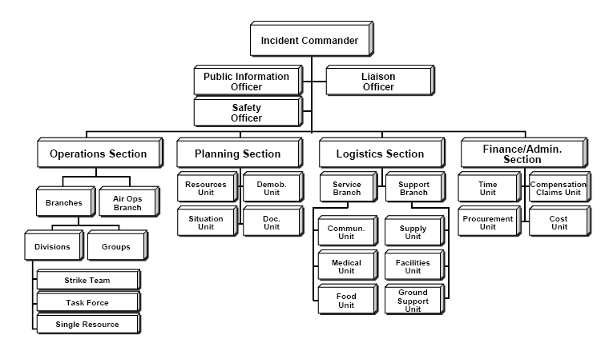
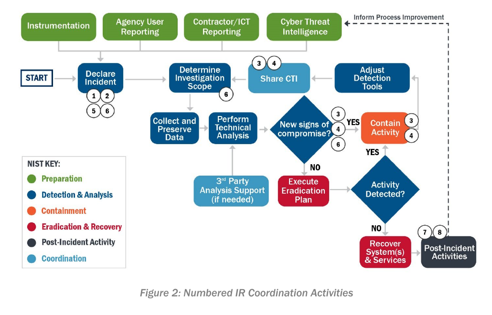
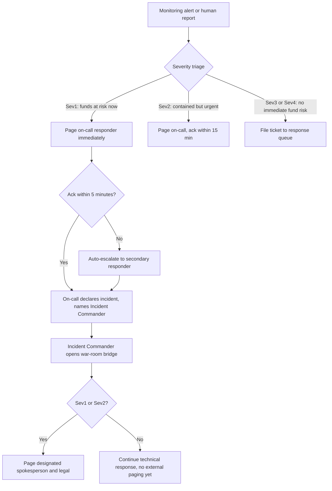
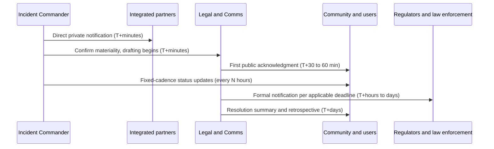
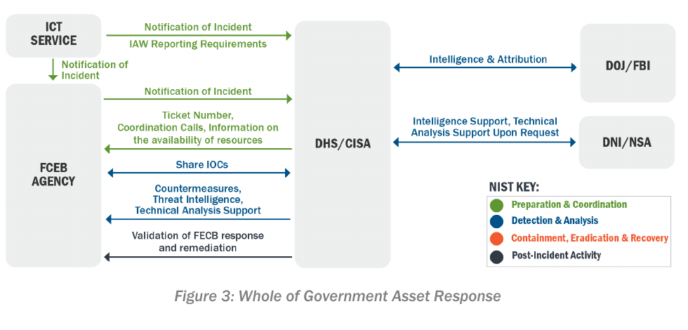
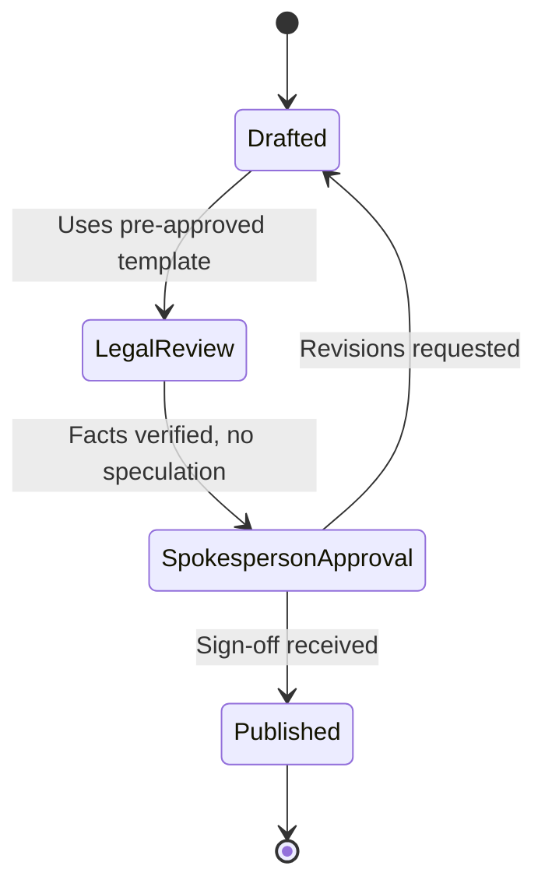

# Part 2: Communication Strategies

[Back to Handbook contents](index.md) | [Series index](../index.md)

Poly Network recovered $610 million from its own attacker in fifteen days by talking to him in public; Multichain lost its users' trust for good by saying almost nothing while roughly $1.5 billion sat frozen behind a CEO who had gone silent months earlier. The exploit was not what separated those two outcomes: the communication plan was. This part sets the rules for incident communication, who is allowed to speak, on which channel, to which audience, and on what clock, from the first internal page through the final public retrospective. It treats disclosure as a control with its own access model and approval workflow, because a message sent on the wrong channel, to the wrong regulator, or on the wrong timeline can cost a protocol as much as the bug that started the incident.

---

## 4. Communication During Incidents

Every incident runs two parallel workstreams: the technical response and the story about the technical response. The second workstream needs its own plan, because in a public, permissionless, always-watching ecosystem, silence and inconsistency get read as confirmation of whatever worst-case rumor is already circulating on crypto Twitter within minutes of an unusual on-chain transaction.

### 4.1 Internal Communication

Internal communication has to be solved before external communication, because a team that cannot coordinate with itself cannot present a coherent face to anyone else. Two failure modes recur across real incidents: coordinating over a channel the attacker can also read, and routing a decision through nobody in particular.

#### 4.1.1 Secure Channels and Access Control

The default assumption during a live incident should be that the primary company chat tool might itself be compromised. This is not a hypothetical: in the September 2022 Uber breach, an attacker who had socially engineered a contractor's multi-factor authentication prompt escalated to broad internal access and, in the company's own words, "posted a message to a company-wide Slack channel, which many of you saw," while also downloading internal Slack message history ([Uber security update](https://www.uber.com/newsroom/security-update/)). A response team coordinating **containment** steps in the same workspace the attacker is reading is handing over the play-by-play in real time.

The fix is a pre-provisioned, out-of-band channel that does not depend on the same identity provider, ticketing system, or chat workspace as production. Create it before an incident, not during one, so responders are added by role rather than improvised under pressure. Scope membership tightly: not every engineer needs war-room access, and comms channel membership should never double as production system access. [NIST SP 800-61 Revision 3](https://csrc.nist.gov/pubs/sp/800/61/r3/final) frames this under Govern function element GV.RM-05, "lines of communication across the organization are established for cybersecurity risks," and under RS.CO-02, which requires following an established procedure for who is notified, when, and through what channel, rather than deciding in the moment.

| Severity | Channel | Membership | Retention during investigation |
|----------|---------|------------|-------------------------------|
| Sev1 (active fund loss) | Pre-provisioned Signal "war room" group | Incident Commander, on-call responders, legal, spokesperson, exec sponsor | Disappearing messages disabled |
| Sev2 (contained, urgent) | Same Signal group, reduced roster | Incident Commander, technical responders, legal | Disabled |
| Sev3/4 (low or no fund risk) | Primary company chat, dedicated incident channel | Response team and relevant engineering | Standard retention |
| Post-incident retrospective | Primary company chat or wiki | Full response team and stakeholders | Standard retention |

#### 4.1.2 Escalation Paths and On-Call

Escalation exists so that **severity**, not seniority or luck, determines who gets paged. In Web3 the first trigger is often a bot, not a human: an on-chain monitor (Chapter 5 covers detection sources) fires a webhook the moment an anomalous transaction lands, and the paging system needs to accept that webhook directly rather than waiting for a person to notice a dashboard. Pair every page with an acknowledgment timer and an automatic escalation to a secondary responder if nobody acks in time, because a responder who is asleep, off-grid, or simply missed a notification cannot be the single point of failure for a Sev1.

Adopt the **Incident Commander** model borrowed from the Incident Command System and refined by Google's Site Reliability Engineering practice: one named person owns the decision authority for the duration of the incident, distinct from whoever is fixing the bug. For decentralized and globally distributed teams, the escalation policy has to assume no single timezone is reliably staffed; Part IV Chapter 14 (**War Room** and Crisis Coordination) and Chapter 13 (Decentralized Incident Response) build directly on the roster this section defines.


*Figure. The FEMA-standardized Incident Command System structure that the Incident Commander model borrows its single-decision-owner principle from, adapted here to name a security incident's roles rather than a physical disaster response's. Source: [FEMA, via Wikimedia Commons](https://commons.wikimedia.org/wiki/File:ICS_Structure.PNG), public domain (US government work).*


*Figure. Coordination is continuous, not a single notification at declaration. CISA marks separate reporting and information-sharing actions at the points where scope, indicators, containment status, recovery, and lessons become known; an external update sent once and never refreshed leaves every partner acting on stale facts. Source: [CISA Federal Government Cybersecurity Incident and Vulnerability Response Playbooks, Figure 2](https://www.cisa.gov/sites/default/files/2023-01/federal_government_cybersecurity_incident_and_vulnerability_response_playbooks_508c_5.pdf), public domain (U.S. government work).*



*Figure 6. Escalation flow from first alert to spokesperson activation. The acknowledgment timer at F prevents a single unresponsive on-call engineer from stalling a Sev1.*

```yaml
# Example escalation policy, PagerDuty/Opsgenie-style pseudo-configuration
escalation_policy:
  name: "protocol-security-sev1"
  rules:
    - level: 1
      target: on_call_primary
      timeout_minutes: 5
    - level: 2
      target: on_call_secondary
      timeout_minutes: 5
    - level: 3
      target: incident_commander_pool
      timeout_minutes: 10
  triggers:
    - source: monitoring_webhook     # e.g. Forta, OpenZeppelin Defender, custom bot
      severity: [sev1, sev2]
      auto_page: true
    - source: manual_report
      severity: [sev1, sev2, sev3, sev4]
      auto_page: false               # routed to response queue instead
```

### 4.2 External Communication

Once a message crosses the organization's boundary it is effectively permanent and can move markets, so the audience, channel, and timing all need to be decided in advance rather than improvised. NIST SP 800-61 Rev. 3 groups external communication into distinct categories under RS.CO and RC.CO: incident notification (formally informing affected parties), public communication (status updates and media response), and incident information sharing (voluntary **threat intelligence** exchange) ([NIST SP 800-61r3, Section 3](https://nvlpubs.nist.gov/nistpubs/SpecialPublications/NIST.SP.800-61r3.pdf)). The three subsections below map to three audiences that need distinctly different content, tone, and legal handling: the community, regulators and law enforcement, and integrated partners.



*Figure 7. Relative order of external notifications. Partners are told before the public because they must make their own containment decisions; regulators are told on a legally defined clock that may run longer than the public acknowledgment clock.*

#### 4.2.1 Community and User Updates

Speed of acknowledgment matters more than completeness of information. The first public message should state what is confirmed, what is not yet confirmed, and the one immediate action users can take to protect themselves, such as revoking a token approval or pausing interaction with a specific contract. Route every channel through a **single source of truth**, typically a status page, and mirror it to X (formerly Twitter), the Discord announcement channel, and Telegram rather than letting three people paraphrase the same fact slightly differently in three places.

Poly Network's response to its August 2021 exploit is the reference case for engaging an attacker in public. After roughly $610 million moved to attacker-controlled addresses across Ethereum, BNB Chain, and Polygon, the team posted an open letter on Twitter addressed directly to the attacker, and the two sides continued the exchange through messages embedded in on-chain transaction data, with the team publicly offering a bug bounty and a security advisor role in exchange for returning the funds. Nearly all assets were returned over the following fifteen days ([Poly Network exploit, Wikipedia](https://en.wikipedia.org/wiki/Poly_Network_exploit)). Ronin Network's March 2022 bridge hack shows the cost of the opposite choice: the roughly $620 million theft, later attributed by the FBI to North Korea's Lazarus Group, was not publicly disclosed until about six days after the exploit occurred, a gap that left users bridging and trading against an insolvent system without knowing it ([Ronin Network, Wikipedia](https://en.wikipedia.org/wiki/Ronin_Network)). Silence is itself a message, and during an active incident it reads as either "there is something to hide" or "we do not know what is happening," both worse than a prompt, honest "we are investigating."

| Channel | Purpose | Update cadence (Sev1) | Owner |
|---------|---------|------------------------|-------|
| Status page | Single source of truth, timestamped | First, and on every material change | Spokesperson |
| X / Twitter | Widest public reach | Mirrors status page | Spokesperson |
| Discord announcement | Active user and developer community | Mirrors status page, pinned | Community lead |
| Telegram | Regional and community reach | Mirrors status page | Community lead |
| Blog or Mirror post | Full retrospective | Once, at resolution | Spokesperson and legal |

```markdown
[TIME UTC]: We are investigating [a reported anomaly / a confirmed exploit] affecting [contract or component].
Confirmed: [fact 1]. [fact 2].
Not yet confirmed: [open question].
Immediate action for users: [pause interactions / revoke approvals / do not bridge].
Next update: within [N] hours, or sooner if the situation changes materially.
```

#### 4.2.2 Regulators and Law Enforcement

Regulatory obligations vary by legal form and jurisdiction, so the **incident response** plan needs a pre-built contact sheet rather than a research project started mid-incident. A US public company (or one that voluntarily files with the SEC) must disclose a material cybersecurity incident under Item 1.05 of Form 8-K within four business days of determining the incident is material, a rule the Securities and Exchange Commission (SEC) adopted in July 2023 and made effective in December 2023 ([SEC cybersecurity disclosure rule](https://www.sec.gov/rules/2023/07/cybersecurity-risk-management-strategy-governance-and-incident-disclosure)). A US-registered money services business (MSB) or virtual asset service provider (VASP) must file a Suspicious Activity Report (SAR) with the Financial Crimes Enforcement Network (FinCEN) within 30 days of detecting a reportable transaction, extendable to 60 days if no suspect has been identified, under 31 CFR 1022.320 ([FinCEN SAR filing guidance](https://www.fincen.gov/resources/filing-information)). Entities that fall within a designated critical infrastructure sector face the Cyber Incident Reporting for Critical Infrastructure Act (CIRCIA), which the Cybersecurity and Infrastructure Security Agency (CISA) is implementing with a 72-hour deadline for a substantial cyber incident and 24 hours for a ransom payment ([CISA CIRCIA](https://www.cisa.gov/circia)).

Law enforcement contact points belong on the same sheet: the FBI's Internet Crime Complaint Center (IC3) for US-based reporting ([ic3.gov](https://www.ic3.gov/)), Europol's European Cybercrime Centre (EC3) for EU-relevant incidents, and national police units elsewhere. If stolen funds route through a sanctioned mixing service, US persons and entities carry an immediate blocking obligation under Office of Foreign Assets Control (OFAC) rules. Framing the initial technical report against a shared taxonomy, such as [MITRE ATT&CK](https://attack.mitre.org/) or MITRE's crypto-focused [AADAPT](https://aadapt.mitre.org/) matrix, speeds up the law enforcement conversation by removing ambiguity about the technique used. The EVM Forensics and DeFi Recovery Handbook (04) covers the freeze-request and chain-analysis mechanics that typically follow this first contact.

| Agency or framework | Trigger | Deadline | Jurisdiction |
|----------------------|---------|----------|---------------|
| SEC Item 1.05, Form 8-K | Cybersecurity incident determined material | 4 business days after materiality determination | US public/reporting companies |
| FinCEN SAR | Suspicious transaction detected by an MSB or VASP | 30 days (60 if no suspect identified) | US-registered MSBs/VASPs |
| CISA CIRCIA | Substantial cyber incident at a covered entity | 72 hours (24 hours for ransom payment) | US critical infrastructure sectors |
| FBI IC3 | Any cyber-enabled theft | No fixed deadline; earlier improves recovery odds | US, with cross-border referral |
| OFAC | Funds routed through a sanctioned address or mixer | Blocking obligation attaches on match | US persons and entities |
| National equivalents (Europol EC3, local police) | Jurisdiction-dependent | Varies | Non-US |

#### 4.2.3 Partners and Dependencies

An incident rarely stays contained to one protocol. Integrated partners need direct, private notification ahead of the public timeline, because they must make their own risk decisions, pausing a contract, disabling a UI route, halting a bridge leg, before the news breaks and turns that decision into a race against every other holder of the same exposure. The March 2023 Euler Finance hack illustrates the pattern: protocols that had deployed capital into Euler's markets, including pools on Balancer and collateral backing Angle Protocol's agEUR stablecoin, carried downstream exposure to the frozen funds and needed a direct heads-up rather than learning about it from social media.

Build the partner list around categories, not individual names that turn over. Oracle providers may need to pause a price feed a compromised contract still consumes. Bridge counterparties need synchronized pausing on both chains, since a one-sided pause leaves the other chain accepting deposits against a broken bridge. Exchanges can freeze or flag an attacker-controlled deposit address and halt withdrawals of an affected wrapped asset if notified quickly. Custodians and market makers need to know before they keep quoting an asset whose backing is in question, and audit firms that reviewed the affected code often hold prior context that shortens triage. Assign one owner to fire every partner notification from the **Incident Commander**'s log, so partners never receive contradictory messages from different employees.


*Figure. CISA's federal example generalizes directly to a Web3 response network: the affected protocol remains the evidence owner, a central coordinator routes requests, and specialized partners return different products—indicators, countermeasures, attribution, or technical analysis. The diagram is a reminder to name the information exchanged on each edge, not merely list organizations in a phone tree. Source: [CISA Federal Government Cybersecurity Incident and Vulnerability Response Playbooks, Figure 3](https://www.cisa.gov/sites/default/files/2023-01/federal_government_cybersecurity_incident_and_vulnerability_response_playbooks_508c_5.pdf), public domain (U.S. government work).*

| Partner category | Notification trigger | Expected action | Owner |
|-------------------|-----------------------|------------------|-------|
| Oracle providers | Compromised contract consumes their feed | Pause or deprecate the feed for the affected consumer | Incident Commander |
| Bridge counterparties | Bridge contract exploited on either leg | Synchronized pause on both chains | Incident Commander and partner engineering lead |
| Centralized exchanges | Attacker address identified | Freeze or flag deposit address, halt affected withdrawals | Legal and comms |
| Custodians and market makers | Treasury or liquidity-provider funds affected | Risk-adjust exposure, pause quoting | Executive sponsor |
| Auditors of record | Exploit falls within previously audited scope | Share prior findings, assist triage | Incident Commander |

### 4.3 Best Practices

Four cross-cutting practices apply to every message sent during an incident, regardless of which audience receives it.

#### 4.3.1 Pre-Approved Templates for Notifications, Updates, and Press

Draft and legally review message templates before an incident, not during one. Legal review under active-incident time pressure both slows the message and raises the odds that something inaccurate reaches the public. Maintain a small library covering the recurring moments: initial acknowledgment, periodic status update, resolution and all-clear, and a press statement for inbound media inquiries, each with bracketed placeholders and a "facts only, no speculation" instruction built into the template itself so the constraint travels with the document rather than living only in someone's memory. Store the library alongside the rest of the **incident response** plan; Appendix D of this handbook is exactly this set of templates, meant to be one click away rather than buried in a wiki nobody can find at 2 a.m.



*Figure 8. Message approval workflow. Starting from a pre-approved template shortens the loop between drafting and publication without skipping legal or spokesperson sign-off.*

#### 4.3.2 Message Consistency and Timing; Fixed-Schedule Updates

Every channel should mirror one source-of-truth document rather than being independently authored, because small paraphrasing differences across Discord, X, and a blog post read to an outside observer as contradictions, which fuels exactly the speculation the update was meant to prevent. Commit publicly to a fixed cadence during an active Sev1, for example "next update within two hours or sooner if material," and honor it even when the update is "no material change." A missed expected update reads as bad news whether or not anything actually changed. This mirrors NIST's RC.CO-03 and RC.CO-04 elements, which call for recovery progress and public updates to be shared through approved methods and messaging on a defined cadence rather than opportunistically ([NIST SP 800-61r3](https://nvlpubs.nist.gov/nistpubs/SpecialPublications/NIST.SP.800-61r3.pdf)). Trade speed for accuracy as the stakes rise: the first acknowledgment should go out fast, but a statement carrying legal or financial weight, such as a confirmed loss figure, should wait for verification.

| Severity | Cadence during active incident | Cadence during recovery |
|----------|----------------------------------|----------------------------|
| Sev1 | Every 1 to 2 hours, or immediately on material change | Every 4 to 6 hours until resolved |
| Sev2 | Every 4 hours | Daily |
| Sev3 | Daily | On resolution |
| Sev4 | On resolution only | Not applicable |

#### 4.3.3 Designated Spokesperson; Avoid Speculation, Provide Factual Information

Name exactly one authorized external voice per incident, with a tightly scoped one- or two-deep backup, documented in the plan in advance rather than improvised in the moment. Every other employee, including the engineer who found the bug, routes inbound press and community questions to that person; state this explicitly during onboarding, because a well-meaning engineer answering a Discord direct message with a guess becomes the quote a reporter runs with. Content discipline matters as much as channel discipline: report only confirmed facts, label anything unverified as unverified, never speculate publicly about root cause or attacker identity before confirmation, and never commit to a recovery timeline the team does not control. Attribution errors made under pressure, naming the wrong address or the wrong root cause, have forced public retractions in past incidents that did more reputational damage than a slower, correct statement would have.

| Do | Don't |
|----|-------|
| State only confirmed facts, label estimates as estimates | Speculate on root cause before verification |
| Say "we are investigating X" | Guess at attacker identity or motive publicly |
| Commit to a concrete next-update time | Promise a fund-return timeline you don't control |
| Route all press and community questions to the spokesperson | Let engineers or support staff answer press messages individually |
| Correct errors quickly and visibly | Quietly edit a prior public statement without a changelog note |

#### 4.3.4 Secure Communication Channels (Encrypted Messaging)

The encryption properties chosen for internal coordination in Section 4.1.1 need to be applied consistently and deliberately, particularly around disappearing messages. Ephemeral messaging reduces the **blast radius** if the incident channel is itself later compromised, but it also destroys the audit trail that regulators, insurers, and forensic investigators will request afterward. Disable auto-delete for the duration of an active investigation and re-enable it only once the litigation hold or regulator inquiry window has closed; Part III's evidence-collection guidance and Part V's lessons-learned process both depend on that trail existing.

Signal implements the Signal Protocol with sealed-sender metadata minimization and is the common default for war-room coordination ([Signal Protocol documentation](https://signal.org/docs/)). Wire adds enterprise features, including guest rooms for coordinating with external partners outside the internal roster. Matrix and its Element client offer a self-hosted option for teams, including DAOs, that want to own their server rather than trust a vendor to not become a subpoena target ([Matrix end-to-end encryption guide](https://matrix.org/docs/matrix-concepts/end-to-end-encryption/)). PGP or GPG-encrypted email remains the fallback for regulator or law enforcement contacts who do not use messaging apps. Provisioning discipline matters regardless of tool: create the group in advance, add responders by role, and verify safety numbers or key fingerprints out of band at least once.

| Tool | Protocol | Disappearing messages | Best for |
|------|----------|--------------------------|----------|
| Signal | Signal Protocol, E2EE, sealed sender | Configurable | Core war-room coordination |
| Wire | Proteus/MLS, E2EE | Configurable, guest rooms | Cross-organization coordination with partners |
| Matrix / Element | Olm/Megolm, E2EE | Configurable | Self-hosted, DAO-owned infrastructure |
| PGP / GPG email | Asymmetric encryption, no forward secrecy | Not applicable | Async contact with regulators or law enforcement without messaging apps |

---

**Key controls for Part 2**

- Provision an out-of-band, encrypted internal incident channel in advance, scoped by role, independent of the primary workspace and identity provider.
- Build an escalation policy that accepts monitoring-bot pages directly and auto-escalates on a missed acknowledgment, with a named **Incident Commander** for every Sev1/Sev2.
- Keep a pre-built contact sheet for regulators (SEC, FinCEN, CISA), law enforcement (IC3, Europol EC3), and OFAC obligations, mapped to jurisdiction and deadline.
- Notify integrated partners (oracles, bridge counterparties, exchanges, custodians, auditors) privately and before the public timeline.
- Maintain pre-approved, legally reviewed templates for acknowledgment, status update, resolution, and press, and commit to a fixed update cadence during active incidents.
- Name one designated spokesperson per incident and route every external inquiry through that person; state confirmed facts only.
- Disable disappearing messages on incident channels for the duration of the investigation to preserve the evidentiary trail.
