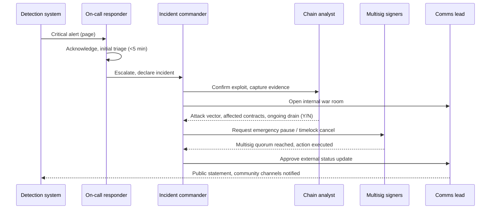
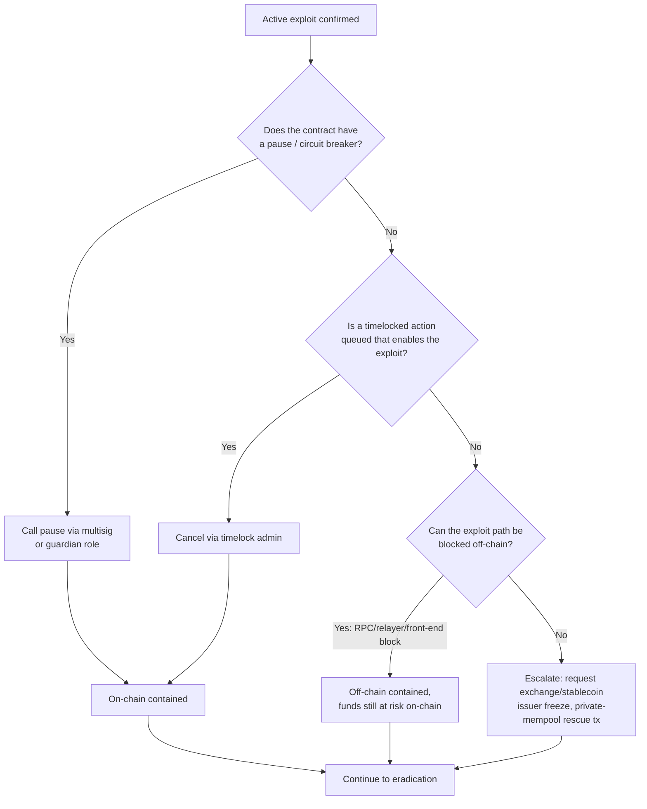
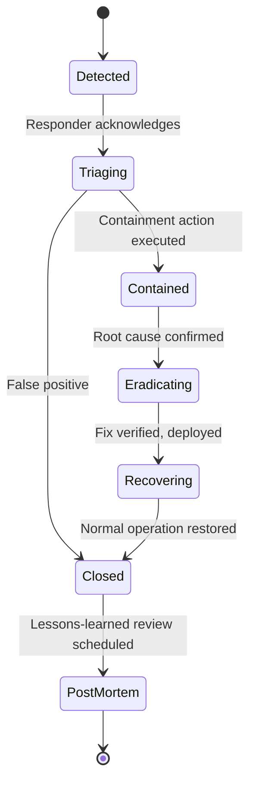

# Part III: Detection and Response

[Back to Handbook contents](index.md) | [Series index](../index.md)

This part is the operational core of the handbook: the mechanics of noticing that something is wrong, deciding how wrong it is, and acting before the loss compounds. It works through the detection sources a Web3 team should wire up before launch, the response procedure that turns an alert into a contained and documented incident, and the preparation work that determines whether all of this runs smoothly or falls apart under pressure. Everything here follows the **incident response** lifecycle defined in the National Institute of Standards and Technology (NIST) [Special Publication (SP) 800-61 Revision 3](https://csrc.nist.gov/pubs/sp/800/61/r3/final), *Incident Response Recommendations and Considerations for Cybersecurity Risk Management: A CSF 2.0 Community Profile* (April 2025), which folds incident response into the six functions of the [NIST Cybersecurity Framework (CSF) 2.0](https://www.nist.gov/cyberframework): Govern, Identify, Protect, Detect, Respond, and Recover.

---

## 5. Incident Detection

Detection is the function that starts the clock. A control that would have prevented a loss is worthless if nobody notices the loss happening, and in Web3 the interval between exploit and drained treasury is frequently measured in single-digit minutes, not the hours or days a traditional security operations center (SOC) can tolerate.

### 5.1 Key Components of Detection

A working detection program has four components, and a gap in any one of them creates a blind spot the others cannot compensate for. **Sources** are the systems that emit signal: chain state, application logs, infrastructure metrics, and human reports. **Collection** is the pipeline that pulls signal from those sources into a place you can query it, whether that is a managed platform or a self-hosted indexer. **Analysis** is the logic, rule-based or anomaly-based, that turns raw signal into a judgment call: is this normal, or does it warrant a human? **Alerting** is the mechanism that gets that judgment in front of a responder fast enough to matter.

| Component | Web3-specific instance | Failure mode if missing |
|-----------|------------------------|--------------------------|
| Sources | Contract events, mempool, remote procedure call (RPC) node metrics, front-end error logs, Discord/Telegram reports | Attack proceeds unobserved until funds are gone |
| Collection | Forta scan node, indexer (The Graph, custom listener), log aggregator | Signal exists but nobody is collecting it |
| Analysis | Threshold rules, anomaly detection, simulation-based bot logic | Noise drowns signal, real alert missed among false positives |
| Alerting | PagerDuty/Opsgenie escalation, Discord webhook, SMS | Analysis fires correctly but nobody is paged |

Treat these four as a single pipeline you test end to end, not four independent purchases. A monitoring vendor contract does not constitute a detection program until you have proven, with a drill, that a real signal reaches a real human within your target window.

### 5.2 On-Chain Monitoring and Logging (Large Transfers, Minting, Ownership Changes)

On-chain monitoring watches the one data source an attacker cannot suppress: the chain itself. Every state-changing action a protocol takes, and every action an attacker takes against it, is a transaction with a permanent, publicly queryable record. The job of on-chain monitoring is to turn that record into alerts before the block finalizes rather than after a post-mortem.

[Forta Network](https://docs.forta.network/) is the most widely deployed example of this pattern: independent detection bots run against a live mempool and block stream, evaluate each transaction against a rule, and publish alerts to a public network other consumers can subscribe to. [OpenZeppelin Defender's](https://docs.openzeppelin.com/defender/) Monitor module and [Tenderly Alerts](https://tenderly.co/alerting) provide the equivalent capability scoped to your own contracts, with a UI for defining conditions without writing a bot from scratch.

The signal classes every protocol should monitor, regardless of platform:

- **Large transfers**: any `Transfer` event moving more than a configured percentage of a token's circulating supply, or more than a configured USD value, in a single transaction or a tight cluster of transactions from related addresses.
- **Minting and burning**: any call to a `mint()` or equivalent function outside an allowlisted caller, or any mint whose amount deviates from the protocol's normal issuance schedule.
- **Ownership and role changes**: `OwnershipTransferred`, `RoleGranted`, `RoleRevoked`, and any write to a storage slot holding an admin, owner, or upgrade-authority address.
- **Upgrade and configuration events**: proxy implementation changes, timelock queue and execute calls, and parameter changes on economically sensitive values (fees, collateral ratios, oracle addresses).

```javascript
// Minimal viem-based watcher for the signal classes above.
// Production deployments should run this as a Forta bot or
// a Defender Sentinel so alerting survives a single host failing.
import { createPublicClient, webSocket, parseAbiItem, formatUnits } from "viem";
import { mainnet } from "viem/chains";

const client = createPublicClient({ chain: mainnet, transport: webSocket(process.env.WSS_RPC) });
const LARGE_TRANSFER_THRESHOLD = 500_000n * 10n ** 18n; // 500k tokens, 18 decimals

client.watchEvent({
  address: process.env.TOKEN_ADDRESS,
  event: parseAbiItem("event Transfer(address indexed from, address indexed to, uint256 value)"),
  onLogs: (logs) => {
    for (const log of logs) {
      if (log.args.value >= LARGE_TRANSFER_THRESHOLD) {
        alert("large-transfer", {
          tx: log.transactionHash,
          amount: formatUnits(log.args.value, 18),
          from: log.args.from,
          to: log.args.to,
        });
      }
    }
  },
});

client.watchEvent({
  address: process.env.TOKEN_ADDRESS,
  event: parseAbiItem("event OwnershipTransferred(address indexed previousOwner, address indexed newOwner)"),
  onLogs: (logs) => logs.forEach((l) => alert("ownership-change", { tx: l.transactionHash, ...l.args })),
});
```

Every alert must carry the transaction hash, block number, and involved addresses so a responder can pivot straight to a block explorer or forensic tool without re-deriving context (see Section 6.3 on evidence collection).

### 5.3 Monitoring Objectives, Thresholds, and Alert Channels (Email, SMS, Messaging)

A threshold that is never tuned is a threshold that either floods the on-call responder with noise or stays silent through a real event. Set thresholds against a stated objective, not a round number picked at design time: "detect any single withdrawal exceeding 2% of protocol total value locked (TVL) within one block" is testable and revisable; "watch for big withdrawals" is not.

Route each **severity** to a channel matched to its urgency. A Critical alert that lands only in a Slack channel with notifications muted is functionally undetected. NIST SP 800-61r3 frames this as part of the Respond function's communication planning, and the practical Web3 mapping looks like this:

| Severity | Example trigger | Channel | Target time-to-acknowledge |
|----------|-----------------|---------|------------------------------|
| Critical | Large unexplained outflow, admin key used from unrecognized address | Phone call/SMS via PagerDuty, dedicated Signal war room | < 5 minutes |
| High | Oracle price deviation beyond bound, repeated failed admin auth attempts | SMS + push notification | < 15 minutes |
| Medium | Anomalous but plausible transaction pattern, infra latency spike | Team messaging (Discord/Telegram/Slack) with @here | < 1 hour |
| Low | Informational deviation, non-actionable community report | Ticket queue, reviewed at standup | Next business day |

Redundancy matters as much as routing. A single alerting provider outage should never be a single point of failure for Critical severity: pair a primary paging service with an independent secondary channel (a second provider, or a phone tree) so a provider-side incident does not become your incident.

### 5.4 Infrastructure and Application Monitoring

On-chain signal tells you what happened to the contracts; infrastructure and application monitoring tells you what happened to everything the contracts depend on. RPC node health, front-end deployment integrity, API latency and error rates, and cloud account activity are all attack surfaces in their own right, and several of the largest incidents in the space started off-chain: a compromised front end serving a malicious swap target, a leaked application programming interface (API) key, or a cloud console takeover, well before any suspicious transaction appeared.

Standard site reliability engineering (SRE) tooling applies directly. Run Prometheus or an equivalent time-series system against node and service metrics, alert on deviations from baseline, and centralize logs (application, load balancer, cloud audit trail) in a single searchable store so a responder is not chasing five dashboards mid-incident.

```yaml
# Prometheus alerting rule: RPC node falling behind chain head
# is an early indicator of eclipse attacks, provider outages,
# or a node silently forked off the canonical chain.
groups:
  - name: rpc-health
    rules:
      - alert: RPCBlockLag
        expr: (time() - rpc_latest_block_timestamp) > 60
        for: 2m
        labels:
          severity: high
        annotations:
          summary: "RPC node {{ $labels.instance }} is more than 60s behind chain head"
      - alert: CloudConsoleAnomalousLogin
        expr: increase(cloudtrail_console_login_failure_total[5m]) > 5
        labels:
          severity: critical
        annotations:
          summary: "Repeated failed console logins on {{ $labels.account }}"
```

Cloud audit trails (AWS CloudTrail, Google Cloud Audit Logs) and web application firewall (WAF) logs deserve the same alerting discipline as on-chain signal, because a front-end compromise or a leaked deploy credential is frequently the precondition for an on-chain exploit, not a parallel unrelated event. The CDN and Front-End Supply Chain Security Handbook (01) covers the specific integrity controls (Subresource Integrity, Content Security Policy) that reduce this surface; this handbook's job is making sure a failure of those controls gets detected.

### 5.5 User and Community Reporting

Automated monitoring catches what you thought to look for. Users and community members regularly catch what you did not, and several major incidents were first reported by an ordinary user noticing a failed transaction before any internal alert fired. The [Ronin Bridge hack of March 2022](https://rekt.news/ronin-rekt/) went undetected by Sky Mavis for six days and surfaced only because a user reported being unable to withdraw 5,000 ETH from the bridge, a gap the team's own monitoring never closed.

Build an intake path that does not depend on a user finding the right person to direct-message. A dedicated `#security` or `#bug-report` channel with a pinned reporting template, a `security.txt` file per [RFC 9116](https://www.rfc-editor.org/rfc/rfc9116) at your domain root, and a bug bounty program on a platform like [Immunefi](https://immunefi.com/) each give a different class of reporter (community member, security researcher, competitor protocol) a clear, low-friction path in. Triage every inbound report against the same **severity** matrix used for automated alerts (Section 6.2) rather than a separate informal process, because a credible report of an in-progress exploit is functionally a Critical alert regardless of its source.

| Reporting channel | Best suited for | Response commitment |
|--------------------|------------------|----------------------|
| security.txt / dedicated email | Independent researchers, coordinated disclosure | Acknowledge within 24 hours |
| Bug bounty platform (Immunefi, HackenProof) | Pre-exploit vulnerability disclosure | Per published program service-level agreement (SLA) |
| Public Discord/Telegram report | Community members observing live anomalies | Triage within minutes during business hours, on-call otherwise |
| Direct message to known team member | Ad hoc, unreliable | Redirect to a tracked channel; never treat as the sole intake |

### 5.6 Automated Alert Rules and Thresholds

Manual review does not scale to Web3's operating tempo, so the detection program's real output is a maintained library of automated rules, each with an owner, a documented rationale, and a review date. A rule with no owner decays: thresholds calibrated for a protocol at $2 million TVL become useless noise, or worse, a blind spot, once the same protocol holds $200 million.

Structure each rule with four fields so it survives a team handoff:

```yaml
rule_id: LARGE-WITHDRAWAL-001
description: >
  Single withdrawal exceeding 2% of current vault TVL, or three
  withdrawals from related addresses exceeding 5% combined within
  one block.
severity: critical
owner: on-call-security
last_reviewed: 2026-06-01
action: page primary + secondary on-call, post to #incident-active, snapshot mempool
```

Two disciplines keep the rule library useful rather than a growing pile of stale conditions. First, review thresholds against current protocol state on a fixed cadence (monthly for TVL-relative rules, immediately after any parameter change that shifts what "normal" looks like). Second, track false-positive rate per rule and retire or retune anything crying wolf often enough that responders start ignoring its channel, since alert fatigue is itself a detection failure.

---

## 6. Incident Response Procedures

Response begins the moment detection hands off a confirmed or suspected incident to a human decision-maker, and everything from that moment forward follows a defined procedure rather than improvisation. NIST SP 800-61r3 groups this work under the Respond and Recover functions of CSF 2.0; the sequence below is that model adapted to a Web3 team where actions taken on-chain are irreversible and every minute of delay compounds loss.



*Figure 1. First-hour incident response sequence. Every arrow is a decision point with an owner; the diagram exists so no step depends on someone improvising who is responsible.*

### 6.1 Key Components of Response

A response procedure has the same shape as detection: defined roles, a defined decision process, and defined actions, each rehearsed before they are needed. Part I of this handbook assigns the roles (**incident commander**, chain analyst, communications lead, and the rest of the team structure); this chapter assumes those roles exist and walks through what each does once an incident is declared.

Five activities recur across every incident regardless of type, and they are largely sequential though earlier ones sometimes continue in parallel with later ones: triage (classify **severity** and scope), evidence collection (capture state before it changes), **containment** (stop the bleeding), eradication and recovery (remove the root cause and restore normal operation), and documentation (maintain a timeline throughout, not only after). The remaining sections of this chapter take each in turn.

| Activity | Primary owner | Can run in parallel with |
|----------|---------------|---------------------------|
| Triage | On-call responder, then incident commander | Nothing (gates everything else) |
| Evidence collection | Chain analyst | Containment (must start before, continue during) |
| Containment | Incident commander + multisig signers | Documentation |
| Eradication and recovery | Engineering lead | Communications |
| Documentation | Incident commander or scribe | All of the above, continuously |

### 6.2 Triage and Severity Classification

Triage answers two questions fast: how bad is this, and who needs to know right now. Both answers can be wrong in the first five minutes and should be revised as better information arrives, but the initial classification determines which escalation path fires, so err toward overclassifying an ambiguous signal rather than under-reacting to it.

Ground **severity** in concrete, observable criteria rather than gut feel, following the same discipline [NIST SP 800-61r3](https://csrc.nist.gov/pubs/sp/800/61/r3/final) recommends for functional impact scoring, adapted to Web3-specific loss modes:

| Severity | Criteria | Example |
|----------|----------|---------|
| Critical | Active, ongoing fund loss; admin key compromise; contract logic exploited with funds still at risk | Ongoing drain via reentrancy; leaked deployer private key used on-chain |
| High | Exploit confirmed but contained or one-time; no ongoing drain; significant but bounded loss | Single flash-loan exploit already completed, funds moved to attacker address |
| Medium | Vulnerability confirmed exploitable but not yet exploited, or minor loss with no user fund impact | Researcher-reported bug with a working PoC, not yet seen in the wild |
| Low | Cosmetic, informational, or theoretical issue with no practical exploit path | Gas inefficiency, non-security-relevant event log gap |

The full severity and triage matrix, including CVSS-adjacent scoring guidance for cases that need finer granularity than four tiers, lives in Appendix B of this handbook. During live triage, resolve ambiguity toward the higher tier: a suspected Critical that turns out to be High cost you an unnecessary page; a suspected Medium that turns out to be Critical cost you the response window.

### 6.3 Evidence Collection (Before Changing State)

Every state-changing action you take, whether pausing a contract, revoking a role, or migrating funds, potentially destroys evidence that would otherwise explain how the exploit worked, who else might be affected, and whether recovery is even possible. [NIST SP 800-86](https://csrc.nist.gov/pubs/sp/800/86/final), *Guide to Integrating Forensic Techniques into Incident Response*, states the governing principle plainly: capture volatile and time-sensitive evidence before it is lost, and do so in a way that preserves its integrity for later analysis. Web3 adds a wrinkle the 2006 guide could not anticipate: some of the most relevant evidence, an unconfirmed transaction sitting in the mempool, exists for only seconds before it either confirms or disappears.

Capture, in this order, before taking any **containment** action that changes state:

```bash
# 1. Freeze the exact block and transaction context
cast tx <TX_HASH> --rpc-url $RPC_URL > evidence/tx-$(date +%s).json
cast block <BLOCK_NUMBER> --rpc-url $RPC_URL > evidence/block-$(date +%s).json

# 2. Capture full call trace, not just the top-level call
cast run <TX_HASH> --rpc-url $RPC_URL --trace > evidence/trace-$(date +%s).txt

# 3. Snapshot current contract state relevant to the incident
cast storage <CONTRACT_ADDR> --rpc-url $RPC_URL > evidence/storage-$(date +%s).txt

# 4. If the attack is ongoing, snapshot the mempool before it clears
cast rpc eth_getBlockByNumber pending true --rpc-url $RPC_URL > evidence/mempool-$(date +%s).json

# 5. Record wall-clock time and block number together, immediately
echo "$(date -u --iso-8601=seconds) block=$(cast block-number --rpc-url $RPC_URL)" >> evidence/timeline.log
```

Write every captured artifact to the write-once evidence store described in Section 7.4, and record a SHA-256 hash of each file alongside it so later analysis can prove nothing was altered after capture. This is not bureaucracy for its own sake: the eventual root-cause writeup, any law-enforcement referral, and any insurance or recovery claim all depend on evidence whose **chain of custody** is intact.

### 6.4 Containment Options (On-Chain and Off-Chain)

**Containment** stops an incident from getting worse while **eradication** (Section 6.5) fixes the underlying cause. The two containment domains, on-chain and off-chain, have different mechanics, different speeds, and different points of no return, and a responder needs to know which lever is available before an incident forces the choice.



*Figure 2. Containment decision tree. On-chain containment is preferred when available because it is enforced by the protocol itself rather than by cooperation from a third party.*

On-chain containment options include invoking a `pause()` function built on OpenZeppelin's [`Pausable`](https://docs.openzeppelin.com/contracts/5.x/api/utils#Pausable) pattern, canceling a queued timelock transaction before it executes, revoking a compromised role via **access control**, and routing a rescue transaction through a private mempool such as [Flashbots Protect](https://docs.flashbots.net/flashbots-protect/overview) so it is not front-run by copycat exploiters watching the public mempool, the exact failure mode that turned the [Nomad Bridge hack of August 2, 2022](https://rekt.news/nomad-rekt/) from a single exploit into a $190 million free-for-all once other actors copy-pasted the original attacker's calldata from Etherscan.

Off-chain containment includes pulling a compromised front end from the CDN, revoking leaked API keys and cloud credentials, blocking malicious contract addresses at the RPC or wallet-provider level, and requesting that a centralized stablecoin issuer freeze funds held at a known attacker address, a lever that has recovered funds in past incidents when the attacker moved stolen assets into a token with issuer-level freeze capability. Off-chain containment cannot stop an ongoing on-chain drain by itself, but it closes secondary damage paths (further phishing via the compromised front end, further use of a leaked key) while the on-chain path is being worked.

### 6.5 Eradication and Recovery

**Eradication** removes the root cause; recovery restores the system to trusted, normal operation. Confusing the two, patching quickly and reopening before the actual cause is understood, has caused repeat exploits against the same protocol within hours in real incidents. Eradication is not complete until you can state, with evidence, exactly why the exploit worked and confirm the fix addresses that cause rather than a symptom of it.

A practical eradication and recovery sequence:

1. **Confirm root cause with evidence**, not assumption, using the trace and state captured in Section 6.3. Do not proceed on a guess.
2. **Patch and independently review the fix.** A second engineer who did not write the fix reviews it against the confirmed root cause before it goes anywhere near mainnet.
3. **Test the fix against the exact exploit path**, ideally as a fork test that reproduces the original attack transaction and confirms it now reverts or behaves safely.
4. **Redeploy or upgrade** through the same governance and **multisig** process used for any privileged change, resisting the urge to skip review steps under incident pressure; a rushed emergency deploy is a common source of a second, self-inflicted incident.
5. **Recover funds where possible**: negotiate with the attacker (see the Safe Harbor and whitehat recovery **playbook** in Part IV), pursue a rescue transaction for at-risk but not-yet-drained funds, or coordinate with exchanges and issuers to freeze and eventually return stolen assets.
6. **Reopen gradually**, with tightened monitoring thresholds (Section 5.6) and, where feasible, a temporary transaction size cap, rather than immediately restoring full unrestricted operation.

Recovery outcomes vary enormously by incident. The [Euler Finance hack of March 13, 2023](https://www.euler.finance/) ended with the attacker returning nearly all of the roughly $197 million taken after direct on-chain negotiation, concluding within about two weeks. The [Poly Network hack of August 2021](https://rekt.news/polynetwork-rekt/), at the time the largest crypto hack on record at roughly $611 million, saw the attacker return the great majority of funds voluntarily within days after public identification pressure. Neither outcome was guaranteed, and Section 15 of Part IV covers the negotiation and safe-harbor mechanics that make voluntary return more likely.

### 6.6 Documentation and Timeline Maintenance

Documentation is not the report you write after the incident closes. It is a living timeline you maintain from the first alert, because memory of exact sequencing and exact timestamps degrades within hours, and a defensible post-mortem, a law-enforcement referral, or an insurance claim all depend on a record built during the incident rather than reconstructed from memory afterward.



*Figure 3. Incident status states. Every transition is a timestamped log entry with an owner, feeding directly into the timeline required for the post-mortem covered in Part V.*

Assign a scribe role, separate from the **incident commander**, whose only job during the incident is logging each state transition, each decision, and each action taken, with a timestamp and an owner, to the incident channel or a dedicated log. Each entry should answer four questions: what happened, when (both wall-clock and block number, per Section 6.3), who acted, and what evidence supports it. This log becomes the primary source for the lessons-learned process in Part V, for any regulatory or law-enforcement engagement, and for the after-action communication the community and any affected users are owed.

---

## 7. Preparation Checklist

Everything in Chapters 5 and 6 assumes infrastructure and agreements that exist before an incident starts. This chapter is that prerequisite list, meant to be worked through and signed off well ahead of any live event, ideally as part of onboarding for a new protocol or a quarterly readiness review.

### 7.1 Asset Inventory (Code, Infra, Keys)

You cannot protect, monitor, or contain what you have not inventoried. Maintain a single authoritative asset inventory covering every deployed contract address (with chain, version, and verification status), every piece of infrastructure (RPC providers, cloud accounts, domains, CDN configuration), and every privileged key (**multisig** signers and their contact methods, deployer keys, API keys, and what each one can do). Update it on every deployment and every personnel change, and treat a stale inventory as itself a finding in the readiness review.

| Asset class | Fields to track | Review trigger |
|-------------|------------------|-----------------|
| Contracts | Address, chain, deployer, admin/owner, upgrade authority, source verification link | Every deployment or upgrade |
| Infrastructure | Provider, account owner, access list, region, failover plan | Quarterly, or on provider change |
| Keys and credentials | Holder, scope of authority, storage method (hardware wallet, HSM, secrets manager), rotation date | Every personnel change, every 90 days minimum |
| Third-party dependencies | Oracle feeds, bridges, integrated protocols, upstream libraries | On any upstream incident disclosure |

### 7.2 Log Pipeline and Reliable Clock

A response timeline is only as trustworthy as the clock it is built on, and correlating an off-chain log entry with an on-chain block requires both to share a reliable time reference. Synchronize every host that generates logs to Network Time Protocol (NTP), and record both wall-clock timestamp and block number together at every capture point, exactly as shown in the evidence collection commands in Section 6.3. [NIST's draft SP 800-92 Revision 1](https://csrc.nist.gov/pubs/sp/800/92/r1/ipd), *Guide to Computer Security Log Management* (initial public draft, October 2023), frames log management as a full lifecycle: generation, transmission, storage, access, and disposal, and that lifecycle discipline is what turns scattered application logs into a usable pipeline during an incident rather than a frantic grep across a dozen hosts after the fact.

Centralize logs into a single searchable store before an incident, not during one. A pipeline that ships application logs, infrastructure metrics, and on-chain event logs into one queryable system, with retention long enough to cover your bug bounty program's disclosure window, is the difference between a chain analyst answering "when did this start" in minutes versus hours.

### 7.3 Secure Comms Channels

An incident is exactly the wrong time to discover that your team's usual chat tool is compromised, rate-limited, or being read by the same attacker who just breached your infrastructure. Pre-establish an out-of-band channel, separate from day-to-day tooling, reserved for incident coordination: an encrypted messaging platform such as Signal, with a dedicated "**war room**" group pre-populated with every incident-response role holder and their verified phone number, not just a username that could belong to anyone.

Pair the channel with pre-agreed verification steps for high-stakes actions. Any request to move funds, revoke a key, or issue a public statement during an incident should be verifiable through a second channel or a known callback number, because **social engineering** during the chaos of a live incident, impersonating a teammate to authorize an emergency action, is a documented attacker technique in its own right. The Security Alliance's [SEAL 911](https://www.securityalliance.org/) hotline, a 24/7 emergency response service staffed by volunteer Web3 security responders, is worth pre-registering with before an incident, not discovering mid-exploit; keep its contact path in your comms runbook alongside your internal war room.

### 7.4 Evidence Bucket (Write-Once Storage)

Evidence captured under Section 6.3 is only as good as its integrity guarantee. Store it in write-once-read-many (WORM) storage so that neither an attacker who has gained partial access nor a well-meaning but panicked teammate can alter or delete it after the fact. Cloud object storage with object-lock or legal-hold features provides this cheaply:

```bash
# Example: create a WORM-compliant evidence bucket (AWS S3 Object Lock,
# compliance mode, 90-day minimum retention) ahead of any incident.
aws s3api create-bucket --bucket incident-evidence-prod --region us-east-1
aws s3api put-object-lock-configuration \
  --bucket incident-evidence-prod \
  --object-lock-configuration '{
    "ObjectLockEnabled": "Enabled",
    "Rule": { "DefaultRetention": { "Mode": "COMPLIANCE", "Days": 90 } }
  }'
```

Restrict write access to the automation that captures evidence and to the chain analyst role, and restrict deletion entirely for the retention period, even from account administrators, which is what "compliance mode" enforces over the weaker "governance mode" available on the same feature. Set retention to at least the length of your longest plausible investigation, insurance claim, or legal process, and document the bucket's existence and access procedure in the runbook referenced from Section 7.3's **war room** channel, so a first responder is not searching for it mid-incident.

### 7.5 Automated Alert Rules

Section 5.6 covers the discipline of maintaining alert rules; this entry is the pre-incident checklist confirming that discipline is actually in place before you need it. Before go-live, and again at every quarterly review, verify: every Critical and High **severity** scenario identified in your **threat model** (see Handbook 06 Part I) has a corresponding automated rule; every rule has a named owner and a last-reviewed date within the last quarter; every rule has been tested against a synthetic event, not merely deployed and assumed to work; and every rule's alert routes to a channel that has itself been tested for delivery, since a webhook silently failing is functionally identical to no rule existing at all.

Run this verification as a checklist item in the drill described in Section 7.6, because a **tabletop exercise** that assumes alerting works, rather than proving it, tests the team's response process while leaving the actual detection gap undiscovered.

### 7.6 Drill Schedule and Tabletop Exercises

A response procedure that has only ever been read, never rehearsed, will fail in ways a walkthrough never predicted: a signer whose **hardware wallet** is in another city, a runbook link that 404s, a **severity** classification the team disagrees on in the moment. Tabletop exercises (TTX) surface these gaps cheaply, before an actual incident makes them expensive.

Run drills on a fixed cadence and vary the scenario so the team is not simply memorizing one script:

| Drill type | Frequency | Focus |
|------------|-----------|-------|
| Tabletop exercise (discussion-based) | Quarterly | Walk a written scenario end to end verbally; test decision-making and role clarity, not tooling |
| Technical drill (live-fire) | Semi-annually | Execute real pause/timelock-cancel calls on a testnet fork; test that tooling and access actually work |
| Alert delivery test | Monthly | Trigger each Critical-severity rule synthetically; confirm the page arrives within SLA |
| Full incident simulation | Annually | Unannounced scenario injected by a designated red-teamer; test the whole pipeline from detection through documentation |

Rotate scenario types across drills: a smart contract exploit, a compromised signer, a front-end supply-chain compromise, and an **insider threat** each exercise different parts of the procedure and different playbooks in Part IV. After every drill, feed findings into the same lessons-learned process (Part V) used for real incidents, closing the loop between preparation and continuous improvement rather than treating drills as a compliance checkbox.

---

**Key controls for Part III**

- Wire up on-chain, infrastructure, and community reporting as one detection pipeline, tested end to end, not three independent tools.
- Route every alert severity to a channel matched to its urgency, with a redundant path for Critical.
- Capture evidence (transaction, trace, storage, mempool, timestamped against block number) before any **containment** action changes state.
- Prefer on-chain containment (pause, timelock cancel) over off-chain measures when the contract supports it; use a private mempool for rescue transactions.
- Maintain a live, timestamped incident timeline from first alert through closure, owned by a scribe separate from the **incident commander**.
- Pre-stage a WORM evidence bucket, an out-of-band comms channel, and a tested asset inventory before you need any of them.
- Run quarterly tabletop exercises and at least one unannounced full simulation a year.

