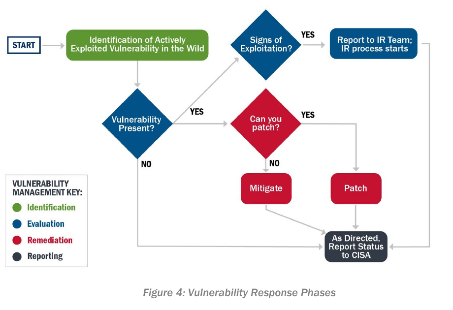
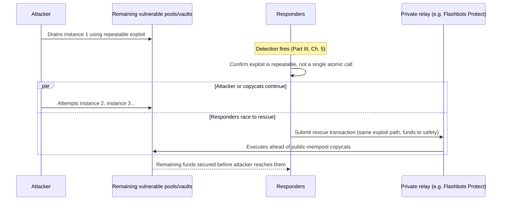
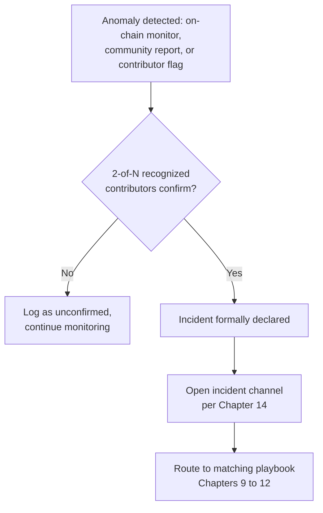
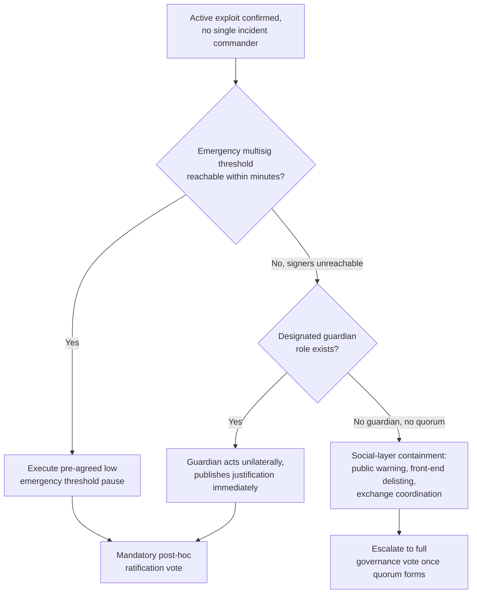

# Part 4: Playbooks

[Back to Handbook contents](index.md) | [Series index](../index.md)

This part is the operational library the rest of the handbook builds toward: one chapter per incident class, each written as a runbook a responder can open the moment an incident is declared. It assumes the roles from Part I, the communication rules from Part II, and the detection and evidence-collection mechanics from Part III (Chapters 5 through 7); what changes here is the level of altitude, from lifecycle theory down to the specific sequence of actions, checklists, and message templates a team executes under pressure. The same discipline (contain, preserve evidence, communicate, recover) repeats across every chapter because a responder mid-incident should never have to hunt across a document for the next step.

---

## 8. Playbook Overview

### 8.1 When to Use a Playbook

A **playbook** activates the moment triage (Part III, Chapter 6) confirms that an anomaly crosses the threshold defined in the **severity** and triage matrix (Appendix B), not before. Most alerts a monitoring stack generates are noise or near-misses: a large but legitimate withdrawal, a failed transaction from a misconfigured bot, a false-positive drainer signature. Opening a full incident playbook for every one of these burns the team's capacity for the incident that actually matters, and NIST Special Publication (SP) 800-61 Revision 3 frames this discipline explicitly, treating triage as a gate that sits between detection and the Respond function of the Cybersecurity Framework (CSF) 2.0 rather than a formality ([NIST SP 800-61r3, April 2025](https://csrc.nist.gov/pubs/sp/800/61/r3/final)). Once triage confirms an incident, the playbook is not optional reading, it is the default action; deviating from it requires the Incident Commander to say so explicitly and record why.

| Signal at triage | Playbook to open |
|---|---|
| Confirmed unauthorized fund movement from protocol contracts | Chapter 9: Smart Contract and Protocol Hack |
| Multiple users reporting drained wallets after visiting a link or dApp | Chapter 10: Wallet Drainer and Phishing |
| Employee device shows signs of compromise (unexpected process, exfil traffic) | Chapter 11: Malware and Compromised Endpoints |
| Pattern matches known nation-state social engineering (fake job, fake call) | Chapter 12: Insider and Nation-State-Style Attacks |
| No single team owns the affected system or governance is distributed | Chapter 13: Decentralized Incident Response |

### 8.2 Defining Incident Type, IOCs, Containment, and Recovery

Every playbook in this part follows the same four-field anatomy so that postmortems (Part V) and detection tuning can aggregate data across incidents instead of treating each one as a bespoke narrative. **Incident type** is a taxonomy tag, ideally mapped to the [OWASP Web3 Attack Vectors Top 15](https://scs.owasp.org/sctop10/Web3-Attack-Vectors-Top15/) codes (WA01 through WA15) so that this handbook's incidents and Handbook 10's attack-vector mapping speak the same language. **Indicators of compromise (IOCs)** are the concrete, shareable artifacts: transaction hashes, attacker addresses, malicious contract bytecode hashes, phishing domains, malware file hashes. **Containment** is the set of immediate, ideally reversible actions that stop the incident from getting worse. **Recovery** is the set of actions that restore normal operation once containment holds.

| Field | Definition | Example (Chapter 10 incident) |
|---|---|---|
| Incident type | WA-code + short label | WA06: UI/UX Spoofing & Approval Phishing |
| IOCs | Addresses, hashes, domains | `0xAttacker...`, `evil-mint.xyz`, malicious `setApprovalForAll` calldata |
| Containment | Immediate reversible actions | Domain takedown request, wallet-provider blocklist submission |
| Recovery | Steps to restore normal state | User approval-revocation campaign, IOC feed to Part III detection |

### 8.3 Best Practices for Playbook Design

A **playbook** that only exists as a page in a wiki hosted behind the same single sign-on the incident might have compromised is not a playbook, it is a liability. Design every playbook to be short enough to execute from memory under stress, action-first rather than explanatory, available offline or through a channel independent of primary infrastructure (a printed copy, an offline password-manager entry, a static page mirrored outside the main stack), and owned by a named role who is accountable for keeping it current. Version every playbook like code: date it, log changes, and re-run a **tabletop exercise** against it at a fixed cadence, since an untested playbook is a hypothesis, not a procedure. NIST SP 800-61r3 treats preparation as continuous rather than a one-time document ([NIST SP 800-61r3](https://csrc.nist.gov/pubs/sp/800/61/r3/final)), and CISA's incident response guidance echoes the same point for the same reason: the plan degrades the moment it stops matching reality.

- Keep each playbook to one screen or one printed page per phase (immediate actions, parallel roles, **containment**, recovery).
- Store an offline, out-of-band copy that does not depend on the primary communication stack (Chapter 14 covers the backup channel).
- Assign a named owner and a review date; stale playbooks fail exactly when needed.
- Rehearse via tabletop exercise at least twice a year and after every material architecture change.
- Cross-link every playbook to the message templates in Appendix D so no one drafts a holding statement from scratch mid-incident.

---

## 9. Smart Contract and Protocol Hack

A live exploit against a smart contract or protocol is the highest-tempo incident this handbook covers: funds move in seconds, and every minute of delay is a minute an attacker has to bridge, mix, or offload stolen assets.


*Figure. A vulnerability becomes an incident branch when exploitation is observed. Otherwise the decision remains exposure-driven: confirm presence, patch where possible, mitigate where it is not, and report status. For a smart contract, "can you patch?" may mean an authorized proxy upgrade; for immutable code it means containment, migration, or compensating controls instead. Source: [CISA Federal Government Cybersecurity Incident and Vulnerability Response Playbooks, Figure 4](https://www.cisa.gov/sites/default/files/2023-01/federal_government_cybersecurity_incident_and_vulnerability_response_playbooks_508c_5.pdf), public domain (U.S. government work).*

### 9.1 Immediate Actions Checklist

The first fifteen minutes decide how much of the loss is preventable. Confirm the alert against a second, independent data source before acting (a single monitoring bot's false positive should never trigger a public pause), because a wrong call here has its own cost in user trust. Then move in this order:

1. **T+0:** Confirm the exploit is real using a block explorer or simulation tool (Tenderly, Etherscan) against the flagged transaction.
2. **T+2:** Page the on-call **Incident Commander** and assemble the roles in Section 9.2.
3. **T+5:** Snapshot state before it disappears: the exploit block number, the full transaction trace, mempool activity, and any pending transactions from the attacker address.
4. **T+7:** If the protocol has an emergency pause and pausing does not itself trigger further loss, evaluate and execute it.
5. **T+10:** Check whether stolen funds are moving toward a centralized exchange or bridge; if so, alert that venue's compliance or security contact immediately, funds sitting in a deposit queue are the best chance at a freeze.
6. **T+15:** Decide, with Communications Lead and Legal, whether any public statement is needed yet; premature disclosure can tip off an attacker mid-exploit or invite copycats before **containment** holds.

### 9.2 Perform in Parallel by Role

Sequential handoffs cost minutes the team does not have, so once an incident is confirmed, every role below starts working simultaneously rather than waiting for a briefing to finish.

| Role | Immediate parallel task |
|---|---|
| Incident Commander | Owns the decision to pause/not pause; coordinates the other roles; is the single point that resolves conflicting recommendations |
| Smart Contract Engineer | Simulates the exploit against a forked mainnet to confirm root cause and scope; drafts the pause or mitigation transaction |
| Forensics / On-Chain Analyst | Traces fund flow in real time (Nansen, Arkham, Chainalysis Reactor); flags exchange deposit addresses |
| Communications Lead | Drafts the holding statement; monitors social channels for user panic and misinformation |
| Legal / Compliance | Assesses sanctions exposure of the attacker address, notification obligations, and law-enforcement engagement criteria |
| Community / Support | Fields user reports; funnels new information back to Forensics without publicly confirming unverified details |

### 9.3 Information Gathering (Issue, Timeline, Transactions, Addresses, Funds, Attacker)

Six categories of information must be captured continuously from the first minute, because this data feeds both the **containment** decisions made in real time and the forensics handoff to the EVM Forensics and DeFi Recovery Handbook (04) once the acute phase ends.

| Category | What to capture | Typical tool |
|---|---|---|
| Issue | Root cause hypothesis, affected function/module | Source diff, static analysis, Tenderly simulation |
| Timeline | UTC timestamps for detection, each action taken, each fund movement | Append-only incident log (Section 14.3 format) |
| Transactions | Exploit transaction(s), any follow-on transfers, gas paid | Block explorer, Etherscan/blockchain-specific explorer |
| Addresses | Attacker EOA/contract, any known-associated addresses, mixer or bridge hops | Arkham Intelligence, Chainalysis Reactor |
| Funds | Amount and asset stolen, current custody location, movement velocity | On-chain tracing dashboards, exchange compliance liaison |
| Attacker | Behavioral fingerprint (gas patterns, prior addresses, tooling), any negotiation contact | OSINT, prior incident database, SEAL ISAC intel sharing |

### 9.4 On-Chain vs. Off-Chain Containment (Rescue Window for Non-Atomic Attacks)

Containment splits into two categories with different owners and different speed. **On-chain containment** acts on the protocol itself: pausing, upgrading a proxy, migrating liquidity, or blocklisting an address at the contract level where the code supports it. **Off-chain containment** acts on the surface around the protocol: pulling the front-end offline, revoking exposed API keys and RPC access, and asking exchanges and bridges to flag the attacker's deposit address. Neither substitutes for the other; a paused contract with a front-end still soliciting deposits, or a taken-down front-end with an unpaused vulnerable contract, both leave exposure open.

Not every exploit is a single atomic transaction, and that distinction matters for **containment** strategy. Some vulnerabilities are repeatable: any address that discovers the bug can trigger it independently against every remaining vulnerable pool, vault, or market. The Nomad Bridge incident of August 1, 2022 is the reference case: a misconfigured Merkle root validation treated an unproven message as automatically valid, and once the first exploit transaction was copied, the attack became a "free-for-all" that hundreds of independent addresses replicated against the remaining bridge balance before it was drained ([Nomad post-mortem coverage, Rekt.news](https://rekt.news/nomad-rekt/)). The Curve Finance incident of July 30, 2023 shows the defensive mirror image: a compiler-level reentrancy-guard bug in specific Vyper releases (0.2.15, 0.2.16, and 0.3.0) left several stablecoin pools exploitable, and independent MEV searchers, notably the address publicly associated with the handle `c0ffeebabe.eth`, raced ahead of remaining attackers to drain the still-vulnerable pools into safety and later returned the rescued funds ([Vyper security advisory](https://github.com/vyperlang/vyper/security/advisories/GHSA-g2q6-65hc-h6hh)).

This is the **rescue window**: the interval between when a repeatable exploit is discovered and when every reachable instance of it has either been drained by an attacker or secured by a defender. Racing a rescue transaction through the public mempool exposes it to front-running by the same class of actor it is trying to outrun, so rescue transactions are typically submitted through a private relay such as [Flashbots Protect](https://docs.flashbots.net/flashbots-protect/overview) that shields them from the public mempool until included.



*Figure 1. The rescue window for a non-atomic, repeatable exploit. Containment is a race, not a single button press, and the winner is whoever reaches each remaining instance first.*

### 9.5 Post-Incident Actions

Once fund movement stops and **containment** holds, the incident shifts from acute response to stabilization. Hand the fund trace to a dedicated forensics workstream (Handbook 04 covers the methodology in full) so real-time responders can stand down. Develop and independently audit any patch before redeployment, no matter how time-pressured the situation feels; a rushed, unaudited fix that introduces a second bug is a documented failure mode in this space. If governance approval is required to redeploy or to authorize a treasury-funded user compensation plan, start that process immediately rather than after the technical fix is ready. Publish an initial public statement within the first hours (a holding statement, not a full analysis) and commit to a fuller post-mortem timeline, typically within one to three weeks once forensics and legal review are complete. Assess regulatory notification obligations with Legal in parallel; several jurisdictions treat a material asset loss event as a reportable incident regardless of the protocol's legal structure.

### 9.6 Appendix: Key Roles, Tools, Message Templates

| Category | Item |
|---|---|
| Roles | Incident Commander, Smart Contract Engineer, Forensics/On-Chain Analyst, Communications Lead, Legal/Compliance, Community/Support |
| On-chain tooling | Block explorer (Etherscan or chain equivalent), Tenderly (simulation and alerting), Chainalysis Reactor / Arkham Intelligence / Nansen (tracing) |
| Containment tooling | Multisig (Safe), Flashbots Protect (private rescue transactions), status page provider |
| Coordination | SEAL 911 (24/7 cross-protocol incident response) and SEAL's ISAC intelligence sharing ([securityalliance.org](https://www.securityalliance.org/)) |
| Communication | Verified social account, status page, incident channel (Chapter 14) |

```markdown
**Initial holding statement template**

We are aware of unusual activity affecting [protocol name] and are actively
investigating. As a precaution we have [paused the affected contract /
disabled the affected front-end feature]. No further user action is required
at this time. We will post a substantive update within [X hours] at
[status page URL]. Do not interact with any address or link claiming to
offer a "fix" or "refund"; we will never ask you to sign a transaction to
recover funds.
```

---

## 10. Wallet Drainer and Phishing Incidents

Wallet drainers are turnkey kits, some sold as drainer-as-a-service, that construct malicious approval or signature requests designed to look like routine dApp interactions. The OWASP Web3 Attack Vectors Top 15 catalogs this as WA04 (Drainer Malware & Drainer-as-a-Service) and its companion WA06 (UI/UX Spoofing & Approval Phishing) ([OWASP Web3 Attack Vectors Top 15](https://scs.owasp.org/sctop10/Web3-Attack-Vectors-Top15/)); research from anti-scam trackers such as ScamSniffer has documented drainer kits including Inferno Drainer and Angel Drainer responsible for hundreds of millions of dollars in cumulative losses across 2023 and 2024.

### 10.1 Detection and Triage

Signals include a sudden spike in `approve`, `permit`, or `setApprovalForAll` transactions from many distinct users toward a single new contract, direct user reports of drained assets, alerts from wallet-integrated scam detection (Blockaid, ScamSniffer), or a spike in traffic to a newly registered look-alike domain. Triage classifies scope before response, because the correct action differs sharply by tier.

| Scope | Trigger | Response tier |
|---|---|---|
| Single user | One report, no shared vector identified | Support-level guidance, log as data point |
| Mass campaign | Multiple unrelated users, same malicious contract/domain | Full playbook: takedown, blocklist, public notice |
| Official-channel compromise | Malicious link posted from a verified project account | Full playbook plus immediate account lockdown (Section 10.2) |

### 10.2 Containment (Secure Remaining Assets)

Move on two fronts at once: stopping new victims and limiting damage to victims already exposed. File an abuse report with the domain registrar and submit the phishing URL to Google Safe Browsing, PhishFort, and Chainabuse to accelerate blocklisting across browsers and wallets. Coordinate with wallet providers (MetaMask, Phantom, and others expose blocklist submission channels) to flag the malicious contract address directly in-wallet. If the vector was a compromised official account, lock it down immediately: rotate credentials, enforce hardware-backed multi-factor authentication, and notify the platform's trust-and-safety team, since a compromised verified account is itself an active **attack surface** until reclaimed. For affected users, point them at an approval-revocation tool; checking exposure is a single read call:

```bash
# Example: check ERC-20 allowance a user granted to a suspected drainer contract
cast call $TOKEN_ADDRESS "allowance(address,address)(uint256)" $USER_ADDRESS $DRAINER_CONTRACT --rpc-url $RPC_URL
```

Direct users to a revocation interface (such as Revoke.cash) rather than asking them to run raw transactions themselves during an active incident.

### 10.3 User and Community Notification

Speed and accuracy trade off against each other here, and getting the balance wrong in either direction has real cost: too slow, and more users interact with the malicious link; too fast with unverified detail, and the team damages its own credibility or spreads panic. The notification should tell users exactly what happened, exactly what to do now (a direct link to the revocation flow, not just "check your approvals"), and exactly what not to do (never interact with a link claiming to help, even to "test" it, since secondary phishing that impersonates the **incident response** itself is a documented follow-on pattern). Point users only to previously verified official channels and warn explicitly that DMs offering "manual recovery" are never legitimate.

### 10.4 Recovery and Follow-Up

Track which wallets were affected and offer direct support through the revocation process rather than a generic FAQ link. Monitor for delayed secondary drains: some drainer kits batch-sign multiple approvals during the initial interaction and execute the actual transfer later, so a user who "revoked in time" may still be exposed to a stale signature. Confirm takedown completion with the registrar and blocklist providers rather than assuming the initial report succeeded, and feed the IOCs (malicious contract address, phishing domain, wallet-drainer signature) into the detection rules maintained under Part III and into shared intelligence channels such as Chainabuse and SEAL's ISAC so the next team facing the same kit starts from a known baseline.

---

## 11. Malware and Compromised Endpoints

A compromised employee or contributor device is a different tempo of incident than a live protocol exploit: the acute risk is usually key or session exfiltration rather than an in-progress drain, but the lateral-movement risk is often wider than it first appears.

### 11.1 Secure Crypto Assets First

The moment device compromise is suspected, before further diagnosis, move any funds accessible from that device (hot wallet keys, exchange API keys with withdrawal rights, treasury signer access) to a clean, verified-uncompromised destination. Every minute of delay is a minute malware documented in campaigns such as AppleJeus (Lazarus Group's cryptocurrency-targeting malware family, first catalogued by Kaspersky in 2018 and covered in [CISA advisory AA21-048A](https://www.cisa.gov/news-events/cybersecurity-advisories/aa21-048a)) has to exfiltrate a **seed phrase**, hijack a clipboard-pasted address, or auto-sign a pending transaction. Treat any signature or approval made on that device during the suspected compromise window as attacker-influenced by default; verify each one rather than assuming it was legitimate.

1. Move hot-wallet funds to a **hardware wallet** or address generated on a known-clean device.
2. Revoke any API keys with withdrawal or transfer permissions issued to that device.
3. Flag every transaction signed on the device during the suspected window for independent review.
4. Only then proceed to diagnosis and forensic imaging.

### 11.2 Notify Colleagues and Affected Parties

Assume lateral exposure rather than waiting for forensics to confirm it. If the device had access to shared credentials, shared drives, or bot tokens for team communication platforms, notify every potentially exposed colleague immediately with the device identifier, the suspected compromise window, and any known indicators, so they can check their own exposure in parallel rather than in sequence. Silence during forensic triage is a common and costly mistake: the cost of a false alarm to a colleague is minutes, the cost of a missed lateral compromise is another full incident.

### 11.3 Secure Accounts and Credentials

Rotate every credential the compromised device had access to, prioritized by **blast radius**.

| Credential type | Action | Priority |
|---|---|---|
| Password manager master credential | Rotate from a separate, known-clean device; force re-encryption | Immediate |
| SSH / deploy keys | Revoke and reissue; audit recent usage logs | Immediate |
| Cloud console / IaC access | Revoke active sessions; rotate API tokens | Immediate |
| Multi-factor authentication enrollment | Re-enroll on new hardware; prefer FIDO2/passkey over SMS or app-based OTP | High |
| SaaS session tokens (chat, ticketing, VCS) | Force logout across all sessions; rotate stored tokens | High |

### 11.4 Notification of Authorities Where Appropriate

Engage law enforcement when theft exceeds a materiality threshold set in advance, when the pattern matches known nation-state tooling (Chapter 12 covers the coordination path in more depth for that case), or when the incident meets local mandatory-reporting criteria. In the United States, the FBI's Internet Crime Complaint Center (IC3) is the standard intake point for cryptocurrency theft ([ic3.gov](https://www.ic3.gov/)); most jurisdictions maintain an equivalent national cybercrime unit or computer emergency response team (CERT). Loop in Legal before making contact if there is any possibility the compromise involves a sanctioned actor, since that changes both the reporting obligation and what the organization may safely do next.

### 11.5 Device Replacement and Rebuild

Do not clean a compromised device and return it to sensitive use. For any role with treasury, signing, or production access, wipe and reimage from verified-clean media or replace the hardware outright; a device that hosted key-logging or memory-scraping malware cannot be trusted to be fully clean by inspection alone. Reinstall software only from sources with verifiable checksums or signatures, re-enroll the rebuilt device in endpoint detection and response (EDR) tooling before it touches anything sensitive, and restore data only from backups confirmed to predate the compromise window.

### 11.6 Ongoing Vigilance

Compromise of one device is frequently a reconnaissance step rather than the whole campaign, particularly where nation-state tooling is involved (Chapter 12). Maintain heightened monitoring after rebuild: watch for the same malware family's indicators reappearing elsewhere in the fleet, unusual outbound connections from the rebuilt device, and repeat credential-audit sweeps at a shortened interval for at least one full cycle. Treat the incident as the trigger to accelerate any pending rollout of phishing-resistant, hardware-backed multi-factor authentication (FIDO2 passkeys) for high-privilege roles, since credential rotation alone does not close the gap that let the initial compromise succeed.

---

## 12. Insider and Nation-State-Style Attacks (e.g., DPRK Vectors)

State-linked actors, most visibly groups attributed to the Democratic People's Republic of Korea (DPRK) and tracked under the Lazarus Group umbrella, operate with patience and resourcing that generic malware playbooks do not anticipate. MITRE's [ATT&CK](https://attack.mitre.org/) knowledge base and its digital-asset-specific counterpart [AADAPT](https://aadapt.mitre.org/) (Adversarial Actions in Digital Asset Payment Technologies) both catalog these actors' tactics, techniques, and procedures, and this handbook maps directly to WA05 (Fake Interview & Video Call **Social Engineering**), WA12 (Insider Threats & Collusive Abuse), and WA15 (Nation-State Infiltration via Fake Hiring & Malicious OSS Contributions) in the [OWASP Web3 Attack Vectors Top 15](https://scs.owasp.org/sctop10/Web3-Attack-Vectors-Top15/).

### 12.1 Recognizing Attack Patterns (Fake Software, PDFs, Conferences)

The most damaging documented DPRK-attributed intrusion in this space is the Ronin Bridge hack of March 2022: an employee at Sky Mavis, the studio behind Axie Infinity, was targeted through a fake job offer that included a malicious PDF; opening it compromised the device and ultimately allowed the attacker to obtain enough validator signatures to authorize a fraudulent withdrawal of approximately $625 million, an attack the FBI publicly attributed to the Lazarus Group ([FBI statement on Ronin/Lazarus attribution, April 2022](https://www.fbi.gov/news/press-releases/fbi-statement-on-attribution-of-malicious-cyber-activity-posed-by-the-democratic-peoples-republic-of-korea)). A related pattern, documented by Palo Alto Networks' Unit 42 as the "Contagious Interview" campaign, has DPRK-linked actors pose as recruiters and induce software engineers to install a malicious npm package or a trojanized video-call application as part of a fake technical interview. A separate and increasingly common vector is direct infiltration: DPRK operatives using fabricated identities to obtain remote developer roles. Security awareness vendor KnowBe4 publicly disclosed in 2024 that it had unknowingly hired such an individual, who received a company laptop that immediately began loading malware, and a joint US government advisory details the broader scheme ([FBI/CISA/State Department advisory on DPRK IT workers](https://www.ic3.gov/CSA/2024/240502.pdf)).

| Pattern | Delivery vector | Red flags | Case reference |
|---|---|---|---|
| Fake job offer | Malicious PDF or coding-test repository | Urgency, requests to open attachments outside normal channels | Ronin Bridge, March 2022 |
| Fake interview / trojanized call software | Malicious npm package or fake video-conferencing app during a "technical interview" | Non-standard software required to join a call or complete a test | Unit 42 "Contagious Interview" |
| Fabricated remote-worker identity | Standard hiring pipeline, stolen or synthetic identity documents | Reluctance to appear on camera, laptop shipped to a freight-forward address | FBI/CISA/State DPRK IT worker advisory |

### 12.2 Immediate Containment and Evidence Preservation

Nation-state intrusions typically have longer dwell time and more than one foothold, so a response scoped to a single device under-scopes the problem. Assume the possibility of a broader compromise until evidence says otherwise, and preserve volatile evidence before isolating a system, since isolating first can destroy exactly the evidence a forensics team trained in nation-state tactics, techniques, and procedures (TTPs) needs. [RFC 3227](https://www.rfc-editor.org/rfc/rfc3227) defines the standard order of volatility for evidence collection, most perishable first:

1. Registers, cache, running process state
2. Routing table, ARP cache, kernel statistics, main memory
3. Temporary file systems
4. Disk
5. Remote logging and monitoring data relevant to the system
6. Physical configuration and network topology
7. Archival media

Engage forensics specialists with nation-state TTP experience before making the intrusion public in any channel; premature public disclosure can burn an active law-enforcement investigation before it produces attribution or recovery.

### 12.3 Coordination with Law Enforcement and Ecosystem

Route contact through the FBI's IC3 and the relevant field office, CISA for infrastructure-level indicators, and Treasury's Office of Foreign Assets Control (OFAC) when a sanctioned entity may be involved, since Lazarus-linked addresses and entities are OFAC-designated and that designation carries direct legal consequences for any organization that transacts with them, including a negotiated "bounty" payment. Ecosystem coordination runs through SEAL 911 for 24/7 cross-protocol **incident response** and SEAL's ISAC for intelligence sharing ([securityalliance.org](https://www.securityalliance.org/)), and through exchange compliance teams for freezing or flagging attacker-controlled deposit addresses.

| Contact | Trigger | What they need from you |
|---|---|---|
| FBI IC3 / field office | Confirmed theft, suspected nation-state involvement | Transaction hashes, addresses, timeline, indicators |
| OFAC (via counsel) | Suspected sanctioned-entity involvement | Legal review before any negotiation or payment |
| SEAL 911 / ISAC | Any live incident needing cross-protocol response capacity | Incident summary, IOCs, current containment state |
| Exchange compliance | Stolen funds moving toward a deposit address | Address, amount, transaction hash, urgency |

### 12.4 Communication and Recovery

Public communication differs sharply from the other playbooks in this part: do not attribute an incident to a specific nation-state publicly until law enforcement or OFAC confirms it, since premature attribution can compromise an active investigation and exposes the organization to defamation risk if the attribution later proves wrong. Keep public messaging focused on concrete user-protection actions rather than attacker identity, and coordinate every external statement with Legal. Recovery in this class of incident is rarely a pure code fix; it usually exposes a process gap in hiring, offboarding, or credential lifecycle management, and the durable fix sits in the Hiring, Remote Work, and **Insider Threat** Handbook (05) and the Employee Lifecycle Security Handbook (03) rather than in this handbook alone.

---

## 13. Decentralized Incident Response

Some Web3 organizations have no single **incident commander** by design: authority is distributed across a **multisig** signer set, a decentralized autonomous organization (DAO), or a pseudonymous contributor community. This chapter adapts the same discipline to that structure.

### 13.1 Guiding Principles (Zero-Trust, Shared Responsibility, Evidence First)

Three principles anchor decentralized response. **Zero-trust identity**: no responder's claim is acted on purely because the account making it is recognized, because in a pseudonymous team a compromised "known" account issuing a fake emergency request is itself a plausible attack. **Shared responsibility**: authority should have no single point of failure for the same reason code should not, so no one signer, moderator, or contributor can unilaterally commit the whole response. **Evidence first**: every action taken during the incident is justified by evidence attached at the time of the decision (a transaction hash, a simulation output, a signed statement), because a decentralized team typically reconstructs trust after the fact from that evidence trail rather than from an org chart.

### 13.2 Roles and Identities in Decentralized Teams

Decentralized structures still need the functions Part I (Chapter 3) defines, they just fill them differently.

| Centralized role | Decentralized equivalent |
|---|---|
| Incident Commander | Multisig cosigner quorum acting as a body, or a rotating on-call from a pre-agreed responder pool |
| Verified employee identity | Reputation built from prior signed commits, ENS-linked history, and PGP or Keybase social proofs |
| Communications Lead | Distributed community moderators operating under a pre-agreed messaging protocol |
| Legal/Compliance | Retained counsel engaged by the foundation or steward entity, if one exists |

### 13.3 Preparation Checklist for Distributed Response

- Publish an emergency contact list with independently verifiable identities (signed keys, not just handles).
- Pre-agree a **multisig** signer set and an emergency-action threshold distinct from routine governance (Section 13.5).
- Maintain a backup communication channel that does not depend on the primary infrastructure stack (Chapter 14).
- Where technically feasible, stage or pre-sign pause transactions so execution does not require drafting under pressure.
- Join a cross-protocol responder network, such as SEAL's ISAC, so an unfamiliar team is not starting from zero on IOCs or TTPs.

### 13.4 Detection and Triage Flow

Declaring an incident without a single on-call manager requires a quorum mechanism rather than an individual judgment call.



*Figure 2. Decentralized detection and triage. Formal declaration requires independent confirmation from at least two recognized contributors, not a single report.*

### 13.5 Containment Options Without Single Authority

The central tension in decentralized **containment** is that fast action normally needs one button, and decentralized governance intentionally removes single buttons. The resolution is tiered authority, pre-agreed before any incident. Arbitrum's Security Council illustrates the pattern in production: a defined **multisig** splits its threshold by action type, a lower bar for genuine emergency pauses and a higher bar with a timelock for routine actions, so speed and safety are balanced by design rather than improvised mid-incident ([Arbitrum DAO governance documentation](https://docs.arbitrum.foundation/)). Where no multisig quorum is reachable in time, a designated guardian role can act unilaterally under strict conditions: the action must be publicly justified immediately, and it is subject to mandatory ratification once quorum re-forms. Where no on-chain lever exists at all, containment moves to the social layer: public warnings, delisting requests to front-ends and aggregators, and direct coordination with exchanges, none of which stops the contract itself but all of which reduce the pool of victims.



*Figure 3. Containment options ranked by available authority when no single incident commander exists. Every path ends in public accountability, either immediate or through ratification.*

### 13.6 Eradication and Recovery

Without a formal quality-assurance organization, patch review needs an explicit substitute: require sign-off from at least one independent contributor who did not write the fix, not just the original author's self-review. Stage redeployment with a public verification window before it goes fully live, and publish exactly which signer or guardian executed which recovery action, since that public record is the accountability mechanism a hierarchical org would otherwise get from an internal chain of command.

### 13.7 Post-Incident Actions and Quick-Start Templates

Publish the post-mortem to a canonical, censorship-resistant, permanent location (a content-addressed store such as IPFS, or a version-controlled repository) rather than relying on a single official blog that may itself have been part of the incident's **attack surface**. Reuse the message templates in Appendix D rather than drafting new ones mid-crisis; the quick-start value of a template is lost if it has to be written from scratch the first time it is needed.

### 13.8 Pros and Cons of Decentralized IR

| Pros | Cons |
|---|---|
| No single point of compromise for response authority itself | Consensus takes longer exactly when speed matters most |
| Draws on a broader, distributed pool of technical expertise | Verifying pseudonymous identity mid-incident is inherently harder |
| Transparent, publicly auditable accountability trail | Legal liability for actions taken is often ambiguous |
| Resistant to a single compromised insider halting response | Coordination overhead across time zones and channels |

---

## 14. War Room and Crisis Coordination

A **war room** is the synchronous coordination structure that every **playbook** in this part routes into once severity crosses a defined threshold; it exists so that the parallel roles in Section 9.2 (or their decentralized equivalents in Chapter 13) work from one shared source of truth instead of five disconnected threads.

### 14.1 When to Activate a War Room

Activate when **severity** reaches High or Critical on the matrix in Appendix B, when funds are actively moving, or when the incident spans more than one team and needs live coordination rather than asynchronous updates. Activation is a low-cost, reversible decision: standing a **war room** down once it turns out not to be needed costs a few minutes, while delaying activation on a genuine Critical incident costs the minutes containment depends on.

### 14.2 Template for Incident Channel and T-Minus Deadlines

Create a dedicated, clearly named incident channel (for example, `#incident-YYYYMMDD-shortname`) with a pinned message stating the **Incident Commander**, current status, and a link to the live timeline document. Attach a T-minus deadline table to the pin so every participant knows what update is due when, without asking.

| Deadline | Action |
|---|---|
| T+15 min | First internal status update to the incident channel |
| T+60 min | First external holding statement (Section 9.6 template) |
| T+4 hours | Substantive update: scope, containment status, next milestone |
| T+24 hours | Detailed update or interim report |
| T+1 to 3 weeks | Full public post-mortem (Part V) |

### 14.3 Information Gathering and Timeline

Maintain a single append-only timeline document for the duration of the incident; retroactively editing entries destroys the evidentiary and after-action value of the log. Every entry is timestamped in UTC and links its supporting evidence.

| Timestamp (UTC) | Actor | Action | Evidence link |
|---|---|---|---|
| 2026-01-01 03:12 | Monitoring bot | Alert fired: large outflow from vault contract | Tx hash / dashboard link |
| 2026-01-01 03:15 | On-call engineer | Confirmed via Tenderly simulation | Simulation link |
| 2026-01-01 03:19 | Incident Commander | Declared incident, opened war room | Channel link |

### 14.4 Handoff to Forensics and Long-Term Recovery

Stand the **war room** down once fund movement has stopped, **containment** holds, and no further real-time decisions are pending, then hand the incident to the sustained forensics and recovery workstream. Fund tracing and recovery mechanics beyond this point are the province of the EVM Forensics and DeFi Recovery Handbook (04), and the post-incident review that closes the loop belongs to Part V of this handbook.

---

## 15. Safe Harbor and Whitehat Recovery

An ethical hacker who spots an in-progress exploit faces a genuine dilemma: intervening to rescue funds may itself require executing the same exploit code, which without prior authorization looks indistinguishable from the attack it is trying to stop. Safe Harbor frameworks exist to remove that dilemma before an incident, not during one.

### 15.1 Pre-Authorizing Whitehats for Active Exploits

Security Alliance's Safe Harbor is the leading concrete implementation of this idea: a protocol adopts it through a governance decision made in advance, granting whitehat responders standing legal authorization to intervene in an active exploit under defined conditions, described by SEAL as legal protection for whitehat rescues during active exploits ([Security Alliance Safe Harbor](https://www.securityalliance.org/)). The core conditions typically require that intervention be necessary to prevent loss or further loss, that recovered funds be returned to the protocol minus an agreed bounty, and that the whitehat not exploit the authorization for gain beyond those agreed terms. Pre-authorization matters because it converts a split-second legal judgment call, made mid-exploit by someone with no time to consult counsel, into a decision the protocol already made calmly, in advance.

### 15.2 Recovery Addresses, Bounty Terms, and Return of Funds

A workable Safe Harbor adoption needs concrete, discoverable mechanics, not aspirational language a whitehat has no time to interpret mid-incident.

| Field | Typical value |
|---|---|
| Recovery address | Pre-designated multisig, published in protocol docs and repository so it is discoverable without delay |
| Bounty terms | Percentage of rescued funds, commonly aligned with the protocol's existing bug bounty ceiling |
| Return deadline | Fixed window after the exploit (commonly on the order of months) to return principal minus the agreed bounty |
| Scope | Explicit conditions under which the authorization applies (active exploit only, not a standing invitation to test in production) |

Real recoveries show both how well this can work and how badly it fails without concrete terms. In the Poly Network incident of August 2021, an attacker who extracted roughly $610 million voluntarily returned nearly all of it after a public, on-chain negotiation, and was later informally credited as "Mr. White Hat." In the Euler Finance incident of March 2023, an attacker who extracted approximately $197 million through a flawed donation-to-reserves mechanism returned the funds in tranches over several weeks following sustained on-chain pressure and negotiation, with Euler ultimately honoring an agreed bounty. By contrast, the KyberSwap incident of November 2023 (roughly $48 million) saw negotiations collapse after the attacker demanded governance control of the DAO as a term, a demand no protocol can safely grant, and the funds were not returned. The lesson across all three: terms need to be concrete, bounded, and agreed before the incident, exactly what Safe Harbor is designed to provide.

### 15.3 Relationship to Bug Bounty and Responsible Disclosure

Safe Harbor and bug bounty programs cover adjacent but distinct scenarios. A bug bounty (Immunefi, HackenProof, Cantina, and similar platforms) covers the pre-exploit case: a researcher finds a vulnerability and has time to disclose it responsibly before anyone exploits it. Safe Harbor covers the active-exploit case, where there is no time for that process because someone, possibly the researcher, possibly an attacker, is already exploiting it. A well-designed program references both explicitly, so a researcher who stumbles onto a bug already being exploited in the wild knows immediately that the rescue path is pre-authorized rather than legally ambiguous. The Mango Markets exploit of October 2022 is the cautionary counter-example: the attacker publicly framed the roughly $114 million extraction as a "legal" trading strategy and negotiated a settlement to keep a portion as a bounty, yet was subsequently criminally charged and convicted on market manipulation and fraud counts in United States federal court, a reminder that an informal, after-the-fact negotiation carries none of the legal certainty a written, pre-agreed Safe Harbor provides.

---

## 16. Vulnerability Disclosure and Bug Bounty Linkage

The incident channel and the vulnerability-disclosure channel need a clear boundary between them, because routing a not-yet-exploited bug report through **incident response** wastes the urgency that channel exists for, and routing a live incident through the slower disclosure triage queue costs time the response cannot afford.

### 16.1 When to Escalate to Disclosure and Security Contact

An incident, by definition, has already been exploited. A vulnerability report describes something that has not. When a live incident investigation surfaces a second, related but not-yet-exploited bug, escalate it out of the incident channel and into the dedicated security-contact or bug-bounty triage path rather than letting it linger inside **incident response**. A published `security.txt` file, per [RFC 9116](https://www.rfc-editor.org/rfc/rfc9116), is the standard, machine-discoverable way to expose that contact point so a researcher, or an internal team member, always has an unambiguous place to send it.

| Situation | Route to |
|---|---|
| Already exploited, funds or data affected | Incident channel (Chapters 9 to 14) |
| Discovered but not yet exploited, no active loss | Security contact / bug bounty triage |
| Discovered mid-incident, related but distinct bug | Flag to Incident Commander, then route to bug bounty triage once the acute phase ends |

### 16.2 Post-Incident Disclosure and Communication

Once an incident resolves, publish a coordinated disclosure of the root-cause vulnerability, even when it was not originally reported through the bug bounty program, so the wider researcher and protocol community can learn from it rather than rediscover it independently. Credit any whitehat or researcher involved, with their consent, and update the bug bounty program's scope and reward structure to reflect any gap the incident revealed, whether that is an unlisted contract, an underpriced **severity** tier, or a vulnerability class the program had not previously considered in scope. This step closes the loop into Part V's continuous-improvement cycle: a disclosure that never updates the program that should have caught the bug first is a missed opportunity repeated at the next incident.

---

**Key controls for Part 4**

- Match every declared incident to exactly one **playbook** using the decision table in Section 8.1, gated by triage, not raw alert volume.
- Run the six roles in Section 9.2 in parallel, never sequentially, and capture the six information categories in Section 9.3 continuously.
- **Treat non-atomic, repeatable exploits as a rescue-window race:** use a private relay for rescue transactions, not the public mempool.
- Adopt Security Alliance's Safe Harbor (or an equivalent pre-authorization) before an incident, with a discoverable recovery address and bounded bounty terms.
- Pre-agree tiered **containment** authority (emergency **multisig** threshold, guardian role, social-layer fallback) for any team without a single incident commander.
- Stand up the **war room** from Chapter 14 the moment severity crosses High/Critical, and hand off to forensics and Part V once containment holds.
