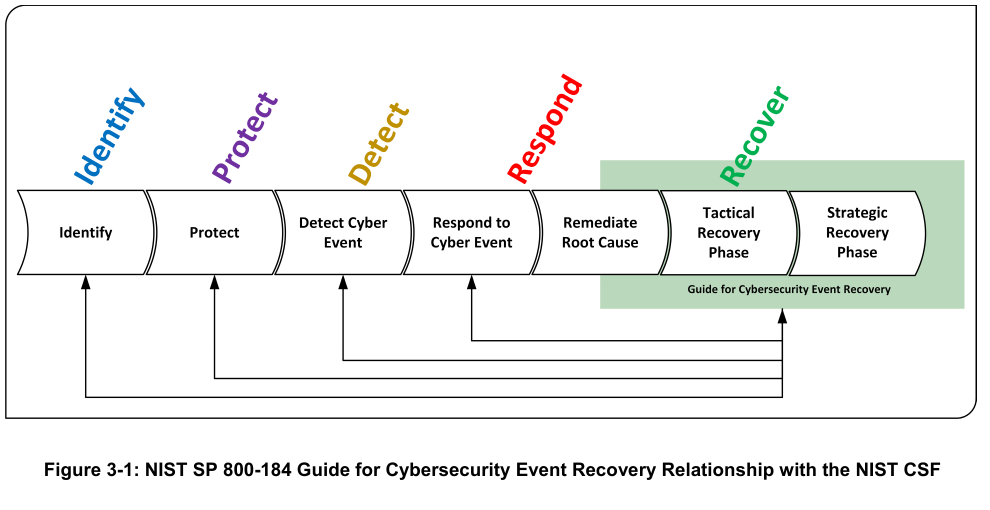
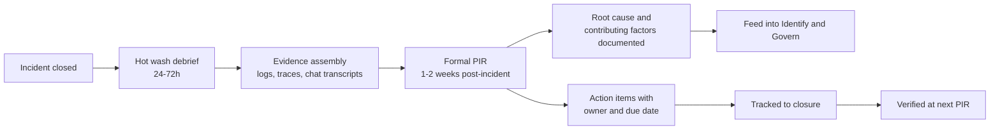
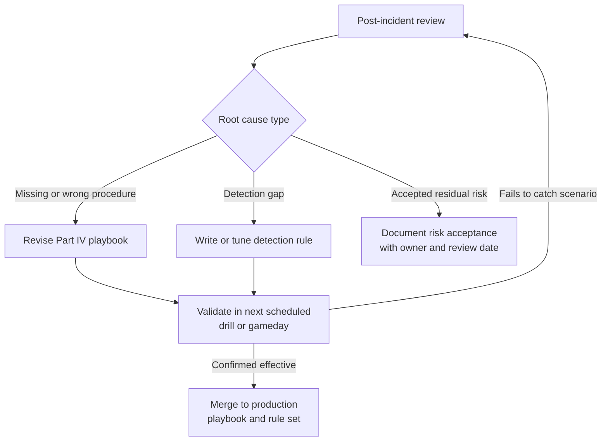
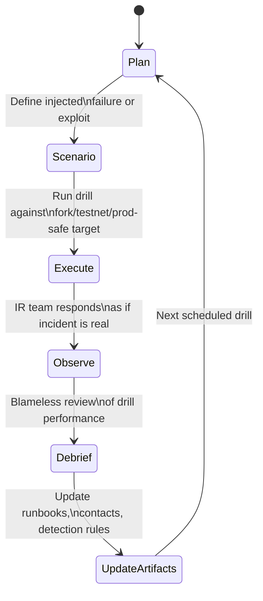
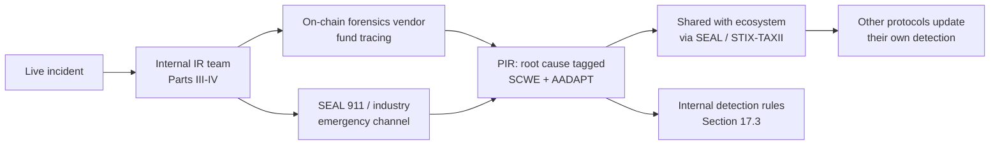

# Part 5: Lessons Learned and Improvement

[Back to Handbook contents](index.md) | [Series index](../index.md)

An incident that ends at recovery and never reaches a documented root cause will recur, often against the same class of weakness that just cost the protocol money. This part closes the loop between the playbooks in Part IV and the detection and preparation work in Part III: it sets out how to run a post-incident review that produces action items instead of blame, how to turn a root cause into an updated **playbook** or detection rule, and how to keep drills, runbooks, and threat-intelligence relationships current enough that the next incident is faster to contain than the last one.

---

## 17. Lessons Learned

A lessons-learned process is the mechanism that converts one team's bad day into every future incident being handled better. [NIST Special Publication (SP) 800-61 Revision 3](https://csrc.nist.gov/pubs/sp/800/61/r3/final), published in April 2025 as *Incident Response Recommendations and Considerations for Cybersecurity Risk Management: A CSF 2.0 Community Profile*, retired the older four-phase model (preparation, detection and analysis, **containment** and **eradication** and recovery, post-incident activity) in favor of mapping incident response work across all six functions of the [NIST Cybersecurity Framework (CSF) 2.0](https://www.nist.gov/cyberframework): Govern, Identify, Protect, Detect, Respond, and Recover. Under that model, lessons learned is not a phase that happens after Recover finishes; it is the mechanism by which Recover feeds directly back into Govern and Identify, so that the next incident starts from a stronger baseline rather than the same one.


*Figure. NIST separates tactical recovery—restoring the affected service—from strategic recovery, which removes the conditions that made the incident damaging and feeds improvements back into every earlier function. Declaring success after a contract is unpaused completes only the tactical half. Source: [NIST SP 800-184, Figure 3-1](https://csrc.nist.gov/pubs/sp/800/184/final), public domain (U.S. government work).*

### 17.1 Conducting Post-Incident Reviews

A post-incident review (PIR) is a structured, scheduled reconstruction of what happened, run separately from the pressure of active response. Two timing windows matter. A short "hot wash" debrief, held within 24 to 72 hours while memory is fresh, captures raw impressions and immediate fixes. The formal review, held one to two weeks later once logs, transaction traces, and communication records are assembled, produces the document that outlives the incident. Running the formal review too soon starves it of evidence; running it too late lets the team's memory of decision points decay.

The review must be blameless. This principle traces to Etsy's engineering culture writing under John Allspaw, who argued that punishing the individual who made a mistake teaches everyone else to hide mistakes rather than report them, which destroys the very information a security team depends on ([Etsy, Code as Craft, "Blameless PostMortems and a Just Culture"](https://www.etsy.com/codeascraft/blameless-postmortems)). [PagerDuty's postmortem guidance](https://www.pagerduty.com/resources/learn/postmortem-blameless/) and Google's Site Reliability Engineering practice both operationalize the same idea: the review asks "what in the system allowed this to happen," never "who caused this." A facilitator who was not part of the **incident response** should run the session, because a facilitator who was in the fire has a stake in a particular narrative.



*Figure 1. The post-incident review timeline. The formal review is deliberately separated from the hot wash so evidence, not adrenaline, drives the findings.*

A minimum PIR agenda covers: a factual timeline built only from logs, monitoring alerts, and transaction hashes (never memory alone); a stated business and financial impact, including funds at risk versus funds lost; what detection and response did well; what slowed the team down; the root cause and contributing factors (Section 17.2); and a list of action items, each with a named owner, a due date, and a tracking ticket. Publish the review internally to everyone with a stake in the outcome, and, following the norm set by public post-mortems such as Euler Finance's and Nomad's after their 2023 and 2022 incidents, consider a redacted external version when the incident affected user funds. External transparency after a Web3 incident has become close to an expectation rather than an option, and a well-run PIR is what makes that publication possible without exposing operational detail.

### 17.2 Documenting Root Cause and Contributing Factors

A root cause is the single condition that, if removed, would have prevented the incident. A contributing factor made the incident worse, more likely, or harder to detect, but removing it alone would not have stopped the attack. Conflating the two produces reviews that fix a monitoring gap and never touch the code defect that caused the loss, or the reverse. Two techniques keep the distinction disciplined: the Five Whys, which repeatedly asks why the immediately preceding cause occurred until the chain terminates in a systemic condition rather than a person, and the Ishikawa (fishbone) diagram, which sorts candidate causes into categories such as code, process, people, and environment before the team commits to a root cause. Fault tree analysis is worth adding when a Critical incident had multiple independent conditions that all had to hold simultaneously, since a single linear "why" chain understates that kind of compound failure.


*Figure. The fishbone structure this section references, forcing a reviewer to check every cause category (code, process, people, environment) before settling on a single root cause rather than stopping at the first plausible one. Source: [FabianLange, via Wikimedia Commons](https://commons.wikimedia.org/wiki/File:Ishikawa_Fishbone_Diagram.svg), CC BY-SA 3.0.*

Two real incidents show how root cause and contributing factors separate in practice. The [March 13, 2023 Euler Finance hack](https://rekt.news/euler-rekt/) lost roughly $197 million to a flaw in the `donateToReserves` function introduced by an earlier upgrade (EIP-14): the function let a user donate eTokens to protocol reserves without a health check on the donor's own borrowing position, letting the attacker manufacture an unhealthy account and then self-liquidate it at a discount. The root cause was the missing health check on that single code path. Contributing factors included the change having shipped without a targeted audit pass on the new donation logic and the absence of a real-time monitor for accounts crossing into unhealthy collateralization outside a normal liquidation flow. The attacker ultimately returned nearly all recoverable funds in tranches after Euler's team combined on-chain forensics with direct on-chain messaging, with the bulk of assets back under Euler's control by early April 2023.

The [August 2, 2022 Nomad Bridge hack](https://rekt.news/nomad-rekt/) lost about $190 million in roughly two and a half hours after a routine contract upgrade set the zero address as a "trusted" message root, meaning any message with an unset or zero value was accepted as pre-verified by the `process()` function. The root cause was that single misconfigured trusted root. The contributing factor that turned a single exploitable bug into a $190 million loss was the bug's trivial replayability: once the first attacker's transaction was visible in the mempool, anyone could copy its calldata and drain the bridge themselves, and Nomad's team took roughly three hours to halt the contract during an incident that unfolded openly on-chain.

| Category | Question it answers | Euler (Mar 2023) | Nomad (Aug 2022) |
|----------|---------------------|-------------------|-------------------|
| Root cause | The single condition that, removed, prevents the incident | Missing solvency check in `donateToReserves` | Zero address accepted as a trusted message root |
| Contributing factor: code | Adjacent code that widened the blast radius | No isolation between donation and liquidation logic | `process()` had no additional signer or nonce check |
| Contributing factor: process | Governance or SDLC gap that let it ship | New donation path added without a dedicated audit pass | Upgrade shipped without a replay-safety review |
| Contributing factor: detection | Why it was not caught before major loss | No real-time solvency-anomaly monitor | Exploit was trivially copyable once visible on-chain |

Record root cause and contributing factors as data, not prose alone, so the fields are queryable across a growing incident history: tag each finding against the [OWASP Smart Contract Weakness Enumeration (SCWE)](https://scs.owasp.org/) category it belongs to when the root cause is code-level, and against the relevant [MITRE AADAPT](https://aadapt.mitre.org/) tactic when it involves adversary tradecraft rather than a pure code defect. That tagging is what lets Section 18.3's threat-intelligence integration and a future PIR spot a recurring pattern across incidents that look unrelated on the surface.

### 17.3 Updating Playbooks and Detection Rules

A PIR that does not change an artifact has not actually closed the loop. Every root cause and every contributing factor from Section 17.2 must resolve to one of three concrete updates: a revised procedure in a Part IV **playbook**, a new or tuned detection rule, or, if neither applies, an explicit and documented decision to accept the residual risk. Track playbooks and detection content in version control alongside the code they protect, so a playbook change is a reviewable diff with an author, a linked PIR, and a commit message, not an edit to a static document nobody re-reads.



*Figure 2. The feedback loop from review finding to validated control. A drill (Section 18.1) is the mechanism that proves an update actually works before the next real incident does.*

For detection rules, express the logic in a portable format so it survives a tooling migration. [Sigma](https://github.com/SigmaHQ/sigma), the open, YAML-based generic signature format maintained by SigmaHQ, is the widely used pattern for log and event-based detections; the same discipline of "condition plus context plus **severity**" applies to on-chain monitors even though most chain-monitoring platforms use their own rule syntax rather than Sigma directly. A rule written after a PIR should encode the specific precondition the incident revealed, not just the attack's surface symptom:

```yaml
title: Unhealthy-position self-liquidation via reserve donation path
id: 6f1a2e4c-postincident-euler-pattern
status: production
description: >
  Detects a donate-to-reserves or equivalent balance-adjusting call from an
  address followed, within the same transaction, by that address's own
  position being liquidated. Written after PIR-2023-EULER-01.
logsource:
  category: onchain_call_trace
detection:
  donate:
    function_selector: "donateToReserves"
  same_tx_liquidation:
    function_selector: "liquidate"
    liquidated_account: "%donate.caller%"
  condition: donate and same_tx_liquidation
level: critical
tags:
  - scwe.missing-precondition-check
  - aadapt.fraud
```

Route every merged rule update through the same detection pipeline covered in Part III, and record in the rule's metadata which PIR produced it. That traceability is what lets a future audit or a new team member answer "why does this rule exist" without archaeology, and it is what lets you retire a rule confidently once its underlying code path is fixed, rather than letting the detection surface grow forever with rules nobody remembers the purpose of.

### 17.4 Best Practices for Retrospectives

A retrospective that reliably produces useful output follows a small set of disciplined habits rather than an elaborate process. Keep it blameless in language and in structure: phrase every finding as a system condition ("the deploy pipeline allowed an unaudited change to reach production"), never as an individual failing. Timebox it, typically 60 to 90 minutes for a Medium-severity incident and up to half a day for a Critical one, because an unbounded retrospective drifts into unrelated grievances. Assign a facilitator and a scribe who are not the same person, and pick both from outside the responding team where the org is large enough to allow it. Open every retrospective by reviewing the status of action items from the previous one before discussing the new incident, since an organization that never checks whether its last fix actually shipped will keep rediscovering the same gap.

Checklist for a well-run retrospective:

- [ ] Facilitator is not a primary responder to this incident
- [ ] Timeline built from logs and transaction data, reviewed for accuracy before the meeting
- [ ] Impact stated in concrete terms (funds at risk, funds lost, users affected, downtime)
- [ ] Prior retrospective's action items reviewed for completion status first
- [ ] Root cause and contributing factors separated per Section 17.2 and tagged (SCWE / AADAPT)
- [ ] Every action item has a named owner, a due date, and a tracking ticket
- [ ] At least one action item maps to a **playbook** or detection rule change (Section 17.3), or the residual risk is explicitly accepted in writing
- [ ] Decision made on whether to publish an external, redacted summary
- [ ] Retrospective document stored with the incident record, not only in chat history

---

## 18. Continuous Improvement

**Lessons learned** repairs what a specific incident exposed. Continuous improvement is the standing program that finds gaps before an incident does, by rehearsing response under controlled conditions and keeping the operational scaffolding, runbooks, contacts, and external relationships, current between incidents rather than only after one.

### 18.1 Drill and Gameday Schedules

The GameDay format traces to Amazon, which began deliberately triggering major failures in production on a schedule starting in 2003 to build confidence that the systems and the people would survive the real thing, drawing explicitly on firefighter training methodology ([Gremlin, "How to Run a GameDay"](https://www.gremlin.com/community/tutorials/how-to-run-a-gameday)). Google's internal Disaster Recovery Testing (DiRT) program followed a similar model from 2006, and Netflix's Chaos Monkey, built in 2011 and open-sourced in 2012, automated the same idea by randomly terminating production instances to force resilient design as a default rather than an afterthought. The common thread across all three is that failure is rehearsed on a schedule the team controls, so the first time a given failure mode occurs is not during a real incident at 3 a.m.

Web3 teams need drills that cover attack classes generic chaos engineering does not, because the failure modes are financial and cryptographic, not only infrastructural. A useful schedule mixes cadence and drill type so that every major response path gets exercised at least once a quarter:

| Drill type | Frequency | Participants | What it validates |
|-----------|-----------|---------------|---------------------|
| Tabletop exercise (scenario walkthrough, no systems touched) | Quarterly | IR team, protocol leads, legal, comms | Decision-making and communication under a written scenario, following a [CISA-style Tabletop Exercise Package (CTEP)](https://www.cisa.gov/resources-tools/services/cisa-tabletop-exercise-packages) structure |
| Multisig / key-ceremony rehearsal | Quarterly, and after any signer change | All active signers, security lead | Signers can actually produce a valid signature under time pressure, and the quorum is reachable |
| Pause-mechanism drill (testnet or fork) | Monthly | On-call engineer, IC (incident commander) rotation | Emergency pause function works, and the on-call engineer can execute it without escalation delay |
| Full incident simulation (injected exploit on a forked mainnet) | Semiannually | Entire IR org, including external partners (Section 18.3) | End-to-end detection, triage, containment, and communication chain from Parts III and IV |
| Chaos/GameDay on supporting infrastructure | Monthly | SRE / DevOps | Infrastructure resilience underneath the protocol: RPC failover, monitoring uptime, alert delivery |



*Figure 3. The gameday exercise lifecycle. A drill that never updates an artifact afterward is a rehearsal with no memory; it must feed the same update pipeline a real PIR does (Figure 2).*

Every drill closes with the same blameless debrief format as Section 17.4, and every gap it surfaces gets a tracked action item exactly like a real incident's. Treat a drill finding with the same **severity** discipline as a live finding: a **tabletop exercise** that reveals the IC role is unclear during a weekend incident is not a minor process note, it is a preparation gap that will cost real response time next time.

### 18.2 Updating Runbooks and Contact Lists

A runbook that has not been opened since it was written is a liability disguised as preparation, because procedures, contract addresses, dashboard URLs, and personnel all drift while the document stands still. Assign every runbook an owner and a mandatory review cadence, and stamp both facts into the document itself so staleness is visible at a glance rather than discovered mid-incident:

```yaml
runbook: smart-contract-exploit-response
owner: security-lead@protocol.example
last_reviewed: 2026-06-01
next_review_due: 2026-09-01
last_tested_in_drill: 2026-05-14
related_playbook: part4-playbooks.md#9-smart-contract-and-protocol-hack
```

Review on a fixed calendar (quarterly is typical) and, separately, immediately after any incident or drill that touched the runbook's procedure. A runbook is only proven current once it has been executed, either in a real incident or in the drills from Section 18.1; a review that only re-reads the text without exercising it will miss a stale dashboard link or a deprecated **multisig** address just as easily as no review at all.

Contact lists fail the same way and carry higher cost when they do, because a phone number or Telegram handle that no longer reaches a signer during an active drain is a minute-by-minute cost. Maintain the list as structured data with an explicit verification date, not a document someone updates when they remember:

<!-- pdf-table: fit -->
| Role | Primary channel | Backup channel | Escalation SLA | Last verified |
|------|-----------------|-----------------|------------------|----------------|
| Incident commander (on-call) | PagerDuty / Opsgenie rotation | Phone | 5 min | 2026-07-15 |
| Multisig signer (each) | Signal | Phone | 15 min | 2026-07-15 |
| Primary exchange security contact | Named vendor emergency channel | Email | 30 min | 2026-06-01 |
| Blockchain forensics partner | Named account manager | Emergency hotline | 30 min | 2026-06-01 |
| Legal counsel | Phone | Email | 30 min | 2026-06-01 |
| Security Alliance (SEAL) 911 | [Telegram emergency bot](https://securityalliance.org/) | Email | Immediate, 24/7 | 2026-06-01 |

Verify every entry on the same cadence as the runbooks they support, and verify it for real: a message that confirms the channel is live and monitored, not an assumption that last quarter's number still rings.

### 18.3 Integration with Forensics and Threat Intelligence

An **incident response** program that operates only on its own history is working with a small sample size. Web3-specific **threat intelligence** closes that gap by pooling patterns across many protocols and many incidents, and it needs to feed both directions: your PIR findings should reach the wider ecosystem, and the ecosystem's findings should reach your detection rules before an attacker reuses a known pattern against you.

[MITRE AADAPT](https://aadapt.mitre.org/) (Adversarial Actions in Digital Asset Payment Technologies), released by MITRE in 2024 as a complement to the established [MITRE ATT&CK](https://attack.mitre.org/) framework, gives Web3 teams a shared vocabulary for classifying blockchain and digital-asset attacks by tactic, from resource development and initial access through to fraud and impact, in the same structured way ATT&CK classifies conventional intrusions. Tagging each PIR's root cause against an AADAPT tactic (Section 17.2) is what makes cross-incident pattern-matching possible: a protocol that tags three unrelated-looking incidents under the same AADAPT technique has just found a trend its own history alone would not reveal.

On-chain forensics vendors (Chainalysis, TRM Labs, and Elliptic are the three most commonly engaged in Web3 incidents) provide fund-tracing, mixer and bridge-hop analysis, and exchange-freeze coordination that a protocol's own team rarely has the tooling or law-enforcement relationships to perform alone; the EVM Forensics and DeFi Recovery Handbook (04) covers that engagement in depth. Structured threat-information sharing follows the practice NIST lays out in [SP 800-150, Guide to Cyber Threat Information Sharing](https://csrc.nist.gov/pubs/sp/800/150/final): define what you share, with whom, and under what governance before an incident forces an improvised answer, using standard exchange formats such as STIX for the content and TAXII for the transport where your sharing community supports them. In Web3 specifically, the [Security Alliance (SEAL)](https://securityalliance.org/), a non-profit industry body, operationalizes this through SEAL 911, a 24/7 emergency channel connecting a protocol facing an active incident to vetted external responders, alongside broader threat-intelligence coordination across member protocols.



*Figure 4. Threat intelligence flows in both directions: forensics and industry channels inform your review, and your tagged findings strengthen the detection baseline for everyone else.*

Close the loop by reviewing, on the same quarterly cadence as the runbook review in Section 18.2, whether your detection rule set has been updated against the AADAPT techniques and SCWE categories that appeared in incidents across the wider ecosystem this quarter, not only your own. A protocol that only learns from its own incidents will always be one incident behind the ones that learn from everyone's.

---

**Key controls for Part 5**

- Run a blameless post-incident review for every incident, hot wash within 72 hours and a formal review within two weeks, with action items owned, dated, and tracked to closure.
- Separate root cause from contributing factors explicitly, tag each against SCWE and MITRE AADAPT, and record findings as structured, queryable data.
- Resolve every PIR finding into a version-controlled **playbook** update, a detection rule update, or a documented, owned risk acceptance, and validate the update in a scheduled drill.
- Run a mixed cadence of tabletops, key-ceremony rehearsals, pause drills, and full simulations, at minimum quarterly, and treat every drill finding with real-incident **severity** discipline.
- Stamp runbooks and contact lists with owner, last-reviewed date, and last-tested date, and verify contacts on the same cadence rather than assuming they still work.
- Tag incidents against MITRE AADAPT and share sanitized findings through industry channels such as SEAL 911, so detection improves ecosystem-wide, not only locally.
