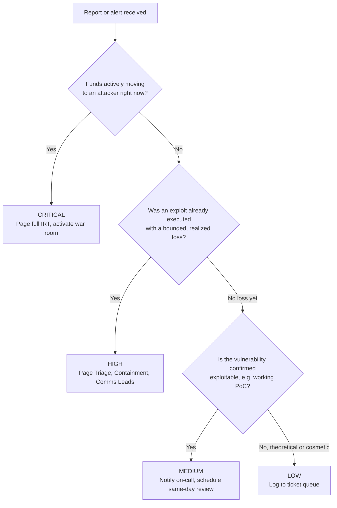

# Part 6: Appendices

[Back to Handbook contents](index.md) | [Series index](../index.md)

Part 1, Section 1.4 told a team already mid-incident to skip straight to the matching **playbook** and "the appendix templates." This is where those templates live. This part collects the reference material a responder reaches for during an incident rather than reads once and sets aside: a glossary consolidating every acronym and role name defined across Parts 1 through 5, the full **severity** and triage matrix that Part 3, Section 6.2 promised but deferred, a vetted list of monitoring, forensics, and communication tooling, and a set of copy-ready message templates for the channels Part 2 defines. Appendix E closes the handbook by pointing to the complete, categorized bibliography rather than duplicating it here.

---

## 19. Appendix A: Glossary

A responder should not have to search five parts to remember what an acronym meant the first time it appeared. This glossary gathers every term and role name used in the handbook into one lookup table, grouped by the kind of work each belongs to, with a pointer back to where it was first introduced.

**Lifecycle and governance**

| Term | Definition |
|------|------------|
| IRP | Incident Response Plan: the living document naming every role, its authority, and the procedure it follows (Part 1, 3.1). |
| IRT | Incident Response Team: the cross-functional group with pre-assigned authority to act during an incident (Part 1, 3.1). |
| NIST | National Institute of Standards and Technology, the U.S. federal body publishing SP 800-61 and its companion guides that this handbook is built on. |
| CSF 2.0 | NIST Cybersecurity Framework version 2.0, the six-function model (Govern, Identify, Protect, Detect, Respond, Recover) that SP 800-61 Rev. 3 nests incident response inside (Part 1, 2.1). |
| SP 800-61 Rev. 3 | NIST Special Publication 800-61 Revision 3, *Incident Response Recommendations and Considerations for Cybersecurity Risk Management: A CSF 2.0 Community Profile* (April 2025), the handbook's primary lifecycle reference. |
| TTX | Tabletop exercise: a discussion-based drill that walks a written scenario end to end without executing live actions (Part 3, 7.6). |
| Postmortem | The blameless, written review conducted after an incident closes, covering root cause, timeline, and remediation items (Part 5, 17). |
| MTTD | Mean time to detect: the average interval between an incident's start and its first confirmed detection, the metric the Ronin case study's six-day gap makes concrete (Part 1, 1.1). |
| MTTR | Mean time to respond or recover: the average interval between detection and confirmed containment or restoration. |

**Roles and identity**

| Term | Definition |
|------|------------|
| First Reporter | Whoever, or whatever, raises the first flag: an on-chain monitor, a whitehat, or a community member (Part 1, 3.2). |
| Triage Lead | The first internal decision-maker who confirms a report and assigns its initial severity (Part 1, 3.3). |
| Comms Lead | Owns every word the organization says publicly and internally about an incident (Part 1, 3.4). |
| Containment Lead | Holds the technical authority to execute pause, revoke, or upgrade actions (Part 1, 3.5). |
| Recorder | Maintains the single authoritative, timestamped incident timeline (Part 1, 3.6). |
| GPG | GNU Privacy Guard, an implementation of the OpenPGP standard ([RFC 4880](https://www.rfc-editor.org/rfc/rfc4880)) used to sign statements so authenticity is checkable even if official channels are compromised (Part 1, 3.7). |
| OIDC | OpenID Connect, an identity layer over OAuth 2.0 used to bind roles such as Triage Lead to durable, revocable single sign-on credentials ([OpenID Connect Core 1.0](https://openid.net/specs/openid-connect-core-1_0.html); Part 1, 3.7). |
| Multisig | A wallet or contract requiring signatures from multiple independent keyholders before executing a transaction; the mechanism binding the Containment Lead role to a signer key such as a Safe{Wallet} owner (Part 1, 3.7). |

**Technical and on-chain**

| Term | Definition |
|------|------------|
| RPC | Remote Procedure Call: the interface a client uses to query or submit transactions to a blockchain node. |
| TVL | Total Value Locked: the aggregate value of assets a protocol holds, used as the denominator for percentage-based alert thresholds (Part 3, 5.3). |
| Timelock | A contract mechanism that delays a queued action by a fixed period, giving responders a window to cancel it before it executes. |
| Pausability / circuit breaker | A contract-level mechanism, commonly built on OpenZeppelin's [`Pausable`](https://docs.openzeppelin.com/contracts/5.x/api/utils#Pausable), letting an authorized role halt state-changing functions during an incident (Part 3, 6.4). |
| Private mempool | A transaction relay, such as [Flashbots Protect](https://docs.flashbots.net/flashbots-protect/overview), that withholds a submitted transaction from the public mempool until it is mined, preventing a rescue transaction from being front-run (Part 3, 6.4). |
| Rescue transaction | A transaction moving at-risk but not-yet-drained funds to safety ahead of an ongoing exploit. |
| WORM | Write-Once-Read-Many storage: an object-storage mode, such as AWS S3 Object Lock in compliance mode, that prevents evidence from being altered or deleted for a set retention period (Part 3, 7.4). |
| IOC | Indicator of Compromise: an observable artifact, an address, a bytecode hash, a phishing domain, associated with an attacker and shareable so other teams can detect the same actor. |
| Chain of custody | The documented, unbroken record of who captured, handled, and stored a piece of evidence, required for that evidence to survive later legal or insurance scrutiny ([NIST SP 800-86](https://csrc.nist.gov/pubs/sp/800/86/final); Part 3, 6.3). |

**Communication, legal, and recovery**

| Term | Definition |
|------|------------|
| DPRK | Democratic People's Republic of Korea, referenced for the state-linked threat actor patterns covered in Part 4, Chapter 12. |
| Safe Harbor | A pre-agreed legal and operational framework authorizing a whitehat to intervene against an active exploit without exposing themselves to liability (Part 4, 15.1). |
| Whitehat | A security researcher who identifies or intervenes against a vulnerability to protect funds or disclose responsibly, as distinct from a malicious attacker. |
| Drainer | Malicious code, typically injected into a phishing site or a compromised front end, engineered to request and execute maximal-value wallet approvals the instant a victim connects and signs. |
| SEAL / SEAL 911 | Security Alliance, a cross-protocol Web3 security coordination body; SEAL 911 is its 24/7 emergency incident-response hotline ([securityalliance.org](https://securityalliance.org); Part 3, 7.3). |
| WA (Web3 Attack Vector) | The WA01 through WA15 classification the [OWASP Web3 Attack Vectors Top 15](https://scs.owasp.org/sctop10/Web3-Attack-Vectors-Top15/) uses to categorize an incident once triaged (Handbook 10). |
| SCSVS / SCSTG / SCWE | The Smart Contract Security Verification Standard, Testing Guide, and Weakness Enumeration: the OWASP SCS Project's pre-incident standards this handbook complements (Part 1, 1.3). |

---

## 20. Appendix B: Severity and Triage Matrix

Part 3, Section 6.2 introduced the four-tier **severity** model every triage call in this handbook runs through and promised the full, standalone version here. Copy this table into your own runbook rather than re-deriving it from memory during a live incident; the Triage Lead role (Part 1, 3.3) exists specifically to apply it under pressure, not to invent it on the spot.

| Severity | Criteria | Scope of impact | Escalation | Target time-to-acknowledge |
|----------|----------|------------------|------------|------------------------------|
| Critical | Active, ongoing fund loss; admin key or signer compromise; exploit live with funds still at risk | Protocol-wide, unbounded until contained | Page the full IRT, activate the war room (Part 4, 14) | Under 5 minutes |
| High | Exploit confirmed and executed, but bounded or already contained; no ongoing drain | Significant, but a realized and fixed amount | Page Triage Lead, Containment Lead, and Comms Lead | Under 15 minutes |
| Medium | Vulnerability confirmed exploitable (for example, a working proof of concept) but not yet exploited, or a minor loss with no user-fund impact | Isolated component, no active user harm | Notify on-call, schedule same-day review | Under 1 hour |
| Low | Cosmetic, informational, or theoretical, with no practical exploit path | None | Route to ticket queue | Next business day |

A four-tier model resolves which channel and which people get paged, but it does not rank two Critical findings against each other, and a live incident often produces more than one candidate at the same tier simultaneously. Part 3, Section 6.2 called this "CVSS-adjacent scoring guidance for cases that need finer granularity"; the table below borrows the base-metric structure of the [FIRST CVSS v4.0 specification](https://www.first.org/cvss/v4-0/) (Common Vulnerability Scoring System) without computing a full CVSS score, adapting it to on-chain incident triage rather than pre-disclosure vulnerability rating.

| Dimension | 0 (none) | 1 (low) | 2 (moderate) | 3 (severe) |
|-----------|----------|---------|---------------|------------|
| Exploitability | Requires a fully-trusted actor to misbehave | Requires a semi-trusted role's key | Requires specific, narrow preconditions | Permissionless, anyone can trigger it right now |
| Scope | Single, isolated function | Single contract | Protocol-wide | Cross-protocol or cross-chain |
| Fund impact | None | Partial, bounded, quantifiable | Majority of at-risk funds | Total loss of at-risk funds |
| Reversibility | Fully reversible, no action taken yet | Recoverable via pause or timelock cancel | Recoverable only via negotiation or exchange freeze | Irreversible once mined |

Sum the four dimension scores (0 to 12) to break ties within a severity tier: two Critical findings both score in the 9 to 12 range by definition of the tier's criteria, and the **Containment** Lead works the higher composite score first when resources cannot address both simultaneously. This is a prioritization aid, not a formal CVSS calculation, and it never overrides the tier assigned by the primary matrix above.



*Figure 1. Triage decision tree. Each branch resolves to one severity tier from the primary matrix; the fine-grained scoring table only breaks ties among findings that land in the same tier.*

A copy-ready worksheet turns this into something the Triage Lead fills out live rather than holds in their head:

```yaml
# triage/worksheet_template.yaml
incident_id: ""
reported_at_utc: ""
reported_by: ""
first_signal_block_number: ""
funds_actively_moving: null        # true/false
loss_confirmed_bounded: null       # true/false
exploit_confirmed_reproducible: null  # true/false
initial_severity: ""               # Critical/High/Medium/Low
fine_grained_scoring:
  exploitability: null             # 0-3
  scope: null                      # 0-3
  fund_impact: null                # 0-3
  reversibility: null              # 0-3
escalated_to: []
war_room_activated: null
```

---

## 21. Appendix C: Suggested Tools and Platforms

None of the entries below are endorsements. They are the categories of capability the readiness checklist in Part 3, Chapter 7 assumes exist somewhere in your stack, with named examples so a team starting from zero has a concrete place to begin evaluating rather than a blank page. Weigh each candidate against your own asset inventory (Part 3, 7.1) and **severity** matrix (Appendix B) rather than adopting a tool because a peer protocol uses it.

**On-chain monitoring and alerting**

| Tool | What it does |
|------|--------------|
| [Forta Network](https://docs.forta.network/) | Decentralized network of detection bots evaluating live mempool and block data against subscribable rules (Part 3, 5.2). |
| [OpenZeppelin Defender](https://docs.openzeppelin.com/defender/) | Contract-scoped monitoring (Monitor) paired with automated response actions (Sentinel). |
| [Tenderly Alerts](https://tenderly.co/alerting) | Contract-scoped monitoring with a no-code condition builder. |

**Infrastructure and application monitoring**

| Tool | What it does |
|------|--------------|
| [Prometheus](https://prometheus.io/) | Open-source time-series metrics collection and alerting, used for RPC node health and infrastructure signal (Part 3, 5.4). |
| [PagerDuty](https://www.pagerduty.com/) | Paging and escalation orchestration matched to the severity-to-channel routing in Appendix B. |
| [Opsgenie](https://www.atlassian.com/software/opsgenie) | Alternative paging and escalation orchestration. |

**Forensics and chain analysis**

| Tool | What it does |
|------|--------------|
| [Foundry](https://book.getfoundry.sh/) (`cast`) | Local transaction, trace, and storage inspection, the basis for the evidence-collection commands in Part 3, 6.3. |
| [Chainalysis](https://www.chainalysis.com/) | Commercial blockchain forensics and attribution platform. |
| [TRM Labs](https://www.trmlabs.com/) | Commercial blockchain forensics and risk-scoring platform. |
| [Arkham Intelligence](https://www.arkhamintelligence.com/) | Public on-chain intelligence and entity-labeling platform. |

**Evidence and secrets storage**

| Tool | What it does |
|------|--------------|
| [AWS S3 Object Lock](https://docs.aws.amazon.com/AmazonS3/latest/userguide/object-lock.html) | WORM-compliant object storage underlying the evidence bucket pattern in Part 3, 7.4. |

**Secure communications**

| Tool | What it does |
|------|--------------|
| [Signal](https://signal.org/) | End-to-end encrypted messaging, the reference "war room" channel in Part 3, 7.3. |
| [Matrix](https://matrix.org/) | Federated, encryption-capable protocol for teams that need self-hosted control over their comms infrastructure. |

**Bug bounty and responsible disclosure**

| Tool | What it does |
|------|--------------|
| [Immunefi](https://immunefi.com/) | Web3-focused bug bounty and vulnerability disclosure platform (Part 3, 5.5). |
| [HackenProof](https://hackenproof.com/) | Bug bounty platform. |
| [Cantina](https://cantina.xyz/) | Competitive audit and bug bounty marketplace. |

**Threat intelligence and community response**

| Tool | What it does |
|------|--------------|
| [Security Alliance (SEAL) / SEAL 911](https://securityalliance.org) | Cross-protocol incident response coordination and 24/7 emergency hotline (Part 1, 2.6.3; Part 3, 7.3). |
| [MITRE ATT&CK](https://attack.mitre.org/) | Adversary tactics and techniques knowledge base for general enterprise threat modeling. |
| [MITRE AADAPT](https://aadapt.mitre.org/) | Adversary tactics and techniques knowledge base built specifically for digital asset and payment ecosystems. |

**Signer and fund-movement authorization**

| Tool | What it does |
|------|--------------|
| [Safe{Wallet}](https://safe.global/) | The most widely used multisig implementation for treasury and Containment Lead signer keys (Part 1, 3.7). |
| [Flashbots Protect](https://docs.flashbots.net/flashbots-protect/overview) | Private mempool relay for rescue transactions, immune to public-mempool front-running (Part 3, 6.4). |

---

## 22. Appendix D: Message and Communication Templates

Part 2, Section 4.3.1 established that every incident communication should start from a pre-approved template rather than an improvised draft written under pressure. The six templates below are that starting point. Fill in the bracketed fields, keep the structure, and route every one of them through the Comms Lead (Part 1, 3.4) before it goes anywhere near a public channel; a template used unreviewed is only marginally better than no template at all.

**Template 1: Internal incident declaration (paging message)**

```
[SEVERITY] Incident declared: <one-line description>
Declared by: <Triage Lead>
Time (UTC): <timestamp> | Block: <block number>
Affected: <contract(s) / system(s)>
War room: <link or channel>
Next update: <time>
```

**Template 2: Public holding statement (first hour)**

```
We are aware of a potential security incident affecting <protocol/component>.
We have <action taken, e.g. "paused the affected contract"> as a precaution.
No further action is required from users at this time. / Users should
<specific action> until further notice.
We will post a further update by <fixed time, UTC>.
```

**Template 3: Scheduled status update (recurring cadence)**

```
Status update <N>, <timestamp UTC>

What we know: <verified facts only, no speculation>
What we have done: <containment/eradication actions completed>
What is next: <planned next step>
Next update by: <fixed time, UTC>
```

**Template 4: Resolution and all-clear statement**

```
As of <timestamp UTC>, the incident affecting <protocol/component> is resolved.
Root cause: <one-sentence summary; full postmortem link below>
Funds affected: <amount/status, e.g. "fully recovered", or "partial loss
of $X, restitution plan below">
Restitution: <link, or "not applicable">
Full postmortem: <link, published within the window committed to in Part 5>
```

**Template 5: GPG-signed authenticity notice**

Use this whenever official channels may themselves be compromised, the exact scenario Part 1, Section 3.7 built the fingerprint-publication requirement for.

```
-----BEGIN PGP SIGNED MESSAGE-----
Hash: SHA512

This statement is authentic and was issued by <organization>.
Verify against fingerprint: <published GPG fingerprint>
Statement: <the exact text of the public statement being authenticated>
-----BEGIN PGP SIGNATURE-----
<signature block>
-----END PGP SIGNATURE-----
```

**Template 6: Exchange or stablecoin issuer freeze request**

```
Subject: Urgent, security incident, freeze request for address <0x...>

<Exchange/Issuer security team>,

We are <organization>, operator of <protocol>. At <timestamp UTC>, block <N>,
an exploit moved approximately <amount, asset> to address <0x...>. Supporting
evidence (transaction hash, trace, public incident statement) is attached
or linked below.

We request an emergency freeze or enhanced monitoring on this address and any
funds that move from it. Point of contact for follow-up: <name, verified
channel, GPG fingerprint>.

Reference: <public incident statement URL>
```



```mermaid
flowchart LR
    D[Detected] --> T1[Template 1\ninternal declaration]
    T1 --> Tr[Triaging]
    Tr --> T2[Template 2\npublic holding statement]
    T2 --> C[Contained]
    C --> T3[Template 3\nscheduled status update]
    T3 --> Er[Eradicating]
    Er --> T3
    Er --> R[Recovering]
    R --> T4[Template 4\nresolution/all-clear]
    T4 --> Cl[Closed]
    Cl --> PM[PostMortem, Part 5]
```

*Figure 2. Which template fires at which incident phase, mapped against the state diagram in Part 3, Figure 3. Template 5 (GPG authenticity) and Template 6 (freeze request) are not phase-bound: use Template 5 whenever a statement's authenticity might be questioned, and Template 6 the moment an attacker address is known, regardless of phase.*

---

## 23. Appendix E: References and Further Reading

This handbook's complete, deduplicated source list lives in `references.md`, grouped into Standards and Frameworks, Incidents and Case Studies, Tools, and Further Reading, following the series convention (the series conventions). It is not reproduced here, so that the two documents never drift out of sync; treat `references.md` as the current bibliography and this section as a pointer to the five publications the handbook leans on most.

### 23.1 Standards

The lifecycle model in Part 1, the supplemental practices in Part 1, Section 2.6, and the evidence-handling discipline in Part 3 all trace back to a small set of NIST publications. Everything else this handbook cites, RFCs, incident post-mortems, and tool documentation, supports a specific claim in a specific chapter and is listed in full in `references.md` rather than here.

#### 23.1.1 NIST SP 800-61r3, CSF 2.0, SP 800-92, SP 800-184, SP 800-150

Five NIST documents anchor this handbook's structure. [SP 800-61 Revision 3](https://csrc.nist.gov/pubs/sp/800/61/r3/final) (April 2025) supplies the core lifecycle, nesting **incident response** inside the [Cybersecurity Framework 2.0](https://www.nist.gov/cyberframework)'s six functions (Part 1, 2.1). [SP 800-92 Revision 1](https://csrc.nist.gov/pubs/sp/800/92/r1/ipd), an initial public draft dated October 2023, governs the log management lifecycle behind Part 1, Section 2.6.1 and Part 3, Section 7.2. [SP 800-184](https://csrc.nist.gov/pubs/sp/800/184/final) (December 2016) grounds the recovery-rehearsal argument in Part 1, Section 2.6.2 and the drill schedule in Part 3, Section 7.6. [SP 800-150](https://csrc.nist.gov/pubs/sp/800/150/final) (October 2016) frames the threat-information-sharing relationships, SEAL 911 among them, referenced in Part 1, Section 2.6.3. A sixth publication outside this named set, [SP 800-86](https://csrc.nist.gov/pubs/sp/800/86/final), *Guide to Integrating Forensic Techniques into Incident Response*, underlies the evidence-collection ordering in Part 3, Section 6.3 and is listed alongside these five in `references.md`.

---

**Key controls for Part 6**

- Keep the glossary, **severity** matrix, and tool list from this part inside your own runbook, not just this handbook, so nobody is searching for definitions mid-incident.
- Have the Triage Lead fill out the Appendix B worksheet live during triage; the fine-grained scoring table breaks ties, it never overrides the primary four-tier matrix.
- Select and pre-provision the Appendix C tool categories before an incident; evaluating a monitoring or forensics platform for the first time during a live drain is a preparation failure, not a response one.
- Route every Appendix D template through the Comms Lead and, where authenticity may be questioned, through the GPG signature workflow from Part 1, Section 3.7, before it reaches a public or partner channel.
- Treat `references.md` as the single current bibliography for this handbook; update it rather than letting citations diverge across parts.

---

[Back to Handbook contents](index.md)
