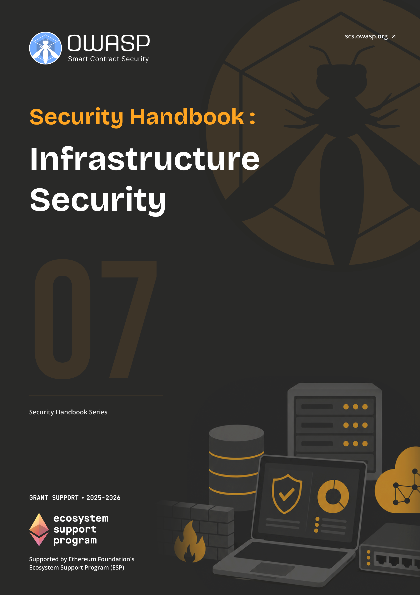

# OWASP SCS Infrastructure Security Handbook

  
  

    <a class="handbook-series-link" href="../">← All handbooks</a>
    
Handbook 07 · 125 PDF pages

    
Secure nodes, compute, networks, availability, identities, keys, and the operational foundations of resilient Web3 systems.

    

      <a href="../pdfs/07-infrastructure-security.pdf" target="_blank" rel="noopener">Open PDF</a>
      <a href="../pdfs/07-infrastructure-security.pdf" download>Download PDF</a>
    

  

**OWASP Smart Contract Security Project**

Part of the [OWASP SCS Handbook Series](../index.md). Built to the series [conventions](../index.md#about-the-series).

## Purpose and Scope

This handbook secures the infrastructure layer underneath a Web3 project: the servers, cloud accounts, nodes, and network paths that keep contracts reachable and front ends online. It covers asset inventory, cloud and node infrastructure (including **remote procedure call** (**RPC**) and archive nodes), distributed denial-of-service (DDoS) protection, DNS and domain security, network hardening, operating system baselines, and zero-trust design, aligned with current operational practice rather than a theoretical ideal.

The guidance draws on NIST's **Zero Trust** Architecture (SP 800-207 and SP 1800-35), cloud security posture checklists built around least-privilege identity and access management (IAM), policy-as-code enforcement, Zero Trust Network Access (ZTNA) and Secure Access Service Edge (SASE) concepts, and continuous monitoring practice. Each chapter translates these frameworks into checklists a node operator, DevOps engineer, or site reliability engineer (SRE) can act on directly, rather than leaving them as abstract compliance language.

## Target Audience

Engineers and developers building on Web3 infrastructure, security specialists reviewing that infrastructure, and DevOps, cloud, and SRE practitioners who operate it day to day. Anyone accountable for keeping an **RPC** node, a validator, or a project's cloud footprint online and defensible will find direct guidance here.

## How to Use This Handbook

Start with Part I to establish why infrastructure sits underneath every other Web3 security control and to build an asset inventory before anything else. Parts II through V are reference material organized by domain: node and compute infrastructure, network and availability, DNS and domain security, and identity and access management. Part VI consolidates the checklists into operational form for pre-deployment, ongoing operations, and incident readiness. Part VII holds the glossary, printable checklists, tool references, and bibliography. An SRE hardening a fresh **RPC** deployment can jump straight to Part II and the checklists in Part VI; a team preparing for a domain-security review should start with Part IV.

## Relationship to SCSVS, SCSTG, and SCWE

The Smart Contract Security Verification Standard (SCSVS) defines the properties a secure system must satisfy at the application and infrastructure boundary; the controls in this handbook, cloud IAM, node hardening, and DNS integrity among them, are the operational implementation of those infrastructure-facing requirements. The Smart Contract Security Testing Guide (SCSTG) describes how to test a system's security; the checklists in Parts II, III, and VI extend that testing discipline to cloud posture, network configuration, and DNS records rather than contract code. The Smart Contract Weakness Enumeration (SCWE) catalogs weaknesses in contract logic, and the failure modes covered here (exposed **RPC** endpoints, missing DNSSEC, stale IAM grants) sit one layer below the contract and fall largely outside SCWE's scope. This handbook overlaps most closely with the DNS and Hosting Security Handbook (02), which goes deeper on domain and hosting-provider risk, and feeds directly into the **Incident Response** Handbook (06), which owns the response process once an infrastructure control fails.

## Contents

**Part I: Foundations**
- [1. Introduction to Infrastructure Security in Web3](part1-foundations.md#1-introduction-to-infrastructure-security-in-web3)
- [2. Asset Inventory](part1-foundations.md#2-asset-inventory)

**Part II: Node and Compute Infrastructure**
- [3. Node Infrastructure Security](part2-node-and-compute-infrastructure.md#3-node-infrastructure-security)
- [4. Cloud Infrastructure](part2-node-and-compute-infrastructure.md#4-cloud-infrastructure)
- [5. Operating System Security](part2-node-and-compute-infrastructure.md#5-operating-system-security)

**Part III: Network and Availability**
- [6. Network Security](part3-network-and-availability.md#6-network-security)
- [7. DDoS Protection](part3-network-and-availability.md#7-ddos-protection)
- [8. Zero-Trust Principles](part3-network-and-availability.md#8-zero-trust-principles)

**Part IV: DNS and Domain Security**
- [9. DNS and Domain Registration](part4-dns-and-domain-security.md#9-dns-and-domain-registration)
- [10. DNS Security (DNSSEC, CAA, etc.)](part4-dns-and-domain-security.md#10-dns-security-dnssec-caa-etc)
- [11. Email and Communication Security (SPF, DKIM, DMARC)](part4-dns-and-domain-security.md#11-email-and-communication-security-spf-dkim-dmarc)
- [12. DNS and Hosting Attack Playbooks (Overview)](part4-dns-and-domain-security.md#12-dns-and-hosting-attack-playbooks-overview)

**Part V: Identity and Access Management**
- [13. Identity and Access Management for Infrastructure](part5-identity-and-access-management.md#13-identity-and-access-management-for-infrastructure)
- [14. Integration with IAM Framework](part5-identity-and-access-management.md#14-integration-with-iam-framework)

**Part VI: Checklists and Operations**
- [15. Node Infrastructure Security Checklist (Consolidated)](part6-checklists-and-operations.md#15-node-infrastructure-security-checklist-consolidated)
- [16. Infrastructure as Code (IaC) Security](part6-checklists-and-operations.md#16-infrastructure-as-code-iac-security)
- [17. Monitoring and Logging](part6-checklists-and-operations.md#17-monitoring-and-logging)

**Part VII: Appendices**
- [18. Appendix A: Glossary](part7-appendices.md#18-appendix-a-glossary)
- [19. Appendix B: Node Infrastructure Security Checklist (Printable)](part7-appendices.md#19-appendix-b-node-infrastructure-security-checklist-printable)
- [20. Appendix C: DNS and Domain Security Checklist](part7-appendices.md#20-appendix-c-dns-and-domain-security-checklist)
- [21. Appendix D: Tool and Provider References](part7-appendices.md#21-appendix-d-tool-and-provider-references)
- [22. Appendix E: References and Further Reading](references.md)
