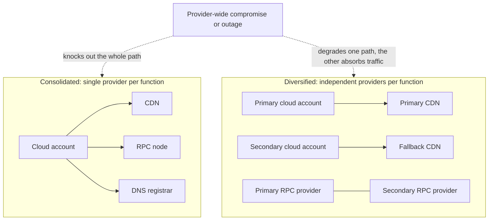
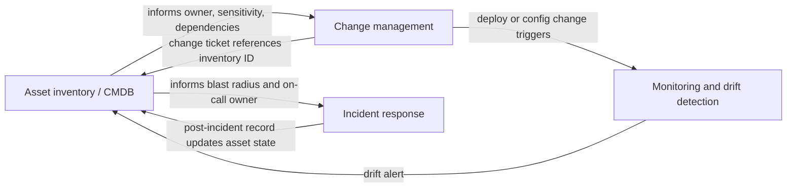

# Part 1: Foundations

[Back to Handbook contents](index.md) | [Series index](../index.md)

This part argues a single point: the smart contract is rarely where a Web3 project's infrastructure actually fails. It fixes the vocabulary for the rest of the handbook, works through the recurring single-provider-versus-multi-provider decision, and builds the asset inventory that every later control, node hardening, **network segmentation**, DNS integrity, identity and access management, depends on to know what it is protecting.

---

## 1. Introduction to Infrastructure Security in Web3

This chapter explains why infrastructure sits underneath every other Web3 security control and orients you to the rest of the handbook.

### 1.1 Why Infrastructure Is Critical (Centralized Front-Ends and Services)

A smart contract can be immutable, formally verified, and audited by three independent firms, and a project can still lose everything through the layer surrounding it. That layer, the cloud account, the domain name system (DNS) records, the content delivery network (CDN), the **remote procedure call** (**RPC**) endpoints wallets talk to, is almost always centralized, mutable, and administered by a small number of people with normal, phishable credentials. It re-creates the entire Web2 attack surface underneath a system marketed as trustless.

The incident record backs this up. In December 2021, an attacker compromised a Cloudflare application programming interface (API) key belonging to BadgerDAO and used it to inject a malicious script into the project's front end for roughly ten hours, ultimately draining about $120 million from users who had granted the resulting spend approvals ([Halborn, BadgerDAO hack explained](https://www.halborn.com/blog/post/explained-the-badgerdao-hack-december-2021); [CoinDesk](https://www.coindesk.com/business/2021/12/10/badgerdao-reveals-details-of-how-it-was-hacked-for-120m)). In August 2022, Curve Finance's `curve.fi` domain was DNS-hijacked; attackers pointed the nameservers at a cloned site and collected roughly $570,000 in malicious approvals before the team could redirect users to the unaffected `curve.exchange` domain, which ran on a separate DNS provider ([The Block](https://www.theblock.co/post/354067/curve-finances-front-end-targeted-in-dns-attack-on-website); [Decrypt](https://decrypt.co/319414/curve-finance-dns-record-attack)). In July 2024, Compound Finance and Celer Network were both hit by DNS hijacks targeting domains registered through Squarespace, part of a wave that put over 220 DeFi front ends at risk of the same technique ([CoinDesk](https://www.coindesk.com/tech/2024/07/11/compound-finance-site-compromised-in-phishing-attack); [BleepingComputer](https://www.bleepingcomputer.com/news/security/dns-hijacks-target-crypto-platforms-registered-with-squarespace/)). None of these incidents touched a line of Solidity.

Availability failures tell the same story from the other direction. When Infura, the RPC provider behind most MetaMask installs, suffered an outage on November 11, 2020 caused by outdated client software and an unreviewed code change, MetaMask, Uniswap, and Compound degraded simultaneously, and Binance and Coinbase halted Ethereum withdrawals until service was restored ([Decrypt](https://decrypt.co/98457/metamask-ethereum-apps-down-infura-outage); [CoinMarketCap Academy](https://coinmarketcap.com/academy/article/ethereums-infura-iating-outage-revives-decentralization-concerns)). Five years later, on October 20, 2025, a domain name system and database fault inside a single Amazon Web Services (AWS) region, `us-east-1`, took Coinbase's trading platform and its Base layer-2 network offline alongside Robinhood, and disrupted Infura's Ethereum, Polygon, Optimism, Arbitrum, Linea, Base, and Scroll endpoints at once ([CCN](https://www.ccn.com/education/crypto/aws-outage-coinbase-robinhood-venmo-list-of-affected-platforms/); [CoinDesk](https://www.coindesk.com/tech/2025/10/22/the-protocol-aws-outage-halts-some-crypto-apps)). A French regulator's tracking of Ethereum node hosting found the share running on AWS alone climbing from roughly 43% in mid-2022 to over 49% by late 2023, meaning a single cloud region's health has become a proxy for the health of the base chain most Web3 infrastructure sits on ([CryptoSlate](https://cryptoslate.com/french-regulator-calls-out-defi-centralization-as-cloud-providers-fall-just-1-since-july-2022/)). Infrastructure is not a secondary concern behind contract security. For the users who lost funds in every incident above, it was the only layer that mattered.

### 1.2 Design Choices: Single Provider vs. Multi-Provider

Nearly every infrastructure decision in this handbook eventually reduces to one question: concentrate on a single vendor for a given function (one cloud account, one CDN, one **RPC** provider, one DNS registrar) or spread that function across two or more. Neither answer is universally correct. The decision trades **attack surface** against blast radius, and it should be made deliberately, per function, with the tradeoff written down rather than defaulted into by whichever provider a founding engineer happened to sign up with first.

| Dimension | Single provider (consolidated) | Multi-provider (diversified) |
|---|---|---|
| Attack surface | Smaller: one account, one set of credentials, one configuration surface to secure and monitor | Larger: N accounts, N credential sets, N configurations that can drift out of sync |
| Blast radius of a compromise | Full: one stolen API key or session can take down or redirect the entire service, as in the BadgerDAO incident | Partial: a compromised provider affects only the traffic routed to it, if failover is configured and tested |
| Blast radius of an outage | Full: a provider-wide incident takes the whole service down with it | Partial: healthy providers absorb the shifted load |
| Operational load | Lower: one dashboard, one on-call runbook, one billing and support relationship | Higher: more credentials to rotate, more configurations to keep consistent, more places integrity pins must be updated |
| Cost | Lower steady-state cost, higher tail-risk cost when the single provider fails | Higher steady-state cost (duplicated infrastructure, cross-provider data transfer) |
| Best fit | Early-stage teams, internal tooling, non-critical services | Front ends and RPC paths that sit directly between users and funds |

Use the sensitivity tiering built in Chapter 2 to decide where diversification earns its cost: a critical-tier asset (Section 2.2) that is the sole path to signing a transaction justifies a second provider; an internal staging dashboard usually does not.

#### 1.2.1 Consolidation (Lower Surface) vs. Diversification (Resilience)

The Fastly outage of June 8, 2021 is the clearest illustration of concentrated-provider risk in the industry's recent memory. A latent software defect, triggered by one customer's valid configuration change, crashed edge nodes across Fastly's global network and dropped roughly 85% of that CDN's traffic within minutes, taking Amazon, Reddit, Twitch, PayPal, and the UK government's website offline for about an hour ([Fastly post-incident summary](https://www.fastly.com/blog/summary-of-june-8-outage); [ThousandEyes analysis](https://www.thousandeyes.com/blog/inside-the-fastly-outage-and-lessons-learned)). None of the affected sites had a code defect of their own. They had a dependency on a single provider whose defect became their defect. The AWS `us-east-1` outage of October 20, 2025 repeated the pattern a region at a time rather than a CDN edge at a time, and it repeated again nine days later on October 29 ([CoinDesk](https://www.coindesk.com/tech/2025/10/22/the-protocol-aws-outage-halts-some-crypto-apps)).

Consolidation is the right default when the asset in question is not on the critical path to user funds: it lowers the number of things that must be independently monitored, patched, and defended, and every credential you do not issue is a credential that cannot be phished or leaked. Diversification earns its added complexity when the asset is on that critical path, when the org's risk tolerance for a multi-hour outage is low, or when a single incident (compromise or outage) would be existential rather than merely embarrassing. The failure mode to avoid is diversification in name only: two CDN accounts that share the same DNS provider, or two cloud regions with the same root IAM credentials, diversify nothing, because the shared dependency is still a single point of failure. Test failover before you need it. A secondary provider that has never actually served production traffic is a hypothesis, not a control.



*Figure 1. The same failure event against a consolidated architecture (left) versus a diversified one (right). Diversification only reduces blast radius if the redundant providers do not share an underlying dependency.*

### 1.3 Relationship to SCSVS, SCSTG, and SCWE

The OWASP Smart Contract Security (SCS) Project's three companion resources, the [Smart Contract Security Verification Standard (SCSVS)](https://scs.owasp.org/SCSVS/), the [Smart Contract Security Testing Guide (SCSTG)](https://scs.owasp.org/), and the [Smart Contract Weakness Enumeration (SCWE)](https://scs.owasp.org/), define, test, and catalog security properties of contract code and its immediate on-chain environment. This handbook covers the layer those resources assume is already trustworthy: the cloud accounts, nodes, networks, and DNS records that keep the contract reachable in the first place. The relationship is complementary rather than overlapping. SCSVS asks whether a system's verifiable security requirements are met; the IAM, node-hardening, and DNS-integrity controls in this handbook are the infrastructure-facing requirements that sit alongside SCSVS's contract-facing ones, so that "the system is secure" does not quietly narrow to "the bytecode is secure" while the DNS registrar account has no multi-factor authentication (MFA). SCSTG describes testing methodology; the checklists in Parts II, III, and VI of this handbook extend that discipline to cloud configuration posture, **network segmentation**, and DNS record hygiene, none of which SCSTG's contract-focused test cases reach. SCWE enumerates weaknesses in contract logic; the failure modes this handbook addresses (an exposed **RPC** admin port, a missing DNS Certification Authority Authorization (CAA) record, a stale cloud IAM grant) sit one layer below SCWE's scope and are not catalogued there. This handbook overlaps most closely with the DNS and Hosting Security Handbook (02), which goes deeper on domain- and hosting-provider-specific risk, and it feeds directly into the Incident Response Handbook (06), which owns the response process once one of these infrastructure controls fails.

### 1.4 How to Use This Handbook

Read this part once, in order, to fix the four ideas that recur throughout the rest of the handbook: infrastructure is an **attack surface** equal in weight to the contract, the single-versus-multi-provider decision is made per function against a documented risk tolerance, and nothing downstream can be secured, monitored, or recovered without the asset inventory built in Chapter 2. After that, treat the handbook as reference material organized by domain rather than as a narrative to read cover to cover. Part II covers node and compute infrastructure, including **RPC** and archive node hardening and cloud account structure. Part III covers network security, distributed denial-of-service (DDoS) protection, and zero-trust design. Part IV is DNS and domain security in depth. Part V covers identity and access management for infrastructure specifically, cross-referencing the organization's broader IAM program. Part VI consolidates every checklist in the handbook into operational form for pre-deployment gates, ongoing operations, and incident readiness, and Part VII holds the glossary, printable checklists, and full bibliography. An engineer hardening a fresh RPC deployment should jump straight to Part II and the checklist in Part VI; a team preparing a DNS registrar lockdown should start at Part IV. Wherever a topic touches a sibling handbook, DNS specifics (02), the response process (06), SDK-side node interaction (08), this part and the ones that follow link to it directly rather than duplicating its content.

---

## 2. Asset Inventory

Every control in the rest of this handbook, hardening a node, segmenting a network, rotating a secret, presupposes that you know the asset exists. This chapter builds that precondition.

### 2.1 Identifying All Infrastructure Components

You cannot defend what you have not enumerated, and you cannot enumerate what you have never systematically looked for. The Center for Internet Security's Critical Security Controls open with exactly this principle: Control 1, Inventory and Control of Enterprise Assets, requires an organization to actively track every enterprise asset, physical, virtual, cloud-hosted, or remote, precisely because unmanaged and unauthorized assets are where monitoring, patching, and **incident response** first break down ([CIS Control 1](https://www.cisecurity.org/controls/inventory-and-control-of-enterprise-assets)). The National Institute of Standards and Technology (NIST) Cybersecurity Framework 2.0 codifies the same requirement as the Asset Management (ID.AM) function, with subcategories for hardware inventories (ID.AM-01), software and services (ID.AM-02), network communication flows (ID.AM-03), and supplier-provided services (ID.AM-04) ([NIST CSF 2.0, ID.AM](https://csf.tools/reference/nist-cybersecurity-framework/v2-0/id/id-am/)).

For a Web3 project, that enumeration spans categories a generic checklist will not surface on its own, because "infrastructure" here includes the blockchain-facing layer alongside the conventional one.

| Category | Examples | Typical owner |
|---|---|---|
| Compute | Virtual machines, containers, serverless functions, bare-metal validator hosts | Platform / DevOps |
| Network | Virtual private clouds (VPCs), subnets, load balancers, firewalls, VPN gateways | Network / site reliability engineering (SRE) |
| Blockchain node infrastructure | RPC endpoints, archive nodes, validator and staking nodes, light clients | Protocol / infrastructure engineering |
| Storage | Object storage buckets, databases, backup snapshots, block explorer indexes | Platform / DevOps |
| DNS and domains | Registrar accounts, zone files, subdomains, TXT and CAA records | Security / IT |
| CDN and edge | CDN accounts, edge configuration, web application firewall (WAF) rules | Front-end / Platform |
| Secrets and keys | Key management service (KMS) keys, hardware-backed signing keys, API tokens | Security |
| Continuous integration / continuous deployment (CI/CD) | Source repositories, pipelines, self-hosted runners, package registries | Engineering / DevOps |
| Identity | Single sign-on (SSO) provider, service accounts, break-glass accounts | Security / IT |
| Monitoring | Log aggregators, alerting channels, dashboards, on-chain monitors | SRE / Security |
| Third-party software as a service | Analytics, support tooling, status pages, transactional email | IT / Operations |

Build the first version of this list from every angle at once, cloud provider billing exports, DNS zone transfers, CI/CD runner registrations, employee offboarding records, rather than from a single source, because no single source is complete. A validator node spun up manually for a testnet migration and never torn down will not appear in a Terraform state file; a legacy subdomain pointed at a decommissioned service will not appear in a cloud billing export. Treat the first pass as a floor, not a finished inventory.

### 2.2 Ownership, Purpose, and Sensitivity

An inventory entry that lists an asset but not who is accountable for it is only slightly more useful than no entry at all. Every asset needs three fields beyond its identifier: an owner (a named individual or team, not a distribution list that has gone stale), a documented purpose (why the asset exists and what depends on it), and a sensitivity classification that determines the baseline controls it must carry. NIST CSF 2.0's ID.AM-05 makes this explicit: assets are prioritized based on classification, criticality, and their impact on the mission, not treated uniformly ([NIST CSF 2.0, ID.AM](https://csf.tools/reference/nist-cybersecurity-framework/v2-0/id/id-am/)).

| Tier | Definition | Example assets | Baseline controls |
|---|---|---|---|
| Critical | Compromise or loss directly enables theft of user or protocol funds | Signing keys, deployer wallets, front-end origin, RPC nodes that broadcast transactions | Hardware-backed MFA, break-glass process, dedicated on-call, quarterly access review |
| Sensitive | Compromise enables escalation toward a critical asset or exposes user data | Cloud root and IAM accounts, CI/CD secrets, DNS registrar account, the inventory system itself | MFA, least privilege, logged access, mandatory change review |
| Internal | Needed for operations, limited direct exploit value on its own | Internal dashboards, staging environments, ticketing systems | Standard access control, routine patch cadence |
| Public | Intended for public consumption | Documentation sites, marketing pages, public status pages | Baseline integrity monitoring |

Unowned assets are where this classification most often collapses in practice. A subdomain created for a marketing campaign and left pointing at a decommissioned cloud resource is a dangling DNS record: an attacker can claim the abandoned resource and serve content under your domain, a subdomain takeover technique covered in depth in the DNS and Hosting Security Handbook (02). The reason it happens is rarely malice; it is an asset whose owner left the company, whose purpose was never written down, and whose sensitivity was never assessed, so no one noticed it still existed. Every inventory review should explicitly hunt for entries with a blank owner field, because a blank owner field is itself a finding.

### 2.3 Keeping Inventory Current (IaC, CMDB, Spreadsheets)

An inventory that is accurate on the day it is built and stale six months later provides false confidence, which is worse than no inventory at all, because it tells an incident responder to trust data that no longer reflects reality. Three approaches dominate in practice, and they are not mutually exclusive.

A spreadsheet is the honest starting point for a small team: it costs nothing, requires no tooling investment, and is immediately understandable. It also degrades the fastest, because nothing enforces that a change to infrastructure produces a corresponding edit to the spreadsheet. A configuration management database (CMDB), the Information Technology Infrastructure Library (ITIL) term for a system of record that stores assets as configuration items along with their relationships, formalizes what a spreadsheet leaves informal: dependency graphs between assets, structured change history, and integration points for other tooling ([Red Hat, what is a CMDB](https://www.redhat.com/en/topics/automation/what-is-a-configuration-management-database-cmdb)). A CMDB is worth the operational overhead once the asset count or the team size makes a spreadsheet unreliable, typically well before either feels large by headcount alone.

**Infrastructure as code** (IaC) offers a third path that many Web3 infrastructure teams underuse: if every cloud resource is provisioned through Terraform, Pulumi, or an equivalent tool, the IaC state file and its enforced tagging convention become a living inventory that cannot drift from reality without also failing a `plan` or `apply`.

```hcl
# Mandatory tags, enforced by policy-as-code in CI (see Part II, Section 4.7.2),
# so every resource created through Terraform self-registers into the inventory.
resource "aws_instance" "rpc_node_archive_01" {
  # ... instance configuration ...
  tags = {
    Owner       = "infra-team"
    Purpose     = "ethereum-archive-rpc"
    Sensitivity = "critical"
    Environment = "production"
    ManagedBy   = "terraform"
    InventoryId = "AST-0142"
  }
}
```

Resources created outside this workflow, through a console click during an incident, for instance, are exactly the assets a manual inventory misses, so pair IaC with active and passive discovery: CIS Control safeguards 1.3 and 1.5 call for an active discovery tool that scans for connected assets and a passive tool that identifies assets from observed network traffic, catching what no provisioning workflow declared ([CIS Control 1](https://www.cisecurity.org/controls/inventory-and-control-of-enterprise-assets)). Open-source options fit both roles well: [Cartography](https://github.com/lyft/cartography), originally built at Lyft, pulls assets and their relationships from AWS, Google Cloud Platform (GCP), Azure, Kubernetes, GitHub, and dozens of other platforms into a queryable graph database, and [Steampipe](https://github.com/turbot/steampipe-plugin-aws) exposes live cloud provider APIs as SQL tables so you can query current state directly rather than trust a snapshot. Cloud-native equivalents, AWS Config's resource aggregator, GCP's Cloud Asset Inventory, and Azure Resource Graph, provide the same continuous, provider-verified view without third-party tooling. Whichever combination you choose, run a reconciliation on a fixed schedule: diff the declared inventory against what active discovery actually finds, and treat every undeclared asset as an incident candidate until its owner and purpose are established.

### 2.4 Integration with Incident Response and Change Management

An inventory that exists only as a reference document, consulted occasionally and updated rarely, fails at the exact moment it matters most. Its value is proportional to how tightly it is wired into the two processes that need it in real time.

During an incident, the first questions a responder asks are which asset is affected, who owns it, what depends on it, and what its sensitivity tier implies about urgency. If those answers require paging three people and searching a wiki, the inventory has already failed its purpose; the [Incident Response Handbook (06)](../06-incident-response/index.md) assumes the inventory built here can answer them in seconds, not minutes, because minutes are the difference between containing a BadgerDAO-style front-end compromise and watching it run for ten hours. During change management, every modification to an asset, a new IAM policy, a DNS record update, a cloud region added, should reference the asset's inventory identifier in the change ticket, so that the inventory updates as a side effect of the normal deployment workflow rather than through a separate, easily skipped step. Configuration drift, where the live state of an asset no longer matches what change management or IaC believes it to be, is itself a signal worth alerting on: it means either an unauthorized change occurred or the inventory's record of authorized changes is incomplete, and either case warrants investigation.



*Figure 2. The asset inventory sits at the center of a closed loop with change management and incident response. A change that bypasses this loop, or an incident that cannot query it, is the failure mode Section 2.3's reconciliation step exists to catch.*

---

**Key controls for Part 1**

- Treat infrastructure (cloud accounts, DNS, CDN, **RPC** endpoints) as an **attack surface** equal in weight to the smart contract; the BadgerDAO, Curve, Compound, and Infura incidents all bypassed audited contract code entirely.
- Make the single-provider-versus-multi-provider decision per function, explicitly, against the sensitivity tier of what that function protects, not as an unexamined default.
- Test failover paths before an outage forces you to; an untested secondary provider is a hypothesis, not a resilience control.
- Build the asset inventory from multiple sources (cloud billing, DNS zones, CI/CD registrations, IaC state) and flag every asset with a blank owner field as a finding.
- Wire the inventory into change management (every change references an asset ID) and **incident response** (every responder can query owner, sensitivity, and dependencies in seconds), and reconcile declared state against active discovery on a fixed schedule.

