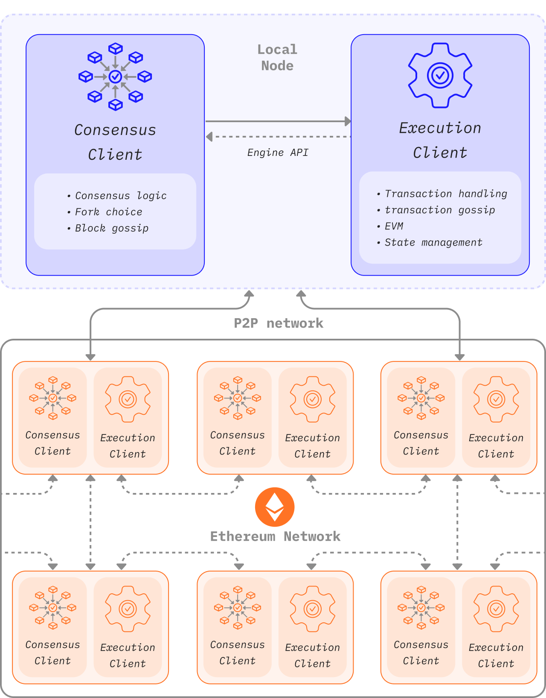
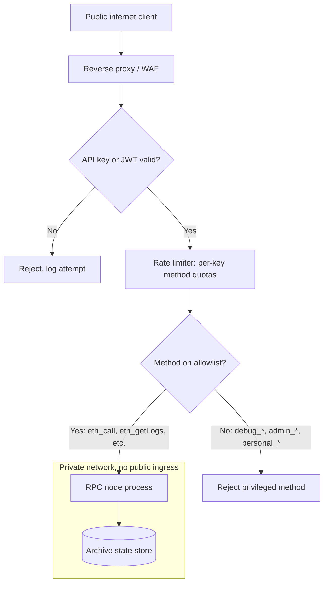
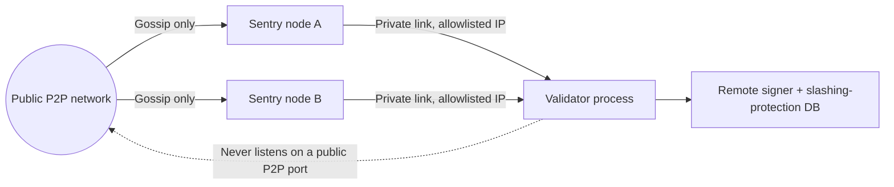
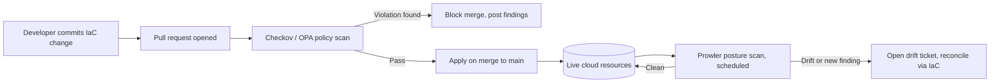

# Part 2: Node and Compute Infrastructure

[Back to Handbook contents](index.md) | [Series index](../index.md)

Part 1 mapped what infrastructure a Web3 project owns. This Part hardens the pieces that actually run: the nodes that read and write chain state, the cloud accounts hosting everything else, and the operating systems underneath both. Each chapter follows the same pattern, access first, then patching and configuration, then the monitoring that catches what slips through.

---

## 3. Node Infrastructure Security

A node is the one component in this handbook that talks directly to the chain, and a compromised node can serve forged data, leak the operator's funds, or vanish and take an entire dApp's read path with it. This chapter covers the node itself, **RPC** and archive endpoints and validator infrastructure, plus the boundary keeping development traffic away from production chain state.

### 3.1 RPC and Archive Nodes

A full node keeps recent chain state and validates new blocks. An archive node additionally retains every historical state root, which lets it answer queries like "what was this address's balance at block 12,000,000" that a pruned full node cannot. That extra retention is expensive: as of 2025, an Erigon archive node needs on the order of 1.8 to 4 TB (terabyte) depending on configuration, while a Geth (go-ethereum) archive node using the newer path-based state scheme needs roughly 1.9 TB, down from the 12 TB or more that hash-based storage required ([7BlockLabs storage comparison](https://www.7blocklabs.com/blog/ethereum-archive-node-disk-size-2026-vs-erigon-archive-node-disk-size-2026-vs-geth-full-node-disk-size-2026)). Both node types expose a JSON-RPC interface, and that interface is the **attack surface** this section is about: it is how wallets submit transactions, how indexers pull events, and, unprotected, how an attacker enumerates internal state or exhausts the node's resources.


*Figure. A post-Merge Ethereum node is a two-client system: the execution and consensus clients have distinct peer networks and communicate through an authenticated local API. This separation creates multiple patch, credential, network, and telemetry boundaries that operators must secure. Source: [ethereum.org, Node architecture](https://ethereum.org/developers/docs/nodes-and-clients/node-architecture/), licensed under [CC BY 4.0](https://creativecommons.org/licenses/by/4.0/).*



*Figure 1. Layered exposure for an RPC/archive node. Nothing reaches the node process directly; every request passes through authentication, rate limiting, and a method allowlist first.*

#### 3.1.1 Access Control and Network Exposure

Never bind a node's HTTP or WebSocket **RPC** interface to `0.0.0.0` and expose it to the public internet without authentication. Geth's own security guidance is direct: administrative and debugging namespaces are not built to withstand hostile traffic, and exposing them routinely leads to drained accounts ([Geth security docs](https://geth.ethereum.org/docs/fundamentals/security)). Restrict exposure in layers: bind RPC listeners to a private interface behind a reverse proxy or dedicated gateway, gate access with an API key or signed JSON Web Token (JWT) rather than a bare open port, and allowlist methods explicitly. A public gateway should permit `eth_call`, `eth_getBlockByNumber`, and `eth_getLogs`, and block the `debug_*`, `admin_*`, `personal_*`, and `miner_*` namespaces outright. Providers such as Chainstack and QuickNode implement exactly this pattern as request-level access rules with per-key rate limits, worth replicating on self-hosted infrastructure ([Chainstack RPC access rules](https://chainstack.com/rpc-security-access-rules/), [QuickNode endpoint security](https://www.quicknode.com/docs/ethereum/endpoint-security)).

```bash
# Geth: bind RPC to loopback only, let the reverse proxy handle public traffic
geth --http --http.addr 127.0.0.1 --http.port 8545 \
     --http.api eth,net,web3 \
     --http.vhosts "rpc.internal.example" \
     --authrpc.jwtsecret /etc/geth/jwt.hex

# nginx in front of it: reject any request missing a valid API key first
#   if ($http_x_api_key = "") { return 403; }
#   limit_req zone=rpc_per_key burst=20 nodelay;
```

| Exposure tier | Who reaches it | Methods allowed |
|---|---|---|
| Public gateway | Any internet client with an API key | Read-only: `eth_call`, `eth_getLogs`, `eth_getBlockByNumber` |
| Internal service mesh | First-party backend services only | Read plus `eth_sendRawTransaction` |
| Loopback / private VLAN | The node operator's own tooling | `debug_*`, `admin_*`, `txpool_*`, Engine API |

#### 3.1.2 Patching and Hardening

Node clients are complex, actively developed software with the same vulnerability lifecycle as any network daemon. CVE-2023-42319 is representative: Geth through version 1.13.4, run with `--http --graphql`, let a remote attacker hang the daemon and exhaust memory via a crafted GraphQL query ([CVE-2023-42319 advisory](https://github.com/advisories/GHSA-v9jh-j8px-98vq)). The fix was a version bump, but only for operators tracking releases. Subscribe to the client's security advisory feed and treat a security release as a same-day or next-day patch, not a routine maintenance item. Since the Merge, execution and consensus clients authenticate to each other over the Engine API using a shared JWT secret rather than an open localhost port; rotate that secret if it is ever exposed in a log or container image layer. Beyond version currency, harden configuration: disable GraphQL and WebSocket unless a consumer needs them, cap `--maxpeers` to bound resource use, and run the client under a dedicated, unprivileged system account, never root.

| Severity (client advisory) | Target patch window | Example |
|---|---|---|
| Critical (remote code execution, consensus fork risk) | Same day, out of band | Client-specific supermajority bugs |
| High (remote DoS, resource exhaustion) | Within 24 to 48 hours | CVE-2023-42319 (GraphQL memory exhaustion) |
| Medium/Low (local-only, requires existing access) | Next scheduled maintenance window | Minor dependency CVEs with no network path |

#### 3.1.3 Monitoring and Availability

A silently stalled or forked node is worse than one that is visibly down, because it keeps answering with stale or wrong data. On 11 November 2020, an unrelated Geth patch caused nodes still on an older release, including those behind Infura, to diverge onto a minority chain; exchanges reading exclusively from Infura briefly showed inconsistent balances and paused Ethereum withdrawals before the affected nodes updated ([The Block, Infura outage coverage](https://www.theblock.co/post/84232/ethereum-infrastructure-provider-infura-is-down)). The lesson generalizes: a single **RPC** source, however reliable, is a single point of both availability and correctness failure. Monitor not just "is the port open" but "is this node's view of the chain correct," by comparing block hash and height against an independent provider and alerting on divergence. Export standard metrics (Prometheus is the common choice for Geth, Erigon, and most consensus clients) and alert on the thresholds below.

| Metric | Healthy range | Alert condition |
|---|---|---|
| Block height lag vs. reference node | 0 to 2 blocks | Sustained lag beyond 3 blocks |
| Peer count | Client-recommended minimum (often 25+) | Sustained drop below minimum |
| Disk free (archive volume) | Above 15% free | Below 10% free |
| RPC p95 latency | Under 500ms for read calls | Sustained breach for 5+ minutes |
| Chain ID / genesis hash | Matches expected value at every check | Any mismatch (possible fork or misconfiguration) |

### 3.2 Validator and Staking Infrastructure (Where Applicable)

Where a project runs validator or staking infrastructure, for its own protocol, a liquid staking product, or a proof-of-stake network it depends on, the stakes shift from availability to slashing: signing two conflicting messages for the same slot destroys stake irreversibly, with no equivalent to a chargeback. Client diversity matters more here than almost anywhere else in this handbook. In May 2023, a bug in how the Prysm and Teku consensus clients handled old-target attestations caused Ethereum mainnet to briefly lose finality twice within 24 hours; the network recovered only because minority clients such as Lighthouse handled the same input correctly and kept producing valid blocks ([Offchain Labs postmortem](https://medium.com/offchainlabs/post-mortem-report-ethereum-mainnet-finality-05-11-2023-95e271dfd8b2), [ethereum.org client diversity](https://ethereum.org/developers/docs/nodes-and-clients/client-diversity/)). Running the majority client because it is the default carries systemic consequences, not a neutral one.

Key custody is the other axis. A signing key on the same machine that faces the public P2P network is doubly exposed: to remote compromise, and to accidental double-signing if the same keystore is ever loaded on two machines during a migration. The industry answer is to separate the signer from the network-facing node. Consensys Web3Signer does this by holding keys in a dedicated signing service and maintaining a slashing-protection database (typically PostgreSQL) that records every block and attestation a key has signed, so a duplicate signing request is rejected before it reaches the network ([Web3Signer slashing protection](https://docs.web3signer.consensys.io/concepts/slashing-protection)). Distributed Validator Technology (DVT) goes further, splitting a **validator key** across independent operator nodes with threshold signing, so no single machine holds a complete key and a minority of compromised or offline operators cannot produce a slashable action alone. Obol's Charon middleware and the SSV Network are the two production DVT implementations for Ethereum staking today ([Figment, DVT and infrastructure resilience](https://www.figment.io/insights/distributed-validator-technology-and-infrastructure-resilience/)).



*Figure 2. Sentry-node architecture. Public traffic terminates at expendable sentry nodes; the validator process itself, and the key it signs with, never faces the internet directly.*

| Custody model | Where the key lives | Slashing risk if a node is compromised | Operational cost |
|---|---|---|---|
| Local keystore on validator client | Same host as the validator process | High: full key exposed on one machine | Low |
| Remote signer (Web3Signer + HSM) | Dedicated signing service, hardware-backed | Medium: signer isolated, but still a single point | Medium |
| Distributed Validator Technology (DVT) | Split across N independent operators, threshold signed | Low: no single machine holds a complete key | Higher (coordination, latency) |

### 3.3 Separation of Environments (Dev, Staging, Prod)

Development, staging, and production infrastructure protect different things and deserve different trust levels; collapsing them into one account or one network is how a staging bug reaches mainnet funds. Production holds mainnet **RPC** credentials, live signing keys, and real user data. Staging should run against a testnet or a forked mainnet snapshot, never a production RPC endpoint with production credentials, and development should not hold any secret capable of moving real value. Enforce the separation structurally, not by convention: separate cloud accounts or projects per environment (Section 4.2 covers the mechanics), separate IAM (Identity and Access Management) roles that cannot be assumed across the boundary, and a CI/CD pipeline requiring an explicit, logged promotion step to move an artifact from staging to production rather than a shared deploy target. The 2025 exposure of an unauthenticated MongoDB instance holding wallet data at the NCX exchange is a reminder of what happens when any environment, staging included, is reachable without authentication: the attacker does not care which label the database carried ([Cybernews, NCX exposure](https://cybernews.com/security/ncx-exchange-data-leak-wallets-exposed/)).

| Dimension | Development | Staging | Production |
|---|---|---|---|
| Chain endpoint | Local devnet or public testnet | Testnet or mainnet fork, isolated RPC key | Production mainnet RPC, dedicated key |
| Signing keys | None, or disposable throwaway keys | Testnet-only keys, zero real value | HSM-backed or remote-signed production keys |
| Cloud account/project | `dev` account, broad developer access | `staging` account, restricted to release engineers | `prod` account, break-glass access only |
| Data | Synthetic or anonymized | Sanitized copy, no real PII/keys | Live user and protocol data |
| Network reachability | Developer VPN only | Internal CI runners only | Locked-down ingress, WAF-fronted |

### 3.4 Node Infrastructure Security Checklist

- [ ] No **RPC**/WebSocket interface public without authentication and a method allowlist.
- [ ] `debug_*`, `admin_*`, `personal_*`, `miner_*` namespaces disabled or loopback-only.
- [ ] Client version tracked against the vendor advisory feed; same-day patching for Critical advisories.
- [ ] Engine API JWT secret rotated on any suspected exposure.
- [ ] Two or more independent RPC sources cross-checked for block height and hash agreement.
- [ ] Prometheus (or equivalent) metrics and alerting on peer count, sync lag, and disk headroom.
- [ ] Validator client diversity assessed; no single client running a supermajority of validators.
- [ ] Signing keys held in a remote signer or **HSM** with slashing protection, not a bare local keystore.
- [ ] DVT (Obol, SSV, or equivalent) evaluated for validators above an internal stake threshold.
- [ ] Dev, staging, and production run in separate cloud accounts with non-assumable IAM boundaries.
- [ ] Staging never holds production RPC credentials, signing keys, or unsanitized data.

---

## 4. Cloud Infrastructure

Most Web3 teams run on someone else's cloud, so the security model is a negotiation between what the provider guarantees and what the customer configures. This chapter covers that negotiation: provider selection, account structure, compute and storage, secrets, and enforcing configuration discipline with policy-as-code rather than manual review.

### 4.1 Cloud Provider Selection and Shared Responsibility

Every major cloud provider divides security duties along the same line: the provider secures the cloud (data centers, hypervisor, managed-service internals), and the customer secures what runs in the cloud (guest operating systems, IAM policy, network configuration, application logic, data). Amazon Web Services (AWS) states this as "security of the cloud" versus "security in the cloud" ([AWS shared responsibility model](https://aws.amazon.com/compliance/shared-responsibility-model/)), and the line shifts with the service model: infrastructure-as-a-service (IaaS, raw virtual machines) puts the most weight on the customer, while platform-as-a-service (PaaS) and software-as-a-service (SaaS) shift progressively more to the provider. The 2019 Capital One breach is the canonical case study of misreading that line. An attacker exploited a server-side request forgery (SSRF) vulnerability in a misconfigured web application firewall on an EC2 instance, used it to query the instance metadata service, and retrieved temporary IAM credentials granted far broader S3 access than the firewall needed; the resulting exfiltration exposed 106 million customer records ([AppSecco technical walkthrough](https://blog.appsecco.com/an-ssrf-privileged-aws-keys-and-the-capital-one-breach-4c3c2cded3af)). AWS's infrastructure was never at fault; the customer-side IAM scope and the vulnerable application were. Four months later AWS shipped Instance Metadata Service v2 (IMDSv2), requiring a session token obtained via an explicit `PUT` request, which blocks the simple GET-based SSRF pattern that made the original attack trivial ([AWS Security Blog, IMDS defense in depth](https://aws.amazon.com/blogs/security/defense-in-depth-open-firewalls-reverse-proxies-ssrf-vulnerabilities-ec2-instance-metadata-service/)).


*Figure. The cloud shared responsibility model: the provider secures the layers of the cloud, the customer secures what they configure and run in it. The Capital One breach fell on the customer side of this line. Source: [National Security Agency Cybersecurity, via Wikimedia Commons](https://commons.wikimedia.org/wiki/File:Cloud_Computing_Shared_Security_Responsibility_Model.pdf), CC BY-SA 4.0.*

| Service model | Provider secures | Customer secures |
|---|---|---|
| IaaS (raw VMs, block storage) | Physical hardware, hypervisor, network fabric | Guest OS patching, firewall rules, IAM policy, data |
| PaaS (managed database, managed Kubernetes control plane) | Above, plus the managed service's internals | Application config, access policy, data, workload identity |
| SaaS (managed RPC provider, managed CI/CD) | Above, plus the application itself | Account credentials, API keys, data shared with the service |

### 4.2 Account and Project Structure

A single cloud account holding development, staging, production, and shared services together means one leaked credential or misconfigured policy can reach all of them. Structure accounts (AWS Organizations, Google Cloud projects under a resource hierarchy, or Azure subscriptions under management groups) so each environment, and ideally each major service, sits in its own account with its own billing boundary and IAM root. A workable baseline separates a management/billing account (no workloads, only governance), a security/log-archive account (centralized, write-once audit logs workload accounts cannot delete), a shared-services account (CI/CD runners, artifact registries), and separate development, staging, and production accounts per Section 3.3. Cross-account access should flow through explicit IAM role assumption with a defined trust policy, never account-wide credentials shared across boundaries. This bounds **blast radius** directly: a compromised development account cannot reach production, because no standing credential or network path lets it.

### 4.3 Compute (VMs, Containers, Serverless)

Each compute model carries a different failure mode. Virtual machines fail through unpatched images and long-lived SSH access; containers fail through escape vulnerabilities and over-permissive runtime configuration; serverless functions fail through a platform layer the team does not operate at all. The February 2018 Tesla incident illustrates the container case: researchers found a Kubernetes administration console exposed to the internet without a password, letting attackers deploy cryptomining pods and, from inside a running pod, retrieve AWS credentials that reached a sensitive S3 bucket ([Electrek coverage](https://electrek.co/2018/02/20/tesla-cloud-hijacked-hackers-mine-cryptocurrencies/)).


*Figure. The current Kubernetes component boundary. Treat the API server as the authentication, authorization, and admission choke point; etcd as the authoritative cluster-state store; and each kubelet and container runtime as a privileged enforcement surface. The Tesla incident exposed access into this control plane, not merely an application container. Source: [Kubernetes documentation, Components](https://kubernetes.io/docs/concepts/overview/components/), CC BY 4.0.*

Container runtime bugs keep the escape vector alive at a lower level too: CVE-2024-21626, nicknamed "Leaky Vessels," was a file-descriptor leak in `runc` (the runtime underneath Docker and Kubernetes) that let a malicious container image escape to the host filesystem ([Palo Alto Networks Unit 42](https://www.paloaltonetworks.com/blog/cloud-security/leaky-vessels-vulnerabilities-container-escape/)). The serverless case differs in kind: there is no host to patch, but the team inherits every failure of the platform's control plane. In April 2026, hosting provider Vercel disclosed that an employee's credentials were compromised through a third-party AI tool infected with infostealer malware, giving attackers access to internal systems holding customer environment variables, including API keys, database credentials, and deployment tokens for hundreds of customers; Web3 teams that stored wallet, payment processor, or chain infrastructure credentials in those variables were disproportionately exposed, because the secrets connected directly to fund movement ([Vercel incident bulletin](https://vercel.com/kb/bulletin/vercel-april-2026-security-incident), [TechCrunch coverage](https://techcrunch.com/2026/04/20/app-host-vercel-confirms-security-incident-says-customer-data-was-stolen-via-breach-at-context-ai/)). No serverless configuration would have prevented that breach; the mitigation is architectural, keeping fund-moving secrets out of plaintext platform environment variables in favor of a secrets manager referenced at runtime (Section 4.5).

| Compute type | Primary risk | Primary control |
|---|---|---|
| Virtual machines | Stale, unpatched images; standing SSH access | Golden images rebuilt on a fixed cadence, short-lived SSH via a bastion or SSM |
| Containers | Runtime/escape CVEs (e.g. CVE-2024-21626); over-privileged pods | Non-root containers, read-only filesystems, current `runc`/container runtime, image scanning |
| Serverless / PaaS functions | Platform-side compromise; secrets in plaintext env vars | Secrets manager references instead of literal env var values, least-privilege execution role |

### 4.4 Storage and Backup Security

Object storage and database misconfiguration remain among the most common root causes of data exposure in this handbook's incident set, because the failure is a missing default, not a sophisticated attack. In December 2025, the NCX exchange left a MongoDB instance reachable without authentication, exposing roughly five million records including wallet addresses and two-factor authentication codes; no exploit was required, only a network scan ([Cybernews](https://cybernews.com/security/ncx-exchange-data-leak-wallets-exposed/)). Treat "no public access by default" as a platform-enforced invariant, not a per-bucket setting: AWS S3's account-level Block Public Access, applied at the account or organization level, prevents any bucket in scope from becoming public even if an individual policy is later misconfigured. Encrypt data at rest (Section 4.5), enable versioning so an overwritten or deleted object is recoverable, and treat backups as their own **security boundary**: an attacker who deletes production data and its backups in the same **blast radius** has achieved a ransomware outcome without ransomware. Follow the 3-2-1 pattern, three copies on two storage types with one air-gapped or in a separate account the primary credentials cannot reach, and test restoration on a schedule rather than trusting a backup that has never been restored.

```bash
# AWS: enforce account-wide Block Public Access so no bucket, present or future, can be made public
aws s3control put-public-access-block \
    --account-id 123456789012 \
    --public-access-block-configuration \
    BlockPublicAcls=true,IgnorePublicAcls=true,BlockPublicPolicy=true,RestrictPublicBuckets=true
```

### 4.5 Secrets and Key Management in Cloud

A secret in a plaintext environment variable, a CI/CD log line, or a hardcoded constant is a secret with an unbounded number of places it can leak from, and the Vercel breach in Section 4.3 illustrates it directly: the exposed data was environment variables not marked sensitive, stored without encryption at rest. The corrective pattern is a dedicated secrets manager or key management service (KMS) the application references at runtime rather than a baked-in value. AWS Key Management Service, Google Cloud KMS, and Azure Key Vault each provide envelope encryption for data keys and centralized audit logging of every access, turning "who touched this credential" from a forensic guess into a queryable log. Classify secrets by **blast radius** before deciding where they live: a mainnet signing key or a withdrawal-capable exchange API key belongs in a hardware-backed KMS or **HSM** with mandatory approval for retrieval, while a low-sensitivity third-party key can live in a standard secrets manager entry.

#### 4.5.1 Rotation and Automated Workflows (e.g., Vault, Cloud Secrets)

A secret stored securely but never rotated is still a long-lived credential, and long-lived credentials are exactly what an attacker who gains one-time access wants to find. Two patterns close that gap. Scheduled rotation, native to AWS Secrets Manager and Azure Key Vault, rotates a static credential on a timer via a provider-managed function, with overlapping old/new versions so in-flight connections do not break mid-rotation. Dynamic secrets, HashiCorp Vault's model, go further by never persisting a long-lived credential at all: an application requests a database credential, Vault generates one on demand scoped to a short time-to-live (TTL), and it expires automatically with no rotation job needed ([HashiCorp, rotated vs. dynamic secrets](https://www.hashicorp.com/en/blog/rotated-vs-dynamic-secrets-which-should-you-use), [HashiCorp Cloud Platform auto-rotation](https://developer.hashicorp.com/hcp/docs/vault-secrets/auto-rotation)). For chain-facing credentials, prefer dynamic secrets wherever the downstream system supports them, and fall back to aggressive scheduled rotation (weeks, not years) everywhere else.

```hcl
# HashiCorp Vault: AWS secrets engine role that issues short-lived, scoped credentials on demand
resource "vault_aws_secret_backend_role" "node_operator" {
  backend         = "aws"
  name            = "node-operator-readonly"
  credential_type = "assumed_role"
  role_arns       = ["arn:aws:iam::123456789012:role/node-metrics-reader"]
  default_ttl     = 900   # 15 minutes
  max_ttl         = 3600  # 1 hour hard cap
}
```

### 4.6 Identity and Access: Least Privilege, MFA, Hardware-Backed

Identity and Access Management (IAM) policy is the control that failed at the center of the Capital One breach: the compromised role could list and read from far more S3 buckets than the firewall process attached to it ever needed. Write every IAM policy to the minimum action and resource scope a workload requires, deny by default, and review unused permissions on a schedule rather than letting them accumulate as roles get copied and extended. Layer multi-factor authentication (MFA) on top of scoped policy, favoring phishing-resistant methods over one-time codes. NIST Special Publication 800-63B ties this to its Authenticator Assurance Levels: AAL3, the highest level, requires a cryptographic authenticator with a non-exportable **private key** and explicit phishing resistance ([NIST SP 800-63B](https://pages.nist.gov/800-63-4/sp800-63b.html)). FIDO2/WebAuthn hardware security keys meet that bar because the credential is cryptographically bound to the registering origin, so a look-alike phishing site cannot complete authentication even with a stolen password ([Yubico, phishing-resistant MFA](https://www.yubico.com/resources/glossary/phishing-resistant-mfa/)). Require hardware-backed MFA for every human account with production access, without exception for accounts that touch signing keys, treasury wallets, or IAM policy itself.

```json
{
  "Version": "2012-10-17",
  "Statement": [{
    "Effect": "Allow",
    "Action": ["cloudwatch:GetMetricData", "cloudwatch:ListMetrics"],
    "Resource": "*",
    "Condition": {
      "Bool": { "aws:MultiFactorAuthPresent": "true" },
      "NumericLessThan": { "aws:MultiFactorAuthAge": "3600" }
    }
  }]
}
```

### 4.7 Configuration and Posture Management

Manual configuration review does not scale past a handful of resources, and it catches nothing between review cycles. The controls in this section replace manual review with code-defined baselines, automated policy checks in the deployment pipeline, and continuous scanning of what is actually running against what was approved.



*Figure 3. Policy-as-code gates a change twice: once before merge, against the proposed configuration, and again on a schedule, against what is actually deployed.*

#### 4.7.1 Infrastructure as Code and Approved Baselines

**Infrastructure as Code** (IaC), most commonly Terraform in this space, turns infrastructure configuration into a reviewable, versioned artifact instead of a set of clicks in a console that leave no diff. Build approved baseline modules for each resource type a project provisions repeatedly (a hardened VM, a locked-down S3 bucket, a properly scoped IAM role), publish them to an internal module registry, and require teams to compose from those modules rather than writing raw provider resources for anything security-sensitive. Pair the module with a golden image or golden container base built from a CIS-hardened baseline (Section 5.1) so that every VM or container inherits the baseline hardening automatically rather than depending on a runbook step someone might skip.

```hcl
# Approved baseline module call, not a raw aws_instance resource
module "node_operator_vm" {
  source          = "git::https://git.internal.example/modules/hardened-vm.git?ref=v3.2.0"
  instance_type   = "m6i.2xlarge"
  cis_profile     = "level1"
  allow_ssh_cidrs = ["10.20.0.0/24"]  # bastion subnet only
}
```

#### 4.7.2 Policy-as-Code (OPA, Checkov, Prowler) in CI

Policy-as-code encodes security and compliance rules as executable checks that run in the CI/CD pipeline, rejecting a non-compliant change before merge rather than flagging it after deployment. Open Policy Agent (OPA) is a general-purpose policy engine using the Rego language, applicable to IaC, Kubernetes admission control, and API authorization alike. Checkov is a static analyzer purpose-built for IaC (Terraform, CloudFormation, Kubernetes manifests) with a large built-in check library mapped to CIS, NIST, and other frameworks, usable without writing custom policy. Prowler complements both by scanning already-deployed accounts (AWS, Azure, GCP, Kubernetes) against the CIS Foundations Benchmarks and frameworks including NIST, PCI-DSS, and SOC2, validating what Checkov approved actually got deployed correctly ([Open Policy Agent](https://www.openpolicyagent.org/), [Checkov](https://www.checkov.io/), [Prowler](https://github.com/prowler-cloud/prowler)). Run Checkov (or OPA with a Terraform-aware policy set) as a required pull request check, and run Prowler on a recurring schedule against every live account, feeding failures into the same alerting path as Section 4.7.3's drift detection.

```yaml
# GitHub Actions: block merge on IaC policy violations, then scan live posture nightly
jobs:
  iac-policy-scan:
    steps:
      - uses: bridgecrewio/checkov-action@v12
        with:
          directory: infra/
          framework: terraform
          soft_fail: false   # any failed check blocks the merge
  nightly-posture-scan:
    if: github.event_name == 'schedule'
    steps:
      - run: prowler aws --compliance cis_4.0_aws
```

#### 4.7.3 Configuration Monitoring and Drift Detection

Approved baselines and pre-merge scanning only protect the moment of deployment; configuration drifts afterward through manual console changes, out-of-band emergency fixes, and provider-side default changes. AWS Config, and its equivalents on other providers, continuously records each resource's actual configuration and evaluates it against defined rules, flagging any deviation from the last known-good, IaC-defined state. Treat a drift alert as an incident-adjacent event, not routine noise: a resource changed outside the IaC pipeline either reflects an emergency fix that needs retroactive codification, or unauthorized modification that needs investigation. Reconcile drift by re-applying the IaC definition, which reverts the manual change, or, if it was legitimate, by updating the IaC source and re-running the policy-as-code checks from Section 4.7.2 before it is accepted as the new baseline.

### 4.8 Cloud-Specific Checklist

- [ ] Provider selection documented against the shared responsibility model, customer obligations assigned to a team.
- [ ] IMDSv2 (or provider equivalent) enforced account-wide; IMDSv1 disabled.
- [ ] Separate accounts/projects for management, security/log-archive, shared services, and each environment.
- [ ] Golden images/containers rebuilt on a fixed cadence from a CIS-hardened baseline.
- [ ] Container runtime kept current against escape CVEs; containers run non-root with read-only filesystems.
- [ ] No fund-moving secret stored as a plaintext env var; secrets referenced from a KMS/secrets manager.
- [ ] Account-wide storage public-access block enabled; backups follow 3-2-1 with an air-gapped copy.
- [ ] Dynamic secrets (Vault) or scheduled rotation applied to every credential, no static long-lived secrets.
- [ ] Hardware-backed, phishing-resistant MFA (FIDO2/WebAuthn) required for every production account.
- [ ] IaC required for security-sensitive resources; ad hoc console changes are the exception.
- [ ] Checkov/OPA a required blocking pull request check; Prowler scheduled against every live account.
- [ ] Drift detection active, alerts routed to a team that reconciles within a defined SLA.

---

## 5. Operating System Security

Every VM, bare-metal node, and container base image in this handbook eventually rests on an operating system, and OS-level hardening determines whether an exploited application vulnerability stays contained or escalates to full host compromise.

### 5.1 OS Hardening Guidelines

Start from a published, versioned hardening standard rather than an internal, unwritten convention. The Center for Internet Security (CIS) Benchmarks are the most widely adopted baseline, published per distribution and major version (current benchmarks cover, among others, Red Hat Enterprise Linux 10 and Ubuntu 24.04 LTS), with two profile levels: Level 1, broadly applicable hardening with minimal operational impact, and Level 2, stricter controls for higher-sensitivity environments that may affect compatibility ([CIS Benchmarks](https://www.cisecurity.org/cis-benchmarks)). Distribution vendors increasingly ship first-party automation for these baselines; Canonical, for instance, provides CIS-benchmark hardening automation directly for Ubuntu 24.04 LTS rather than leaving teams to implement it by hand ([Ubuntu CIS hardening automation](https://ubuntu.com/blog/hardening-automation-for-cis-benchmarks-now-available-for-ubuntu-24-04-lts)). Bake the chosen profile into the golden image pipeline from Section 4.7.1 so every instance inherits it at boot, rather than applying hardening as a post-provisioning script that can silently fail or be skipped.

```bash
# Representative CIS Level 1 controls, applied at image build time
# Disable core dumps for setuid programs
echo "* hard core 0" >> /etc/security/limits.conf
# Enforce SSH protocol and key-only authentication
sed -i 's/^#PasswordAuthentication.*/PasswordAuthentication no/' /etc/ssh/sshd_config
sed -i 's/^#PermitRootLogin.*/PermitRootLogin no/' /etc/ssh/sshd_config
# Enable ASLR
echo "kernel.randomize_va_space = 2" >> /etc/sysctl.d/60-hardening.conf
```

| Profile | Scope | Typical use |
|---|---|---|
| CIS Level 1 | Baseline hardening, minimal compatibility impact | Default for all production instances |
| CIS Level 2 | Stricter controls, may affect legacy compatibility | Signing infrastructure, validator hosts, other high-sensitivity workloads |

### 5.2 Patch and Configuration Management

An OS patching program needs two distinct tracks: routine patches on a predictable cadence, and emergency patches for actively exploited vulnerabilities that cannot wait for the next window. For the routine track, automate patch application with `unattended-upgrades` on Debian/Ubuntu or `dnf-automatic` on RHEL-family systems, scoped to security updates so automation does not silently pull in unreviewed feature changes. For the emergency track, maintain a defined SLA measured in hours, not the days a routine window allows, and rehearse the out-of-band deployment path (the same golden-image and IaC pipeline from Chapter 4, run on demand) so it is not improvised for the first time during an actual incident. Configuration management tooling should enforce that the patch baseline matches policy continuously, the same drift-detection principle from Section 4.7.3 applied at the OS layer instead of the cloud-resource layer.

```ini
# /etc/apt/apt.conf.d/50unattended-upgrades (Debian/Ubuntu)
Unattended-Upgrade::Allowed-Origins {
    "${distro_id}:${distro_codename}-security";
};
Unattended-Upgrade::Remove-Unused-Dependencies "true";
Unattended-Upgrade::Automatic-Reboot "false";  // reboot on a controlled schedule, not silently
```

### 5.3 Minimal Services and Least Privilege

Every running service, listening port, and installed package is **attack surface** whether or not it is ever used, and the fastest reduction in a host's exposure is turning off what does not need to run. Audit each image against its actual required function and remove or disable the rest: mail transfer agents, unused language runtimes, package managers left open to unauthenticated installation, and default services (print daemons, legacy remote-access protocols) that ship enabled but serve no purpose on a headless server. Apply **least privilege** at the process and account level to match: no service should run as root unless its function requires root, `sudo` access should be scoped per-command via `sudoers` entries rather than granted wholesale, and Secure Shell (SSH) access should route through a bastion or session-manager tool with per-session logging rather than direct key-based login to every host.

- [ ] `systemctl list-unit-files --state=enabled` reviewed and every entry justified against the host's function.
- [ ] No service process runs as root unless root privilege is functionally required.
- [ ] `sudo` grants scoped to specific commands, not blanket `NOPASSWD:ALL` entries.
- [ ] Direct SSH key login to production hosts disabled in favor of a bastion or session-manager with logging.
- [ ] Package manager configured to block installs outside an approved repository mirror.

### 5.4 Logging and Audit Trails

An OS without audit logging cannot answer "what happened" after an incident, only "what state are we in now," and the two questions need different data. The Linux Audit System (`auditd`) provides kernel-level visibility that application and service logs miss: process execution, file access to sensitive paths, authentication attempts, and privilege escalation, each tied to a specific user and process ID in a tamper-resistant log ([Red Hat, auditing the system](https://access.redhat.com/documentation/en-us/red_hat_enterprise_linux/9/html/security_hardening/auditing-the-system_security-hardening)). `journald`, the systemd logging component, complements this with application and service-level operational logs and is the layer most teams already query day to day. Configure specific `auditd` rules for what matters most on chain-facing infrastructure: modification of SSH authorized-keys files, changes to sudoers, loading of unexpected kernel modules, and execution from a world-writable directory. Neither tool is useful sitting only on local disk; ship both to a centralized destination (a Security Information and Event Management system, or SIEM, or an equivalent log-aggregation pipeline) in near real time, since an attacker with root can otherwise delete local evidence, and align retention with the **incident response** requirements in the Incident Response Handbook (06).

```bash
# /etc/audit/rules.d/node-infra.rules
-w /root/.ssh/authorized_keys -p wa -k ssh_key_change
-w /etc/sudoers -p wa -k sudoers_change
-w /etc/sudoers.d/ -p wa -k sudoers_change
-a always,exit -F arch=b64 -S execve -F path=/tmp -k exec_from_tmp
```

---

**Key controls for Part 2**

- Bind **RPC**/archive interfaces to private networks; authenticate, rate-limit, and allowlist methods for everything that reaches them.
- Track client security advisories, patch Critical issues same-day, and rotate the Engine API JWT secret on any suspected exposure.
- Separate validator signing keys from network-facing infrastructure via a remote signer with slashing protection, or DVT for high-value stake.
- Enforce dev/staging/prod separation with distinct cloud accounts and non-assumable IAM boundaries.
- Scope IAM to **least privilege**, require hardware-backed MFA for production access, and prefer dynamic secrets over static ones.
- Gate infrastructure changes with policy-as-code (Checkov/OPA) before merge and continuous posture scanning (Prowler) after deployment.
- Build every host from a CIS-hardened golden image, disable unused services, and ship `auditd`/`journald` logs to a centralized destination.

