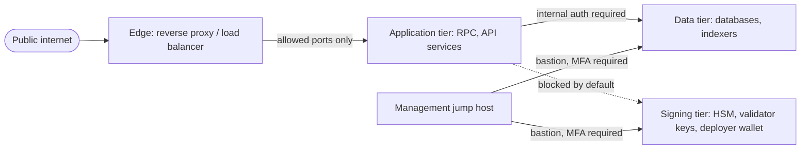
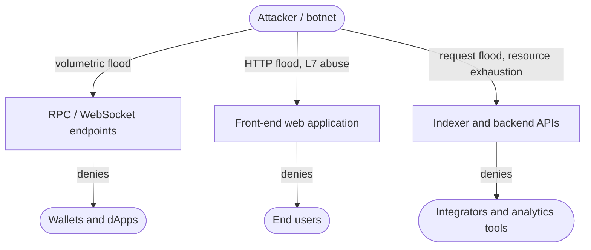
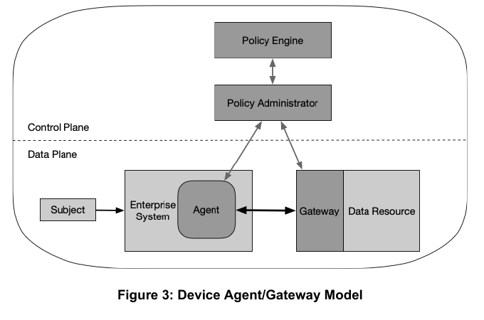
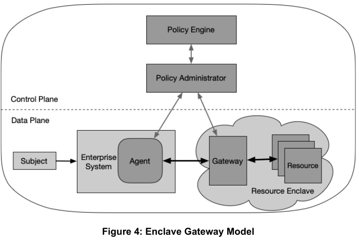
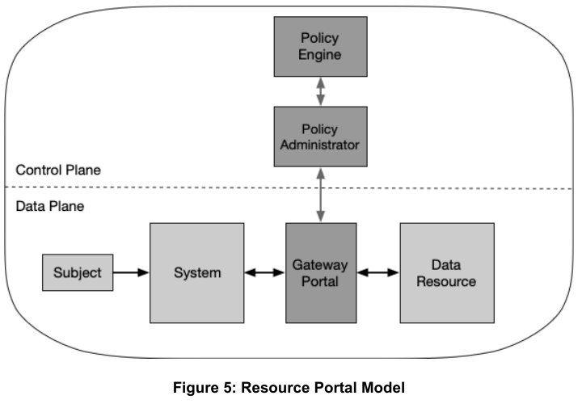
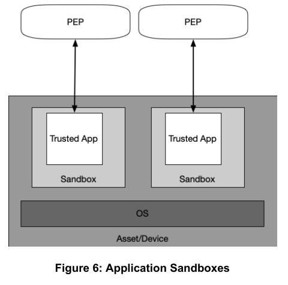
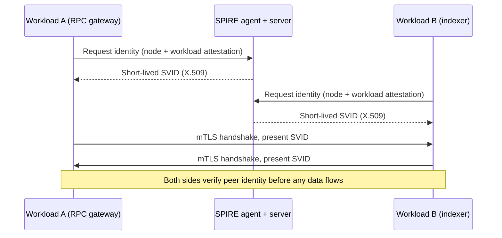

# Part 3: Network and Availability

[Back to Handbook contents](index.md) | [Series index](../index.md)

Part 3 moves from the servers and cloud accounts covered in Part 2 to the network paths connecting them and the availability guarantees users depend on. It builds the segmentation, ingress and egress filtering, transport encryption, and monitoring that keep a network defensible under normal load, works through a distributed denial-of-service (**DDoS**) **threat model** specific to remote procedure call (RPC) endpoints, front ends, and application programming interfaces (APIs), and closes on zero-trust design, the operating model that assumes any network segment, including your own, may already be hostile. Each chapter narrows the trust boundary the previous one drew: segmentation defines zones, DDoS mitigation defends the edge of those zones under attack, and zero trust removes the assumption that being inside a zone means anything at all.

---

## 6. Network Security

This chapter covers the network-layer controls that separate a Web3 project's tiers from each other and from the open internet: segmentation, filtering, transport encryption, and the monitoring that turns a breach attempt into a detected event rather than a silent one.

### 6.1 Network Segmentation and Firewalling

Segmentation divides a network into zones so that compromising one zone does not automatically grant reach into the next. NIST's guidelines on firewalls frame the goal precisely: a firewall enforces an **access control** policy between network segments of differing trust, not merely a boundary at the internet edge ([NIST SP 800-41 Rev. 1](https://nvlpubs.nist.gov/nistpubs/Legacy/SP/nistspecialpublication800-41r1.pdf)). For a Web3 project, the tiers to segment map onto the asset categories from Part 1's inventory (Section 2.1): a public edge that terminates connections from the open internet, an application tier running API and **RPC** services, a data tier holding databases and indexers, and a signing tier holding validator keys, deployer wallets, or hardware security modules (HSMs), which should sit in its own zone reachable from nowhere except a tightly scoped management path.

The mistake that recurs across incidents in this space is flat networking: a validator node, an internal admin dashboard, and a public-facing RPC endpoint sharing the same virtual private cloud (VPC) subnet with permissive rules between them, because segmenting later felt like it could wait. It shouldn't. Retrofitting segmentation onto a running production network means finding every implicit dependency the flat topology hid, usually under time pressure during an incident.



*Figure 1. Zone boundaries by sensitivity tier. The application tier has no default path to the signing tier; only a dedicated, MFA-gated management path reaches it.*

| Zone | Example workload | Inbound source | Baseline control |
|---|---|---|---|
| Edge | Load balancer, reverse proxy | 0.0.0.0/0 on 443 only | TLS termination, WAF rules |
| Application | RPC gateway, API services | Edge zone only | Security group + host firewall |
| Data | Database, indexer | Application zone only | No direct internet route |
| Signing | HSM, validator key, deployer wallet | Management jump host only | Default-deny, hardware MFA, logged access |

Enforce the zone boundaries with security groups or network access control lists (ACLs) in cloud environments, and with host-based firewalls inside each zone as a second layer, so a single misconfigured cloud rule is not the only thing standing between the internet and a signing key.


*Figure. A classic two-firewall demilitarized zone (DMZ) topology: public-facing services sit in a buffer zone between two firewalls, and the internal network is never directly reachable from the internet. The same pattern generalizes to the edge, application, data, and signing zones in Figure 1 above. Source: [Wikimedia Commons](https://commons.wikimedia.org/wiki/File:DMZ_network_diagram_2_firewall.svg), public domain.*

### 6.2 Access Control and Ingress/Egress Filtering

Ingress filtering answers one question for every port on every host: does this specific source need to reach this specific port, and if not, block it by default. The 2018 discovery that attackers had drained more than $20 million in ether and hundreds of token types from Ethereum clients that exposed their JSON-RPC interface on port 8545 to the open internet is the canonical failure mode. The Geth client's **RPC** interface grants access to sensitive functions including account unlock and fund transfer, and node operators who bound it to `0.0.0.0` instead of `localhost` handed that capability to anyone scanning the internet for the open port ([BleepingComputer, June 2018](https://www.bleepingcomputer.com/news/security/hackers-stole-over-20-million-from-misconfigured-ethereum-clients/); [Go Ethereum security guidance](https://geth.ethereum.org/docs/fundamentals/security)). The campaign ran for roughly two years before it was reported, which is the ingress-filtering failure mode at its worst: nothing alerted, because nothing was watching for a port that should never have been open.

Egress filtering is the less-practiced half of the same discipline and matters just as much. A compromised application server with unrestricted outbound access can exfiltrate data or reach command-and-control infrastructure without tripping any ingress rule, because the traffic looks like ordinary outbound activity. Default-deny egress, allow-listing only the specific destinations a service needs, turns a compromised host from a stepping stone into a dead end.

```
# nftables: default-deny both directions, explicit allow only
table inet filter {
  chain input {
    type filter hook input priority 0; policy drop;
    ct state established,related accept
    iif "lo" accept
    tcp dport 443 ip saddr $LB_CIDR accept    # app tier reachable only from LB
    tcp dport 8545 drop                        # JSON-RPC never exposed directly
  }
  chain output {
    type filter hook output priority 0; policy drop;
    ct state established,related accept
    ip daddr $CHAIN_PEERS tcp dport 30303 accept   # egress to known chain peers only
    ip daddr $PKG_REGISTRY tcp dport 443 accept
  }
}
```

Pair the rule set with a periodic audit that greps every security group and firewall config for `0.0.0.0/0` on a non-edge port; that single pattern would have caught the exposed-RPC campaign above before it started.

### 6.3 Encryption in Transit

Every hop in a Web3 project's network, not only the browser-facing one Handbook 01 covers, should assume the wire is hostile. Transport Layer Security (TLS) 1.3, standardized in [RFC 8446](https://www.rfc-editor.org/rfc/rfc8446), removes the negotiation weaknesses and legacy cipher suites that made downgrade attacks against TLS 1.2 and earlier practical, and NIST's server TLS guidance sets 1.3 as the preferred version with 1.2 as the practical floor for anything still supporting it ([NIST SP 800-52 Rev. 2](https://csrc.nist.gov/pubs/sp/800/52/r2/final)). Terminate TLS 1.3 at every external edge, enforce HTTP Strict Transport Security (HSTS) so a client never silently downgrades to plaintext, and disable TLS 1.0 and 1.1 outright; both are formally deprecated and neither belongs on infrastructure connected to a signing path.

Internal, service-to-service traffic deserves the same standard, not an exception because "it's inside the VPC." A VPC boundary is a network-layer control, not a cryptographic one, and an attacker who reaches the internal network through any other foothold reads plaintext internal traffic for free. Mutual TLS (mTLS), where both sides of a connection present and verify a certificate rather than only the server doing so, closes this gap; Section 8.4 builds it into a full service-mesh identity model.

```
server {
    listen 443 ssl;
    ssl_protocols TLSv1.3;
    ssl_prefer_server_ciphers off;
    add_header Strict-Transport-Security "max-age=63072000; includeSubDomains; preload" always;
    ssl_certificate     /etc/ssl/certs/app.pem;
    ssl_certificate_key /etc/ssl/private/app.key;
}
```

### 6.4 Monitoring and IDS/IPS Considerations

An intrusion detection system (IDS) observes traffic and raises an alert; an intrusion prevention system (IPS) sits inline and can drop offending traffic automatically. Both matter, and where each sits is a tradeoff between response speed and the risk of a false positive silently dropping legitimate traffic on a path connected to user funds. CIS Controls Safeguard 13, Network Monitoring and Defense, sets the baseline: centralize security event logging across the network, deploy a network intrusion detection capability, and retain logs long enough to support investigation, not just real-time alerting ([CIS Controls](https://www.cisecurity.org/controls)).

Two open-source tools cover most of this ground without a commercial license. [Suricata](https://suricata.io/), maintained by the Open Information Security Foundation, is a signature-based engine that runs in either IDS or inline IPS mode and inspects protocols up through the application layer. [Zeek](https://zeek.org/) takes a passive, behavioral approach instead: rather than matching signatures, it builds rich transaction logs of every connection, DNS lookup, and file transfer, which is what makes it useful for retrospective threat hunting after an alert fires elsewhere. Mature security operations run both side by side, Suricata for real-time signature alerts, Zeek for the behavioral telemetry an investigator pulls up next.

```
# Suricata rule: flag any external attempt to reach a JSON-RPC port directly
alert tcp any any -> $RPC_NODES 8545 (msg:"Unexpected external JSON-RPC access"; \
  flow:to_server; classtype:policy-violation; sid:1000001; rev:1;)
```

| Signal source | Catches | Feeds |
|---|---|---|
| Suricata (IDS/IPS) | Known-signature exploit traffic, protocol anomalies | Alerting, SIEM |
| Zeek | Connection, DNS, and TLS transaction logs, behavioral baselines | Threat hunting, retrospective IR |
| Cloud flow logs (VPC Flow Logs, GuardDuty) | East-west traffic, anomalous API calls, known-bad IP contact | Cloud-native alerting |
| Host-based endpoint detection | Process, file, and syscall telemetry on the host | SIEM, endpoint IR |

---

## 7. DDoS Protection

This chapter builds a **DDoS** **threat model** specific to the three surfaces a Web3 project exposes publicly, RPC, front end, and API, then works through mitigation, rate limiting, and the incident response playbook for when an attack succeeds despite the defenses.

### 7.1 Threat Model for DDoS in Web3 (RPC, Front-End, APIs)

A **DDoS** attack floods a target with more traffic or more requests than it, or the network path to it, can absorb, degrading or blocking service for legitimate users. MITRE ATT&CK catalogs this as [Network Denial of Service (T1498)](https://attack.mitre.org/techniques/T1498/), with two sub-techniques that map directly onto Web3 infrastructure: direct network floods (T1498.001), raw volumetric traffic aimed at a target's bandwidth, and reflection amplification (T1498.002), where an attacker spoofs the victim's address in requests to third-party servers that reply with a far larger response. MITRE's [AADAPT framework](https://www.mitre.org/news-insights/fact-sheet/aadapt-cyber-threat-framework-digital-assets), launched in July 2025 specifically to catalog adversary tactics against digital asset systems, extends this model to blockchain-native impact: an availability attack against a chain's infrastructure can degrade consensus timeliness even when it never touches contract logic or private keys.

Three surfaces carry this risk for a typical Web3 project, and each fails differently. The **RPC** surface, the endpoints wallets and dApps use to read and broadcast against a chain, is the highest-value target because it sits directly between users and the ability to transact; Manta Network's layer-2 blockchain absorbed more than 135 million fake RPC requests on January 18, 2024, timed to coincide with its token's exchange listing, an attack aimed squarely at denying access during the moment of highest user interest ([Cointelegraph](https://cointelegraph.com/news/manta-network-experiences-ddos-attack-amid-exchange-listing)). The front-end surface is the conventional web layer, subject to the same volumetric and application-layer floods any web service faces. The API surface, indexers, analytics endpoints, and any backend a dApp calls outside the chain itself, is frequently the least defended because teams invest budget in the RPC and front end first.

Scale sets the bar any defense must clear. Solana disclosed in December 2025 that it had absorbed a sustained attack peaking near 6 terabits per second (Tbps), the fourth-largest DDoS attack recorded against any distributed system at the time, without downtime: layered defenses including the QUIC transport protocol, stake-weighted quality of service, and local fee markets filtered spam and prioritized legitimate traffic through the flood. Sui, targeted around the same period, experienced block-production delays and degraded performance instead, illustrating that protocol design, not bandwidth alone, determines the outcome of the same class of attack ([CCN](https://www.ccn.com/education/crypto/solana-6-tbps-ddos-attack-survived-sui-downtime/)).



*Figure 2. The three surfaces a Web3 project exposes publicly, each with a distinct attack vector and a distinct victim population.*

### 7.2 Mitigation Strategies and Provider Options

Mitigating a volumetric attack requires absorbing more traffic than any single origin can hold, which is why the standard architecture routes traffic through an anycast network of scrubbing nodes before it reaches the origin at all. Cloudflare's fourth-quarter 2025 **DDoS** report recorded a 31.4 Tbps attack, the largest publicly disclosed to date, sustained for just 35 seconds, part of a year in which the total volume of attacks the network mitigated more than doubled to 47.1 million ([Cloudflare Q4 2025 DDoS threat report](https://blog.cloudflare.com/ddos-threat-report-2025-q4/)). Earlier in the same year Cloudflare had already blocked a 7.3 Tbps attack lasting 45 seconds, and the growth of Internet of Things (IoT) botnets, the Aisuru botnet chief among them, drove much of the escalation ([Cloudflare Q2 2025 report](https://blog.cloudflare.com/defending-the-internet-how-cloudflare-blocked-a-monumental-7-3-tbps-ddos/); [Cloudflare Q3 2025 report](https://blog.cloudflare.com/ddos-threat-report-2025-q3/)). No origin network, however large, absorbs that scale directly; the defense has to happen upstream.

Two provider models dominate. Content delivery network (CDN)-integrated protection covers the front-end surface with no separate contract. Network-layer, Border Gateway Protocol (BGP)-based protection, Cloudflare Magic Transit, Akamai Prolexic, or Amazon Web Services (AWS) Shield Advanced, extends the same scrubbing to non-HTTP infrastructure: **RPC** nodes, validator peer-to-peer ports, and anything that is not a website, by announcing your IP prefixes through the provider's network and filtering before traffic reaches your origin, an anycast scrubbing path that never lets the flood reach the workloads Figure 2 shows under attack. Shield Advanced adds cost protection against attack-driven autoscaling bills and integrates tightly with AWS's web application firewall (WAF) and CloudFront; Magic Transit is cloud-agnostic and protects on-premises and multi-cloud infrastructure under one account. The single-versus-multi-provider tradeoff from Part 1 (Section 1.2) applies directly here: a sole scrubbing provider is one more concentration point, so critical-tier assets should have a tested secondary path.

| Provider / model | Layer protected | Notes |
|---|---|---|
| CDN HTTP DDoS protection | Front end, API (L7) | Included on any proxied site |
| Cloudflare Magic Transit | Network (L3/L4), BGP-announced prefixes | Cloud-agnostic, enterprise tier, minimum /24 prefix |
| AWS Shield Advanced | AWS-hosted infrastructure | Cost protection, DDoS Response Team escalation |
| Akamai Prolexic | Network and application layer | Dedicated scrubbing-center model |

### 7.3 Rate Limiting and Throttling

Rate limiting stops the class of **DDoS** that pure network-layer scrubbing cannot: requests that are individually well-formed and authenticated but collectively exceed what a backend should serve any single caller. The [OWASP API Security Top 10's API4:2023, Unrestricted Resource Consumption](https://owasp.org/API-Security/editions/2023/en/0xa4-unrestricted-resource-consumption/), names this directly: an API that does not bound how often, how much, or how expensively a client can call it is vulnerable regardless of how well it authenticates that client. For an **RPC** endpoint, an expensive call, `eth_getLogs` over a huge block range, or a full archive query, can each cost orders of magnitude more compute than a simple balance check, so a rate limiter counting requests alone still leaves an amplification gap.

Two algorithms cover most implementations. The token bucket adds tokens to a per-client bucket at a fixed rate up to a capacity; each request consumes a token, and the bucket empties under sustained abuse while still tolerating a legitimate short burst. The leaky bucket instead processes requests at a constant rate regardless of arrival pattern, smoothing bursty traffic into steady output at the cost of queuing delay for legitimate spikes. Token bucket suits most per-API-key RPC and API limiting, where occasional bursts from a legitimate integrator are expected; leaky bucket suits protecting a fixed-capacity downstream resource that cannot absorb any burst at all.

```
http {
    limit_req_zone $binary_remote_addr zone=rpc_ip:10m rate=20r/s;
    limit_req_zone $http_x_api_key zone=rpc_key:10m rate=100r/s;

    server {
        location /rpc {
            limit_req zone=rpc_ip burst=40 nodelay;
            limit_req zone=rpc_key burst=200 nodelay;
            proxy_pass http://rpc_backend;
        }
    }
}
```

| Algorithm | Behavior | Best fit |
|---|---|---|
| Token bucket | Fixed refill rate, allows bursts up to capacity | Per-API-key RPC and API limits |
| Leaky bucket | Constant output rate, queues excess | Protecting a fixed-capacity downstream resource |
| Fixed or sliding window | Counts requests per time window | Simple, coarse edge limits |

Layer the limits: a coarse network-layer limit at the edge, a per-API-key limit tied to authentication, and a per-method cost weighting so a cheap call and an expensive archive query do not share the same budget. Tie the API-key limit to the identity model in Section 8.2 rather than treating rate limiting as a network-only control; the two work as one system.

### 7.4 Incident Response for DDoS

A **DDoS** runbook has to exist before an attack starts, because the minutes spent deciding who has authority to fail traffic over to a scrubbing provider are minutes the attack keeps running unmitigated. The [Incident Response Handbook (06)](../06-incident-response/index.md) owns the general response process; this section is the DDoS-specific extension of it.

Detection should trigger on the same telemetry Section 6.4 established: a sudden deviation in request rate, connection count, or upstream bandwidth utilization against a baseline, correlated across the **RPC**, front-end, and API surfaces so a coordinated multi-surface attack is recognized as one incident rather than three unrelated alerts. MITRE's [detection strategy for T1498](https://attack.mitre.org/detectionstrategies/DET0518/) recommends monitoring network traffic content and flow for volume and pattern anomalies across platforms, which is the same signal a flow-log pipeline already produces if Section 6.4's monitoring is in place.

**DDoS Incident Response Checklist**

- [ ] Detect: alert fires from flow-log/IDS baseline deviation, correlated across RPC/front-end/API
- [ ] Triage: confirm attack vs. legitimate traffic spike (launch, listing, viral event)
- [ ] Activate: engage scrubbing provider (BGP failover or DNS-based redirect) per pre-authorized runbook
- [ ] Communicate: status page update, on-call paging per **Incident Response** Handbook (06)
- [ ] Rate-limit: tighten per-key/per-IP limits at the edge (Section 7.3) as a secondary control
- [ ] Preserve: capture flow logs and IDS alerts for post-incident analysis before rotation/expiry
- [ ] Review: post-incident retro; update baseline thresholds and runbook gaps found under real load

Practice the runbook, not just write it. A scrubbing-provider failover that has never been rehearsed under simulated load is the same untested-hypothesis failure mode Part 1 (Section 1.2.1) flagged for multi-provider redundancy generally: the first real test of a DDoS response plan should not be the first real attack.

---

## 8. Zero-Trust Principles

**Zero trust** reframes every control in this Part around one assumption: the network itself, internal or external, is never a **trust boundary** on its own. This chapter works through NIST's and the Cybersecurity and Infrastructure Security Agency's (CISA) zero-trust models and applies each tenet to Web3 infrastructure specifically.

### 8.1 Assume Breach and Verify Explicitly

**Zero trust** starts from an assumption traditional perimeter security explicitly rejects: that an attacker may already be inside the network, and every access decision should be made as if that were true. NIST codified this model in [Special Publication 800-207, Zero Trust Architecture](https://csrc.nist.gov/pubs/sp/800/207/final), published in August 2020, around seven tenets: treat every data source and computing service as a resource; secure all communication regardless of network location; grant access to individual resources on a per-session basis; base access decisions on dynamic policy, including client identity, device posture, and behavioral signals; continuously monitor the integrity and security posture of every asset; enforce authentication and authorization dynamically before every access rather than once at login; and collect telemetry about asset state, network traffic, and access requests to continuously improve the policy governing them.


*Figure. NIST SP 800-207's Core Zero Trust Logical Components diagram. Every access request passes through the policy enforcement point, which only allows traffic once the policy engine and policy administrator, informed by external signals, approve it. Source: [NIST SP 800-207](https://nvlpubs.nist.gov/nistpubs/specialpublications/NIST.SP.800-207.pdf), U.S. government work, public domain.*

For Web3 infrastructure, "assume breach" carries a sharper edge than in a generic enterprise network, because the asset a breach ultimately threatens is a signing key, not a file share. A perimeter model asks "is this request coming from inside the VPC," a question a compromised app server inside that VPC answers "yes" by definition. A zero-trust model asks "does this specific identity, on this specific device, in this specific context, have standing authorization for this specific action," a question that stays hard for an attacker to answer correctly even after gaining a foothold.

| # | NIST SP 800-207 tenet (condensed) | Implemented in |
|---|---|---|
| 1 | Every data source and service is a resource | Asset inventory (Part 1, Chapter 2) |
| 2 | All communication is secured regardless of location | Section 8.4, mTLS |
| 3 | Access is granted per session | Sections 8.2, 8.6 |
| 4 | Access decided by dynamic policy (identity, device, behavior) | Section 8.2 |
| 5 | Integrity and posture of every asset is monitored | Section 8.7 |
| 6 | Authentication and authorization enforced dynamically, every time | Section 8.6 |
| 7 | Telemetry drives continuous policy improvement | Section 8.7 |

NIST describes several deployment models for placing the policy enforcement point (PEP). They are alternatives, not maturity levels: choose the model that most tightly binds policy to the resource without creating an unobservable bypass path.


*Figure. Device-agent/gateway model. An endpoint agent establishes the data-plane channel to a gateway protecting the resource; this is a strong fit for managed administrator workstations reaching private RPC, cloud, or signing services. Source: [NIST SP 800-207](https://csrc.nist.gov/pubs/sp/800/207/final), U.S. government work, public domain.*


*Figure. Enclave-gateway model. One PEP protects a resource group, useful for a tightly controlled validator or node subnet, but compromise inside the enclave can still enable lateral movement unless workload-level controls are added. Source: [NIST SP 800-207](https://csrc.nist.gov/pubs/sp/800/207/final), U.S. government work, public domain.*


*Figure. Resource-portal model. A brokered portal is practical for browser-based administration and unmanaged clients, provided the origin cannot be reached directly and the portal continuously re-evaluates identity, device, and session risk. Source: [NIST SP 800-207](https://csrc.nist.gov/pubs/sp/800/207/final), U.S. government work, public domain.*


*Figure. Application-sandbox model. Per-application isolation narrows the trust boundary on bring-your-own-device or high-risk endpoints; a compromised application does not automatically inherit every connection available to the device. Source: [NIST SP 800-207](https://csrc.nist.gov/pubs/sp/800/207/final), U.S. government work, public domain.*

### 8.2 Identity and Device Verification

CISA's **Zero Trust** Maturity Model (ZTMM) 2.0 organizes the discipline into five pillars, Identity, Devices, Networks, Applications and Workloads, and Data, with three cross-cutting capabilities: visibility and analytics, automation and orchestration, and governance ([CISA ZTMM v2.0, April 2023](https://www.cisa.gov/sites/default/files/2023-04/zero_trust_maturity_model_v2_508.pdf)). Identity and device are the first two pillars for a reason: almost every other control in a zero-trust architecture consumes their output as an input to a policy decision.

**Identity verification** means every human and every service account authenticates with phishing-resistant, hardware-backed multi-factor authentication (MFA), the same standard Part 1's critical-asset tier requires (Section 2.2), using FIDO2/WebAuthn security keys rather than SMS or a software authenticator that a social-engineering call can talk a support desk into resetting. Device verification adds a second, independent signal: is this specific device enrolled, patched, and running expected security tooling, checked continuously rather than once at enrollment. A stolen but valid session token from an unmanaged, unpatched personal laptop should fail a policy check that a token from a managed, current, enrolled device passes, even though both present the identical credential.

The two signals compose into the policy decision that replaces "are you on the VPN": is this identity authenticated to the required assurance level, on a device meeting the required posture, requesting an action within its authorized scope, right now. Any one of the three failing denies access, regardless of the other two.

### 8.3 Micro-Segmentation and Least Privilege in Network

Section 6.1 segmented the network into coarse zones; micro-segmentation carries the same logic down to individual workloads, so that even two services inside the same "application tier" zone cannot reach each other unless a policy explicitly allows it. The distinction matters because coarse zoning still leaves lateral movement available to an attacker who compromises any single service inside a zone: if every workload in an application tier can reach every other workload by default, the zone boundary from Section 6.1 protected the perimeter and nothing else.

In a Kubernetes environment, `NetworkPolicy` resources implement micro-segmentation natively, default-denying pod-to-pod traffic and allowing only the specific flows a workload actually needs.

```yaml
apiVersion: networking.k8s.io/v1
kind: NetworkPolicy
metadata:
  name: default-deny-all
  namespace: rpc-services
spec:
  podSelector: {}
  policyTypes: [Ingress, Egress]
---
apiVersion: networking.k8s.io/v1
kind: NetworkPolicy
metadata:
  name: allow-rpc-to-indexer
  namespace: rpc-services
spec:
  podSelector:
    matchLabels: {app: indexer}
  ingress:
    - from:
        - podSelector: {matchLabels: {app: rpc-gateway}}
      ports: [{protocol: TCP, port: 5432}]
  policyTypes: [Ingress]
```

Outside Kubernetes, the same principle applies through host-based firewall rules scoped per service, extending the nftables approach from Section 6.2 to intra-zone traffic, or through a service mesh's authorization policies, covered next. The test for whether micro-segmentation is actually in place, rather than assumed: pick any two workloads in the same zone and ask whether compromising one grants network reachability to the other. If the honest answer is yes without a documented business reason, the segmentation is not fine-grained enough.

### 8.4 Service Mesh and mTLS for Service-to-Service

Section 6.3 established mTLS as the standard for internal traffic; a service mesh is the infrastructure that issues, rotates, and enforces the certificates that make mTLS operationally sustainable at more than a handful of services. [SPIFFE](https://spiffe.io/) (Secure Production Identity Framework for Everyone) defines an open standard for workload identity, and [SPIRE](https://spiffe.io/docs/latest/spire-about/) is its reference implementation: SPIRE performs node and workload attestation, verifying what a workload actually is (which container, in which namespace, running which binary) before issuing it a SPIFFE Verifiable Identity Document (SVID), an X.509 certificate or JSON Web Token bearing a URI-formatted identity such as `spiffe://prod.example/ns/rpc/sa/gateway`.

Service meshes such as Istio consume this identity model directly: every workload gets an identity derived from its platform context, and the mesh's sidecar proxies use that identity to negotiate mTLS on every connection, transparently to the application code. Configuring the mesh's peer authentication in strict mode means a workload without a valid mesh-issued identity cannot establish a connection at all, closing the gap Section 6.1's zone boundaries leave open by default: two services in the same zone, on the same subnet, still cannot talk to each other without a verified identity on both ends.



*Figure 3. Workload identity issuance and mutual authentication. Neither side trusts the connection until both certificates verify.*

The operational payoff is rotation. A certificate authority issuing short-lived SVIDs, commonly valid for under an hour, means a leaked certificate is worthless within the hour without any human running a manual rotation, and a compromised workload's identity can be revoked by simply declining to renew it.

### 8.5 ZTNA and Secure Tunnels for Remote Access

Remote administrative access is where zero-trust principles most directly replace a legacy control: the corporate or site-to-site virtual private network (VPN) that, once connected, places a remote engineer's laptop on the same broadcast domain as production infrastructure. A VPN authenticates once, at connection time, and then trusts the tunnel for its duration; a stolen VPN session or a compromised laptop inherits full network reach for as long as the tunnel stays up, precisely the flat-trust model Section 8.1 argues against.

**Zero Trust** Network Access (ZTNA) replaces the network-level tunnel with an application-level, identity-brokered connection: a user authenticates to a policy engine, the policy engine checks identity, device posture, and the specific resource requested, and only then does traffic flow, scoped to that one resource rather than the whole network. Cloudflare Access and comparable platforms implement this at the application layer, while [Tailscale](https://tailscale.com/), built on the [WireGuard](https://www.wireguard.com/) protocol, implements a mesh-network variant: every device gets a WireGuard keypair, and access between any two devices is authorized per-connection through the coordination plane's policy rather than granted by network topology.

Whichever model a team picks, the operational win is the same: revoking one engineer's access means revoking their identity from the policy engine, not rotating a shared VPN pre-shared key that every other remote user also depends on. Bastion hosts and jump servers (Section 6.1's diagram) should themselves sit behind this model rather than behind a static VPN, so the management path into the signing tier inherits the same per-session verification as every other resource.

### 8.6 Just-in-Time, Ephemeral Credentials

A standing credential, an API key that works today, tomorrow, and every day until someone remembers to rotate it, is a liability the instant it is issued, because its **blast radius** is bounded only by how long it takes someone to notice it leaked. Just-in-time (JIT) access replaces the standing credential with one generated on demand, scoped to a specific task, and expiring automatically on a short time-to-live (TTL), so a credential that leaks is frequently already worthless by the time an attacker tries to use it.

HashiCorp Vault's dynamic secrets engines implement this directly: rather than storing a static database password or cloud key, Vault generates a unique credential at request time with a built-in TTL and revokes it automatically on expiry, without requiring the requester to remember to clean up. AWS's Security Token Service (STS) provides the same pattern natively for cloud access: `AssumeRole` issues temporary credentials, typically valid for an hour, instead of handing out a long-lived Identity and Access Management (IAM) access key.

```bash
# AWS: request a 1-hour scoped credential instead of using a static IAM key
aws sts assume-role \
  --role-arn arn:aws:iam::123456789012:role/rpc-deploy-role \
  --role-session-name deploy-$(date +%s) \
  --duration-seconds 3600

# Vault: read a dynamic, short-TTL database credential
vault read database/creds/rpc-readonly
```

Reserve standing credentials for the narrow case a JIT model cannot cover: emergency break-glass access when the identity provider or Vault itself is unreachable. Treat that break-glass path with the critical-asset controls from Part 1 (Section 2.2): sealed, logged, alerting on use, and rotated immediately after. Section 8.7's continuous monitoring should specifically watch for JIT credentials issued outside expected patterns, because a working JIT system with no one watching its issuance log is only half the control.

### 8.7 Continuous Verification and Real-Time Monitoring

**Zero trust** is not a one-time architecture migration; NIST's fifth and seventh tenets (Section 8.1) require continuous monitoring of every asset's integrity and posture, and continuous telemetry collection to keep the policy engine's decisions current. A device that passed a posture check this morning and got compromised by lunch should lose access before the end of the day, not at the next scheduled review, which means the policy engine has to consume live signal rather than a periodic snapshot.

This closes the loop the rest of the Part has been building toward. Section 6.4's IDS and IPS telemetry, Section 8.6's credential-issuance logs, and cloud-native posture signals all feed a security information and event management (SIEM) platform or a user and entity behavior analytics (UEBA) layer that looks for deviation from an established baseline, not just matches against a known-bad signature. An engineer whose credentials always request access from one geography at business hours, then suddenly request a break-glass credential at 3 a.m. from a new network origin, is a UEBA-catchable anomaly even though no individual event in the sequence violated a hard rule.

The final connection runs back to Part 1's asset inventory (Section 2.4): continuous verification is only as good as the record of what should be normal for a given asset, and the inventory's reconciliation loop, declared state against what active discovery finds, is itself a zero-trust control. An unexpected asset appearing on the network is exactly the signal tenet five asks the enterprise to monitor for. Zero trust, in this sense, is less a discrete product to buy than the discipline of wiring every control this Part built, segmentation, filtering, encryption, monitoring, **DDoS** defense, identity, and ephemeral credentials, into one continuously re-evaluated policy rather than a set of independent, static gates.

---

**Key controls for Part 3**

- Segment the network into zones (edge, application, data, signing) with defense-in-depth firewalling at both the cloud security-group and host level, and never expose an **RPC** or admin interface to `0.0.0.0/0` (Sections 6.1, 6.2).
- Terminate every external and internal connection with TLS 1.3 and enforce mTLS for service-to-service traffic (Sections 6.3, 8.4); disable TLS 1.0/1.1 outright.
- Build a DDoS **threat model** covering RPC, front-end, and API surfaces separately, and pre-authorize a scrubbing-provider failover runbook before an attack, not during one (Chapter 7).
- Layer rate limiting (edge IP limit, per-key limit, per-method cost weighting) to stop the well-formed abuse that network-layer DDoS scrubbing cannot see (Section 7.3).
- Replace standing VPN access and static credentials with ZTNA, service-mesh mTLS, and just-in-time ephemeral credentials, so every access decision is per-session and continuously re-evaluated rather than granted once and trusted indefinitely (Chapter 8).

