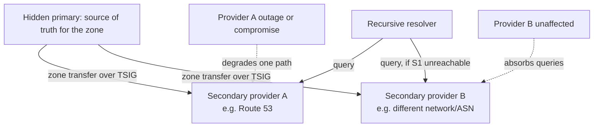
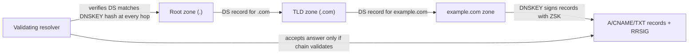
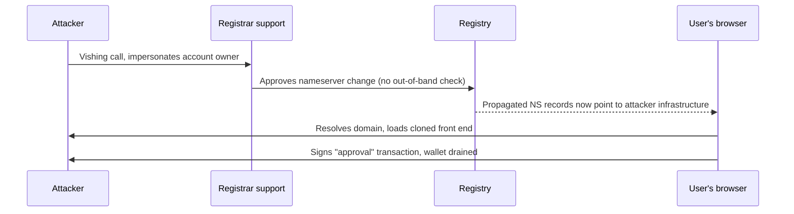

# Part 4: DNS and Domain Security

[Back to Handbook contents](index.md) | [Series index](../index.md)

A smart contract cannot be phished, but the domain name that points a browser at its front end can be, and DNS or registrar access has now displaced smart contract bugs as the fastest path to draining a well-audited Web3 project. This part covers who is allowed to change where a domain resolves, the cryptographic records (DNSSEC, CAA, SSHFP) that make DNS answers verifiable rather than merely trusted, the email authentication stack (SPF, DKIM, DMARC) that protects the registrar and user notification channel, and the attack patterns that recur across every domain-hijack incident in this handbook's incident record.

---

## 9. DNS and Domain Registration

This chapter covers who controls a domain, how that control is locked down against theft, and how it survives the loss of any single provider.

### 9.1 Registrar Security and Lockdown

The domain registrar account is the root of trust for everything downstream of it: DNS records, TLS issuance, and every subdomain a project runs. Whoever controls that account controls where users land when they type the project's name, which makes the registrar account a critical-tier asset under the sensitivity tiering built in Part I, Section 2.2, deserving the same hardware-backed multi-factor authentication (MFA) and break-glass process as a deployer wallet, not the password-and-SMS treatment typical of a marketing tool signup.

Two incidents define the **threat model**. In November 2020, attackers vished (voice-phished) GoDaddy support staff into transferring control of at least six domains, including the cryptocurrency platforms Liquid.com and NiceHash, giving the attackers the ability to rewrite DNS records and intercept internal email ([Krebs on Security](https://krebsonsecurity.com/2020/11/godaddy-employees-used-in-attacks-on-multiple-cryptocurrency-services/)). In August 2022, Curve Finance's front end was hijacked when the nameserver belonging to Curve's registrar, iwantmyname, was compromised directly, redirecting `curve.fi` to a phishing clone and costing users roughly $570,000 before the team could point traffic at the unaffected `curve.exchange` domain, hosted through a separate provider ([Decrypt](https://decrypt.co/319414/curve-finance-dns-record-attack); [The Block](https://www.theblock.co/post/354067/curve-finances-front-end-targeted-in-dns-attack-on-website)). Neither attack touched the registrant's own credentials; both defeated the registrar's own operational security.

Lock the account down with hardware-backed MFA (WebAuthn or FIDO2, never SMS-only), a dedicated account not shared with unrelated domains, WHOIS privacy redaction (standard since ICANN's GDPR-driven Temporary Specification), and the EPP transfer authorization code stored offline. Then add the transfer-prevention status codes and, for the domain that fronts user funds, registry lock.

| Control | Layer | What it blocks | Bypassed by |
|---|---|---|---|
| `clientTransferProhibited` | Registrar account | Unauthorized inter-registrar transfer | Compromised registrar account credentials |
| `clientUpdateProhibited` / `clientDeleteProhibited` | Registrar account | Nameserver or contact changes, accidental deletion | Compromised registrar account credentials |
| Registry lock (e.g., Verisign Registry Lock, CSC, MarkMonitor) | Registry, above the registrar | All of the above, even with valid registrar credentials | Only an out-of-band verification call to the registry, by design |

Registrar-level status codes stop an outsider who has not compromised the account; they do nothing once the account itself is owned, which is exactly what happened at GoDaddy and iwantmyname. Registry lock closes that gap by moving the final approval outside the registrar's own control plane, requiring a phone call or signed request the registry verifies independently before any nameserver change takes effect ([ICANNWiki, Domain Locking](https://icannwiki.org/Domain_Locking)).

### 9.2 Nameserver and Zone Management

Once the registrar account is locked down, the next control surface is the DNS provider account that hosts the actual zone: the file mapping the domain to its A, CNAME, MX, and TXT records. This account deserves identical treatment to the registrar (hardware MFA, dedicated ownership, logged access) because it can redirect traffic just as effectively without ever touching the registrar at all.

Two operational practices matter beyond account security. First, restrict zone transfers (AXFR), the mechanism a secondary nameserver uses to pull a full copy of the zone. An unrestricted AXFR hands your entire DNS layout, every subdomain, every internal-facing hostname, to anyone who asks, which is reconnaissance a targeted attacker will use before a phishing or takeover attempt. Restrict transfers to known secondary IPs and authenticate them with Transaction Signature (TSIG), a shared-secret HMAC defined in [RFC 8945](https://www.rfc-editor.org/rfc/rfc8945.html):

```bash
# Unrestricted: anyone can dump the zone
dig axfr example.com @ns1.example.com
# ;; ANSWER SECTION: (returns every record in the zone)

# BIND fix: require TSIG and restrict by IP
key "transfer-key" {
    algorithm hmac-sha256;
    secret "base64-encoded-shared-secret";
};
zone "example.com" {
    type master;
    allow-transfer { key transfer-key; 203.0.113.10; };
};
```

Second, manage zone records the same way Part I, Section 2.3 recommends managing every other infrastructure resource: as code, reviewed in a pull request, applied through a pipeline rather than a console click. A Terraform-managed zone makes every record change an auditable diff and prevents the silent, undocumented DNS drift that both hides misconfigurations and slows **incident response** when a responder needs to know what the record looked like before an attacker changed it.

```hcl
resource "aws_route53_record" "app_a" {
  zone_id = aws_route53_zone.primary.zone_id
  name    = "app.example.com"
  type    = "A"
  ttl     = 300
  records = ["203.0.113.50"]
}
```

### 9.3 Redundancy and Failover

A domain with a single authoritative nameserver, or several nameservers hosted by a single provider, inherits that provider's availability and integrity risk in full, the same consolidated-versus-diversified tradeoff Part I, Section 1.2 established for cloud accounts and CDNs, applied here to the record that everything else resolves through. If that one DNS provider suffers an outage, a BGP leak, or an account compromise, every service relying on the domain goes down or gets hijacked with it.

Diversify authoritative nameservers across two providers on different networks (different autonomous systems, different upstream transit) so that a single provider's incident degrades rather than eliminates resolution. A hidden-primary architecture, where the authoritative source of truth is not itself publicly listed as a nameserver, works well here: the primary pushes zone updates to two independent secondary providers, each publicly authoritative and neither dependent on the other's infrastructure.



*Figure 1. Authoritative nameserver redundancy. Neither secondary depends on the other, so an outage or account compromise at one provider does not remove the domain from resolution.*

Set TTLs deliberately: low enough (300 to 900 seconds) that a legitimate emergency record change, redirecting to a status page during an incident, propagates quickly, but not so low that recursive resolvers hammer the authoritative servers or that a transient blip triggers unnecessary failover. Test the failover path before relying on it; an untested secondary is, per Part I's framing, a hypothesis rather than a control. Redundancy at this layer also complements the distributed denial-of-service (**DDoS**) protections covered in Part III, Chapter 7, since a DNS-layer outage produces the same user-facing unavailability as a network-layer attack.

---

## 10. DNS Security (DNSSEC, CAA, etc.)

This chapter covers the cryptographic and policy records that convert a DNS answer, and the certificate issued against it, from something a resolver merely accepts into something it can verify.

### 10.1 DNSSEC Implementation

Plain DNS has no authentication: a resolver accepts whatever answer arrives on the expected port with a matching query ID, which is precisely the weakness Dan Kaminsky demonstrated at scale in 2008 and which underlies cache poisoning attacks to this day. Domain Name System Security Extensions (DNSSEC), defined across [RFC 4033](https://www.rfc-editor.org/rfc/rfc4033.html), [RFC 4034](https://www.rfc-editor.org/rfc/rfc4034.html), and [RFC 4035](https://www.rfc-editor.org/rfc/rfc4035.html), fixes this by having each zone sign its own records and chaining that signature up to the DNS root, so a validating resolver can cryptographically confirm an answer was not forged or altered in transit. The National Institute of Standards and Technology's [Secure Domain Name System Deployment Guide, SP 800-81 Revision 3](https://csrc.nist.gov/pubs/sp/800/81/r3/final) (finalized March 2026) treats DNSSEC as a baseline control within a zero-trust and defense-in-depth DNS architecture.



*Figure 2. The DNSSEC chain of trust. A resolver validates each delegation by hashing the child zone's DNSKEY and comparing it against the DS record published in the parent, up to a root it trusts implicitly.*

Adoption remains uneven and worth knowing before treating DNSSEC as a default. As of mid-2026, roughly 94% of top-level domains (TLDs) in the root are signed, but only about 4.3% of second-level domains across a 240-million-domain sample actually deploy it, and only around 11.5% of DNS queries are handled by resolvers that validate signatures at all ([DNSChkr, DNSSEC Adoption 2026](https://dnschkr.com/blog/dnssec-adoption-2026); [technologychecker.io](https://technologychecker.io/blog/dnssec-adoption)). DNSSEC protects your zone's integrity against every validating resolver on the path, even though most traffic today still passes through resolvers that skip validation entirely, so it is a defense-in-depth control worth deploying regardless of universal adoption, not a control you should skip because coverage is partial.

#### 10.1.1 Key Management and Signing

DNSSEC uses two key pairs per zone. The Key-Signing Key (KSK) signs the zone's DNSKEY record set and anchors the chain of trust to the parent zone through the DS record; the Zone-Signing Key (ZSK) signs the actual resource record sets and rotates more frequently since it carries none of the parent-zone dependency. [RFC 8624](https://www.rfc-editor.org/rfc/rfc8624.html) sets ECDSAP256SHA256 as the recommended algorithm for new deployments, offering equivalent strength to RSASHA256 with a materially shorter signature, which matters for UDP packet size and DNS amplification resistance.

Most managed DNS providers (Route 53, Cloudflare, Google Cloud DNS) automate key generation, signing, and rollover behind a single toggle, which is the right default for most teams: manual key management with `dnssec-keygen` and `dnssec-signzone` under BIND is more error-prone and is warranted mainly for teams running their own authoritative infrastructure.

```bash
# Generate a KSK and ZSK for a self-managed BIND zone
dnssec-keygen -a ECDSAP256SHA256 -f KSK example.com
dnssec-keygen -a ECDSAP256SHA256 example.com
# Sign the zone, producing RRSIG, NSEC, and DNSKEY records
dnssec-signzone -A -3 $(head -c 16 /dev/urandom | xxd -p) -N INCREMENT -o example.com -t example.com.zone
```

Key rollover follows the pre-publish method described in [RFC 6781](https://www.rfc-editor.org/rfc/rfc6781.html): publish the new key alongside the old one, wait out the TTL so every cached copy of the old key set expires, switch signing to the new key, then remove the old one. Skipping the wait period breaks validation for any resolver still holding a cached, now-stale key. Use NSEC3 rather than NSEC for the denial-of-existence records unless zone enumeration resistance is not a concern, since plain NSEC lets an attacker walk the entire zone by following its ordered chain of "next domain name" pointers.

#### 10.1.2 DS Records and Registrar Support

Signing a zone accomplishes nothing until the parent zone (the TLD) publishes a Delegation Signer (DS) record pointing to it, a hash of your zone's KSK, defined in RFC 4034 and extended to SHA-256 digests by [RFC 4509](https://www.rfc-editor.org/rfc/rfc4509.html). That DS record is submitted through the registrar, which relays it to the registry, which is why DNSSEC support varies by registrar and belongs on the selection checklist in Section 9.1 rather than assumed. Some registrars still lack a DS-submission workflow or API entirely, which quietly rules out DNSSEC for any domain registered there.

The failure mode unique to this step is severe: if the DS record at the registry does not match the DNSKEY currently active in your zone, whether from a botched rollover or a registrar that dropped the submission, every validating resolver refuses the domain outright rather than falling back to unsigned answers. This turns a signing mistake into a full outage for a meaningful slice of users, not a silent downgrade. Verify the chain after every change:

```bash
# Confirm the DS record the registry publishes matches your zone's active KSK
dig DS example.com +short
dig DNSKEY example.com +short
# Full chain validation, reports BOGUS if DS and DNSKEY disagree
delv example.com
```

### 10.2 CAA and Certificate Control

The Certification Authority Authorization (CAA) record, standardized in [RFC 8659](https://www.rfc-editor.org/rfc/rfc8659.html) (November 2019, obsoleting RFC 6844), lets a domain owner declare in DNS which certificate authorities (CAs) may legitimately issue TLS certificates for it. Since the CA/Browser Forum's Ballot 187 took effect in September 2017, every publicly trusted CA must check for a CAA record before issuing and refuse issuance if the record names a different authority, which converts CAA from an advisory hint into a binding, browser-relevant control.

```
example.com.  IN  CAA  0 issue "letsencrypt.org"
example.com.  IN  CAA  0 issuewild ";"
example.com.  IN  CAA  0 iodef "mailto:security@example.com"
```

The three tags above cover the common case for a Web3 front end: authorize exactly one CA for standard certificates, forbid wildcard issuance entirely (`";"` means no CA is authorized) since a stolen wildcard certificate is far more dangerous than a single-name one, and route any violation report to a monitored inbox. CAA prevents future mis-issuance but says nothing about certificates already issued before the record existed, which is where Certificate Transparency (CT) logs, mandated for all publicly trusted certificates and formalized in [RFC 9162](https://www.rfc-editor.org/rfc/rfc9162.html), complete the picture: monitor `crt.sh` or a CT-log alerting service for any certificate issued for your domain, and treat an unexpected entry as an incident regardless of whether CAA was in place at the time. CAA and DNSSEC compound well together, since an attacker who can forge unsigned DNS answers can also forge a fraudulent CAA record to permit their own issuance; DNSSEC is what makes the CAA record itself trustworthy to a checking CA.

### 10.3 SSHFP and Other Record Types Where Relevant

Secure Shell Fingerprint (SSHFP) records, defined in [RFC 4255](https://www.rfc-editor.org/rfc/rfc4255.html) and extended with ECDSA and SHA-256 support in [RFC 6594](https://www.rfc-editor.org/rfc/rfc6594.html) and Ed25519 support in [RFC 7479](https://www.rfc-editor.org/rfc/rfc7479.html), publish a host's SSH public key fingerprint in DNS so a connecting client can verify it automatically rather than relying on trust-on-first-use (TOFU), the "yes, I trust this fingerprint" prompt most operators click through without actually checking. For a Web3 infrastructure footprint, this matters most on the bastion and jump hosts that front **RPC** and validator nodes covered in Part II: an operator SSHing into a node for the first time from a new laptop has no independent way to verify the host key without SSHFP, and TOFU acceptance is exactly the gap an attacker performing an adversary-in-the-middle attack on that first connection relies on.

```bash
# Generate SSHFP records from a host's existing key material
ssh-keygen -r bastion.example.com -f /etc/ssh/ssh_host_ed25519_key
# bastion.example.com IN SSHFP 4 2 a1b2c3...

# Client-side: instruct ssh to verify against DNS (requires DNSSEC)
# In ~/.ssh/config:
#   Host bastion.example.com
#     VerifyHostKeyDNS yes
```

SSHFP is only as trustworthy as the DNSSEC signature protecting it; without DNSSEC, an attacker capable of spoofing DNS answers can forge the SSHFP record along with the fake host they want a client to trust, so deploy the two together. The same principle extends to TLSA records under DNS-Based Authentication of Named Entities (DANE, [RFC 6698](https://www.rfc-editor.org/rfc/rfc6698.html)), which pin a TLS certificate or CA directly in DNS; DANE sees limited adoption in general-purpose web browsers but is worth considering for internal service-to-service TLS where you control both ends and want certificate pinning independent of the public CA ecosystem.

---

## 11. Email and Communication Security (SPF, DKIM, DMARC)

This chapter secures the email channel a Web3 team relies on for registrar and cloud-provider recovery, incident notifications, and every security alert sent to users.

### 11.1 Preventing Spoofing and Phishing

Standard email carries no authentication of the visible "From" address, which is why anyone can send a message that appears to come from your domain's support address. Three complementary records close that gap, and understanding what each one actually checks matters because none of them alone stops a determined spoofer.

| Record | RFC | What it authenticates | Key limitation |
|---|---|---|---|
| Sender Policy Framework (SPF) | [RFC 7208](https://www.rfc-editor.org/rfc/rfc7208.html) | The sending IP is authorized for the envelope-from domain | Does not check the visible From: header a user sees; breaks on mail forwarding |
| DomainKeys Identified Mail (DKIM) | [RFC 6376](https://www.rfc-editor.org/rfc/rfc6376.html) | A cryptographic signature ties the message to the signing domain, survives forwarding | Says nothing about whether the visible From: header matches the signing domain |
| Domain-based Message Authentication, Reporting and Conformance (DMARC) | [RFC 7489](https://www.rfc-editor.org/rfc/rfc7489.html) | Requires SPF or DKIM to pass *and* align with the visible From: domain; defines the enforcement policy and reporting | Only as strong as the policy configured; `p=none` reports but blocks nothing |

The attack this stack defeats is straightforward and common in the incident record this handbook cites: an attacker sends a message that looks like it came from `support@yourproject.com`, asking a registrar's staff to authorize a transfer, or asking a user to "reconfirm" a wallet connection. Without DMARC alignment enforced, a spoofed message with no valid SPF or DKIM for your domain still lands in an inbox looking legitimate. With `p=reject` enforced, receiving mail servers discard it before delivery.

### 11.2 Configuration and Monitoring

Publish all three records as DNS TXT entries, and roll the DMARC policy out gradually: start at `p=none` to observe traffic through aggregate reports without affecting delivery, move to `p=quarantine` once legitimate senders are fully accounted for, then to `p=reject`. CISA's Binding Operational Directive 18-01 codified exactly this progression for U.S. federal agencies, mandating `p=none` with reporting within 90 days and `p=reject` within one year, a timeline worth adopting even outside a federal mandate because it is what production experience showed prevents self-inflicted outages from a hasty jump to full enforcement ([CISA BOD 18-01](https://www.cisa.gov/news-events/directives/bod-18-01-enhance-email-and-web-security)).

```
example.com.        IN  TXT  "v=spf1 include:_spf.google.com include:sendgrid.net -all"
selector1._domainkey.example.com. IN TXT "v=DKIM1; k=rsa; p=MIGfMA0GCSq..."
_dmarc.example.com. IN  TXT  "v=DMARC1; p=quarantine; pct=100; rua=mailto:dmarc-reports@example.com; ruf=mailto:dmarc-forensics@example.com"
```

Watch two operational traps. SPF evaluation fails closed once a lookup chain exceeds 10 DNS lookups (RFC 7208 §4.6.4), a limit that a growing stack of third-party senders (transactional email, marketing tools, help desk software) can quietly exceed, producing a `permerror` that some receivers treat as an outright fail; audit the SPF chain whenever a new sending service is added. Second, review DMARC aggregate reports (the `rua` address) on a fixed schedule, not only after an incident: they are the only visibility into who is sending mail claiming your domain, and a spike in failing sources is often the first signal of a phishing campaign impersonating the project before any user reports it.

### 11.3 Relevance to Web3 (Notifications, Alerts, Admin Contact)

The admin contact email tied to a domain registration is frequently the master recovery key for an entire Web3 project's operational stack, not just the domain itself. Registrar account recovery, cloud console password resets, GitHub organization recovery, and social media account recovery all commonly route through email, which means a compromised admin inbox cascades into every downstream system that trusts it, often faster than the team can react. Host that mailbox on infrastructure independent of the domain it recovers, protect it with hardware MFA, and reserve it for recovery flows rather than day-to-day correspondence that widens its exposure to phishing.

The stack in Sections 11.1 and 11.2 also protects the other direction: alerts a project sends to users. Since February 2024, Google and Yahoo have required bulk senders (roughly 5,000 or more messages to personal accounts in 24 hours) to authenticate with SPF and DKIM and maintain a DMARC record at minimum `p=none`, rejecting or spam-foldering noncompliant mail outright by late 2025 ([PowerDMARC](https://powerdmarc.com/google-and-yahoo-email-authentication-requirements/); [Mailgun](https://www.mailgun.com/state-of-email-deliverability/chapter/yahoogle-bulk-senders/)). A project that skips this configuration risks its own security notices, a suspicious withdrawal alert, a domain-change confirmation, a breach disclosure, landing in spam or being silently rejected at exactly the moment a user needs to see it. The [Incident Response Handbook (06)](../06-incident-response/index.md) assumes these notification channels function reliably; this section is the precondition that makes that assumption safe.

---

## 12. DNS and Hosting Attack Playbooks (Overview)

This chapter closes Part IV by naming the attack patterns DNS and domain infrastructure face in production Web3 systems and pointing to where the full incident-response procedure lives.

### 12.1 Common Attack Vectors (Hijack, Poisoning, Abuse)

Every DNS-layer incident in this handbook's record reduces to one of five patterns, and recognizing which one is unfolding determines the correct first response.

**Registrar account takeover** through social engineering or phishing of support staff, as in the November 2020 GoDaddy vishing campaign that compromised NiceHash, Liquid.com, and Escrow.com ([Krebs on Security](https://krebsonsecurity.com/2020/11/godaddy-employees-used-in-attacks-on-multiple-cryptocurrency-services/)). **Registrar or registry infrastructure compromise**, where the attacker never touches the registrant's credentials at all, as in Curve Finance's August 2022 incident against its registrar iwantmyname ([Decrypt](https://decrypt.co/319414/curve-finance-dns-record-attack)). **Provider-wide DNS-hosting compromise**, illustrated by the July 2024 wave that hit Compound Finance and Celer Network through DNS records hosted on Squarespace, exploiting accounts without MFA and putting over 120 additional DeFi protocols at risk on the same platform ([Decrypt](https://decrypt.co/239412/do-not-visit-defi-protocols-compound-celer-wallet-drainer-attacks); [Cybernews](https://cybernews.com/security/squarespace-dns-hijack-attack-crypto-domains-mfa/)). **Border Gateway Protocol (BGP) hijacking**, which forges the internet-routing announcements DNS resolution depends on rather than DNS itself, as in the April 2018 hijack of Amazon Route 53 that redirected MyEtherWallet users ([ThousandEyes](https://www.thousandeyes.com/blog/amazon-route-53-dns-and-bgp-hijack)) and the February 2022 hijack of KakaoTalk's JavaScript SDK infrastructure that cost KLAYswap users $1.9 million despite KLAYswap's own systems being untouched ([CertiK](https://www.certik.com/resources/blog/bgp-hijacking-the-usd1-9m-klayswap-attack-through-manipulated-network-flow)). **Subdomain takeover**, where a dangling CNAME still points at a deprovisioned cloud resource an attacker can re-claim, the unowned-asset failure mode Part I, Section 2.2 flags directly.



*Figure 3. The generic registrar-hijack sequence behind the GoDaddy 2020 and Curve 2022 incidents. Registry lock (Section 9.1) breaks this chain at the second step by requiring verification the registrar's own support process cannot bypass.*

### 12.2 Detection and Response Steps

Detection has to run continuously, because every incident above was discovered by monitoring, not by the affected team noticing on its own. Maintain a known-good baseline of NS, A, CNAME, MX, and CAA records and diff against it on a short interval; watch Certificate Transparency logs (Section 10.2) for issuance you did not request; monitor domain expiration dates with enough lead time that a lapsed renewal never becomes an opportunistic re-registration; and run periodic WHOIS/RDAP checks for registrant or nameserver changes outside a known maintenance window. Commercial and open-source tooling (SecurityTrails, Microsoft Defender External **Attack Surface** Management, `dnstwist` for typosquat variants of your own domain) automate most of this.

On suspected hijack, the response sequence is time-critical:

1. **Verify out-of-band**, through a channel independent of the potentially compromised domain and email, before taking any action based on an alert alone.
2. **Contact the registrar or registry through a pre-established emergency channel**, invoking registry lock override procedures if in place, to freeze further changes.
3. **Rotate every credential** that touched the compromised path: registrar account, DNS provider account, and any API tokens with zone-edit permission.
4. **Revoke and reissue TLS certificates** if origin certificate material may have been exposed, and check CT logs for unauthorized issuance during the incident window.
5. **Publish a warning through a verified, unaffected channel**, following the precedent Curve and Celer set by redirecting users to a secondary domain or a pinned social media account the attacker does not control.
6. **Preserve evidence**, including DNS record history, registrar access logs, and timestamps, for the post-incident review.

Every step above is a summary pointer, not the executable procedure; the [Incident Response Handbook (06)](../06-incident-response/index.md) owns the detailed runbook, including communication templates and legal or law-enforcement escalation paths.

### 12.3 References to Detailed Playbooks

This chapter deliberately stops at the overview level. The full, step-by-step operational playbooks live in three places built for that purpose: the consolidated node and DNS checklist in Part VI, Section 15, the printable [DNS and Domain Security Checklist in Appendix C](part7-appendices.md#20-appendix-c-dns-and-domain-security-checklist), and the incident-type-specific runbooks in the **Incident Response** Handbook (06), which cover communication, legal, and forensic steps this handbook does not duplicate. Treat this Part as the design and detection reference you consult before an incident, and the Incident Response Handbook as the procedure you execute during one; keeping that separation, rather than merging a response runbook into every domain that touches infrastructure, is what keeps both documents usable under pressure.

---

**Key controls for Part 4**

- Put hardware-backed MFA and registry lock (not just registrar-level `clientTransferProhibited`) on any domain that fronts user funds; registrar-level locks did not stop the GoDaddy or Curve incidents because the registrar account itself was the compromised layer.
- Diversify authoritative nameservers across two providers on independent networks, and restrict zone transfers to authenticated secondaries with TSIG.
- Deploy DNSSEC with ECDSAP256SHA256, verify the DS record at the registry matches the active DNSKEY after every change, and pair it with CAA records and Certificate Transparency monitoring.
- Roll out DMARC from `p=none` to `p=reject` deliberately, and treat the domain's admin recovery mailbox as a critical-tier asset independent of the domain it recovers.
- Monitor DNS records, certificate issuance, and domain expiration continuously; every hijack in this handbook's record was caught by monitoring or a user report, never by the registrant noticing first.

