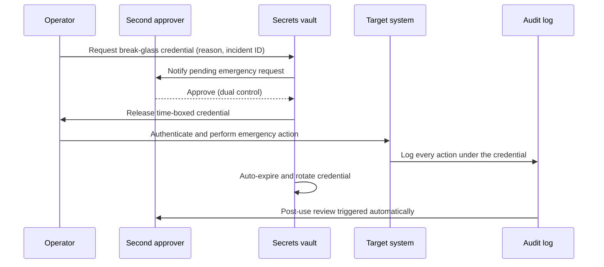
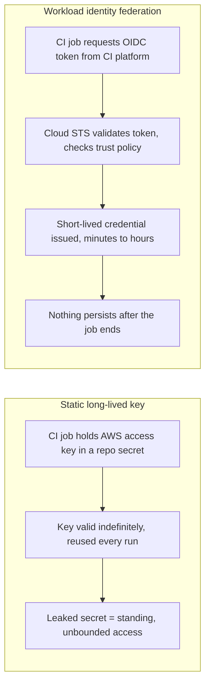
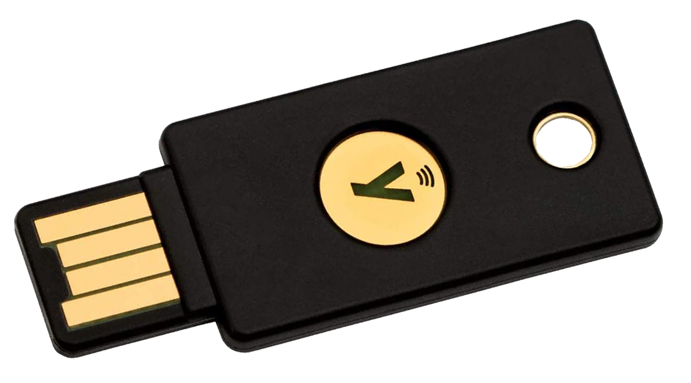
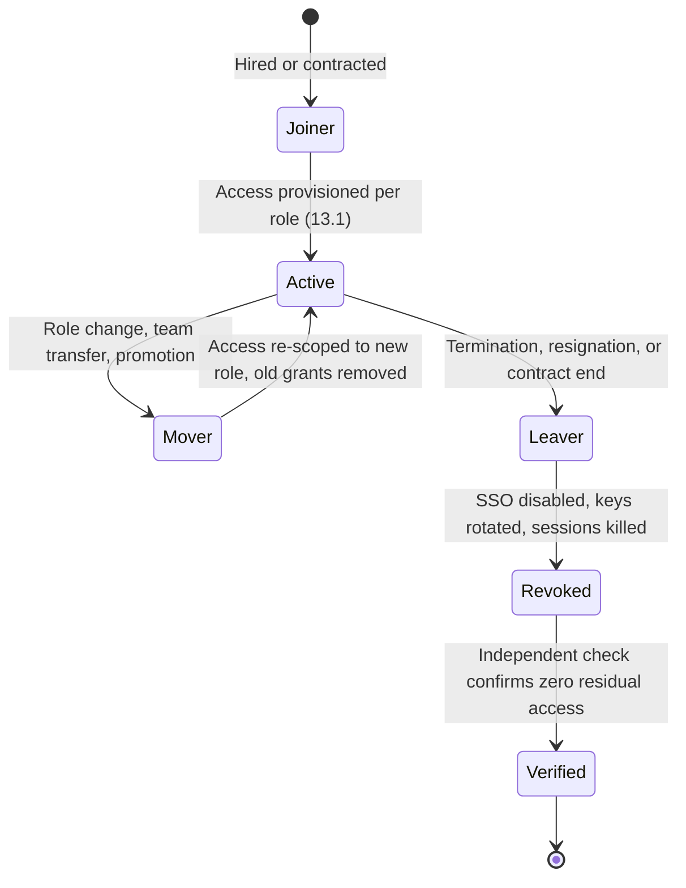

# Part 5: Identity and Access Management

[Back to Handbook contents](index.md) | [Series index](../index.md)

Every control in Parts II through IV, a hardened node, a segmented network, a locked-down DNS registrar, still depends on a single upstream question: who is allowed to touch it, and how do you know it is really them? Identity and access management (IAM) is the layer that answers that question for the infrastructure itself, as distinct from the application-level authentication a dApp's front end offers its end users. This part covers role design, privileged and emergency access, the machine identities that now outnumber human ones on most infrastructure teams, hardware-backed authentication, and the offboarding discipline that keeps yesterday's employee from being today's attacker.

---

## 13. Identity and Access Management for Infrastructure

This chapter works through the five IAM decisions that recur on every infrastructure team: how roles are modeled, how privileged and emergency access is granted without leaving standing risk, how non-human identities are secured, how strong an authenticator must be, and how access is torn down cleanly when it should no longer exist.

### 13.1 Role-Based Access Control (RBAC)

Role-based **access control** (RBAC) assigns permissions to a role tied to a job function, cloud region operator, **RPC** node administrator, DNS record editor, and then assigns humans and services to that role rather than granting permissions to an identity directly. NIST SP 800-53's AC-6 (Least Privilege) control makes the underlying requirement explicit: an organization must employ the principle of least privilege, allowing only the access necessary to accomplish an assigned task, for both user accounts and the processes acting on their behalf ([NIST SP 800-53 r5, AC-6](https://csf.tools/reference/nist-sp-800-53/r5/ac/ac-6/)). RBAC is the standard mechanism for operationalizing that requirement at scale: define the role once, tie its permission set to the narrowest set that job function needs, and every subsequent grant or revoke is a role assignment change rather than a bespoke policy edit.

RBAC alone breaks down when access should depend on conditions that a static role cannot express, an operator can restart archive nodes, but only ones tagged for the network they are certified on, only from a managed device, only with a fresh multi-factor authentication (MFA) assertion. Attribute-based access control (ABAC) extends RBAC by evaluating attributes of the subject, the resource, and the environment against policy at request time rather than encoding every combination as a separate role, and NIST SP 800-162 is the reference definition of the model ([NIST SP 800-162, Guide to ABAC](https://csrc.nist.gov/pubs/sp/800/162/upd2/final)). In practice, mature infrastructure teams combine both: RBAC supplies the coarse role (`archive-rpc-operator`), and ABAC conditions narrow that role's grant to the specific resources and context it should apply to. The policy below extends the tagged `rpc_node_archive_01` resource introduced in Part 1's asset inventory example, granting the operator role only against resources carrying the matching `Purpose` and `Sensitivity` tags, and only when a recent MFA assertion is present.

```json
{
  "Version": "2012-10-17",
  "Statement": [
    {
      "Sid": "ArchiveRpcOperatorScopedAccess",
      "Effect": "Allow",
      "Action": ["ec2:RebootInstances", "ec2:DescribeInstances", "ssm:StartSession"],
      "Resource": "*",
      "Condition": {
        "StringEquals": {
          "aws:ResourceTag/Purpose": "ethereum-archive-rpc",
          "aws:ResourceTag/Sensitivity": "critical"
        },
        "Bool": { "aws:MultiFactorAuthPresent": "true" },
        "NumericLessThan": { "aws:MultiFactorAuthAge": "3600" }
      }
    }
  ]
}
```

| Dimension | RBAC | ABAC |
|---|---|---|
| Grant unit | Role, assigned to a subject | Policy, evaluated against subject/resource/environment attributes |
| Best fit | Stable job functions with a bounded permission set | Context-dependent access (tags, device posture, time, MFA freshness) |
| Audit question | "What role is this identity in?" | "What attributes made this request pass policy?" |
| Common failure | Role explosion (a role per exception) | Attribute sprawl (tags that drift out of date) |
| Web3 infra example | `dns-registrar-admin`, `archive-rpc-operator` | Restrict a role to resources tagged `Sensitivity=critical` only |

Role sprawl is the most common failure in practice: teams start with a handful of clean roles and, under deadline pressure, add one-off exceptions until every account effectively has a unique permission set, which is RBAC in name only. Review role definitions on a fixed cadence (Section 14.2's checklist gives a starting interval) and collapse any role that exists for a single person back into an attribute condition on a shared role wherever possible.

### 13.2 Privileged Access and Break-Glass

Privileged access, the set of grants that can change infrastructure state, alter security controls, or reach signing keys, deserves controls beyond standard RBAC because its abuse or compromise has outsized **blast radius**. The dominant modern pattern is just-in-time (JIT) access: instead of a standing grant that sits active whether or not it is in use, an identity requests a specific privilege for a specific, time-boxed window, and the grant expires automatically. Vendors in this space describe the strongest form of this posture as zero standing privileges (ZSP), no persistent privileged account exists to steal in the first place, because privilege is provisioned on demand and removed the moment the task completes ([CyberArk, what is just-in-time access](https://www.cyberark.com/what-is/just-in-time-access/); [BeyondTrust, guide to JIT PAM](https://www.beyondtrust.com/resources/whitepapers/guide-to-just-in-time-privileged-access-management)). This is the direct infrastructure-layer expression of the continuous-verification principle in NIST's **Zero Trust** Architecture (SP 800-207): no request, privileged or otherwise, is trusted by default on the basis of a prior grant ([NIST SP 800-207](https://nvlpubs.nist.gov/nistpubs/specialpublications/NIST.SP.800-207.pdf)).

JIT access assumes the normal path (an identity provider, a JIT broker, a working network) is available. A break-glass account is the deliberately separate emergency path for when it is not: an identity-provider outage, a lockout during active **incident response**, or a control-plane misconfiguration that needs immediate reversal. A break-glass credential is defined by what it is not: not a routine admin account, not something used for convenience, and not exempt from monitoring. It should be vaulted with restricted, logged access; invoked only under dual control so no single person can exercise it alone; monitored with session recording and immediate post-use review; and rotated or reissued after every use so a stale emergency credential never becomes a standing one ([NHI Management Group, break-glass account glossary](https://nhimg.org/glossary/break-glass-account/)).



*Figure 1. A break-glass request cycle. Dual control gates issuance, the credential is time-boxed and single-use, and rotation plus a mandatory post-use review close the loop so the emergency path never becomes a quiet permanent one.*

Test the break-glass path on a schedule, not only when an incident forces its first real use. An emergency account nobody has exercised since it was created is a hypothesis about how the process will behave under pressure, not a verified control, the same logic Part 1 applied to untested failover providers.

### 13.3 Service Accounts and Machine Identity

Machine identities, service accounts, API tokens, CI/CD runners, and increasingly autonomous agents, now vastly outnumber human accounts on a typical infrastructure estate. CyberArk's 2025 State of Machine Identity Security report, drawn from 2,600 security decision-makers, found non-human identities outnumbering human ones by roughly 82 to 1, with nearly half carrying sensitive or privileged access, and 68% of respondents reporting no identity security controls covering their AI-driven identities at all ([CyberArk, 2025 State of Machine Identity Security Report](https://www.cyberark.com/CyberArk-2025-state-of-machine-identity-security-report.pdf)). Every **RPC** node's monitoring agent, every Terraform CI job, every webhook relay is a credential-bearing identity, and most organizations track a fraction of them as rigorously as they track a human employee's account.

Okta's own October 2023 support-system breach is the reference incident for how service accounts fail in practice, and the root cause was mundane rather than exotic: an employee signed into a personal Google account on a browser also used for work, the browser's saved-credential feature retained a service account's login for Okta's support case system, and that personal account was compromised, exposing the service account. The attacker used it to read support cases for 134 customers over roughly three weeks before detection, including session tokens later used to hijack five customers' own sessions ([Okta Security, root cause of the October 2023 breach](https://sec.okta.com/articles/2023/11/unauthorized-access-oktas-support-case-management-system-root-cause/)). Okta's remediation is the checklist: disable the account, block personal-profile sign-in on managed browsers entirely, add network-location binding so a session used from a new network forces re-authentication, and treat the incident as evidence that a service account with an interactive login path is a service account with a human's **attack surface** attached to it.

The structural fix is to remove long-lived, storable credentials from machine identities wherever the workload's host platform supports it. AWS, GCP, and Azure all support workload identity federation: a CI/CD job authenticates to its own platform's OpenID Connect (OIDC) provider, presents that token to the cloud provider, and receives a short-lived, narrowly scoped credential with nothing to leak once the job ends ([AWS IAM security best practices](https://docs.aws.amazon.com/IAM/latest/UserGuide/best-practices.html); [Latacora, OIDC workload identity on AWS](https://www.latacora.com/blog/2025/11/04/aws-oidc-workload-identity/)).



*Figure 2. A stored static key is a standing liability the moment it is leaked; a federated identity issues a credential that is worthless once the job that requested it finishes.*

```json
{
  "Version": "2012-10-17",
  "Statement": [{
    "Effect": "Allow",
    "Principal": { "Federated": "arn:aws:iam::123456789012:oidc-provider/token.actions.githubusercontent.com" },
    "Action": "sts:AssumeRoleWithWebIdentity",
    "Condition": {
      "StringEquals": { "token.actions.githubusercontent.com:aud": "sts.amazonaws.com" },
      "StringLike": { "token.actions.githubusercontent.com:sub": "repo:org/infra-repo:ref:refs/heads/main" }
    }
  }]
}
```

Where federation is not an option, the fallback discipline still holds: one credential per service, never shared across two workloads; secrets stored in a vault (HashiCorp Vault, AWS Secrets Manager, or equivalent) rather than in configuration files or environment variables checked into a repository; automated rotation on a defined interval; and an inventory (Part 1, Chapter 2) that tracks every service account's owner and purpose with the same rigor applied to human accounts, because an orphaned service account is exactly the unowned-asset finding Part 1 warned about.

### 13.4 Multi-Factor and Hardware-Backed Auth for Infra

Not all multi-factor authentication (MFA) provides the same protection, and the infrastructure control plane is exactly where that difference matters most. NIST SP 800-63B defines three Authenticator Assurance Levels (AAL); AAL3, the level appropriate for infrastructure administrators and anyone with signing-key adjacent access, requires proof of possession of a hardware-based authenticator plus resistance to verifier impersonation, meaning the authenticator itself refuses to complete an authentication ceremony against a phishing site impersonating the real one ([NIST SP 800-63B](https://pages.nist.gov/800-63-4/sp800-63b.html)). SMS one-time codes and time-based one-time password (TOTP) apps satisfy only AAL2 at best, and both remain phishable and, in the SMS case, vulnerable to SIM-swap takeover of the phone number itself.

FIDO2 and its browser-facing WebAuthn API are the practical implementation of AAL3-grade authentication: a hardware security key or platform authenticator holds a **private key** that never leaves the device, and the cryptographic challenge-response is bound to the exact origin requesting it, which is what makes it phishing-resistant where a code typed into any page is not ([FIDO Alliance, FIDO2](https://fidoalliance.org/fido2/); [W3C Web Authentication Level 3](https://www.w3.org/TR/webauthn-3/)). Uber's September 2022 breach is the clearest illustration of why phishable MFA fails under determined pressure: an attacker linked to the Lapsus$ group compromised a contractor's password, then triggered a flood of MFA push notifications for over an hour until the contractor, exhausted and contacted over WhatsApp by someone posing as Uber IT, approved one, handing over VPN and internal Slack access within minutes ([Dark Reading, Uber MFA bombing attack](https://www.darkreading.com/cyberattacks-data-breaches/uber-breach-external-contractor-mfa-bombing-attack)). A push-approval prompt is defeatable by persistence and social pressure; a hardware key bound to the wrong origin simply does not produce a valid assertion, regardless of how many times an attacker asks.


*Figure. A FIDO2 USB security key. The private key is generated on and never leaves this device, and the origin-bound challenge-response is what a push notification or a typed one-time code cannot replicate. Source: [Wikimedia Commons](https://commons.wikimedia.org/wiki/File:FIDO2_USB_token.png), CC BY-SA 4.0.*

| AAL | Authenticator examples | Phishing resistance | Recommended for |
|---|---|---|---|
| AAL1 | Password only | None | Never, for infrastructure access |
| AAL2 | Password + TOTP or SMS code | Low (code is phishable, SIM-swap risk) | Low-sensitivity internal tools only |
| AAL2 (push) | Password + push approval | Moderate (defeatable via MFA fatigue) | Not for privileged infra roles |
| AAL3 | Hardware security key (FIDO2/WebAuthn), platform authenticator with hardware-backed key storage | High (origin-bound, unphishable) | Cloud console root/admin, DNS registrar, node SSH, break-glass |

Enrolling and verifying a hardware authenticator is a routine operational task, not a one-time setup. With a Yubico security key, for example:

```bash
# Confirm the key is FIDO2-capable and check enrolled credential count
ykman fido info

# List discoverable (resident) credentials bound to this key
ykman fido credentials list

# Require a PIN before the key will produce an assertion, so a
# physically stolen key alone is insufficient
ykman fido access change-pin
```

Require AAL3 for every identity in the Critical tier from Part 1's sensitivity classification, cloud root and IAM administrators, DNS registrar accounts, and anyone who can reach a node's SSH or signing surface, and register a second physical key per person as a recovery path so a lost key does not force a break-glass event of its own.

### 13.5 Offboarding and Access Revocation

Access granted is easy to track; access revoked is where most IAM programs quietly fail. NIST SP 800-53's PS-4 (Personnel Termination) control requires an organization to disable system access within an organization-defined time period of a termination, and its supplemental guidance singles out for-cause terminations as needing the fastest possible execution, because the interval between notice and revocation is exactly the window a departing insider can act in ([NIST SP 800-53 r5, PS-4](https://csf.tools/reference/nist-sp-800-53/r5/ps/ps-4/)). The US Cybersecurity and Infrastructure Security Agency frames the same requirement from the insider-risk side: departing personnel, including those leaving on good terms, are a recurring and preventable category of exposure precisely because offboarding is treated as an HR formality rather than a security control ([CISA, insider threat mitigation](https://www.cisa.gov/topics/physical-security/insider-threat-mitigation)).

Coinbase's May 2025 breach shows the offboarding problem extending past direct employees to contracted third parties. Attackers bribed customer-support agents at an outsourced vendor to exfiltrate personal data on roughly 70,000 customers, then demanded a $20 million ransom Coinbase publicly refused to pay; the company's response included terminating the implicated support contracts and, per subsequent litigation, cutting off hundreds of accounts at one vendor facility once the scale of insider collusion became clear ([Coinbase, protecting our customers](https://www.coinbase.com/blog/protecting-our-customers-standing-up-to-extortionists); [CNBC, Coinbase bribed staff breach](https://www.cnbc.com/2025/05/15/coinbase-says-hackers-bribed-staff-to-steal-customer-data-and-are-demanding-20-million-ransom.html)). A vendor's staff churn is not visible to the org that granted them access unless offboarding is wired to that vendor's own personnel changes, not just your own HR system, which is exactly the kind of dependency the Employee Lifecycle Security Handbook (03) treats as first-class.



*Figure 3. The joiner-mover-leaver lifecycle. A Mover event that skips re-scoping (old grants left in place alongside new ones) is as dangerous as a Leaver event that skips revocation.*

Build revocation as an automated, verified workflow rather than a manual checklist alone: disabling the identity provider account should cascade to every downstream system that trusts single sign-on (SSO), but cloud IAM users, SSH keys, API tokens, and any local accounts created outside SSO's reach need their own explicit teardown step. A same-day revocation service-level agreement (SLA) for Critical-tier access (Part 1, Section 2.2), independently verified rather than self-reported by the offboarding system, closes the gap where a departed identity's access is assumed disabled but never confirmed.

**Offboarding checklist (Critical and Sensitive tier assets):**

- [ ] SSO account disabled and all active sessions revoked, not merely the password reset
- [ ] Cloud IAM users and roles tied to the identity removed or reassigned to a named owner
- [ ] SSH keys, API tokens, and any hardware MFA registrations tied to the identity revoked
- [ ] Break-glass and shared-account passwords rotated if the departing identity had knowledge of them
- [ ] Vendor and contractor offboarding triggers the same workflow when a third party's staff changes
- [ ] Independent verification (not the offboarding system's own log) confirms zero residual access within the SLA window
- [ ] Offboarding event recorded against the asset inventory (Part 1, Section 2.4) so ownership records stay current

---

## 14. Integration with IAM Framework

This chapter draws the boundary between the infrastructure-facing controls in Chapter 13 and the organization's broader identity program, so neither is mistaken for covering the other.

### 14.1 Cross-Reference to Dedicated IAM Guidance

Chapter 13 covers IAM as it applies to infrastructure specifically: roles scoped to cloud resources and nodes, break-glass paths into production systems, machine identities, and the hardware authentication and revocation mechanics that protect them. It does not cover the organizational program that decides who should be hired, what their role entitles them to, or how a termination decision gets made in the first place, that is a human-resources and governance process, not an infrastructure control, and it belongs to the [Employee Lifecycle Security Handbook (03)](../03-employee-lifecycle-security/index.md), which owns hiring, onboarding, role-change governance, and termination policy end to end. Treat this part as the technical enforcement layer that a Handbook 03 policy decision triggers: when Handbook 03's process determines someone is leaving, Section 13.5 here is what actually disables their access.

Two further references round out the picture. The [OWASP Access Control Cheat Sheet](https://cheatsheetseries.owasp.org/cheatsheets/Access_Control_Cheat_Sheet.html) and [Authentication Cheat Sheet](https://cheatsheetseries.owasp.org/cheatsheets/Authentication_Cheat_Sheet.html) give application-layer guidance for the identity and access decisions inside a dApp or admin panel's own code, distinct from the infrastructure-layer decisions covered here. The full NIST SP 800-63 Digital Identity Guidelines suite (63A for identity proofing, 63B for authentication referenced in Section 13.4, 63C for federation) is the canonical normative reference if your organization is building or procuring an identity provider rather than only configuring one.

| Topic | Owned by |
|---|---|
| Hiring, onboarding, role-change policy, termination decisions | Employee Lifecycle Security Handbook (03) |
| Cloud/node RBAC, break-glass, service accounts, hardware MFA, technical revocation | This handbook, Part 5 |
| Application-layer access control and authentication inside your own code | OWASP Access Control / Authentication Cheat Sheets |
| Identity provider architecture, identity proofing, federation protocols | NIST SP 800-63 A/B/C |
| DNS registrar and domain-account access specifically | DNS and Hosting Security Handbook (02) |
| Response process once an IAM control fails (compromised admin, leaked key) | Incident Response Handbook (06) |

### 14.2 Infrastructure-Specific IAM Checklist

The consolidated checklist in Part VI folds this section into the handbook's full operational checklist set; the table below is the infrastructure-IAM subset on its own, sized for a standalone quarterly review.

| Control | Verification method | Target cadence |
|---|---|---|
| Every infra role maps to a documented job function, no per-person roles | Export role list, flag any role with exactly one assignee | Quarterly |
| ABAC conditions (resource tags, MFA freshness) attached to Critical-tier role grants | Policy review against Part 1's asset sensitivity tiers | Quarterly |
| No standing privileged grants outside JIT/PAM workflow | Query IAM for permanent admin-equivalent assignments | Monthly |
| Break-glass credential vaulted, dual-control gated, tested | Run a live break-glass drill and confirm auto-rotation fires | Quarterly |
| Service account inventory matches actual credential-bearing identities | Reconcile IaC state and cloud API against Part 1's inventory | Monthly |
| Workload identity federation used wherever the platform supports it | Grep CI/CD configs for static cloud credentials | Quarterly |
| AAL3 (hardware-backed, phishing-resistant) MFA enforced for Critical-tier identities | Pull MFA device type report from identity provider | Quarterly |
| Offboarding SLA met with independent verification, including vendor staff | Sample terminated identities, confirm zero residual access | Monthly |

---

**Key controls for Part 5**

- Model access with RBAC for stable job functions and layer ABAC conditions (resource tags, MFA freshness) on top for context-sensitive grants; review role definitions on a fixed cadence to catch role sprawl.
- Replace standing privileged access with just-in-time grants and zero standing privileges; reserve a vaulted, dual-control, auto-rotating break-glass path for when the normal access path itself is down, and drill it before an incident forces first use.
- Inventory every machine identity with the same rigor as a human account; prefer workload identity federation (OIDC to short-lived cloud credentials) over any stored long-lived key or token.
- Require AAL3 hardware-backed, phishing-resistant authentication (FIDO2/WebAuthn) for every Critical-tier identity; push-approval and SMS/TOTP MFA are defeatable by fatigue attacks and SIM swaps respectively.
- Treat offboarding as an automated, independently verified workflow with a same-day SLA for Critical and Sensitive tiers, extended to vendor and contractor staff changes, not a checklist that runs on trust.

