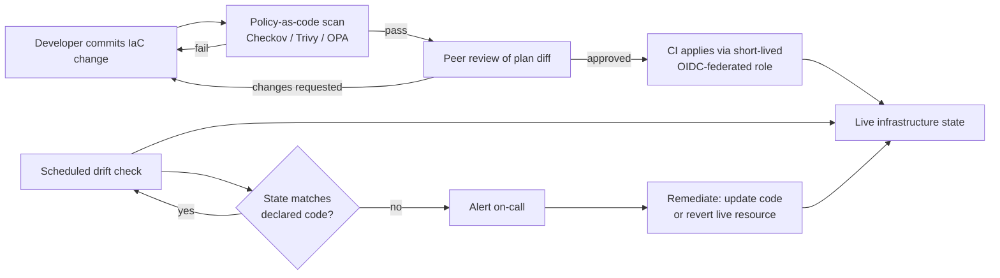
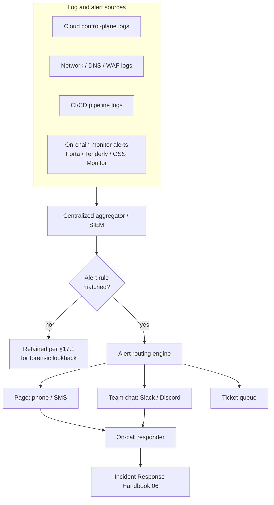

# Part 6: Checklists and Operations

[Back to Handbook contents](index.md) | [Series index](../index.md)

Part 6 turns the domain-by-domain controls spread across Parts II through V into the artifacts a team actually runs day to day: a lifecycle-ordered checklist covering pre-deployment through incident readiness, a hardened **infrastructure as code** (IaC) pipeline, and a monitoring and logging program that spans the cloud layer and the chain itself. Earlier parts explain why a control matters; this part specifies when to apply it, what tool or process enforces it, and what evidence proves it happened. Read the three chapters that follow as the last mile between the standards cited throughout this handbook and a runbook an on-call engineer can execute without guessing.

---

## 15. Node Infrastructure Security Checklist (Consolidated)

This chapter pulls the hardening controls scattered across Part II (node and compute infrastructure), Part III (network and availability), Part IV (DNS and domain security), and Part V (identity and access management) into a single lifecycle: what must already be true before an asset takes production traffic, what must stay true while it runs, and what must be pre-staged before something goes wrong.

### 15.1 Pre-Deployment

A pre-deployment gate exists because "we will fix that after launch" is how every category of control in this handbook quietly never gets applied. The gate is a fixed list of conditions that must already be true, verified with evidence rather than a verbal confirmation, before a **remote procedure call** (**RPC**) node, an archive node, a cloud account, or any supporting service is allowed to receive real user or protocol traffic. This mirrors the discipline behind [CIS Control 4, Secure Configuration of Enterprise Assets and Software](https://www.cisecurity.org/controls/secure-configuration-of-enterprise-assets-and-software), which requires a documented secure baseline applied before, not after, a system joins the fleet. In a Web3 context the gate has to span infrastructure and chain-facing surfaces at once: a node with a hardened operating system (OS) sitting behind an open admin port is still an open node, and a domain with a perfect firewall but no [DNS Security Extensions (DNSSEC)](https://www.cloudflare.com/dns/dnssec/how-dnssec-works/) is still hijackable, as the [Curve Finance DNS hijack of August 2022](https://www.theblock.co/post/354067/curve-finances-front-end-targeted-in-dns-attack-on-website) (Part I, §1.1) showed. Treat every row below as blocking: the asset does not go live, and does not receive a DNS cutover, until every applicable row has evidence attached in the asset inventory record built in Part I, §2.

| Domain | Pre-deployment control | Confirms |
|---|---|---|
| Compute / OS | Hardened baseline image applied, unused services and ports disabled | No default-open attack surface (Part II, §5) |
| Node-specific | RPC/archive admin and debug interfaces bound to a private network only, rate limiting configured | Node cannot be abused as an open relay (Part II, §3) |
| Network | Default-deny security groups and firewall rules, node tier segmented from management tier | No flat network an attacker can pivot across (Part III, §6) |
| Availability | Distributed denial-of-service (DDoS) protection or scrubbing enabled before DNS cutover | Launch traffic spike cannot be weaponized (Part III, §7) |
| DNS | Registrar transfer lock, DNSSEC signed, Certification Authority Authorization (CAA) record set | Domain is not hijackable at launch (Part IV, §9-10) |
| Email | SPF, DKIM, and DMARC published before the domain sends its first message | Domain cannot be spoofed for phishing (Part IV, §11) |
| Identity and access management (IAM) | Least-privilege deploy role, hardware-backed multi-factor authentication (MFA) on every human account, no long-lived static keys | No single stolen credential grants broad access (Part V, §13) |
| Secrets | No plaintext secret in source, IaC state, or environment variables; secret manager wired in | Secrets cannot leak through the deploy path (§16.3) |
| Monitoring | Log shipping and on-chain monitor rules active before the asset takes real traffic | Nothing runs blind, even for hour one (§17) |
| Inventory | Asset registered with owner, purpose, and sensitivity tier | Incident response can find and triage it in seconds (Part I, §2.2) |

### 15.2 Ongoing Operations

Passing the pre-deployment gate proves a point-in-time state, not a durable one. Configurations drift, dependencies age, credentials outlive their need, and a control that was correct on day one silently stops being correct as the system around it changes; that decay is exactly what the reconciliation step in Part I, §2.3 exists to catch at the inventory level, and this checklist applies the same discipline to the running fleet. Patch cadence should be tied to a concrete external signal rather than a vague "regularly": the [CISA Known Exploited Vulnerabilities (KEV) catalog](https://www.cisa.gov/known-exploited-vulnerabilities-catalog), created under [Binding Operational Directive 22-01](https://www.cisa.gov/news-events/directives/bod-22-01-reducing-significant-risk-known-exploited-vulnerabilities) (November 2021), lists vulnerabilities under active exploitation with a mandated remediation deadline for federal agencies; adopting the same catalog as a private patch-priority signal, with a committed internal SLA (for example, 72 hours for a KEV-listed vulnerability on a critical-tier asset), converts "patch when convenient" into a measurable control.

| Activity | Cadence | Owning process |
|---|---|---|
| KEV-listed and critical CVE patching | Within committed SLA of publication (e.g. 72 hours, critical tier) | On-call / platform |
| Credential and API key rotation | 90 days, or immediately on role change | IAM (Part V, §13) |
| Access review (who can reach what) | Quarterly | IAM (Part V, §14) |
| Node client and dependency updates | Monthly, or on upstream security release | Protocol / infra engineering |
| Backup and restore test (not just backup) | Quarterly | SRE |
| DDoS and failover drill | Semiannually | SRE / network |
| Configuration drift check | Continuous (CI-triggered) or daily | Platform (§16.2) |
| Log and alert review for false-negative gaps | Monthly | Security |

The failure mode this checklist exists to prevent is a control that was true once being assumed true forever. A quarterly **access review** that finds zero stale grants three quarters running is worth re-scoping, not skipping; a review that has never been run is a finding in itself.

### 15.3 Incident Readiness

Readiness is what separates a contained incident from a prolonged one, and the record in this handbook is unambiguous about the stakes: the [BadgerDAO front-end compromise of December 2021](https://www.halborn.com/blog/post/explained-the-badgerdao-hack-december-2021) (Part I, §1.1) ran for roughly ten hours before it was fully contained, and in an irreversible-transaction environment, response speed during that window determines the loss far more than the initial vulnerability does. Readiness means the actions a responder needs are written down, rehearsed, and pre-authorized before the incident starts, not improvised during it. A runbook drafted while an attacker is actively draining wallets is a runbook drafted too late.

Pre-stage the following, and validate each with a tabletop exercise at least twice a year:

- **Break-glass access**: a documented, logged, time-boxed emergency access path to the DNS registrar, the cloud root account, and the CDN, usable when the normal on-call path is itself compromised.
- **Pre-authorized emergency actions**: explicit, board- or lead-approved authority for specific responders to pause a contract, rotate a DNS record, revoke an API key, or fail over to a secondary **RPC** provider, without waiting for a synchronous approval chain during the event.
- **Communication tree**: a named, redundant escalation path (not a single Slack channel) covering engineering, legal, communications, and executive leadership, with phone numbers that do not depend on the compromised system to reach.
- **Configuration backups**: an out-of-band, offline copy of DNS zone files, IAM policies, and firewall rules, so recovery does not depend on reading configuration from the very system that may be compromised.
- **Cross-handbook trigger**: a documented handoff point into the [Incident Response Handbook (06)](../06-incident-response/index.md), so the person who first notices an anomaly knows exactly which playbook activates and who owns it from that moment on.

---

## 16. Infrastructure as Code (IaC) Security

Provisioning cloud and node infrastructure through code, rather than console clicks, turns every infrastructure change into something that can be reviewed, tested, and rolled back like application code. It also turns the repository, the pipeline, and the state file into a new, high-value **attack surface** that a purely "click-ops" shop never had to defend.

### 16.1 Secure IaC Practices

Terraform, Pulumi, and AWS CloudFormation share a common risk profile: the code that describes infrastructure carries the same authority as the infrastructure itself, so a compromised pipeline or a careless module reference can provision (or destroy) production resources without ever touching a cloud console. Pin every module and provider to an exact, reviewed version rather than a floating reference; a `terraform init` that silently resolves to a newer, unreviewed module version reintroduces the exact "trust whatever the source currently serves" failure mode covered for CDN content in Handbook 01. Source modules only from a vetted registry or an internal module library, never from an unpinned Git branch.

Grant the CI/CD runner that applies changes the narrowest role that can do its job, and issue that role through short-lived, federated credentials, [OpenID Connect (OIDC) federation into the cloud provider](https://docs.github.com/en/actions/security-for-github-actions/security-hardening-your-deployments/about-security-hardening-with-openid-connect), rather than a long-lived static access key stored as a pipeline secret. Gate every `apply` behind an automated policy-as-code check in addition to human review: [Checkov](https://www.checkov.io/) (Bridgecrew/Prisma Cloud) and [Trivy's IaC scanning](https://trivy.dev/latest/docs/coverage/iac/), which absorbed the [tfsec check library in 2024](https://aquasecurity.github.io/tfsec/latest/), cover Terraform, CloudFormation, and Kubernetes manifests out of the box, while [Open Policy Agent (OPA)](https://www.openpolicyagent.org/) with [Conftest](https://www.conftest.dev/), [HashiCorp Sentinel](https://www.hashicorp.com/sentinel), and [Pulumi CrossGuard](https://www.pulumi.com/docs/using-pulumi/crossguard/) let a team encode organization-specific rules a generic scanner cannot know, such as "no security group may allow ingress from `0.0.0.0/0` on the node's peer-to-peer port."

```bash
# Fail the pipeline on a HIGH or CRITICAL misconfiguration before any apply runs
trivy config --severity HIGH,CRITICAL --exit-code 1 ./infra/

# Same intent, custom organizational policy expressed in Rego for Conftest
conftest test --policy ./policy/no-open-ingress.rego ./infra/plan.json
```

```rego
# policy/no-open-ingress.rego
package main

deny[msg] {
  resource := input.resource_changes[_]
  resource.type == "aws_security_group_rule"
  resource.change.after.cidr_blocks[_] == "0.0.0.0/0"
  resource.change.after.from_port <= 30303
  resource.change.after.to_port >= 30303
  msg := sprintf("security group rule %s opens the node P2P port to the internet", [resource.address])
}
```

### 16.2 Review and Drift Detection

Review catches a bad change before it ships; drift detection catches a change that never went through review at all. Drift is any gap between the infrastructure a team's IaC declares and the infrastructure actually running, and it accumulates from console fixes applied during an incident, a second automation tool touching the same resources, or a manual change nobody backported into the repository. Left undetected, drift means the code in version control, the artifact everyone reviews and audits, stops describing reality, and every subsequent `plan` operates on a false premise.

The stakes of unmanaged configuration inconsistency across a fleet are not hypothetical, even outside Web3. On August 1, 2012, [Knight Capital Group deployed new trading code to seven of eight production servers and left obsolete code active on the eighth](https://en.wikipedia.org/wiki/Knight_Capital_Group); a repurposed order flag that was safe against the new code triggered the dormant legacy function on that one inconsistent server, generating four million erroneous executions across 154 stocks in roughly 45 minutes and a pretax loss of $440 million. No single server was misconfigured in isolation; the fleet was inconsistent with itself, and nothing detected the gap before it was live. Drift detection is the automated version of the consistency check Knight's deployment process lacked, running continuously rather than once at deploy time.

Enforce review with a mandatory pull request gate that attaches the `plan` output (the exact diff an `apply` will make) for human sign-off before merge, never allowing `apply` to run against production from an unreviewed branch. For drift, [driftctl](https://github.com/snyk/driftctl), maintained by Snyk and now in maintenance mode (contributions are no longer actively reviewed, and the maintainers direct users to fork the project for new work), pioneered a purpose-built comparison between live cloud state and Terraform state; Terraform Cloud and Enterprise ship the equivalent as a built-in scheduled health check, and cloud-native inventories such as AWS Config, GCP Cloud Asset Inventory, and Azure Resource Graph (Part I, §2.3) can be queried on the same schedule as a lower-maintenance alternative. Run whichever tool fits on a fixed cadence, alert on any unexplained delta, and require every delta to resolve either by updating the code to match reality or by reverting the live resource, never by silently accepting the gap.



*Figure 1. The IaC review and drift loop. A change only reaches production through the reviewed path on the left; the scheduled loop on the right catches anything that reached production another way.*

### 16.3 Secrets in IaC (What to Avoid)

Two properties make secrets inside IaC uniquely dangerous compared to secrets inside application code: the values are often the highest-privilege credentials an organization holds (cloud root keys, database master passwords, node signing material), and the state file that Terraform and similar tools generate can capture those values in plaintext even when the source code never references them directly, because the state file is a snapshot of every resource attribute, sensitive or not. A `.tfstate` committed to version control, left in an improperly secured storage bucket, or exposed through verbose CI logging is a plaintext credential dump regardless of how carefully the `.tf` source itself was written.

Two real incidents show both ends of this failure. In the [Uber breach disclosed in November 2017](https://www.uber.com/newsroom/2016-data-incident/), attackers obtained access to a third-party cloud storage service holding data for 57 million users and 600,000 US driver's license numbers; the credentials that enabled that access had been left reachable in a private code repository, the same pattern that turns a committed `.tf` file or state snapshot into a breach vector today. In the [Codecov Bash Uploader compromise (January 31 to April 1, 2021)](https://about.codecov.io/apr-2021-post-mortem/), an attacker who obtained one Google Cloud Storage credential modified a widely used CI script to exfiltrate every environment variable, tokens, keys, and credentials among them, from more than 23,000 customers' build pipelines. Neither incident involved Terraform specifically, but both are the exact failure mode this section exists to prevent: a credential that a pipeline had no reason to hold in cleartext, or held for longer than it needed to, was harvested wholesale.

```hcl
# AVOID: literal secret in source, and it also lands in state in cleartext
resource "aws_db_instance" "rpc_index" {
  password = "Sup3rSecretDBPass!"
}

# PREFER: reference a secret manager; the value never appears in .tf source,
# and access to it is independently logged and revocable
data "aws_secretsmanager_secret_version" "db_pass" {
  secret_id = "prod/rpc-index/db-password"
}
resource "aws_db_instance" "rpc_index" {
  password = data.aws_secretsmanager_secret_version.db_pass.secret_string
}
```

Encrypt remote state at rest, restrict its read access as tightly as the secrets it may contain (a state reader can read cleartext secrets even without touching the secret manager directly), and run a secret scanner such as [Gitleaks](https://github.com/gitleaks/gitleaks) or [TruffleHog](https://trufflesecurity.com/trufflehog) in the same CI gate as the policy-as-code checks from §16.1. The [OWASP Top 10 CI/CD Security Risks](https://owasp.org/www-project-top-10-ci-cd-security-risks/) names this pattern directly as CICD-SEC-6, Insufficient Credential Hygiene, and pairs it with CICD-SEC-7, Insecure System Configuration, both of which a pinned, scanned, least-privilege IaC pipeline is built to close.

---

## 17. Monitoring and Logging

A control that is not observed is a control you are hoping works. This chapter covers what to capture, how to watch the chain itself in addition to the infrastructure underneath it, and how to route what is captured to a human fast enough to matter.

### 17.1 What to Log and Retain

Logging strategy for a Web3 project spans two categories that rarely appear in the same framework: conventional infrastructure telemetry, and the on-chain signal covered separately in §17.2. For the infrastructure half, prioritize sources by their value to a hunt or an investigation rather than by how easy they are to collect: cloud control-plane logs (AWS CloudTrail, Azure Activity Log, GCP Audit Logs) record every API call against the account itself; identity and credential events record every authentication, MFA challenge, and privilege change; network flow logs and DNS query logs record what talked to what; and CI/CD pipeline logs, named explicitly as a gap by [OWASP CICD-SEC-10, Insufficient Logging and Visibility](https://owasp.org/www-project-top-10-ci-cd-security-risks/), record who deployed what and when.

[NIST SP 800-92, Guide to Computer Security Log Management](https://doi.org/10.6028/NIST.SP.800-92), sets the baseline architecture: centralize collection, protect log integrity, and size retention to the investigative window an incident realistically needs, not to storage cost convenience. [CIS Control 8, Audit Log Management](https://www.cisecurity.org/controls/audit-log-management), operationalizes the same principle as a named control in the CIS Controls v8.1 framework. For a concrete retention benchmark, [OMB Memorandum M-21-31](https://www.whitehouse.gov/wp-content/uploads/2021/08/M-21-31-Improving-the-Federal-Governments-Investigative-and-Remediation-Capabilities-Related-to-Cybersecurity-Incidents.pdf) (August 2021) assigns US federal agencies a four-tier logging maturity model, EL0 through EL3, and sets a floor of 12 months in active storage plus 18 months in cold storage for its highest-value ("Criticality Level 0") log categories, which include identity and credential management events and DNS query logs. That floor is a useful benchmark to borrow even outside federal compliance scope: align retention length to the sensitivity tier built in Part I, §2.2 rather than applying one blanket window to every log source.

| Log source | Capture | Suggested retention (critical-tier asset) |
|---|---|---|
| Cloud control-plane / API calls | Every action, actor, source IP, timestamp | 12 months active, 18 months cold |
| IAM and credential events | Auth attempts, MFA challenges, privilege changes | 12 months active, 18 months cold |
| DNS query and zone-transfer logs | Query, response, source, zone changes | 12 months active, 18 months cold |
| Network flow / firewall / web application firewall (WAF) | Connections, blocks, rule hits | 90 days active, 1 year cold |
| RPC/node access and error logs | Request rate, error codes, peer connections | 90 days active, 1 year cold |
| CI/CD pipeline logs | Deploy actor, artifact hash, approvals | 90 days active, 1 year cold |
| On-chain monitor alerts (§17.2) | Alert payload, decoded event, response taken | Indefinite (append-only) |

### 17.2 On-Chain Monitoring Objectives (Large Transfers, Ownership, Anomalies)

Infrastructure logging answers "did anything unusual touch our servers and accounts." It cannot answer "did anything unusual happen to our funds," because the chain is a second, independent surface with its own signal that infrastructure telemetry never sees. Watch for large or unusual value transfers against a rolling baseline rather than a single hardcoded threshold; ownership and access-control events, `OwnershipTransferred`, `RoleGranted`, and any call into an admin-only function, which should never fire outside a known, scheduled maintenance window; pause and upgrade events, since a proxy implementation change is functionally a code deployment and deserves the same review evidence as one; and anomaly signals such as oracle price deviation beyond a sane band or gas usage that spikes far outside a contract's historical pattern.

Purpose-built tooling exists for exactly this surface. [Forta](https://www.forta.org) runs a network of detection bots as an on-chain firewall, screening and blocking malicious transactions with a stated recall above 99% and a false-positive rate below 0.0002% by combining static rules with **transaction simulation**. [OpenZeppelin Defender](https://docs.openzeppelin.com/defender/) provided this capability through a hosted platform for several years, but new sign-ups closed on June 30, 2025, and OpenZeppelin is migrating the platform's monitoring functionality to the open-source [OpenZeppelin Monitor](https://github.com/OpenZeppelin/openzeppelin-monitor) and its transaction-relay functionality to [OpenZeppelin Relayer](https://github.com/OpenZeppelin/openzeppelin-relayer), with the hosted service remaining operational through mid-2026 to give teams a migration window. [Tenderly's Alerting and Monitor products](https://www.tenderly.co/alerting) cover the same event classes, decoded transactions, state changes, token transfers, and custom invariants such as health-factor or oracle-deviation thresholds, and route them into Slack, PagerDuty, Discord, and webhooks within seconds of the triggering block.

```javascript
// Illustrative monitor rule (Forta/OpenZeppelin Monitor style): alert on any
// ownership transfer of a critical-tier contract outside the change window
function handleTransaction(txEvent) {
  const transferEvents = txEvent.filterLog(OWNERSHIP_TRANSFERRED_ABI, CRITICAL_CONTRACT_ADDRESS);
  if (transferEvents.length > 0 && !isWithinApprovedChangeWindow()) {
    return Finding.fromObject({
      name: "Unscheduled ownership transfer",
      severity: FindingSeverity.Critical,
      metadata: { contract: CRITICAL_CONTRACT_ADDRESS, newOwner: transferEvents[0].args.newOwner },
    });
  }
}
```

Map monitor coverage directly to the asset inventory's sensitivity tiers from Part I, §2.2: every critical-tier contract's admin functions get an explicit rule, not blanket "monitor everything" coverage that drowns the signal a responder actually needs in noise.

### 17.3 Alert Thresholds and Multiple Channels (Email, SMS, Messaging)

A threshold set too loosely misses the incident; a threshold set too tightly trains the on-call rotation to ignore alerts, which is functionally the same failure by a slower path. Prefer a baseline-relative threshold (alert on a transfer three standard deviations above the asset's 30-day rolling average) over a single static number wherever the underlying activity is naturally variable, and reserve static thresholds for events that should never occur at all, an unscheduled ownership transfer, a debug port opening, an admin login from a new country.

Severity should determine channel redundancy, not just urgency of tone. Email alone is inadequate for anything time-critical: it has no guaranteed delivery latency, no acknowledgment mechanism, and no escalation path if the recipient is asleep or offline. Route Critical and High severity through a paging tool such as PagerDuty or Opsgenie that supports acknowledgment and automatic re-escalation, in parallel with a team-visible channel (Slack, Discord, or Telegram) so the wider team has situational awareness without depending on one person's phone.

| Severity | Primary channel | Response SLA | Escalation if unacknowledged |
|---|---|---|---|
| Critical (funds at risk) | Phone/SMS page + team chat | 5 minutes | Auto-escalate to secondary on-call at 10 minutes, then lead at 20 |
| High (control failure, no confirmed loss) | Page + team chat | 15 minutes | Auto-escalate at 30 minutes |
| Medium (degraded, contained) | Team chat + ticket | 4 hours | Escalate at next business-day standup |
| Low / informational | Ticket / dashboard only | Next business day | None |

### 17.4 Centralized Logging and Alerting

Individually, each log source and each on-chain monitor answers a narrow question. Centralizing them into one queryable store is what lets a responder ask the question that actually matters during an incident: what changed across every layer, cloud, network, DNS, and chain, in the same ten-minute window. A security information and event management (SIEM) platform, or a lighter aggregation stack (Grafana Loki with Prometheus, an OpenSearch or Elastic cluster, or a managed option such as Datadog or Google Security Operations), is the mechanism; the discipline that matters is routing every source into it rather than leaving any one system as an island a responder has to remember to check separately.



*Figure 2. Centralized logging and alerting architecture. Every source, infrastructure and on-chain alike, feeds one aggregator, so triage never depends on a responder remembering which of five dashboards to open first.*

Had the [BadgerDAO](https://www.halborn.com/blog/post/explained-the-badgerdao-hack-december-2021) front-end script injection been correlated automatically against wallet-approval spikes at the moment it started, rather than discovered downstream, the ten-hour exposure window (Part I, §1.1) had material room to shrink. Centralization does not by itself guarantee faster detection, but a fragmented log estate guarantees slower detection, because it requires a human to already suspect where to look before they can confirm anything.

### 17.5 Integration with Incident Response

Monitoring that does not page into a defined process is monitoring that produces evidence after the fact instead of a response during the event. Every alert severity tier from §17.3 should map to a specific playbook entry point in the [Incident Response Handbook (06)](../06-incident-response/index.md), so the person who receives the first page already knows which runbook applies rather than improvising a triage process live. On-call ownership should trace directly back to the named owner field on the asset inventory record (Part I, §2.2 and §2.4): the person paged for an anomaly on a given **RPC** node or contract should be the same person, or team, accountable for that asset's day-to-day operation, not a generic rotation with no context on what the asset does.

After the event, the centralized log store from §17.4 becomes the primary source for timeline reconstruction, which is why retention windows must be set to outlast the realistic detection-to-investigation lag, a log rotated out before a forensic team requests it is equivalent to a log that was never captured. Two operational habits keep this integration real rather than aspirational: freeze retention (suspend any automatic deletion) on logs relevant to an active investigation the moment it opens, and feed every post-incident finding back into §15.1's pre-deployment checklist and §17.2's monitor coverage, so a gap that caused one incident cannot cause an identical one a second time.

---

**Key controls for Part 6**

- Treat the pre-deployment checklist (§15.1) as a hard gate: an asset does not receive production traffic or a DNS cutover until every applicable row has evidence attached in the inventory record.
- Tie ongoing-operations cadences to external signals, not vague schedules: patch KEV-listed vulnerabilities within a committed SLA, rotate credentials on a fixed cycle, and test failover before an outage forces the test.
- Pre-authorize emergency actions (pause, DNS rotation, key revocation) and rehearse them; a runbook written during an active incident is a runbook written too late.
- Pin every IaC module and provider version, gate every `apply` behind policy-as-code and human review, and run scheduled drift detection so the code in version control never silently stops describing reality.
- Never let a secret reach `.tf` source or plaintext state; reference a secret manager, encrypt state at rest, and scan every commit for accidental exposure.
- Centralize infrastructure logs and on-chain monitor alerts into one aggregator, route by severity across multiple channels with real escalation, and wire every alert into the **Incident Response** Handbook (06) so detection converts into action without a manual handoff.

