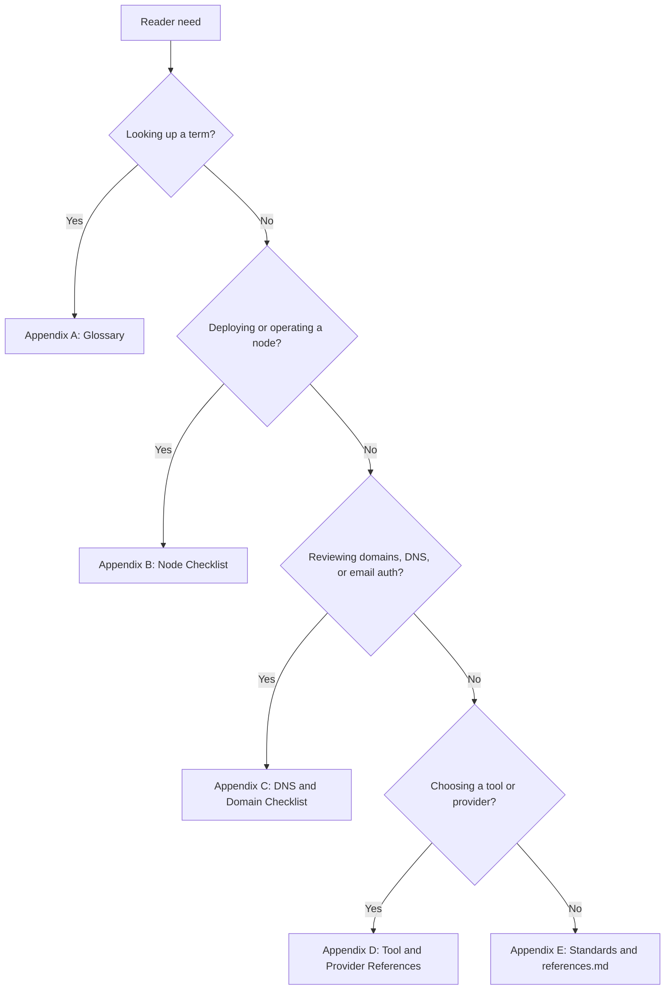
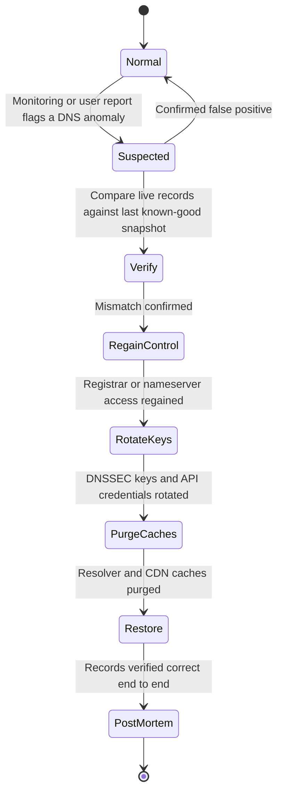

# Part 7: Appendices

[Back to Handbook contents](index.md) | [Series index](../index.md)

This part collects the reference material the rest of the handbook assumes is close at hand. Appendix A fixes the vocabulary so that "drift" or "break-glass" means the same thing whether you read it in the cloud chapter or the identity chapter. Appendix B turns the node guidance from Part II and Part VI into a printable checklist, and Appendix C does the same for the domain and DNS guidance in Part IV, both ready to paste into a runbook without re-deriving them from prose. Appendix D names representative tools and providers by category, and Appendix E anchors the two standards this handbook leans on hardest before pointing to the full bibliography.

*Figure 1. Appendix navigator. A single release or review often touches more than one branch: a validator deployment typically pulls B, then D for the secrets manager, then A for any unfamiliar term.*

---

## 18. Appendix A: Glossary

Entries are grouped by the area of the handbook where they carry the most weight, not strict alphabetical order, because a reader troubleshooting a DNS incident and a reader hardening a validator reach for different clusters of vocabulary. Within each group, entries run alphabetically, acronyms are expanded on first appearance, and the relevant chapter is named so you can jump to the fuller treatment. Where an external standard or a documented incident defines the term, the entry cites that source directly rather than paraphrasing from memory.

### 18.1 Node, Compute, and Cloud Infrastructure Terms

These terms describe the machines and cloud accounts that run a protocol's own infrastructure, covered in Chapters 3 through 5.

- **Archive node**: a full node retaining a chain's complete historical state, not only recent blocks, needed for indexers and any query reaching past the client's default pruning window. See Chapter 3.1.
- **CMDB (Configuration Management Database)**: a system of record listing every managed asset, its owner, and its configuration state, used to keep an asset inventory current. See Chapter 2.3.
- **Configuration drift**: gradual divergence of a running system's actual configuration from its approved, version-controlled baseline, typically from manual out-of-band changes. See Chapter 4.7.3.
- **CSPM (Cloud Security Posture Management)**: automated tooling that continuously evaluates cloud account configuration against a policy baseline and flags deviations, the category [Prowler](https://prowler.com/) belongs to. See Chapter 4.7.
- **IaC (Infrastructure as Code)**: defining infrastructure through versioned, declarative configuration (Terraform, OpenTofu, CloudFormation, Pulumi) instead of manual console changes, so every change is reviewable and reproducible. See Chapter 4.7.1 and Chapter 16.
- **Least privilege**: granting an identity, human or machine, only the permissions its specific task requires, never a broader role "for convenience." See Chapter 4.6 and Chapter 13.
- **Policy as code**: expressing configuration and access rules as machine-evaluable policy, most commonly [Rego](https://www.openpolicyagent.org/docs) for [Open Policy Agent (OPA)](https://www.openpolicyagent.org/docs), so CI rejects a non-compliant change before merge. See Chapter 4.7.2.
- **RPC (Remote Procedure Call) node**: a node exposing an interface, typically JSON-RPC, letting applications query chain state and submit transactions without running their own node; public endpoints are a common single point of trust and **DDoS** target. See Chapter 3.1.
- **Secrets manager**: a dedicated system, a cloud provider's native service or a self-hosted tool such as [OpenBao](https://openbao.org/) (the Linux Foundation-governed Vault fork created after Vault's 2023 move away from an OSI-approved license), that stores, versions, and rotates credentials and validator signing material outside source control. See Chapter 4.5.
- **Shared responsibility model**: the division of duties between a cloud provider, which secures the infrastructure "of" the cloud, and the customer, who secures what is configured "in" it, including identity and data. See Chapter 4.1.
- **Validator infrastructure**: nodes and signing setup participating in a proof-of-stake chain's consensus, distinguished from ordinary nodes by slashable stake and, usually, a hot signing key or remote signer. See Chapter 3.2.

### 18.2 Network, DDoS, and Zero-Trust Terms

These terms describe how traffic is segmented, filtered, and continuously re-verified, the subject of Chapters 6 through 8.

- **Assume breach**: the zero-trust posture that treats an attacker as already present, so every request is authenticated and authorized on its own merits rather than trusted for originating inside a perimeter. Formalized in [NIST SP 800-207](https://csrc.nist.gov/pubs/sp/800/207/final). See Chapter 8.1.
- **DDoS (Distributed Denial of Service)**: overwhelming a target, an **RPC** endpoint, a front end, or an API, with traffic from many sources so legitimate requests cannot get through. See Chapter 7.
- **IDS/IPS (Intrusion Detection System / Intrusion Prevention System)**: network or host monitoring that detects (IDS) or detects and actively blocks (IPS) traffic matching known-malicious or anomalous patterns. See Chapter 6.4.
- **JIT (Just-in-Time) access**: granting elevated or ephemeral credentials only for a task's duration, then auto-revoking them, instead of issuing standing long-lived access. See Chapter 8.6.
- **Micro-segmentation**: subdividing a network into small, individually policed zones so lateral movement from a compromised workload must defeat a fresh set of controls at every boundary. See Chapter 8.3.
- **mTLS (mutual TLS)**: a TLS handshake in which both client and server present certificates, so a service verifies its caller's identity and not only the reverse, commonly enforced by a service mesh. See Chapter 8.4.
- **Rate limiting**: capping requests a client may make in a time window, a first-line mitigation for abusive traffic and organic **DDoS** alike. See Chapter 7.3.
- **Service mesh**: an infrastructure layer, typically a sidecar proxy pattern, handling service-to-service encryption, identity, and policy so individual services do not each reimplement mTLS. See Chapter 8.4.
- **ZTA (Zero Trust Architecture)**: an approach removing implicit trust from network location, authenticating and authorizing every request against policy, defined in [NIST SP 800-207](https://csrc.nist.gov/pubs/sp/800/207/final) (August 2020) with implementation guidance in [NIST SP 1800-35](https://csrc.nist.gov/pubs/sp/1800/35/final) (final, June 2025). See Chapter 8 and Appendix E.1.1.
- **ZTNA (Zero Trust Network Access)**: a product category replacing a traditional VPN with per-application, identity-verified access, commonly used to reach admin panels and node management interfaces without exposing them publicly. See Chapter 8.5.

### 18.3 DNS, Domain, and Email Security Terms

These terms describe the domain and mail layer covered in Chapters 9 through 12, a surface with an unusually direct history of Web3 fund loss.

- **BGP (Border Gateway Protocol) hijacking**: announcing false routes for a network block you do not own, redirecting traffic meant for the legitimate owner. In April 2018, attackers hijacked routes to blocks serving Amazon's Route 53 DNS service for roughly two hours, forging records for myetherwallet.com and running a phishing clone that cost users about $152,000 in ether ([CoinDesk, April 24, 2018](https://www.coindesk.com/markets/2018/04/24/150k-stolen-from-myetherwallet-users-in-dns-server-hijacking)). See Chapter 12.1.
- **CAA (Certification Authority Authorization)**: a DNS record type, defined in [RFC 8659](https://www.rfc-editor.org/rfc/rfc8659), restricting which certificate authorities may issue TLS certificates for a domain. See Chapter 10.2.
- **DKIM (DomainKeys Identified Mail)**: a mechanism, standardized in [RFC 6376](https://www.rfc-editor.org/rfc/rfc6376) (September 2011), attaching a cryptographic signature to outgoing mail headers so a recipient can verify the message and the signing domain's endorsement. See Chapter 11.
- **DMARC (Domain-based Message Authentication, Reporting, and Conformance)**: a policy layer telling receiving mail servers what to do when SPF or DKIM fails and requesting failure reports, originally [RFC 7489](https://www.rfc-editor.org/rfc/rfc7489) (March 2015), now superseded by the three-document specification led by [RFC 9989](https://www.rfc-editor.org/rfc/rfc9989). See Chapter 11.
- **DNS hijacking**: gaining unauthorized control over a domain's resolution, typically through a compromised registrar or nameserver account, and repointing it to attacker infrastructure. On August 9, 2022, attackers compromised Curve Finance's DNS registrar and redirected curve.fi to a cloned front end harvesting token approvals, costing roughly $575,000 while the audited smart contracts were never touched ([rekt.news](https://rekt.news/curve-finance-rekt)). See Chapter 12.1.
- **DNSSEC (Domain Name System Security Extensions)**: IETF extensions, originating in [RFC 4033](https://www.rfc-editor.org/rfc/rfc4033), cryptographically signing DNS zone data so a validating resolver can detect tampered or spoofed responses. See Chapter 10.1.
- **DS (Delegation Signer) record**: a parent-zone record anchoring trust to a child zone's DNSSEC signing key, completing the chain of trust from the root down to your domain. See Chapter 10.1.2.
- **Glue record**: an A or AAAA record held by the parent zone that resolves a nameserver's own hostname when that name sits inside the domain it serves, avoiding a resolution chicken-and-egg problem. See Chapter 9.2.
- **Registrar (registry) lock**: a status blocking changes to a domain's nameservers, contacts, or registrar-of-record without an **out-of-band verification** step, the primary defense against the account-takeover pattern behind the Curve incident. See Chapter 9.1.
- **SPF (Sender Policy Framework)**: a DNS TXT record, defined in [RFC 7208](https://www.rfc-editor.org/rfc/rfc7208) (April 2014), listing which mail servers are authorized to send for a domain. See Chapter 11.
- **SSHFP**: a DNS record type, defined in [RFC 4255](https://www.rfc-editor.org/rfc/rfc4255), publishing an SSH host key fingerprint so a DNSSEC-validating client can verify a server's identity beyond trust-on-first-use. See Chapter 10.3.
- **Zone transfer (AXFR)**: a bulk mechanism for replicating a DNS zone from a primary to a secondary nameserver; left open to arbitrary requesters, it hands an attacker a full map of your subdomains. See Chapter 9.2.

### 18.4 Identity, Access, and Governance Terms

These terms describe who and what can act on infrastructure, and how that authority is granted and withdrawn, covered in Chapters 13 and 14.

- **Break-glass access**: a pre-provisioned, tightly audited emergency access path used when normal access controls are unavailable or too slow for an active incident, exercised rarely and reviewed after every use. See Chapter 13.2.
- **Hardware-backed authentication**: authentication bound to a physical security key or a device's secure enclave (a FIDO2/WebAuthn key, a platform authenticator) so the credential cannot be phished or copied off the device; NIST's [SP 800-63B](https://pages.nist.gov/800-63-3/sp800-63b.html) ranks it as the most phishing-resistant authenticator type. See Chapter 13.4.
- **MFA (Multi-Factor Authentication)**: requiring two or more independent proofs of identity before granting access. See Chapter 13.4.
- **Offboarding**: revoking every credential, key, and session tied to a departing operator or vendor, treated fully in the Employee Lifecycle Security Handbook (03) and cross-referenced here for its infrastructure-specific checklist. See Chapter 13.5 and Chapter 14.2.
- **RBAC (Role-Based Access Control)**: assigning permissions to named roles rather than to individuals directly, so access can be reasoned about, audited, and revoked at the role level. See Chapter 13.1.
- **Service account**: a non-human identity used by an application or pipeline, requiring the same least-privilege scoping and rotation discipline as a human account, with the added risk that its activity is easy to overlook in a human-focused **access review**. See Chapter 13.3.

### 18.5 Monitoring, Logging, and Incident Terms

These terms describe how infrastructure state becomes visibility and, when needed, an alert, the subject of Chapter 17.

- **Alert fatigue**: degradation of an operator's response quality from a high volume of low-value or duplicate alerts, the usual root cause behind a real incident missed inside a noisy channel. See Chapter 17.3.
- **Centralized logging**: aggregating logs from every infrastructure component into one searchable store rather than leaving them scattered across hosts, a precondition for timely correlation during an incident. See Chapter 17.4.
- **MTTD / MTTR (Mean Time to Detect / Mean Time to Respond)**: metrics tracking how long a real issue takes to be noticed and resolved, used to evaluate whether monitoring and alerting are actually working. See Chapter 17.
- **On-chain monitoring**: automated tracking of chain-level events relevant to a protocol's own infrastructure and treasury, such as large transfers or admin-key changes, feeding the same alerting pipeline as infrastructure monitoring. See Chapter 17.2.
- **Retention policy**: a defined period logs and monitoring data are kept before deletion, balancing storage cost against the need to investigate an incident discovered weeks after it began. See Chapter 17.1.
- **SIEM (Security Information and Event Management)**: a platform ingesting logs and events from across an environment, correlating them against detection rules and surfacing alerts. See Chapter 17.4.

---

## 19. Appendix B: Node Infrastructure Security Checklist (Printable)

This appendix is the copy-ready form of the node guidance in Chapter 3 and the consolidated checklist in Chapter 15, organized around the lifecycle a node or validator actually goes through: decisions before it accepts traffic, discipline while it runs, and readiness built before, not during, an incident. Paste each block into a release ticket or runbook rather than reconstructing it from memory under pressure.

### 19.1 Pre-Deployment

Decisions made here are expensive to unwind: network exposure, environment separation, and key custody for validator infrastructure are far easier to get right before the first block is processed than to retrofit onto a running fleet. Treat this stage as a gate, not a formality, tied to the asset inventory from Chapter 2 so every new node is registered before it goes live.

**Node Pre-Deployment Checklist**

- [ ] Node role classified (**RPC**, archive, validator), provisioned from an
      approved, version-controlled base image (Chapter 3.1, 5.1)
- [ ] Network exposure scoped to minimum: public RPC behind a reverse proxy
      and rate limiter, no admin/debug ports internet-reachable (Chapter
      3.1.1, 6.2)
- [ ] Dev, staging, and production nodes separated, no shared credentials
      (Chapter 3.3)
- [ ] Validator signing keys generated and stored in a remote signer or
      HSM-backed secrets manager, never plaintext on the node host
      (Chapter 3.2, 4.5)
- [ ] OS hardening baseline applied (minimal services, no default
      credentials, current patches) before the node joins any network
      (Chapter 5.1, 5.3)
- [ ] Monitoring hooks (peer count, sync status, disk/memory headroom) wired
      up before go-live, not after the first incident (Chapter 3.1.3, 17)
- [ ] Node added to the asset inventory with owner, purpose, and sensitivity
      recorded (Chapter 2.1, 2.2)

### 19.2 Ongoing Operations

A node that passed pre-deployment review can still drift into an unsafe state through routine operation: unpatched updates, expired monitoring, a slashing-relevant misconfiguration. Run this block on a fixed cadence regardless of whether anything appears wrong, because the failures it catches do not announce themselves.

**Node Ongoing Operations Checklist**

- [ ] Client patched on the cadence set by Chapter 5.2, security releases
      applied out-of-band, not on the next scheduled window
- [ ] Client diversity maintained across the validator fleet where the
      network supports it, so one client bug cannot correlate a slashing
      event (Chapter 3.2)
- [ ] Peer count, sync status, and slashing-protection DB health actively
      monitored, thresholds tuned against both silence and alert fatigue
      (Chapter 3.1.3, 17.3)
- [ ] Access reviews confirm only currently authorized operators and
      service accounts retain access; offboarded access already revoked
      (Chapter 13.5, 14.2)
- [ ] Backups and **validator key** recovery material tested by an actual
      restore, not merely confirmed to exist (Chapter 4.4)
- [ ] Configuration checked against the approved baseline for drift;
      unexplained deviations investigated before being reconciled away
      (Chapter 4.7.3)
- [ ] **DDoS** protection and rate limits on public **RPC** endpoints reviewed
      against current traffic patterns (Chapter 7.2, 7.3)

### 19.3 Incident Readiness

Readiness work has no value if invented during the incident it is meant to support. This block operationalizes Chapter 15.3; exercise it through a tabletop or live drill on a schedule set by the **Incident Response** Handbook's (06) process, not for the first time while a validator is being slashed.

**Node Incident Readiness Checklist**

- [ ] Documented runbook exists for the most likely incidents: **RPC** endpoint
      compromise, validator downtime or double-signing risk, loss of quorum
      on a self-hosted fleet
- [ ] Redundant node providers or a self-hosted fallback pre-configured, so
      a single provider outage does not remove chain access (Chapter 1.2)
- [ ] **Key rotation**/revocation procedures for validator signing keys and RPC
      access tokens documented and exercised at least once outside a real
      incident
- [ ] Communication plan names who is notified, in what channel, within
      what time window, once a node incident is confirmed (Chapter 17.5)
- [ ] Forensic snapshot capture (disk image, logs, memory where feasible)
      scripted in advance so evidence is not lost restoring service
- [ ] Post-incident review required, feeding back into the pre-deployment
      and ongoing-operations checklists above

---

## 20. Appendix C: DNS and Domain Security Checklist

Domain and DNS compromise is one of the few infrastructure failures in this handbook with a direct, repeated history of turning into user fund loss without a single line of smart contract code touched. This appendix condenses Chapters 9 through 12 into registrar controls, DNS and certificate controls, email authentication, and a detection and response trigger list you can act on immediately.

### 20.1 Registrar and Domain Controls

The registrar account is the root of trust for everything downstream: whoever controls it can repoint nameservers, and DNSSEC, CAA, and every other control in this appendix become moot the moment that account is taken over. This is exactly the path used against Curve Finance's registrar in August 2022 ([rekt.news](https://rekt.news/curve-finance-rekt)).

**Registrar and Domain Checklist**

- [ ] Registrar (and, where offered, registry) lock enabled on every
      production domain (Chapter 9.1)
- [ ] Registrar account access requires hardware-backed MFA for every
      operator, no shared or generic login (Chapter 9.1, 13.4)
- [ ] Authorized contacts and recovery methods current, reviewed on the
      same cadence as privileged access reviews (Chapter 13.2)
- [ ] Domain auto-renewal enabled, payment method monitored, so a lapsed
      domain cannot be re-registered by an attacker
- [ ] At least two independently operated, geographically diverse
      nameservers configured, with a documented failover path (Chapter 9.3)
- [ ] Nameserver glue records verified correct at the parent zone
      (Chapter 9.2)

### 20.2 DNS Resolution and Certificate Controls

Once the registrar account itself is locked down, the next layer is making DNS answers themselves tamper-evident and constraining who can mint a certificate for your name.

**DNS and Certificate Checklist**

- [ ] DNSSEC enabled on every production zone, DS record published at the
      registrar so the chain of trust reaches the root (Chapter 10.1,
      10.1.2)
- [ ] DNSSEC signing keys follow a documented rotation schedule, not shared
      across unrelated zones (Chapter 10.1.1)
- [ ] CAA records restrict certificate issuance to a named, minimal set of
      CAs (Chapter 10.2)
- [ ] SSHFP records published for any SSH-reachable host where
      DNSSEC-validating clients can use them (Chapter 10.3)
- [ ] Zone transfer (AXFR) restricted to authorized secondaries only, not
      open to arbitrary requesters (Chapter 9.2)
- [ ] Automated monitoring alerts on unauthorized nameserver, DNSSEC, or
      CAA changes, independent of the registrar's own change log
      (Chapter 12.2)

### 20.3 Email Authentication Controls

Email is the notification and account-recovery channel for almost every other control in this handbook, which makes it a target in its own right (Chapter 11.3) and not a secondary concern.

**Email Authentication Checklist**

- [ ] SPF record published with a hard-fail (`-all`), not soft-fail, for
      every mail-sending domain (Chapter 11.1)
- [ ] DKIM signing enabled for all outbound mail, signing keys rotated on
      a defined schedule (Chapter 11.1)
- [ ] DMARC deployed at enforcement (`p=reject`, or `p=quarantine` as a
      documented interim step), not left at `p=none` (Chapter 11.1, 11.2)
- [ ] DMARC aggregate and failure reports routed to a monitored mailbox,
      reviewed on a fixed cadence (Chapter 11.2)
- [ ] Every domain able to send mail, including dormant ones, has at least
      an SPF record and a restrictive DMARC policy against spoofing

### 20.4 Detection and Response Trigger List

Pair the checklist above with a short, memorized set of triggers: what you would see first, and what the first action is, for each of the common DNS and domain attack vectors named in Chapter 12.1.

| Attack Vector | First Signal | Immediate First Action |
|----------------|--------------|--------------------------|
| Registrar account takeover | Login/password-reset alert from an unrecognized location; nameservers changed without a matching ticket | Freeze the account via an out-of-band registrar support channel; verify lock status |
| Nameserver hijack | DNS monitoring alert on a nameserver or record change; user reports of a suspicious front end | Compare current records against the last known-good snapshot; start the recovery sequence in Figure 2 |
| Zone or cache poisoning | Unexpected resolution for a subset of resolvers; SRI or certificate mismatch reports (CDN and Front-End Supply Chain Handbook, 01) | Purge affected resolver and CDN caches; confirm authoritative records at the source |
| Subdomain takeover | Dangling CNAME pointing to a deprovisioned cloud resource, flagged by asset inventory review (Chapter 2.3) | Reclaim or remove the cloud resource; remove the dangling record until reclaimed |
| BGP route hijack | Routing anomaly from a BGP monitoring service; sudden resolver behavior change tied to one network | Notify upstream transit providers and the registrar's DNS operator; largely outside self-remediation |

*Figure 2. DNS hijack detection and recovery sequence. Verify can only be entered from a confirmed anomaly, and every state after RegainControl is forward-only: rotating keys and purging caches before declaring recovery prevents the attacker from re-entering through a credential that was compromised but never rotated.*

---

## 21. Appendix D: Tool and Provider References

The tables below name representative tools and providers by category, not an endorsement of any single vendor. Where a category has both an open-source and a commercial-managed option, both are listed, since that choice is itself the single-versus-multi-provider tradeoff from Chapter 1.2. Verify current licensing before adopting any tool: several projects in this space, most visibly HashiCorp Vault's 2023 move away from an OSI-approved license, have changed terms in ways that matter for a security-critical dependency.

### 21.1 Node, Cloud, and Secrets Tooling

| Category | Representative Tools / Providers | Purpose |
|----------|-----------------------------------|---------|
| Node clients | Geth, Erigon, Nethermind, Besu, Reth (execution); Lighthouse, Prysm, Teku, Nimbus (consensus) | Self-hosted node software; diversity across this list reduces correlated-bug risk (Chapter 3.2) |
| Managed RPC / node infrastructure | Infura, Alchemy, QuickNode, Ankr, Chainstack | Hosted RPC and archive node access without operating the infrastructure |
| Cloud compute | AWS, Google Cloud, Microsoft Azure | Primary compute and storage providers; each publishes its own shared-responsibility documentation (Chapter 4.1) |
| Secrets management | [OpenBao](https://openbao.org/) (Linux Foundation, OSI-licensed Vault fork), HashiCorp Vault, AWS Secrets Manager, Azure Key Vault, Google Secret Manager | Storage, versioning, and rotation of credentials and signing material outside application config (Chapter 4.5) |
| Infrastructure as Code | Terraform, OpenTofu, Pulumi, AWS CloudFormation | Declarative, versioned infrastructure provisioning (Chapter 4.7.1, 16) |
| Policy as code / IaC scanning | [Open Policy Agent](https://www.openpolicyagent.org/docs) (Rego), [Checkov](https://www.checkov.io/), tfsec, Trivy | Pre-merge policy enforcement and misconfiguration scanning (Chapter 4.7.2) |
| CSPM (cloud posture) | [Prowler](https://prowler.com/), native provider posture tools (AWS Security Hub, Microsoft Defender for Cloud) | Continuous scanning of live cloud configuration against a policy baseline (Chapter 4.7) |

### 21.2 Network, DNS, and Monitoring Tooling

| Category | Representative Tools / Providers | Purpose |
|----------|-----------------------------------|---------|
| DDoS mitigation | Cloudflare, AWS Shield, Akamai, Fastly, Google Cloud Armor | Absorbing and filtering volumetric and application-layer DDoS traffic (Chapter 7.2) |
| Zero-trust network access | Cloudflare Access, Tailscale, Teleport, Google BeyondCorp Enterprise | Identity-verified, per-application access replacing a flat VPN (Chapter 8.5) |
| DNS providers and registrars | Cloudflare Registrar, Amazon Route 53, NS1 | Authoritative DNS hosting and domain registration; evaluate registrar lock and MFA support first (Chapter 9.1) |
| DNSSEC and DNS validation | DNSViz, `dig +dnssec`, registrar-native DNSSEC status pages | Verifying DS record publication and chain-of-trust validity (Chapter 10.1.2) |
| Monitoring and metrics | Prometheus with Grafana, Datadog | Node, host, and application-level metrics and dashboards (Chapter 17.4) |
| Centralized logging / SIEM | ELK/OpenSearch stack, Splunk | Log aggregation, correlation, and alert generation (Chapter 17.4) |
| Alerting and on-call | PagerDuty, Opsgenie | Multi-channel alert routing and escalation feeding incident response (Chapter 17.3, 17.5) |

---

## 22. Appendix E: References and Further Reading

### 22.1 Key Standards and Frameworks

Two reference points recur across Parts II, III, and VI of this handbook closely enough to warrant a dedicated summary here rather than sending the reader back to the body text each time.

#### 22.1.1 NIST Zero Trust Architecture (SP 800-207, SP 1800-35)

[NIST SP 800-207](https://csrc.nist.gov/pubs/sp/800/207/final) (August 2020, Rose, Borchert, Mitchell, and Connelly) is the definitional document for **zero trust** architecture (ZTA): "an evolving set of cybersecurity paradigms that move defenses from static, network-based perimeters to focus on users, assets, and resources." It rejects implicit trust based on network location or device ownership and requires every request authenticated and authorized against policy, the assume-breach posture running through Chapter 8. It also defines the logical components (policy engine, policy administrator, policy enforcement point) that ZTNA and service mesh products later implement in concrete form.

[NIST SP 1800-35](https://csrc.nist.gov/pubs/sp/1800/35/final), finalized in June 2025 by NIST's National Cybersecurity Center of Excellence (NCCoE), is the companion practice guide: 19 example ZTA implementations built with 24 commercial technology partners, covering identity governance, micro-segmentation, and secure access service edge approaches, mapped against commonly used security standards. Read SP 800-207 once for the model in Chapter 8.1 through 8.3; use SP 1800-35 when a specific implementation decision needs a documented precedent.

#### 22.1.2 Cloud Security Posture and Policy-as-Code (OPA, Checkov, Prowler)

Configuration and posture management (Chapter 4.7) rests on three tools named repeatedly enough to justify a shared reference. [Open Policy Agent (OPA)](https://www.openpolicyagent.org/docs), a Cloud Native Computing Foundation graduated project since February 2021, decouples policy decisions from the applications that enforce them: a Kubernetes admission controller, a CI pipeline, and an API gateway can all query the same Rego-defined policy instead of each reimplementing its own rule logic. [Checkov](https://www.checkov.io/), built by Bridgecrew and now maintained under Palo Alto Networks' Prisma Cloud, scans Terraform, CloudFormation, Kubernetes manifests, ARM templates, Helm, and AWS CDK for misconfigurations before deployment, the pre-merge scanning step in Chapter 4.7.2. [Prowler](https://prowler.com/), an open-source CSPM platform with over 14,000 GitHub stars and 300-plus contributors, runs continuous checks against live AWS, Azure, Google Cloud, Kubernetes, and several other environments, the runtime complement to Checkov's pre-deployment scan.

Together these three cover the full posture lifecycle named in Chapter 4.7: OPA enforces policy at admission and in CI, Checkov catches misconfiguration in the IaC source before it is applied, and Prowler catches whatever reaches production anyway, including drift introduced outside of IaC entirely (Chapter 4.7.3).

Every other claim in this handbook that names a standard, a version, a date, or an incident is cited inline at the point it is made. Rather than duplicate that source list here, this appendix points to `references.md`, the deduplicated bibliography for the full handbook, grouped into Standards and Frameworks (NIST SP 800-207 and SP 1800-35, the DNS and email RFCs behind DNSSEC, CAA, SPF, DKIM, and DMARC, and the OWASP SCSVS, SCSTG, and SCWE), Incidents and Case Studies (the Curve Finance DNS hijack and the MyEtherWallet BGP hijack among them), Tools (OPA, Checkov, Prowler, and the node, cloud, and secrets tooling named in Appendix D), and Further Reading. If a link anywhere in this handbook goes stale, check `references.md` for an updated URL or an archive copy before assuming the underlying claim no longer holds.

---

**Key controls for Part 7**

- Treat Appendix A as the canonical vocabulary for this handbook; link to it rather than redefining a term inline in a ticket or post-mortem.
- Run the node pre-deployment checklist (19.1) as a gate before any new **RPC**, archive, or validator node accepts traffic.
- Run the ongoing operations (19.2) and incident readiness (19.3) checklists on a fixed cadence, not only in response to a suspected problem.
- Run the registrar, DNS, and email checklists (20.1 through 20.3) before every domain or DNS configuration change, and keep the detection trigger list (20.4) memorized, not merely bookmarked.
- Confirm current licensing before adopting any tool from Appendix D; license terms in this space have changed before and will again.
- Add every new citation to `references.md` in the same change that introduces it (Appendix E.1).
