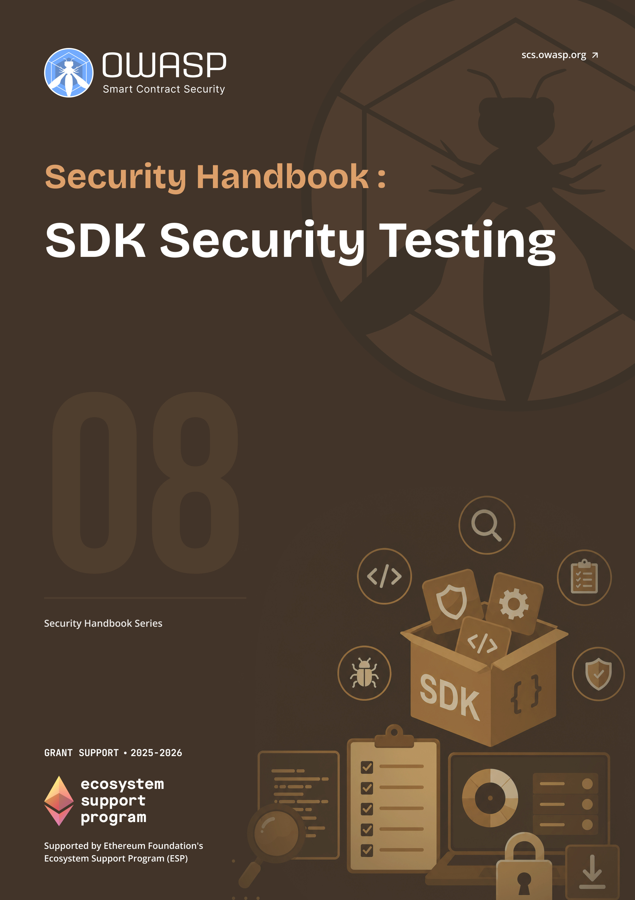

# OWASP SCS SDK Security Testing Handbook

  
  

    <a class="handbook-series-link" href="../">← All handbooks</a>
    
Handbook 08 · 72 PDF pages

    
Evaluate SDK threat models, secure defaults, cryptography, transaction handling, dependencies, and release integrity.

    

      <a href="../pdfs/08-sdk-security-testing.pdf" target="_blank" rel="noopener">Open PDF</a>
      <a href="../pdfs/08-sdk-security-testing.pdf" download>Download PDF</a>
    

  

**OWASP Smart Contract Security Project**

Part of the [OWASP SCS Handbook Series](../index.md). Built to the series [conventions](../index.md#about-the-series).

## Purpose and Scope

This handbook covers testing and security assessment methodology for software development kits (SDKs) used across Web3 and smart contract ecosystems: wallet SDKs, contract-interaction SDKs, front-end SDKs, and mobile SDKs. It aligns with the **software supply chain** standards that govern how these components are built, packaged, and distributed: Supply-chain Levels for Software Artifacts (**SLSA**) v1.2 Build and Source tracks, Software Bill of Materials (SBOM) formats CycloneDX and SPDX, and Sigstore for signed provenance. It draws on OWASP's own supply chain guidance, including Top 10 category A03 Software Supply Chain Failures, and on the dependency-tampering patterns documented across the wider OWASP ecosystem. Threat modeling, test design, and verification steps are aligned with the Smart Contract Security Verification Standard (SCSVS) and the Smart Contract Security Testing Guide (SCSTG).

An **SDK** sits directly between a developer's application code and the wallet, contract, or network it talks to, so a single compromised release can silently redirect signing requests or exfiltrate keys across every downstream application that imports it. The Ledger Connect Kit compromise of December 2023 made this concrete: a phishing attack against a former employee let attackers push a malicious update through the SDK's own CDN-hosted bundle, and dozens of dApps that trusted the package without pinning or verifying it served the malicious code to their users. This handbook treats SDK selection, testing, and ongoing monitoring as a discipline distinct from application-level contract auditing, because the vulnerability class runs someone else's code, built by someone else's pipeline, inside your application's **trust boundary**.

## Target Audience

Developers, security engineers, and QA practitioners responsible for selecting, integrating, or building SDKs used in dApps and smart contract tooling.

## How to Use This Handbook

Read Part I first to establish the **threat model**: the trust boundaries an **SDK** crosses, the actors who can compromise it, and how SLSA frames supply chain risk. Part II is the testing reference, organized by concern (supply chain and dependency testing, API and interface security) and then by SDK type (wallet, contract-interaction, front-end and mobile), each closing with a test-case checklist you can run directly against a candidate SDK. Part III moves from testing to process: wiring these checks into CI/CD, evaluating a third-party SDK before adoption, preparing an SDK for external review, and handling a disclosed vulnerability responsibly. The appendices hold a glossary, a consolidated SDK security testing checklist, and the full bibliography. A team vetting a new wallet SDK before integration can go straight to Chapter 6 and Appendix B.

## Relationship to SCSVS, SCSTG, and SCWE

This handbook applies the SCS standards to a component the standards themselves treat as a black box: code your team did not write but ships inside a **trust boundary** your team owns. SCSVS defines the verification requirements an application must satisfy; the **SDK** test cases and checklists here are how you confirm a third-party dependency does not undermine those requirements before you ship it. SCSTG describes testing methodology for smart contract systems generally; Part II extends that methodology outward to the SDK layer, covering static and dynamic analysis, composition and dependency analysis, and behavioral testing of code outside the audited contract surface. The Smart Contract Weakness Enumeration (SCWE) catalogs weaknesses in contract code; this handbook fills the adjacent gap at the SDK and dependency boundary, where the weakness lives in a package.json entry rather than a Solidity file. The CDN and Front-End Supply Chain Security Handbook (01) shares this handbook's SLSA, SBOM, and Sigstore foundations from the delivery-infrastructure side, and the Incident Response Handbook (06) owns the response process that Chapter 12's responsible disclosure guidance feeds into.

## Contents

### Part I: Foundations
- [1. Introduction to SDK Security](part1-foundations.md#1-introduction-to-sdk-security)
- [2. Threat Model for SDKs](part1-foundations.md#2-threat-model-for-sdks)

### Part II: Testing Methodology
- [3. Testing Framework Overview](part2-testing-methodology.md#3-testing-framework-overview)
- [4. Supply Chain and Dependency Testing](part2-testing-methodology.md#4-supply-chain-and-dependency-testing)
- [5. API and Interface Security](part2-testing-methodology.md#5-api-and-interface-security)
- [6. Wallet and Key-Handling SDKs](part2-testing-methodology.md#6-wallet-and-key-handling-sdks)
- [7. Contract Interaction SDKs](part2-testing-methodology.md#7-contract-interaction-sdks)
- [8. Front-End and Mobile SDKs](part2-testing-methodology.md#8-front-end-and-mobile-sdks)

### Part III: Implementation and Operations
- [9. Integrating SDK Testing into CI/CD](part3-implementation-and-operations.md#9-integrating-sdk-testing-into-cicd)
- [10. Selecting and Evaluating Third-Party SDKs](part3-implementation-and-operations.md#10-selecting-and-evaluating-third-party-sdks)
- [11. Manual Review and External Security Review Preparation](part3-implementation-and-operations.md#11-manual-review-and-external-security-review-preparation)
- [12. Responsible Disclosure for SDK Vulnerabilities](part3-implementation-and-operations.md#12-responsible-disclosure-for-sdk-vulnerabilities)

### Part IV: Appendices
- [13. Appendix A: Glossary](part4-appendices.md#13-appendix-a-glossary)
- [14. Appendix B: SDK Security Testing Checklist](part4-appendices.md#14-appendix-b-sdk-security-testing-checklist)
- [15. Appendix C: References and Further Reading](references.md)
